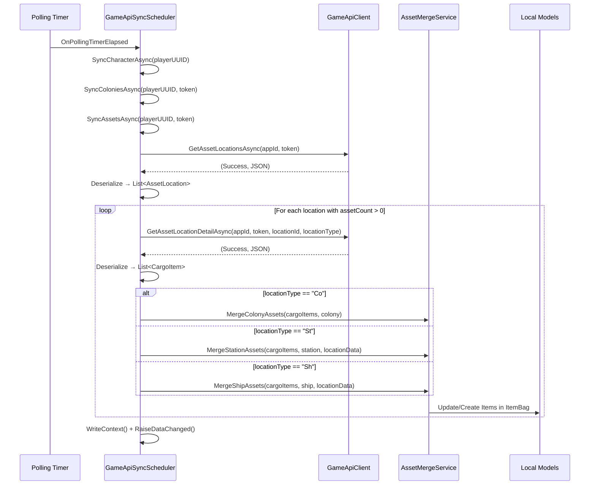

# Design Document: Assets API Integration

## Overview

This feature integrates the game's `/v1/assets/locations` and `/v1/assets/locations/{id}?locationType={type}` API endpoints into the existing sync scheduler. It adds response DTOs, an AssetMergeService for mapping and merging cargo items, and a `SyncAssetsAsync` method on the GameApiSyncScheduler that orchestrates the full asset sync cycle.

The asset sync runs after colony sync in the existing periodic polling loop. It fetches a list of all locations with assets, then iterates through each location to retrieve cargo details. Cargo items are merged into Colony.Items, Station.Holds, or Ship.Cargo depending on the location type.

**Key Design Decisions:**
- **Reuse existing patterns**: The AssetMergeService follows the same static-method pattern as ColonyMergeService (MapTypeC, UpdateExistingItem, CreateNewItem).
- **GameItemId matching**: Asset items are matched by `GameItemId` (the API's `cargoItemId`) rather than Name+ItemType, providing more precise matching than the colony warehouse merge.
- **Additive merge**: Items present locally but absent from the API response are NOT removed (consistent with existing MergeWarehouse behavior).
- **New GameLocationId field**: Station and Ship models gain a `GameLocationId` (int?) field for matching API locations to local entities.
- **Shared TypeC mapping**: The existing MapTypeC logic is extended with new codes (A, Sh, Cr) and moved to a shared static helper that both ColonyMergeService and AssetMergeService can call.

## Architecture




## Components and Interfaces

### 1. Response DTOs (OE2EmpireTracker.Common/Models/GameApiAssetResponse.cs)

New DTO classes for deserializing asset API responses:

- **GameApiAssetLocationsResponse** — wraps the list of asset locations
- **GameApiAssetLocationEntry** — a single location (locationId, locationType, locationName, systemName, systemId, assetCount)
- **GameApiAssetDetailResponse** — wraps the list of cargo items for a location
- **GameApiAssetCargoItem** — a single cargo item (cargoItemId, typeId, amount, resourceName, typeC, mass, volume, properties, etc.)
- **GameApiAssetItemProperty** — a property on a cargo item (modTypeId, propertyName, friendlyPropertyName, propertyValue, unit, evolution)

All DTOs use `[JsonProperty("...")]` attributes consistent with existing patterns.

### 2. AssetMergeService (OE2EmpireTracker.Common/Services/AssetMergeService.cs)

Static service class following the ColonyMergeService pattern:

```csharp
public static class AssetMergeService
{
    // Colony merge — matches by ColonyId, items matched by GameItemId
    public static bool MergeColonyAssets(List<GameApiAssetCargoItem> apiItems, Colony colony);

    // Station merge — matches by GameLocationId, creates station if not found
    public static bool MergeStationAssets(
        List<GameApiAssetCargoItem> apiItems,
        Station station,
        ItemBag targetHold);

    // Ship merge — matches by GameLocationId, creates ship if not found
    public static bool MergeShipAssets(
        List<GameApiAssetCargoItem> apiItems,
        Ship ship);

    // Shared item processing
    internal static bool ProcessSingleAssetItem(GameApiAssetCargoItem apiItem, ItemBag targetBag);
    internal static bool UpdateExistingAssetItem(Item local, GameApiAssetCargoItem apiItem);
    internal static Item CreateAssetItem(GameApiAssetCargoItem apiItem, ItemType.ItemTypeEnum mappedType);

    // TypeC mapping (extended version with A, Sh, Cr codes)
    public static ItemType.ItemTypeEnum MapAssetTypeC(string typeC);

    // Resource purity extraction
    public static (string baseName, string purity) ExtractResourcePurity(string resourceName);
}
```

### 3. GameApiSyncScheduler.SyncAssetsAsync (extension to existing class)

New `internal async Task SyncAssetsAsync(string playerUUID, string accessToken)` method:

- Called after `SyncColoniesAsync` in `SyncCharacterAsync`
- Wrapped in try/catch so asset failures don't affect profile/colony sync results
- Handles 401 (invalidate credentials), 403 (log and skip), malformed JSON (log and skip)
- Skips locations with assetCount == 0
- Logs total locations synced and items processed

### 4. Model Extensions

- **Station.GameLocationId** (int?) — new property for matching API locationId
- **Station.SystemName** (string) — new property for storing system name from asset data
- **Station.SystemId** (int?) — new property for storing system ID from asset data
- **Ship.GameLocationId** (int?) — new property for matching API locationId

### 5. Virtual Override Points (for testability)

New `internal virtual` methods on GameApiSyncScheduler:
- `GetPlayerStations(string playerUUID)` — returns mutable station list
- `GetPlayerShips(string playerUUID)` — returns mutable ship list
- `RaiseAssetDataChanged()` — notifies UI of asset data changes


## Data Models

### GameApiAssetLocationsResponse

```csharp
public class GameApiAssetLocationsResponse
{
    [JsonProperty("locations")]
    public List<GameApiAssetLocationEntry> Locations { get; set; } = new List<GameApiAssetLocationEntry>();
}

public class GameApiAssetLocationEntry
{
    [JsonProperty("locationId")]
    public int LocationId { get; set; }

    [JsonProperty("locationType")]
    public string LocationType { get; set; } = string.Empty;

    [JsonProperty("locationName")]
    public string LocationName { get; set; } = string.Empty;

    [JsonProperty("systemName")]
    public string SystemName { get; set; } = string.Empty;

    [JsonProperty("systemId")]
    public int SystemId { get; set; }

    [JsonProperty("assetCount")]
    public int AssetCount { get; set; }
}
```

### GameApiAssetDetailResponse

```csharp
public class GameApiAssetDetailResponse
{
    [JsonProperty("cargo")]
    public List<GameApiAssetCargoItem> Cargo { get; set; } = new List<GameApiAssetCargoItem>();
}

public class GameApiAssetCargoItem
{
    [JsonProperty("cargoItemId")]
    public int CargoItemId { get; set; }

    [JsonProperty("typeId")]
    public int TypeId { get; set; }

    [JsonProperty("amount")]
    public int Amount { get; set; }

    [JsonProperty("jobRef")]
    public int? JobRef { get; set; }

    [JsonProperty("jobDeliveryLoc")]
    public int? JobDeliveryLoc { get; set; }

    [JsonProperty("healthPercentage")]
    public double? HealthPercentage { get; set; }

    [JsonProperty("lastRepairHealthPercentage")]
    public double? LastRepairHealthPercentage { get; set; }

    [JsonProperty("resourceName")]
    public string ResourceName { get; set; } = string.Empty;

    [JsonProperty("evolution")]
    public int? Evolution { get; set; }

    [JsonProperty("icon")]
    public string Icon { get; set; } = string.Empty;

    [JsonProperty("typeC")]
    public string TypeC { get; set; } = string.Empty;

    [JsonProperty("mass")]
    public double? Mass { get; set; }

    [JsonProperty("volume")]
    public int? Volume { get; set; }

    [JsonProperty("properties")]
    public List<GameApiAssetItemProperty> Properties { get; set; } = new List<GameApiAssetItemProperty>();

    [JsonProperty("jobName")]
    public string JobName { get; set; } = string.Empty;

    [JsonProperty("jobTrack")]
    public string JobTrack { get; set; } = string.Empty;

    [JsonProperty("shipPartType")]
    public string ShipPartType { get; set; } = string.Empty;
}

public class GameApiAssetItemProperty
{
    [JsonProperty("modTypeId")]
    public int ModTypeId { get; set; }

    [JsonProperty("propertyName")]
    public string PropertyName { get; set; } = string.Empty;

    [JsonProperty("friendlyPropertyName")]
    public string FriendlyPropertyName { get; set; } = string.Empty;

    [JsonProperty("propertyValue")]
    public decimal PropertyValue { get; set; }

    [JsonProperty("unit")]
    public string Unit { get; set; } = string.Empty;

    [JsonProperty("evolution")]
    public int Evolution { get; set; }
}
```

### Station Model Extensions

```csharp
// Added to Station.cs
[JsonProperty("gameLocationId")]
public int? GameLocationId { get; set; }

[JsonProperty("systemName")]
public string SystemName { get; set; } = string.Empty;

[JsonProperty("systemId")]
public int? SystemId { get; set; }
```

### Ship Model Extensions

```csharp
// Added to Ship.cs
[JsonProperty("gameLocationId")]
public int? GameLocationId { get; set; }
```

### TypeC Mapping Table (Extended)

| TypeC Code | ItemTypeEnum | Notes |
|-----------|-------------|-------|
| R | Resource | Existing + trailing space handling |
| C | Commodity | Existing + trailing space handling |
| F | Flatpack | Existing + trailing space handling |
| Bp | Blueprint | Existing (case-sensitive) |
| S | ShipPart | Existing + trailing space handling |
| Sc | Survey | Existing |
| W | WorkDetail | Existing + trailing space handling |
| SH | ShipHull | Existing |
| A | Munition | **New** — ammo items |
| Sh | Share | **New** — corporation shares |
| Cr | Crate | **New** — container items (contents inaccessible) |

Note: The existing ColonyMergeService.MapTypeC uses `ToUpperInvariant()` which makes "Bp" → "BP", "Sc" → "SC", "Sh" → "SH". The asset API uses mixed-case codes. The new `MapAssetTypeC` will trim whitespace first, then use case-insensitive matching to handle both the existing colony warehouse codes and the asset API codes.

### Default Hold Name

Station assets are stored in `Station.Holds["default"]`. This is a constant defined in AssetMergeService:

```csharp
public const string DefaultHoldName = "default";
```


## Error Handling

### HTTP Status Code Handling (SyncAssetsAsync)

| Status | Behavior | Logged As |
|--------|----------|-----------|
| 200 | Deserialize and merge | Info (summary at end) |
| 401 | Invalidate credentials, abort entire asset sync cycle | Warn |
| 403 | Log missing scope, skip asset sync cycle (locations endpoint) or skip location (detail endpoint) | Info |
| 404 | Log, skip current location, continue to next | Warn |
| 429 | Handled by GameApiClient rate limiter (transparent) | Warn (internal) |
| 5xx | Handled by Polly retry policy (3 retries with exponential backoff) | Warn (internal) |
| Malformed JSON | Log error, skip location (detail) or abort cycle (locations list) | Error |

### Circuit Breaker

If the GameApiClient circuit breaker opens (3 consecutive transient failures), `BrokenCircuitException` is thrown. SyncAssetsAsync catches this, logs the condition, and aborts the asset sync cycle without modifying local data.

### Error Isolation

- Asset sync failures do NOT affect profile or colony sync results (wrapped in try/catch in SyncCharacterAsync)
- Individual location failures do NOT affect other locations (each location processed in its own try/catch)
- Malformed JSON for a single location skips that location but continues processing others

### Credential Invalidation

On HTTP 401 from either the locations list or any detail endpoint:
1. Log the failure
2. Transition connection monitor to `DisconnectedInvalidKey`
3. Abort the remaining asset sync cycle (no point calling more endpoints with an invalid token)


## Testing Strategy

### Property-Based Tests (FsCheck 2.16.6 + NUnit)

**Property 1: TypeC Mapping Completeness**
- For all known typeC codes (R, C, F, Bp, S, Sc, W, SH, A, Sh, Cr), MapAssetTypeC returns a non-None ItemTypeEnum
- For any string NOT in the known set, MapAssetTypeC returns ItemTypeEnum.None

**Property 2: Resource Purity Extraction Roundtrip**
- For any base resource name and any purity in {High Purity, Med Purity, Low Purity}, constructing `"{name} (Unrefined, {purity})"` and calling ExtractResourcePurity returns the original name and purity

**Property 3: Additive Merge Invariant**
- Given an ItemBag with N items and a list of M API cargo items, after merge the ItemBag has >= N items (items are never removed)

**Property 4: GameItemId Matching Precision**
- Given an ItemBag containing an item with GameItemId=X, and an API cargo item with cargoItemId=X, the merge updates the existing item (does not create a duplicate)

**Property 5: Idempotent Merge**
- Merging the same API response twice produces the same result as merging once (no duplicate items, no field drift)

### Unit Tests (NUnit)

- **AssetMergeService.MapAssetTypeC**: Each known code maps correctly, unknown codes return None, whitespace is trimmed
- **AssetMergeService.ExtractResourcePurity**: Various resource name formats (with purity, without purity, edge cases)
- **AssetMergeService.ProcessSingleAssetItem**: New item creation, existing item update, field-level change detection
- **AssetMergeService.MergeColonyAssets**: Colony matching by ColonyId, skip on no match, change detection
- **AssetMergeService.MergeStationAssets**: Station matching by GameLocationId, new station creation
- **AssetMergeService.MergeShipAssets**: Ship matching by GameLocationId, new ship creation
- **GameApiSyncScheduler.SyncAssetsAsync**: 401 handling, 403 handling, malformed JSON, circuit breaker, skip zero-count locations

### Test Data

Tests use in-memory objects (no file I/O). API responses are constructed as C# objects, not raw JSON strings, to avoid brittle string parsing in tests.


## Implementation Notes

### Integration Point in SyncCharacterAsync

```csharp
// In SyncCharacterAsync, after colony sync:
try
{
    await SyncAssetsAsync(playerUUID, tokenResult.Token.AccessToken).ConfigureAwait(false);
}
catch (Exception assetEx)
{
    Log.Error(assetEx, "Asset sync failed for character {0}, profile/colony sync results preserved", playerUUID);
}
```

### SyncAssetsAsync Flow

```csharp
internal async Task SyncAssetsAsync(string playerUUID, string accessToken)
{
    // 1. Fetch location list
    // 2. Deserialize into List<GameApiAssetLocationEntry>
    // 3. Filter to assetCount > 0
    // 4. For each location:
    //    a. Fetch detail
    //    b. Deserialize into List<GameApiAssetCargoItem>
    //    c. Route to MergeColonyAssets / MergeStationAssets / MergeShipAssets
    // 5. If any changes: WriteContext() + RaiseAssetDataChanged()
    // 6. Log summary
}
```

### Item Matching Strategy (GameItemId)

The asset API provides `cargoItemId` which is a stable server-side identifier for each cargo item. This is more reliable than Name+ItemType matching (used by MergeWarehouse) because:
- Two items can have the same name and type (e.g., two stacks of the same resource at different purities)
- The cargoItemId is unique per item instance

Matching logic:
```csharp
var match = targetBag.Items.Values.FirstOrDefault(i => i.GameItemId == apiItem.CargoItemId);
```

### Resource Purity Extraction

The API returns resource names like `"Heavy Post-Trans Metals (Unrefined, Med Purity)"`. The extraction:
1. Find the last `(` in the string
2. Check if the parenthesized content contains "High Purity", "Med Purity", or "Low Purity"
3. If yes: base name = everything before the `(`, purity = the matched descriptor
4. If no: base name = full string, purity = empty

```csharp
private static readonly Regex PurityRegex = new Regex(
    @"\(.*?(High Purity|Med Purity|Low Purity)\)$",
    RegexOptions.Compiled);
```

### Coexistence with Colony Warehouse Sync

Both the colony warehouse endpoint (`/v1/colonies/{id}/warehouse`) and the asset endpoint (`/v1/assets/locations/{id}?locationType=Co`) can provide colony inventory data. The design:
- Colony sync runs first (existing behavior unchanged)
- Asset sync runs after and uses GameItemId matching
- If an item was already updated by warehouse sync (matched by Name+ItemType), the asset sync will find it by GameItemId and update any remaining fields
- The asset sync is the "primary source" per Req 13.1 — if both provide data for the same colony, the asset sync's GameItemId matching is more precise

### File Organization

| File | Purpose |
|------|---------|
| `OE2EmpireTracker.Common/Models/GameApiAssetResponse.cs` | All asset API DTOs |
| `OE2EmpireTracker.Common/Services/AssetMergeService.cs` | Static merge service |
| `OE2EmpireTracker.Common/Services/GameApiSyncScheduler.cs` | SyncAssetsAsync method (added to existing file) |
| `OE2EmpireTracker.Common/Models/Station.cs` | GameLocationId, SystemName, SystemId fields (added) |
| `OE2EmpireTracker.Common/Models/Ship.cs` | GameLocationId field (added) |
| `OE2EmpireTracker.Tests/Services/AssetMergeServiceTests.cs` | Unit tests |
| `OE2EmpireTracker.Tests/Services/AssetMergeServicePropertyTests.cs` | Property-based tests |
| `OE2EmpireTracker.Tests/Services/GameApiSyncSchedulerAssetTests.cs` | Scheduler asset sync tests |


## Correctness Properties

The following properties must hold for the implementation to be considered correct:

### Property 1: Additive Only

**Validates: Requirements 5.4, 6.5, 7.5, 13.4**

After any asset merge operation, the item count in the target ItemBag is >= the count before the merge. Items are never removed.

### Property 2: GameItemId Uniqueness

**Validates: Requirements 5.3, 6.4, 7.4, 12.1**

After merge, no ItemBag contains two items with the same non-null GameItemId value.

### Property 3: TypeC Totality

**Validates: Requirements 3.1, 3.2, 3.3, 3.4, 3.5, 3.6, 3.7, 3.8, 3.9, 3.10, 3.11, 3.12**

Every non-empty, non-whitespace typeC string maps to exactly one ItemTypeEnum value (either a known mapping or None for unknown codes).

### Property 4: Purity Extraction Consistency

**Validates: Requirements 10.1, 10.2, 10.3, 10.4**

For any resource name containing a recognized purity descriptor, ExtractResourcePurity returns a non-empty purity string AND a base name that is shorter than the original.

### Property 5: Idempotent Merge

**Validates: Requirements 5.3, 5.4, 6.4, 6.5, 7.4, 7.5**

Calling MergeColonyAssets/MergeStationAssets/MergeShipAssets twice with the same input produces the same final state (second call returns false — no changes).

### Property 6: Local Data Preservation

**Validates: Requirements 5.5**

Fields marked as "local-only" (NickName, Description) are never overwritten by the merge, regardless of API input.

### Property 7: Error Isolation

**Validates: Requirements 2.4, 2.5, 2.6**

A failure processing location N does not prevent processing of location N+1 (except for 401 which aborts the cycle).
