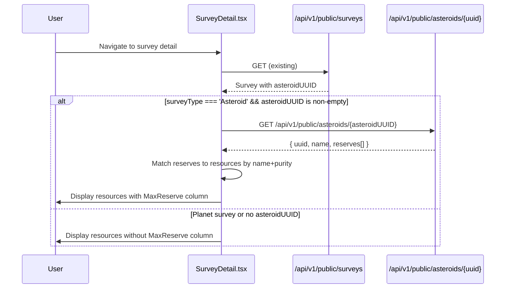

# Design Document: Asteroid Reserves Display

## Overview

This feature adds asteroid max reserve data to the survey detail page in the web UI. When a user views an asteroid survey, the page fetches the linked asteroid's reserve data via a new public endpoint and displays max reserves alongside the survey resources. This gives users immediate visibility into how much of each resource an asteroid can hold, complementing the survey's yield-rate data.

The implementation spans three layers:
1. **Server** — A new public endpoint that returns asteroid data with reserves (stripping private fields)
2. **TypeScript types** — Updated `Asteroid` and `Survey` interfaces to support the new data
3. **UI** — Updated `SurveyDetail.tsx` to fetch and display max reserves

## Architecture



### Key Design Decisions

1. **Public endpoint (no auth)** — Asteroid reserve data is not sensitive. Making it public avoids auth complexity on the survey detail page which already uses public survey data.
2. **Separate fetch** — Rather than embedding reserves in the survey response (which would bloat all survey queries), we fetch asteroid data on-demand only when viewing an asteroid survey.
3. **Graceful degradation** — If the asteroid fetch fails or times out, the page displays normally without reserves. No error message is shown to avoid alarming users over non-critical supplementary data.
4. **Case-insensitive matching** — Resource names may have inconsistent casing between survey data and asteroid reserves. Matching is case-insensitive to handle this.

## Components and Interfaces

### Server: Public Asteroid Detail Endpoint

**Location:** `OE2EmpireTracker.Server/Endpoints/PublicDataEndpoints.cs`

New endpoint added to the existing public endpoint group:

```
GET /api/v1/public/asteroids/{uuid}
```

**Response (200):**
```json
{
  "uuid": "abc-123",
  "name": "Asteroid Alpha",
  "reserves": [
    { "resourceName": "Iron", "purity": "High", "maxReserve": 1250000 },
    { "resourceName": "Copper", "purity": "Medium", "maxReserve": 500000 }
  ]
}
```

**Response (404):**
```json
{ "error": "Asteroid not found" }
```

The endpoint searches all characters' asteroid data (same pattern as `GetPublicAsteroids`) and projects the result to exclude `CurrentReserve` and `ResetTimestamp`.

### Web UI: TypeScript Types

**`src/api/types/domain.ts`** — Update `Asteroid` interface:
```typescript
export interface Asteroid {
  uuid: string;
  name: string;
  systemName: string;
  linkedSurveyUUID?: string;
  reserves: AsteroidReserve[];
}

export interface AsteroidReserve {
  resourceName: string;
  purity: string;
  maxReserve: number;
  currentReserve?: number;
  resetTimestamp?: string;
}
```

**`src/api/types/domain.ts`** — Update `Survey` interface to include optional `asteroidUUID`:
```typescript
export interface Survey {
  // ... existing fields ...
  asteroidUUID?: string;
}
```

### Web UI: Public Asteroid Endpoint Client

**`src/api/endpoints/public.ts`** — Add method:
```typescript
getAsteroidDetail: (uuid: string) =>
  apiClient.get(`api/v1/public/asteroids/${uuid}`).json<Asteroid>(),
```

### Web UI: React Hook

**`src/api/hooks/useAsteroids.ts`** — Add public asteroid detail hook:
```typescript
export function usePublicAsteroidDetail(asteroidUUID?: string | null) {
  return useQuery({
    queryKey: ['public', 'asteroids', asteroidUUID],
    queryFn: () => publicApi.getAsteroidDetail(asteroidUUID!),
    enabled: !!asteroidUUID,
    retry: false,
    staleTime: 5 * 60 * 1000, // 5 minutes — reserve data changes infrequently
  });
}
```

The hook uses `enabled: !!asteroidUUID` so it only fires when a valid UUID is present.

### Web UI: Reserve Matching Logic

**`src/utils/reserveMatching.ts`** — Pure function for matching:
```typescript
export function matchReserveToResource(
  resource: { resourceName: string; purity: string },
  reserves: AsteroidReserve[]
): AsteroidReserve | undefined {
  return reserves.find(
    (r) =>
      r.resourceName.toLowerCase() === resource.resourceName.toLowerCase() &&
      r.purity.toLowerCase() === resource.purity.toLowerCase()
  );
}
```

### Web UI: Formatting

**`src/utils/formatters.ts`** — Add or reuse:
```typescript
export function formatMaxReserve(value: number | undefined | null): string {
  if (value === undefined || value === null) return '-';
  return value.toLocaleString(undefined, {
    maximumFractionDigits: 0,
    useGrouping: true,
  });
}
```

### Web UI: SurveyDetail Page Updates

The `SurveyDetail.tsx` component will:
1. Extract `asteroidUUID` and `surveyType` from the survey data
2. Conditionally call `usePublicAsteroidDetail(asteroidUUID)` when `surveyType === 'Asteroid'` and `asteroidUUID` is non-empty
3. While loading, show a loading indicator in the reserves area
4. On success, match reserves to resources and display a "Max Reserve" column
5. On failure/timeout, display resources without the max reserve column (no error shown)
6. For Planet surveys, hide the max reserve column entirely

## Data Models

### Server-Side (existing, no changes needed)

The `Asteroid` model in `OE2EmpireTracker.Common/Models/Asteroid.cs` already has:
- `UUID`, `Name`, `SystemName`
- `Reserves: List<AsteroidReserve>` with `ResourceName`, `Purity`, `MaxReserve`, `CurrentReserve`, `ResetTimestamp`

The `Survey` model already has:
- `AsteroidUUID` field
- `SurveyType` enum (Planet, Asteroid)

### Client-Side TypeScript

Updated interfaces as described in Components section above. The `AsteroidReserve` interface includes optional `currentReserve` and `resetTimestamp` fields for future private endpoint use, but these will be `undefined` in public responses.

### Response Projection (Server)

The public endpoint projects `Asteroid` → anonymous object:
```csharp
new {
    uuid = asteroid.UUID,
    name = asteroid.Name,
    reserves = asteroid.Reserves.Select(r => new {
        resourceName = r.ResourceName,
        purity = r.Purity,
        maxReserve = r.MaxReserve,
    })
}
```

This ensures `CurrentReserve` and `ResetTimestamp` are never exposed.


## Correctness Properties

*A property is a characteristic or behavior that should hold true across all valid executions of a system — essentially, a formal statement about what the system should do. Properties serve as the bridge between human-readable specifications and machine-verifiable correctness guarantees.*

### Property 1: Public endpoint projection strips private fields

*For any* Asteroid entity with reserves containing `CurrentReserve` and `ResetTimestamp` values, the public endpoint projection SHALL produce a response object that does not contain `currentReserve` or `resetTimestamp` fields in any reserve entry.

**Validates: Requirements 1.3**

### Property 2: AsteroidUUID inclusion in survey response

*For any* survey, the public response SHALL include `asteroidUUID` if and only if `surveyType` is `'Asteroid'` AND the survey's `AsteroidUUID` field is a non-empty string. For all other surveys (Planet type, or Asteroid type with empty/null UUID), the response SHALL omit `asteroidUUID` or return it as undefined.

**Validates: Requirements 2.2, 2.3**

### Property 3: Fetch-enabled logic

*For any* survey object, the asteroid reserve fetch SHALL be enabled if and only if `surveyType === 'Asteroid'` AND `asteroidUUID` is a non-null, non-empty string. For all other combinations, the fetch SHALL not be triggered.

**Validates: Requirements 3.1, 3.5**

### Property 4: Resource-to-reserve matching with case-insensitive comparison

*For any* set of survey resources and asteroid reserves, the matching function SHALL pair a survey resource with an asteroid reserve if and only if their `resourceName` values are equal (case-insensitive) AND their `purity` values are equal (case-insensitive). Unmatched survey resources SHALL have no associated reserve.

**Validates: Requirements 3.3, 3.6, 4.3**

### Property 5: Max reserve formatting

*For any* non-negative integer value, the max reserve formatting function SHALL produce a string containing only digits and thousands separators (no decimal point), and SHALL display zero as "0" (not as a dash). For undefined/null values, it SHALL produce "-".

**Validates: Requirements 4.1, 4.4**

### Property 6: Reserves field defaults to empty array

*For any* server response where the `reserves` field is null, undefined, or omitted, the parsed Asteroid object SHALL have a `reserves` field that is an empty array (`[]`).

**Validates: Requirements 5.1**

## Error Handling

| Scenario | Behavior |
|----------|----------|
| Asteroid UUID not found (404) | Display all resource rows with "-" in max reserve column |
| Asteroid fetch network error | Display resources without max reserve column, no error message |
| Asteroid fetch timeout (>10s) | Same as network error — graceful degradation |
| Survey has no asteroidUUID | Don't fetch, don't show max reserve column |
| Planet survey | Don't fetch, hide max reserve column entirely |
| Reserve with maxReserve = 0 | Display "0" (not a dash) |
| Unmatched resource (no reserve by name+purity) | Display "-" in that row's max reserve cell |

The 10-second timeout is configured via the `ky` client's `timeout` option on the specific request, or via React Query's signal/abort mechanism.

## Testing Strategy

### Property-Based Tests (fast-check + vitest)

Each correctness property maps to a property-based test with minimum 100 iterations:

| Property | Test File | What's Generated |
|----------|-----------|-----------------|
| P1: Projection strips private fields | `src/api/__tests__/asteroidProjection.test.ts` | Random AsteroidReserve objects with all fields |
| P2: AsteroidUUID inclusion | `src/api/__tests__/surveyProjection.test.ts` | Random surveys with varying type/UUID |
| P3: Fetch-enabled logic | `src/hooks/__tests__/usePublicAsteroidDetail.test.ts` | Random survey objects |
| P4: Resource matching | `src/utils/__tests__/reserveMatching.test.ts` | Random resource/reserve arrays with varying case |
| P5: Max reserve formatting | `src/utils/__tests__/formatMaxReserve.test.ts` | Random non-negative integers and null/undefined |
| P6: Reserves defaults | `src/api/__tests__/asteroidParsing.test.ts` | Random responses with null/undefined/valid reserves |

**Configuration:**
- Library: `fast-check` (already installed, v4.8.0)
- Runner: `vitest` (already configured)
- Iterations: 100 per property (via `fc.assert(fc.property(...), { numRuns: 100 })`)
- Tag format: `// Feature: asteroid-reserves-display, Property N: <description>`

### Unit Tests (example-based)

| Scenario | Test File |
|----------|-----------|
| Loading indicator shown during fetch | `src/pages/public/__tests__/SurveyDetail.test.tsx` |
| Fetch failure shows resources without reserves | Same |
| Planet survey hides max reserve column | Same |
| 404 asteroid shows dashes for all rows | Same |
| Zero maxReserve displays as "0" | `src/utils/__tests__/formatMaxReserve.test.ts` |

### Integration Tests (server-side)

| Scenario | Approach |
|----------|----------|
| GET /api/v1/public/asteroids/{uuid} returns correct shape | NUnit test against in-memory server |
| GET with non-existent UUID returns 404 | Same |
| Endpoint accessible without auth token | Same |

### Test Balance

- **Property tests** cover the pure logic (matching, formatting, projection, conditional logic)
- **Unit tests** cover specific UI states and edge cases
- **Integration tests** cover the server endpoint behavior with real HTTP
