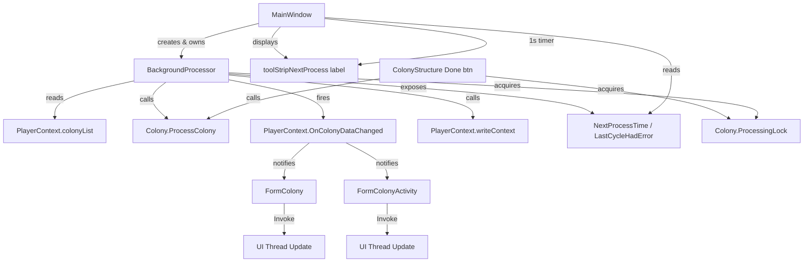

# Design Document: Background Processing

## Overview

This design adds a background processing thread to the OE2EmpireTracker application that automatically processes colony timers without requiring the Colony Form to be open. The `BackgroundProcessor` class runs on a dedicated non-UI thread, scanning `PlayerContext.colonyList` (all colonies across all players) every 60 seconds for expired timers, calling `Colony.ProcessColony()` on affected colonies, firing `ColonyDataChanged` events, and persisting changes via `PlayerContext.writeContext()`.

The processor integrates into the existing architecture by:
- Living in `Baseline/` alongside `Colony.cs` and `PlayerContext.cs`
- Using the existing `PlayerContext` singleton for data access and event firing
- Adding per-colony locking via `Colony.ProcessingLock` to safely coexist with manual Done button clicks
- Adding `Control.Invoke` marshaling to form event handlers for cross-thread UI safety
- Displaying a "Next Process" countdown label in MainWindow's menu strip

## Architecture



The `BackgroundProcessor` is created and started by `MainWindow` during construction. It uses `System.Threading.Timer` for the 60-second tick. Each tick scans all colonies, identifies those with expired timers, acquires per-colony locks, processes them, fires events, and persists once if any work was done.

## Components and Interfaces

### BackgroundProcessor (new class: `Baseline/BackgroundProcessor.cs`)

```csharp
public class BackgroundProcessor : IDisposable
{
    // Configuration
    public const int TickIntervalMs = 60_000;

    // State exposed for UI
    public DateTime NextProcessTime { get; }
    public bool LastCycleHadError { get; }

    // Lifecycle
    public void Start();
    public void Stop();  // blocks until in-progress cycle completes
    public void Dispose();
}
```

Internally uses:
- `System.Threading.Timer` for periodic ticks
- `ManualResetEventSlim` for graceful shutdown signaling
- `object _cycleLock` to prevent overlapping cycles (if a cycle takes >60s)
- NLog logger for all logging

### Colony.ProcessingLock (new property on `Colony`)

```csharp
[JsonIgnore]
public object ProcessingLock { get; } = new object();
```

A per-colony lock object. Both `BackgroundProcessor` and the manual `cmdDone_Click` handler acquire this lock before calling `ProcessColony()`.

### HasExpiredTimers (new method on `Colony`)

```csharp
[JsonIgnore]
public bool HasExpiredTimers()
```

Returns `true` if any structure has:
- `BuildCompletionTime != null && BuildCompletionTime.TimeRemaining <= 0`
- `ProcessCompletionTime != null && (ProcessCompletionTime.IntervalsPassed > 0 || (!ProcessCompletionTime.IsRepeating && ProcessCompletionTime.TimeRemaining <= 0))`

This mirrors the exact expiration logic already used inside `Colony.ProcessColony()`.

### MainWindow Changes

- New `ToolStripLabel toolStripNextProcess` in the menu strip, positioned to the left of `toolStripPlayerLabel`
- New `System.Windows.Forms.Timer timerNextProcess` (1-second interval) to update the countdown display
- Creates `BackgroundProcessor` in constructor, calls `Start()`
- On `FormClosed`, calls `BackgroundProcessor.Stop()` then `Dispose()`

### Form Event Handler Changes (cross-thread safety)

All forms that subscribe to `ColonyDataChanged` (and other PlayerContext events that the background processor may fire from a non-UI thread) must wrap UI updates in `Invoke`:

```csharp
private void OnColonyDataChanged(object sender, ColonyDataChangedEventArgs e)
{
    if (IsDisposed) return;
    if (InvokeRequired)
    {
        try { Invoke(new Action(() => OnColonyDataChanged(sender, e))); }
        catch (ObjectDisposedException) { }
        return;
    }
    // existing UI update logic
}
```

Affected forms: `FormColony`, `FormColonyActivity`, `FormColonyDailyBuild`, and any future form subscribing to PlayerContext events.

## Data Models

### Colony (modified)

New members added to `Colony`:

| Member | Type | Serialized | Description |
|--------|------|------------|-------------|
| `ProcessingLock` | `object` | No (`[JsonIgnore]`) | Per-colony lock for concurrent access safety |
| `HasExpiredTimers()` | `bool` method | N/A | Checks if any structure has an expired timer |

### BackgroundProcessor (new)

Internal state (not serialized):

| Field | Type | Description |
|-------|------|-------------|
| `_timer` | `System.Threading.Timer` | Periodic tick timer |
| `_stopping` | `ManualResetEventSlim` | Signals shutdown request |
| `_cycleLock` | `object` | Prevents overlapping cycles |
| `_playerContext` | `PlayerContext` | Reference to singleton |
| `NextProcessTime` | `DateTime` | When the next cycle will run |
| `LastCycleHadError` | `bool` | Whether the last cycle threw an exception |

### MainWindow (modified)

New members:

| Member | Type | Description |
|--------|------|-------------|
| `_backgroundProcessor` | `BackgroundProcessor` | Owned processor instance |
| `toolStripNextProcess` | `ToolStripLabel` | "Next Process: Xd Yh Zm Ws" display |
| `timerNextProcess` | `System.Windows.Forms.Timer` | 1-second UI refresh timer |


## Correctness Properties

*A property is a characteristic or behavior that should hold true across all valid executions of a system — essentially, a formal statement about what the system should do. Properties serve as the bridge between human-readable specifications and machine-verifiable correctness guarantees.*

### Property 1: HasExpiredTimers predicate correctness

*For any* colony with any number of structures, each having random BuildCompletionTime and ProcessCompletionTime states (null, expired, or active), `HasExpiredTimers()` should return `true` if and only if at least one structure has a `BuildCompletionTime` with `TimeRemaining <= 0` or a `ProcessCompletionTime` with `IntervalsPassed > 0` or a non-repeating `ProcessCompletionTime` with `TimeRemaining <= 0`.

**Validates: Requirements 2.2**

### Property 2: All-player colony scanning

*For any* `colonyList` containing colonies with mixed `OwnerUUID` values and any value of `CurrentPlayerUUID`, the set of colonies identified as needing processing (those with `HasExpiredTimers() == true`) should be identical regardless of which player is currently selected. The scan must consider the full `colonyList`, not a player-filtered subset.

**Validates: Requirements 1.2, 2.1**

### Property 3: Exact-match processing set

*For any* `colonyList` where each colony has a random set of structures with random timer states, the set of colonies on which `ProcessColony()` is called during a processing cycle should equal exactly the set of colonies where `HasExpiredTimers()` returns `true`. If that set is empty, no colonies should be processed.

**Validates: Requirements 2.3, 2.4, 3.1**

### Property 4: Event firing with correct colony UUID

*For any* processing cycle that processes N colonies (N >= 1), `OnColonyDataChanged` should be fired exactly N times, once per processed colony, and each event's `ColonyUUID` should match the UUID of the colony that was just processed.

**Validates: Requirements 3.3**

### Property 5: Conditional persistence — exactly once or zero

*For any* processing cycle, `writeContext()` should be called exactly once if at least one colony was processed, and exactly zero times if no colonies were processed. It should never be called more than once per cycle regardless of how many colonies were processed.

**Validates: Requirements 5.1, 5.2, 5.3**

### Property 6: Error state round-trip

*For any* sequence of processing cycles where some cycles throw exceptions and some succeed, `LastCycleHadError` should be `true` after a cycle that threw an exception and `false` after a cycle that completed without exception.

**Validates: Requirements 8.5, 8.6**

## Error Handling

| Scenario | Handling |
|----------|----------|
| `Colony.ProcessColony()` throws | Log at Error level with colony name/UUID. Set `LastCycleHadError = true`. Continue to next colony in the cycle. Still persist if other colonies were processed successfully. |
| `PlayerContext.writeContext()` throws | Log at Error level. Set `LastCycleHadError = true`. Cycle ends; data remains in memory and will be retried next cycle. |
| Cycle takes longer than 60 seconds | `_cycleLock` prevents overlapping. The next tick waits for the current cycle to finish, then runs immediately. |
| Form disposed during event dispatch | `IsDisposed` check in handler returns early. `Invoke` wrapped in `try/catch (ObjectDisposedException)`. |
| `BackgroundProcessor.Stop()` called during active cycle | `_stopping` signal is set. Current cycle completes naturally. `Stop()` blocks until cycle finishes via `_cycleLock`. |

## Testing Strategy

### Property-Based Tests

Since FsCheck is not available, property tests use regular NUnit `[Test]` methods with explicit randomization via `System.Random` and a loop of at least 100 iterations per test. Each test generates random inputs (colonies, structures, timer states) and asserts the property holds for all generated cases.

Library: NUnit 4.5.1 with manual randomization (no FsCheck).

Each property test must:
- Run a minimum of 100 iterations with random inputs
- Reference its design property via a comment tag
- Use `System.Random` with a fixed seed for reproducibility (seed logged on failure)

Tag format: `// Feature: background-processing, Property {number}: {title}`

Property tests to implement:
1. **Property 1**: Generate random colonies with random timer states → verify `HasExpiredTimers()` matches manual check
2. **Property 2**: Generate colonyList with mixed owners → verify scan results are identical for different `CurrentPlayerUUID` values
3. **Property 3**: Generate colonyList → run processing cycle → verify exactly the right colonies were processed
4. **Property 4**: Generate colonyList with some expired → run cycle → verify event count and UUIDs match
5. **Property 5**: Generate colonyList (some with expired, some without) → run cycle → verify writeContext call count is 0 or 1
6. **Property 6**: Run cycles that alternate between success and failure → verify `LastCycleHadError` state

### Unit Tests (Examples and Edge Cases)

- **Lifecycle**: Start/Stop/Dispose sequence works without exceptions
- **Empty colonyList**: Processing cycle completes with no processing and no persistence
- **All timers active (none expired)**: No colonies processed, no writeContext call
- **Single colony with one expired build timer**: Colony processed, event fired, writeContext called once
- **Multiple colonies across multiple players**: All expired colonies processed regardless of owner
- **Exception in ProcessColony**: Logged at Error, processor continues, LastCycleHadError set
- **Graceful shutdown**: Stop() blocks until in-progress cycle completes
- **Per-colony lock**: Concurrent access to same colony is serialized (threading test)
- **NextProcessTime resets**: After cycle completes, NextProcessTime ≈ now + 60s
