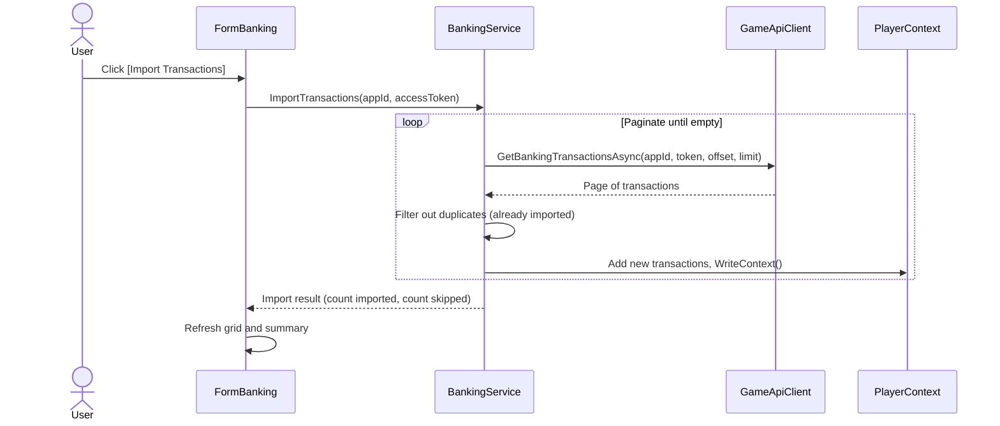
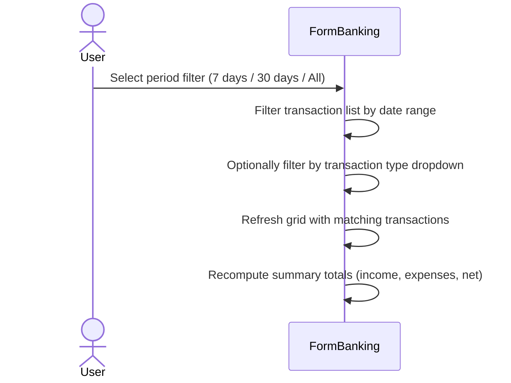
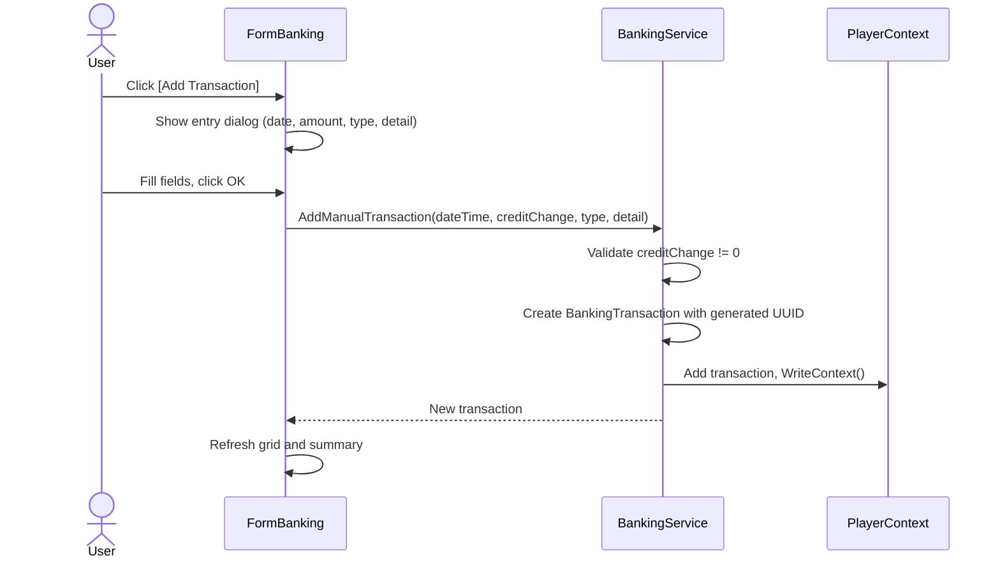

# Requirements Document

## Introduction

Banking transactions track all credit movements in a player's game account — worker wages, market sales/purchases, colony income, refueling costs, and other game-generated debits and credits. The OE2 game API exposes banking data via `/v1/banking/balance` and `/v1/banking/transactions` endpoints. This feature imports, persists, and displays banking transaction history within the Empire Tracker, enabling players to understand their cash flow, filter by transaction type, and compute income/expense summaries over configurable time periods.

## Glossary

- **Banking_Transaction**: A single credit or debit entry in the player's game bank account, containing timestamp, amount, balance snapshot, transaction type, and descriptive detail.
- **Banking_Service**: The service layer responsible for importing, persisting, and querying banking transactions.
- **Banking_Balance**: The player's current bank account balance as reported by the game API.
- **Transaction_Type**: An integer category identifying the nature of a banking transaction (e.g., Worker wages, Market sale, Market purchase, Refueling, Colony income).
- **Credit_Change**: The signed amount of a transaction — positive for income, negative for expenses.
- **PlayerContext**: The singleton service that manages player data persistence and in-memory collections.
- **FormBanking**: The MDI child form that displays banking transactions and summaries.
- **Game_API**: The Outer Empires 2 public REST API that provides banking data via OAuth2 scopes.

## Requirements

### Requirement 1: Banking Transaction Data Model

**User Story:** As a player, I want banking transactions stored locally, so that I can view and analyze my financial history without repeated API calls.

#### Acceptance Criteria

1. THE Banking_Transaction SHALL have fields: UUID (string), OwnerUUID (string), TransactionDateTime (string, ISO 8601 format as received from the game API), CreditChange (decimal), OldBalance (decimal), NewBalance (decimal), TransactionType (int), Detail (string), CharacterId (int?), SystemObjectId (int?), and SystemId (int?).
2. THE Banking_Transaction SHALL use decimal type for CreditChange, OldBalance, and NewBalance to preserve precision, with default values of 0m.
3. THE Banking_Transaction SHALL use nullable int for CharacterId, SystemObjectId, and SystemId to match the game API schema, defaulting to null when the field is absent from the API response.
4. THE Banking_Transaction SHALL use string type for Detail to store the transaction description from the game, defaulting to string.Empty when no description is provided.
5. THE Banking_Transaction SHALL use int type for TransactionType to store the game API's integer category code, with a default value of 0.
6. THE Banking_Transaction SHALL use string type for UUID and OwnerUUID, consistent with the project-wide convention for UUID fields, with OwnerUUID defaulting to string.Empty.

### Requirement 2: Banking Transaction Persistence

**User Story:** As a player, I want my banking transactions saved to my player data file, so that they survive application restarts.

#### Acceptance Criteria

1. THE PlayerContext SHALL persist Banking_Transaction records in the player data JSON file as a "BankingTransaction" array within the PlayerRoot object.
2. THE PlayerContext SHALL expose a BankingTransactionList property typed as IReadOnlyList<Banking_Transaction> for read access.
3. WHEN the player data file is loaded during initialization, THE PlayerContext SHALL deduplicate Banking_Transaction records by UUID, retaining the first occurrence and logging an error for each discarded duplicate.
4. WHEN a new Banking_Transaction is added and its UUID already exists in the in-memory list, THEN THE PlayerContext SHALL throw an InvalidOperationException indicating the duplicate UUID.
5. WHEN a new Banking_Transaction is added with a unique UUID, THE PlayerContext SHALL append it to the in-memory list and persist via WriteContext.

### Requirement 3: Banking Transaction Import from Game API

**User Story:** As a player, I want to import my banking transactions from the game API, so that I have a complete local history.

#### Acceptance Criteria

1. WHEN the player triggers an import, THE Banking_Service SHALL call the game API's `/v1/banking/transactions` endpoint with pagination starting at offset 0 and a page size of 100 records per request.
2. THE Banking_Service SHALL paginate through all available transactions until a page returns fewer records than the requested page size (indicating no more data is available).
3. THE Banking_Service SHALL skip transactions that already exist locally (matched by TransactionDateTime + CreditChange + Detail combination as a composite key, since the API does not provide unique IDs).
4. WHEN the game API returns an error (401, 403, or network failure), THE Banking_Service SHALL log the error, retain all transactions successfully imported from prior pages, and return a result to the caller indicating failure with the number of pages successfully imported and the number of transactions stored before the failure.
5. THE Banking_Service SHALL map the game API response fields to the local Banking_Transaction model: transactionDT → TransactionDateTime, creditChange → CreditChange, oldBalance → OldBalance, newBalance → NewBalance, transactionType → TransactionType, detail → Detail, characterId → CharacterId, systemObjectId → SystemObjectId, systemId → SystemId.
6. THE Banking_Service SHALL generate a new UUID for each imported Banking_Transaction that passes deduplication, using the same UUID generation approach as other locally-created entities.
7. WHEN an import completes successfully, THE Banking_Service SHALL return a result to the caller indicating the total number of transactions imported and the total number of duplicates skipped.

### Requirement 4: Banking Balance Import

**User Story:** As a player, I want to see my current bank balance, so that I know my available credits at a glance.

#### Acceptance Criteria

1. WHEN the player triggers a balance refresh, THE Banking_Service SHALL call the game API's `/v1/banking/balance` endpoint with a request timeout of 30 seconds.
2. WHEN the balance endpoint returns a successful response, THE Banking_Service SHALL store the retrieved balance as a decimal value on the PlayerContext banking state and persist it via WriteContext so that the balance is available on next application launch without requiring an API call.
3. IF the balance endpoint returns an error (network failure, HTTP 4xx, or HTTP 5xx), THEN THE Banking_Service SHALL log the error at Error level and retain the last persisted balance value (or zero if no balance has ever been stored).
4. WHEN the Banking_Service stores a new balance value, THE PlayerContext SHALL expose the current balance via a read-only BankingBalance property of type decimal.

### Requirement 5: Banking Transaction Display

**User Story:** As a player, I want to view my banking transactions in a sortable, filterable grid, so that I can find specific transactions and understand my spending patterns.

#### Acceptance Criteria

1. THE FormBanking SHALL be an MDI child form accessible from the main menu.
2. THE FormBanking SHALL display a DataGridView with columns: Date (formatted as "yyyy-MM-dd HH:mm" in local time), Type (human-readable label from the transaction type mapping), Detail, Credit Change (formatted to 2 decimal places), Old Balance (formatted to 2 decimal places), New Balance (formatted to 2 decimal places).
3. THE FormBanking SHALL display the current bank balance in a label positioned above the grid, formatted to 2 decimal places with a "Balance:" prefix.
4. WHEN transactions exist, THE FormBanking SHALL display them sorted by TransactionDateTime descending (newest first).
5. THE FormBanking SHALL allow filtering by transaction type via a dropdown that lists all known transaction type labels plus an "All" option, with "All" selected by default.
6. THE FormBanking SHALL allow filtering by date range via date picker controls (From/To) that are unchecked by default (meaning no date constraint is applied until the user checks and sets a value).
7. WHEN the user applies filters, THE FormBanking SHALL combine the transaction type filter and date range filter using AND logic, displaying only transactions that satisfy all active filter conditions.
8. WHEN no transactions exist, THE FormBanking SHALL display an empty grid with column headers visible.
9. WHEN the user changes a filter value (type dropdown selection or date picker check/value), THE FormBanking SHALL refresh the grid to reflect the updated filter criteria within 500 milliseconds for up to 10,000 transactions.

### Requirement 6: Banking Transaction Summary

**User Story:** As a player, I want to see income and expense totals over configurable periods, so that I can assess my empire's financial health.

#### Acceptance Criteria

1. THE FormBanking SHALL display a summary panel showing Total Income, Total Expenses, and Net Change for the currently filtered transaction set, each formatted as a decimal value with two decimal places.
2. THE FormBanking SHALL provide period filter buttons: Last 24 Hours, Last 7 Days, Last 30 Days, All Time, with "All Time" selected by default when the form opens.
3. WHEN a period filter is selected, THE FormBanking SHALL set the date range to [SystemClock.UtcNow minus the selected duration, SystemClock.UtcNow], clear any manually entered date picker values from the From/To controls, and update both the transaction grid and the summary totals to reflect only transactions within that period.
4. THE Banking_Service SHALL compute Total Income as the sum of all positive CreditChange values in the filtered set.
5. THE Banking_Service SHALL compute Total Expenses as the sum of all negative CreditChange values in the filtered set (displayed as a positive number).
6. THE Banking_Service SHALL compute Net Change as Total Income minus Total Expenses.
7. IF the filtered transaction set is empty, THEN THE FormBanking SHALL display 0.00 for Total Income, Total Expenses, and Net Change.

### Requirement 7: Transaction Type Classification

**User Story:** As a player, I want transaction types displayed as readable labels, so that I can quickly identify what each transaction represents.

#### Acceptance Criteria

1. THE Banking_Service SHALL maintain a mapping from integer TransactionType codes to human-readable labels (e.g., "Worker Wages", "Market Sale", "Refueling") in a static dictionary within the Constants folder.
2. WHEN a TransactionType code has no known mapping, THE FormBanking SHALL display the type as the Detail field value followed by the numeric code in parentheses (format: "{Detail} ({code})").
3. IF a TransactionType code has no known mapping AND the Detail field is null or empty, THEN THE FormBanking SHALL display the type as "Unknown ({code})" where {code} is the integer TransactionType value.
4. THE FormBanking type filter dropdown SHALL list all known transaction type labels in alphabetical order, with an "All" option as the first entry and selected by default.
5. WHEN the type filter dropdown selection changes to a specific transaction type label, THE FormBanking SHALL display only transactions matching that TransactionType code in the grid.

### Requirement 8: Manual Transaction Entry

**User Story:** As a player, I want to manually record banking transactions, so that I can track transactions from before I started using the tracker or from periods when the API was unavailable.

#### Acceptance Criteria

1. THE FormBanking SHALL provide an "Add Transaction" button that opens a modal entry dialog.
2. THE entry dialog SHALL accept: Date/Time (defaulting to current UTC time, not allowing future dates), Credit Change amount (decimal, range -999,999,999.99 to 999,999,999.99, excluding zero), Transaction Type (dropdown populated from the known transaction type mappings), and Detail (free text, maximum 500 characters).
3. WHEN the user confirms the entry, THE Banking_Service SHALL create a new Banking_Transaction with a generated UUID, the provided values, OldBalance and NewBalance set to zero, and a flag or marker indicating the transaction was manually entered (distinguishing it from API-imported transactions for audit purposes).
4. IF the user enters a zero Credit Change amount, THEN THE entry dialog SHALL display a validation error indicating the amount must be non-zero and prevent submission.
5. IF the user enters an empty Detail field, THEN THE entry dialog SHALL display a validation error indicating that Detail is required and prevent submission.
6. WHEN the user cancels or closes the entry dialog, THE Banking_Service SHALL not create any transaction and the grid SHALL remain unchanged.

### Requirement 9: Empty and Error States

**User Story:** As a player, I want clear feedback when data is unavailable or operations fail, so that I understand the system state.

#### Acceptance Criteria

1. WHEN no banking transactions exist, THE FormBanking SHALL display the empty grid with column headers visible and the summary panel showing Total Income as 0, Total Expenses as 0, and Net Change as 0.
2. WHEN an import operation fails partway through pagination, THE Banking_Service SHALL retain all successfully imported transactions from prior pages and return an import result to the caller indicating the number of pages successfully imported, the number of transactions added, and a failure indicator with the page number where the error occurred.
3. IF the player data file contains Banking_Transaction records with missing or null TransactionDateTime, THEN THE Banking_Service SHALL assign a sort value of epoch (1970-01-01 00:00:00 UTC) for ordering purposes.
4. IF a Banking_Transaction has a missing or null TransactionDateTime, THEN THE FormBanking SHALL display "(no date)" in the Date column for that row.

## Out of Scope

- Real-time push notifications of new banking transactions
- Automatic scheduled imports (manual trigger only for initial release)
- Integration with the Operating Cost Calculator (BL-139) — that feature will consume banking data once both are implemented
- Multi-character banking aggregation (each player profile tracks its own transactions)
- Transaction editing or deletion (imported records are immutable; manual entries can be added but not modified)
- Currency conversion or multi-currency support (all values are in-game credits)

## User Interaction Flows

### Import Banking Transactions

### Filter Transactions

### Add Manual Transaction

