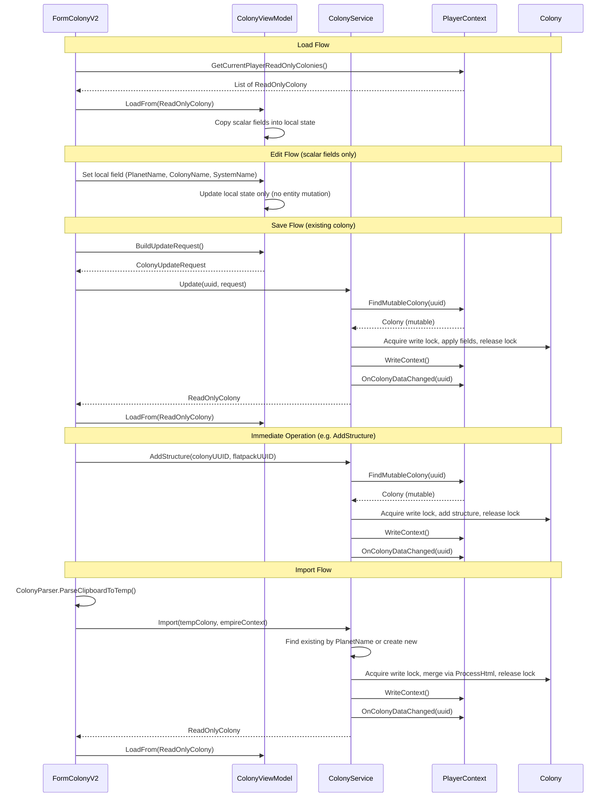

# BL-109 Design: Colony Immutable Data Model with Service Layer

## Overview

BL-109 applies the same immutable data model pattern established in BL-108 (blueprints), BL-110 (surveys), BL-111 (player profiles), and BL-123 (pricing plans) to the Colony form. The form stops directly mutating Colony entities. The ViewModel becomes a disconnected edit buffer for colony-level scalar fields. A new ColonyService is the sole mutator of Colony entities.

### Key Differences from BL-110 (Survey)

1. **Scoped edit buffer** --- The ViewModel edit buffer covers ONLY colony-level scalar fields (PlanetName, ColonyName, SystemName). Structure, item, and commodity operations are immediate service calls, not buffered edits.
2. **Nested structure management** --- Colony has a `List<ColonyStructure>` where each structure has ~30+ fields. Structure add/remove operations go through the service as immediate calls.
3. **Concurrency** --- Colony uses `ReaderWriterLockSlim` for thread-safe access. The service must acquire write locks before mutations and release them in `finally` blocks.
4. **Background processing exemption** --- `Colony.ProcessColony()` continues to mutate directly under its own write lock. Not wrapped by the service.
5. **Item inventory** --- Colony manages an `ItemBag` with resources, blueprints, commodities. Item operations go through the service as immediate calls.
6. **Commodity requests** --- Colony tracks commodity demand (`List<CommodityRequested>`). Commodity operations go through the service as immediate calls.
7. **Import complexity** --- `ColonyParser` parses HTML from the game browser, creates/updates colony with structures, mining assignments, commodity demands. Import is a merge operation that preserves existing structure UUIDs and locally-configured state.
8. **Reference counting** --- `ColonyReferenceCounter` checks 5 source types (delivery routes, delivery plans, build plans, supply chains, overflow rules) vs Survey's 2.
9. **ReadOnlyColony already complete** --- No gap fill needed (unlike Survey which needed 4 new properties).

### Similarities to BL-110

1. **Flat scalar fields** --- PlanetName, SystemName, ColonyName are simple strings managed by the ViewModel edit buffer.
2. **Single form** --- One form (FormColonyV2) manages the full CRUD lifecycle.
3. **List view with filters** --- Colony list has text filter and column sorting.
4. **Always player-scoped** --- Colonies are always owned by the current player.
5. **Clipboard import** --- Both have HTML clipboard import that goes through the service.
6. **Delete reference protection** --- Both check reference counts before allowing deletion.
7. **Service as sole mutator** --- Same pattern: form -> ViewModel -> service -> entity.

## Architecture

### Current Architecture

```
Form --write-through--> ViewModel --direct set--> Mutable Colony --> JSON
  |
  +-- holds _colony (mutable reference via ViewModel.Data)
  +-- TextChanged handlers write directly to entity via ViewModel setters
  +-- ViewModel.Save() persists directly
  +-- Import calls ColonyParser directly on mutable entities
  +-- Structure/item/commodity operations mutate entity directly
```

Every keystroke in a text box writes directly to the Colony entity via the ViewModel setters which set the entity properties. The ViewModel holds a direct Colony reference and exposes it via a public `Data` property. Import logic in the form directly creates and mutates Colony entities. Structure, item, and commodity operations mutate the entity directly through the ViewModel.

### Target Architecture

```
Form --local edit--> ViewModel (edit buffer) --save--> ColonyService --> Mutable Colony --> JSON
  ^                       |                                  |
  |                       | copies from                      | fires event
  |                       v                                  v
  +---- refresh <-- ReadOnlyColony <---------------- PlayerContext

Form --immediate ops--> ColonyService --> Mutable Colony --> JSON
  (structure/item/commodity operations bypass the edit buffer)
```

The form never touches the entity. The ViewModel is a disconnected edit buffer for scalar fields only. The service is the only code that mutates the entity. Structure, item, and commodity operations go directly from the form to the service, bypassing the ViewModel edit buffer.

### Data Flow



## Components and Interfaces

### ReadOnlyColony (Existing --- No Changes)

Already complete. Exposes all scalar fields (UUID, OwnerUUID, LegacyUUID, PlanetName, SystemName, ColonyName, LastImportDateTime, Name), nested ReadOnlyColonyStructure list, ReadOnlyCommodityRequested list, ReadOnlyItemBag, and ReadOnlyLockTracking. Includes Equals/GetHashCode based on UUID and ToString returning ColonyName.

### ReadOnlyColonyStructure (Existing --- No Changes)

Already complete. Exposes all ~30 structure fields as read-only: UUID, FlatpackBlueprintUUID, DisplaySequence, BuildingID, BuildQueueSequence, Properties (ReadOnlyPropertyBag), AssignedWorkers (ReadOnlyPropertyBag), BuildCompletionTime, ProcessCompletionTime, MiningSurvey, MiningSurveyResource, MiningLeftOvers, RefiningResource, RefiningResourcePurity, ResearchingBlueprintUUID, ManufacturingBlueprintUUID, ManufacturingCommodityName, ManufacturingQuantity, ManufacturingCompleted, StagingResources, CurrentAttitude, ContentmentIndex, WageLevel, Statuses, IsBuiltAndOnline.

### ReadOnlyCommodityRequested (Existing --- No Changes)

Already complete. Exposes Name, Requested, Delivered, NeedBy, Fulfilled as read-only.

### ReadOnlyItemBag (Existing --- No Changes)

Already complete. Exposes read-only query methods (ContainsKey, Count, FindByType, FindResource).

### PlayerContext: FindMutableColony (New)

A new internal method reusing the existing `_colonyCache`. Follows the same pattern as `FindMutableBlueprint` and `FindMutableSurvey`:

```csharp
internal Colony FindMutableColony(string uuid)
{
    if (string.IsNullOrEmpty(uuid)) return null;

    lock (_listLock)
    {
        // Reuses existing _colonyCache (same cache as public FindColony)
        if (_colonyCache == null)
        {
            _colonyCache = new Dictionary<string, Colony>();
            foreach (var c in _colonyList)
            {
                if (c.UUID != null && !_colonyCache.ContainsKey(c.UUID))
                    _colonyCache[c.UUID] = c;
            }
        }

        _colonyCache.TryGetValue(uuid, out var match);
        return match;
    }
}
```

Marked `internal` so only the service project can access it. The existing public `FindColony` remains for other consumers (background processing, reference counting).

### ColonyViewModel (Edit Buffer)

The ViewModel is simpler than SurveyViewModel because the edit buffer covers only three scalar fields. Structure, item, and commodity operations are immediate service calls that bypass the ViewModel entirely.

Key differences from SurveyViewModel:
- **Three scalar fields only**: PlanetName, ColonyName, SystemName (vs Survey's 10+ fields plus Resources and Properties dictionaries).
- **No collection editing**: Structures, items, and commodities are not part of the edit buffer.
- **No Data property**: The public `Data` property exposing the mutable Colony is removed.
- **No PlayerContext dependency**: The ViewModel is a plain edit buffer with no service dependencies (ColonyStatusCalculator moves to the form or a separate display helper).

```csharp
public class ColonyViewModel
{
    private static readonly Logger Log = LogManager.GetCurrentClassLogger();

    private ReadOnlyColony _original;  // snapshot for dirty comparison
    private string _uuid;
    private string _ownerUUID = string.Empty;

    // Local edit state --- disconnected from entity
    private string _planetName = string.Empty;
    private string _colonyName = string.Empty;
    private string _systemName = string.Empty;

    public bool IsNew => _original == null;
    public string UUID => _uuid;
    public string OwnerUUID => _ownerUUID;
    public ReadOnlyColony Original => _original;

    // Editable scalar fields
    public string PlanetName { get => _planetName; set => _planetName = value; }
    public string ColonyName { get => _colonyName; set => _colonyName = value; }
    public string SystemName { get => _systemName; set => _systemName = value; }
}
```

#### LoadFrom

```csharp
public void LoadFrom(ReadOnlyColony ro)
{
    _original = ro;
    _uuid = ro.UUID;
    _ownerUUID = ro.OwnerUUID ?? string.Empty;
    _planetName = ro.PlanetName ?? string.Empty;
    _colonyName = ro.ColonyName ?? string.Empty;
    _systemName = ro.SystemName ?? string.Empty;
}
```

#### Reset

```csharp
public void Reset()
{
    _original = null;
    _uuid = null;
    _ownerUUID = string.Empty;
    _planetName = string.Empty;
    _colonyName = string.Empty;
    _systemName = string.Empty;
}
```

#### Dirty Tracking

```csharp
public bool IsDirty
{
    get
    {
        if (_original == null)
        {
            return !string.IsNullOrEmpty(_planetName)
                || !string.IsNullOrEmpty(_colonyName)
                || !string.IsNullOrEmpty(_systemName);
        }

        if (_planetName != (_original.PlanetName ?? string.Empty)) return true;
        if (_colonyName != (_original.ColonyName ?? string.Empty)) return true;
        if (_systemName != (_original.SystemName ?? string.Empty)) return true;

        return false;
    }
}
```

#### BuildUpdateRequest / BuildCreateRequest

```csharp
public ColonyUpdateRequest BuildUpdateRequest()
{
    return new ColonyUpdateRequest
    {
        Original = _original,
        PlanetName = _planetName,
        ColonyName = _colonyName,
        SystemName = _systemName,
    };
}

public ColonyCreateRequest BuildCreateRequest()
{
    return new ColonyCreateRequest
    {
        PlanetName = _planetName,
        ColonyName = _colonyName,
        SystemName = _systemName,
    };
}
```

### ColonyService

Centralizes all Colony mutation. The form and ViewModel never touch the entity directly. Only this service (plus ColonyParser called by the service during import, Colony.ProcessColony for background processing, JSON deserialization, and migration code) mutates Colony objects.

Key differences from SurveyService:
- **Write lock acquisition**: Every mutation acquires `colony.ColonyLock.EnterWriteLock()` before mutating and releases in a `finally` block. Timeout is `Colony.WriteLockTimeoutMs` (5000ms).
- **Immediate operations**: AddStructure, RemoveStructure, AddItem, RemoveItem, UpdateItem, AddCommodityRequest, RemoveCommodityRequest, UpdateCommodityRequest are all immediate operations that persist and fire events.
- **Import uses ProcessHtml**: Import calls `ColonyParser.ProcessHtml` on the mutable colony (after finding/creating it), rather than a separate merge helper.
- **No asteroid linking**: Colony import does not auto-create linked entities (unlike Survey's asteroid auto-linking).

```csharp
public class ColonyService
{
    private static readonly Logger Log = LogManager.GetCurrentClassLogger();
    private readonly PlayerContext _playerContext;
    private readonly ColonyParser _colonyParser;

    public ColonyService(PlayerContext playerContext)
    {
        _playerContext = playerContext;
        _colonyParser = new ColonyParser();
    }

    // Scalar field operations (edit buffer -> service)
    public ReadOnlyColony Update(string uuid, ColonyUpdateRequest request) { ... }
    public ReadOnlyColony Create(ColonyCreateRequest request) { ... }
    public void Delete(string uuid) { ... }

    // Import operation
    public ReadOnlyColony Import(Colony tempColony, EmpireContext empireContext) { ... }

    // Immediate structure operations
    public void AddStructure(string colonyUUID, string flatpackBlueprintUUID) { ... }
    public void RemoveStructure(string colonyUUID, string structureUUID) { ... }

    // Immediate item operations
    public void AddItem(string colonyUUID, Item item) { ... }
    public void RemoveItem(string colonyUUID, string itemUUID) { ... }
    public void UpdateItem(string colonyUUID, string itemUUID, int newQuantity) { ... }

    // Immediate commodity request operations
    public void AddCommodityRequest(string colonyUUID, string commodityName, int requested, DateTime? needBy) { ... }
    public void RemoveCommodityRequest(string colonyUUID, string commodityName) { ... }
    public void UpdateCommodityRequest(string colonyUUID, string commodityName, int requested, int delivered, DateTime needBy) { ... }
}
```

#### Update

Looks up the mutable Colony via `FindMutableColony`, acquires write lock, applies all scalar fields from the request, releases lock, persists, fires event, returns ReadOnlyColony. Throws `InvalidOperationException` if UUID not found.

```csharp
public ReadOnlyColony Update(string uuid, ColonyUpdateRequest request)
{
    if (string.IsNullOrEmpty(uuid)) throw new ArgumentNullException(nameof(uuid));
    if (request == null) throw new ArgumentNullException(nameof(request));

    var colony = _playerContext.FindMutableColony(uuid);
    if (colony == null) throw new InvalidOperationException("Colony not found: " + uuid);

    if (!colony.ColonyLock.TryEnterWriteLock(Colony.WriteLockTimeoutMs))
        throw new TimeoutException("Write lock timeout for colony: " + uuid);
    try
    {
        colony.PlanetName = request.PlanetName;
        colony.ColonyName = request.ColonyName;
        colony.SystemName = request.SystemName;
    }
    finally
    {
        colony.ColonyLock.ExitWriteLock();
    }

    _playerContext.WriteContext();
    _playerContext.OnColonyDataChanged(uuid);
    return new ReadOnlyColony(colony);
}
```

#### Create

Creates a new Colony with generated UUID, sets OwnerUUID to current player, populates all scalar fields from request, adds to PlayerContext, persists, fires event, returns ReadOnlyColony.

#### Delete

Removes the Colony from PlayerContext. No-op if UUID is empty or not found. Persists and fires event.

#### Import

1. Searches existing colonies by PlanetName (case-insensitive) to find a match.
2. If found: acquires write lock, calls `ColonyParser.ProcessHtml` on the existing colony with the extracted HTML, sets `LastImportDateTime`, releases lock.
3. If not found: creates a new Colony with generated UUID and current player OwnerUUID, calls `ColonyParser.ProcessHtml` on the new colony, sets `LastImportDateTime`, adds to PlayerContext.
4. Persists via `WriteContext()`.
5. Fires `ColonyDataChanged` event.
6. Returns `ReadOnlyColony`.

The import method accepts the extracted HTML string and EmpireContext (needed by ColonyParser for flatpack blueprint lookup). The form calls `ColonyParser.ParseClipboardToTemp` first to validate the clipboard content and extract the HTML, then passes the HTML to the service.

#### AddStructure

Acquires write lock, creates a new `ColonyStructure` with generated UUID, the flatpack blueprint UUID, and the next `DisplaySequence` for that type (count of existing structures with the same flatpack UUID + 1). Assigns `BuildQueueSequence` as max existing + 1. Adds to the colony's Structures list, releases lock, persists, fires event.

#### RemoveStructure

Acquires write lock, finds the structure by UUID in the colony's Structures list, removes it, releases lock, persists, fires event. No-op if structure not found.

#### AddItem / RemoveItem / UpdateItem

Acquires write lock, performs the ItemBag operation (`AddItem`, `Remove`, or quantity update), releases lock, persists, fires event.

#### AddCommodityRequest / RemoveCommodityRequest / UpdateCommodityRequest

Acquires write lock, performs the Commodities list operation (add, remove by name, or update fields), releases lock, persists, fires event.

### Write Lock Pattern

All service mutations follow this pattern:

```csharp
if (!colony.ColonyLock.TryEnterWriteLock(Colony.WriteLockTimeoutMs))
    throw new TimeoutException("Write lock timeout for colony: " + colonyUUID);
try
{
    // ... mutation logic ...
}
finally
{
    colony.ColonyLock.ExitWriteLock();
}
```

This ensures the lock is always released even if an exception occurs during mutation. The `TryEnterWriteLock` with timeout prevents deadlocks --- if the background processing thread holds the lock for too long, the service call fails with a `TimeoutException` rather than blocking indefinitely.

### Unsaved Changes Prompt

The form checks `viewModel.IsDirty` before any operation that would discard the current edit buffer:

- **Selection change** --- user selects a different colony in the list view
- **New** --- user clicks the New button
- **Import** --- user clicks the Import button
- **Form close** --- user closes the form (X button or MDI close)
- **Application exit** --- MainWindow closing propagates to all MDI children

All five paths use the same three-button dialog: **Save** | **Discard** | **Cancel**.

- **Save**: calls the appropriate service method (Create or Update), then proceeds with the original action.
- **Discard**: discards local changes and proceeds.
- **Cancel**: cancels the original action and keeps the current colony selected.

For form close and application exit, Cancel sets `e.Cancel = true` to prevent the close.

### Delete Flow with Reference Protection

1. Check `ColonyReferenceCounter` for references (delivery routes, delivery plans, build plans, supply chains, overflow rules).
2. If `TotalCount > 0`: show warning message listing reference counts by type, prevent deletion.
3. If `TotalCount == 0`: prompt for confirmation.
4. On confirm: call `ColonyService.Delete`, clear form, refresh list.

## Data Models

### ColonyUpdateRequest (New)

A plain DTO carrying the original snapshot and the current scalar field state:

```csharp
public class ColonyUpdateRequest
{
    /// <summary>
    /// The original snapshot the edit was based on.
    /// Enables field-level dirty detection and optimistic concurrency.
    /// </summary>
    public ReadOnlyColony Original { get; set; }

    public string PlanetName { get; set; }
    public string ColonyName { get; set; }
    public string SystemName { get; set; }
}
```

### ColonyCreateRequest (New)

A DTO for creating a new colony. No Original snapshot (it does not exist yet). No UUID (the service assigns it). No OwnerUUID (the service sets it from the current player).

```csharp
public class ColonyCreateRequest
{
    public string PlanetName { get; set; }
    public string ColonyName { get; set; }
    public string SystemName { get; set; }
}
```

### Colony (Existing --- No Changes)

The existing Colony model is unchanged. It has scalar fields (UUID, OwnerUUID, LegacyUUID, PlanetName, SystemName, ColonyName, LastImportDateTime), nested collections (`List<ColonyStructure>` Structures, `ItemBag` Items, `List<CommodityRequested>` Commodities), concurrency control (`ReaderWriterLockSlim` ColonyLock), and background processing (`ProcessColony()`). The service is the only code that mutates it after migration (except ProcessColony and deserialization).

### ColonyStructure (Existing --- No Changes)

The existing ColonyStructure model is unchanged. ~30+ fields covering building identity, status, mining/refining/manufacturing/research assignments, worker assignments, timers, and computed status. The service creates new instances for AddStructure and removes instances for RemoveStructure.

### CommodityRequested (Existing --- No Changes)

The existing CommodityRequested model is unchanged. Fields: Name (string), Requested (int), Delivered (int), NeedBy (DateTime), Fulfilled (bool). The service creates new instances for AddCommodityRequest and updates fields for UpdateCommodityRequest.

### ReadOnlyColony (Existing --- No Changes)

Already complete. No gap fill needed. Exposes all scalar fields, nested ReadOnlyColonyStructure list, ReadOnlyCommodityRequested list, ReadOnlyItemBag, and ReadOnlyLockTracking.

## Correctness Properties

*A property is a characteristic or behavior that should hold true across all valid executions of a system --- essentially, a formal statement about what the system should do. Properties serve as the bridge between human-readable specifications and machine-verifiable correctness guarantees.*

### Property 1: LoadFrom Round-Trip Preserves All Scalar Fields

*For any* valid Colony entity, wrapping in ReadOnlyColony and calling LoadFrom SHALL produce a ViewModel whose local fields exactly match the original entity scalar fields (PlanetName, ColonyName, SystemName).

**Validates: Requirements 4.1, 4.2, 4.3**

### Property 2: IsDirty False Immediately After LoadFrom

*For any* valid Colony entity, wrapping in ReadOnlyColony and calling LoadFrom SHALL produce a ViewModel where IsDirty returns false.

**Validates: Requirements 7.1, 7.3**

### Property 3: IsDirty Detects Any Single Scalar Field Change

*For any* valid Colony entity, after LoadFrom, changing any single scalar field (PlanetName, ColonyName, SystemName) to a different value SHALL cause IsDirty to return true.

**Validates: Requirements 7.1, 7.2**

### Property 4: Service.Update Round-Trip

*For any* valid existing Colony entity and valid ColonyUpdateRequest values, calling Service.Update SHALL produce a ReadOnlyColony whose scalar fields match the request values (PlanetName, ColonyName, SystemName).

**Validates: Requirements 13.4, 13.7**

### Property 5: Service.Create Round-Trip

*For any* valid ColonyCreateRequest values, calling Service.Create SHALL produce a ReadOnlyColony whose scalar fields match the request values and whose UUID is non-empty.

**Validates: Requirements 14.2, 14.4, 14.8**

### Property 6: Service.Delete Removes Colony

*For any* valid existing Colony entity, calling Service.Delete with the colony UUID SHALL cause the colony to no longer be findable via PlayerContext.

**Validates: Requirements 15.1, 15.2**

### Property 7: Service.AddStructure Increases Structure Count

*For any* valid existing Colony entity and valid flatpack blueprint UUID, calling Service.AddStructure SHALL increase the colony Structures count by exactly one and the new structure SHALL have the specified flatpack blueprint UUID.

**Validates: Requirements 17.3, 17.4**

### Property 8: Service.RemoveStructure Decreases Structure Count

*For any* valid existing Colony entity with at least one structure, calling Service.RemoveStructure with a valid structure UUID SHALL decrease the colony Structures count by exactly one.

**Validates: Requirements 18.3**

## Error Handling

### Validation

- **Empty colony name**: The Save handler validates that ColonyName is not empty or whitespace before calling the service. Shows a MessageBox warning.
- **Empty planet name**: The Save handler validates that PlanetName is not empty or whitespace before calling the service. Shows a MessageBox warning.

### Service Errors

- **Update with non-existent UUID**: `ColonyService.Update` throws `InvalidOperationException`. The form catches this and shows an error dialog.
- **Delete with empty/non-existent UUID**: `ColonyService.Delete` returns silently (no error). Matches the SurveyService pattern.
- **Null request**: Both Update and Create throw `ArgumentNullException` for null requests.
- **Write lock timeout**: If the colony write lock cannot be acquired within `Colony.WriteLockTimeoutMs` (5000ms), the service throws `TimeoutException`. The form catches this and shows an error dialog suggesting the user retry.

### Unsaved Changes Edge Cases

- **Save fails during unsaved changes prompt**: If the service throws during the Save path of the unsaved changes dialog, the form catches the exception, shows an error, and cancels the original action (same as Cancel).
- **Concurrent modification**: If background processing modifies the colony between load and save, the service overwrites scalar fields with the ViewModel state. Structure/item/commodity state is unaffected because those are immediate operations. Acceptable for a single-user desktop app.
- **Import during dirty state**: The unsaved changes prompt fires before import proceeds. If Save fails, import is cancelled.

### Reference Protection

- **Delete with references**: `ColonyReferenceCounter` checks delivery routes, delivery plans, build plans, supply chains, and overflow rules. If `TotalCount > 0`, deletion is blocked with a warning message showing the reference counts by type.
- **Reference counter construction**: Takes `IEnumerable` of routes, plans, build plans, supply chains, overflow rules, and stock plans. Null-safe.

## Testing Strategy

### Dual Testing Approach

- **Property-based tests** (FsCheck + NUnit): Verify universal properties across randomly generated Colony inputs. Minimum 25 iterations per property test, following the established pattern from SurveyServicePropertyTests and SurveyViewModelPropertyTests.
- **Unit tests** (NUnit): Verify specific examples, edge cases, and error conditions.

### Property-Based Tests

**Library**: FsCheck 2.x with FsCheck.NUnit integration (already in the project).

**Generator**: A `ValidColonyGen()` generator that produces random Colony entities with:
- Random string scalar fields (PlanetName, ColonyName, SystemName)
- Random UUID and OwnerUUID
- Empty Structures list (structure operations are tested separately)
- Empty ItemBag (item operations are tested separately)
- Empty Commodities list (commodity operations are tested separately)

**Test files**:

1. `OE2EmpireTracker.Tests/ViewModels/ColonyViewModelPropertyTests.cs`
   - Feature: bl-109-colony-readonly, Property 1: LoadFrom round-trip preserves all scalar fields
   - Feature: bl-109-colony-readonly, Property 2: IsDirty false immediately after LoadFrom
   - Feature: bl-109-colony-readonly, Property 3: IsDirty detects any single scalar field change

2. `OE2EmpireTracker.Tests/Services/ColonyServicePropertyTests.cs`
   - Feature: bl-109-colony-readonly, Property 4: Service.Update round-trip
   - Feature: bl-109-colony-readonly, Property 5: Service.Create round-trip
   - Feature: bl-109-colony-readonly, Property 6: Service.Delete removes colony
   - Feature: bl-109-colony-readonly, Property 7: Service.AddStructure increases structure count
   - Feature: bl-109-colony-readonly, Property 8: Service.RemoveStructure decreases structure count

**Configuration**: `[FsCheck.NUnit.Property(MaxTest = 25)]` for round-trip and IsDirty-false tests, `[FsCheck.NUnit.Property(MaxTest = 50)]` for the single-field-change test (more field combinations to cover).

### Unit Tests

**Test file**: `OE2EmpireTracker.Tests/Services/ColonyServiceTests.cs`

- Update with non-existent UUID throws InvalidOperationException
- Delete with empty UUID returns without error
- Delete with non-existent UUID returns without error
- Create assigns non-empty UUID
- Create sets OwnerUUID to current player UUID
- Update fires ColonyDataChanged event
- Create fires ColonyDataChanged event
- Delete fires ColonyDataChanged event
- AddStructure creates structure with correct flatpack UUID
- AddStructure assigns next DisplaySequence for type
- RemoveStructure removes correct structure by UUID
- AddItem adds item to colony ItemBag
- RemoveItem removes item from colony ItemBag
- UpdateItem changes item quantity
- AddCommodityRequest adds commodity to colony
- RemoveCommodityRequest removes commodity from colony
- UpdateCommodityRequest updates commodity fields
- Write lock timeout throws TimeoutException

**Test file**: `OE2EmpireTracker.Tests/ViewModels/ColonyViewModelTests.cs`

- Reset clears all fields to defaults
- IsNew returns true after Reset
- IsNew returns false after LoadFrom
- IsDirty returns true for new colony with non-default PlanetName
- BuildUpdateRequest copies all scalar fields
- BuildCreateRequest copies all scalar fields
- UUID and OwnerUUID are preserved from LoadFrom

### Mutation Guard Test

**Test file**: `OE2EmpireTracker.Tests/Services/ColonyMutationGuardTests.cs`

A static analysis test (following the pattern of BlueprintMutationGuardTests, SurveyMutationGuardTests, PlayerProfileMutationGuardTests, and PricingPlanMutationGuardTests) that greps the codebase for direct Colony property sets and asserts they only appear in:

- ColonyService.cs
- ColonyParser.cs (populating temp objects or called by service)
- Colony.cs (the model itself, including ProcessColony)
- JSON deserialization (Newtonsoft.Json)
- Migration code
- Test code

A second check greps for direct Colony.Structures list mutation (Add, Remove, Clear) and asserts they only appear in:

- ColonyService.cs
- ColonyParser.cs (called by service during import)
- Colony.cs (the model itself)
- JSON deserialization
- Test code

**Validates: Requirements 29.1, 29.2, 29.3, 32.1, 32.2**

### Verification Checklist

- [ ] All existing tests pass (Requirement 30.1)
- [ ] `node .kiro/tools/audit.js` reports no new findings (Requirement 31.1)
- [ ] Mutation guard test passes (Requirements 32.1, 32.2)
- [ ] Build produces zero errors and zero warnings
