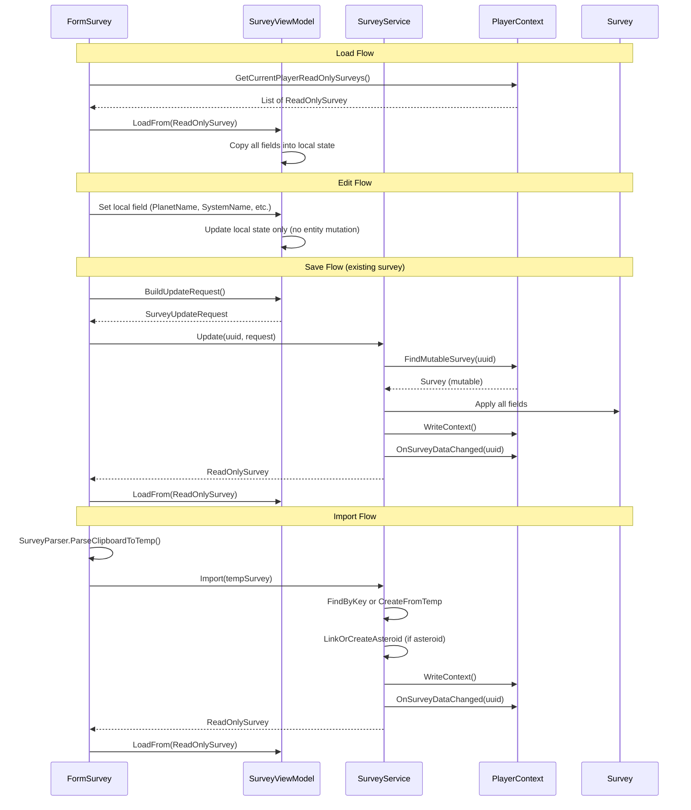

# BL-110 Design: Survey Immutable Data Model with Service Layer

## Overview

BL-110 applies the same immutable data model pattern established in BL-108 (blueprints), BL-111 (player profiles), and BL-123 (pricing plans) to the Survey form. The form stops directly mutating Survey entities. The ViewModel becomes a disconnected edit buffer. A new SurveyService is the sole mutator of Survey entities.

### Key Differences from BL-123 (PricingPlan)

1. **Clipboard import** --- Survey has a clipboard import feature (HTML from game browser). The service needs an Import method that handles dedup, merge, and asteroid auto-creation.
2. **Resource grid with nested objects** --- Survey has a Dictionary<string, SurveyResource> where each SurveyResource has Resource, Purity, and Amount strings.
3. **Properties dictionary** --- Survey has a Dictionary<string, string> for sensor readings (SensorAbundance, PurityModifier, ScanLevel).
4. **Scanner blueprint combo** --- FilteredTextComboSet for selecting the scanner blueprint used.
5. **Reference counter for delete protection** --- SurveyReferenceCounter checks mining rig assignments and build plan items before allowing delete.
6. **ReadOnlySurvey gap fill required** --- Missing ScannedBy, DateTime, ScannerBlueprintUUID, and Properties.
7. **SurveyType enum** --- SurveyType (Planet or Asteroid) affects form behavior.
8. **Asteroid auto-linking** --- On import, asteroid surveys auto-create or link to an Asteroid entity.

### Similarities to BL-123

1. **Flat scalar fields** --- PlanetName, SystemName, SurveyID, NickName, ScannedBy, DateTime, ScannerBlueprintUUID, AsteroidUUID, OwnerUUID are all simple strings.
2. **Single form** --- One form manages the full CRUD lifecycle.
3. **List view with filters** --- Survey list has text filter, resource filter, type filter, purity filter, and min amount filter.
4. **No timer** --- No live countdown or timer logic.
5. **Always player-scoped** --- No global/player split.

## Architecture

### Current Architecture

```
Form --write-through--> Mutable Survey --> JSON
  |
  +-- holds _survey (mutable reference via ViewModel.Data)
  +-- TextChanged handlers write directly to entity via ViewModel setters
  +-- ViewModel.Save() persists directly
  +-- ViewModel.Delete() removes directly
  +-- Import creates/merges entities directly in the form
```

Every keystroke in a text box writes directly to the Survey entity via the ViewModel setters which set the entity properties. The ViewModel holds a direct Survey reference and exposes it via a public Data property. Import logic in the form directly creates and mutates Survey entities.

### Target Architecture

```
Form --local edit--> ViewModel (edit buffer) --save--> SurveyService --> Mutable Survey --> JSON
  ^                       |                                  |
  |                       | copies from                      | fires event
  |                       v                                  v
  +---- refresh <-- ReadOnlySurvey <---------------- PlayerContext
```

The form never touches the entity. The ViewModel is a disconnected edit buffer. The service is the only code that mutates the entity.

### Data Flow



## Components and Interfaces

### ReadOnlySurvey (Gap Fill Required)

The existing ReadOnlySurvey is missing four properties. After gap fill:

| Property | Type | Source | Status |
|----------|------|--------|--------|
| UUID | string | _entity.UUID | Existing |
| Name | string | _entity.Name | Existing |
| OwnerUUID | string | _entity.OwnerUUID | Existing |
| PlanetName | string | _entity.PlanetName | Existing |
| SystemName | string | _entity.SystemName | Existing |
| SurveyID | string | _entity.SurveyID | Existing |
| NickName | string | _entity.NickName | Existing |
| SurveyType | SurveyType | _entity.SurveyType | Existing |
| AsteroidUUID | string | _entity.AsteroidUUID | Existing |
| ExtendedName | string | _entity.ExtendedName | Existing |
| Resources | IReadOnlyDictionary | wrapped | Existing |
| ScannedBy | string | _entity.ScannedBy | **NEW** |
| DateTime | string | _entity.DateTime | **NEW** |
| ScannerBlueprintUUID | string | _entity.ScannerBlueprintUUID | **NEW** |
| Properties | IReadOnlyDictionary | _entity.Properties | **NEW** |

The four new properties follow the same delegation pattern as existing ones. Properties is exposed as IReadOnlyDictionary<string, string> (the underlying Dictionary<string, string> implements this interface, so no wrapping is needed --- unlike Resources which requires ReadOnlySurveyResource wrappers).

### PlayerContext: FindMutableSurvey

A new internal method following the same cache-based lookup pattern as FindMutableBlueprint and FindMutablePricingPlan:

```csharp
internal Survey FindMutableSurvey(string uuid)
{
    if (string.IsNullOrEmpty(uuid)) return null;
    lock (_listLock)
    {
        if (_surveyCache == null)
        {
            _surveyCache = new Dictionary<string, Survey>();
            foreach (var s in _surveyList)
            {
                if (s.UUID != null && !_surveyCache.ContainsKey(s.UUID))
                    _surveyCache[s.UUID] = s;
            }
        }

        _surveyCache.TryGetValue(uuid, out var match);
        return match;
    }
}
```

Marked internal so only the service project can access it. The existing public FindSurvey remains for other consumers.

### SurveyViewModel (Edit Buffer)

The ViewModel is more complex than PricingPlanViewModel because Survey has nested SurveyResource objects and a Properties dictionary in addition to scalar fields.

Key differences from PricingPlanViewModel:
- **Deep copy of Resources**: Each SurveyResource must be cloned (new SurveyResource with same Resource, Purity, Amount).
- **Deep copy of Properties**: The Properties dictionary must be cloned.
- **Sensor reading accessors**: SensorAbundance, PurityModifier, ScanLevel are stored in the Properties dictionary, not as scalar fields.
- **SurveyType enum**: Compared by value, not string.
- **No constructor dependencies**: Unlike the current SurveyViewModel which takes PlayerContext and EmpireContext, the new ViewModel is a plain edit buffer with no service dependencies.

```csharp
public class SurveyViewModel
{
    private static readonly Logger Log = LogManager.GetCurrentClassLogger();

    private ReadOnlySurvey _original;  // snapshot for dirty comparison
    private string _uuid;
    private string _ownerUUID = string.Empty;

    // Local edit state --- disconnected from entity
    private string _planetName = string.Empty;
    private string _systemName = string.Empty;
    private string _surveyID = string.Empty;
    private string _nickName = string.Empty;
    private string _scannedBy = string.Empty;
    private string _dateTime = string.Empty;
    private string _scannerBlueprintUUID = string.Empty;
    private string _asteroidUUID = string.Empty;
    private SurveyType _surveyType = SurveyType.Planet;
    private Dictionary<string, SurveyResource> _resources = new Dictionary<string, SurveyResource>();
    private Dictionary<string, string> _properties = new Dictionary<string, string>();

    public bool IsNew => _original == null;
    public string UUID => _uuid;
    public string OwnerUUID => _ownerUUID;
    public ReadOnlySurvey Original => _original;

    // Editable scalar fields
    public string PlanetName { get => _planetName; set => _planetName = value; }
    public string SystemName { get => _systemName; set => _systemName = value; }
    public string SurveyID { get => _surveyID; set => _surveyID = value; }
    public string NickName { get => _nickName; set => _nickName = value; }
    public string ScannedBy { get => _scannedBy; set => _scannedBy = value; }
    public string DateTime { get => _dateTime; set => _dateTime = value; }
    public string ScannerBlueprintUUID { get => _scannerBlueprintUUID; set => _scannerBlueprintUUID = value; }
    public string AsteroidUUID { get => _asteroidUUID; set => _asteroidUUID = value; }
    public SurveyType SurveyTypeValue { get => _surveyType; set => _surveyType = value; }

    // Editable collections
    public Dictionary<string, SurveyResource> Resources => _resources;
    public Dictionary<string, string> Properties => _properties;

    // Sensor reading convenience accessors (stored in Properties)
    public string SensorAbundance
    {
        get => _properties.TryGetValue( SensorAbundance, out var v) ? v : string.Empty;
        set => _properties[SensorAbundance] = value;
    }

    public string PurityModifier
    {
        get => _properties.TryGetValue(PurityModifier, out var v) ? v : string.Empty;
        set => _properties[PurityModifier] = value;
    }

    public string ScanLevel
    {
        get => _properties.TryGetValue(ScanLevel, out var v) ? v : string.Empty;
        set => _properties[ScanLevel] = value;
    }

    public string DisplayDateTime => SurveyDateTimeParser.FormatForDisplay(_dateTime);
}
```
#### LoadFrom

```csharp
public void LoadFrom(ReadOnlySurvey ro)
{
    _original = ro;
    _uuid = ro.UUID;
    _ownerUUID = ro.OwnerUUID;
    _planetName = ro.PlanetName ?? string.Empty;
    _systemName = ro.SystemName ?? string.Empty;
    _surveyID = ro.SurveyID ?? string.Empty;
    _nickName = ro.NickName ?? string.Empty;
    _scannedBy = ro.ScannedBy ?? string.Empty;
    _dateTime = ro.DateTime ?? string.Empty;
    _scannerBlueprintUUID = ro.ScannerBlueprintUUID ?? string.Empty;
    _asteroidUUID = ro.AsteroidUUID ?? string.Empty;
    _surveyType = ro.SurveyType;

    // Deep copy Resources (each SurveyResource is cloned)
    _resources = new Dictionary<string, SurveyResource>();
    foreach (var kvp in ro.Resources)
    {
        _resources[kvp.Key] = new SurveyResource(kvp.Value.Resource, kvp.Value.Purity, kvp.Value.Amount);
    }

    // Deep copy Properties
    _properties = new Dictionary<string, string>();
    foreach (var kvp in ro.Properties)
    {
        _properties[kvp.Key] = kvp.Value;
    }
}
```

#### Reset

```csharp
public void Reset()
{
    _original = null;
    _uuid = null;
    _ownerUUID = string.Empty;
    _planetName = string.Empty;
    _systemName = string.Empty;
    _surveyID = string.Empty;
    _nickName = string.Empty;
    _scannedBy = string.Empty;
    _dateTime = string.Empty;
    _scannerBlueprintUUID = string.Empty;
    _asteroidUUID = string.Empty;
    _surveyType = SurveyType.Planet;
    _resources = new Dictionary<string, SurveyResource>();
    _properties = new Dictionary<string, string>();
}
```

#### Dirty Tracking

```csharp
public bool IsDirty
{
    get
    {
        if (_original == null)
        {
            return !string.IsNullOrEmpty(_planetName)
                || !string.IsNullOrEmpty(_systemName)
                || !string.IsNullOrEmpty(_surveyID)
                || !string.IsNullOrEmpty(_nickName)
                || !string.IsNullOrEmpty(_scannedBy)
                || !string.IsNullOrEmpty(_dateTime)
                || !string.IsNullOrEmpty(_scannerBlueprintUUID)
                || _surveyType != SurveyType.Planet
                || _resources.Count > 0
                || _properties.Count > 0;
        }

        if (_planetName != (_original.PlanetName ?? string.Empty)) return true;
        if (_systemName != (_original.SystemName ?? string.Empty)) return true;
        if (_surveyID != (_original.SurveyID ?? string.Empty)) return true;
        if (_nickName != (_original.NickName ?? string.Empty)) return true;
        if (_scannedBy != (_original.ScannedBy ?? string.Empty)) return true;
        if (_dateTime != (_original.DateTime ?? string.Empty)) return true;
        if (_scannerBlueprintUUID != (_original.ScannerBlueprintUUID ?? string.Empty)) return true;
        if (_surveyType != _original.SurveyType) return true;

        if (!ResourcesEqual(_resources, _original.Resources)) return true;
        if (!PropertiesEqual(_properties, _original.Properties)) return true;

        return false;
    }
}
```

#### BuildUpdateRequest / BuildCreateRequest

```csharp
public SurveyUpdateRequest BuildUpdateRequest()
{
    return new SurveyUpdateRequest
    {
        Original = _original,
        PlanetName = _planetName,
        SystemName = _systemName,
        SurveyID = _surveyID,
        NickName = _nickName,
        ScannedBy = _scannedBy,
        DateTime = _dateTime,
        ScannerBlueprintUUID = _scannerBlueprintUUID,
        AsteroidUUID = _asteroidUUID,
        SurveyType = _surveyType,
        Resources = DeepCopyResources(_resources),
        Properties = new Dictionary<string, string>(_properties),
    };
}

public SurveyCreateRequest BuildCreateRequest()
{
    return new SurveyCreateRequest
    {
        PlanetName = _planetName,
        SystemName = _systemName,
        SurveyID = _surveyID,
        NickName = _nickName,
        ScannedBy = _scannedBy,
        DateTime = _dateTime,
        ScannerBlueprintUUID = _scannerBlueprintUUID,
        AsteroidUUID = _asteroidUUID,
        SurveyType = _surveyType,
        Resources = DeepCopyResources(_resources),
        Properties = new Dictionary<string, string>(_properties),
    };
}
```

### SurveyService

Centralizes all Survey mutation. The form and ViewModel never touch the entity directly. Only this service (plus deserialization, migration, and SurveyImportHelper called by the service) mutates Survey objects. Follows the same pattern as BlueprintService, PlayerProfileService, and PricingPlanService.

Key differences from PricingPlanService:
- **Import method**: Handles clipboard import with dedup, merge, and asteroid auto-linking via SurveyImportHelper.
- **Resources dictionary**: Replaces with deep-copied SurveyResource instances.
- **Properties dictionary**: Replaces with copied dictionary.
- **SurveyDataChanged event**: Fires with the survey UUID (not a generic PricingDataChanged).

```csharp
public class SurveyService
{
    private static readonly Logger Log = LogManager.GetCurrentClassLogger();
    private readonly PlayerContext _playerContext;

    public SurveyService(PlayerContext playerContext) { ... }

    public ReadOnlySurvey Update(string uuid, SurveyUpdateRequest request) { ... }
    public ReadOnlySurvey Create(SurveyCreateRequest request) { ... }
    public void Delete(string uuid) { ... }
    public ReadOnlySurvey Import(Survey tempSurvey) { ... }
}
```

#### Update

Looks up the mutable Survey via FindMutableSurvey, applies all scalar fields, replaces Resources and Properties dictionaries, persists, fires event, returns ReadOnlySurvey. Throws InvalidOperationException if UUID not found.

#### Create

Creates a new Survey with generated UUID, sets OwnerUUID to current player, populates all fields from request, adds to PlayerContext, persists, fires event, returns ReadOnlySurvey.

#### Delete

Removes the Survey from PlayerContext. No-op if UUID is empty or not found. Persists and fires event.

#### Import

1. Calls SurveyImportHelper.FindByKey to check for existing survey matching PlanetName+SurveyID.
2. If found: calls SurveyImportHelper.MergeData to update the existing survey (preserving UUID and NickName).
3. If not found: calls SurveyImportHelper.CreateFromTemp to create a new survey with generated UUID.
4. If asteroid survey: calls SurveyImportHelper.LinkOrCreateAsteroid.
5. Adds new survey to PlayerContext (if created).
6. Persists via WriteContext().
7. Fires SurveyDataChanged event.
8. Returns ReadOnlySurvey.

### Unsaved Changes Prompt

The form checks viewModel.IsDirty before any operation that would discard the current edit buffer:

- **Selection change** --- user selects a different survey in the list view
- **New** --- user clicks the New button
- **Import** --- user clicks the Import button
- **Form close** --- user closes the form (X button or MDI close)
- **Application exit** --- MainWindow closing propagates to all MDI children

All five paths use the same three-button dialog: **Save** | **Discard** | **Cancel**.

- **Save**: calls the appropriate service method (Create or Update), then proceeds with the original action.
- **Discard**: discards local changes and proceeds.
- **Cancel**: cancels the original action and keeps the current survey selected.

For form close and application exit, Cancel sets e.Cancel = true to prevent the close.

### Delete Flow with Reference Protection

1. Check SurveyReferenceCounter for references (mining rigs, build plan items).
2. If TotalCount > 0: show warning message listing reference counts, prevent deletion.
3. If TotalCount == 0: prompt for confirmation.
4. On confirm: call SurveyService.Delete, clear form, refresh list.

## Data Models

### SurveyUpdateRequest

A plain DTO carrying the original snapshot and the current local state:

```csharp
public class SurveyUpdateRequest
{
    public ReadOnlySurvey Original { get; set; }
    public string PlanetName { get; set; }
    public string SystemName { get; set; }
    public string SurveyID { get; set; }
    public string NickName { get; set; }
    public string ScannedBy { get; set; }
    public string DateTime { get; set; }
    public string ScannerBlueprintUUID { get; set; }
    public string AsteroidUUID { get; set; }
    public SurveyType SurveyType { get; set; }
    public Dictionary<string, SurveyResource> Resources { get; set; }
    public Dictionary<string, string> Properties { get; set; }
}
```

### SurveyCreateRequest

A DTO for creating a new survey. No Original snapshot. No UUID (service assigns it). No OwnerUUID (service sets it from current player).

```csharp
public class SurveyCreateRequest
{
    public string PlanetName { get; set; }
    public string SystemName { get; set; }
    public string SurveyID { get; set; }
    public string NickName { get; set; }
    public string ScannedBy { get; set; }
    public string DateTime { get; set; }
    public string ScannerBlueprintUUID { get; set; }
    public string AsteroidUUID { get; set; }
    public SurveyType SurveyType { get; set; }
    public Dictionary<string, SurveyResource> Resources { get; set; }
    public Dictionary<string, string> Properties { get; set; }
}
```

### Survey (Existing --- No Changes)

The existing Survey model is unchanged. It extends Item and has scalar fields, a Resources dictionary of SurveyResource, a Properties dictionary, and a SurveyType enum. The service is the only code that mutates it after migration.

### ReadOnlySurvey (Gap Fill Only)

Four new properties added (ScannedBy, DateTime, ScannerBlueprintUUID, Properties). All other properties remain unchanged. Includes Equals/GetHashCode based on UUID and ToString returning ExtendedName.

### ReadOnlySurveyResource (Existing --- No Changes)

Already complete. Exposes Resource, Purity, Amount, ExtendedName as read-only.
## Correctness Properties

*A property is a characteristic or behavior that should hold true across all valid executions of a system --- essentially, a formal statement about what the system should do. Properties serve as the bridge between human-readable specifications and machine-verifiable correctness guarantees.*

### Property 1: LoadFrom Round-Trip Preserves All Fields

*For any* valid Survey entity, wrapping in ReadOnlySurvey and calling LoadFrom SHALL produce a ViewModel whose local fields exactly match the original entity fields (PlanetName, SystemName, SurveyID, NickName, ScannedBy, DateTime, ScannerBlueprintUUID, SurveyType, AsteroidUUID, and every key-value pair in Resources and Properties).

**Validates: Requirements 4.1, 4.2, 4.3**

### Property 2: IsDirty False Immediately After LoadFrom

*For any* valid Survey entity, wrapping in ReadOnlySurvey and calling LoadFrom SHALL produce a ViewModel where IsDirty returns false.

**Validates: Requirements 7.1, 7.5**

### Property 3: IsDirty Detects Any Single Field Change

*For any* valid Survey entity, after LoadFrom, changing any single field (PlanetName, SystemName, SurveyID, NickName, ScannedBy, DateTime, ScannerBlueprintUUID, SurveyType, or any single Resources entry, or any single Properties entry) to a different value SHALL cause IsDirty to return true.

**Validates: Requirements 7.1, 7.2, 7.3, 7.4**

### Property 4: Service.Update Round-Trip

*For any* valid existing Survey entity and valid SurveyUpdateRequest values, calling Service.Update SHALL produce a ReadOnlySurvey whose fields match the request values (all scalar fields, Resources, and Properties).

**Validates: Requirements 13.3, 13.4, 13.5, 13.8**

### Property 5: Service.Create Round-Trip

*For any* valid SurveyCreateRequest values, calling Service.Create SHALL produce a ReadOnlySurvey whose fields match the request values and whose UUID is non-empty.

**Validates: Requirements 14.2, 14.4, 14.8**

### Property 6: Service.Delete Removes Survey

*For any* valid existing Survey entity, calling Service.Delete with the survey UUID SHALL cause the survey to no longer be findable via PlayerContext.

**Validates: Requirements 15.1, 15.2**

### Property 7: Import Dedup --- Existing Survey Preserves UUID and NickName

*For any* valid existing Survey entity and valid temporary Survey object with matching PlanetName+SurveyID, calling Service.Import SHALL preserve the existing survey UUID and NickName while updating data fields.

**Validates: Requirements 16.2**

### Property 8: Import New --- Creates Survey with Non-Empty UUID

*For any* valid temporary Survey object with no matching existing survey, calling Service.Import SHALL produce a ReadOnlySurvey with a non-empty UUID and fields matching the temporary object.

**Validates: Requirements 16.3, 16.7**

## Error Handling

### Validation

- **Empty planet name**: The Save handler validates that PlanetName is not empty or whitespace before calling the service. Shows a MessageBox warning.
- **Empty survey ID**: The Save handler validates that SurveyID is not empty or whitespace. Shows a MessageBox warning.
- **Resource grid validation**: DgvResources_CellValidating rejects invalid resource names, purities, and non-numeric amounts with row-level error text.
- **Date/time parsing**: The date picker uses SurveyDateTimeParser to convert between display format and ISO storage format. Invalid dates are handled gracefully.

### Service Errors

- **Update with non-existent UUID**: SurveyService.Update throws InvalidOperationException. The form catches this and shows an error dialog.
- **Delete with empty/non-existent UUID**: SurveyService.Delete returns silently (no error). Matches the PricingPlanService pattern.
- **Null request**: Both Update and Create throw ArgumentNullException for null requests.
- **Import with null temp survey**: SurveyService.Import throws ArgumentNullException.

### Unsaved Changes Edge Cases

- **Save fails during unsaved changes prompt**: If the service throws during the Save path of the unsaved changes dialog, the form catches the exception, shows an error, and cancels the original action (same as Cancel).
- **Concurrent modification**: If another form modifies the same survey between load and save, the service overwrites with the ViewModel state. Acceptable for a single-user desktop app.
- **Import during dirty state**: The unsaved changes prompt fires before import proceeds. If Save fails, import is cancelled.

### Reference Protection

- **Delete with references**: SurveyReferenceCounter checks mining rig assignments and build plan items. If TotalCount > 0, deletion is blocked with a warning message showing the reference counts.
- **Reference counter construction**: Takes IEnumerable<Colony> and IEnumerable<BuildPlan> to count all references. Null-safe.

## Testing Strategy

### Dual Testing Approach

- **Property-based tests** (FsCheck + NUnit): Verify universal properties across randomly generated Survey inputs. Minimum 25 iterations per property test, following the established pattern from PricingPlanServicePropertyTests.
- **Unit tests** (NUnit): Verify specific examples, edge cases, and error conditions.

### Property-Based Tests

**Library**: FsCheck 2.x with FsCheck.NUnit integration (already in the project).

**Generator**: A ValidSurveyGen() generator that produces random Survey entities with:
- Random string scalar fields (PlanetName, SystemName, SurveyID, NickName, ScannedBy, DateTime, ScannerBlueprintUUID, AsteroidUUID)
- Random SurveyType (Planet or Asteroid)
- Random Resources dictionary (0-5 entries, each with random Resource name, Purity from GameConstants purities, and numeric Amount string)
- Random Properties dictionary (0-3 entries from SensorAbundance, PurityModifier, ScanLevel)

**Test files**:

1. OE2EmpireTracker.Tests/ViewModels/SurveyViewModelPropertyTests.cs
   - Feature: bl-110-survey-readonly, Property 1: LoadFrom round-trip preserves all fields
   - Feature: bl-110-survey-readonly, Property 2: IsDirty false immediately after LoadFrom
   - Feature: bl-110-survey-readonly, Property 3: IsDirty detects any single field change

2. OE2EmpireTracker.Tests/Services/SurveyServicePropertyTests.cs
   - Feature: bl-110-survey-readonly, Property 4: Service.Update round-trip
   - Feature: bl-110-survey-readonly, Property 5: Service.Create round-trip
   - Feature: bl-110-survey-readonly, Property 6: Service.Delete removes survey
   - Feature: bl-110-survey-readonly, Property 7: Import dedup preserves UUID and NickName
   - Feature: bl-110-survey-readonly, Property 8: Import new creates survey with non-empty UUID

**Configuration**: [FsCheck.NUnit.Property(MaxTest = 25)] for round-trip and IsDirty-false tests, [FsCheck.NUnit.Property(MaxTest = 50)] for the single-field-change test (more field combinations to cover).

### Unit Tests

**Test file**: OE2EmpireTracker.Tests/Services/SurveyServiceTests.cs

- Update with non-existent UUID throws InvalidOperationException
- Delete with empty UUID returns without error
- Delete with non-existent UUID returns without error
- Create assigns non-empty UUID
- Create sets OwnerUUID to current player UUID
- Update fires SurveyDataChanged event
- Create fires SurveyDataChanged event
- Delete fires SurveyDataChanged event
- Import with matching survey merges data (preserves UUID and NickName)
- Import with no match creates new survey
- Import with asteroid survey calls LinkOrCreateAsteroid

**Test file**: OE2EmpireTracker.Tests/ViewModels/SurveyViewModelTests.cs

- Reset clears all fields to defaults
- IsNew returns true after Reset
- IsNew returns false after LoadFrom
- IsDirty returns true for new survey with non-default PlanetName
- BuildUpdateRequest copies all fields including Resources and Properties
- BuildCreateRequest copies all fields including Resources and Properties
- Resources deep copy is independent (modifying request does not affect ViewModel)
- Properties deep copy is independent
- SensorAbundance/PurityModifier/ScanLevel convenience accessors read/write Properties dictionary

### Mutation Guard Test

**Test file**: OE2EmpireTracker.Tests/Services/SurveyMutationGuardTests.cs

A static analysis test (following the pattern of BlueprintMutationGuardTests, PlayerProfileMutationGuardTests, and PricingPlanMutationGuardTests) that greps the codebase for direct Survey property sets and asserts they only appear in:

- SurveyService.cs
- SurveyImportHelper.cs
- SurveyParser.cs (populating temp objects)
- Survey.cs (the model itself)
- JSON deserialization (Newtonsoft.Json)
- Migration code
- Test code

A second check greps for direct SurveyResource property sets and asserts they only appear in:

- SurveyService.cs
- SurveyImportHelper.cs
- SurveyParser.cs
- SurveyResource (within Survey.cs)
- JSON deserialization
- Test code

**Validates: Requirements 21.1, 21.2, 21.3, 24.1, 24.2**

### Verification Checklist

- [ ] All existing tests pass (Requirement 22.1)
- [ ] node .kiro/tools/audit.js reports no new findings (Requirement 23.1)
- [ ] Mutation guard test passes (Requirements 24.1, 24.2)
- [ ] Build produces zero errors and zero warnings