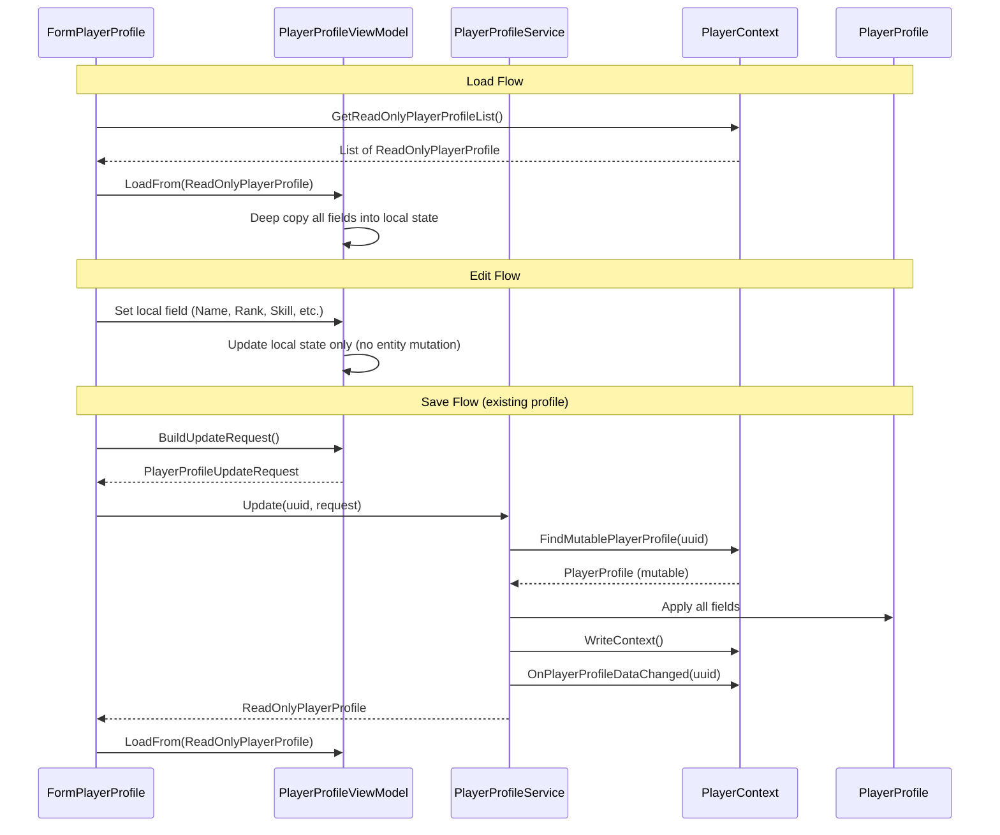

# BL-111 Design: PlayerProfile Immutable Data Model with Service Layer

## Overview

BL-111 applies the same immutable data model pattern established in BL-108 (blueprints) to the PlayerProfile form. The form stops directly mutating PlayerProfile entities. The ViewModel becomes a disconnected edit buffer. A new PlayerProfileService is the sole mutator of PlayerProfile entities.

### Key Complexity: Nested Objects

Unlike Blueprint (which has flat scalar fields plus two `Dictionary<string, string>` bags), PlayerProfile has deeply nested mutable objects:

- **3 PlayerRank objects** (Public, Private, Military) each with Rank, CurrentXP, NextXP, Title
- **`Dictionary<string, PlayerSkill>`** each skill has Level (int), TrainingStarted (bool), CompletionTime (CountDownTime with StartTime/EndTime DateTimes)
- **`Dictionary<SkillGroupName, bool>`** skill group unlock states
- **PlayerSkillBlock** a custom UserControl with a live countdown timer that currently mutates the PlayerSkill entity directly

The edit buffer must deep-copy all of these structures and the dirty comparison must traverse them all.

## Current Architecture

```
Form ──write-through──► ViewModel ──direct set──► Mutable PlayerProfile ──► JSON
                              │
                              ├── holds mutable reference (_profile)
                              └── exposes Data property (mutable entity)

PlayerSkillBlock ──direct set──► PlayerSkill entity (Level, TrainingStarted, CompletionTime)
```

Every keystroke writes directly to the PlayerProfile entity. PlayerSkillBlock holds a direct reference to a PlayerSkill and mutates it when training starts, when the timer fires, and when the user edits the completion time. The form's import button directly mutates entities and calls PlayerContext persistence methods.

## Target Architecture

```
Form ──local edit──► ViewModel (edit buffer) ──save──► PlayerProfileService ──► Mutable PlayerProfile ──► JSON
  ▲                       │                                    │
  │                       │ copies from                        │ fires event
  │                       ▼                                    ▼
  └──── refresh ◄── ReadOnlyPlayerProfile ◄──────────── PlayerContext
```

The form never touches the entity. The ViewModel is a disconnected edit buffer. The service is the only code that mutates the entity.



## Components and Interfaces

### ReadOnlyPlayerProfile Gap Fill

The existing ReadOnlyPlayerProfile is missing several properties the form needs. These must be added:

| Property | Type | Source |
|----------|------|--------|
| Faction | string | `_entity.Faction` |
| TotalCredits | decimal | `_entity.TotalCredits` |
| SkillPoints | int | `_entity.SkillPoints` |
| CitizenId | string | `_entity.CitizenId` |
| RegistrationDate | string | `_entity.RegistrationDate` |
| ActiveTime | string | `_entity.ActiveTime` |
| Skills | `IReadOnlyDictionary<string, ReadOnlyPlayerSkill>` | Wraps `_entity.Skills` |
| GetSkillGroup(SkillGroupName) | bool | Already exists |

### ReadOnlyPlayerSkill Gap Fill

The existing ReadOnlyPlayerSkill only exposes Level. It needs:

| Property | Type | Source |
|----------|------|--------|
| TrainingStarted | bool | `_entity.TrainingStarted` |
| CompletionTimeRemaining | long | `_entity.CompletionTime.TimeRemaining` |
| CompletionTimeRemainingString | string | `_entity.CompletionTime.TimeRemainingString` |
| CompletionStartTime | DateTime | `_entity.CompletionTime.StartTime` |
| CompletionEndTime | DateTime | `_entity.CompletionTime.EndTime` |

Note: We expose the individual CountDownTime fields as read-only scalars rather than wrapping CountDownTime itself. CountDownTime has mutable setters (TimeRemaining, TimeRemainingString) that would leak mutation if exposed directly.

### PlayerContext: FindMutablePlayerProfile

A new `internal` method following the same pattern as `FindMutableBlueprint`:

```csharp
/// <summary>
/// Returns the mutable PlayerProfile entity. Only called by PlayerProfileService.
/// </summary>
internal PlayerProfile FindMutablePlayerProfile(string uuid)
{
    if (string.IsNullOrEmpty(uuid)) return null;
    lock (_listLock)
    {
        // Uses existing _playerProfileCache
        if (_playerProfileCache == null)
        {
            _playerProfileCache = new Dictionary<string, PlayerProfile>();
            foreach (var r in _playerProfileList)
            {
                if (r.UUID != null && !_playerProfileCache.ContainsKey(r.UUID))
                    _playerProfileCache[r.UUID] = r;
            }
        }
        _playerProfileCache.TryGetValue(uuid, out var match);
        return match;
    }
}
```

This is identical to the existing `FindPlayerProfile` but marked `internal` to signal it's only for service use. The existing `FindPlayerProfile` (public) can be deprecated or redirected.

### ViewModel as Edit Buffer

#### Local Skill Data

The ViewModel needs a local copy of each skill's state. Since PlayerSkill contains a CountDownTime (which has complex timer logic tied to `SystemClock.UtcNow`), the local copy stores the raw DateTime values:

```csharp
/// <summary>
/// Local copy of a single skill's state in the edit buffer.
/// Disconnected from the PlayerSkill entity.
/// </summary>
internal class LocalSkillData
{
    public int Level { get; set; }
    public bool TrainingStarted { get; set; }
    public DateTime CompletionStartTime { get; set; }
    public DateTime CompletionEndTime { get; set; }

    /// <summary>
    /// Computed: seconds remaining until CompletionEndTime.
    /// </summary>
    public long TimeRemaining => Math.Max(0, (long)(CompletionEndTime - SystemClock.UtcNow).TotalSeconds);

    /// <summary>
    /// Human-readable countdown string (e.g. "2d 5h 30m 10s").
    /// </summary>
    public string TimeRemainingString
    {
        get
        {
            long seconds = TimeRemaining;
            if (seconds <= 0) return "0s";
            var ts = TimeSpan.FromSeconds(seconds);
            // Same format as CountDownTime.TimeRemainingString
            string result = string.Empty;
            if (ts.Days > 0) result += $"{ts.Days}d ";
            if (ts.Days > 0 || ts.Hours > 0) result += $"{ts.Hours}h ";
            if (ts.Days > 0 || ts.Hours > 0 || ts.Minutes > 0) result += $"{ts.Minutes}m ";
            result += $"{ts.Seconds}s";
            return result.Trim();
        }
    }
}
```

#### Local Rank Data

```csharp
/// <summary>
/// Local copy of a single rank track's state in the edit buffer.
/// </summary>
internal class LocalRankData
{
    public int Rank { get; set; }
    public long CurrentXP { get; set; }
    public long NextXP { get; set; }
    public string Title { get; set; } = string.Empty;
}
```

#### New ViewModel Structure

```csharp
public class PlayerProfileViewModel
{
    private ReadOnlyPlayerProfile _original;  // snapshot for dirty comparison
    private string _uuid;

    // Scalar fields
    private string _name = string.Empty;
    private string _faction = string.Empty;
    private decimal _totalCredits;
    private int _skillPoints;
    private string _citizenId = string.Empty;
    private string _registrationDate = string.Empty;
    private string _activeTime = string.Empty;

    // Nested structures — local copies
    private LocalRankData _publicRank = new LocalRankData();
    private LocalRankData _privateRank = new LocalRankData();
    private LocalRankData _militaryRank = new LocalRankData();
    private Dictionary<string, LocalSkillData> _skills = new Dictionary<string, LocalSkillData>();
    private Dictionary<string, bool> _skillGroups = new Dictionary<string, bool>();

    public string Name { get => _name; set => _name = value; }
    public string Faction { get => _faction; set => _faction = value; }
    public decimal TotalCredits { get => _totalCredits; set => _totalCredits = value; }
    public int SkillPoints { get => _skillPoints; set => _skillPoints = value; }

    public LocalRankData PublicRank => _publicRank;
    public LocalRankData PrivateRank => _privateRank;
    public LocalRankData MilitaryRank => _militaryRank;

    public LocalSkillData GetSkill(string skillName)
    {
        if (!_skills.ContainsKey(skillName))
            _skills[skillName] = new LocalSkillData();
        return _skills[skillName];
    }

    public LocalSkillData GetSkill(SkillName skill) => GetSkill(skill.ToDisplayName());

    public bool GetSkillGroup(SkillGroupName group)
    {
        string key = group.ToDisplayName();
        return _skillGroups.ContainsKey(key) && _skillGroups[key];
    }

    public void SetSkillGroup(SkillGroupName group, bool value)
    {
        _skillGroups[group.ToDisplayName()] = value;
    }

    public bool IsAnySkillTraining()
    {
        return _skills.Values.Any(s => s.TrainingStarted);
    }

    /// <summary>True if any local field differs from the original snapshot.</summary>
    public bool IsDirty { get { /* see Dirty Tracking section */ } }

    /// <summary>True if this is a new profile not yet saved.</summary>
    public bool IsNew => _original == null;

    public string UUID => _uuid;
    public ReadOnlyPlayerProfile Original => _original;

    /// <summary>
    /// Loads field values from a ReadOnlyPlayerProfile snapshot.
    /// Retains the original for dirty comparison.
    /// </summary>
    public void LoadFrom(ReadOnlyPlayerProfile ro) { /* see below */ }

    /// <summary>Resets to empty state for a new profile.</summary>
    public void Reset() { /* see below */ }

    public PlayerProfileUpdateRequest BuildUpdateRequest() { /* see below */ }
    public PlayerProfileCreateRequest BuildCreateRequest() { /* see below */ }
}
```

#### LoadFrom

```csharp
public void LoadFrom(ReadOnlyPlayerProfile ro)
{
    _original = ro;
    _uuid = ro.UUID;
    _name = ro.Name;
    _faction = ro.Faction;
    _totalCredits = ro.TotalCredits;
    _skillPoints = ro.SkillPoints;
    _citizenId = ro.CitizenId;
    _registrationDate = ro.RegistrationDate;
    _activeTime = ro.ActiveTime;

    // Deep copy ranks
    CopyRank(_publicRank, ro.Public);
    CopyRank(_privateRank, ro.Private);
    CopyRank(_militaryRank, ro.Military);

    // Deep copy skills
    _skills.Clear();
    foreach (var kvp in ro.Skills)
    {
        var roSkill = kvp.Value;
        _skills[kvp.Key] = new LocalSkillData
        {
            Level = roSkill.Level,
            TrainingStarted = roSkill.TrainingStarted,
            CompletionStartTime = roSkill.CompletionStartTime,
            CompletionEndTime = roSkill.CompletionEndTime,
        };
    }

    // Deep copy skill groups
    _skillGroups.Clear();
    foreach (SkillGroupName group in Enum.GetValues(typeof(SkillGroupName)))
    {
        _skillGroups[group.ToDisplayName()] = ro.GetSkillGroup(group);
    }
}

private static void CopyRank(LocalRankData local, ReadOnlyPlayerRank ro)
{
    local.Rank = ro.Rank;
    local.CurrentXP = ro.CurrentXP;
    local.NextXP = ro.NextXP;
    local.Title = ro.Title;
}
```

#### Reset

```csharp
public void Reset()
{
    _original = null;
    _uuid = null;
    _name = string.Empty;
    _faction = string.Empty;
    _totalCredits = 0;
    _skillPoints = 0;
    _citizenId = string.Empty;
    _registrationDate = string.Empty;
    _activeTime = string.Empty;
    _publicRank = new LocalRankData();
    _privateRank = new LocalRankData();
    _militaryRank = new LocalRankData();
    _skills.Clear();
    _skillGroups.Clear();
}
```

#### Dirty Tracking

```csharp
public bool IsDirty
{
    get
    {
        if (_original == null)
        {
            // New profile — dirty once any field has a non-default value
            return !string.IsNullOrEmpty(_name)
                || !string.IsNullOrEmpty(_faction)
                || _totalCredits != 0
                || _skillPoints != 0;
        }

        // Scalar fields
        if (_name != _original.Name) return true;
        if (_faction != _original.Faction) return true;
        if (_totalCredits != _original.TotalCredits) return true;
        if (_skillPoints != _original.SkillPoints) return true;
        if (_citizenId != _original.CitizenId) return true;
        if (_registrationDate != _original.RegistrationDate) return true;
        if (_activeTime != _original.ActiveTime) return true;

        // Ranks
        if (IsRankDirty(_publicRank, _original.Public)) return true;
        if (IsRankDirty(_privateRank, _original.Private)) return true;
        if (IsRankDirty(_militaryRank, _original.Military)) return true;

        // Skills
        if (IsSkillsDirty()) return true;

        // Skill groups
        if (IsSkillGroupsDirty()) return true;

        return false;
    }
}

private static bool IsRankDirty(LocalRankData local, ReadOnlyPlayerRank original)
{
    return local.Rank != original.Rank
        || local.CurrentXP != original.CurrentXP
        || local.NextXP != original.NextXP
        || local.Title != original.Title;
}

private bool IsSkillsDirty()
{
    var originalSkills = _original.Skills;
    if (_skills.Count != originalSkills.Count) return true;
    foreach (var kvp in _skills)
    {
        if (!originalSkills.TryGetValue(kvp.Key, out var roSkill)) return true;
        if (kvp.Value.Level != roSkill.Level) return true;
        if (kvp.Value.TrainingStarted != roSkill.TrainingStarted) return true;
        if (kvp.Value.CompletionStartTime != roSkill.CompletionStartTime) return true;
        if (kvp.Value.CompletionEndTime != roSkill.CompletionEndTime) return true;
    }
    return false;
}

private bool IsSkillGroupsDirty()
{
    foreach (SkillGroupName group in Enum.GetValues(typeof(SkillGroupName)))
    {
        string key = group.ToDisplayName();
        bool localVal = _skillGroups.ContainsKey(key) && _skillGroups[key];
        bool origVal = _original.GetSkillGroup(group);
        if (localVal != origVal) return true;
    }
    return false;
}
```

### PlayerSkillBlock Changes

PlayerSkillBlock currently holds a direct `PlayerSkill _playerSkill` reference and mutates it. After migration:

1. **Remove** the `PlayerSkill` property and `_playerSkill` field
2. **Add** a `LocalSkillData` property that the ViewModel provides
3. **Timer completion** updates `LocalSkillData` (set TrainingStarted=false, Level+=1) instead of the entity
4. **Start Training** updates `LocalSkillData` (set TrainingStarted=true, set CompletionEndTime) instead of the entity
5. **Manual completion time edit** updates `LocalSkillData.CompletionEndTime` instead of the entity

```csharp
public partial class PlayerSkillBlock : UserControl
{
    private LocalSkillData _skillData;

    public LocalSkillData SkillData
    {
        get => _skillData;
        set
        {
            _skillData = value;
            PopulateForm();
        }
    }

    private void UpdateCompletion()
    {
        if (!completionModification && _skillData != null)
        {
            this.txtCompletion.Text = _skillData.TimeRemainingString;
            if (_skillData.TimeRemaining <= 0)
            {
                _skillData.TrainingStarted = false;
                _skillData.Level += 1;
                PopulateForm();
                TrainingStatusChanged?.Invoke(this, EventArgs.Empty);
                timerCountdown.Stop();
            }
        }
    }

    private void CmdStart_Click(object sender, EventArgs e)
    {
        _skillData.TrainingStarted = true;
        _skillData.CompletionStartTime = SystemClock.UtcNow;
        _skillData.CompletionEndTime = SystemClock.UtcNow.AddDays(_skillData.Level + 1);
        PopulateForm();
        TrainingStatusChanged?.Invoke(this, e);
    }

    private void TxtCompletion_Leave(object sender, EventArgs e)
    {
        completionModification = false;
        // Parse the edited text and update local CompletionEndTime
        // using the same regex as CountDownTime.TimeRemainingString setter
        long totalSeconds = ParseTimeString(txtCompletion.Text);
        _skillData.CompletionStartTime = SystemClock.UtcNow;
        _skillData.CompletionEndTime = SystemClock.UtcNow.AddSeconds(totalSeconds);
    }
}
```

## Data Models

### PlayerProfileUpdateRequest

A plain DTO carrying the original snapshot and the current local state. Follows the same pattern as BlueprintUpdateRequest:

```csharp
public class PlayerProfileUpdateRequest
{
    /// <summary>
    /// The original snapshot the edit was based on.
    /// Enables field-level dirty detection and optimistic concurrency.
    /// </summary>
    public ReadOnlyPlayerProfile Original { get; set; }

    // Scalar fields
    public string Name { get; set; }
    public string Faction { get; set; }
    public decimal TotalCredits { get; set; }
    public int SkillPoints { get; set; }
    public string CitizenId { get; set; }
    public string RegistrationDate { get; set; }
    public string ActiveTime { get; set; }

    // Ranks — flat fields per track
    public int PublicRank { get; set; }
    public long PublicCurrentXP { get; set; }
    public long PublicNextXP { get; set; }
    public string PublicTitle { get; set; }

    public int PrivateRank { get; set; }
    public long PrivateCurrentXP { get; set; }
    public long PrivateNextXP { get; set; }
    public string PrivateTitle { get; set; }

    public int MilitaryRank { get; set; }
    public long MilitaryCurrentXP { get; set; }
    public long MilitaryNextXP { get; set; }
    public string MilitaryTitle { get; set; }

    // Skills — keyed by display name
    public Dictionary<string, SkillUpdateData> Skills { get; set; }

    // Skill groups — keyed by display name
    public Dictionary<string, bool> SkillGroups { get; set; }
}

public class SkillUpdateData
{
    public int Level { get; set; }
    public bool TrainingStarted { get; set; }
    public DateTime CompletionStartTime { get; set; }
    public DateTime CompletionEndTime { get; set; }
}
```

### PlayerProfileCreateRequest

Same fields as the update request but without the Original snapshot or UUID:

```csharp
public class PlayerProfileCreateRequest
{
    public string Name { get; set; }
    public string Faction { get; set; }
    public decimal TotalCredits { get; set; }
    public int SkillPoints { get; set; }
    public string CitizenId { get; set; }
    public string RegistrationDate { get; set; }
    public string ActiveTime { get; set; }

    public int PublicRank { get; set; }
    public long PublicCurrentXP { get; set; }
    public long PublicNextXP { get; set; }
    public string PublicTitle { get; set; }

    public int PrivateRank { get; set; }
    public long PrivateCurrentXP { get; set; }
    public long PrivateNextXP { get; set; }
    public string PrivateTitle { get; set; }

    public int MilitaryRank { get; set; }
    public long MilitaryCurrentXP { get; set; }
    public long MilitaryNextXP { get; set; }
    public string MilitaryTitle { get; set; }

    public Dictionary<string, SkillUpdateData> Skills { get; set; }
    public Dictionary<string, bool> SkillGroups { get; set; }
}
```

### BuildUpdateRequest / BuildCreateRequest

The ViewModel builds these from its local state:

```csharp
public PlayerProfileUpdateRequest BuildUpdateRequest()
{
    return new PlayerProfileUpdateRequest
    {
        Original = _original,
        Name = _name,
        Faction = _faction,
        TotalCredits = _totalCredits,
        SkillPoints = _skillPoints,
        CitizenId = _citizenId,
        RegistrationDate = _registrationDate,
        ActiveTime = _activeTime,
        PublicRank = _publicRank.Rank,
        PublicCurrentXP = _publicRank.CurrentXP,
        PublicNextXP = _publicRank.NextXP,
        PublicTitle = _publicRank.Title,
        PrivateRank = _privateRank.Rank,
        PrivateCurrentXP = _privateRank.CurrentXP,
        PrivateNextXP = _privateRank.NextXP,
        PrivateTitle = _privateRank.Title,
        MilitaryRank = _militaryRank.Rank,
        MilitaryCurrentXP = _militaryRank.CurrentXP,
        MilitaryNextXP = _militaryRank.NextXP,
        MilitaryTitle = _militaryRank.Title,
        Skills = _skills.ToDictionary(
            kvp => kvp.Key,
            kvp => new SkillUpdateData
            {
                Level = kvp.Value.Level,
                TrainingStarted = kvp.Value.TrainingStarted,
                CompletionStartTime = kvp.Value.CompletionStartTime,
                CompletionEndTime = kvp.Value.CompletionEndTime,
            }),
        SkillGroups = new Dictionary<string, bool>(_skillGroups),
    };
}

public PlayerProfileCreateRequest BuildCreateRequest()
{
    return new PlayerProfileCreateRequest
    {
        Name = _name,
        Faction = _faction,
        TotalCredits = _totalCredits,
        SkillPoints = _skillPoints,
        CitizenId = _citizenId,
        RegistrationDate = _registrationDate,
        ActiveTime = _activeTime,
        // ... same rank/skill/group fields as update request
    };
}
```

### PlayerProfileService

```csharp
public class PlayerProfileService
{
    private readonly PlayerContext _playerContext;

    public PlayerProfileService(PlayerContext playerContext)
    {
        _playerContext = playerContext;
    }

    public ReadOnlyPlayerProfile Update(string uuid, PlayerProfileUpdateRequest request)
    {
        if (string.IsNullOrEmpty(uuid)) throw new ArgumentNullException(nameof(uuid));
        if (request == null) throw new ArgumentNullException(nameof(request));

        var profile = _playerContext.FindMutablePlayerProfile(uuid);
        if (profile == null) throw new InvalidOperationException("Profile not found: " + uuid);

        // Apply scalar fields
        profile.Name = request.Name;
        profile.Faction = request.Faction;
        profile.TotalCredits = request.TotalCredits;
        profile.SkillPoints = request.SkillPoints;
        profile.CitizenId = request.CitizenId;
        profile.RegistrationDate = request.RegistrationDate;
        profile.ActiveTime = request.ActiveTime;

        // Apply ranks
        ApplyRank(profile.Public, request.PublicRank, request.PublicCurrentXP,
                  request.PublicNextXP, request.PublicTitle);
        ApplyRank(profile.Private, request.PrivateRank, request.PrivateCurrentXP,
                  request.PrivateNextXP, request.PrivateTitle);
        ApplyRank(profile.Military, request.MilitaryRank, request.MilitaryCurrentXP,
                  request.MilitaryNextXP, request.MilitaryTitle);

        // Apply skills
        if (request.Skills != null)
        {
            foreach (var kvp in request.Skills)
            {
                var skill = profile.GetSkill(kvp.Key);
                skill.Level = kvp.Value.Level;
                skill.TrainingStarted = kvp.Value.TrainingStarted;
                skill.CompletionTime.StartTime = kvp.Value.CompletionStartTime;
                skill.CompletionTime.EndTime = kvp.Value.CompletionEndTime;
            }
        }

        // Apply skill groups
        if (request.SkillGroups != null)
        {
            foreach (var kvp in request.SkillGroups)
                profile.SetSkillGroup(kvp.Key, kvp.Value);
        }

        _playerContext.WriteContext();
        _playerContext.OnPlayerProfileDataChanged(uuid);
        return new ReadOnlyPlayerProfile(profile);
    }

    public ReadOnlyPlayerProfile Create(PlayerProfileCreateRequest request)
    {
        if (request == null) throw new ArgumentNullException(nameof(request));

        var profile = new PlayerProfile();
        profile.UUID = Guid.NewGuid().ToString();
        profile.Name = request.Name;
        profile.Faction = request.Faction;
        profile.TotalCredits = request.TotalCredits;
        profile.SkillPoints = request.SkillPoints;
        profile.CitizenId = request.CitizenId;
        profile.RegistrationDate = request.RegistrationDate;
        profile.ActiveTime = request.ActiveTime;

        // Apply ranks, skills, skill groups (same as Update)
        ApplyRank(profile.Public, request.PublicRank, request.PublicCurrentXP,
                  request.PublicNextXP, request.PublicTitle);
        ApplyRank(profile.Private, request.PrivateRank, request.PrivateCurrentXP,
                  request.PrivateNextXP, request.PrivateTitle);
        ApplyRank(profile.Military, request.MilitaryRank, request.MilitaryCurrentXP,
                  request.MilitaryNextXP, request.MilitaryTitle);

        if (request.Skills != null)
        {
            foreach (var kvp in request.Skills)
            {
                var skill = profile.GetSkill(kvp.Key);
                skill.Level = kvp.Value.Level;
                skill.TrainingStarted = kvp.Value.TrainingStarted;
                skill.CompletionTime.StartTime = kvp.Value.CompletionStartTime;
                skill.CompletionTime.EndTime = kvp.Value.CompletionEndTime;
            }
        }

        if (request.SkillGroups != null)
        {
            foreach (var kvp in request.SkillGroups)
                profile.SetSkillGroup(kvp.Key, kvp.Value);
        }

        _playerContext.AddPlayerProfile(profile);
        _playerContext.WriteContext();
        _playerContext.OnPlayerProfilesChanged();
        _playerContext.OnPlayerProfileDataChanged(profile.UUID);
        return new ReadOnlyPlayerProfile(profile);
    }

    public void Delete(string uuid)
    {
        if (string.IsNullOrEmpty(uuid)) return;

        var profile = _playerContext.FindMutablePlayerProfile(uuid);
        if (profile == null) return;

        _playerContext.RemovePlayerProfile(profile);
        _playerContext.CascadeDeletePlayer(uuid);
        _playerContext.WriteContext();
        _playerContext.OnPlayerProfilesChanged();
        _playerContext.OnPlayerProfileDataChanged(uuid);
    }

    public ReadOnlyPlayerProfile Import(PlayerProfile tempProfile)
    {
        if (tempProfile == null) throw new ArgumentNullException(nameof(tempProfile));

        // Find existing by name (case-insensitive)
        var existing = _playerContext.PlayerProfileList
            .FirstOrDefault(p => string.Equals(p.Name, tempProfile.Name,
                                               StringComparison.OrdinalIgnoreCase));

        PlayerProfile target;
        if (existing != null)
        {
            target = _playerContext.FindMutablePlayerProfile(existing.UUID);
            MergeProfile(target, tempProfile);
        }
        else
        {
            tempProfile.UUID = Guid.NewGuid().ToString();
            _playerContext.AddPlayerProfile(tempProfile);
            target = tempProfile;
        }

        _playerContext.WriteContext();
        _playerContext.OnPlayerProfilesChanged();
        _playerContext.OnPlayerProfileDataChanged(target.UUID);
        return new ReadOnlyPlayerProfile(target);
    }

    private static void ApplyRank(PlayerRank rank, int level, long curXP, long nextXP, string title)
    {
        rank.Rank = level;
        rank.CurrentXP = curXP;
        rank.NextXP = nextXP;
        rank.Title = title;
    }

    /// <summary>
    /// Merges parsed profile data into an existing profile, preserving UUID.
    /// Moved from FormPlayerProfile.MergeProfile.
    /// </summary>
    internal static void MergeProfile(PlayerProfile existing, PlayerProfile parsed)
    {
        existing.Name = parsed.Name;
        existing.Faction = parsed.Faction;
        existing.TotalCredits = parsed.TotalCredits;
        existing.SkillPoints = parsed.SkillPoints;
        existing.CitizenId = parsed.CitizenId;
        existing.RegistrationDate = parsed.RegistrationDate;
        existing.ActiveTime = parsed.ActiveTime;

        ApplyRank(existing.Public, parsed.Public.Rank, parsed.Public.CurrentXP,
                  parsed.Public.NextXP, parsed.Public.Title);
        ApplyRank(existing.Private, parsed.Private.Rank, parsed.Private.CurrentXP,
                  parsed.Private.NextXP, parsed.Private.Title);
        ApplyRank(existing.Military, parsed.Military.Rank, parsed.Military.CurrentXP,
                  parsed.Military.NextXP, parsed.Military.Title);

        foreach (SkillGroupName group in Enum.GetValues(typeof(SkillGroupName)))
            existing.SetSkillGroup(group, parsed.GetSkillGroup(group));

        foreach (var skillEntry in parsed.Skills)
        {
            var existingSkill = existing.GetSkill(skillEntry.Key);
            existingSkill.Level = skillEntry.Value.Level;
            existingSkill.TrainingStarted = skillEntry.Value.TrainingStarted;
            existingSkill.CompletionTime = skillEntry.Value.CompletionTime;
        }
    }
}
```

## Save Flow

```
User clicks Save
    │
    ▼
viewModel.IsNew?  (i.e. _original == null)
    │
    ├── YES (new profile)
    │     ▼
    │   Form calls viewModel.BuildCreateRequest()
    │   Form calls playerProfileService.Create(request)
    │     ▼
    │   Service creates PlayerProfile, assigns UUID, adds to list
    │   Service persists, fires PlayerProfilesChanged + PlayerProfileDataChanged
    │     ▼
    │   Form refreshes list, selects new profile by UUID
    │   ViewModel.LoadFrom(new ReadOnlyPlayerProfile)
    │
    └── NO (existing profile)
          ▼
        Form calls viewModel.BuildUpdateRequest()
        Form calls playerProfileService.Update(viewModel.UUID, request)
          ▼
        Service looks up mutable PlayerProfile, applies changes
        Service persists, fires PlayerProfileDataChanged
          ▼
        Form refreshes list, re-selects profile
        ViewModel.LoadFrom(updated ReadOnlyPlayerProfile)
    │
    ▼
ViewModel._original is now set, IsDirty = false
```

## New Profile Flow

```
User clicks New
    │
    ▼
Prompt if ViewModel.IsDirty (Save / Discard / Cancel)
    │
    ▼
ViewModel.Reset()
  _original = null
  _uuid = null
  all local fields = defaults
    │
    ▼
Form clears all controls
Save button disabled (IsDirty = false — nothing entered yet)
    │
    ▼
User fills in name, faction, etc.
Each change updates ViewModel local state
IsDirty = true (because _original is null and fields are non-default)
Save button enables
    │
    ▼
User clicks Save → Create flow (see above)
```

## Import Flow

```
User clicks Import
    │
    ▼
Prompt if ViewModel.IsDirty (Save / Discard / Cancel)
    │
    ▼
Validate clipboard contains player profile HTML
    │
    ▼
PlayerProfileParser parses HTML into temp PlayerProfile
    │
    ▼
Form calls playerProfileService.Import(tempProfile)
    │
    ▼
Service handles name-based dedup:
  - If existing profile matches by name → merge parsed data, preserve UUID
  - If no match → assign new UUID, add to list
    │
    ▼
Service persists, fires events
    │
    ▼
Service returns ReadOnlyPlayerProfile
    │
    ▼
Form refreshes list, selects imported profile
ViewModel.LoadFrom(ReadOnlyPlayerProfile)
```

## Delete Flow

```
User clicks Delete
    │
    ▼
Confirm dialog: "Delete profile '{name}'?"
    │
    ▼
Form calls playerProfileService.Delete(viewModel.UUID)
    │
    ▼
Service removes profile, cascade deletes owned data
Service persists, fires events
    │
    ▼
ViewModel.Reset()
Form refreshes list, clears form
```

## Unsaved Changes Prompts

The form must prompt when the ViewModel is dirty and the user attempts to:
1. **Select a different profile** in the list view
2. **Close the form** (X button or MDI close)
3. **Exit the application** (MainWindow closing)
4. **Click New** to create a new profile

All four use the same dialog: "Save changes to '{name}'?" with Save, Discard, Cancel.

- **Save**: calls the service (Update or Create), then proceeds with the action
- **Discard**: discards local changes, proceeds with the action
- **Cancel**: cancels the action, keeps the current state

Implementation: a shared `PromptUnsavedChanges()` method returns a `DialogResult` (Yes=Save, No=Discard, Cancel=Cancel). Called from:
- `LvwPlayerProfiles_ItemSelectionChanged` (before loading new selection)
- `OnFormClosing` (before closing)
- `CmdNew_Click` (before resetting)

## List View Migration

The list view currently stores mutable `PlayerProfile` objects in `ListViewItem.Tag`. After migration:

- `PopulateListView` calls `playerContext.GetReadOnlyPlayerProfileList()` and stores `ReadOnlyPlayerProfile` in Tags
- `LvwPlayerProfiles_ItemSelectionChanged` extracts `ReadOnlyPlayerProfile` from Tag and calls `viewModel.LoadFrom(ro)`
- The filter logic uses `ReadOnlyPlayerProfile.Name` for filtering

The ViewModel's `GetFilteredProfiles` method is removed — the form handles filtering directly using the read-only list.

## What Changes for the User

Nothing. The form looks and behaves identically. The only behavioral differences:
- Changes don't persist until Save (currently they write-through immediately but still need Save to persist to disk — so the user experience is the same)
- The Save button enables only when changes are made (dirty tracking)
- Unsaved changes prompts on selection change, form close, app exit, and New

## Service-Call Readiness

The `PlayerProfileService.Update(uuid, request)` signature is directly replaceable with an HTTP call:

```csharp
// Local (today)
var result = playerProfileService.Update(uuid, request);

// Remote (future)
var result = await httpClient.PutAsync($"/api/profiles/{uuid}", request);
```

The ViewModel, the form, and the ReadOnly wrappers don't change at all. Only the service implementation changes.

## Risk: PlayerSkillBlock Timer

The PlayerSkillBlock has a WinForms Timer that fires every N seconds to update the countdown display. Currently it directly mutates `PlayerSkill.TrainingStarted` and `PlayerSkill.Level` when the countdown reaches zero.

After migration, the timer updates `LocalSkillData` in the ViewModel instead. This means training completion is "pending" in the edit buffer until Save is clicked. If the user closes the form without saving, the training completion is lost.

Mitigation: The unsaved changes prompt on form close will catch this case. The user will be prompted to save before closing.

## Risk: Write-Through Removal

The current write-through pattern means the in-memory entity always reflects the UI state. Other forms that read the same profile (e.g. colony form checking skill levels for rate calculations) see changes immediately. With the edit buffer, other forms see the old values until Save is clicked.

This is correct behavior for a service-call model — you don't see uncommitted changes from other users. But it's a behavioral change from the current app. In practice, skill levels and ranks rarely change during a session, so the impact is minimal.

## Correctness Properties

*A property is a characteristic or behavior that should hold true across all valid executions of a system — essentially, a formal statement about what the system should do. Properties serve as the bridge between human-readable specifications and machine-verifiable correctness guarantees.*

### Property 1: LoadFrom round-trip preserves all fields

*For any* PlayerProfile with arbitrary scalar fields, rank values, skill entries, and skill group states, wrapping it in a ReadOnlyPlayerProfile and calling `LoadFrom` on the ViewModel SHALL produce local state where every field matches the original entity's values — including all three rank tracks (Rank, CurrentXP, NextXP, Title), all skill entries (Level, TrainingStarted, CompletionStartTime, CompletionEndTime), and all skill group booleans.

**Validates: Requirements 1.7, 1.8, 5.1, 5.2, 5.3, 5.4**

### Property 2: IsDirty is false immediately after LoadFrom

*For any* PlayerProfile with arbitrary field values, after wrapping in ReadOnlyPlayerProfile and calling `LoadFrom`, the ViewModel's `IsDirty` property SHALL return false.

**Validates: Requirements 9.1, 9.6**

### Property 3: IsDirty detects any single field change

*For any* PlayerProfile loaded into the ViewModel via `LoadFrom`, changing any single field (one of: Name, Faction, TotalCredits, SkillPoints, CitizenId, RegistrationDate, ActiveTime, any rank field, any skill field, any skill group boolean) to a different value SHALL cause `IsDirty` to return true.

**Validates: Requirements 9.1, 9.2, 9.3, 9.4, 9.5, 9.7**

### Property 4: Service.Update round-trip

*For any* existing PlayerProfile and *any* PlayerProfileUpdateRequest with arbitrary field values, calling `PlayerProfileService.Update(uuid, request)` SHALL return a ReadOnlyPlayerProfile where every field matches the request values — scalars, all three rank tracks, all skill entries, and all skill group booleans.

**Validates: Requirements 14.3, 14.4, 14.5, 14.6, 14.9**

### Property 5: Service.Create round-trip

*For any* PlayerProfileCreateRequest with arbitrary field values, calling `PlayerProfileService.Create(request)` SHALL return a ReadOnlyPlayerProfile where every field matches the request values, the UUID is non-empty, and the profile is findable via `PlayerContext.FindReadOnlyPlayerProfile`.

**Validates: Requirements 15.1, 15.2, 15.3, 15.4, 15.5, 15.6, 15.7**

### Property 6: Service.Delete removes profile

*For any* existing PlayerProfile UUID, calling `PlayerProfileService.Delete(uuid)` SHALL cause `PlayerContext.FindReadOnlyPlayerProfile(uuid)` to return null.

**Validates: Requirements 16.1, 16.2, 16.3, 16.4, 16.5**

### Property 7: Service.Import preserves UUID on name match

*For any* existing PlayerProfile and *any* parsed PlayerProfile with the same name (case-insensitive), calling `PlayerProfileService.Import(parsed)` SHALL return a ReadOnlyPlayerProfile with the existing profile's UUID and the parsed profile's field values.

**Validates: Requirements 17.2, 17.3**

## Error Handling

| Scenario | Handling |
|----------|----------|
| `PlayerProfileService.Update` with unknown UUID | Throws `InvalidOperationException` |
| `PlayerProfileService.Delete` with empty/unknown UUID | Returns silently (no-op) |
| `PlayerProfileService.Import` with null temp profile | Throws `ArgumentNullException` |
| `PlayerProfileService.Create` with null request | Throws `ArgumentNullException` |
| Import clipboard has no profile data | MessageBox warning, no state change |
| Import clipboard has wrong content type | MessageBox warning, no state change |
| Import parser extracts empty name | MessageBox warning, no state change |
| Save with empty/invalid name | Save button disabled (validation prevents) |
| Save with duplicate name | `txtPlayerName.SetError("Duplicate name")`, save blocked |
| Training timer fires after form disposed | `IsDisposed` check prevents update |
| Event handler fires after form disposed | `IsDisposed` check + `ObjectDisposedException` catch |

## Testing Strategy

### Property-Based Tests (FsCheck + NUnit)

Each correctness property maps to one property-based test with minimum 100 iterations. FsCheck generates random PlayerProfile data (names, factions, credits, skill levels, rank values, skill group states).

| Test | Property | Generator |
|------|----------|-----------|
| LoadFrom_RoundTrip | Property 1 | Random PlayerProfile with 0-22 skills, 0-10 groups, 3 ranks |
| IsDirty_FalseAfterLoad | Property 2 | Random PlayerProfile |
| IsDirty_DetectsSingleFieldChange | Property 3 | Random PlayerProfile + random field selector |
| ServiceUpdate_RoundTrip | Property 4 | Random existing profile + random update request |
| ServiceCreate_RoundTrip | Property 5 | Random create request |
| ServiceDelete_RemovesProfile | Property 6 | Random existing profile |
| ServiceImport_PreservesUUID | Property 7 | Random existing profile + random parsed profile with same name |

Tag format: `// Feature: bl-111-playerprofile-readonly, Property N: {title}`

### Unit Tests (NUnit)

| Test | What it verifies |
|------|-----------------|
| ReadOnlyPlayerProfile_ExposesFaction | Req 1.1 — Faction property returns entity value |
| ReadOnlyPlayerProfile_ExposesTotalCredits | Req 1.2 — TotalCredits property |
| ReadOnlyPlayerProfile_ExposesSkillPoints | Req 1.3 — SkillPoints property |
| ReadOnlyPlayerProfile_ExposesCitizenId | Req 1.4 — CitizenId property |
| ReadOnlyPlayerProfile_ExposesRegistrationDate | Req 1.5 — RegistrationDate property |
| ReadOnlyPlayerProfile_ExposesActiveTime | Req 1.6 — ActiveTime property |
| ReadOnlyPlayerSkill_ExposesTrainingStarted | Req 2.1 — TrainingStarted property |
| ReadOnlyPlayerSkill_ExposesCompletionTime | Req 2.2 — CompletionTime fields |
| ViewModel_Reset_ClearsAllFields | Req 5 — Reset sets all fields to defaults |
| ViewModel_IsNew_TrueAfterReset | Req 5 — IsNew returns true after Reset |
| ViewModel_IsNew_FalseAfterLoadFrom | Req 5 — IsNew returns false after LoadFrom |
| Service_Update_ThrowsOnUnknownUUID | Req 14.10 — InvalidOperationException |
| Service_Update_FiresEvent | Req 14.8 — PlayerProfileDataChanged fires |
| Service_Create_FiresEvents | Req 15.6 — Both events fire |
| Service_Delete_NoOpOnEmptyUUID | Req 16.6 — Returns without error |
| Service_Delete_CascadeDeletesCalled | Req 16.3 — CascadeDeletePlayer called |
| Service_Import_CreatesNewOnNoMatch | Req 17.3 — New profile with generated UUID |
| Service_Import_FiresEvents | Req 17.5 — Both events fire |
| MergeProfile_PreservesUUID | Req 17.2 — UUID unchanged after merge |

### Integration Tests

| Test | What it verifies |
|------|-----------------|
| FullSaveFlow_NewProfile | Create → persist → reload → verify |
| FullSaveFlow_ExistingProfile | Load → edit → Update → persist → reload → verify |
| FullImportFlow_MergeExisting | Import with name match → verify merge |
| FullImportFlow_CreateNew | Import with no match → verify creation |
| FullDeleteFlow_CascadeDelete | Delete → verify profile and owned data removed |

### Verification Tests

| Test | What it verifies |
|------|-----------------|
| NoDirectMutation_PlayerProfile | Grep-based: no property sets outside service/deserialization/migration |
| NoDirectMutation_PlayerSkill | Grep-based: no property sets outside service/parser/deserialization |
| NoDirectMutation_PlayerRank | Grep-based: no property sets outside service/parser/deserialization |
