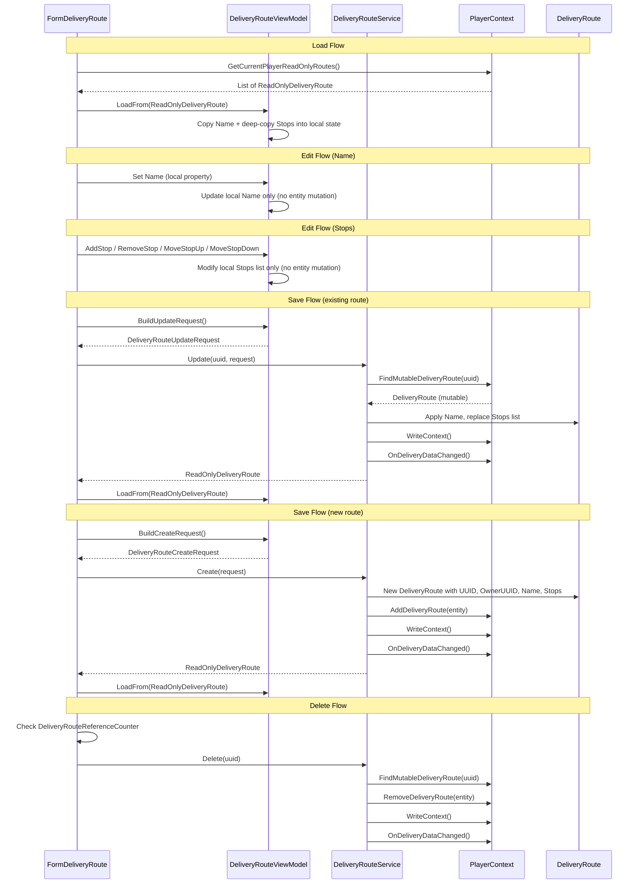

# BL-112 Design: DeliveryRoute Immutable Data Model with Service Layer

## Overview

BL-112 applies the same immutable data model pattern established in BL-108 (blueprints), BL-109 (colonies), BL-110 (surveys), BL-111 (player profiles), and BL-123 (pricing plans) to the DeliveryRoute form. The form stops directly mutating DeliveryRoute entities. The ViewModel becomes a disconnected edit buffer for the route Name and Stops list. A new DeliveryRouteService is the sole mutator of DeliveryRoute entities.

### Key Differences from BL-109 (Colony)

1. **Simpler entity** --- DeliveryRoute has only 1 scalar field (Name) vs Colony's 3 (PlanetName, ColonyName, SystemName). The edit buffer is correspondingly simpler.
2. **No import feature** --- No clipboard import. No Import method on the service.
3. **No background processing** --- No concurrency locks needed. No ReaderWriterLockSlim.
4. **Simpler nested structure** --- RouteStop has 6 fields (ColonyUUID, Sequence, DestinationType, DestinationUUID, Purpose, FuelEstimate) vs ColonyStructure's 30+.
5. **Stops are buffered, not immediate** --- Unlike Colony where structure operations are immediate service calls, route stop add/remove/reorder accumulates in the ViewModel edit buffer until Save.
6. **Dual entity management** --- DeliveryPlan is a separate entity managed by the Plan tab. Plan management is OUT OF SCOPE for BL-112.
7. **ReadOnly wrappers already complete** --- ReadOnlyDeliveryRoute and ReadOnlyRouteStop are fully implemented with no gaps.
8. **No write locks** --- No ReaderWriterLockSlim on DeliveryRoute. The service mutates directly without lock acquisition.
### Similarities to BL-109

1. **Single scalar field** --- Name is a simple string managed by the ViewModel edit buffer.
2. **Single form** --- One form (FormDeliveryRoute) manages the full CRUD lifecycle for routes.
3. **List view with filters** --- Route list has a text filter.
4. **Always player-scoped** --- Routes are always owned by the current player.
5. **Delete reference protection** --- DeliveryRouteReferenceCounter checks delivery plans, overflow rules, and supply chain stages before allowing deletion.
6. **Service as sole mutator** --- Same pattern: form -> ViewModel -> service -> entity.

## Architecture

### Current Architecture

```
Form --write-through--> ViewModel --direct set--> Mutable DeliveryRoute --> JSON
  |
  +-- holds _route (mutable reference via ViewModel.Data)
  +-- TextChanged handler writes directly to entity via ViewModel.Name setter
  +-- ViewModel.Save() persists directly via PlayerContext
  +-- Stop add/remove/reorder mutates entity Stops list directly
  +-- ViewModel.SelectRoute() swaps the mutable entity reference
```

Every keystroke in the route name text box writes directly to the DeliveryRoute entity via the ViewModel Name setter (`_route.Name = value`). Stop operations (AddStop, RemoveStop, MoveStopUp/Down) mutate the entity's Stops list directly. The ViewModel holds a direct DeliveryRoute reference and exposes it via a public `Data` property. The `Save()` method persists directly via PlayerContext.
### Target Architecture

```
Form --local edit--> ViewModel (edit buffer) --save--> DeliveryRouteService --> Mutable DeliveryRoute --> JSON
  ^                       |                                      |
  |                       | copies from                          | fires event
  |                       v                                      v
  +---- refresh <-- ReadOnlyDeliveryRoute <---------------- PlayerContext
```

The form never touches the entity. The ViewModel is a disconnected edit buffer for Name and Stops. The service is the only code that mutates the entity. All stop operations (add, remove, reorder) accumulate in the ViewModel's local Stops list until Save.

### Data Flow


## Components and Interfaces

### ReadOnlyDeliveryRoute (Existing --- No Changes)

Already complete. Exposes UUID, Name, OwnerUUID as read-only properties. Stops exposed as `IReadOnlyList<ReadOnlyRouteStop>` (creates new wrappers on each access). Includes Equals/GetHashCode based on UUID and ToString returning Name.

### ReadOnlyRouteStop (Existing --- No Changes)

Already complete. Exposes all 6 fields as read-only: ColonyUUID, Sequence, DestinationType, DestinationUUID, Purpose, FuelEstimate. Equals uses reference equality on the underlying entity. ToString returns `Stop {Sequence}`.

### PlayerContext: FindMutableDeliveryRoute (New)

A new internal method reusing the existing `_deliveryRouteCache`. Follows the same pattern as FindMutableBlueprint, FindMutableSurvey, and FindMutableColony:

```csharp
internal DeliveryRoute FindMutableDeliveryRoute(string uuid)
{
    if (string.IsNullOrEmpty(uuid)) return null;

    lock (_listLock)
    {
        if (_deliveryRouteCache == null)
        {
            _deliveryRouteCache = new Dictionary<string, DeliveryRoute>();
            foreach (var r in _deliveryRouteList)
            {
                if (r.UUID != null && !_deliveryRouteCache.ContainsKey(r.UUID))
                    _deliveryRouteCache[r.UUID] = r;
            }
        }

        _deliveryRouteCache.TryGetValue(uuid, out var match);
        return match;
    }
}
```

Marked `internal` so only the service project can access it. The existing public `FindDeliveryRoute` remains for other consumers. Reuses the same `_deliveryRouteCache` that `FindDeliveryRoute` already builds and maintains.
### DeliveryRouteViewModel (Edit Buffer)

The ViewModel is simpler than ColonyViewModel because the edit buffer covers only one scalar field (Name) plus the Stops list. Unlike Colony where structure operations are immediate service calls, all stop operations accumulate in the ViewModel until Save.

Key differences from ColonyViewModel:
- **One scalar field only**: Name (vs Colony's 3: PlanetName, ColonyName, SystemName).
- **Stops are part of the edit buffer**: Add/remove/reorder accumulates locally until Save.
- **No Data property**: The public `Data` property exposing the mutable DeliveryRoute is removed.
- **No PlayerContext dependency**: The ViewModel is a plain edit buffer with no service dependencies.
- **Deep-copy stops on load**: LoadFrom creates new RouteStop instances to avoid sharing references with the entity.

```csharp
public class DeliveryRouteViewModel
{
    private static readonly Logger Log = LogManager.GetCurrentClassLogger();

    private ReadOnlyDeliveryRoute _original;  // snapshot for dirty comparison
    private string _uuid;
    private string _ownerUUID = string.Empty;

    // Local edit state --- disconnected from entity
    private string _name = string.Empty;
    private List<RouteStop> _stops = new List<RouteStop>();

    public bool IsNew => _original == null;
    public string UUID => _uuid;
    public string OwnerUUID => _ownerUUID;
    public ReadOnlyDeliveryRoute Original => _original;

    // Editable fields
    public string Name { get => _name; set => _name = value; }
    public List<RouteStop> Stops => _stops;
}
```
#### LoadFrom

```csharp
public void LoadFrom(ReadOnlyDeliveryRoute ro)
{
    _original = ro;
    _uuid = ro.UUID;
    _ownerUUID = ro.OwnerUUID ?? string.Empty;
    _name = ro.Name ?? string.Empty;
    _stops = new List<RouteStop>();
    foreach (var s in ro.Stops)
    {
        _stops.Add(new RouteStop
        {
            ColonyUUID = s.ColonyUUID ?? string.Empty,
            Sequence = s.Sequence,
            DestinationType = s.DestinationType,
            DestinationUUID = s.DestinationUUID ?? string.Empty,
            Purpose = s.Purpose,
            FuelEstimate = s.FuelEstimate,
        });
    }
}
```

#### Reset

```csharp
public void Reset()
{
    _original = null;
    _uuid = null;
    _ownerUUID = string.Empty;
    _name = string.Empty;
    _stops = new List<RouteStop>();
}
```
#### Dirty Tracking

```csharp
public bool IsDirty
{
    get
    {
        if (_original == null)
        {
            return !string.IsNullOrEmpty(_name) || _stops.Count > 0;
        }

        if (_name != (_original.Name ?? string.Empty)) return true;

        var originalStops = _original.Stops;
        if (_stops.Count != originalStops.Count) return true;
        for (int i = 0; i < _stops.Count; i++)
        {
            var local = _stops[i];
            var orig = originalStops[i];
            if (local.ColonyUUID != orig.ColonyUUID) return true;
            if (local.Sequence != orig.Sequence) return true;
            if (local.DestinationType != orig.DestinationType) return true;
            if (local.DestinationUUID != orig.DestinationUUID) return true;
            if (local.Purpose != orig.Purpose) return true;
            if (local.FuelEstimate != orig.FuelEstimate) return true;
        }

        return false;
    }
}
```
#### BuildUpdateRequest / BuildCreateRequest

```csharp
public DeliveryRouteUpdateRequest BuildUpdateRequest()
{
    return new DeliveryRouteUpdateRequest
    {
        Original = _original,
        Name = _name,
        Stops = DeepCopyStops(_stops),
    };
}

public DeliveryRouteCreateRequest BuildCreateRequest()
{
    return new DeliveryRouteCreateRequest
    {
        Name = _name,
        Stops = DeepCopyStops(_stops),
    };
}
```

#### Stop Operations

The existing stop manipulation methods (AddStop, RemoveStop, RemoveStops, MoveStopUp, MoveStopsUp, MoveStopDown, MoveStopsDown) are retained but operate on the local `_stops` list instead of `_route.Stops`. The `RenumberStops()` helper renumbers Sequence values on the local list. No entity mutation occurs.

#### GetFilteredRoutes

The `GetFilteredRoutes` method moves from the ViewModel to the form. The form calls `PlayerContext.GetCurrentPlayerReadOnlyRoutes()` directly and applies the text filter on ReadOnlyDeliveryRoute.Name. The ViewModel no longer needs a PlayerContext reference.
### DeliveryRouteService

Centralizes all DeliveryRoute mutation. The form and ViewModel never touch the entity directly. Only this service (plus JSON deserialization and migration code) mutates DeliveryRoute objects.

Key differences from ColonyService:
- **No write locks**: DeliveryRoute has no ReaderWriterLockSlim. The service mutates directly.
- **No immediate operations**: All mutations (Name + Stops) go through Update or Create. No separate AddStop/RemoveStop service methods.
- **No import**: No clipboard import. No Import method.
- **Simpler Update**: Replaces Name and entire Stops list atomically. No per-field granularity needed.

```csharp
public class DeliveryRouteService
{
    private static readonly Logger Log = LogManager.GetCurrentClassLogger();
    private readonly PlayerContext _playerContext;

    public DeliveryRouteService(PlayerContext playerContext)
    {
        _playerContext = playerContext ?? throw new ArgumentNullException(nameof(playerContext));
    }

    public ReadOnlyDeliveryRoute Update(string uuid, DeliveryRouteUpdateRequest request) { ... }
    public ReadOnlyDeliveryRoute Create(DeliveryRouteCreateRequest request) { ... }
    public void Delete(string uuid) { ... }
}
```
#### Update

Looks up the mutable DeliveryRoute via `FindMutableDeliveryRoute`, applies Name from the request, replaces the Stops list with a deep copy from the request (with correct Sequence numbering), persists, fires event, returns ReadOnlyDeliveryRoute. Throws `InvalidOperationException` if UUID not found.

```csharp
public ReadOnlyDeliveryRoute Update(string uuid, DeliveryRouteUpdateRequest request)
{
    if (string.IsNullOrEmpty(uuid)) throw new ArgumentNullException(nameof(uuid));
    if (request == null) throw new ArgumentNullException(nameof(request));

    var route = _playerContext.FindMutableDeliveryRoute(uuid);
    if (route == null) throw new InvalidOperationException("Route not found: " + uuid);

    route.Name = request.Name;
    route.Stops = DeepCopyStops(request.Stops);
    RenumberStops(route.Stops);

    _playerContext.WriteContext();
    _playerContext.OnDeliveryDataChanged();
    return new ReadOnlyDeliveryRoute(route);
}
```

#### Create

Creates a new DeliveryRoute with generated UUID, sets OwnerUUID to current player, populates Name and Stops from request, adds to PlayerContext, persists, fires event, returns ReadOnlyDeliveryRoute.

#### Delete

Looks up the mutable DeliveryRoute via `FindMutableDeliveryRoute`. If found, removes from PlayerContext via `RemoveDeliveryRoute`, persists, fires event. No-op if UUID is empty or not found. Matches the SurveyService.Delete pattern.
### Unsaved Changes Prompt

The form checks `viewModel.IsDirty` before any operation that would discard the current edit buffer:

- **Selection change** --- user selects a different route in the list view
- **New** --- user clicks the New button
- **Form close** --- user closes the form (X button or MDI close)
- **Application exit** --- MainWindow closing propagates to all MDI children

All four paths use the same three-button dialog: **Save** | **Discard** | **Cancel**.

- **Save**: calls the appropriate service method (Create or Update), then proceeds with the original action.
- **Discard**: discards local changes and proceeds.
- **Cancel**: cancels the original action and keeps the current route selected.

For form close and application exit, Cancel sets `e.Cancel = true` to prevent the close.

### Delete Flow with Reference Protection

1. Check `DeliveryRouteReferenceCounter` for references (delivery plans, overflow rules, supply chain stages).
2. If `TotalCount > 0`: show warning message listing reference counts by type, prevent deletion.
3. If `TotalCount == 0`: prompt for confirmation.
4. On confirm: call `DeliveryRouteService.Delete`, clear form, refresh list.
## Data Models

### DeliveryRouteUpdateRequest (New)

A plain DTO carrying the original snapshot and the current Name and Stops state:

```csharp
public class DeliveryRouteUpdateRequest
{
    /// <summary>
    /// The original snapshot the edit was based on.
    /// Enables field-level dirty detection and optimistic concurrency.
    /// </summary>
    public ReadOnlyDeliveryRoute Original { get; set; }

    public string Name { get; set; }

    public List<RouteStop> Stops { get; set; }
}
```

### DeliveryRouteCreateRequest (New)

A DTO for creating a new route. No Original snapshot (it does not exist yet). No UUID (the service assigns it). No OwnerUUID (the service sets it from the current player).

```csharp
public class DeliveryRouteCreateRequest
{
    public string Name { get; set; }

    public List<RouteStop> Stops { get; set; }
}
```

### DeliveryRoute (Existing --- No Changes)

The existing DeliveryRoute model is unchanged. It has scalar fields (UUID, Name, OwnerUUID) and a nested `List<RouteStop>` Stops collection. No concurrency locks. The service is the only code that mutates it after migration (except deserialization and migration code).

### RouteStop (Existing --- No Changes)

The existing RouteStop model is unchanged. Fields: ColonyUUID (string), Sequence (int), DestinationType (enum: Colony, Station, Asteroid, Ship), DestinationUUID (string), Purpose (enum: Cargo, Refuel, CargoAndRefuel), FuelEstimate (decimal).

### ReadOnlyDeliveryRoute (Existing --- No Changes)

Already complete. No gap fill needed. Exposes UUID, Name, OwnerUUID as read-only. Stops as `IReadOnlyList<ReadOnlyRouteStop>`.

### ReadOnlyRouteStop (Existing --- No Changes)

Already complete. Exposes all 6 fields as read-only: ColonyUUID, Sequence, DestinationType, DestinationUUID, Purpose, FuelEstimate.
## Correctness Properties

*A property is a characteristic or behavior that should hold true across all valid executions of a system --- essentially, a formal statement about what the system should do. Properties serve as the bridge between human-readable specifications and machine-verifiable correctness guarantees.*

### Property 1: LoadFrom Round-Trip Preserves All Fields

*For any* valid DeliveryRoute entity, wrapping in ReadOnlyDeliveryRoute and calling LoadFrom SHALL produce a ViewModel whose local fields exactly match the original entity fields (Name, and every RouteStop in Stops with matching ColonyUUID, Sequence, DestinationType, DestinationUUID, Purpose, FuelEstimate).

**Validates: Requirements 4.1, 4.2, 4.3, 4.4**

### Property 2: IsDirty False Immediately After LoadFrom

*For any* valid DeliveryRoute entity, wrapping in ReadOnlyDeliveryRoute and calling LoadFrom SHALL produce a ViewModel where IsDirty returns false.

**Validates: Requirements 7.1, 7.4**

### Property 3: IsDirty Detects Name Change

*For any* valid DeliveryRoute entity, after LoadFrom, changing the Name field to a different value SHALL cause IsDirty to return true.

**Validates: Requirements 7.1, 7.2**
### Property 4: IsDirty Detects Stops Change

*For any* valid DeliveryRoute entity with at least one stop, after LoadFrom, adding a stop, removing a stop, or modifying any stop field SHALL cause IsDirty to return true.

**Validates: Requirements 7.1, 7.3**

### Property 5: Service.Update Round-Trip

*For any* valid existing DeliveryRoute entity and valid DeliveryRouteUpdateRequest values, calling Service.Update SHALL produce a ReadOnlyDeliveryRoute whose Name matches the request Name and whose Stops match the request Stops (same count, same field values per stop).

**Validates: Requirements 12.3, 12.4, 12.7**

### Property 6: Service.Create Round-Trip

*For any* valid DeliveryRouteCreateRequest values, calling Service.Create SHALL produce a ReadOnlyDeliveryRoute whose Name matches the request Name, whose Stops match the request Stops, and whose UUID is non-empty.

**Validates: Requirements 13.2, 13.4, 13.8**

### Property 7: Service.Delete Removes Route

*For any* valid existing DeliveryRoute entity, calling Service.Delete with the route UUID SHALL cause the route to no longer be findable via PlayerContext.

**Validates: Requirements 14.1, 14.2**

### Property 8: No Direct Mutation Outside Service

AFTER migration, a static analysis grep for direct DeliveryRoute property sets SHALL only find matches in DeliveryRouteService, JSON deserialization, migration code, and the DeliveryRoute class itself.

**Validates: Requirements 18.1, 18.2, 18.3, 21.1, 21.2**
## Error Handling

### Validation

- **Empty route name**: The Save handler validates that Name is not empty or whitespace before calling the service. Shows a MessageBox warning.

### Service Errors

- **Update with non-existent UUID**: `DeliveryRouteService.Update` throws `InvalidOperationException`. The form catches this and shows an error dialog.
- **Delete with empty/non-existent UUID**: `DeliveryRouteService.Delete` returns silently (no error). Matches the SurveyService pattern.
- **Null request**: Both Update and Create throw `ArgumentNullException` for null requests.

### Unsaved Changes Edge Cases

- **Save fails during unsaved changes prompt**: If the service throws during the Save path of the unsaved changes dialog, the form catches the exception, shows an error, and cancels the original action (same as Cancel).
- **Concurrent modification**: Not applicable --- DeliveryRoute has no background processing and no write locks. Single-threaded access from the UI thread only.
- **Plan tab interaction**: The Plan tab continues to work with mutable DeliveryPlan entities. Plan save is independent of route save. No interaction between the two save paths.

### Reference Protection

- **Delete with references**: `DeliveryRouteReferenceCounter` checks delivery plans, overflow rules, and supply chain stages. If `TotalCount > 0`, deletion is blocked with a warning message showing the reference counts by type.
- **Reference counter construction**: Takes `IEnumerable` of plans, overflow rules, and supply chains. Null-safe.
## Testing Strategy

### Dual Testing Approach

- **Property-based tests** (FsCheck + NUnit): Verify universal properties across randomly generated DeliveryRoute inputs. Minimum 25 iterations per property test, following the established pattern from SurveyViewModelPropertyTests and ColonyViewModelPropertyTests.
- **Unit tests** (NUnit): Verify specific examples, edge cases, and error conditions.

### Property-Based Tests

**Library**: FsCheck 2.x with FsCheck.NUnit integration (already in the project).

**Generator**: A `ValidDeliveryRouteGen()` generator that produces random DeliveryRoute entities with:
- Random string Name
- Random UUID and OwnerUUID
- Random number of RouteStop entries (0 to 10), each with random ColonyUUID, Sequence, DestinationType, DestinationUUID, Purpose, and FuelEstimate

**Test files**:

1. `OE2EmpireTracker.Tests/ViewModels/DeliveryRouteViewModelPropertyTests.cs`
   - Feature: bl-112-deliveryroute-readonly, Property 1: LoadFrom round-trip preserves all fields
   - Feature: bl-112-deliveryroute-readonly, Property 2: IsDirty false immediately after LoadFrom
   - Feature: bl-112-deliveryroute-readonly, Property 3: IsDirty detects Name change
   - Feature: bl-112-deliveryroute-readonly, Property 4: IsDirty detects Stops change

2. `OE2EmpireTracker.Tests/Services/DeliveryRouteServicePropertyTests.cs`
   - Feature: bl-112-deliveryroute-readonly, Property 5: Service.Update round-trip
   - Feature: bl-112-deliveryroute-readonly, Property 6: Service.Create round-trip
   - Feature: bl-112-deliveryroute-readonly, Property 7: Service.Delete removes route
**Configuration**: `[FsCheck.NUnit.Property(MaxTest = 25)]` for round-trip and IsDirty-false tests, `[FsCheck.NUnit.Property(MaxTest = 50)]` for the field-change and stops-change tests (more combinations to cover).

### Unit Tests

**Test file**: `OE2EmpireTracker.Tests/Services/DeliveryRouteServiceTests.cs`

- Update with non-existent UUID throws InvalidOperationException
- Delete with empty UUID returns without error
- Delete with non-existent UUID returns without error
- Create assigns non-empty UUID
- Create sets OwnerUUID to current player UUID
- Update fires DeliveryDataChanged event
- Create fires DeliveryDataChanged event
- Delete fires DeliveryDataChanged event
- Update replaces Stops list with correct Sequence numbering
- Create populates Stops list from request

**Test file**: `OE2EmpireTracker.Tests/ViewModels/DeliveryRouteViewModelTests.cs`

- Reset clears all fields to defaults
- IsNew returns true after Reset
- IsNew returns false after LoadFrom
- IsDirty returns true for new route with non-empty Name
- IsDirty returns true for new route with stops
- BuildUpdateRequest copies Name and Stops
- BuildCreateRequest copies Name and Stops
- UUID and OwnerUUID are preserved from LoadFrom
- AddStop increases Stops count by one
- RemoveStop decreases Stops count by one
- MoveStopUp swaps adjacent stops
- MoveStopDown swaps adjacent stops
- RenumberStops assigns sequential Sequence values
### Mutation Guard Test

**Test file**: `OE2EmpireTracker.Tests/Services/DeliveryRouteMutationGuardTests.cs`

A static analysis test (following the pattern of BlueprintMutationGuardTests, SurveyMutationGuardTests, ColonyMutationGuardTests, PlayerProfileMutationGuardTests, and PricingPlanMutationGuardTests) that greps the codebase for direct DeliveryRoute property sets and asserts they only appear in:

- `DeliveryRouteService.cs` (the sole mutator)
- `DeliveryRoute.cs` (the model class itself, default values)
- `PlayerContext.cs` (deserialization/migration)
- Test files (test setup)

Checks for:
- `DeliveryRoute.Name =` (property set)
- `DeliveryRoute.UUID =` (property set)
- `DeliveryRoute.OwnerUUID =` (property set)
- `DeliveryRoute.Stops` mutation (`Stops.Add`, `Stops.Remove`, `Stops.Clear`, `Stops.Insert`, `Stops =`)
- `RouteStop` property sets outside allowed files

This validates Property 8 and Requirements 18.1, 18.2, 18.3, 21.1, 21.2.