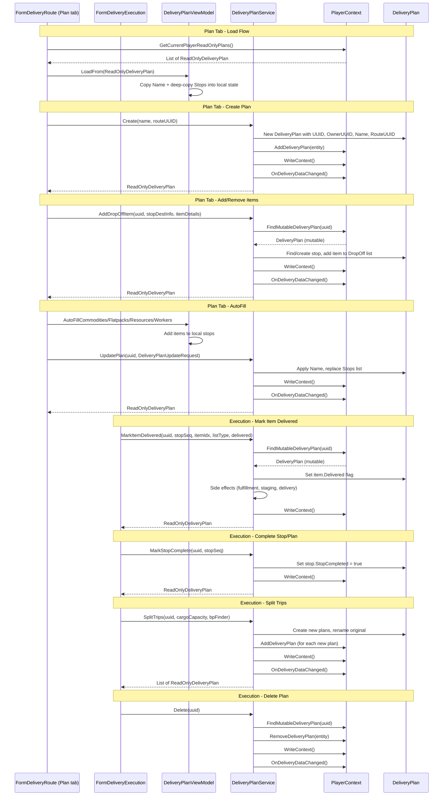

# BL-113 Design: DeliveryPlan Immutable Data Model with Service Layer

## Overview

BL-113 applies the same immutable data model pattern established in BL-108 through BL-123 to DeliveryPlan. Two forms currently mutate DeliveryPlan directly: FormDeliveryRoute (Plan tab) for CRUD and item management, and FormDeliveryExecution for execution operations. A new DeliveryPlanService becomes the sole mutator. The ViewModel becomes a disconnected edit buffer for plan manipulation. Both forms route all mutations through the service.

### Key Differences from BL-112 (DeliveryRoute)

1. **Cross-form mutation** --- Two forms mutate the same entity type. The service must support both buffered plan management and immediate execution operations.
2. **Immediate execution operations** --- MarkItemDelivered, MarkStopComplete, MarkPlanComplete, SetShipUUID persist immediately with side effects on colonies and stations.
3. **Complex nested structure** --- DeliveryPlan has Stops, each with DropOff and PickUp lists of DeliveryItem. Three levels of nesting.
4. **Side effects** --- Marking items delivered triggers commodity fulfillment, flatpack staging, resource delivery, worker delivery, and station hold updates.
5. **Trip splitting** --- Creates multiple new plan entities from one existing plan.
6. **No write locks** --- Single-threaded UI access only.

### Similarities to BL-112

1. **Service as sole mutator** --- Same pattern: form -> service -> entity.
2. **ReadOnly wrappers already complete** --- No gap fill needed.
3. **PlayerContext accessors** --- GetCurrentPlayerReadOnlyPlans exists. FindMutableDeliveryPlan needs to be added.
4. **DeliveryDataChanged event** --- Service fires this after mutations.

## Architecture

### Current Architecture

`
FormDeliveryRoute (Plan tab) --direct--> DeliveryPlanViewModel --direct set--> Mutable DeliveryPlan --> JSON
  |                                           |
  +-- planViewModel.Data.Name = ...           +-- Save() calls WriteContext() directly
  +-- planViewModel.AddDropOffItem(stop,...)   +-- GetOrCreateStop mutates entity Stops
  +-- planViewModel.RemoveDropOffItems(...)    +-- AutoFill methods mutate entity directly
  +-- CmdNewPlan creates entity directly
  +-- CmdDeletePlan removes entity directly

FormDeliveryExecution --direct set--> Mutable DeliveryPlan --> JSON
  |
  +-- item.Delivered = chk.Checked (direct property set)
  +-- stop.StopCompleted = true (direct property set)
  +-- selectedPlan.Completed = true (direct property set)
  +-- selectedPlan.ShipUUID = shipUUID (direct property set)
  +-- CreateSplitTripPlans creates entities directly
`

### Target Architecture

`
FormDeliveryRoute (Plan tab) --calls--> DeliveryPlanService --> Mutable DeliveryPlan --> JSON
  |                                           |
  |                                           | fires event
  |                                           v
  +---- refresh <-- ReadOnlyDeliveryPlan <-- PlayerContext

FormDeliveryExecution --calls--> DeliveryPlanService --> Mutable DeliveryPlan --> JSON
  |                                    |
  |                                    | fires event + side effects
  |                                    v
  +---- refresh <-- ReadOnlyDeliveryPlan <-- PlayerContext
`

The forms never touch the entity. The service is the only code that mutates DeliveryPlan entities. Execution operations trigger side effects (DeliveryFulfillment, station holds) from within the service.

### Data Flow



## Components and Interfaces

### ReadOnlyDeliveryPlan (Existing --- No Changes)

Already complete. Exposes UUID, Name, OwnerUUID, RouteUUID, ShipUUID, Completed as read-only properties. Stops exposed as `IReadOnlyList<ReadOnlyDeliveryPlanStop>` (creates new wrappers on each access). Includes Equals/GetHashCode based on UUID and ToString returning Name.

### ReadOnlyDeliveryPlanStop (Existing --- No Changes)

Already complete. Exposes all fields as read-only: ColonyUUID, Sequence, StopCompleted, DestinationType, DestinationUUID. DropOff and PickUp exposed as `IReadOnlyList<ReadOnlyDeliveryItem>`.

### ReadOnlyDeliveryItem (Existing --- No Changes)

Already complete. Exposes all fields as read-only: ItemType, BaseItemTypeID, Name, ResourcePurity, Quantity, Delivered, ExtendedName.

### PlayerContext: FindMutableDeliveryPlan (New)

A new internal method reusing the existing `_deliveryPlanCache`. Follows the same pattern as FindMutableDeliveryRoute and FindMutableColony:

```csharp
internal DeliveryPlan FindMutableDeliveryPlan(string uuid)
{
    if (string.IsNullOrEmpty(uuid)) return null;

    lock (_listLock)
    {
        if (_deliveryPlanCache == null)
        {
            _deliveryPlanCache = new Dictionary<string, DeliveryPlan>();
            foreach (var p in _deliveryPlanList)
            {
                if (p.UUID != null && !_deliveryPlanCache.ContainsKey(p.UUID))
                    _deliveryPlanCache[p.UUID] = p;
            }
        }

        _deliveryPlanCache.TryGetValue(uuid, out var match);
        return match;
    }
}
```

Marked `internal` so only the service project can access it. Reuses the same `_deliveryPlanCache` that existing plan lookup methods build and maintain.

### DeliveryPlanViewModel (Edit Buffer)

The ViewModel is rewritten as a disconnected edit buffer. It retains its current role as a plan manipulation helper (GetOrCreateStop, AddDropOffItem, AddPickUpItem, RemoveDropOffItems, RemovePickUpItems, AutoFill methods) but loses direct entity access. It operates on a local deep-copy of the plan data.

Key differences from current ViewModel:
- **No Data property**: The public `Data` property exposing the mutable DeliveryPlan is removed.
- **No PlayerContext in constructor**: The ViewModel takes a ReadOnlyDeliveryPlan snapshot instead of a mutable entity.
- **Deep-copy stops on load**: LoadFrom creates new DeliveryPlanStop and DeliveryItem instances to avoid sharing references with the entity.
- **Local state only**: All item operations modify local stops, not the entity.
- **BuildUpdateRequest**: Creates a DeliveryPlanUpdateRequest DTO from local state for the service.

```csharp
public class DeliveryPlanViewModel
{
    private static readonly Logger Log = LogManager.GetCurrentClassLogger();

    private ReadOnlyDeliveryPlan _original;  // snapshot for reference
    private string _uuid;
    private string _ownerUUID = string.Empty;
    private string _routeUUID = string.Empty;
    private string _shipUUID = string.Empty;
    private bool _completed;

    // Local edit state --- disconnected from entity
    private string _name = string.Empty;
    private List<DeliveryPlanStop> _stops = new List<DeliveryPlanStop>();

    public string UUID => _uuid;
    public string OwnerUUID => _ownerUUID;
    public string RouteUUID => _routeUUID;
    public string ShipUUID => _shipUUID;
    public bool Completed => _completed;
    public ReadOnlyDeliveryPlan Original => _original;

    // Editable fields
    public string Name { get => _name; set => _name = value; }
    public List<DeliveryPlanStop> Stops => _stops;
}
```

#### LoadFrom

```csharp
public void LoadFrom(ReadOnlyDeliveryPlan ro)
{
    _original = ro;
    _uuid = ro.UUID;
    _ownerUUID = ro.OwnerUUID ?? string.Empty;
    _routeUUID = ro.RouteUUID ?? string.Empty;
    _shipUUID = ro.ShipUUID ?? string.Empty;
    _completed = ro.Completed;
    _name = ro.Name ?? string.Empty;
    _stops = DeepCopyStops(ro);
}
```

#### BuildUpdateRequest

```csharp
public DeliveryPlanUpdateRequest BuildUpdateRequest()
{
    return new DeliveryPlanUpdateRequest
    {
        Name = _name,
        Stops = DeepCopyLocalStops(_stops),
    };
}
```

#### Item Operations

The existing item manipulation methods (GetOrCreateStop, AddDropOffItem, AddPickUpItem, RemoveDropOffItems, RemovePickUpItems) are retained but operate on the local `_stops` list instead of the entity Stops. No entity mutation occurs.

#### AutoFill Operations

The existing AutoFill methods (AutoFillCommodities, AutoFillFlatpacks, AutoFillManufacturingResources, AutoFillWorkers) are retained. They accept route stops and finder delegates as parameters and add items to local stops. The PlayerContext dependency moves from the constructor to method parameters where needed (AutoFillFlatpacks uses it for blueprint lookup, AutoFillWorkers uses it for worker calculations).

### DeliveryPlanService

Centralizes all DeliveryPlan mutation. Neither form nor ViewModel touches the entity directly. Only this service (plus JSON deserialization and migration code) mutates DeliveryPlan objects.

Key differences from DeliveryRouteService:
- **Many more methods**: CRUD plus item operations, execution operations, and trip splitting.
- **Side effects**: MarkItemDelivered triggers DeliveryFulfillment methods and station hold updates.
- **Immediate operations**: Execution operations persist immediately (no buffering).
- **Trip splitting**: Creates multiple new plan entities from one existing plan.
- **No write locks**: Single-threaded UI access only.

```csharp
public class DeliveryPlanService
{
    private static readonly Logger Log = LogManager.GetCurrentClassLogger();
    private readonly PlayerContext _playerContext;

    public DeliveryPlanService(PlayerContext playerContext) { ... }

    // CRUD
    public ReadOnlyDeliveryPlan Create(string name, string routeUUID) { ... }
    public void Delete(string uuid) { ... }
    public ReadOnlyDeliveryPlan UpdatePlan(string uuid, DeliveryPlanUpdateRequest request) { ... }

    // Item operations
    public ReadOnlyDeliveryPlan AddDropOffItem(string uuid, StopDestinationInfo destInfo, DeliveryItemInfo itemInfo) { ... }
    public ReadOnlyDeliveryPlan AddPickUpItem(string uuid, StopDestinationInfo destInfo, DeliveryItemInfo itemInfo) { ... }
    public ReadOnlyDeliveryPlan RemoveDropOffItems(string uuid, StopDestinationInfo destInfo, IEnumerable<int> indices) { ... }
    public ReadOnlyDeliveryPlan RemovePickUpItems(string uuid, StopDestinationInfo destInfo, IEnumerable<int> indices) { ... }

    // Execution operations
    public ReadOnlyDeliveryPlan MarkItemDelivered(string uuid, int stopSequence, int itemIndex, string listType, bool delivered) { ... }
    public ReadOnlyDeliveryPlan MarkStopComplete(string uuid, int stopSequence) { ... }
    public ReadOnlyDeliveryPlan MarkPlanComplete(string uuid) { ... }
    public ReadOnlyDeliveryPlan SetShipUUID(string uuid, string shipUUID) { ... }

    // Trip splitting
    public List<ReadOnlyDeliveryPlan> SplitTrips(string uuid, decimal cargoCapacity, Func<string, ReadOnlyBlueprint> blueprintFinder) { ... }
}
```

#### Create

Creates a new DeliveryPlan with generated UUID, sets OwnerUUID to current player, populates Name and RouteUUID from parameters, adds to PlayerContext, persists, fires event, returns ReadOnlyDeliveryPlan.

#### Delete

Looks up the mutable DeliveryPlan via `FindMutableDeliveryPlan`. If found, removes from PlayerContext via `RemoveDeliveryPlan`, persists, fires event. No-op if UUID is empty or not found.

#### UpdatePlan

Looks up the mutable DeliveryPlan via `FindMutableDeliveryPlan`, applies Name from the request, replaces the Stops list with a deep copy from the request, persists, fires event, returns ReadOnlyDeliveryPlan. Throws `InvalidOperationException` if UUID not found.

#### AddDropOffItem / AddPickUpItem

Looks up the mutable plan, finds or creates the stop by destination info, adds the item to the appropriate list (DropOff or PickUp), persists, fires event, returns ReadOnlyDeliveryPlan.

#### RemoveDropOffItems / RemovePickUpItems

Looks up the mutable plan, finds the stop by destination info, removes items at the specified indices (descending order to preserve indices), persists, fires event, returns ReadOnlyDeliveryPlan.

#### MarkItemDelivered

Looks up the mutable plan, finds the stop by sequence, finds the item by index in the specified list (DropOff or PickUp), sets the Delivered flag. Triggers side effects based on item type:
- **Commodity**: calls DeliveryFulfillment.FulfillCommodity on the target colony
- **Flatpack**: calls DeliveryFulfillment.StageFlatpack on the target colony
- **WorkDetail**: calls DeliveryFulfillment.DeliverWorkers on the target colony
- **Resource**: calls DeliveryFulfillment.DeliverResource on the target colony
- **Station stop**: updates station hold (add/remove items)

If all items in the plan are delivered after marking, sets Completed to true. Persists, returns ReadOnlyDeliveryPlan.

#### MarkStopComplete

Sets StopCompleted to true on the specified stop. If all items are delivered, sets plan Completed to true. Persists, returns ReadOnlyDeliveryPlan.

#### MarkPlanComplete

Sets Completed to true on the plan. Persists, fires event, returns ReadOnlyDeliveryPlan.

#### SetShipUUID

Sets the ShipUUID field on the plan. Persists, returns ReadOnlyDeliveryPlan.

#### SplitTrips

Uses CargoVolumeService.SplitIntoTrips to compute trip allocations. Creates new DeliveryPlan entities for each additional trip (Trip 2, Trip 3, etc.). Renames the original plan with a "(Trip 1)" suffix. Adds new plans to PlayerContext, persists, fires event, returns the list of new ReadOnlyDeliveryPlan instances.

### DTOs

#### StopDestinationInfo

A lightweight struct/class carrying the destination identity for finding or creating a stop:

```csharp
public class StopDestinationInfo
{
    public string ColonyUUID { get; set; }
    public int Sequence { get; set; }
    public DestinationType DestinationType { get; set; }
    public string DestinationUUID { get; set; }
}
```

#### DeliveryItemInfo

A lightweight struct/class carrying item details for adding to a stop:

```csharp
public class DeliveryItemInfo
{
    public ItemType.ItemTypeEnum ItemType { get; set; }
    public string BaseItemTypeID { get; set; }
    public string Name { get; set; }
    public int Quantity { get; set; }
    public string ResourcePurity { get; set; }
}
```

## Data Models

### DeliveryPlanUpdateRequest (New)

A plain DTO carrying the current plan state from the ViewModel to the service for an update operation:

```csharp
public class DeliveryPlanUpdateRequest
{
    public string Name { get; set; }

    public List<DeliveryPlanStop> Stops { get; set; }
}
```

### DeliveryPlanCreateRequest (New)

A DTO for creating a new plan. No UUID (the service assigns it). No OwnerUUID (the service sets it from the current player).

```csharp
public class DeliveryPlanCreateRequest
{
    public string Name { get; set; }

    public string RouteUUID { get; set; }
}
```

### DeliveryPlan (Existing --- No Changes)

The existing DeliveryPlan model is unchanged. It has scalar fields (UUID, Name, OwnerUUID, RouteUUID, ShipUUID, Completed) and a nested `List<DeliveryPlanStop>` Stops collection. Each stop has `List<DeliveryItem>` DropOff and PickUp lists. No concurrency locks. The service is the only code that mutates it after migration (except deserialization and migration code).

### ReadOnlyDeliveryPlan (Existing --- No Changes)

Already complete. No gap fill needed. Exposes UUID, Name, OwnerUUID, RouteUUID, ShipUUID, Completed as read-only. Stops as `IReadOnlyList<ReadOnlyDeliveryPlanStop>`.

## Correctness Properties

*A property is a characteristic or behavior that should hold true across all valid executions of a system --- essentially, a formal statement about what the system should do. Properties serve as the bridge between human-readable specifications and machine-verifiable correctness guarantees.*

### Property 1: Service.Create Round-Trip

*For any* valid name and routeUUID values, calling DeliveryPlanService.Create SHALL produce a ReadOnlyDeliveryPlan whose Name matches the input name, whose RouteUUID matches the input, and whose UUID is non-empty.

**Validates: Requirements 8.2, 8.4, 8.5, 8.9**

### Property 2: Service.UpdatePlan Round-Trip

*For any* valid existing DeliveryPlan entities and valid DeliveryPlanUpdateRequest values, calling Service.UpdatePlan SHALL produce a ReadOnlyDeliveryPlan whose Name matches the request Name and whose Stops match the request Stops (same count, same field values per stop including DropOff and PickUp items).

**Validates: Requirements 10.3, 10.4, 10.7**

### Property 3: Service.Delete Removes Plan

*For any* valid existing DeliveryPlan entities, calling Service.Delete with the plan UUID SHALL cause the plan to no longer be findable via PlayerContext.

**Validates: Requirements 9.1, 9.2**

### Property 4: Service.MarkItemDelivered Sets Flag

*For any* valid existing DeliveryPlan entities with at least one undelivered item, calling Service.MarkItemDelivered with delivered=true SHALL produce a ReadOnlyDeliveryPlan where the specified item has Delivered=true.

**Validates: Requirements 13.1, 13.2**

### Property 5: Service.MarkStopComplete Sets Flag

*For any* valid existing DeliveryPlan entities with at least one incomplete stop, calling Service.MarkStopComplete SHALL produce a ReadOnlyDeliveryPlan where the specified stop has StopCompleted=true.

**Validates: Requirements 14.1, 14.2**

### Property 6: Service.MarkPlanComplete Sets Flag

*For any* valid existing DeliveryPlan entities, calling Service.MarkPlanComplete SHALL produce a ReadOnlyDeliveryPlan where Completed=true.

**Validates: Requirements 15.1, 15.2**

### Property 7: AddDropOffItem Increases Item Count

*For any* valid existing DeliveryPlan entities, calling Service.AddDropOffItem SHALL produce a ReadOnlyDeliveryPlan where the target stop has one more DropOff item than before.

**Validates: Requirements 11.2, 11.6**

### Property 8: No Direct Mutation Outside Service

AFTER migration, a static analysis grep for direct DeliveryPlan property sets SHALL only find matches in DeliveryPlanService, JSON deserialization, migration code, and the DeliveryPlan class itself.

**Validates: Requirements 21.1, 21.2, 21.3, 21.4, 24.1, 24.2, 24.3**

## Error Handling

### Validation

- **Empty plan name**: The Plan tab validates that Name is not empty before persisting. Shows a MessageBox warning.
- **No route selected**: Plan creation requires a saved route. Shows a MessageBox warning.

### Service Errors

- **UpdatePlan with non-existent UUID**: `DeliveryPlanService.UpdatePlan` throws `InvalidOperationException`. The form catches this and shows an error dialog.
- **Delete with empty/non-existent UUID**: `DeliveryPlanService.Delete` returns silently (no error). Matches the DeliveryRouteService pattern.
- **Null request**: UpdatePlan throws `ArgumentNullException` for null requests.

### Execution Edge Cases

- **Colony not found during fulfillment**: Side effect methods log a warning and skip the operation. The item Delivered flag is still set.
- **Station not found during hold update**: Logs a warning and skips. The item Delivered flag is still set.
- **All items delivered auto-complete**: After MarkItemDelivered, if all items in the plan are delivered, the plan is automatically marked as completed.

### Concurrent Modification

- Not applicable --- DeliveryPlan has no background processing and no write locks. Single-threaded access from the UI thread only.

## Testing Strategy

### Dual Testing Approach

- **Property-based tests** (FsCheck + NUnit): Verify universal properties across randomly generated DeliveryPlan inputs. Minimum 25 iterations per property test, following the established pattern from DeliveryRouteViewModelPropertyTests and DeliveryRouteServicePropertyTests.
- **Unit tests** (NUnit): Verify specific examples, edge cases, and error conditions.

### Property-Based Tests

**Library**: FsCheck 2.x with FsCheck.NUnit integration (already in the project).

**Generator**: A `ValidDeliveryPlanGen()` generator that produces random DeliveryPlan entities with:
- Random string Name, UUID, OwnerUUID, RouteUUID, ShipUUID
- Random Completed flag
- Random number of DeliveryPlanStop entries (0 to 5), each with random ColonyUUID, Sequence, StopCompleted, DestinationType, DestinationUUID
- Each stop with random DropOff and PickUp lists (0 to 3 DeliveryItem entries each)
- Each DeliveryItem with random ItemType, BaseItemTypeID, Name, ResourcePurity, Quantity, Delivered

**Test files**:

1. `OE2EmpireTracker.Tests/ViewModels/DeliveryPlanViewModelPropertyTests.cs`
   - Property: ViewModel LoadFrom round-trip preserves all fields

2. `OE2EmpireTracker.Tests/Services/DeliveryPlanServicePropertyTests.cs`
   - Property 1: Service.Create round-trip
   - Property 2: Service.UpdatePlan round-trip
   - Property 3: Service.Delete removes plan
   - Property 4: Service.MarkItemDelivered sets flag
   - Property 5: Service.MarkStopComplete sets flag
   - Property 6: Service.MarkPlanComplete sets flag
   - Property 7: AddDropOffItem increases item count

**Configuration**: `[FsCheck.NUnit.Property(MaxTest = 25)]` for round-trip tests, `[FsCheck.NUnit.Property(MaxTest = 50)]` for flag-setting tests (more combinations to cover).

### Unit Tests

**Test file**: `OE2EmpireTracker.Tests/Services/DeliveryPlanServiceTests.cs`

- UpdatePlan with non-existent UUID throws InvalidOperationException
- Delete with empty UUID returns without error
- Delete with non-existent UUID returns without error
- Create assigns non-empty UUID
- Create sets OwnerUUID to current player UUID
- Create sets RouteUUID from parameter
- UpdatePlan fires DeliveryDataChanged event
- Create fires DeliveryDataChanged event
- Delete fires DeliveryDataChanged event
- MarkItemDelivered sets Delivered flag
- MarkStopComplete sets StopCompleted flag
- MarkPlanComplete sets Completed flag
- SetShipUUID sets ShipUUID field

**Test file**: `OE2EmpireTracker.Tests/ViewModels/DeliveryPlanViewModelTests.cs`

- LoadFrom copies all scalar fields from ReadOnlyDeliveryPlan
- LoadFrom deep-copies Stops list
- GetOrCreateStop finds existing stop by DestinationUUID
- GetOrCreateStop creates new stop when not found
- AddDropOffItem adds item to stop DropOff list
- AddPickUpItem adds item to stop PickUp list
- RemoveDropOffItems removes items by index
- RemovePickUpItems removes items by index
- BuildUpdateRequest copies Name and Stops

### Mutation Guard Test

**Test file**: `OE2EmpireTracker.Tests/Services/DeliveryPlanMutationGuardTests.cs`

A static analysis test (following the pattern of DeliveryRouteMutationGuardTests) that greps the codebase for direct DeliveryPlan property sets and asserts they only appear in:

- `DeliveryPlanService.cs` (the sole mutator)
- `DeliveryPlan.cs` (the model class itself, default values)
- `PlayerContext.cs` (deserialization/migration)
- Test files (test setup)

Checks for:
- `DeliveryPlan.Name =`, `DeliveryPlan.ShipUUID =`, `DeliveryPlan.Completed =` (property sets)
- `DeliveryPlan.Stops` mutation (`Stops.Add`, `Stops.Remove`, `Stops =`)
- `DeliveryPlanStop.StopCompleted =` (property set)
- `DeliveryItem.Delivered =` (property set)
- `DropOff.Add`, `PickUp.Add` (list mutation)

This validates Property 8 and Requirements 21.1, 21.2, 21.3, 21.4, 24.1, 24.2, 24.3.
