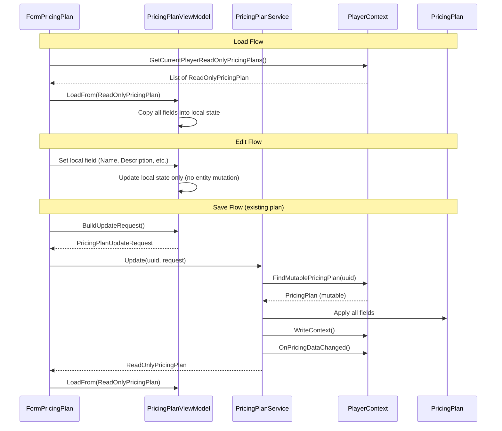

# BL-123 Design: PricingPlan Immutable Data Model with Service Layer

## Overview

BL-123 applies the same immutable data model pattern established in BL-108 (blueprints) and BL-111 (player profiles) to the PricingPlan form. The form stops directly mutating PricingPlan entities. The ViewModel becomes a disconnected edit buffer. A new PricingPlanService is the sole mutator of PricingPlan entities.

### Key Simplifications vs BL-108/BL-111

1. **Flat model** --- PricingPlan has only scalar fields (UUID, Name, OwnerUUID, Description, FixedCostPerItem, HourlyCostRate) plus one `Dictionary<string, decimal>` (ResourcePrices). No nested objects like PlayerRank or PropertyBag.
2. **No import** --- PricingPlan has no clipboard import feature. No Import method needed on the service.
3. **No move** --- No global/player split like Blueprint. Plans are always player-scoped.
4. **No timer** --- Unlike PlayerProfile skill training timer, PricingPlan has no live countdown or timer logic.
5. **ReadOnlyPricingPlan already complete** --- All properties the form needs are already exposed. No gap fill required.

## Architecture

### Current Architecture

```
Form --write-through--> Mutable PricingPlan --> JSON
  |
  +-- holds _selectedPlan (mutable reference)
  +-- TextChanged handlers write directly to entity
  +-- CellValueChanged writes to entity AND persists immediately
```

Every keystroke in a text box writes directly to the PricingPlan entity via `_selectedPlan.Name = txtPlanName.Text`. The resource price grid writes to the entity AND calls `WriteContext()` on every cell change. The form holds a direct `Models.PricingPlan _selectedPlan` reference.

### Target Architecture

```
Form --local edit--> ViewModel (edit buffer) --save--> PricingPlanService --> Mutable PricingPlan --> JSON
  ^                       |                                    |
  |                       | copies from                        | fires event
  |                       v                                    v
  +---- refresh <-- ReadOnlyPricingPlan <-------------- PlayerContext
```

The form never touches the entity. The ViewModel is a disconnected edit buffer. The service is the only code that mutates the entity.

### Data Flow



## Components and Interfaces

### ReadOnlyPricingPlan (Existing --- No Changes Required)

The existing ReadOnlyPricingPlan already exposes all properties the form needs:

| Property | Type | Source |
|----------|------|--------|
| UUID | string | `_entity.UUID` |
| Name | string | `_entity.Name` |
| OwnerUUID | string | `_entity.OwnerUUID` |
| Description | string | `_entity.Description` |
| FixedCostPerItem | decimal | `_entity.FixedCostPerItem` |
| HourlyCostRate | decimal | `_entity.HourlyCostRate` |
| ResourcePrices | `IReadOnlyDictionary<string, decimal>` | `_entity.ResourcePrices` |

No gap fill is required. This is a key simplification over BL-108 and BL-111.

### PlayerContext: FindMutablePricingPlan

A new `internal` method following the same cache-based lookup pattern as `FindMutableBlueprint`:

```csharp
/// <summary>
/// Returns the mutable PricingPlan entity. Only called by PricingPlanService.
/// </summary>
internal PricingPlan FindMutablePricingPlan(string uuid)
{
    if (string.IsNullOrEmpty(uuid)) return null;
    lock (_listLock)
    {
        if (_pricingPlanCache == null)
        {
            _pricingPlanCache = new Dictionary<string, PricingPlan>();
            foreach (var r in _pricingPlanList)
            {
                if (r.UUID != null && !_pricingPlanCache.ContainsKey(r.UUID))
                    _pricingPlanCache[r.UUID] = r;
            }
        }

        _pricingPlanCache.TryGetValue(uuid, out var match);
        return match;
    }
}
```

This is identical to the existing `FindPricingPlan` but marked `internal` to signal it is only for service use. The existing public `FindPricingPlan` remains for other consumers.

### PricingPlanViewModel (Edit Buffer)

The ViewModel is simpler than BlueprintViewModel or PlayerProfileViewModel because PricingPlan has no nested objects --- just scalars and one dictionary.

```csharp
public class PricingPlanViewModel
{
    private static readonly Logger Log = LogManager.GetCurrentClassLogger();

    private ReadOnlyPricingPlan _original;  // snapshot for dirty comparison
    private string _uuid;
    private string _ownerUUID = string.Empty;

    // Local edit state --- disconnected from entity
    private string _name = string.Empty;
    private string _description = string.Empty;
    private decimal _fixedCostPerItem;
    private decimal _hourlyCostRate;
    private Dictionary<string, decimal> _resourcePrices = new Dictionary<string, decimal>();

    public string Name { get => _name; set => _name = value; }
    public string Description { get => _description; set => _description = value; }
    public decimal FixedCostPerItem { get => _fixedCostPerItem; set => _fixedCostPerItem = value; }
    public decimal HourlyCostRate { get => _hourlyCostRate; set => _hourlyCostRate = value; }
    public Dictionary<string, decimal> ResourcePrices => _resourcePrices;

    /// <summary>True if any local field differs from the original snapshot.</summary>
    public bool IsDirty { get { /* see Dirty Tracking section */ } }

    /// <summary>True if this is a new plan not yet saved.</summary>
    public bool IsNew => _original == null;

    public string UUID => _uuid;
    public string OwnerUUID => _ownerUUID;
    public ReadOnlyPricingPlan Original => _original;
}
```

#### LoadFrom

```csharp
public void LoadFrom(ReadOnlyPricingPlan ro)
{
    _original = ro;
    _uuid = ro.UUID;
    _ownerUUID = ro.OwnerUUID;
    _name = ro.Name;
    _description = ro.Description;
    _fixedCostPerItem = ro.FixedCostPerItem;
    _hourlyCostRate = ro.HourlyCostRate;

    // Deep copy ResourcePrices
    _resourcePrices = new Dictionary<string, decimal>(ro.ResourcePrices);
}
```

#### Reset

```csharp
public void Reset()
{
    _original = null;
    _uuid = null;
    _ownerUUID = string.Empty;
    _name = string.Empty;
    _description = string.Empty;
    _fixedCostPerItem = 0m;
    _hourlyCostRate = 0m;
    _resourcePrices = new Dictionary<string, decimal>();
}
```

#### Dirty Tracking

```csharp
public bool IsDirty
{
    get
    {
        if (_original == null)
        {
            // New plan --- dirty once any field has a non-default value
            return !string.IsNullOrEmpty(_name)
                || !string.IsNullOrEmpty(_description)
                || _fixedCostPerItem != 0m
                || _hourlyCostRate != 0m
                || _resourcePrices.Count > 0;
        }

        // Scalar fields
        if (_name != _original.Name) return true;
        if (_description != _original.Description) return true;
        if (_fixedCostPerItem != _original.FixedCostPerItem) return true;
        if (_hourlyCostRate != _original.HourlyCostRate) return true;

        // ResourcePrices dictionary
        if (!ResourcePricesEqual(_resourcePrices, _original.ResourcePrices)) return true;

        return false;
    }
}

private static bool ResourcePricesEqual(
    Dictionary<string, decimal> local,
    IReadOnlyDictionary<string, decimal> original)
{
    if (local.Count != original.Count) return false;
    foreach (var kvp in local)
    {
        if (!original.TryGetValue(kvp.Key, out decimal origVal)) return false;
        if (kvp.Value != origVal) return false;
    }
    return true;
}
```

#### BuildUpdateRequest / BuildCreateRequest

```csharp
public PricingPlanUpdateRequest BuildUpdateRequest()
{
    return new PricingPlanUpdateRequest
    {
        Original = _original,
        Name = _name,
        Description = _description,
        FixedCostPerItem = _fixedCostPerItem,
        HourlyCostRate = _hourlyCostRate,
        ResourcePrices = new Dictionary<string, decimal>(_resourcePrices),
    };
}

public PricingPlanCreateRequest BuildCreateRequest()
{
    return new PricingPlanCreateRequest
    {
        Name = _name,
        Description = _description,
        FixedCostPerItem = _fixedCostPerItem,
        HourlyCostRate = _hourlyCostRate,
        ResourcePrices = new Dictionary<string, decimal>(_resourcePrices),
    };
}
```

### PricingPlanService

Centralizes all PricingPlan mutation. The form and ViewModel never touch the entity directly. Only this service (plus deserialization and migration) mutates PricingPlan objects. Follows the same pattern as BlueprintService and PlayerProfileService.

```csharp
public class PricingPlanService
{
    private static readonly Logger Log = LogManager.GetCurrentClassLogger();
    private readonly PlayerContext _playerContext;

    public PricingPlanService(PlayerContext playerContext)
    {
        _playerContext = playerContext ?? throw new ArgumentNullException(nameof(playerContext));
    }

    public ReadOnlyPricingPlan Update(string uuid, PricingPlanUpdateRequest request)
    {
        if (string.IsNullOrEmpty(uuid)) throw new ArgumentNullException(nameof(uuid));
        if (request == null) throw new ArgumentNullException(nameof(request));

        var plan = _playerContext.FindMutablePricingPlan(uuid);
        if (plan == null) throw new InvalidOperationException("PricingPlan not found: " + uuid);

        Log.Info("PricingPlanService.Update: UUID={0} name='{1}' -> '{2}'", uuid, plan.Name, request.Name);

        plan.Name = request.Name;
        plan.Description = request.Description;
        plan.FixedCostPerItem = request.FixedCostPerItem;
        plan.HourlyCostRate = request.HourlyCostRate;
        plan.ResourcePrices = new Dictionary<string, decimal>(request.ResourcePrices);

        _playerContext.WriteContext();
        _playerContext.OnPricingDataChanged();
        return new ReadOnlyPricingPlan(plan);
    }

    public ReadOnlyPricingPlan Create(PricingPlanCreateRequest request)
    {
        if (request == null) throw new ArgumentNullException(nameof(request));

        var plan = new PricingPlan();
        plan.UUID = Guid.NewGuid().ToString();
        plan.OwnerUUID = _playerContext.CurrentPlayerUUID;
        plan.Name = request.Name;
        plan.Description = request.Description;
        plan.FixedCostPerItem = request.FixedCostPerItem;
        plan.HourlyCostRate = request.HourlyCostRate;
        plan.ResourcePrices = new Dictionary<string, decimal>(request.ResourcePrices);

        Log.Info("PricingPlanService.Create: name='{0}' UUID={1}", plan.Name, plan.UUID);

        _playerContext.AddPricingPlan(plan);
        _playerContext.WriteContext();
        _playerContext.OnPricingDataChanged();
        return new ReadOnlyPricingPlan(plan);
    }

    public void Delete(string uuid)
    {
        if (string.IsNullOrEmpty(uuid)) return;

        var plan = _playerContext.FindMutablePricingPlan(uuid);
        if (plan == null) return;

        Log.Info("PricingPlanService.Delete: UUID={0} name='{1}'", uuid, plan.Name);

        _playerContext.RemovePricingPlan(plan);
        _playerContext.WriteContext();
        _playerContext.OnPricingDataChanged();
    }
}
```

### Save Flow

```
User clicks Save
    |
    v
viewModel.IsNew?  (i.e. _original == null)
    |
    +-- YES (new plan)
    |     v
    |   Form calls viewModel.BuildCreateRequest()
    |   Form calls pricingPlanService.Create(request)
    |     v
    |   Service creates PricingPlan, assigns UUID, adds to list
    |   Service persists, fires PricingDataChanged
    |     v
    |   Form refreshes list, selects new plan by UUID
    |   ViewModel.LoadFrom(new ReadOnlyPricingPlan)
    |
    +-- NO (existing plan)
          v
        Form calls viewModel.BuildUpdateRequest()
        Form calls pricingPlanService.Update(viewModel.UUID, request)
          v
        Service looks up mutable PricingPlan, applies changes
        Service persists, fires PricingDataChanged
          v
        Form refreshes list, re-selects plan
        ViewModel.LoadFrom(updated ReadOnlyPricingPlan)
    |
    v
ViewModel._original is now set, IsDirty = false
```

### Unsaved Changes Prompt

The form checks `viewModel.IsDirty` before any operation that would discard the current edit buffer:

- **Selection change** --- user selects a different plan in the list view
- **New** --- user clicks the New button
- **Form close** --- user closes the form (X button or MDI close)
- **Application exit** --- MainWindow closing propagates to all MDI children

All four paths use the same three-button dialog: **Save** | **Discard** | **Cancel**.

- **Save**: calls the appropriate service method (Create or Update), then proceeds with the original action.
- **Discard**: discards local changes and proceeds.
- **Cancel**: cancels the original action and keeps the current plan selected.

For form close and application exit, Cancel sets `e.Cancel = true` to prevent the close.

## Data Models

### PricingPlanUpdateRequest

A plain DTO carrying the original snapshot and the current local state. Follows the same pattern as BlueprintUpdateRequest:

```csharp
public class PricingPlanUpdateRequest
{
    /// <summary>
    /// The original snapshot the edit was based on.
    /// Enables field-level dirty detection and optimistic concurrency.
    /// </summary>
    public ReadOnlyPricingPlan Original { get; set; }

    public string Name { get; set; }
    public string Description { get; set; }
    public decimal FixedCostPerItem { get; set; }
    public decimal HourlyCostRate { get; set; }
    public Dictionary<string, decimal> ResourcePrices { get; set; }
}
```

### PricingPlanCreateRequest

A DTO for creating a new pricing plan. No Original snapshot (it does not exist yet). No UUID (the service assigns it). No OwnerUUID (the service sets it from the current player).

```csharp
public class PricingPlanCreateRequest
{
    public string Name { get; set; }
    public string Description { get; set; }
    public decimal FixedCostPerItem { get; set; }
    public decimal HourlyCostRate { get; set; }
    public Dictionary<string, decimal> ResourcePrices { get; set; }
}
```

### PricingPlan (Existing --- No Changes)

The existing PricingPlan model is unchanged. It has flat scalar fields plus one `Dictionary<string, decimal>` for ResourcePrices. The service is the only code that mutates it after migration.

### ReadOnlyPricingPlan (Existing --- No Changes)

Already complete. Exposes all properties as read-only. Includes `Equals`/`GetHashCode` based on UUID and `ToString` returning Name.

## Correctness Properties

*A property is a characteristic or behavior that should hold true across all valid executions of a system --- essentially, a formal statement about what the system should do. Properties serve as the bridge between human-readable specifications and machine-verifiable correctness guarantees.*

### Property 1: LoadFrom Round-Trip Preserves All Fields

*For any* valid PricingPlan entity, wrapping in ReadOnlyPricingPlan and calling LoadFrom SHALL produce a ViewModel whose local fields exactly match the original entity's fields (Name, Description, FixedCostPerItem, HourlyCostRate, UUID, OwnerUUID, and every key-value pair in ResourcePrices).

**Validates: Requirements 4.1, 4.2, 4.4**

### Property 2: IsDirty False Immediately After LoadFrom

*For any* valid PricingPlan entity, wrapping in ReadOnlyPricingPlan and calling LoadFrom SHALL produce a ViewModel where IsDirty returns false.

**Validates: Requirements 7.1, 7.4**

### Property 3: IsDirty Detects Any Single Field Change

*For any* valid PricingPlan entity, after LoadFrom, changing any single field (Name, Description, FixedCostPerItem, HourlyCostRate, or any single ResourcePrices entry) to a different value SHALL cause IsDirty to return true.

**Validates: Requirements 7.1, 7.2, 7.3**

### Property 4: Service.Update Round-Trip

*For any* valid existing PricingPlan entity and valid PricingPlanUpdateRequest values, calling Service.Update SHALL produce a ReadOnlyPricingPlan whose fields match the request values (Name, Description, FixedCostPerItem, HourlyCostRate, ResourcePrices).

**Validates: Requirements 12.3, 12.4, 12.7**

### Property 5: Service.Create Round-Trip

*For any* valid PricingPlanCreateRequest values, calling Service.Create SHALL produce a ReadOnlyPricingPlan whose fields match the request values and whose UUID is non-empty.

**Validates: Requirements 13.2, 13.4, 13.8**

### Property 6: Service.Delete Removes Plan

*For any* valid existing PricingPlan entity, calling Service.Delete with the plan's UUID SHALL cause the plan to no longer be findable via PlayerContext.

**Validates: Requirements 14.1, 14.2**

## Error Handling

### Validation

- **Empty plan name**: The Save handler validates that the plan name is not empty or whitespace before calling the service. Shows a MessageBox warning.
- **Negative costs**: The Save handler validates that FixedCostPerItem and HourlyCostRate are non-negative. Shows a MessageBox warning.
- **Invalid decimal input**: `txtFixedCost` and `txtHourlyCost` TextChanged handlers use `decimal.TryParse` and only update the ViewModel on valid input.
- **Resource price validation**: `DgvResourcePrices_CellValidating` rejects non-numeric and negative values with row-level error text.

### Service Errors

- **Update with non-existent UUID**: `PricingPlanService.Update` throws `InvalidOperationException`. The form should catch this and show an error dialog.
- **Delete with empty/non-existent UUID**: `PricingPlanService.Delete` returns silently (no error). This matches the BlueprintService pattern.
- **Null request**: Both `Update` and `Create` throw `ArgumentNullException` for null requests.

### Unsaved Changes Edge Cases

- **Save fails during unsaved changes prompt**: If the service throws during the Save path of the unsaved changes dialog, the form should catch the exception, show an error, and cancel the original action (same as Cancel).
- **Concurrent modification**: If another form modifies the same plan between load and save, the service overwrites with the ViewModel's state. This is acceptable for a single-user desktop app.

## Testing Strategy

### Dual Testing Approach

- **Property-based tests** (FsCheck + NUnit): Verify universal properties across randomly generated PricingPlan inputs. Minimum 25 iterations per property test, following the established pattern from BlueprintViewModelPropertyTests and PlayerProfileViewModelPropertyTests.
- **Unit tests** (NUnit): Verify specific examples, edge cases, and error conditions.

### Property-Based Tests

**Library**: FsCheck 2.x with FsCheck.NUnit integration (already in the project).

**Generator**: Reuse the `ValidPricingPlanGen()` pattern from `PricingPlanSerializationPropertyTests` --- generates random PricingPlan entities with random scalar fields and random ResourcePrices dictionaries using the `SampleResourceNames` array and `NonNegativeDecimalGen()`.

**Test files**:

1. `OE2EmpireTracker.Tests/ViewModels/PricingPlanViewModelPropertyTests.cs`
   - Feature: bl-123-pricingplan-readonly, Property 1: LoadFrom round-trip preserves all fields
   - Feature: bl-123-pricingplan-readonly, Property 2: IsDirty false immediately after LoadFrom
   - Feature: bl-123-pricingplan-readonly, Property 3: IsDirty detects any single field change

2. `OE2EmpireTracker.Tests/Services/PricingPlanServicePropertyTests.cs`
   - Feature: bl-123-pricingplan-readonly, Property 4: Service.Update round-trip
   - Feature: bl-123-pricingplan-readonly, Property 5: Service.Create round-trip
   - Feature: bl-123-pricingplan-readonly, Property 6: Service.Delete removes plan

**Configuration**: `[FsCheck.NUnit.Property(MaxTest = 25)]` for round-trip and IsDirty-false tests, `[FsCheck.NUnit.Property(MaxTest = 50)]` for the single-field-change test (more field combinations to cover).

### Unit Tests

**Test file**: `OE2EmpireTracker.Tests/Services/PricingPlanServiceTests.cs`

- Update with non-existent UUID throws InvalidOperationException
- Delete with empty UUID returns without error
- Delete with non-existent UUID returns without error
- Create assigns non-empty UUID
- Create sets OwnerUUID to current player UUID
- Update fires PricingDataChanged event
- Create fires PricingDataChanged event
- Delete fires PricingDataChanged event

**Test file**: `OE2EmpireTracker.Tests/ViewModels/PricingPlanViewModelTests.cs`

- Reset clears all fields to defaults
- IsNew returns true after Reset
- IsNew returns false after LoadFrom
- IsDirty returns true for new plan with non-default Name
- BuildUpdateRequest copies all fields
- BuildCreateRequest copies all fields

### Mutation Guard Test

**Test file**: `OE2EmpireTracker.Tests/Services/PricingPlanMutationGuardTests.cs`

A static analysis test (following the pattern of `BlueprintMutationGuardTests` and `PlayerProfileMutationGuardTests`) that greps the codebase for direct PricingPlan property sets and asserts they only appear in:

- `PricingPlanService.cs`
- `PricingPlan.cs` (the model itself)
- JSON deserialization (Newtonsoft.Json)
- Migration code
- Test code

**Validates: Requirements 17.1, 17.2, 17.3, 20.1**

### Verification Checklist

- [ ] All existing tests pass (Requirement 18.1)
- [ ] `node .kiro/tools/audit.js` reports no new findings (Requirement 19.1)
- [ ] Mutation guard test passes (Requirement 20.1)
- [ ] Build produces zero errors and zero warnings
