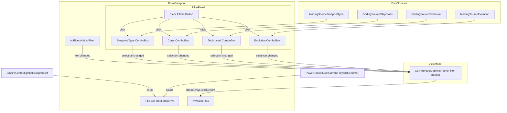

# Design Document: Blueprint Form Filters

## Overview

This feature adds two capabilities to `FormBlueprint`:

1. A dynamic title bar showing live counts of global and player blueprints (e.g. "Blueprints - Global: 42 Player: 7").
2. A filter panel with four ComboBox controls (Blueprint Type, Class, Tech Level, Evolution) plus a Clear Filters button, inserted between the existing text filter and the ListView. All filters combine with logical AND.

The filtering logic lives in `BlueprintViewModel.GetFilteredBlueprints`, which currently accepts only a text filter string. This method will be extended to accept structured filter criteria. The UI controls are created in code-behind to avoid modifying the Designer file.

## Architecture



The design follows the existing layered pattern: Form → ViewModel → Data. The ViewModel owns the filtering logic; the Form reads filter state from its controls and passes it down.

### Key Design Decisions

1. **Filter criteria as a plain class, not a struct**: A `BlueprintFilterCriteria` class with nullable/optional fields keeps the ViewModel signature clean and avoids a growing parameter list. A null field means "no filter on this dimension."

2. **Controls created in code-behind**: The requirements mandate no Designer changes. Controls are created in a new `InitFilterPanel()` method called from the constructor after `InitializeComponent()`.

3. **Title bar updated via a single helper method**: `UpdateTitleBarCounts()` is called from the constructor, from `OnBlueprintDataChanged`, and from `OnCurrentPlayerChanged`. This avoids duplicating the format string.

4. **Existing `GetFilteredBlueprints(string)` overload preserved**: A new overload `GetFilteredBlueprints(string, BlueprintFilterCriteria)` is added. The old single-parameter overload delegates to the new one with `null` criteria, maintaining backward compatibility.

## Components and Interfaces

### BlueprintFilterCriteria (new class)

Location: `OE2EmpireTracker/ViewModels/BlueprintFilterCriteria.cs`

```csharp
public class BlueprintFilterCriteria
{
    public string BlueprintTypeId { get; set; }   // null = no filter
    public int? ShipClassId { get; set; }          // null = no filter
    public string TechLevelName { get; set; }      // null = no filter
    public int? Evolution { get; set; }            // null = no filter
}
```

### BlueprintViewModel changes

- New overload: `GetFilteredBlueprints(string nameFilter, BlueprintFilterCriteria criteria)`
- Applies each non-null criteria field as an additional `.Where()` predicate after the existing text filter logic.
- Original `GetFilteredBlueprints(string)` calls the new overload with `criteria: null`.

### FormBlueprint changes

New private fields:
- `FlowLayoutPanel flpFilterPanel`
- `ComboBox cmbFilterType, cmbFilterClass, cmbFilterTechLevel, cmbFilterEvolution`
- `Button btnClearFilters`

New methods:
- `InitFilterPanel()` — creates controls, binds data sources, wires events. Called from constructor.
- `UpdateTitleBarCounts()` — sets `this.Text` to the formatted count string.
- `RefreshBlueprintList()` — reads all filter controls, builds `BlueprintFilterCriteria`, calls `GetFilteredBlueprints`, calls `PopulateListView`. Replaces direct inline calls.

Event wiring:
- Each filter ComboBox `SelectedIndexChanged` → `RefreshBlueprintList()`
- `btnClearFilters.Click` → reset all four ComboBoxes to `SelectedIndex = -1`, then `RefreshBlueprintList()`
- `txtBlueprintListFilter.TextChanged` → `RefreshBlueprintList()` (replaces current inline handler)
- `OnBlueprintDataChanged` and `OnCurrentPlayerChanged` → call `UpdateTitleBarCounts()` in addition to existing logic

## Data Models

### BlueprintFilterCriteria

| Field | Type | Meaning |
|---|---|---|
| BlueprintTypeId | `string` | Matches `Blueprint.BluePrintType`. Null = no filter. |
| ShipClassId | `int?` | Matches `Blueprint.Class`. Null = no filter. |
| TechLevelName | `string` | Matches `Blueprint.TechLevel`. Null = no filter. |
| Evolution | `int?` | Matches `Blueprint.Evolution`. Null = no filter. |

### Existing models (unchanged)

- `Blueprint`: has `BluePrintType` (string), `Class` (int), `TechLevel` (string), `Evolution` (int)
- `BlueprintType`: has `Id` (string), `Name` (string)
- `ShipClass`: has `Id` (int), `Name` (string)
- `TechLevel`: has `Name` (string)
- Evolution: stored as `BindingList<string>` of "0" through "15" in `EmpireContext`


## Correctness Properties

*A property is a characteristic or behavior that should hold true across all valid executions of a system — essentially, a formal statement about what the system should do. Properties serve as the bridge between human-readable specifications and machine-verifiable correctness guarantees.*

### Property 1: Title bar format correctness

*For any* pair of non-negative integers (globalCount, playerCount), the title bar text produced by `UpdateTitleBarCounts` shall equal `"Blueprints - Global: {globalCount} Player: {playerCount}"`. When playerCount is 0 (no player selected), the string still follows this format with `Player: 0`.

**Validates: Requirements 1.1, 1.4**

### Property 2: Combined filter AND semantics

*For any* list of blueprints, any text filter string (including null/empty), and any `BlueprintFilterCriteria` (where each field is independently null or set to a valid value), every blueprint returned by `GetFilteredBlueprints(nameFilter, criteria)` must satisfy ALL active constraints simultaneously:
- If `nameFilter` is non-empty, the blueprint's `ExtendedName` or `BluePrintType` must contain the text (case-insensitive).
- If `criteria.BlueprintTypeId` is non-null, the blueprint's `BluePrintType` must equal it.
- If `criteria.ShipClassId` is non-null, the blueprint's `Class` must equal it.
- If `criteria.TechLevelName` is non-null, the blueprint's `TechLevel` must equal it.
- If `criteria.Evolution` is non-null, the blueprint's `Evolution` must equal it.

Additionally, no blueprint satisfying all active constraints shall be excluded from the result (completeness).

**Validates: Requirements 3.2, 4.2, 5.2, 6.2, 7.1**

## Error Handling

| Scenario | Handling |
|---|---|
| `EmpireContext.globalBlueprintList` is null | Title bar shows `Global: 0`. `GetFilteredBlueprints` treats as empty list. |
| No player selected (`CurrentPlayerUUID` is empty) | Title bar shows `Player: 0`. `GetCurrentPlayerBlueprints()` returns empty list. |
| ComboBox `SelectedItem` is null after programmatic reset | `RefreshBlueprintList` reads null and sets the corresponding criteria field to null (no filter). |
| Filter criteria fields are all null | `GetFilteredBlueprints` returns all blueprints (text filter only), same as current behavior. |

No new exceptions are introduced. The filter logic uses null-checks on criteria fields to skip inactive filters.

## Testing Strategy

### Unit Tests

Unit tests cover specific examples and edge cases:
- Title bar format with zero counts, large counts, and typical counts.
- Filtering with an empty blueprint list returns empty.
- Clearing all filters returns the full merged list.
- A filter value that matches no blueprints returns empty.

### Property-Based Tests

Property tests use **FsCheck 2.16.6** with **FsCheck.NUnit** (already in the test project). Each property test runs a minimum of 100 iterations.

Each correctness property maps to a single `[FsCheck.NUnit.Property(MaxTest = 100)]` test method:

- **Property 1** test: Generate random non-negative integer pairs, call the title-bar formatting logic, assert the output matches the expected format string.
  - Tag: `Feature: blueprint-form-filters, Property 1: Title bar format correctness`

- **Property 2** test: Generate random lists of blueprints (with random BluePrintType, Class, TechLevel, Evolution values drawn from small pools), random text filter strings, and random `BlueprintFilterCriteria` (each field independently null or set). Call `GetFilteredBlueprints`, then verify every result satisfies all active constraints AND every input blueprint satisfying all constraints appears in the result.
  - Tag: `Feature: blueprint-form-filters, Property 2: Combined filter AND semantics`

### Test Configuration

- Library: FsCheck 2.16.6 + FsCheck.NUnit
- Minimum iterations: 100 per property (`MaxTest = 100`)
- Test location: `OE2EmpireTracker.Tests/ViewModels/BlueprintFilterPropertyTests.cs`
- Each test method includes a summary comment with the tag: `Feature: {feature_name}, Property {number}: {property_text}`
- Each correctness property is implemented by a single property-based test
- Run via: `vstest.console.exe OE2EmpireTracker.Tests/bin/Debug/OE2EmpireTracker.Tests.dll`
