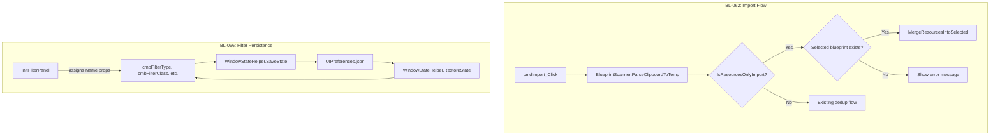

# Design Document: Blueprint Form Fixes (BL-062, BL-066)

## Overview

This design addresses two bugs in the Blueprint form:

1. **BL-062 — Resources-only import detection**: When a player copies the resources tab of an evolved blueprint from the game, the parsed `Blueprint` object lacks key dedup fields (`BluePrintType`, `Class`, `TechLevel`). The current `cmdImport_Click` flow passes this incomplete object to `FindByDedupKey`, which fails to match, causing a new broken blueprint to be created. The fix introduces a detection step that identifies resources-only clipboard data and routes it to update the currently selected blueprint instead.

2. **BL-066 — Filter combo box persistence**: The five filter controls (`cmbFilterType`, `cmbFilterClass`, `cmbFilterTechLevel`, `cmbFilterEvolution`, `chkEvolutionAndAbove`) are created dynamically in `InitFilterPanel()` without `Name` properties. `WindowStateHelper.SaveControlStates` skips controls with empty names, so filter state is never persisted. The fix assigns `Name` properties so the existing save/restore infrastructure handles them automatically.

## Architecture

Both fixes are localized changes within the existing architecture. No new layers or services are introduced.



## Components and Interfaces

### BL-062: Resources-Only Import

#### New static method: `MarketBlueprintImporter.IsResourcesOnlyImport`

```csharp
/// <summary>
/// Returns true when the parsed blueprint has resources but is missing
/// the key dedup fields, indicating it came from the game's resources tab.
/// </summary>
internal static bool IsResourcesOnlyImport(Blueprint bp)
```

**Logic**: Returns `true` when:
- `bp.Resources != null && bp.Resources.Count > 0`
- AND `string.IsNullOrEmpty(bp.BluePrintType)`
- AND `bp.Class == 0`
- AND `string.IsNullOrEmpty(bp.TechLevel)`

This is a pure function on the `Blueprint` model — no side effects, no dependencies.

#### New static method: `MarketBlueprintImporter.MergeResourcesOnly`

```csharp
/// <summary>
/// Merges resources (and any parsed properties) from incoming into target,
/// preserving all existing scalar fields and protected properties.
/// </summary>
internal static void MergeResourcesOnly(Blueprint target, Blueprint incoming)
```

**Logic**:
1. Replace `target.Resources` with `incoming.Resources`.
2. If `incoming.Properties != null && incoming.Properties.Count > 0`, merge them into `target.Properties` using the same protected-property logic as `UpdateExisting` (preserving "Manufacture Run Time" and "Power Required").
3. Do NOT overwrite any scalar fields (`Name`, `BluePrintType`, `Class`, `TechLevel`, `Evolution`, `UUID`, `OwnerUUID`, `NickName`, `CopyCost`, `Description`, `BaseBlueprintUUID`).

#### Modified method: `FormBlueprint.cmdImport_Click`

Insert a new branch after `ParseClipboardToTemp()` succeeds and before the existing dedup logic:

```
if IsResourcesOnlyImport(tempBP):
    if viewModel.Data.UUID is empty:
        show error "Select or import a blueprint first"
        return
    MergeResourcesOnly(viewModel.Data, tempBP)
    persist (global or player depending on which list contains viewModel.Data)
    raise BlueprintDataChanged
    refresh UI, re-select the blueprint
    return
// ... existing dedup flow continues
```

### BL-066: Filter Combo Box Naming

#### Modified method: `FormBlueprint.InitFilterPanel`

Add `Name` property assignments to each dynamically created control:

```csharp
cmbFilterType = new ComboBox { ..., Name = "cmbFilterType" };
cmbFilterClass = new ComboBox { ..., Name = "cmbFilterClass" };
cmbFilterTechLevel = new ComboBox { ..., Name = "cmbFilterTechLevel" };
cmbFilterEvolution = new ComboBox { ..., Name = "cmbFilterEvolution" };
chkEvolutionAndAbove = new CheckBox { ..., Name = "chkEvolutionAndAbove" };
```

No changes to `WindowStateHelper` are needed — it already walks the control tree, saves `ComboBox` and `CheckBox` controls by name, and restores them. The `RestoreComboState` method already handles the case where a saved value no longer exists in the items list (falls back to default).

#### Form open/close integration

`FormBlueprint` already calls `WindowStateHelper.SaveState` on close and `WindowStateHelper.RestoreState` on open (via the MDI child lifecycle in `MainWindow`). Once the controls have names, persistence works automatically.

After `RestoreState` runs, the restored combo selections will trigger `SelectedIndexChanged` events which call `RefreshBlueprintList()`, so the list view will automatically reflect the restored filters.

## Data Models

No new data models are introduced. The existing models are sufficient:

- **`Blueprint`** — unchanged. The `Resources` dictionary and `Properties` bag are the merge targets for BL-062.
- **`UIPreferences` / `FormControlState` / `ComboState`** — unchanged. Already supports `ComboSelections` and `CheckStates` dictionaries keyed by control name.
- **`BlueprintFilterCriteria`** — unchanged. Used by `RefreshBlueprintList()` to build filter queries.


## Correctness Properties

*A property is a characteristic or behavior that should hold true across all valid executions of a system — essentially, a formal statement about what the system should do. Properties serve as the bridge between human-readable specifications and machine-verifiable correctness guarantees.*

### Property 1: IsResourcesOnlyImport classification

*For any* `Blueprint` object with arbitrary `Resources` (0 or more entries), `BluePrintType` (null, empty, or non-empty), `Class` (0 or positive), and `TechLevel` (null, empty, or non-empty), `IsResourcesOnlyImport` shall return `true` if and only if `Resources.Count > 0` AND `BluePrintType` is null or empty AND `Class == 0` AND `TechLevel` is null or empty.

**Validates: Requirements 1.1, 1.2, 1.3**

### Property 2: MergeResourcesOnly replaces resources and preserves all other fields

*For any* target `Blueprint` with a non-empty UUID, arbitrary scalar fields (Name, BluePrintType, Class, TechLevel, Evolution, OwnerUUID, NickName, CopyCost, Description, BaseBlueprintUUID), arbitrary Properties (including protected keys "Manufacture Run Time" and "Power Required"), and *for any* incoming `Blueprint` with arbitrary Resources and Properties, after calling `MergeResourcesOnly(target, incoming)`:
- `target.Resources` equals `incoming.Resources`
- All scalar fields on `target` are unchanged from their pre-call values
- Protected property keys ("Manufacture Run Time", "Power Required") on `target` retain their pre-call values if they existed before the merge
- Non-protected property keys from `incoming` are present in `target.Properties`

**Validates: Requirements 2.1, 2.2, 3.1, 3.2, 3.3**

### Property 3: WindowStateHelper ComboBox/CheckBox save-restore round trip

*For any* `ComboBox` with a non-empty `Name`, a list of string items (at least one), and a valid `SelectedIndex`, and *for any* `CheckBox` with a non-empty `Name` and a `Checked` value, saving control states via `SaveControlStates` and then restoring via `RestoreControlStates` shall produce the same `SelectedIndex` on the ComboBox and the same `Checked` value on the CheckBox. When the saved value no longer exists in the ComboBox's items, the ComboBox shall remain at its default index.

**Validates: Requirements 5.1, 5.2, 6.1, 6.2, 6.3, 6.4**

## Error Handling

### BL-062: Resources-Only Import

| Scenario | Handling |
|---|---|
| Resources-only import with no selected blueprint | Show `MessageBox` with informational message: "Please select or import a blueprint first, then import the resources tab." Return without modifying any data. |
| Clipboard contains no HTML | Existing handling — show "No HTML found on clipboard" message. Unchanged. |
| `ParseClipboardToTemp` returns null | Existing handling — silent return. Unchanged. |
| Exception during merge or persist | Caught by existing `try/catch` in `cmdImport_Click`. Logged via NLog, error MessageBox shown to user. |

### BL-066: Filter Persistence

| Scenario | Handling |
|---|---|
| Saved combo value no longer in items list | `RestoreComboState` already handles this — tries value match, falls back to index match, then skips if neither valid. Control stays at default (index 0). |
| No saved state in UIPreferences.json | `RestoreControlStates` finds no matching keys — controls remain at their constructor defaults (index 0, unchecked). |
| Corrupt UIPreferences.json | `PreferencesStore.Load` already catches `JsonException` and starts with empty preferences. |

## Testing Strategy

### Property-Based Testing

Use **FsCheck.NUnit** (already in the test project) with minimum 100 iterations per property.

Each property test must reference its design document property via a comment tag:
- `// Feature: blueprint-form-fixes, Property 1: IsResourcesOnlyImport classification`
- `// Feature: blueprint-form-fixes, Property 2: MergeResourcesOnly replaces resources and preserves all other fields`
- `// Feature: blueprint-form-fixes, Property 3: WindowStateHelper ComboBox/CheckBox save-restore round trip`

**Property 1** — Generate random `Blueprint` objects with:
- `Resources`: empty dictionary or dictionary with 1–5 random key-value pairs
- `BluePrintType`: null, empty string, or random non-empty string
- `Class`: 0 or random positive int
- `TechLevel`: null, empty string, or random non-empty string

Assert `IsResourcesOnlyImport` returns `true` iff all three dedup fields are missing AND resources are non-empty.

**Property 2** — Generate random target `Blueprint` (with UUID, all scalar fields, Properties including protected keys) and random incoming `Blueprint` (with Resources and Properties). Snapshot target's scalar fields and protected properties before calling `MergeResourcesOnly`. Assert resources replaced, scalars unchanged, protected properties preserved, non-protected incoming properties present.

**Property 3** — Generate a `Form` containing a `ComboBox` with a random `Name`, random string items, and a random valid `SelectedIndex`, plus a `CheckBox` with a random `Name` and random `Checked` state. Call `SaveControlStates` then `RestoreControlStates` on a fresh `FormControlState`. Assert the ComboBox's `SelectedIndex` and CheckBox's `Checked` match the originals.

### Unit Tests (Examples and Edge Cases)

- **Control naming** (Req 4.1–4.5): Verify each filter control has the expected `Name` property after `InitFilterPanel` runs. Five assertions in one test.
- **Resources-only with no selected blueprint** (Req 2.3): Call the import path with a resources-only temp blueprint and an empty viewModel UUID. Verify error message is shown.
- **Empty resources + missing dedup fields** (Req 1.3 edge case): Verify `IsResourcesOnlyImport` returns `false` when Resources is empty even though dedup fields are missing.
- **Restore with missing saved value** (Req 6.4 edge case): Create a ComboBox with items ["", "A", "B"], save state with "C" selected, then restore. Verify combo stays at default.
- **Restore with no saved state** (Req 6.3 edge case): Restore into a ComboBox with no matching key in FormControlState. Verify index remains 0.
