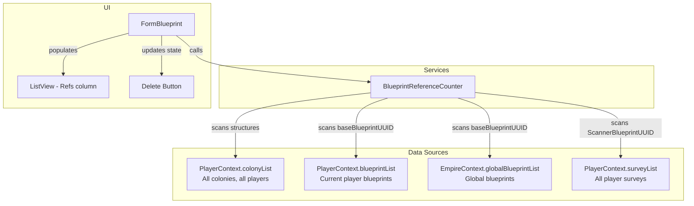

# Design Document: Blueprint Reference Guard

## Overview

This feature adds a `BlueprintReferenceCounter` service that scans all data sources (colony structures, blueprints, surveys) to count how many entities reference a given blueprint UUID. The reference count is surfaced in the FormBlueprint UI via a "Refs" column in the ListView and dynamic Delete button state that prevents deletion of in-use blueprints.

The service is a pure query — it reads existing data from `PlayerContext` and `EmpireContext` singletons and produces a `ReferenceReport` without modifying any state. The UI integration hooks into the existing `FormBlueprint` form and `BlueprintViewModel`.

## Architecture



The `BlueprintReferenceCounter` is a stateless service class. It receives the data collections as constructor parameters (not via singleton access) so it can be tested in isolation without initializing `PlayerContext` or `EmpireContext`.

### Data Source Coverage

| Source | Field Scanned | Collection |
|--------|--------------|------------|
| ColonyStructure | FlatpackBlueprintUUID | PlayerContext.colonyList → each Colony.Structures |
| ColonyStructure | ResearchingBlueprintUUID | PlayerContext.colonyList → each Colony.Structures |
| ColonyStructure | ManufacturingBlueprintUUID | PlayerContext.colonyList → each Colony.Structures |
| Blueprint | baseBlueprintUUID | PlayerContext.blueprintList + EmpireContext.globalBlueprintList |
| Survey | ScannerBlueprintUUID | PlayerContext.surveyList |

**Note on survey coverage:** `PlayerContext.surveyList` contains surveys for all players loaded from `PlayerData.json` (the full `Survey[]` array is loaded in `InitSurveys`). The filtering to current player only happens in `GetCurrentPlayerSurveys()`. The raw `surveyList` field contains all surveys, which is what the reference counter will use.

## Components and Interfaces

### BlueprintReferenceCounter

**Location:** `OE2EmpireTracker/Services/BlueprintReferenceCounter.cs`

```csharp
public class BlueprintReferenceCounter
{
    // Constructor accepts data collections directly for testability
    public BlueprintReferenceCounter(
        IEnumerable<Colony> colonies,
        IEnumerable<Blueprint> allBlueprints,
        IEnumerable<Survey> surveys)

    // Returns a ReferenceReport for the given blueprint UUID
    public ReferenceReport CountReferences(string blueprintUUID)
}
```

Design decisions:
- Constructor injection of data collections rather than singleton access. This makes the class unit-testable without needing to bootstrap `PlayerContext`/`EmpireContext`.
- Single method `CountReferences` keeps the API simple. The caller provides one UUID and gets back a complete report.
- The method excludes self-references: if the blueprint being checked has its own UUID as `baseBlueprintUUID`, that is not counted.

### ReferenceReport

**Location:** `OE2EmpireTracker/Models/ReferenceReport.cs`

```csharp
public class ReferenceReport
{
    public int TotalCount { get; }
    public int FlatpackCount { get; }
    public int ResearchingCount { get; }
    public int ManufacturingCount { get; }
    public int BaseBlueprintCount { get; }
    public int ScannerCount { get; }
}
```

Design decisions:
- Immutable value object — all properties are read-only, set via constructor.
- Per-source-type breakdown allows the UI to show detailed info if needed in the future.
- `TotalCount` is the sum of all five counts.

### FormBlueprint Changes

1. **Refs column**: Add a "Refs" column to the ListView after "Nick Name". Populated during `PopulateListView` by calling `BlueprintReferenceCounter.CountReferences` for each blueprint.

2. **Delete button state**: In `lvwBlueprints_ItemSelectionChanged`, after selecting a blueprint, compute the reference report. If `TotalCount > 0`, set `cmdDelete.Enabled = false` and `cmdDelete.Text = $"In Use ({TotalCount})"`. If `TotalCount == 0`, set `cmdDelete.Enabled = true` and `cmdDelete.Text = "Delete"`. When no blueprint is selected, disable the button with text "Delete".

3. **Reference counter instantiation**: Create a helper method that builds a `BlueprintReferenceCounter` from the current `PlayerContext` and `EmpireContext` state. This is called when populating the list view and when selection changes.

### BlueprintViewModel Changes

No changes needed. The reference counting is a read-only query that doesn't belong on the ViewModel (which wraps a single blueprint for editing). The `FormBlueprint` will use `BlueprintReferenceCounter` directly.

## Data Models

### ReferenceReport

```csharp
public class ReferenceReport
{
    public int TotalCount { get; }
    public int FlatpackCount { get; }
    public int ResearchingCount { get; }
    public int ManufacturingCount { get; }
    public int BaseBlueprintCount { get; }
    public int ScannerCount { get; }

    public ReferenceReport(
        int flatpackCount,
        int researchingCount,
        int manufacturingCount,
        int baseBlueprintCount,
        int scannerCount)
    {
        FlatpackCount = flatpackCount;
        ResearchingCount = researchingCount;
        ManufacturingCount = manufacturingCount;
        BaseBlueprintCount = baseBlueprintCount;
        ScannerCount = scannerCount;
        TotalCount = flatpackCount + researchingCount + manufacturingCount
                   + baseBlueprintCount + scannerCount;
    }

    public static readonly ReferenceReport Empty = new ReferenceReport(0, 0, 0, 0, 0);
}
```

No changes to existing models (`Blueprint`, `ColonyStructure`, `Survey`, `Colony`). The feature reads existing fields only.


## Correctness Properties

*A property is a characteristic or behavior that should hold true across all valid executions of a system — essentially, a formal statement about what the system should do. Properties serve as the bridge between human-readable specifications and machine-verifiable correctness guarantees.*

### Property 1: Counting accuracy across all source types

*For any* set of colonies (each with arbitrary structures), any set of blueprints (player and global), any set of surveys, and any target blueprint UUID, the `BlueprintReferenceCounter.CountReferences` method should return per-source counts that exactly match the number of matching UUID fields found by a simple equality filter on each source:
- `FlatpackCount` equals the count of structures where `FlatpackBlueprintUUID == targetUUID`
- `ResearchingCount` equals the count of structures where `ResearchingBlueprintUUID == targetUUID`
- `ManufacturingCount` equals the count of structures where `ManufacturingBlueprintUUID == targetUUID`
- `BaseBlueprintCount` equals the count of blueprints (excluding the target itself) where `baseBlueprintUUID == targetUUID`
- `ScannerCount` equals the count of surveys where `ScannerBlueprintUUID == targetUUID`

**Validates: Requirements 1.1, 1.2, 1.3**

### Property 2: TotalCount is the sum of per-source counts

*For any* `ReferenceReport`, `TotalCount` should equal `FlatpackCount + ResearchingCount + ManufacturingCount + BaseBlueprintCount + ScannerCount`.

**Validates: Requirements 1.4**

### Property 3: Self-referencing blueprints are excluded

*For any* set of data where the target blueprint's own `baseBlueprintUUID` equals its UUID, the `BaseBlueprintCount` should not include that self-reference. Equivalently: for any target UUID, if we add a blueprint with that UUID and `baseBlueprintUUID` set to the same UUID, the `BaseBlueprintCount` should remain unchanged compared to the count without that blueprint.

**Validates: Requirements 1.6**

### Property 4: Delete button state is determined by reference count

*For any* `ReferenceReport`, if `TotalCount > 0` then the delete button should be disabled with text `"In Use ({TotalCount})"`, and if `TotalCount == 0` then the delete button should be enabled with text `"Delete"`.

**Validates: Requirements 2.2, 2.3**

## Error Handling

| Scenario | Handling |
|----------|----------|
| Null or empty blueprint UUID passed to `CountReferences` | Return `ReferenceReport.Empty` (zero counts) |
| Null collections passed to constructor | Treat as empty collections (use `Enumerable.Empty<T>()`) |
| Colony with null `Structures` list | Skip that colony during scanning |
| Structure with null UUID fields | Null does not match any target UUID — no special handling needed |
| `EmpireContext` or `PlayerContext` not initialized when FormBlueprint creates the counter | Guard with null checks; use empty collections as fallback |

No exceptions are thrown by the reference counting logic. It is a pure read-only scan that degrades gracefully to zero counts when data is missing.

## Testing Strategy

### Property-Based Tests (FsCheck + NUnit)

The project already has FsCheck 2.16.6 and FsCheck.NUnit available. Property tests will use FsCheck's `Arbitrary` generators to produce random colonies, structures, blueprints, and surveys with random UUIDs.

**Test file:** `OE2EmpireTracker.Tests/Services/BlueprintReferenceCounterPropertyTests.cs`

Each property test must:
- Run a minimum of 100 iterations
- Reference the design property via a comment tag
- Use FsCheck generators for all input data

**Property test plan:**

| Property | Test Description | Generator Strategy |
|----------|-----------------|-------------------|
| Property 1 | Counting accuracy | Generate random colonies with structures, random blueprints, random surveys. Pick a UUID from the pool (or a fresh one). Verify each per-source count matches a LINQ filter. |
| Property 2 | TotalCount invariant | Generate arbitrary non-negative ints for each count, construct a ReferenceReport, verify TotalCount == sum. |
| Property 3 | Self-exclusion | Generate data where the target blueprint has baseBlueprintUUID == its own UUID. Verify BaseBlueprintCount excludes it. |
| Property 4 | Delete button state | Generate random ReferenceReports. Extract the expected button text and enabled state. Verify the mapping function produces the correct result. |

### Unit Tests (NUnit)

**Test file:** `OE2EmpireTracker.Tests/Services/BlueprintReferenceCounterTests.cs`

Unit tests cover specific examples and edge cases:

- Empty data returns zero counts (Requirement 1.5)
- Single structure referencing via FlatpackBlueprintUUID
- Single structure referencing via ResearchingBlueprintUUID
- Single structure referencing via ManufacturingBlueprintUUID
- Single blueprint referencing via baseBlueprintUUID
- Single survey referencing via ScannerBlueprintUUID
- Multiple references across different source types
- Blueprint with self-referencing baseBlueprintUUID is excluded
- Null/empty UUID returns empty report
- Colony with null Structures list is handled gracefully

### UI Integration Tests

Button state logic will be extracted into a testable static method (e.g., `GetDeleteButtonState(ReferenceReport report)` returning a tuple of `(bool enabled, string text)`) so it can be unit tested without WinForms. The FormBlueprint integration is verified manually.
