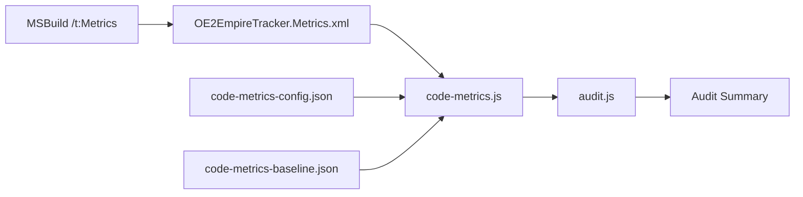

# Design Document

## Overview

This feature integrates Visual Studio Code Metrics analysis into the OE2EmpireTracker audit pipeline. It consists of three parts:

1. **NuGet package installation** - The `Microsoft.CodeAnalysis.Metrics` package is added to the project as a development dependency, enabling the MSBuild `Metrics` target.
2. **code-metrics.js audit tool** - A Node.js script (`.kiro/tools/code-metrics.js`) that parses the generated `CodeMetrics.xml` file, compares metric values against configurable thresholds, filters against a baseline of known violations, and reports new violations.
3. **Audit pipeline integration** - The new tool is registered in `audit.js` so it runs automatically alongside the existing 17 checks.

The tool does **not** auto-generate `CodeMetrics.xml` during audit runs. Generating metrics requires a full MSBuild compilation, which is too expensive to run on every audit. Instead, the developer generates the XML as a separate step, and the tool checks whatever XML file is present (or gracefully skips if none exists).

### Research Findings

- The `Microsoft.CodeAnalysis.Metrics` NuGet package provides a `Metrics` MSBuild target. Running `msbuild /t:Metrics` generates `{ProjectName}.Metrics.xml` in the project directory. The output path can be overridden with `/p:MetricsOutputFile=<path>`. (Content was rephrased for compliance with licensing restrictions. [Source: Microsoft Learn](https://learn.microsoft.com/en-us/visualstudio/code-quality/how-to-generate-code-metrics-data))
- For `packages.config` projects, the package's `.targets` file must be explicitly imported in the `.csproj`. The existing project already follows this pattern for `System.ValueTuple.targets`.
- The XML format is hierarchical: `CodeMetricsReport > Targets > Target > Assembly > Namespaces > Namespace > Types > NamedType > Members > Method`. Each level has a `Metrics` element containing `Metric` child elements with `Name` and `Value` attributes.
- Method elements include `File` and `Line` attributes for source location, and a `Name` attribute with the full signature (e.g., `void Program.Main(string[] args)`).

## Architecture

The feature adds no C# code to the main project. It consists entirely of:
- NuGet package configuration (packages.config + csproj Import)
- A Node.js audit tool script
- JSON configuration and baseline files
- A `.gitignore` entry for the generated XML



### Data Flow

1. Developer runs `MSBuild.exe OE2EmpireTracker.sln /t:Metrics` manually (or as part of a CI step).
2. MSBuild generates `OE2EmpireTracker/OE2EmpireTracker.Metrics.xml`.
3. `audit.js` invokes `code-metrics.js`.
4. `code-metrics.js` reads the XML, config, and baseline files.
5. It extracts per-method and per-type metrics, compares against thresholds, filters against baseline.
6. It outputs violations grouped by metric type and exits with code 0 (clean/all-baselined) or 1 (new violations).

## Components and Interfaces

### 1. NuGet Package Configuration

**Files modified:**
- `OE2EmpireTracker/packages.config` - Add `Microsoft.CodeAnalysis.Metrics` entry with `developmentDependency="true"`
- `OE2EmpireTracker/OE2EmpireTracker.csproj` - Add `Import` for the package's `.targets` file and an `EnsureNuGetPackageBuildImports` error check (following the existing `System.ValueTuple` pattern)

**Design decision:** The package is marked as `developmentDependency="true"` because it is a build-time tool, not a runtime dependency. This matches the existing `StyleCop.Analyzers` pattern.

**Design decision:** The `.targets` import goes at the bottom of the csproj, after `Microsoft.CSharp.targets`, following the existing pattern for `System.ValueTuple.targets`. The `EnsureNuGetPackageBuildImports` target gets an additional `Error` condition to verify the targets file exists.

### 2. code-metrics.js Tool

**File:** `.kiro/tools/code-metrics.js`

**Responsibilities:**
- Check if `OE2EmpireTracker/OE2EmpireTracker.Metrics.xml` exists; if not, print skip message and exit 0
- Parse the XML using Node.js built-in modules (no external dependencies)
- Extract per-method metrics: MaintainabilityIndex, CyclomaticComplexity, SourceLines, ExecutableLines
- Extract per-type metrics: ClassCoupling, DepthOfInheritance, SourceLines, ExecutableLines
- Build fully qualified names: `Namespace.TypeName` for types, `Namespace.MethodSignature` for methods (the Method Name attribute already includes the type prefix)
- Load thresholds from config file (with defaults)
- Load baseline from baseline file (with empty-array default)
- Compare metrics against thresholds to identify violations
- Filter violations against baseline
- Output violations grouped by metric type
- Print summary line and exit with appropriate code

**XML Parsing approach:** Use Node.js built-in `fs.readFileSync` to read the XML as a string, then use a line-by-line state machine parser. The parser tracks the current namespace and type context as it encounters opening/closing XML tags, extracting `Name` attributes and `Metric` values. This avoids adding any npm dependencies.

**Design decision:** A state-machine parser is appropriate here because:
1. The XML schema is fixed and well-known (generated by Microsoft tooling)
2. The structure is simple and hierarchical with predictable nesting
3. We only need to extract specific elements and attributes
4. No external dependencies are needed
5. All existing audit tools use only Node.js built-ins

**Alternative considered:** Using a proper XML parser like `xml2js` or Node.js `DOMParser`. Rejected because it would add an npm dependency (the project's Node.js tooling has zero npm dependencies for audit tools) or require a browser-like environment.

### 3. Configuration File

**File:** `.kiro/tools/code-metrics-config.json`

```json
{
    "maintainabilityIndexMin": 20,
    "cyclomaticComplexityMax": 25,
    "classCouplingMax": 80,
    "depthOfInheritanceMax": 6
}
```

**Design decision:** Thresholds are stored in a separate JSON file rather than hardcoded, so they can be tuned as the codebase improves without modifying the tool script. The defaults match Visual Studio's standard thresholds for "red" severity.

### 4. Baseline File

**File:** `.kiro/tools/code-metrics-baseline.json`

```json
{
    "violations": [
        {
            "metric": "CyclomaticComplexity",
            "element": "OE2EmpireTracker.SomeClass.SomeMethod(string)"
        }
    ]
}
```

Each entry identifies a known violation by metric name and fully qualified element name.

**Design decision:** Using an array of `{metric, element}` objects rather than a flat list of strings. This allows the same element to be baselined for one metric but not another.

**Design decision:** The baseline file uses the fully qualified name from the XML as the identifier. This is stable and matches exactly what the XML provides, avoiding any name-mapping logic.

### 5. Audit Pipeline Integration

**File modified:** `.kiro/tools/audit.js`

Add a new entry to the `tools` array:
```javascript
{ name: 'Code Metrics', script: 'code-metrics.js' },
```

**Design decision:** The entry is added at the end of the tools array. The tool's output format (findings lines + "N findings" summary) matches the convention used by all other audit tools, so no changes to audit.js's parsing logic are needed.

### 6. .gitignore Update

**File modified:** `.gitignore`

Add:
```
# Code metrics build artifact
*.Metrics.xml
```

**Design decision:** Using a glob pattern `*.Metrics.xml` rather than the specific filename, in case the project is renamed or additional projects are added to the solution.

## Data Models

### Parsed Method Record

| Field | Type | Source |
|-------|------|--------|
| `name` | string | `Method/@Name` attribute (e.g., `void ClassName.Method(string)`) |
| `namespace` | string | Parent `Namespace/@Name` |
| `type` | string | Parent `NamedType/@Name` |
| `qualifiedName` | string | Constructed: `{namespace}.{name}` |
| `file` | string | `Method/@File` attribute |
| `line` | number | `Method/@Line` attribute |
| `maintainabilityIndex` | number | `Metric[@Name='MaintainabilityIndex']/@Value` |
| `cyclomaticComplexity` | number | `Metric[@Name='CyclomaticComplexity']/@Value` |
| `classCoupling` | number | `Metric[@Name='ClassCoupling']/@Value` |
| `sourceLines` | number | `Metric[@Name='SourceLines']/@Value` |
| `executableLines` | number | `Metric[@Name='ExecutableLines']/@Value` |

### Parsed Type Record

| Field | Type | Source |
|-------|------|--------|
| `name` | string | `NamedType/@Name` attribute |
| `namespace` | string | Parent `Namespace/@Name` |
| `qualifiedName` | string | Constructed: `{namespace}.{name}` |
| `maintainabilityIndex` | number | `Metric[@Name='MaintainabilityIndex']/@Value` |
| `cyclomaticComplexity` | number | `Metric[@Name='CyclomaticComplexity']/@Value` |
| `classCoupling` | number | `Metric[@Name='ClassCoupling']/@Value` |
| `depthOfInheritance` | number | `Metric[@Name='DepthOfInheritance']/@Value` |
| `sourceLines` | number | `Metric[@Name='SourceLines']/@Value` |
| `executableLines` | number | `Metric[@Name='ExecutableLines']/@Value` |

### Violation Record

| Field | Type | Description |
|-------|------|-------------|
| `metric` | string | Metric name (e.g., `MaintainabilityIndex`) |
| `element` | string | Fully qualified element name |
| `value` | number | Actual metric value |
| `threshold` | number | Configured threshold |
| `sourceLines` | number | SourceLines for context |
| `executableLines` | number | ExecutableLines for context |
| `isBaselined` | boolean | Whether this violation is in the baseline |
| `level` | string | `method` or `type` |

### Threshold Configuration

| Key | Type | Default | Direction |
|-----|------|---------|-----------|
| `maintainabilityIndexMin` | number | 20 | Below = violation |
| `cyclomaticComplexityMax` | number | 25 | Above = violation |
| `classCouplingMax` | number | 80 | Above = violation |
| `depthOfInheritanceMax` | number | 6 | Above = violation |

## Correctness Properties

*A property is a characteristic or behavior that should hold true across all valid executions of a system - essentially, a formal statement about what the system should do. Properties serve as the bridge between human-readable specifications and machine-verifiable correctness guarantees.*

### Property 1: XML parsing extracts all elements with correct metrics

*For any* valid CodeMetrics XML containing an arbitrary number of namespaces, types, and methods, each with arbitrary metric values, parsing the XML should produce one record per `NamedType` element and one record per `Method` element, each with the correct fully qualified name and all six metric values (MaintainabilityIndex, CyclomaticComplexity, ClassCoupling, DepthOfInheritance, SourceLines, ExecutableLines) matching the XML source.

**Validates: Requirements 4.1, 4.2, 4.3, 4.4**

### Property 2: Threshold violation detection is correct

*For any* method with a random MaintainabilityIndex value and a random minimum threshold, the method is flagged as a violation if and only if its value is strictly below the threshold. *For any* method with a random CyclomaticComplexity value and a random maximum threshold, the method is flagged as a violation if and only if its value is strictly above the threshold. *For any* type with a random ClassCoupling value and a random maximum threshold, the type is flagged as a violation if and only if its value is strictly above the threshold. *For any* type with a random DepthOfInheritance value and a random maximum threshold, the type is flagged as a violation if and only if its value is strictly above the threshold.

**Validates: Requirements 5.1, 5.2, 6.1, 6.2, 7.1, 7.2, 8.1, 8.2**

### Property 3: Baseline filtering correctly partitions violations

*For any* set of violations and *any* baseline containing a subset of those violations, the new-violation count should equal the total violation count minus the number of violations present in the baseline. Baselined violations should still appear in the output but be marked as baselined, and only non-baselined violations should contribute to the findings count.

**Validates: Requirements 10.2, 10.3**

### Property 4: Violation reports contain all required fields

*For any* violation (method or type), the output line for that violation should contain the metric name, the fully qualified element name, the actual value, and the threshold value. For method-level violations, the output should additionally include SourceLines and ExecutableLines values.

**Validates: Requirements 12.1, 12.2, 14.1**

### Property 5: SourceLines and ExecutableLines never cause violations

*For any* method or type with arbitrary SourceLines and ExecutableLines values (including extreme values like 0 or 100000), these metrics alone should never produce a violation. Only MaintainabilityIndex, CyclomaticComplexity, ClassCoupling, and DepthOfInheritance are threshold-enforced.

**Validates: Requirements 14.2**

## Error Handling

| Scenario | Behavior |
|----------|----------|
| `CodeMetrics.xml` does not exist | Print skip message, exit 0 |
| `CodeMetrics.xml` is malformed/empty | Print parse error message, exit 0 (treat as no data) |
| Config file does not exist | Use default thresholds silently |
| Config file is malformed JSON | Print warning, use default thresholds |
| Baseline file does not exist | Treat all violations as new (empty baseline) |
| Baseline file is malformed JSON | Print warning, treat all violations as new |
| XML contains unexpected elements | Ignore unknown elements, extract what is recognized |
| Metric value is non-numeric | Skip that metric for the element, log a warning |

**Design principle:** The tool should never crash or exit with an unhandled exception. Missing or malformed input files result in graceful degradation (skip analysis, use defaults, or treat as empty). This ensures the audit pipeline continues running even if code metrics are not available.

## Testing Strategy

### Property-Based Tests

Property-based testing is appropriate for this feature because the core logic (XML parsing, threshold comparison, baseline filtering, output formatting) consists of pure functions with clear input/output behavior and a large input space.

**Library:** fast-check (JavaScript property-based testing library for Node.js)

**Configuration:** Minimum 100 iterations per property test.

**Tag format:** `Feature: code-metrics-integration, Property {number}: {property_text}`

Each correctness property from the design maps to a single property-based test:

1. **Property 1 test:** Generate random XML structures with varying namespaces/types/methods and metric values. Parse the XML and verify all elements are extracted with correct names and values.
2. **Property 2 test:** Generate random metric values and random thresholds. Run threshold comparison and verify violations are flagged if and only if the value crosses the threshold in the correct direction.
3. **Property 3 test:** Generate random violation sets and random baselines (subsets). Run baseline filtering and verify the new-violation count and baselined marking.
4. **Property 4 test:** Generate random violations and format them. Verify each output line contains all required fields.
5. **Property 5 test:** Generate methods/types with extreme SourceLines/ExecutableLines but passing values for all other metrics. Verify zero violations are produced.

### Unit Tests (Example-Based)

Example-based tests cover specific scenarios, edge cases, and integration points:

1. **Missing XML file:** Run tool when `OE2EmpireTracker.Metrics.xml` does not exist. Verify skip message and exit code 0. (Requirements 3.1, 3.2)
2. **Default thresholds:** Run tool without config file. Verify defaults are applied (MI min 20, CC max 25, ClassCoupling max 80, DoI max 6). (Requirements 9.2)
3. **Custom thresholds:** Run tool with config file containing custom values. Verify custom thresholds are used. (Requirements 9.1, 9.3)
4. **No baseline file:** Run tool without baseline file. Verify all violations are counted as new. (Requirements 10.4)
5. **Exit code 0 when all baselined:** Run tool where all violations are in the baseline. Verify exit code 0. (Requirements 11.1)
6. **Exit code 1 with new violations:** Run tool with new violations. Verify exit code 1. (Requirements 11.2)
7. **Summary line format:** Verify output ends with "N findings" line. (Requirements 11.3)
8. **Violation grouping:** Verify violations are grouped by metric type in output. (Requirements 12.2)

### Integration Tests

1. **Audit pipeline integration:** Run `audit.js` and verify "Code Metrics" appears in the summary output. (Requirements 13.1, 13.2, 13.3)
2. **End-to-end with sample XML:** Place a sample `CodeMetrics.xml` with known violations, run the tool, and verify the complete output matches expectations.

### Smoke Tests

1. **Package in packages.config:** Verify `Microsoft.CodeAnalysis.Metrics` entry exists with `developmentDependency="true"`. (Requirements 1.1, 1.3)
2. **Targets import in csproj:** Verify the `.targets` import exists in the csproj. (Requirements 1.2)
3. **Gitignore entry:** Verify `*.Metrics.xml` is in `.gitignore`. (Requirements 2.3)

### Output Format

The tool output follows the convention established by other audit tools:

```
=== Code Metrics Audit ===

--- MaintainabilityIndex (min: 20) ---
  VIOLATION: OE2EmpireTracker.FormColonyV2.PopulateStructures() MI=15 (threshold: 20) [SL:45 EL:22]
  BASELINE:  OE2EmpireTracker.PlayerContext.LoadData() MI=12 (threshold: 20) [SL:120 EL:55]

--- CyclomaticComplexity (max: 25) ---
  VIOLATION: OE2EmpireTracker.ColonyParser.Parse(string) CC=32 (threshold: 25) [SL:80 EL:40]

3 findings
```

Where:
- `VIOLATION` = new violation (not in baseline), counts toward findings
- `BASELINE` = known violation (in baseline), does not count toward findings
- `[SL:N EL:N]` = SourceLines and ExecutableLines for context
- Final line = count of new violations only
