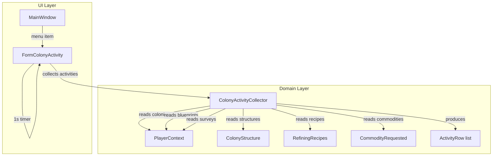

# Design Document: Colony Activity Form

## Overview

The Colony Activity Form (`FormColonyActivity`) is a read-only WinForms form that aggregates all active countdown timers and unfulfilled commodity requests across all colonies owned by the current player into a single sortable, filterable DataGridView. It provides at-a-glance visibility into every in-progress activity — building, mining, refining, research, manufacturing, commodity manufacturing, and commodity requests — sorted by time remaining (soonest first).

The form follows the established application patterns: `IProgrammaticUpdateSource` with `ProgrammaticUpdateGuard`, event subscriptions to `PlayerContext.CurrentPlayerChanged` and `PlayerContext.ColonyDataChanged`, and a 1-second timer for live countdown updates.

Key design decisions:
- Activity data collection and classification are extracted into a pure static helper class (`ColonyActivityCollector`) for testability — no UI or singleton dependencies in the core logic
- Process details formatting reuses the exact same format strings as the existing `ColonyStructure` control's `PopulateProgressStatus`, `PopulateRefineryProgressStatus`, `PopulateResearchLabProgressStatus`, `PopulateManufactoryProgressStatus`, and `PopulateCommodityFactoryProgressStatus` methods
- Commodity request time remaining is computed as `(NeedBy - DateTime.Now)` and formatted using the same "Xd Yh Zm Ws" pattern as `CountDownTime.TimeRemainingString`
- The grid stores numeric seconds-remaining in a hidden column for correct numeric sorting on the CountDownTime column
- Mining and Refining activity types are deselected by default since they are high-volume repeating timers that would clutter the view
- Text filter applies case-insensitive substring matching across all visible columns, combined with the activity type checkbox filter

## Architecture



Flow on form load / refresh:

1. `ColonyActivityCollector.CollectActivities(colonies, playerContext)` scans all colonies and returns a `List<ActivityRow>`
2. Each `ActivityRow` contains: activity type enum, system name, colony name, source name, process details string, a reference to the `CountDownTime` (or computed seconds for commodity requests), and the raw seconds-remaining for sorting
3. The form applies the current checkbox + text filters and populates the DataGridView
4. The 1-second timer recalculates `TimeRemaining` for each visible row and updates the CountDownTime cell

## Components and Interfaces

### ActivityType (new enum)

Location: `OE2EmpireTracker/Baseline/ColonyActivityCollector.cs` (nested or same file)

```csharp
public enum ActivityType
{
    Building,
    Manufacturing,
    CommodityManufacturing,
    CommodityRequest,
    Research,
    Mining,
    Refining
}
```

### ActivityRow (new POCO)

Location: `OE2EmpireTracker/Baseline/ColonyActivityCollector.cs`

```csharp
public class ActivityRow
{
    public ActivityType Type { get; set; }
    public string SystemName { get; set; }
    public string ColonyName { get; set; }
    public string SourceName { get; set; }
    public string ProcessDetails { get; set; }

    /// <summary>
    /// Reference to the CountDownTime for structure-based activities.
    /// Null for CommodityRequest rows.
    /// </summary>
    public CountDownTime CountDown { get; set; }

    /// <summary>
    /// For CommodityRequest rows: the NeedBy DateTime.
    /// For structure rows: DateTime.MinValue (unused).
    /// </summary>
    public DateTime NeedBy { get; set; }

    /// <summary>
    /// Returns the current seconds remaining for sorting and display.
    /// </summary>
    public long GetSecondsRemaining()
    {
        if (CountDown != null)
            return Math.Max(0, CountDown.TimeRemaining);
        // CommodityRequest: compute from NeedBy
        long seconds = (long)(NeedBy - DateTime.Now).TotalSeconds;
        return Math.Max(0, seconds);
    }

    /// <summary>
    /// Returns the formatted time remaining string in "Xd Yh Zm Ws" format.
    /// </summary>
    public string GetTimeRemainingString()
    {
        if (CountDown != null)
            return CountDown.TimeRemainingString;
        long seconds = GetSecondsRemaining();
        if (seconds <= 0) return "0s";
        return FormatSeconds(seconds);
    }

    public static string FormatSeconds(long seconds)
    {
        if (seconds <= 0) return "0s";
        var ts = TimeSpan.FromSeconds(seconds);
        string result = "";
        if (ts.Days > 0) result += $"{ts.Days}d";
        if (ts.Hours > 0 || result.Length > 0)
        { if (result.Length > 0) result += " "; result += $"{ts.Hours}h"; }
        if (ts.Minutes > 0 || result.Length > 0)
        { if (result.Length > 0) result += " "; result += $"{ts.Minutes}m"; }
        if (ts.Seconds > 0 || result.Length > 0)
        { if (result.Length > 0) result += " "; result += $"{ts.Seconds}s"; }
        return result;
    }
}
```

### ColonyActivityCollector (new static class)

Location: `OE2EmpireTracker/Baseline/ColonyActivityCollector.cs`

```csharp
public static class ColonyActivityCollector
{
    /// <summary>
    /// Scans all provided colonies and returns ActivityRow instances for every
    /// active timer and unfulfilled commodity request.
    /// </summary>
    public static List<ActivityRow> CollectActivities(
        IEnumerable<Colony> colonies, PlayerContext playerContext)
}
```

The method iterates each colony's `Structures` list and `Commodities` list:

- **Building**: `structure.BuildCompletionTime != null && BuildCompletionTime.TimeRemaining > 0` → type=Building, countdown=BuildCompletionTime, source="#seq ExtendedName", details="Building"
- **Mining**: `structure.ProcessCompletionTime != null && TimeRemaining > 0 && BluePrintType == BlueprintTypes.MiningRig` → type=Mining, source="#seq ExtendedName", details="{Amount}/h {Resource} ({Purity})" via survey lookup
- **Refining**: same pattern with `BlueprintTypes.Refinery` → details from recipe lookup or base rate calculation
- **Research**: same pattern with `BlueprintTypes.ResearchLaboratory` → details="Evo {n}->{n+1} {Name}"
- **Manufacturing**: same pattern with `BlueprintTypes.Manufactory` → details="({completed}/{qty}) {ExtendedName}"
- **CommodityManufacturing**: same pattern with `BlueprintTypes.CommodityFactory` → details="({completed}/{qty}) {CommodityName} x{CommoditiesPerCycle}"
- **CommodityRequest**: `commodity.Fulfilled == false` → type=CommodityRequest, NeedBy=commodity.NeedBy, source="Commodity Request", details="{Name} x{Requested}"

Source name format for structures: `$"#{structure.gameSequence} {blueprint.ExtendedName}"` matching `ColonyStructure.PopulateStats`.

### FormColonyActivity (new form)

Location: `OE2EmpireTracker/Forms/ColonyActivity/`

Files:
- `FormColonyActivity.cs`
- `FormColonyActivity.Designer.cs`
- `FormColonyActivity.resx`

Layout:
- `flpBase` — top-level FlowLayoutPanel, Dock=Fill, WrapContents=false, FlowDirection=TopDown
  - `flpFilters` — filter panel, FlowDirection=LeftToRight, AutoSize=true
    - 7 CheckBoxes: chkBuilding, chkManufacturing, chkCommodityManufacturing, chkCommodityRequest, chkResearch, chkMining, chkRefining
    - `txtFilter` — ValidatedTextBox for cross-column text search
  - `dgvActivities` — DataGridView, ReadOnly=true, AllowUserToAddRows=false, AllowUserToDeleteRows=false
    - Columns: colCountDown, colSystemName, colColonyName, colActivityType, colSource, colProcessDetails
    - Hidden column: colSecondsRemaining (for numeric sort)

Implements `IProgrammaticUpdateSource`.

Timer: `timerRefresh` — System.Windows.Forms.Timer, Interval=1000ms, started on form load, stopped/disposed on form close.

Event subscriptions (named methods, unsubscribed in `OnFormClosed`):
- `playerContext.CurrentPlayerChanged` → full refresh
- `playerContext.ColonyDataChanged` → full refresh

Grid sorting: `SortCompare` event handler for the CountDownTime column to sort by the hidden `colSecondsRemaining` numeric value instead of the formatted string.

### MainWindow Changes

Add menu item "Colony Activity" under the Edit menu strip. Click handler creates `new FormColonyActivity()`, sets `MdiParent = this`, calls `Show()`.

### .csproj Changes

Add `Compile Include` entries for:
- `Baseline\ColonyActivityCollector.cs`
- `Forms\ColonyActivity\FormColonyActivity.cs` (SubType=Form)
- `Forms\ColonyActivity\FormColonyActivity.Designer.cs` (DependentUpon=FormColonyActivity.cs)

Add `EmbeddedResource` entry for:
- `Forms\ColonyActivity\FormColonyActivity.resx` (DependentUpon=FormColonyActivity.cs)

## Data Models

### No Schema Changes

No new fields are added to any existing data model. All required data already exists:

| Field | Location | Type | Purpose |
|---|---|---|---|
| `BuildCompletionTime` | `ColonyStructure` | `CountDownTime` | Building countdown |
| `ProcessCompletionTime` | `ColonyStructure` | `CountDownTime` | Mining/refining/research/manufacturing countdown |
| `FlatpackBlueprintUUID` | `ColonyStructure` | `string` | Blueprint lookup for type classification and source name |
| `gameSequence` | `ColonyStructure` | `int` | Source name prefix "#seq" |
| `MiningSurvey` / `MiningSurveyResource` | `ColonyStructure` | `string` | Mining progress details |
| `RefiningResource` / `RefiningResourcePurity` | `ColonyStructure` | `string` | Refining progress details |
| `ResearchingBlueprintUUID` | `ColonyStructure` | `string` | Research progress details |
| `ManufacturingBlueprintUUID` | `ColonyStructure` | `string` | Manufacturing progress details |
| `ManufacturingCommodityName` | `ColonyStructure` | `string` | Commodity manufacturing details |
| `ManufacturingCompleted` / `ManufacturingQuantity` | `ColonyStructure` | `int` | Progress tracking |
| `SystemName` / `ColonyName` | `Colony` | `string` | Grid display columns |
| `NeedBy` / `Fulfilled` / `Name` / `Requested` | `CommodityRequested` | various | Commodity request rows |

### New Types

| Type | Location | Purpose |
|---|---|---|
| `ActivityType` enum | `ColonyActivityCollector.cs` | Classifies each activity row |
| `ActivityRow` class | `ColonyActivityCollector.cs` | Data transfer object for one grid row |

### ActivityRow Lifecycle

```
ColonyActivityCollector.CollectActivities(colonies, pc)
    → List<ActivityRow> (one per active timer + one per unfulfilled commodity)
        → Form filters by ActivityType checkboxes + text filter
            → DataGridView rows
                → Timer tick updates CountDownTime column values
```


## Correctness Properties

*A property is a characteristic or behavior that should hold true across all valid executions of a system — essentially, a formal statement about what the system should do. Properties serve as the bridge between human-readable specifications and machine-verifiable correctness guarantees.*

### Property 1: Activity collection completeness and classification

*For any* set of colonies, each containing any number of structures with random timer states (null, active, expired) and random blueprint types, and any number of commodity requests with random Fulfilled states, `ColonyActivityCollector.CollectActivities` should return exactly one `ActivityRow` per structure with an active timer (BuildCompletionTime with TimeRemaining > 0, or ProcessCompletionTime with TimeRemaining > 0) and exactly one `ActivityRow` per unfulfilled commodity request (Fulfilled == false). Each row's `ActivityType` should match the timer source: Building for BuildCompletionTime, and Mining/Refining/Research/Manufacturing/CommodityManufacturing based on the structure's BluePrintType for ProcessCompletionTime, and CommodityRequest for unfulfilled commodities. Each row's `SystemName` and `ColonyName` should match the owning colony's properties.

**Validates: Requirements 1.1, 1.2, 1.3, 1.4, 1.5, 1.6, 2.1, 3.1, 3.2, 3.3, 3.4, 3.5, 3.6, 3.7, 6.5, 6.6**

### Property 2: Commodity request time remaining computation

*For any* `ActivityRow` with type CommodityRequest and a NeedBy DateTime, `GetSecondsRemaining()` should return a value within 2 seconds of `max(0, (NeedBy - DateTime.Now).TotalSeconds)`. When NeedBy is in the past, `GetSecondsRemaining()` should return 0 and `GetTimeRemainingString()` should return "0s".

**Validates: Requirements 2.2, 2.3**

### Property 3: FormatSeconds equivalence with CountDownTime.TimeRemainingString

*For any* positive number of seconds between 1 and 864000 (10 days), `ActivityRow.FormatSeconds(seconds)` should produce the same string as a `CountDownTime` instance whose `TimeRemaining` is set to that value and then read back via `TimeRemainingString`, allowing for a tolerance of ±1 second in the formatted output due to clock drift between set and read.

**Validates: Requirements 6.2, 6.4**

### Property 4: Source name and process details formatting

*For any* `ActivityRow` produced by `ColonyActivityCollector.CollectActivities`:
- If type is Building: SourceName should match `"#<gameSequence> <ExtendedName>"` and ProcessDetails should equal `"Building"`
- If type is Mining: SourceName should match `"#<gameSequence> <ExtendedName>"` and ProcessDetails should match `"<Amount>/h <Resource> (<Purity>)"`
- If type is Refining (normal): ProcessDetails should match `"<BaseRate>:<OutputRate> <Resource> (<Purity>)"`
- If type is Refining (synthetic): ProcessDetails should match `"<ConsumeRate>:<ProduceRate> <OutputResource>"`
- If type is Research: ProcessDetails should match `"Evo <n>-><n+1> <Name>"`
- If type is Manufacturing: ProcessDetails should match `"(<completed>/<qty>) <ExtendedName>"`
- If type is CommodityManufacturing: ProcessDetails should match `"(<completed>/<qty>) <CommodityName> x<CommoditiesPerCycle>"`
- If type is CommodityRequest: SourceName should equal `"Commodity Request"` and ProcessDetails should match `"<Name> x<Requested>"`

**Validates: Requirements 6.8, 6.9, 7.1, 7.2, 7.3, 7.4, 7.5, 7.6, 7.7, 7.8**

### Property 5: Combined activity type and text filtering

*For any* list of `ActivityRow` instances, any subset of `ActivityType` values selected, and any text filter string, the filtered result should contain exactly those rows where (a) the row's `ActivityType` is in the selected set AND (b) at least one of the row's visible column values (time remaining string, system name, colony name, activity type string, source name, process details) contains the text filter as a case-insensitive substring. When the text filter is empty, condition (b) is always true.

**Validates: Requirements 4.3, 5.2, 5.3, 5.4**

### Property 6: Default sort order by numeric seconds remaining

*For any* list of `ActivityRow` instances sorted by `GetSecondsRemaining()` ascending, each row's seconds remaining should be less than or equal to the next row's seconds remaining. This numeric sort should produce a different order than a lexicographic sort of the formatted time strings when values cross unit boundaries (e.g. "2h 0m 0s" = 7200s should sort before "10h 0m 0s" = 36000s, but string sort would reverse them).

**Validates: Requirements 8.1, 8.4**

## Error Handling

| Scenario | Handling |
|---|---|
| Blueprint not found for structure's FlatpackBlueprintUUID | Skip the structure — do not create an ActivityRow (cannot classify without blueprint type) |
| Survey not found for mining structure's MiningSurvey | Set ProcessDetails to empty string — the row is still displayed with the countdown |
| Survey resource not found for MiningSurveyResource key | Set ProcessDetails to empty string |
| Colony has no structures and no commodities | No ActivityRows produced — colony is simply skipped |
| CommodityRequest NeedBy is in the past | Display "0s" as the countdown, row still appears in the grid |
| PlayerContext returns empty colony list | Grid displays no rows |
| Structure has both BuildCompletionTime and ProcessCompletionTime active | BuildCompletionTime takes priority — create a Building row (this matches the ColonyStructure control behavior where building state is checked first) |

## Testing Strategy

### Dual Testing Approach

Both unit tests and property-based tests are required for comprehensive coverage.

### Property-Based Testing

- Library: NUnit `[Test]` methods with loops (FsCheck is not available in this project)
- Minimum 100 iterations per property test
- Each property test must reference its design document property with a comment tag

Tag format: `// Feature: colony-activity-form, Property {number}: {title}`

Each correctness property maps to a single property-based test:

| Property | Test Focus | Generator Strategy |
|---|---|---|
| Property 1 | `ColonyActivityCollector.CollectActivities` completeness + classification | Generate random colonies with 0–5 structures each having random timer states (null, active with future EndTime, expired) and random blueprint types from the 5 known types. Generate 0–3 commodity requests per colony with random Fulfilled states. Verify row count and type classification. |
| Property 2 | `ActivityRow.GetSecondsRemaining()` and `GetTimeRemainingString()` for CommodityRequest | Generate random NeedBy DateTimes ranging from 1 day in the past to 10 days in the future. Verify seconds remaining computation and "0s" clamping for past dates. |
| Property 3 | `ActivityRow.FormatSeconds` equivalence | Generate random second values 1–864000. Create a CountDownTime, set TimeRemaining, read TimeRemainingString. Compare with FormatSeconds output allowing ±1s tolerance. |
| Property 4 | Source name and process details formatting | Generate structures of each blueprint type with appropriate fields populated. Verify SourceName and ProcessDetails match expected format patterns. |
| Property 5 | Combined filtering | Generate random ActivityRow lists (5–20 rows), random subsets of ActivityType, and random text filter strings (including empty). Apply filter function and verify result matches expected set. |
| Property 6 | Sort order | Generate random ActivityRow lists with varying seconds remaining. Sort by GetSecondsRemaining() ascending. Verify monotonic non-decreasing order. |

### Unit Tests

Unit tests cover specific examples, edge cases, and integration points:

- Empty colony list → zero ActivityRows
- Colony with no active timers → zero ActivityRows from that colony
- Colony with one active mining rig → one Mining row with correct details
- Colony with one building structure → one Building row with "Building" details
- Colony with one unfulfilled commodity request → one CommodityRequest row
- Colony with fulfilled commodity request → no row for that commodity
- Commodity request with NeedBy in the past → "0s" display
- Commodity request with NeedBy exactly now → "0s" display
- Structure with both BuildCompletionTime and ProcessCompletionTime → Building takes priority
- Refining with synthetic recipe → correct ConsumeRate:ProduceRate format
- Refining with normal resource → correct BaseRate:OutputRate format
- Text filter matches partial colony name → row included
- Text filter matches no columns → row excluded
- Activity type filter with Mining deselected → mining rows excluded
- All activity types deselected → no rows displayed
- Sort stability: rows with equal seconds remaining maintain relative order
