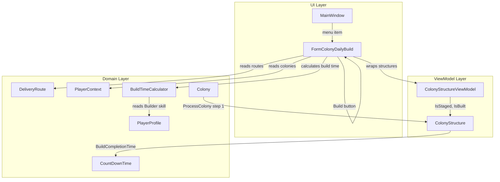

# Design Document: Colony Daily Build

## Overview

The Colony Daily Build feature adds a new WinForms form (`FormColonyDailyBuild`) that lets players quickly initiate structure builds across multiple colonies on a delivery route. The form follows the route-selector + scrollable-content pattern established by `FormDeliveryExecution`.

When a route is selected, the form scans each colony on that route for eligible structures — colonies that have at least one staged (but not yet built) structure and no structure currently building. For each eligible colony, it shows the first staged structure's blueprint name and a single "Build" button. Clicking Build sets the structure's `IsStaged = false`, initializes `BuildCompletionTime` with the Builder-skill-adjusted duration, persists, and removes the colony from the list.

The feature also adds build completion processing to `Colony.ProcessColony()` as the new first step (per REQ-ARCH-080), marking structures as built when their `BuildCompletionTime` expires.

Key design decisions:
- Build time calculation is a pure static method on a helper class for testability — no UI or singleton dependencies
- Eligibility filtering is a pure static method operating on colony data, also fully testable without UI
- `ProcessColony()` gets a new first step before existing mining/refining/etc. processing
- The form creates `ColonyStructureViewModel` wrappers to set `IsStaged` per REQ-ARCH-010
- `BuildCompletionTime` is a non-repeating `CountDownTime` (one-shot timer)

## Architecture



Flow when the user clicks a Build button:

1. Form looks up the colony's owner via `Colony.OwnerUUID`
2. `BuildTimeCalculator.Calculate(builderSkillLevel)` returns the build duration in seconds
3. Form creates a `ColonyStructureViewModel` for the target structure
4. Sets `IsStaged = false` (which also sets `IsBuilt = false`, `IsOnline = false` — but those are already false for a staged structure)
5. Creates a new `CountDownTime` and sets `TimeRemaining` to the calculated build seconds
6. Assigns it to `structure.BuildCompletionTime`
7. Calls `playerContext.writeContext()` to persist
8. Fires `playerContext.OnColonyDataChanged(colonyUUID)`
9. Removes the colony panel from the displayed list

## Components and Interfaces

### BuildTimeCalculator (new static class)

Location: `OE2EmpireTracker/Baseline/BuildTimeCalculator.cs`

```csharp
public static class BuildTimeCalculator
{
    /// <summary>
    /// Calculates build time in seconds based on Builder skill level.
    /// Formula: 86400 * (1 - level * 0.02), minimum 1 second.
    /// </summary>
    public static long Calculate(int builderSkillLevel)
    {
        double seconds = 86400.0 * (1.0 - builderSkillLevel * 0.02);
        return Math.Max(1, (long)seconds);
    }
}
```

This is a pure function with no dependencies — trivially testable.

### ColonyBuildEligibility (new static class)

Location: `OE2EmpireTracker/Baseline/ColonyBuildEligibility.cs`

```csharp
public static class ColonyBuildEligibility
{
    /// <summary>
    /// Returns true if the structure is currently staged (ready to build).
    /// IsStaged=true AND IsBuilt=false.
    /// </summary>
    public static bool IsStagedStructure(ColonyStructure structure, PlayerContext pc)

    /// <summary>
    /// Returns true if the structure is currently building.
    /// IsStaged=false AND IsBuilt=false AND BuildCompletionTime != null AND TimeRemaining > 0.
    /// </summary>
    public static bool IsBuildingStructure(ColonyStructure structure, PlayerContext pc)

    /// <summary>
    /// Returns true if the colony is eligible for building:
    /// has at least one staged structure AND no building structure.
    /// </summary>
    public static bool IsEligible(Colony colony, PlayerContext pc)

    /// <summary>
    /// Returns the first staged structure in the colony's Structures list order,
    /// or null if none found.
    /// </summary>
    public static ColonyStructure GetFirstStagedStructure(Colony colony, PlayerContext pc)
}
```

Uses `ColonyStructureViewModel` internally to read `IsStaged`/`IsBuilt` per REQ-ARCH-010.

### FormColonyDailyBuild (new form)

Location: `OE2EmpireTracker/Forms/ColonyDailyBuild/`

Files:
- `FormColonyDailyBuild.cs`
- `FormColonyDailyBuild.Designer.cs`
- `FormColonyDailyBuild.resx`

Layout (mirrors FormDeliveryExecution):
- `flpBase` — top-level FlowLayoutPanel, Dock=Fill, WrapContents=false
  - `flpSelectors` — left panel (220px wide), FlowDirection=TopDown
    - `lblRoute` — bold label "Route"
    - `txtRouteFilter` — ValidatedTextBox for filtering routes
    - `cmbRoute` — ComboBox (DropDownList) for route selection
  - `pnlContent` — right scrollable FlowLayoutPanel, AutoScroll=true, FlowDirection=TopDown, WrapContents=false
    - Dynamically populated with colony panels

Each colony panel in `pnlContent` is a FlowLayoutPanel containing:
- A bold Label: `"{PlanetName} - {ColonyName}"`
- A regular Label: blueprint `ExtendedName`
- A Button: "Build"

Implements `IProgrammaticUpdateSource` with `ProgrammaticUpdateGuard`.

Event subscriptions:
- `playerContext.CurrentPlayerChanged` → repopulate routes, clear content
- `playerContext.ColonyDataChanged` → rebuild content for current route

Unsubscribes in `OnFormClosed`.

### MainWindow Changes

Add a new menu item under Edit: "Colony Daily Build" that opens `FormColonyDailyBuild` as an MDI child.

### ColonyStructure Control Changes (existing form)

The existing `ColonyStructure` user control in `Forms/Colony/ColonyStructure.cs` needs a new "building" state display, following the same pattern used for mining/refining/manufacturing/research countdown timers.

#### New Build Controls

When a structure is staged and eligible to build (no other structure on the colony is building):
- Show a "Build" button (reuse the existing `cmdStart` button position, or add a dedicated `cmdBuild` button in the structure details area)
- The Build button is only visible when `IsStaged == true` AND no sibling structure has an active `BuildCompletionTime`

When a structure is in the building state (`BuildCompletionTime != null && TimeRemaining > 0`):
- Show the `flpCompletionTime` panel with `txtCompletionTime` displaying `BuildCompletionTime.TimeRemainingString`
- Show a "Done" button (reuse `cmdDone`) that calls `Colony.ProcessColony()` to complete the build
- Hide all process-specific controls (survey selection, refining combos, manufacturing blueprint selection, etc.)
- The `timerCountdown` ticks every second to update the displayed time remaining

#### State Handling in UpdateData

Add a new check at the top of `UpdateData()` — before the blueprint-type-specific handlers (mining rig, refinery, etc.):

```csharp
// Building state — structure is transitioning from staged to built
if (ColonyStructureData.BuildCompletionTime != null &&
    ColonyStructureData.BuildCompletionTime.TimeRemaining > 0)
{
    // Show build countdown, hide all process controls
    flpCompletionTime.Visible = true;
    txtCompletionTime.Text = ColonyStructureData.BuildCompletionTime.TimeRemainingString;
    cmdDone.Visible = true;
    cmdStart.Visible = false;
    // Hide process-specific controls
    flpSelection.Visible = false;
    flpSubSelection.Visible = false;
    // Start countdown timer
    if (!timerCountdown.Enabled) timerCountdown.Start();
    return; // Skip blueprint-type-specific handling
}
```

#### Build Button Click Handler

```csharp
private void cmdBuild_Click(object sender, EventArgs e)
{
    // Check single-build constraint
    if (Colony.Structures.Any(s => s.BuildCompletionTime != null &&
        s.BuildCompletionTime.TimeRemaining > 0))
        return;

    // Calculate build time with Builder skill
    int builderLevel = 0;
    var owner = PlayerContext.getInstance().playerProfileList
        .FirstOrDefault(p => p.UUID == Colony.OwnerUUID);
    if (owner != null)
        builderLevel = owner.GetSkill(SkillName.Builder).Level;

    long buildSeconds = BuildTimeCalculator.Calculate(builderLevel);

    // Transition from staged to building
    ViewModel.IsStaged = false;
    ColonyStructureData.BuildCompletionTime = new CountDownTime();
    ColonyStructureData.BuildCompletionTime.TimeRemaining = buildSeconds;

    ColonyStructureDataChanged?.Invoke(this, EventArgs.Empty);
}
```

#### Done Button for Building State

The existing `cmdDone_Click` handler already calls `Colony.ProcessColony()`. The new `ProcessColony()` step 1 will handle build completion (set `IsBuilt = true`, clear `BuildCompletionTime`). No change needed to the Done handler itself — it just needs to also handle the building state by calling `ProcessColony()` and refreshing.

### Colony.ProcessColony() Changes

Add build completion processing as the new first step, before the existing mining/refining loop:

```csharp
public void ProcessColony()
{
    // Step 1: Structure Building — check BuildCompletionTime expiration
    foreach (ColonyStructure structure in Structures)
    {
        if (structure.BuildCompletionTime != null &&
            structure.BuildCompletionTime.TimeRemaining <= 0)
        {
            structure.Properties.setProperty(GameConstants.PropBuilt, true);
            structure.Properties.setProperty(GameConstants.PropStaged, false);
            structure.BuildCompletionTime = null;
        }
    }

    // Existing processing (mining, refining, etc.)
    var pendingRefineries = new List<ColonyStructure>();
    // ... rest unchanged
}
```

This uses `BuildCompletionTime.TimeRemaining <= 0` as the completion check. Since build timers are non-repeating (one-shot), we don't use `IntervalsPassed`. We set `BuildCompletionTime = null` after completion to clean up.

### .csproj Changes

Add `Compile Include` entries for:
- `Baseline\BuildTimeCalculator.cs`
- `Baseline\ColonyBuildEligibility.cs`
- `Forms\ColonyDailyBuild\FormColonyDailyBuild.cs`
- `Forms\ColonyDailyBuild\FormColonyDailyBuild.Designer.cs`
- `Forms\ColonyDailyBuild\FormColonyDailyBuild.resx` (EmbeddedResource)

## Data Models

### Existing Models — No Schema Changes

No new fields are added to any data model. All required fields already exist:

| Field | Location | Type | Purpose |
|---|---|---|---|
| `BuildCompletionTime` | `ColonyStructure` | `CountDownTime` | One-shot build timer, null when not building |
| `IsStaged` | via `ColonyStructureViewModel` | `bool` | PropertyBag["Staged"] |
| `IsBuilt` | via `ColonyStructureViewModel` | `bool` | PropertyBag["Built"] |
| `OwnerUUID` | `Colony` | `string` | Links colony to owning player for skill lookup |
| `Builder` skill | `PlayerProfile.Skills` | `PlayerSkill` | Level used in build time formula |

### Build Timer Lifecycle

```
Staged structure (IsStaged=true, IsBuilt=false, BuildCompletionTime=null)
    ↓ User clicks Build
Building structure (IsStaged=false, IsBuilt=false, BuildCompletionTime.TimeRemaining > 0)
    ↓ Timer expires, ProcessColony() runs
Built structure (IsStaged=false, IsBuilt=true, BuildCompletionTime=null)
```

### CountDownTime Usage for Builds

Build timers are non-repeating (one-shot):
- `RepeatIntervalSeconds = 0` (default)
- `TimeRemaining` setter sets `StartTime = now`, `EndTime = now + seconds`
- Completion detected by `TimeRemaining <= 0`
- No `IntervalsPassed` / `ConsumeIntervals` needed


## Correctness Properties

*A property is a characteristic or behavior that should hold true across all valid executions of a system — essentially, a formal statement about what the system should do. Properties serve as the bridge between human-readable specifications and machine-verifiable correctness guarantees.*

### Property 1: Build time calculation

*For any* Builder skill level between 0 and 50 inclusive, `BuildTimeCalculator.Calculate(level)` should return `max(1, floor(86400 * (1 - level * 0.02)))`. The result should always be at least 1 second, and at level 0 should be exactly 86400 seconds.

**Validates: Requirements 5.1, 5.2**

### Property 2: Structure state predicates are mutually consistent

*For any* `ColonyStructure` with any combination of `IsStaged` (true/false), `IsBuilt` (true/false), and `BuildCompletionTime` (null, expired, or active), `IsStagedStructure` should return true if and only if `IsStaged == true` AND `IsBuilt == false`, and `IsBuildingStructure` should return true if and only if `IsStaged == false` AND `IsBuilt == false` AND `BuildCompletionTime != null` AND `BuildCompletionTime.TimeRemaining > 0`. A structure should never be both staged and building simultaneously.

**Validates: Requirements 3.2, 3.3**

### Property 3: Colony eligibility filtering

*For any* colony with any number of structures in any combination of states (staged, building, built, online), `ColonyBuildEligibility.IsEligible` should return true if and only if the colony has at least one staged structure (per the staged predicate) AND zero building structures (per the building predicate).

**Validates: Requirements 3.1, 3.4, 3.5, 8.1, 8.2**

### Property 4: First staged structure selection

*For any* eligible colony with one or more staged structures, `GetFirstStagedStructure` should return the staged structure with the lowest index in the colony's `Structures` list. For any colony with no staged structures, it should return null.

**Validates: Requirements 4.2**

### Property 5: Build initiation state transition

*For any* staged structure on any colony, after initiating a build (setting `IsStaged = false` and assigning `BuildCompletionTime` with the calculated duration), the structure should satisfy: `IsStaged == false`, `IsBuilt == false`, `BuildCompletionTime != null`, and `BuildCompletionTime.TimeRemaining` should be within 2 seconds of the value returned by `BuildTimeCalculator.Calculate` for the colony owner's Builder skill level. The colony should no longer be eligible (it now has a building structure).

**Validates: Requirements 6.1, 6.2**

### Property 6: Build completion in ProcessColony

*For any* colony containing one or more structures with non-null `BuildCompletionTime` where `TimeRemaining <= 0`, after calling `ProcessColony()`, each such structure should have `IsBuilt == true` and `BuildCompletionTime == null`. Structures with `BuildCompletionTime` still active (TimeRemaining > 0) should remain unchanged.

**Validates: Requirements 7.1, 7.2**

### Property 7: Colony form build button visibility

*For any* colony with any combination of structure states, the Build button on a staged structure should be visible if and only if that structure is staged (IsStaged=true, IsBuilt=false) AND no other structure in the colony has an active BuildCompletionTime (TimeRemaining > 0). When a structure is in the building state, the completion time display should be visible and the Build button should not be.

**Validates: Requirements 10.1, 10.3, 10.5, 10.6**

## Error Handling

| Scenario | Handling |
|---|---|
| Colony not found for a route stop UUID | Skip the stop, do not display a panel |
| Colony has no structures | Skip — not eligible (no staged structures) |
| Colony owner not found (empty OwnerUUID) | Builder skill level defaults to 0 (86400s build time) |
| Blueprint not found for structure's FlatpackBlueprintUUID | Display structure UUID as fallback text |
| Route has no stops | Display empty content panel |
| BuildCompletionTime already set on a staged structure | Should not happen in normal flow; form only shows structures where IsStagedStructure is true (which excludes structures with active BuildCompletionTime) |

## Testing Strategy

### Dual Testing Approach

Both unit tests and property-based tests are required for comprehensive coverage.

### Property-Based Testing

- Library: **FsCheck** (NuGet package `FsCheck` + `FsCheck.NUnit`) — the standard PBT library for .NET/NUnit
- Minimum 100 iterations per property test
- Each property test must reference its design document property with a comment tag

Tag format: `// Feature: colony-daily-build, Property {number}: {title}`

Each correctness property maps to a single property-based test:

| Property | Test Focus | Generator Strategy |
|---|---|---|
| Property 1 | `BuildTimeCalculator.Calculate` | Generate random skill levels 0–50, verify formula |
| Property 2 | `IsStagedStructure` / `IsBuildingStructure` | Generate structures with random IsStaged, IsBuilt, BuildCompletionTime states |
| Property 3 | `ColonyBuildEligibility.IsEligible` | Generate colonies with random numbers of structures in random states |
| Property 4 | `GetFirstStagedStructure` | Generate colonies with multiple structures, random staged positions |
| Property 5 | Build initiation | Generate staged structures with random owner skill levels, verify post-build state |
| Property 6 | `ProcessColony()` build completion | Generate colonies with structures having expired/active BuildCompletionTime |

### Unit Tests

Unit tests cover specific examples, edge cases, and integration points:

- `BuildTimeCalculator.Calculate(0)` returns 86400
- `BuildTimeCalculator.Calculate(50)` returns 1 (clamped minimum)
- `BuildTimeCalculator.Calculate(25)` returns 43200 (half)
- Colony with no structures → not eligible
- Colony with only built structures → not eligible
- Colony with one staged, no building → eligible
- Colony with one staged, one building → not eligible
- Colony with multiple staged, no building → eligible, returns first staged
- `ProcessColony()` with expired BuildCompletionTime → sets Built=true, clears timer
- `ProcessColony()` with active BuildCompletionTime → no change
- `ProcessColony()` build completion runs before mining (verify a newly-built mining rig can process in the same call)
- Build initiation persists correctly via JSON round-trip (BuildCompletionTime serialization)
