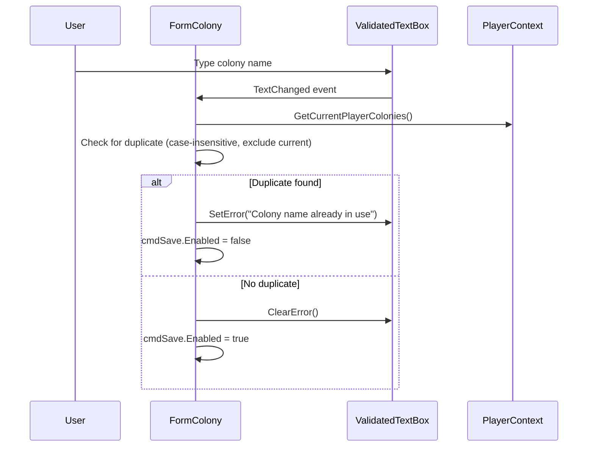

# Design Document: Colony Import Dedup

## Overview

The colony clipboard import currently writes parsed HTML directly into whichever colony the user has selected in the list view. This is error-prone — the clipboard data may belong to a different colony entirely. This design introduces a dedup layer that mirrors the existing `MarketBlueprintImporter` pattern: parse into a temporary object first, search for a match by planet name and system name (case-insensitive), then either update the matched colony or create a new one. The dedup key is PlanetName+SystemName (unique per player) rather than ColonyName, because the game truncates colony names making them unreliable for matching.

The change is scoped to three areas:
1. **ColonyParser** — add a new method that parses into a fresh temporary `Colony` instead of mutating an existing one.
2. **FormColony.cmdImportColony_Click** — replace the current "parse into selectedColony" flow with parse → search → merge-or-create → refresh UI → persist.
3. **FormColony colony name field** — add duplicate-name validation on manual edit using `ValidatedTextBox.SetError`/`ClearError`.

No new models or services are introduced. The existing `ColonyParser.ProcessHtml` merge logic (structure compound-key matching, commodity name matching) is reused for the update path.

## Architecture

```mermaid
sequenceDiagram
    participant User
    participant FormColony
    participant ColonyParser
    participant PlayerContext

    User->>FormColony: Click "Import Colony"
    FormColony->>FormColony: Check clipboard has HTML
    FormColony->>ColonyParser: ParseClipboardToTemp(empireContext)
    ColonyParser-->>FormColony: tempColony (new Colony object)
    FormColony->>FormColony: Extract tempColony.ColonyName

    alt ColonyName is empty
        FormColony->>ColonyParser: ProcessHtml(selectedColony, html, empireContext)
        Note right of FormColony: Fallback to current behavior
    else ColonyName is non-empty
        FormColony->>PlayerContext: GetCurrentPlayerColonies()
        FormColony->>FormColony: Search by PlanetName+SystemName (case-insensitive)
        alt Match found
            FormColony->>FormColony: MergeIntoExisting(existingColony, tempColony)
            Note right of FormColony: Copy PlanetName, SystemName; merge structures & commodities
        else No match
            FormColony->>FormColony: Create new colony from tempColony
            FormColony->>PlayerContext: colonyList.Add(newColony)
        end
    end

    FormColony->>PlayerContext: writeContext()
    FormColony->>PlayerContext: OnColonyDataChanged(colonyUUID)
    FormColony->>FormColony: Refresh list view, select imported colony, PopulateForm()
```

The duplicate-name validation on manual edit is a separate, simpler flow:



## Components and Interfaces

### ColonyParser — New Method

```csharp
/// <summary>
/// Parses clipboard HTML into a new temporary Colony object without mutating any existing colony.
/// Returns null if the clipboard does not contain HTML.
/// </summary>
public Colony ParseClipboardToTemp(EmpireContext empireContext)
```

This method:
- Reads HTML from the clipboard (same as `ProcessClipboard`)
- Creates a new `Colony()` instance
- Calls `ProcessHtml(tempColony, html, empireContext)` on it
- Returns the populated temporary colony, or null if no HTML

### FormColony — Modified Import Handler

`cmdImportColony_Click` is rewritten to:

1. Guard: no HTML → show message, return.
2. Guard: no current player → show message, return.
3. Call `parser.ParseClipboardToTemp(empireContext)` → `tempColony`.
4. If `tempColony.PlanetName` is empty → fall back to current behavior (parse into `selectedColony`).
5. Search `playerContext.GetCurrentPlayerColonies()` for a colony where `PlanetName` and `SystemName` match `tempColony.PlanetName` and `tempColony.SystemName` (case-insensitive via `StringComparison.OrdinalIgnoreCase`).
6. If match found → merge `tempColony` data into the existing colony:
   - Update `PlanetName` and `SystemName` from `tempColony`. Preserve existing `ColonyName` if already set (protects user-corrected names from game truncation bugs).
   - Re-run `ColonyParser.ProcessHtml(existingColony, html, empireContext)` to use the existing structure/commodity merge logic.
7. If no match → assign UUID, set `OwnerUUID` to current player, add to `colonyList`.
8. Persist via `playerContext.writeContext()`.
9. Fire `playerContext.OnColonyDataChanged(colony.UUID)`.
10. Refresh list view, select the imported/updated colony, call `PopulateForm()`.

### FormColony — Duplicate Name Validation

The `txtColonyName_TextChanged` handler is extended:

1. Skip if programmatic update (`_isProgrammaticUpdate > 0`).
2. Get the entered name from `txtColonyName.Text`.
3. Search `playerContext.GetCurrentPlayerColonies()` for any colony (excluding `selectedColony`) whose `ColonyName` matches case-insensitively.
4. If duplicate found → `txtColonyName.SetError("Colony name already in use")` and `cmdSave.Enabled = false`.
5. If no duplicate → `txtColonyName.ClearError()` and `cmdSave.Enabled = true`.

### ColonyImportHelper — Static Helper (New)

To keep the import logic testable without WinForms dependencies, the core search-and-merge logic is extracted into a static helper class:

```csharp
namespace OE2EmpireTracker.Services
{
    public static class ColonyImportHelper
    {
        /// <summary>
        /// Searches colonies for a case-insensitive ColonyName match.
        /// Returns the matching colony, or null if none found.
        /// Still used for duplicate name validation on manual edit.
        /// </summary>
        public static Colony FindByName(IEnumerable<Colony> colonies, string colonyName);

        /// <summary>
        /// Searches colonies for a case-insensitive PlanetName + SystemName match.
        /// Returns the matching colony, or null if none found.
        /// This is the primary dedup key — one colony per planet per player.
        /// </summary>
        public static Colony FindByPlanet(IEnumerable<Colony> colonies, string planetName, string systemName);

        /// <summary>
        /// Merges identity fields (PlanetName, SystemName) from source into target.
        /// Does NOT merge structures or commodities — that is handled by ColonyParser.ProcessHtml.
        /// Preserves existing ColonyName if target already has one (protects user-corrected names).
        /// </summary>
        public static void MergeIdentity(Colony target, Colony source);

        /// <summary>
        /// Creates a new Colony from a parsed temporary colony, assigning UUID and OwnerUUID.
        /// </summary>
        public static Colony CreateFromTemp(Colony tempColony, string ownerUUID);

        /// <summary>
        /// Checks whether a colony name is a duplicate among the given colonies,
        /// excluding the colony with the specified UUID.
        /// Returns true if a duplicate exists.
        /// </summary>
        public static bool IsDuplicateName(IEnumerable<Colony> colonies, string name, string excludeUUID);
    }
}
```

## Data Models

No new models are introduced. The existing models are used as-is:

- **Colony** — `UUID`, `OwnerUUID`, `ColonyName`, `PlanetName`, `SystemName`, `Structures`, `Commodities`, `Items`, `Locks`
- **ColonyStructure** — merged via existing compound-key logic in `ColonyParser.ParseColonyBuildingsFromJson`
- **CommodityRequested** — merged via existing name-matching logic in `ColonyParser.ParseCommodityDemands`

The temporary colony created during import is a standard `Colony` instance with no special fields. After the search-and-merge decision, it is either discarded (update path) or added to `colonyList` (create path).


## Correctness Properties

*A property is a characteristic or behavior that should hold true across all valid executions of a system — essentially, a formal statement about what the system should do. Properties serve as the bridge between human-readable specifications and machine-verifiable correctness guarantees.*

### Property 1: Case-insensitive colony name search

*For any* list of colonies and *for any* colony name that exists in the list (under any case variation), `FindByName` shall return a colony whose `ColonyName` equals the search name under case-insensitive comparison. Conversely, *for any* name that does not exist in the list (under any case), `FindByName` shall return null.

**Validates: Requirements 2.1**

### Property 2: No-match import grows colony list by one

*For any* list of colonies and *for any* temporary colony whose `ColonyName` does not match any existing colony (case-insensitive), calling `CreateFromTemp` and adding the result to the list shall increase the list count by exactly one, and the new colony shall be present in the list.

**Validates: Requirements 2.3, 4.4**

### Property 3: MergeIdentity updates identity while preserving local state

*For any* existing colony and *for any* temporary colony, after calling `MergeIdentity(existing, temp)`, the existing colony's `PlanetName` and `SystemName` shall equal the temp colony's values, the existing colony's `ColonyName` shall be preserved (not overwritten), and the existing colony's `UUID`, `OwnerUUID`, `Items`, and `Structures` references shall remain unchanged (same object references, same counts).

**Validates: Requirements 3.3, 3.4**

### Property 4: CreateFromTemp produces a valid colony with all parsed data

*For any* temporary colony with non-empty fields and *for any* owner UUID string, `CreateFromTemp(temp, ownerUUID)` shall return a colony where: (a) `UUID` is non-null and non-empty, (b) `OwnerUUID` equals the given owner UUID, (c) `ColonyName`, `PlanetName`, and `SystemName` equal the temp colony's values, and (d) `Structures.Count` and `Commodities.Count` equal the temp colony's counts.

**Validates: Requirements 4.1, 4.2, 4.3**

### Property 5: Duplicate name detection is case-insensitive and excludes self

*For any* list of colonies, *for any* colony name, and *for any* exclude UUID, `IsDuplicateName` shall return true if and only if there exists a colony in the list whose `ColonyName` matches the given name (case-insensitive) AND whose `UUID` is not equal to the exclude UUID.

**Validates: Requirements 8.1**

### Property 6: Case-insensitive planet+system search

*For any* list of colonies and *for any* `PlanetName` + `SystemName` that exists in the list (under any case variation), `FindByPlanet` shall return a colony whose `PlanetName` and `SystemName` match case-insensitively. *For any* planet+system combination not in the list, it shall return null.

**Validates: Requirements 2.1**

## Error Handling

| Scenario | Handling |
|---|---|
| Clipboard has no HTML | Show `MessageBox` with informational message. No state changes. (Existing behavior, unchanged.) |
| No current player selected | Show `MessageBox` with informational message. No state changes. (New guard added before parsing.) |
| ColonyParser fails to parse ColonyName | Fall back to current behavior: parse directly into `selectedColony`. Log a warning. |
| ColonyParser throws exception during HTML parsing | Catch in `cmdImportColony_Click`, show error `MessageBox`, log exception. (Existing behavior, unchanged.) |
| Duplicate colony name on manual edit | `ValidatedTextBox.SetError` with red background. Save button disabled. No `MessageBox` — inline feedback only. |
| Colony name cleared to empty during edit | No duplicate check needed (empty names don't conflict). `ClearError()` called, save remains enabled. |

## Testing Strategy

### Unit Tests (NUnit)

Unit tests cover specific examples and edge cases:

- **FindByName with exact match** — verify returns the correct colony.
- **FindByName with case variation** — e.g., "Alpha Base" matches "alpha base".
- **FindByName with no match** — verify returns null.
- **FindByName with null/empty name** — verify returns null.
- **FindByName with empty colony list** — verify returns null.
- **MergeIdentity preserves UUID** — specific example with known values.
- **CreateFromTemp sets OwnerUUID** — specific example.
- **IsDuplicateName excludes self** — colony's own name should not flag as duplicate.
- **IsDuplicateName with empty list** — returns false.
- **IsDuplicateName with null/empty name** — returns false.

### Property-Based Tests (FsCheck 2.16.6 + FsCheck.NUnit)

Each correctness property is implemented as a single property-based test with minimum 100 iterations. Tests use `[FsCheck.NUnit.Property(MaxTest = 100)]`.

- **Property 1 test**: Generate random colony lists and random search strings (including case-shuffled versions of existing names). Assert `FindByName` returns the correct result.
  - Tag: `Feature: colony-import-dedupe, Property 1: Case-insensitive colony name search`

- **Property 2 test**: Generate random colony lists and a temp colony with a name not in the list. Assert list count increases by one after `CreateFromTemp` + add.
  - Tag: `Feature: colony-import-dedupe, Property 2: No-match import grows colony list by one`

- **Property 3 test**: Generate random existing colony (with structures, items, UUID) and random temp colony. Call `MergeIdentity`. Assert identity fields updated, local state preserved.
  - Tag: `Feature: colony-import-dedupe, Property 3: MergeIdentity updates identity while preserving local state`

- **Property 4 test**: Generate random temp colony and random owner UUID. Call `CreateFromTemp`. Assert UUID non-empty, OwnerUUID correct, all data fields match.
  - Tag: `Feature: colony-import-dedupe, Property 4: CreateFromTemp produces a valid colony with all parsed data`

- **Property 5 test**: Generate random colony lists, random names, and random exclude UUIDs. Assert `IsDuplicateName` returns true iff a non-excluded colony has a case-insensitive name match.
  - Tag: `Feature: colony-import-dedupe, Property 5: Duplicate name detection is case-insensitive and excludes self`

- **Property 6 test**: Generate random colony lists and random search strings (including case-shuffled versions of existing planet+system pairs). Assert `FindByPlanet` returns the correct result for both match and no-match cases.
  - Tag: `Feature: colony-import-dedupe, Property 6: Case-insensitive planet+system search`

### Test Configuration

- Property-based testing library: **FsCheck 2.16.6** with **FsCheck.NUnit** adapter
- Each property test: `[FsCheck.NUnit.Property(MaxTest = 100)]`
- Each property test includes a comment referencing the design property number and title
- Build: MSBuild at `"D:\Program Files\Microsoft Visual Studio\18\Community\MSBuild\Current\Bin\MSBuild.exe"`
- Run: vstest.console at `"D:\Program Files\Microsoft Visual Studio\18\Community\Common7\IDE\CommonExtensions\Microsoft\TestWindow\vstest.console.exe"` against `OE2EmpireTracker.Tests/bin/Debug/OE2EmpireTracker.Tests.dll`
- New `.cs` files require `<Compile Include="...">` entries in the old-style `.csproj`
