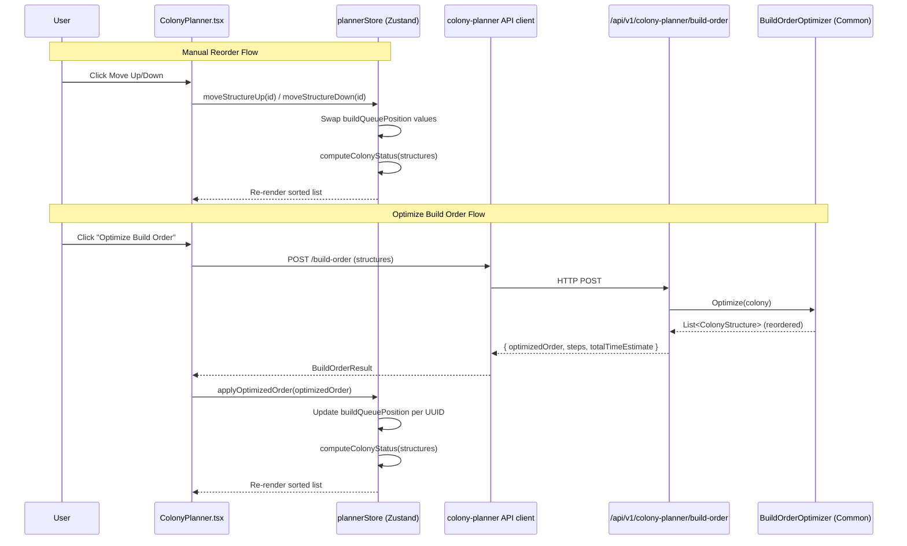

# Design Document: Colony Planner Reorder

## Overview

This feature adds manual reordering and automated build-order optimization to the Colony Planner web UI. It consists of three coordinated changes:

1. **Manual Reorder (UI)** — Up/Down buttons on each `StructureItem` that swap `buildQueuePosition` values in the Zustand store, with Colony Command Centre (CC) protection preventing anything from moving above position 1.
2. **Optimize Build Order (UI)** — An "Optimize Build Order" button on `ColonyPlanner.tsx` that POSTs the current plan to the server and applies the returned `optimizedOrder` to the local store.
3. **Server Endpoint Enhancement** — The existing `POST /api/v1/colony-planner/build-order` stub is replaced with a real invocation of `BuildOrderOptimizer.Optimize` from `OE2EmpireTracker.Common`, returning an `optimizedOrder` array alongside the existing `steps`/`totalTimeEstimate` fields.

The planner page remains public (no authentication). All reordering is local — the server is stateless and only computes the optimized order on demand.

## Architecture



### Layer Responsibilities

| Layer | Responsibility |
|-------|---------------|
| `StructureItem.tsx` | Renders Up/Down buttons with disabled states based on position and CC status |
| `StructureList.tsx` | Sorts structures by `buildQueuePosition` before rendering |
| `ColonyPlanner.tsx` | Hosts "Optimize Build Order" button, manages loading/error state, calls API |
| `plannerStore.ts` | `moveStructureUp`, `moveStructureDown`, `applyOptimizedOrder` actions |
| `colony-planner.ts` (API client) | Already has `optimizeBuildOrder` method — no change needed |
| `ColonyPlannerEndpoints.cs` | Replaces stub with real `BuildOrderOptimizer` invocation |
| `BuildOrderOptimizer.cs` | Existing algorithm in Common — no changes needed |


## Components and Interfaces

### Store Actions (plannerStore.ts)

```typescript
// New actions added to PlannerState interface
moveStructureUp: (id: string) => void;
moveStructureDown: (id: string) => void;
applyOptimizedOrder: (optimizedOrder: OptimizedOrderEntry[]) => void;
```

**`moveStructureUp(id)`**: Finds the structure with the given `id`, finds the structure with the next-lower `buildQueuePosition`, and swaps their `buildQueuePosition` values. No-op if the structure is already at the top or is the CC. Recalculates colony status.

**`moveStructureDown(id)`**: Same logic but swaps with the next-higher `buildQueuePosition`. No-op if the structure is already at the bottom or is the CC. Recalculates colony status.

**`applyOptimizedOrder(optimizedOrder)`**: For each entry in `optimizedOrder`, finds the matching structure by `flatpackBlueprintUUID` (mapped to `blueprintUUID` in the local model) and sets its `buildQueuePosition` to the returned `buildQueueSequence`. Entries with no local match (optimizer-inserted support structures) are ignored. Recalculates colony status.

### CC Detection

A structure is the Colony Command Centre if its `subType === 'ColonyCommandCentre'`. This is already stored on `PlannedStructure.subType` when added via `FlatpackDropdown` (extracted from `bluePrintType` via `extractSubType`).

### StructureItem Props Extension

```typescript
interface StructureItemProps {
  structure: PlannedStructure;
  onStateChange: (id: string, state: StructureState) => void;
  onRemove: (id: string) => void;
  // New props:
  onMoveUp: (id: string) => void;
  onMoveDown: (id: string) => void;
  isMoveUpDisabled: boolean;
  isMoveDownDisabled: boolean;
}
```

### StructureList Sorting

`StructureList` will sort structures by `buildQueuePosition` ascending before rendering. Currently it renders in array order — the sort ensures correct display after reorder operations.

### Disable Logic (computed in StructureList, passed as props)

For each structure at index `i` in the sorted list:
- **Move Up disabled** when:
  - Structure is the CC (`subType === 'ColonyCommandCentre'`)
  - Structure is at position 1 (first in list)
  - Structure is at position 2 AND the structure at position 1 is the CC (CC protection)
  - Only one structure in the list
- **Move Down disabled** when:
  - Structure is the CC
  - Structure is at the last position
  - Only one structure in the list

### OptimizedOrderEntry Type

```typescript
interface OptimizedOrderEntry {
  flatpackBlueprintUUID: string;
  buildQueueSequence: number;
}
```

This will be added to the `BuildOrderResult` type in `generated.ts` (via the type generation script from the server model).


### Server Endpoint Changes (ColonyPlannerEndpoints.cs)

The `OptimizeBuildOrder` method will:
1. Parse and validate the request (existing logic)
2. Convert `PlannerStructureDto` list into a `Colony` object with `ColonyStructure` entries
3. Instantiate `BuildOrderOptimizer` (requires `PlayerContext` — use DI-registered instance)
4. Call `optimizer.Optimize(colony)` to get the reordered `List<ColonyStructure>`
5. Map the result to `OptimizedOrderEntry[]` (UUID + 0-based sequence)
6. Return the existing `steps`/`totalTimeEstimate` fields alongside the new `optimizedOrder`

### Response Model Enhancement

```csharp
private sealed class BuildOrderResponse
{
    public List<OptimizedOrderEntryResponse> OptimizedOrder { get; set; } = new();
    public List<BuildOrderStepResponse> Steps { get; set; } = new();
    public string TotalTimeEstimate { get; set; } = string.Empty;
}

private sealed class OptimizedOrderEntryResponse
{
    public string FlatpackBlueprintUUID { get; set; } = string.Empty;
    public int BuildQueueSequence { get; set; }
}
```

### Wire Format

**Request** (unchanged):
```json
{
  "structures": [
    {
      "flatpackBlueprintUUID": "uuid-here",
      "isBuilt": false,
      "isStaged": true,
      "isOnline": false,
      "buildQueueSequence": 1,
      "assignedWorkers": { "miner": true }
    }
  ]
}
```

**Response** (enhanced — adds `optimizedOrder`):
```json
{
  "optimizedOrder": [
    { "flatpackBlueprintUUID": "cc-uuid", "buildQueueSequence": 0 },
    { "flatpackBlueprintUUID": "reactor-uuid", "buildQueueSequence": 1 },
    { "flatpackBlueprintUUID": "hab-uuid", "buildQueueSequence": 2 }
  ],
  "steps": [
    {
      "sequence": 1,
      "structureName": "Reactor Core",
      "blueprintType": "Flatpacks/ReactorCore",
      "resourcesRequired": [{ "resourceName": "Construction Materials", "quantity": 100 }],
      "timeEstimate": "1h 30m"
    }
  ],
  "totalTimeEstimate": "4h 30m"
}
```

Note: All property names are camelCase on the wire (server's `JsonNamingPolicy.CamelCase` applies).

## Data Models

### PlannedStructure (existing — no changes)

```typescript
interface PlannedStructure {
  id: string;                    // Local UUID (crypto.randomUUID)
  blueprintUUID: string;         // Server-side flatpack blueprint UUID
  name: string;                  // Display name
  subType: string;               // e.g. "MiningRig", "ColonyCommandCentre"
  state: StructureState;         // 'Staged' | 'Built' | 'Online'
  buildQueuePosition: number;    // 1-based position in build order
  properties: BlueprintProperties;
}
```

### BuildOrderResult (enhanced — generated.ts)

```typescript
interface BuildOrderResult {
  optimizedOrder?: OptimizedOrderEntry[];  // NEW
  steps: BuildOrderStep[];
  totalTimeEstimate: string;
}

interface OptimizedOrderEntry {
  flatpackBlueprintUUID: string;
  buildQueueSequence: number;
}
```

### Server-side Colony/ColonyStructure Mapping

The endpoint maps `PlannerStructureDto` → `ColonyStructure` for the optimizer:
- `FlatpackBlueprintUUID` → `ColonyStructure.FlatpackBlueprintUUID`
- `BuildQueueSequence` → `ColonyStructure.BuildQueueSequence`
- `IsBuilt`/`IsStaged`/`IsOnline` → state flags on `ColonyStructure`

The optimizer returns `List<ColonyStructure>` in optimized order. The endpoint maps each entry's index to `buildQueueSequence` (0-based).


## Correctness Properties

*A property is a characteristic or behavior that should hold true across all valid executions of a system — essentially, a formal statement about what the system should do. Properties serve as the bridge between human-readable specifications and machine-verifiable correctness guarantees.*

### Property 1: Move swap preserves all other positions

*For any* list of 2+ planned structures and any valid move operation (up or down) on a non-CC structure that is not at the boundary, the operation SHALL swap the `buildQueuePosition` of exactly two structures (the target and its neighbor) and leave all other structures' positions unchanged.

**Validates: Requirements 1.1, 1.2**

### Property 2: Disable logic correctness

*For any* list of planned structures (with or without a Colony Command Centre), the move-up button SHALL be disabled if and only if: the structure is the CC, OR the structure is at position 1, OR the structure is at position 2 with CC at position 1, OR the list has only one item. The move-down button SHALL be disabled if and only if: the structure is the CC, OR the structure is at the last position, OR the list has only one item.

**Validates: Requirements 1.3, 1.4, 1.5, 1.6, 1.7**

### Property 3: Status invariant after reorder

*For any* reorder operation (moveStructureUp, moveStructureDown, or applyOptimizedOrder), the resulting `status` in the store SHALL equal `computeColonyStatus(resultingStructures)`.

**Validates: Requirements 1.8, 2.9**

### Property 4: Structure list sort order

*For any* list of planned structures with arbitrary `buildQueuePosition` values, the rendered order in `StructureList` SHALL be sorted by `buildQueuePosition` ascending.

**Validates: Requirements 1.9**

### Property 5: Wire format mapping correctness

*For any* list of planned structures, the mapping to the build-order request wire format SHALL correctly translate: `blueprintUUID` → `flatpackBlueprintUUID`, `state === 'Built'` → `isBuilt: true`, `state === 'Staged'` → `isStaged: true`, `state === 'Online'` → `isOnline: true`, and `buildQueuePosition` → `buildQueueSequence`.

**Validates: Requirements 2.2**

### Property 6: Apply optimized order correctness

*For any* list of planned structures and any `optimizedOrder` response (which may contain entries with UUIDs not present in the local plan), `applyOptimizedOrder` SHALL update the `buildQueuePosition` of each local structure whose `blueprintUUID` matches an entry's `flatpackBlueprintUUID` to the entry's `buildQueueSequence`, and SHALL leave unmatched local structures' positions unchanged.

**Validates: Requirements 2.3, 2.4**

### Property 7: Server validation rejects invalid requests

*For any* request body that is empty, contains invalid JSON, has a missing `structures` field, or has an empty `structures` array, the build-order endpoint SHALL return HTTP 400 with a JSON body containing an `error` field.

**Validates: Requirements 3.5, 3.6**


## Error Handling

### Client-Side (ColonyPlanner.tsx)

| Scenario | Handling |
|----------|----------|
| Network failure during optimize | Show error banner ("Failed to optimize build order. Please try again."), restore button to enabled state, do not modify structure list |
| HTTP 400 from server | Show error banner with server's error message, restore button, do not modify list |
| HTTP 5xx from server | Show generic error banner, restore button, do not modify list |
| Empty `optimizedOrder` in response | No-op — structures remain in current order (no positions to update) |
| `optimizedOrder` contains only unknown UUIDs | No-op — no local structures match, positions unchanged |

### Server-Side (ColonyPlannerEndpoints.cs)

| Scenario | Response |
|----------|----------|
| Missing request body | HTTP 400: `{ "error": "Request body is required" }` |
| Invalid JSON | HTTP 400: `{ "error": "Invalid JSON body" }` |
| Missing/null `structures` field | HTTP 400: `{ "error": "structures field is required" }` |
| Empty `structures` array | HTTP 400: `{ "error": "structures field is required" }` |
| Optimizer throws exception | HTTP 500 (unhandled — let ASP.NET Core's default error handling apply) |
| Valid request | HTTP 200 with `{ optimizedOrder, steps, totalTimeEstimate }` |

### Move Operations (plannerStore.ts)

Move operations are no-ops when:
- The target structure is the CC
- The target structure is already at the boundary (top for up, bottom for down)
- The target structure is at position 2 with CC at position 1 (for move up)

No error state is needed — the buttons are disabled in these cases, so the actions should never be called. The store actions are defensive (no-op) regardless.

## Testing Strategy

### Property-Based Tests (fast-check + vitest)

Each property test runs a minimum of 100 iterations. Tests are tagged with the property they validate.

| Property | Test File | What Varies |
|----------|-----------|-------------|
| 1: Move swap | `plannerStore.property.test.ts` | List size (2–20), structure positions, which structure is moved, direction |
| 2: Disable logic | `plannerStore.property.test.ts` | List size (1–20), CC presence/absence, CC position |
| 3: Status invariant | `plannerStore.property.test.ts` | List contents, move operations, optimized order responses |
| 4: Sort order | `StructureList.property.test.ts` | Random buildQueuePosition values |
| 5: Wire format mapping | `plannerStore.property.test.ts` | Random PlannedStructure lists with various states |
| 6: Apply optimized order | `plannerStore.property.test.ts` | Random structures + random optimizedOrder (with/without extra UUIDs) |
| 7: Server validation | `ColonyPlannerEndpointTests.cs` | Various invalid request bodies |

### Unit Tests (example-based)

| Criterion | Test | What's Verified |
|-----------|------|-----------------|
| 2.1 | `ColonyPlanner.test.tsx` | Button exists with "Optimize Build Order" text |
| 2.5 | `ColonyPlanner.test.tsx` | Button disabled + spinner during request |
| 2.6 | `ColonyPlanner.test.tsx` | Button disabled when list empty |
| 2.7 | `ColonyPlanner.test.tsx` | Button disabled when list has 1 item |
| 2.8 | `ColonyPlanner.test.tsx` | Error message shown on API failure, list unchanged |
| 3.1 | `ColonyPlannerEndpointTests.cs` | Valid request invokes optimizer (integration) |
| 3.2 | `ColonyPlannerEndpointTests.cs` | Response contains optimizedOrder with correct mapping |
| 3.3 | `ColonyPlannerEndpointTests.cs` | Optimizer-inserted structures appear in response |
| 3.4 | `ColonyPlannerEndpointTests.cs` | Response contains steps + totalTimeEstimate |
| 3.7 | `ColonyPlannerEndpointTests.cs` | No auth required (200 without token) |

### PBT Library Configuration

- **TypeScript**: `fast-check` v4.8.0 (already installed), minimum 100 runs per property
- **C# (server tests)**: `FsCheck.Xunit` or inline property tests in the .NET 8 test project, minimum 100 runs
- Tag format: `// Feature: colony-planner-reorder, Property N: <description>`

