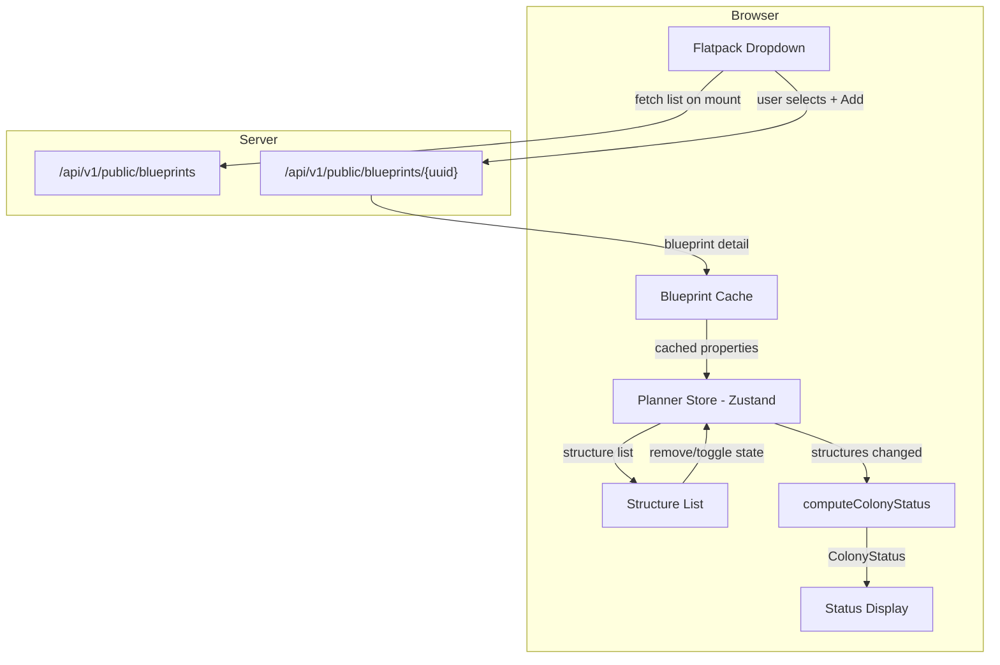
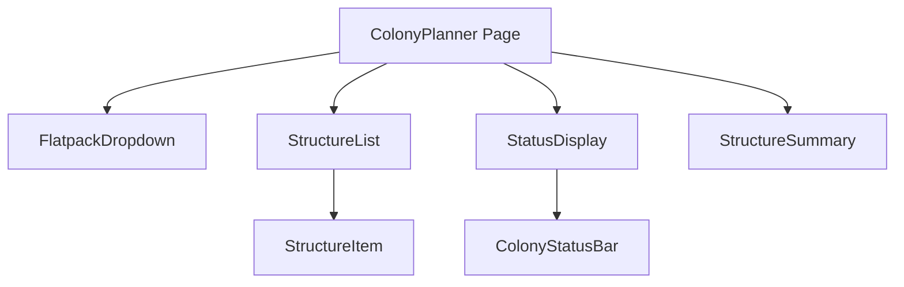

# Design Document: Colony Planner Web (Client-Side)

## Overview

The Colony Planner Web feature replaces the existing server-side computation approach with a fully client-side "what-if" colony planning tool. Users browse flatpack structures via a searchable, grouped dropdown (replacing the raw UUID text input), add them to a virtual colony plan, toggle structure states (Staged/Built/Online), and see real-time colony status computed entirely in the browser.

Key design decisions:
1. **Client-side computation** — After fetching blueprint data from the public API, all status calculations happen in-browser. No server round-trips for status updates.
2. **Blueprint detail caching** — Fetched blueprint details are cached in the Zustand store to avoid redundant API calls when the same blueprint type is added multiple times.
3. **Ideal worker mode** — The web planner uses "Ideal" calculation: when a structure is Online, all worker slots are considered filled. No manual worker assignment.
4. **No persistence** — Plans exist only in client-side state for the browser session. No authentication, no server storage.

This replaces the existing `StructurePanel.tsx` (UUID text input) and the server-side status computation via `/api/v1/colony-planner/status` with a local computation engine.

## Architecture

### High-Level Data Flow



### Component Architecture



### Design Decisions

| Decision | Choice | Rationale |
|----------|--------|-----------|
| Computation location | Client-side (TypeScript) | Eliminates server round-trips after initial load; the "Ideal" mode calculation is simple arithmetic — no need for the full C# ColonyStatusCalculator complexity |
| State management | Zustand (existing pattern) | Consistent with the existing plannerStore; lightweight, good TypeScript inference |
| Blueprint list fetch | TanStack Query | Automatic caching, stale-while-revalidate, error/retry handling built-in |
| Blueprint detail fetch | Imperative fetch + Zustand cache | Details are fetched on-demand when adding a structure; cached in store to avoid re-fetching same blueprint |
| Dropdown component | Custom with Radix Popover | Needs grouping by sub-type + search filtering; no existing component matches these requirements |
| Status computation | Pure function (no side effects) | Enables property-based testing; called synchronously on every store change |


## Components and Interfaces

### New/Modified Files

```
OE2EmpireTracker.Web/src/
├── pages/planner/
│   ├── ColonyPlanner.tsx          # Modified — remove server-side status call, use local computation
│   ├── FlatpackDropdown.tsx       # NEW — searchable grouped dropdown for flatpack selection
│   ├── StructureList.tsx          # NEW — replaces StructurePanel.tsx with rich structure display
│   ├── StructureItem.tsx          # NEW — individual structure row with state toggle + remove
│   ├── StatusDisplay.tsx          # Modified — reads from local computation instead of server response
│   ├── StructureSummary.tsx       # NEW — summary counts by sub-type
│   ├── plannerStore.ts            # Modified — new shape with blueprint cache + local computation
│   └── computeColonyStatus.ts    # NEW — pure function for colony status calculation
├── api/
│   └── hooks/
│       └── useFlatpacks.ts        # NEW — TanStack Query hook for fetching flatpack blueprint list
└── utils/
    └── blueprintHelpers.ts        # NEW — flatpack filtering, sub-type extraction utilities
```

### Key Interfaces

#### Planner Store (`plannerStore.ts`)

```typescript
import { create } from 'zustand';

export type StructureState = 'Staged' | 'Built' | 'Online';

export interface PlannedStructure {
  id: string;                        // Unique instance ID (crypto.randomUUID())
  blueprintUUID: string;             // Flatpack blueprint UUID
  name: string;                      // Blueprint extendedName
  subType: string;                   // e.g. "MiningRig", "CommodityFactory/Agridome"
  state: StructureState;             // Current state toggle
  buildQueuePosition: number;        // Sequential position
  properties: BlueprintProperties;   // Cached blueprint properties for computation
}

export interface BlueprintProperties {
  powerProvided: number;
  powerRequired: number;
  habitationProvision: number;
  foodProvision: number;
  entertainmentProvided: number;
  warehouseCapacity: number;
  workerSlots: number;               // Total ideal workers (sum of all worker type slots)
}

export interface ColonyStatus {
  powerProvided: number;
  powerRequired: number;
  habitationProvision: number;
  habitationRequired: number;
  foodProvision: number;
  foodRequired: number;
  entertainmentProvided: number;
  entertainmentRequired: number;
  warehouseCapacity: number;
  warehouseRequired: number;
}

export interface PlannerState {
  structures: PlannedStructure[];
  blueprintCache: Record<string, BlueprintProperties>;  // UUID → properties
  status: ColonyStatus | null;
  addStructure: (structure: PlannedStructure) => void;
  removeStructure: (id: string) => void;
  setStructureState: (id: string, state: StructureState) => void;
  cacheBlueprint: (uuid: string, properties: BlueprintProperties) => void;
  clearPlan: () => void;
}
```

#### Flatpack Dropdown (`FlatpackDropdown.tsx`)

```typescript
interface FlatpackOption {
  uuid: string;
  name: string;           // extendedName from API
  subType: string;        // Extracted from bluePrintType after "Flatpacks/"
}

interface FlatpackDropdownProps {
  onAdd: (uuid: string, name: string, subType: string) => void;
  disabled?: boolean;
}
```

#### Colony Status Computation (`computeColonyStatus.ts`)

```typescript
/**
 * Pure function: computes colony status from a list of planned structures.
 * Uses "Ideal" mode — all worker slots filled when Online.
 *
 * Rules:
 * - Online: contributes Power, Habitation, Entertainment, Warehouse provisions + workers
 * - Built: contributes workers only (toward Hab/Food/Ent Required)
 * - Staged: contributes Food Provision only (food accumulates regardless of state)
 * - Workers from Built + Online structures count toward Hab/Food/Ent Required
 * - Entertainment Required = total workers × 2
 * - Warehouse Required = 0 (no inventory in web planner)
 */
export function computeColonyStatus(structures: PlannedStructure[]): ColonyStatus;
```

#### Blueprint Helpers (`blueprintHelpers.ts`)

```typescript
/** Filter blueprints to only flatpacks (bluePrintType starts with "Flatpacks/") */
export function isFlatpack(blueprint: { bluePrintType: string }): boolean;

/** Extract sub-type from bluePrintType (e.g. "Flatpacks/MiningRig" → "MiningRig") */
export function extractSubType(bluePrintType: string): string;

/** Extract BlueprintProperties from a blueprint detail response */
export function extractBlueprintProperties(
  detail: Record<string, unknown>
): BlueprintProperties;

/** Parse a numeric property value, returning 0 if missing or non-numeric */
export function parsePropertyValue(value: unknown): number;
```

#### useFlatpacks Hook (`useFlatpacks.ts`)

```typescript
import { useQuery } from '@tanstack/react-query';

export function useFlatpacks() {
  return useQuery({
    queryKey: ['public', 'flatpacks'],
    queryFn: () => publicApi.getPublicBlueprints({ type: 'Flatpacks' }, 1, 1000),
    staleTime: 5 * 60 * 1000,  // 5 minutes — flatpack list rarely changes
    select: (data) => data.items.filter(isFlatpack),
  });
}
```


## Data Models

### Blueprint List Response (from `/api/v1/public/blueprints`)

The public blueprints endpoint returns a paginated list. Each item includes:

```typescript
interface BlueprintListItem {
  uuid: string;
  extendedName: string;        // Human-readable name
  bluePrintType: string;       // e.g. "Flatpacks/MiningRig", "Flatpacks/CommodityFactory/Agridome"
  techLevel?: string;
  evolution?: string;
}
```

### Blueprint Detail Response (from `/api/v1/public/blueprints/{uuid}`)

The detail endpoint returns the full blueprint including the `properties` dictionary:

```typescript
interface BlueprintDetail {
  uuid: string;
  extendedName: string;
  bluePrintType: string;
  properties: Record<string, string>;  // Key-value pairs as strings
  // ... other fields not needed for planner
}
```

Relevant property keys (matching C# `GameConstants`):
- `"Power Provided"` — decimal, power output when Online
- `"Power Required"` — decimal, power consumption when Online
- `"Habitation Provision"` — decimal, housing provided when Online
- `"Food Provision"` — decimal, food output (accumulates regardless of state)
- `"Entertainment Provided"` — decimal, entertainment when Online
- `"Warehouse Capacity"` — decimal, storage when Online
- `"Blue Collar Detail"` — integer, number of blue collar worker slots
- `"White Collar Detail"` — integer, number of white collar worker slots
- `"Specialist Detail"` — integer, number of specialist worker slots

### Flatpack Sub-Types

Extracted from `bluePrintType` after the `"Flatpacks/"` prefix:

| Sub-Type | Example bluePrintType |
|----------|----------------------|
| MiningRig | `Flatpacks/MiningRig` |
| Refinery | `Flatpacks/Refinery` |
| ResearchLaboratory | `Flatpacks/ResearchLaboratory` |
| Manufactory | `Flatpacks/Manufactory` |
| ColonyCommandCentre | `Flatpacks/ColonyCommandCentre` |
| CommodityFactory/Agridome | `Flatpacks/CommodityFactory/Agridome` |
| CommodityFactory/PowerStation | `Flatpacks/CommodityFactory/PowerStation` |

For grouping in the dropdown, CommodityFactory variants are grouped under "CommodityFactory" with the industry shown as a sub-label.

### Colony Status Computation Rules

The computation follows the C# `ColonyStatusCalculator.CalculateIdeal()` logic, simplified for the web planner:

| Category | Provided/Capacity Source | Required Source |
|----------|-------------------------|-----------------|
| Power | Sum of "Power Provided" from **Online** structures | Sum of "Power Required" from **Online** structures |
| Habitation | Sum of "Habitation Provision" from **Online** structures | Total workers from **Built + Online** structures |
| Food | Sum of "Food Provision" from **ALL** structures (any state) | Total workers from **Built + Online** structures |
| Entertainment | Sum of "Entertainment Provided" from **Online** structures | Total workers × 2 from **Built + Online** structures |
| Warehouse | Sum of "Warehouse Capacity" from **Online** structures | 0 (no inventory in web planner) |

**Worker count (Ideal mode):** For each Built or Online structure, sum all worker slot values:
- `"Blue Collar Detail"` + `"White Collar Detail"` + `"Specialist Detail"`

**Staged structures:** Contribute only "Food Provision" to the food total. No workers, no other provisions.


## Correctness Properties

*A property is a characteristic or behavior that should hold true across all valid executions of a system — essentially, a formal statement about what the system should do.*

### Property 1: Status computation is a pure function of structure list

*For any* list of `PlannedStructure` objects, calling `computeColonyStatus(structures)` with the same input SHALL always produce the same `ColonyStatus` output, regardless of call order, timing, or prior invocations.

**Validates: Requirements 4.1, 9.1, 9.2**

### Property 2: Staged structures contribute only food provision

*For any* `PlannedStructure` with `state === 'Staged'`, its contribution to the computed `ColonyStatus` SHALL be limited to adding its `foodProvision` value to `ColonyStatus.foodProvision`. All other fields (power, habitation, entertainment, warehouse, and all "Required" fields) SHALL be unaffected by the staged structure.

**Validates: Requirements 5.3, 5.6**

### Property 3: Online structures contribute all provisions plus workers

*For any* `PlannedStructure` with `state === 'Online'`, its `powerProvided`, `powerRequired`, `habitationProvision`, `foodProvision`, `entertainmentProvided`, and `warehouseCapacity` SHALL all be included in the corresponding `ColonyStatus` totals. Its `workerSlots` SHALL be added to `habitationRequired`, `foodRequired`, and `entertainmentRequired` (with entertainment multiplied by 2).

**Validates: Requirements 5.2**

### Property 4: Built structures contribute workers but no provisions

*For any* `PlannedStructure` with `state === 'Built'`, its `workerSlots` SHALL be added to `habitationRequired`, `foodRequired`, and `entertainmentRequired` (entertainment × 2). Its provision values (power, habitation, entertainment, warehouse) SHALL NOT be included in the corresponding "Provided" totals. Its `foodProvision` SHALL be included (food accumulates regardless of state).

**Validates: Requirements 5.4, 5.6**

### Property 5: Entertainment required equals total workers times two

*For any* non-empty list of structures, `ColonyStatus.entertainmentRequired` SHALL equal the sum of `workerSlots` across all Built and Online structures, multiplied by 2.

**Validates: Requirements 4.5**

### Property 6: Blueprint cache prevents redundant fetches

*For any* blueprint UUID that has been previously fetched and cached in the `Planner_Store`, adding another instance of the same blueprint SHALL NOT trigger an additional API call to `/api/v1/public/blueprints/{uuid}`.

**Validates: Requirements 9.2**

### Property 7: Flatpack filter correctness

*For any* blueprint list returned by the public API, the `isFlatpack` filter SHALL include exactly those blueprints whose `bluePrintType` starts with "Flatpacks/" (case-insensitive) and exclude all others.

**Validates: Requirements 1.2**

### Property 8: Missing properties default to zero without affecting others

*For any* blueprint detail where one or more property keys are missing or non-numeric, only the missing/invalid properties SHALL default to 0. All other valid properties SHALL retain their parsed numeric values.

**Validates: Requirements 9.5**

### Property 9: Structure removal preserves other structures

*For any* structure list of length N > 1, removing a structure at index I SHALL result in a list of length N-1 containing all original structures except the one at index I, in their original relative order.

**Validates: Requirements 3.1, 3.3**

### Property 10: Empty structure list produces null status

*For any* invocation of `computeColonyStatus` with an empty structure list, the result SHALL be null (indicating the neutral/empty state).

**Validates: Requirements 4.8**


## Error Handling

### Error Handling Strategy

The colony planner uses a simplified error handling approach since it has no authentication and minimal server interaction (only blueprint data fetches).

#### Blueprint List Fetch Errors

| Scenario | Behavior |
|----------|----------|
| Network error on initial load | Show error message with retry button in the dropdown area (Req 1, Criterion 6) |
| Server 5xx on initial load | Same as network error — show retry option |
| Server 4xx (unexpected) | Show generic error message, log to console |
| Successful fetch after error | Hide error message, populate dropdown (Req 1, Criterion 7) |

#### Blueprint Detail Fetch Errors

| Scenario | Behavior |
|----------|----------|
| Network error on Add | Show inline error below dropdown: "Failed to load blueprint details. Please try again." Do NOT add structure to list (Req 2, Criterion 6) |
| Server 404 (blueprint not found) | Show error: "Blueprint not found." Do NOT add structure |
| Server 5xx | Show error with retry suggestion. Do NOT add structure |
| Successful fetch | Clear any error messages, add structure to list (Req 2, Criterion 7) |

#### Status Computation Errors

Since computation is client-side (pure function), errors are limited to:
| Scenario | Behavior |
|----------|----------|
| Unexpected exception in `computeColonyStatus` | Catch at store level, log error, display "Status computation failed" in StatusDisplay. Structure list remains intact (Req 3, Criterion 2) |
| NaN/Infinity from malformed property values | Handled by `parsePropertyValue` returning 0 for non-numeric values (Req 9, Criterion 5) |

#### TanStack Query Configuration for Flatpack Fetch

```typescript
{
  retry: 3,                    // Retry up to 3 times on failure
  retryDelay: (attempt) => Math.min(1000 * 2 ** attempt, 10000),
  staleTime: 5 * 60 * 1000,   // 5 minutes — flatpack list rarely changes
  refetchOnWindowFocus: false, // Don't refetch on tab switch (data is stable)
}
```

### User-Facing Error States

The planner has three distinct error display zones:
1. **Dropdown area** — Errors fetching the flatpack list (blocks all interaction until resolved)
2. **Inline below dropdown** — Errors fetching a specific blueprint detail (non-blocking, user can try again)
3. **Status panel** — Errors in status computation (informational, structure list unaffected)


## Testing Strategy

### Testing Approach

The colony planner uses a combination of unit tests and property-based tests, all running in Vitest.

### Unit Tests

| Test File | Coverage |
|-----------|----------|
| `computeColonyStatus.test.ts` | All computation rules: Online/Built/Staged contributions, empty list, single structure, mixed states |
| `blueprintHelpers.test.ts` | `isFlatpack` filtering, `extractSubType` parsing, `extractBlueprintProperties` with valid/missing/malformed data, `parsePropertyValue` edge cases |
| `plannerStore.test.ts` | Store actions: add/remove/toggle state/clear, blueprint cache behavior, status recomputation triggers |
| `FlatpackDropdown.test.tsx` | Rendering with data, search filtering, grouping by sub-type, error state display, retry behavior |
| `StructureList.test.tsx` | Structure display, state toggle interaction, remove button, empty state |
| `StatusDisplay.test.tsx` | Surplus/deficit indicators, empty state prompt, color coding |
| `ColonyPlanner.test.tsx` | Integration: add structure → status updates, clear plan → reset, confirmation dialog |

### Property-Based Tests (fast-check)

```typescript
// computeColonyStatus.property.test.ts
import fc from 'fast-check';

// Arbitrary for PlannedStructure
const arbBlueprintProperties = fc.record({
  powerProvided: fc.nat({ max: 1000 }),
  powerRequired: fc.nat({ max: 500 }),
  habitationProvision: fc.nat({ max: 200 }),
  foodProvision: fc.nat({ max: 200 }),
  entertainmentProvided: fc.nat({ max: 100 }),
  warehouseCapacity: fc.nat({ max: 5000 }),
  workerSlots: fc.nat({ max: 50 }),
});

const arbStructureState = fc.constantFrom('Staged', 'Built', 'Online');

const arbPlannedStructure = fc.record({
  id: fc.uuid(),
  blueprintUUID: fc.uuid(),
  name: fc.string({ minLength: 1, maxLength: 50 }),
  subType: fc.constantFrom('MiningRig', 'Refinery', 'ResearchLaboratory', 'Manufactory', 'ColonyCommandCentre'),
  state: arbStructureState,
  buildQueuePosition: fc.nat({ max: 100 }),
  properties: arbBlueprintProperties,
});

// Property 1: Pure function (deterministic)
it('produces identical output for identical input', () => {
  fc.assert(fc.property(
    fc.array(arbPlannedStructure, { maxLength: 20 }),
    (structures) => {
      const result1 = computeColonyStatus(structures);
      const result2 = computeColonyStatus(structures);
      expect(result1).toEqual(result2);
    }
  ), { numRuns: 100 });
});

// Property 2: Staged contributes only food
it('staged structures contribute only food provision', () => {
  fc.assert(fc.property(
    arbPlannedStructure.map(s => ({ ...s, state: 'Staged' as const })),
    (stagedStructure) => {
      const withStaged = computeColonyStatus([stagedStructure])!;
      expect(withStaged.powerProvided).toBe(0);
      expect(withStaged.habitationProvision).toBe(0);
      expect(withStaged.entertainmentProvided).toBe(0);
      expect(withStaged.warehouseCapacity).toBe(0);
      expect(withStaged.habitationRequired).toBe(0);
      expect(withStaged.entertainmentRequired).toBe(0);
      expect(withStaged.foodProvision).toBe(stagedStructure.properties.foodProvision);
    }
  ), { numRuns: 100 });
});

// Property 5: Entertainment = workers × 2
it('entertainment required equals total workers times two', () => {
  fc.assert(fc.property(
    fc.array(arbPlannedStructure, { minLength: 1, maxLength: 20 }),
    (structures) => {
      const result = computeColonyStatus(structures)!;
      const totalWorkers = structures
        .filter(s => s.state === 'Built' || s.state === 'Online')
        .reduce((sum, s) => sum + s.properties.workerSlots, 0);
      expect(result.entertainmentRequired).toBe(totalWorkers * 2);
    }
  ), { numRuns: 100 });
});

// Property 10: Empty list → null
it('returns null for empty structure list', () => {
  expect(computeColonyStatus([])).toBeNull();
});
```

### Test Execution

```bash
# Run all planner tests
npx vitest run src/pages/planner/

# Run property tests specifically
npx vitest run src/pages/planner/*.property.test.ts

# Watch mode during development
npx vitest src/pages/planner/
```
