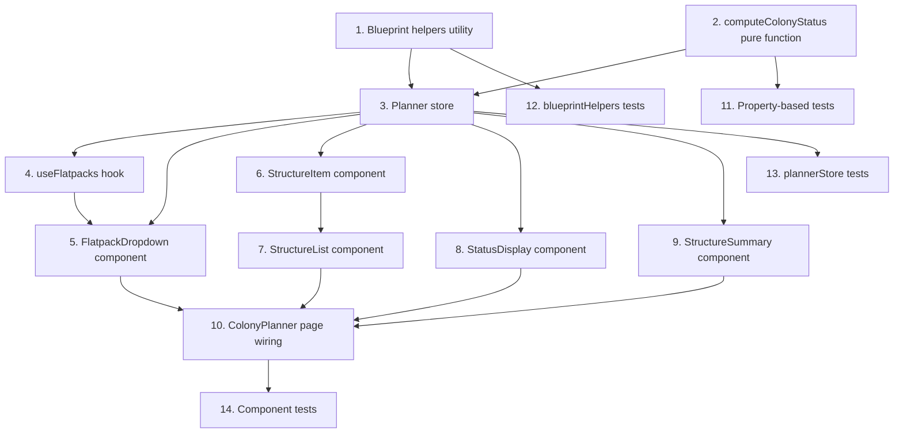

# Implementation Plan:

## Overview

Implement the Colony Planner Web feature as a client-side "what-if" colony planning tool. Work proceeds bottom-up: pure utility functions and computation logic first, then the Zustand store, then individual UI components, then page-level wiring, and finally tests. This ensures each layer has its dependencies available before implementation.

## Task Dependency Graph

```json
{
  "waves": [
    { "id": "wave-1", "name": "Pure Logic Layer", "tasks": ["1", "2"] },
    { "id": "wave-2", "name": "State Management", "tasks": ["3"] },
    { "id": "wave-3", "name": "Data Fetching", "tasks": ["4"] },
    { "id": "wave-4", "name": "UI Components", "tasks": ["5", "6", "7", "8", "9"] },
    { "id": "wave-5", "name": "Page Wiring", "tasks": ["10"] },
    { "id": "wave-6", "name": "Tests", "tasks": ["11", "12", "13", "14"] }
  ]
}
```



## Tasks

- [x] 1. Create blueprintHelpers utility
  - Create `OE2EmpireTracker.Web/src/utils/blueprintHelpers.ts`
  - Implement `isFlatpack(blueprint)` — case-insensitive check for `bluePrintType` starting with "Flatpacks/"
  - Implement `extractSubType(bluePrintType)` — extracts sub-type after "Flatpacks/" prefix
  - Implement `extractBlueprintProperties(detail)` — parses Blueprint_Properties from detail response into typed `BlueprintProperties` object
  - Implement `parsePropertyValue(value)` — returns 0 for missing/non-numeric values
  - _Satisfies: Req 1 Criterion 2, Req 9 Criteria 3-5_
  - _Inputs: design.md interfaces section_
  - _Output: `OE2EmpireTracker.Web/src/utils/blueprintHelpers.ts`_
  - _Verification: TypeScript compiles, unit tests in task 12_

- [x] 2. Create computeColonyStatus pure function
  - Create `OE2EmpireTracker.Web/src/pages/planner/computeColonyStatus.ts`
  - Implement the pure function following the computation rules from design.md:
    - Online: contributes all provisions + workers
    - Built: contributes workers + food only
    - Staged: contributes food only
    - Entertainment Required = total workers x 2
    - Warehouse Required = 0
    - Empty list returns null
  - Export `PlannedStructure`, `BlueprintProperties`, `ColonyStatus`, and `StructureState` types
  - _Satisfies: Req 4 Criteria 1-9, Req 5 Criteria 2-6_
  - _Inputs: design.md computation rules table_
  - _Output: `OE2EmpireTracker.Web/src/pages/planner/computeColonyStatus.ts`_
  - _Verification: TypeScript compiles, property-based tests in task 11_

- [x] 3. Create/modify plannerStore with blueprint cache and local computation
  - Modify `OE2EmpireTracker.Web/src/pages/planner/plannerStore.ts`
  - Implement Zustand store with `PlannerState` interface from design.md
  - Actions: `addStructure`, `removeStructure`, `setStructureState`, `cacheBlueprint`, `clearPlan`
  - On every mutation (add/remove/toggle), recompute status via `computeColonyStatus`
  - Blueprint cache: `Record<string, BlueprintProperties>` keyed by UUID
  - _Satisfies: Req 2 Criteria 1-5, Req 3 Criterion 1, Req 6 Criteria 3-4, Req 9 Criterion 2_
  - _Inputs: `computeColonyStatus.ts`, `blueprintHelpers.ts`, design.md store interface_
  - _Output: `OE2EmpireTracker.Web/src/pages/planner/plannerStore.ts`_
  - _Verification: TypeScript compiles, unit tests in task 13_

- [x] 4. Create useFlatpacks TanStack Query hook
  - Create `OE2EmpireTracker.Web/src/api/hooks/useFlatpacks.ts`
  - Implement TanStack Query hook fetching from `/api/v1/public/blueprints`
  - Filter results using `isFlatpack` from blueprintHelpers
  - Configure: staleTime 5 min, retry 3, exponential backoff, refetchOnWindowFocus false
  - Return typed `FlatpackOption[]` with uuid, name (extendedName), subType
  - _Satisfies: Req 1 Criteria 1-2, Req 6 Criterion 2_
  - _Inputs: `blueprintHelpers.ts`, existing API client pattern_
  - _Output: `OE2EmpireTracker.Web/src/api/hooks/useFlatpacks.ts`_
  - _Verification: TypeScript compiles, hook returns filtered flatpack list_

- [x] 5. Create FlatpackDropdown component
  - Create `OE2EmpireTracker.Web/src/pages/planner/FlatpackDropdown.tsx`
  - Searchable dropdown using Radix Popover (or existing project pattern)
  - Group options by sub-type (MiningRig, Refinery, ResearchLaboratory, Manufactory, ColonyCommandCentre, CommodityFactory)
  - Case-insensitive substring search filtering
  - Error state with retry button when fetch fails
  - Add button triggers `onAdd` callback with uuid, name, subType
  - _Satisfies: Req 1 Criteria 3-7_
  - _Inputs: `useFlatpacks.ts`, design.md FlatpackDropdown interface_
  - _Output: `OE2EmpireTracker.Web/src/pages/planner/FlatpackDropdown.tsx`_
  - _Verification: TypeScript compiles, component renders with grouped options_

- [x] 6. Create StructureItem component
  - Create `OE2EmpireTracker.Web/src/pages/planner/StructureItem.tsx`
  - Display structure name, sub-type, current state (Staged/Built/Online)
  - State toggle control (three-state: Staged, Built, Online)
  - Remove button
  - Show structure contribution: Power Provided/Required, worker slots, Food Provision
  - Visual indicators: Online = active (green), Staged = inactive (gray), Built = partial (amber)
  - _Satisfies: Req 5 Criterion 1, Req 8 Criteria 1-4_
  - _Inputs: `PlannedStructure` type from plannerStore_
  - _Output: `OE2EmpireTracker.Web/src/pages/planner/StructureItem.tsx`_
  - _Verification: TypeScript compiles, component renders with state toggle_

- [x] 7. Create StructureList component
  - Create `OE2EmpireTracker.Web/src/pages/planner/StructureList.tsx`
  - Render list of `StructureItem` components from plannerStore
  - Wire remove button to `removeStructure` store action
  - Wire state toggle to `setStructureState` store action
  - Empty state message when no structures added
  - _Satisfies: Req 2 Criterion 3, Req 3 Criteria 1-3_
  - _Inputs: `plannerStore.ts`, `StructureItem.tsx`_
  - _Output: `OE2EmpireTracker.Web/src/pages/planner/StructureList.tsx`_
  - _Verification: TypeScript compiles, list renders and responds to actions_

- [x] 8. Create/modify StatusDisplay component
  - Modify `OE2EmpireTracker.Web/src/pages/planner/StatusDisplay.tsx`
  - Read `status` from plannerStore (local computation result, not server response)
  - Display five Status_Categories: Power, Habitation, Food, Entertainment, Warehouse
  - Show provided vs required for each category
  - Color coding: green for surplus, red for deficit
  - Empty state: neutral prompt to add structures (when status is null)
  - _Satisfies: Req 4 Criteria 8-9_
  - _Inputs: `plannerStore.ts`, `ColonyStatus` type_
  - _Output: `OE2EmpireTracker.Web/src/pages/planner/StatusDisplay.tsx`_
  - _Verification: TypeScript compiles, displays surplus/deficit correctly_

- [x] 9. Create StructureSummary component
  - Create `OE2EmpireTracker.Web/src/pages/planner/StructureSummary.tsx`
  - Display count of each structure sub-type in the plan
  - Display total number of structures
  - Read from plannerStore structures array
  - _Satisfies: Req 8 Criterion 5_
  - _Inputs: `plannerStore.ts`_
  - _Output: `OE2EmpireTracker.Web/src/pages/planner/StructureSummary.tsx`_
  - _Verification: TypeScript compiles, summary counts match store state_

- [x] 10. Wire ColonyPlanner page with all components
  - Modify `OE2EmpireTracker.Web/src/pages/planner/ColonyPlanner.tsx`
  - Remove existing StructurePanel (UUID text input) and server-side status call
  - Compose: FlatpackDropdown, StructureList, StatusDisplay, StructureSummary
  - Wire FlatpackDropdown onAdd: fetch blueprint detail, cache, addStructure
  - Add Clear/Reset button with confirmation dialog (confirm only when plan non-empty)
  - Handle blueprint detail fetch errors (show inline error, don't add structure)
  - _Satisfies: Req 2 Criteria 1-2 and 6-7, Req 7 Criteria 1-3_
  - _Inputs: All planner components, `plannerStore.ts`, public API client_
  - _Output: `OE2EmpireTracker.Web/src/pages/planner/ColonyPlanner.tsx`_
  - _Verification: TypeScript compiles, page renders with all sub-components, add/clear flows work_

- [x] 11. Property-based tests for computeColonyStatus
  - Create `OE2EmpireTracker.Web/src/pages/planner/computeColonyStatus.property.test.ts`
  - Implement fast-check arbitraries for PlannedStructure and BlueprintProperties
  - Property 1: Pure function (deterministic) — same input produces same output
  - Property 2: Staged contributes only food provision
  - Property 3: Online contributes all provisions plus workers
  - Property 4: Built contributes workers + food, no other provisions
  - Property 5: Entertainment required = total workers x 2
  - Property 10: Empty list returns null
  - _Satisfies: Correctness Properties 1-5, 10_
  - _Inputs: `computeColonyStatus.ts`_
  - _Output: `OE2EmpireTracker.Web/src/pages/planner/computeColonyStatus.property.test.ts`_
  - _Verification: `npx vitest run src/pages/planner/computeColonyStatus.property.test.ts` passes_

- [x] 12. Unit tests for blueprintHelpers
  - Create `OE2EmpireTracker.Web/src/utils/blueprintHelpers.test.ts`
  - Test `isFlatpack`: includes "Flatpacks/MiningRig", excludes "Ships/Fighter", case-insensitive
  - Test `extractSubType`: "Flatpacks/MiningRig" produces "MiningRig", "Flatpacks/CommodityFactory/Agridome" produces "CommodityFactory/Agridome"
  - Test `extractBlueprintProperties`: valid properties, missing keys default to 0, non-numeric values default to 0
  - Test `parsePropertyValue`: numbers, strings, null, undefined, NaN
  - _Satisfies: Correctness Properties 7-8_
  - _Inputs: `blueprintHelpers.ts`_
  - _Output: `OE2EmpireTracker.Web/src/utils/blueprintHelpers.test.ts`_
  - _Verification: `npx vitest run src/utils/blueprintHelpers.test.ts` passes_

- [x] 13. Unit tests for plannerStore
  - Create `OE2EmpireTracker.Web/src/pages/planner/plannerStore.test.ts`
  - Test addStructure: adds to list, recomputes status
  - Test removeStructure: removes by id, preserves others, recomputes (Property 9)
  - Test setStructureState: toggles state, recomputes status
  - Test cacheBlueprint: stores in cache, prevents redundant entries (Property 6)
  - Test clearPlan: empties list, resets status to null
  - _Satisfies: Correctness Properties 6, 9_
  - _Inputs: `plannerStore.ts`_
  - _Output: `OE2EmpireTracker.Web/src/pages/planner/plannerStore.test.ts`_
  - _Verification: `npx vitest run src/pages/planner/plannerStore.test.ts` passes_

- [x] 14. Component integration tests
  - Create `OE2EmpireTracker.Web/src/pages/planner/ColonyPlanner.test.tsx`
  - Test: adding a structure updates status display
  - Test: removing a structure updates status display
  - Test: clear plan resets to empty state
  - Test: confirmation dialog appears when clearing non-empty plan
  - Test: error display when blueprint detail fetch fails
  - _Satisfies: Req 2 Criterion 6-7, Req 3 Criterion 2, Req 7 Criterion 3_
  - _Inputs: All planner components_
  - _Output: `OE2EmpireTracker.Web/src/pages/planner/ColonyPlanner.test.tsx`_
  - _Verification: `npx vitest run src/pages/planner/ColonyPlanner.test.tsx` passes_

## Notes

- The web project uses Vitest for testing and fast-check for property-based tests
- All computation is client-side after initial blueprint data fetch
- No authentication required — uses only `/api/v1/public/` endpoints
- The existing StructurePanel.tsx (UUID text input) is replaced by this implementation
- Blueprint detail caching in the Zustand store prevents redundant API calls
