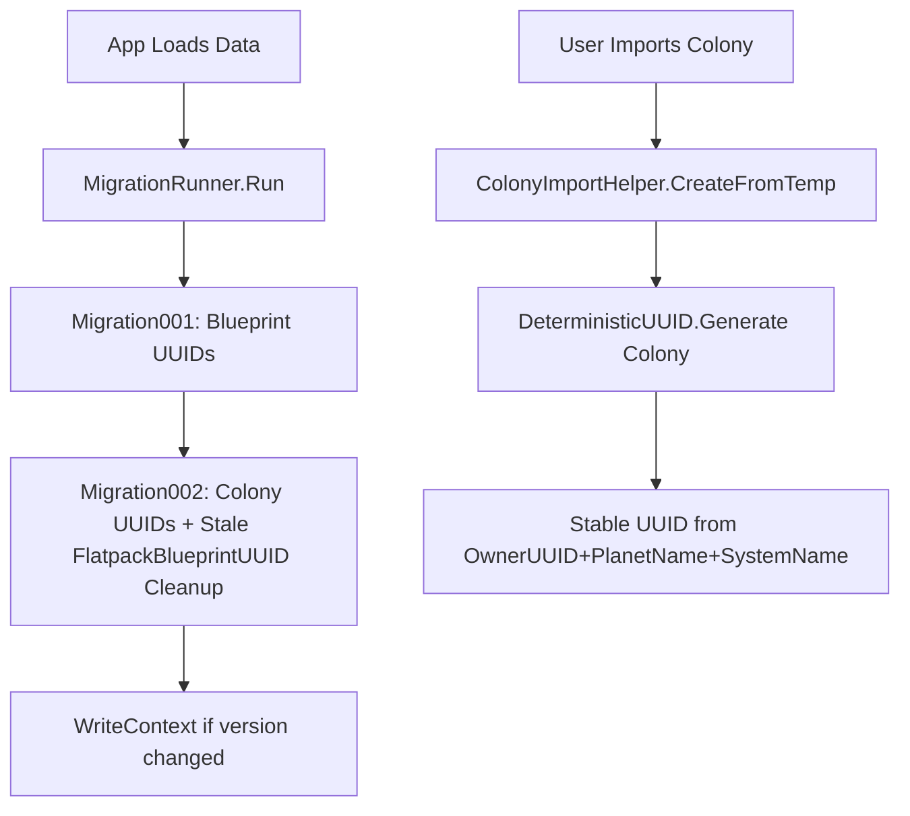

# Design Document: Colony Stable UUID

## Overview

This fix addresses two interrelated bugs: structure duplication on colony reimport (caused by stale `FlatpackBlueprintUUID` references after the blueprint UUID migration), and colony UUID instability (random UUIDs break delivery route/plan references on delete+reimport). The solution extends the existing deterministic UUID and migration infrastructure to cover colonies.

## Architecture



The fix has three parts:
1. **Extend `RemapUUID`** to walk `RouteStop.ColonyUUID` and `DeliveryPlanStop.ColonyUUID`
2. **Add `Migration002_ColonyDeterministicUUIDs`** that remaps colony UUIDs to deterministic values AND cleans up any stale `FlatpackBlueprintUUID` references on colony structures
3. **Update `ColonyImportHelper.CreateFromTemp`** to use deterministic UUIDs for new colonies

## Components and Interfaces

### DeterministicUUID (extended)

Add a colony overload using a different namespace GUID to avoid collisions with blueprint UUIDs:

```csharp
// New namespace for colony UUIDs (distinct from blueprint namespace)
private static readonly Guid ColonyNamespace =
    new Guid("a1b2c3d4-e5f6-7890-abcd-ef1234567890");

public static string Generate(Colony colony)
{
    return Generate(colony.OwnerUUID, colony.PlanetName, colony.SystemName);
}

public static string Generate(string ownerUUID, string planetName, string systemName)
{
    string input = $"{ownerUUID ?? ""}|{planetName ?? ""}|{systemName ?? ""}";
    return GenerateV5(ColonyNamespace, input).ToString();
}
```

Dedup key: `(OwnerUUID, PlanetName, SystemName)` — one colony per planet per player, matching the existing `FindByPlanet` logic.

### RemapUUID (extended)

Add colony UUID reference walking to the existing `Remap` method:

```csharp
// Colony.UUID
foreach (var colony in pc.ColonyList)
    if (colony.UUID == oldUUID) colony.UUID = newUUID;

// RouteStop.ColonyUUID
foreach (var route in pc.DeliveryRouteList)
    foreach (var stop in route.Stops)
        if (stop.ColonyUUID == oldUUID)
            stop.ColonyUUID = newUUID;

// DeliveryPlanStop.ColonyUUID
foreach (var plan in pc.DeliveryPlanList)
    foreach (var stop in plan.Stops)
        if (stop.ColonyUUID == oldUUID)
            stop.ColonyUUID = newUUID;
```

### Colony Model (extended)

Add `LegacyUUID` property matching the Blueprint pattern:

```csharp
[DefaultValue(null)]
public string LegacyUUID { get; set; }
```

### Migration002_ColonyDeterministicUUIDs

New migration that does two things:

1. **Fix stale FlatpackBlueprintUUIDs** — For each colony structure, check if `FlatpackBlueprintUUID` matches any global blueprint's `LegacyUUID`. If so, remap it to that blueprint's current UUID. This catches structures that weren't saved after Migration001 ran.

2. **Assign deterministic colony UUIDs** — For each colony, generate a deterministic UUID from `(OwnerUUID, PlanetName, SystemName)`. If the colony's current UUID differs, save the old UUID as `LegacyUUID` and call `RemapUUID.Remap` to update all references.

```csharp
public static void Run(EmpireContext ec, PlayerContext pc)
{
    // Phase 1: Fix stale FlatpackBlueprintUUIDs
    var legacyLookup = ec.GlobalBlueprintList
        .Where(bp => !string.IsNullOrEmpty(bp.LegacyUUID))
        .ToDictionary(bp => bp.LegacyUUID, bp => bp.UUID);

    foreach (var colony in pc.ColonyList)
        foreach (var s in colony.Structures)
        {
            if (!string.IsNullOrEmpty(s.FlatpackBlueprintUUID) &&
                legacyLookup.TryGetValue(s.FlatpackBlueprintUUID, out string currentUUID))
            {
                s.FlatpackBlueprintUUID = currentUUID;
            }
        }

    // Phase 2: Deterministic colony UUIDs
    foreach (var colony in pc.ColonyList.ToList())
    {
        string deterministicUUID = DeterministicUUID.Generate(colony);
        if (colony.UUID == deterministicUUID) continue;

        if (string.IsNullOrEmpty(colony.LegacyUUID))
            colony.LegacyUUID = colony.UUID;

        RemapUUID.Remap(ec, pc, colony.UUID, deterministicUUID);
    }
}
```

### MigrationRunner (updated)

```csharp
public const int CurrentVersion = 2;

private static readonly Dictionary<int, Action<EmpireContext, PlayerContext>>
    Migrations = new Dictionary<int, Action<EmpireContext, PlayerContext>>
{
    { 1, Migration001_DeterministicUUIDs.Run },
    { 2, Migration002_ColonyDeterministicUUIDs.Run },
};
```

### ColonyImportHelper.CreateFromTemp (updated)

Replace `Guid.NewGuid()` with deterministic UUID:

```csharp
public static Colony CreateFromTemp(Colony tempColony, string ownerUUID)
{
    var colony = new Colony();
    colony.UUID = DeterministicUUID.Generate(ownerUUID, tempColony.PlanetName, tempColony.SystemName);
    colony.OwnerUUID = ownerUUID;
    // ... rest unchanged
}
```

## Data Models

### Colony (extended)

```csharp
public class Colony
{
    public string UUID { get; set; }
    public string OwnerUUID { get; set; } = string.Empty;
    [DefaultValue(null)]
    public string LegacyUUID { get; set; }    // NEW
    public string PlanetName { get; set; }
    public string SystemName { get; set; } = string.Empty;
    public string ColonyName { get; set; }
    // ... rest unchanged
}
```

## Correctness Properties

### Property 1: Deterministic colony UUID round-trip

*For any* `(OwnerUUID, PlanetName, SystemName)` triple, generating a deterministic UUID twice should yield the same value. Different triples should (with overwhelming probability) yield different UUIDs.

**Validates: Requirements 2.3**

### Property 2: Colony UUID migration preserves LegacyUUID

*For any* colony with a random UUID, after migration the colony's `LegacyUUID` should equal the original random UUID, and the colony's `UUID` should equal the deterministic UUID. Running migration again should not change `LegacyUUID`.

**Validates: Requirements 2.4, 2.6**

### Property 3: RemapUUID walks all colony references

*For any* colony UUID that appears in `RouteStop.ColonyUUID` or `DeliveryPlanStop.ColonyUUID`, calling `RemapUUID.Remap(oldUUID, newUUID)` should update all those references to `newUUID`.

**Validates: Requirements 2.5**

### Property 4: Stale FlatpackBlueprintUUID cleanup

*For any* colony structure whose `FlatpackBlueprintUUID` matches a global blueprint's `LegacyUUID`, after Migration002 runs the structure's `FlatpackBlueprintUUID` should equal that blueprint's current UUID.

**Validates: Requirements 2.1**

### Property 5: Migration idempotency

*For any* data set, running Migration002 twice should produce the same result as running it once. Colony UUIDs, LegacyUUIDs, and all references should be identical after the second run.

**Validates: Requirements 3.4**

## Error Handling

- **Missing PlanetName/SystemName**: If a colony has no PlanetName (shouldn't happen for imported colonies), the deterministic UUID generation still works — it just uses empty strings. The UUID will be stable but not meaningful. This matches how `FindByPlanet` already handles null/empty values.
- **Duplicate dedup keys**: If two colonies somehow have the same `(OwnerUUID, PlanetName, SystemName)`, they'd get the same deterministic UUID. Migration002 should detect this and skip the second colony, logging a warning. In practice this shouldn't happen because `FindByPlanet` prevents duplicate imports.
- **Migration failure**: Follows the existing `MigrationRunner` pattern — any exception sets `MigrationFailed = true`, blocks `WriteContext()`, and shows an error dialog. Data files are not modified in a partially-migrated state.

## Testing Strategy

### Property-Based Tests (FsCheck)

1. **Deterministic UUID round-trip** — Generate random (ownerUUID, planetName, systemName) triples, assert `Generate` is deterministic and collision-resistant
2. **LegacyUUID preservation** — Generate random colonies, run migration, assert LegacyUUID == original UUID, run again, assert LegacyUUID unchanged
3. **RemapUUID colony references** — Generate random delivery routes/plans with colony UUID references, call Remap, assert all references updated
4. **Stale FlatpackBlueprintUUID cleanup** — Generate colonies with structures referencing LegacyUUIDs, run migration, assert remapped to current UUIDs
5. **Migration idempotency** — Run migration twice, assert identical state

### Unit Tests (NUnit)

- Integration test: create a colony with old-style FlatpackBlueprintUUIDs, run Migration002, verify structures now reference current blueprint UUIDs
- Integration test: create colonies with random UUIDs referenced by delivery routes/plans, run Migration002, verify all references updated
- Edge case: colony with no PlanetName still gets a stable UUID
- Edge case: migration skips colonies that already have deterministic UUIDs
