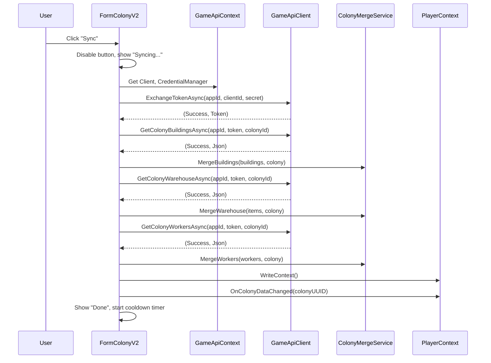

# Design Document: Colony Sync Wiring

## Overview

This design connects the GameApiSyncScheduler's virtual method stubs to the real PlayerContext singleton, and adds a manual "Sync Colony" button to FormColonyV2 for on-demand single-colony synchronization.

The colony-api-sync spec implemented the merge logic and scheduler orchestration with virtual methods that return null/no-op by default. This spec creates a production subclass that overrides those methods to read/write real player data, wires it into GameApiContext.Initialize(), and adds a user-facing manual sync trigger on the colony form.

### Key Design Decisions

1. **Separate file for production subclass** — `ProductionSyncScheduler` lives in `OE2EmpireTracker.Common/Services/ProductionSyncScheduler.cs` (not inline in GameApiContext) for testability and single-responsibility.
2. **Constructor injection for PlayerContext** — The production subclass receives PlayerContext as a constructor parameter rather than accessing the singleton directly, enabling future test scenarios.
3. **Async void pattern avoided** — The sync button uses `async void` only for the click handler (required by WinForms event signature), with all logic delegated to an async Task method.
4. **Timer-based cooldown** — A `System.Windows.Forms.Timer` manages the 10-second rate limit, re-enabling the button on tick.

## Architecture

```
┌─────────────────────────────────────────────────────────────┐
│ GameApiContext.Initialize()                                  │
│   Creates ProductionSyncScheduler (subclass)                │
│   instead of base GameApiSyncScheduler                      │
└─────────────────────────┬───────────────────────────────────┘
                          │ owns
                          ▼
┌─────────────────────────────────────────────────────────────┐
│ ProductionSyncScheduler : GameApiSyncScheduler               │
│   - PlayerContext _playerContext                             │
│   + GetPlayerProfile(uuid) → PlayerContext.FindMutable...   │
│   + GetPlayerColonies(uuid) → filter _colonyList by owner   │
│   + WriteContext() → PlayerContext.WriteContext()            │
│   + RaiseColonyDataChanged() → PlayerContext.OnColony...("")│
└─────────────────────────────────────────────────────────────┘

┌─────────────────────────────────────────────────────────────┐
│ FormColonyV2                                                 │
│   [cmdSync] button in flpIdentity header area               │
│   - Click → SyncSelectedColonyAsync()                       │
│   - 10s cooldown timer (timerSyncCooldown)                  │
│   - Status feedback: "Sync" → "Syncing..." → "Done"/"Error"│
└─────────────────────────────────────────────────────────────┘
```

### Sequence: Manual Sync



## Components and Interfaces


### ProductionSyncScheduler

**File:** `OE2EmpireTracker.Common/Services/ProductionSyncScheduler.cs`

```csharp
internal class ProductionSyncScheduler : GameApiSyncScheduler
{
    private readonly PlayerContext _playerContext;

    public ProductionSyncScheduler(
        GameApiClient client,
        GameApiCredentialManager credentialManager,
        GameApiConnectionMonitor connectionMonitor,
        string appId,
        string clientId,
        PlayerContext playerContext)
        : base(client, credentialManager, connectionMonitor, appId, clientId)
    {
        _playerContext = playerContext;
    }

    internal override PlayerProfile GetPlayerProfile(string playerUUID)
    {
        return _playerContext.FindMutablePlayerProfile(playerUUID);
    }

    internal override List<Colony> GetPlayerColonies(string playerUUID)
    {
        return _playerContext.GetMutableColoniesForOwner(playerUUID);
    }

    internal override void WriteContext()
    {
        _playerContext.WriteContext();
    }

    internal override void RaiseColonyDataChanged()
    {
        _playerContext.OnColonyDataChanged(string.Empty);
    }
}
```

**Design rationale:**
- `internal` visibility — only GameApiContext needs to instantiate it.
- Constructor injection of PlayerContext — avoids hidden singleton coupling.
- Each override is a single delegation call — no additional logic.

### PlayerContext.GetMutableColoniesForOwner (new method)

**File:** `OE2EmpireTracker.Common/Services/PlayerContext.cs`

A new `internal` method that returns the mutable colony list filtered by OwnerUUID. This is needed because `GetCurrentPlayerColonies()` filters by the *current* player, but the scheduler syncs all configured characters.

```csharp
internal List<Colony> GetMutableColoniesForOwner(string ownerUUID)
{
    lock (_listLock)
    {
        return _colonyList.Where(c => c.OwnerUUID == ownerUUID).ToList();
    }
}
```

### GameApiContext.Initialize() Change

Replace the direct `new GameApiSyncScheduler(...)` with `new ProductionSyncScheduler(...)`:

```csharp
var syncScheduler = new ProductionSyncScheduler(
    client,
    credentialManager,
    connectionMonitor,
    settings.AppId,
    settings.ClientId,
    EmpireContext.PlayerContext);
```

The `SyncScheduler` property type remains `GameApiSyncScheduler` (polymorphism) — no consumer changes needed.

### Colony.ColonyId Property (new)

**File:** `OE2EmpireTracker.Common/Models/Colony.cs`

```csharp
[JsonProperty("colonyId")]
[DefaultValue(0)]
public int ColonyId { get; set; }
```

A value of 0 means the colony has not been synced from the game API yet.

### ColonyMergeService Change

In `MergeAllColonyFields` and `CreateColonyFromApi`, set `colony.ColonyId = apiColony.ColonyId` so the game API identifier is persisted on the local Colony model.


### FormColonyV2 Sync Button

**Files:** `OE2EmpireTracker/Forms/ColonyV2/FormColonyV2.Designer.cs`, `FormColonyV2.cs`

**UI Placement:** A `Button` named `cmdSync` added to the `flpIdentity` FlowLayoutPanel (the header area containing planet name, colony name, system name). Placed after the existing identity fields.

**Button Specification:**
- Text: "Sync"
- Size: 75 × 25
- Tooltip: "Sync buildings, warehouse, and workers from game API"
- Enabled: only when a colony is selected AND GameApiContext.Instance is not null AND colony.ColonyId != 0 AND cooldown is not active

**Async Sync Method:** `SyncSelectedColonyAsync()`
- Runs on a background thread via `Task.Run`
- Marshals UI updates back via `BeginInvoke`
- Handles all error cases (401, 403, 404, network exceptions)
- Partial success: if buildings succeed but warehouse fails, buildings are still persisted

**Cooldown Timer:** `timerSyncCooldown` (System.Windows.Forms.Timer)
- Interval: 10000ms (10 seconds)
- On Tick: re-enable button (if conditions met), stop timer
- Started after sync completes (success or failure)

**Status Feedback Timer:** `timerSyncStatus` (System.Windows.Forms.Timer)
- Interval: 2000ms (2 seconds)
- On Tick: revert button text to "Sync", stop timer

## Data Models

### Colony (modified)

| Property | Type | Default | Description |
|----------|------|---------|-------------|
| ColonyId | int | 0 | Game API colony identifier. 0 = not yet synced. |
| BlueCollarAllocated | int | 0 | Workers allocated (from API WorkforceOverview) |
| BlueCollarUnallocated | int | 0 | Workers unallocated (from API WorkforceOverview) |
| WhiteCollarAllocated | int | 0 | Workers allocated (from API WorkforceOverview) |
| WhiteCollarUnallocated | int | 0 | Workers unallocated (from API WorkforceOverview) |
| SpecialistAllocated | int | 0 | Workers allocated (from API WorkforceOverview) |
| SpecialistUnallocated | int | 0 | Workers unallocated (from API WorkforceOverview) |

Added to existing Colony model. Serialized in JSON.

### New DTOs (Workers)

**File:** `OE2EmpireTracker.Common/Models/GameApiColonyWorkersResponse.cs`

```csharp
public class GameApiColonyWorkersResponse
{
    [JsonProperty("workerCurrentAttitude")]
    public int WorkerCurrentAttitude { get; set; }

    [JsonProperty("colonyModifiers")]
    public List<GameApiColonyModifier> ColonyModifiers { get; set; }

    [JsonProperty("colonyCapacities")]
    public GameApiColonyCapacities ColonyCapacities { get; set; }

    [JsonProperty("workforceCommodityDemands")]
    public List<GameApiCommodityDemand> WorkforceCommodityDemands { get; set; }

    [JsonProperty("workforceOverview")]
    public GameApiWorkforceOverview WorkforceOverview { get; set; }

    [JsonProperty("workforceDetail")]
    public List<GameApiColonyWorkerDetail> WorkforceDetail { get; set; }

    [JsonProperty("wages")]
    public GameApiColonyWages Wages { get; set; }
}

public class GameApiCommodityDemand
{
    [JsonProperty("id")]
    public int Id { get; set; }
    [JsonProperty("typeC")]
    public string TypeC { get; set; }
    [JsonProperty("commodityType")]
    public string CommodityType { get; set; }
    [JsonProperty("typeId")]
    public int TypeId { get; set; }
    [JsonProperty("typeName")]
    public string TypeName { get; set; }
    [JsonProperty("amount")]
    public int Amount { get; set; }
    [JsonProperty("requiredBy")]
    public DateTime RequiredBy { get; set; }
    [JsonProperty("fulfilled")]
    public bool Fulfilled { get; set; }
}

public class GameApiWorkforceOverview
{
    [JsonProperty("blueCollarAllocated")]
    public int BlueCollarAllocated { get; set; }
    [JsonProperty("blueCollarUnallocated")]
    public int BlueCollarUnallocated { get; set; }
    [JsonProperty("whiteCollarAllocated")]
    public int WhiteCollarAllocated { get; set; }
    [JsonProperty("whiteCollarUnallocated")]
    public int WhiteCollarUnallocated { get; set; }
    [JsonProperty("specialistAllocated")]
    public int SpecialistAllocated { get; set; }
    [JsonProperty("specialistUnallocated")]
    public int SpecialistUnallocated { get; set; }
}

public class GameApiColonyWorkerDetail
{
    [JsonProperty("workerId")]
    public int WorkerId { get; set; }
    [JsonProperty("workerTypeId")]
    public int WorkerTypeId { get; set; }
    [JsonProperty("buildingTypeId")]
    public int BuildingTypeId { get; set; }
    [JsonProperty("name")]
    public string Name { get; set; }
    [JsonProperty("downTools")]
    public int DownTools { get; set; }
}

public class GameApiColonyWages
{
    [JsonProperty("currentWagePercentage")]
    public int CurrentWagePercentage { get; set; }
    [JsonProperty("galacticWageStandard")]
    public int GalacticWageStandard { get; set; }
    [JsonProperty("currentWageBillPerCycle")]
    public int CurrentWageBillPerCycle { get; set; }
    [JsonProperty("lastWageChange")]
    public DateTime? LastWageChange { get; set; }
}

public class GameApiColonyModifier
{
    [JsonProperty("Id")]
    public int? Id { get; set; }
    [JsonProperty("description")]
    public string Description { get; set; }
    [JsonProperty("modifierNumber")]
    public int ModifierNumber { get; set; }
    [JsonProperty("positive")]
    public bool Positive { get; set; }
    [JsonProperty("temporary")]
    public bool Temporary { get; set; }
}

public class GameApiColonyCapacities
{
    [JsonProperty("powerDraw")]
    public double PowerDraw { get; set; }
    [JsonProperty("powerGenerated")]
    public int PowerGenerated { get; set; }
    [JsonProperty("luxuriesNeeded")]
    public int LuxuriesNeeded { get; set; }
    [JsonProperty("luxuriesAvailable")]
    public int LuxuriesAvailable { get; set; }
    [JsonProperty("habitationNeeded")]
    public int HabitationNeeded { get; set; }
    [JsonProperty("habitationAvailable")]
    public int HabitationAvailable { get; set; }
    [JsonProperty("warehouseUsed")]
    public int WarehouseUsed { get; set; }
    [JsonProperty("warehouseCapacity")]
    public int WarehouseCapacity { get; set; }
    [JsonProperty("foodNeeded")]
    public int FoodNeeded { get; set; }
    [JsonProperty("foodAvailable")]
    public int FoodAvailable { get; set; }
}
```

### GameApiClient.GetColonyWorkersAsync (new method)

**File:** `OE2EmpireTracker.Common/Client/GameApiClient.cs`
**Satisfies:** Req 10

```csharp
public async Task<(bool Success, string Json)> GetColonyWorkersAsync(
    string appId, string accessToken, int colonyId)
```

Follows the identical pattern as `GetColonyBuildingsAsync` and `GetColonyWarehouseAsync`:
- URL: `{serverUrl}/v1/colonies/{colonyId}/workers`
- Headers: `Authorization: Bearer {accessToken}`, `X-App-Id: {appId}`
- Returns: `(true, json)` on 200, `(false, "401")` on 401, `(false, "403")` on 403, `(false, "404")` on 404

### ColonyMergeService.MergeWorkers (new method)

**File:** `OE2EmpireTracker.Common/Services/ColonyMergeService.cs`
**Satisfies:** Req 12, Req 13

```csharp
public static bool MergeWorkers(GameApiColonyWorkersResponse apiWorkers, Colony colony)
```

**Algorithm:**
1. Update `colony.WorkerCurrentAttitude` from `apiWorkers.WorkerCurrentAttitude`
2. If `apiWorkers.WorkforceOverview` is not null, update colony workforce allocation fields
3. If `apiWorkers.Wages` is not null, update `colony.WageLevel` from `CurrentWagePercentage`
4. Map `apiWorkers.WorkforceCommodityDemands` → `colony.Commodities`:
   - For each demand: `Name = TypeName`, `Requested = Amount`, `NeedBy = RequiredBy`, `Fulfilled = Fulfilled`, `Delivered = Fulfilled ? Amount : 0`
5. Compare old vs new Commodities list — return true if any difference

**Commodity Demand Mapping:**

| API Field (GameApiCommodityDemand) | Local Field (CommodityRequested) |
|------------------------------------|----------------------------------|
| TypeName | Name |
| Amount | Requested |
| RequiredBy | NeedBy |
| Fulfilled | Fulfilled |
| (derived: Fulfilled ? Amount : 0) | Delivered |

### GameApiSyncScheduler.SyncColoniesAsync — Workers Integration

**File:** `OE2EmpireTracker.Common/Services/GameApiSyncScheduler.cs`
**Satisfies:** Req 14

Add a `workersScopeAvailable` boolean (starts true) alongside the existing `buildingsScopeAvailable` and `warehouseScopeAvailable`. After the warehouse fetch block for each colony, add:

```csharp
// Workers (Req 14.1, 14.2, 14.3, 14.4)
if (workersScopeAvailable)
{
    var workersResult = await _client.GetColonyWorkersAsync(_appId, accessToken, apiColony.ColonyId).ConfigureAwait(false);
    if (workersResult.Success)
    {
        try
        {
            var wkEnvelope = JsonConvert.DeserializeObject<GameApiServiceResponse<GameApiColonyWorkersResponse>>(workersResult.Json);
            if (wkEnvelope?.Data != null)
            {
                bool workersChanged = ColonyMergeService.MergeWorkers(wkEnvelope.Data, colony);
                if (workersChanged && mergeResult.Updated == 0)
                {
                    mergeResult.Updated++;
                }
            }
        }
        catch (JsonException ex)
        {
            Log.Error(ex, "Colony sync: malformed workers JSON for colonyId={0}", apiColony.ColonyId);
        }
    }
    else if (workersResult.Json == "403")
    {
        workersScopeAvailable = false;
        Log.Info("Colony sync: colony.workers.read scope not available, skipping workers for all colonies");
    }
    else if (workersResult.Json != "404")
    {
        Log.Warn("Colony sync: workers fetch failed for colonyId={0}", apiColony.ColonyId);
    }
}
```


## Error Handling

### Production Scheduler Errors

The ProductionSyncScheduler delegates directly to PlayerContext. If PlayerContext throws (e.g., during WriteContext with a file lock), the exception propagates up to the base scheduler's existing try/catch in `SyncCharacterAsync` and `SyncColoniesAsync`, which log and continue.

### Manual Sync Button Errors

| Error Condition | Handling |
|----------------|----------|
| Colony has no ColonyId (== 0) | Show MessageBox: "This colony has not been synced from the API yet." Abort sync. |
| Token exchange fails (HTTP 401) | Log error, display "Error" for 2s, transition connection monitor to DisconnectedInvalidKey |
| GetColonyBuildingsAsync returns 401 | Log, display "Error", transition to DisconnectedInvalidKey |
| GetColonyBuildingsAsync returns 403 | Log "buildings scope not granted", display "Error" |
| GetColonyBuildingsAsync returns 404 | Log "colony not found on server", display "Error" |
| GetColonyWarehouseAsync fails | Log, display "Error" — but if buildings succeeded, persist building changes (partial success) |
| GetColonyWorkersAsync fails (403/404/network) | Log — but if buildings/warehouse succeeded, persist those changes (partial success) |
| Network exception (HttpRequestException, TaskCanceledException) | Log exception, display "Error", do not crash |
| ObjectDisposedException (form closed during sync) | Catch and discard — form is already gone |

### Thread Safety

- All GameApiClient calls run on a background thread (Task.Run).
- UI updates (button text, enabled state) marshal back via `BeginInvoke`.
- PlayerContext.WriteContext() and OnColonyDataChanged() are safe to call from any thread (WriteContext uses SafeFileWriter; OnColonyDataChanged fires an event that handlers marshal themselves).

## Correctness Properties

### Property 1: Production Scheduler Delegation Correctness

**Validates: Requirements 1.2, 1.3, 1.4, 1.5**

Each virtual method override in ProductionSyncScheduler delegates to exactly one PlayerContext method with no transformation. For any player UUID that exists in PlayerContext, GetPlayerProfile returns the same object reference as FindMutablePlayerProfile, and GetPlayerColonies returns a list containing exactly the colonies whose OwnerUUID matches the input.

**Formal:** `∀ uuid: ProductionSyncScheduler.GetPlayerProfile(uuid) == PlayerContext.FindMutablePlayerProfile(uuid)`
**Formal:** `∀ uuid: ProductionSyncScheduler.GetPlayerColonies(uuid) == PlayerContext._colonyList.Where(c => c.OwnerUUID == uuid)`

**Note:** This feature is primarily wiring (connecting existing components via delegation) and UI interaction (async button click → API calls → status feedback). The merge logic correctness properties are already defined in the colony-api-sync spec. Property-based testing with random input generation does not add value here — example-based unit tests are the appropriate strategy.

## Testing Strategy

This feature is primarily **wiring** (connecting existing components via delegation) and **UI interaction** (async button click → API calls → status feedback). The new code:

1. **ProductionSyncScheduler** — Each override is a single-line delegation to PlayerContext. There is no logic that varies with input; it's a fixed mapping.
2. **Manual sync button** — An async workflow with specific error handling branches. The behavior is determined by HTTP status codes and boolean flags, not by a large input space.
3. **ColonyId field** — A trivial addition to existing merge logic already covered by the colony-api-sync property tests.

None of these have universal properties that benefit from 100+ random iterations. Example-based unit tests and integration tests are the appropriate strategy.

### Unit Tests

| Test | Validates |
|------|-----------|
| ProductionSyncScheduler.GetPlayerProfile returns profile from PlayerContext | Req 1.2 |
| ProductionSyncScheduler.GetPlayerProfile returns null for unknown UUID | Req 1.2 |
| ProductionSyncScheduler.GetPlayerColonies returns filtered list | Req 1.3 |
| ProductionSyncScheduler.WriteContext calls PlayerContext.WriteContext | Req 1.4 |
| ProductionSyncScheduler.RaiseColonyDataChanged calls OnColonyDataChanged("") | Req 1.5 |
| ColonyMergeService sets ColonyId on new colonies | Req 7.2 |
| ColonyMergeService sets ColonyId on matched (updated) colonies | Req 7.2 |
| Colony.ColonyId defaults to 0 | Req 7.1 |
| MergeWorkers maps commodity demands to CommodityRequested list | Req 12.2 |
| MergeWorkers sets Delivered=Amount when Fulfilled=true | Req 12.3 |
| MergeWorkers clears Commodities on empty demand list | Req 12.4 |
| MergeWorkers returns false when data is identical | Req 12.5 |
| MergeWorkers updates WorkerCurrentAttitude | Req 13.1 |
| MergeWorkers updates workforce allocation counts | Req 13.2 |
| MergeWorkers updates WageLevel from CurrentWagePercentage | Req 13.3 |

### Integration Tests (Manual Verification)

| Scenario | Validates |
|----------|-----------|
| GameApiContext.Initialize creates ProductionSyncScheduler | Req 1.1, 2.1 |
| Sync button disabled when no colony selected | Req 3.3 |
| Sync button disabled when GameApiContext.Instance is null | Req 3.4 |
| Sync button enabled when colony selected and API configured | Req 3.5 |
| Click sync → buildings, warehouse, and workers fetched and merged | Req 4.1-4.6 |
| Click sync with ColonyId == 0 → message shown | Req 4.7 |
| Sync shows "Syncing..." then "Done" | Req 5.1-5.2 |
| Sync failure shows "Error" for 2s | Req 5.3 |
| 10-second cooldown prevents rapid clicks | Req 6.1-6.3 |
| Colony display refreshes after successful sync | Req 8.1-8.2 |
| HTTP 401 transitions connection monitor | Req 9.1 |
| Partial success (buildings OK, warehouse/workers fail) persists buildings | Req 9.5, 9.7 |
| Automatic sync fetches workers for each colony | Req 14.1-14.2 |
| Workers 403 disables workers for remaining colonies in cycle | Req 14.3 |

