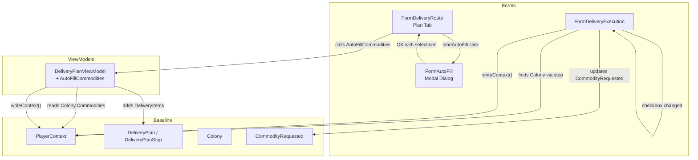

# Design Document: Commodity Delivery Loop

## Overview

This feature closes the loop between colony commodity requests and the delivery system by adding two capabilities:

1. **Auto-Fill**: A button on the Plan tab of `FormDeliveryRoute` that scans each stop's colony for unfulfilled `CommodityRequested` entries and populates the drop-off list with the shortfall quantities. The logic lives on `DeliveryPlanViewModel` for testability, with a simple modal dialog (`FormAutoFill`) for request-type selection.

2. **Fulfillment on Delivery**: When a commodity `DeliveryItem` checkbox is checked/unchecked on `FormDeliveryExecution`, the corresponding `CommodityRequested` on the target colony is updated (Delivered = Requested, Fulfilled = true on check; Delivered = 0, Fulfilled = false on uncheck). This extends the existing `DeliveryItem_CheckedChanged` handler.

Both features use the existing persistence path (`PlayerContext.writeContext()`) and require no new data model classes.

## Architecture

The feature follows the existing layered architecture: Data → Baseline → ViewModels → Forms.



### Key Design Decisions

1. **Auto-fill logic on ViewModel, not Form**: `DeliveryPlanViewModel.AutoFillCommodities()` accepts a `Func<string, Colony>` colony-finder delegate and the route's stops. This keeps the logic unit-testable without WinForms dependencies.

2. **Simple modal Form for type selection**: A standard `Form` with checkboxes and OK/Cancel buttons. No custom control needed. Only the Commodities checkbox is enabled in this phase; Flatpacks, Resources, and Workers are disabled with "(Future)" labels.

3. **Fulfillment in existing handler**: The `DeliveryItem_CheckedChanged` handler in `FormDeliveryExecution` already auto-saves. We add a commodity-specific branch that looks up the colony from the stop and updates `CommodityRequested`.

4. **Additive behavior**: Auto-fill always appends to the existing drop-off list. It does not check for duplicates, giving the player full control.

5. **All-or-nothing fulfillment**: Checking a commodity delivery item sets `Delivered = Requested` and `Fulfilled = true` regardless of the `DeliveryItem.Quantity`. This avoids partial-delivery complexity.

## Components and Interfaces

### New Components

#### `FormAutoFill` (Forms/DeliveryRoute/FormAutoFill.cs)
A modal dialog shown when the Auto-Fill button is clicked.

```csharp
public partial class FormAutoFill : Form
{
    // Checkboxes for request types
    public bool IncludeCommodities { get; }  // enabled, default checked
    // Future: IncludeFlatpacks, IncludeResources, IncludeWorkers (disabled)

    public FormAutoFill() { ... }
    // ShowDialog() returns DialogResult.OK or Cancel
}
```

### Modified Components

#### `DeliveryPlanViewModel` — new method
```csharp
/// <summary>
/// Scans each stop's colony for unfulfilled CommodityRequested entries
/// and adds drop-off DeliveryItems for the shortfall quantities.
/// </summary>
/// <param name="routeStops">Route stops providing ColonyUUID and Sequence.</param>
/// <param name="colonyFinder">Delegate to find a Colony by UUID.</param>
/// <returns>Number of items added.</returns>
public int AutoFillCommodities(
    IEnumerable<RouteStop> routeStops,
    Func<string, Colony> colonyFinder)
```

#### `FormDeliveryRoute` — new button and handler
- Add `cmdAutoFill` button to `flpPlanSelector` (plan command area)
- Wire click handler to show `FormAutoFill`, then call `planViewModel.AutoFillCommodities()`
- Refresh drop-off grid after auto-fill

#### `FormDeliveryExecution.DeliveryItem_CheckedChanged` — extended
- After setting `item.Delivered`, check if `item.ItemType == Commodity`
- If commodity: find the stop containing this item, get the colony, find matching `CommodityRequested` by name
- On check: set `Delivered = Requested`, `Fulfilled = true`
- On uncheck: set `Delivered = 0`, `Fulfilled = false`
- Log warning if no matching `CommodityRequested` found

## Data Models

No new data model classes are needed. The feature uses existing types:

### Existing Types Used

| Type | Location | Role |
|------|----------|------|
| `CommodityRequested` | Baseline/CommodityRequested.cs | Colony commodity need: Name, Requested, Delivered, NeedBy, Fulfilled |
| `DeliveryItem` | Baseline/DeliveryPlan.cs | Plan line item: ItemType, BaseItemTypeID, Name, Quantity, Delivered |
| `DeliveryPlanStop` | Baseline/DeliveryPlan.cs | Stop with DropOff and PickUp lists |
| `DeliveryPlan` | Baseline/DeliveryPlan.cs | Plan containing ordered stops |
| `Colony` | Baseline/Colony.cs | Colony with `List<CommodityRequested> Commodities` |
| `RouteStop` | Baseline/DeliveryRoute.cs | Route stop with ColonyUUID and Sequence |
| `ItemType.ItemTypeEnum` | Data/ItemType.cs | Enum including `Commodity` value |

### Auto-Fill Data Flow

For each `RouteStop` in sequence order:
1. Look up `Colony` via `colonyFinder(routeStop.ColonyUUID)`
2. Skip if colony not found
3. For each `CommodityRequested` in `colony.Commodities`:
   - Skip if `Fulfilled == true`
   - Compute `shortfall = Requested - Delivered`
   - Skip if `shortfall <= 0`
   - Call `AddDropOffItem(stop, ItemType.ItemTypeEnum.Commodity, cr.Name, cr.Name, shortfall)`

### Fulfillment Data Flow

When `DeliveryItem_CheckedChanged` fires for a commodity item:
1. Find the `DeliveryPlanStop` containing this `DeliveryItem`
2. Look up `Colony` via `playerContext.FindColony(stop.ColonyUUID)`
3. Find `CommodityRequested` where `Name == item.Name`
4. If checked: `cr.Delivered = cr.Requested; cr.Fulfilled = true`
5. If unchecked: `cr.Delivered = 0; cr.Fulfilled = false`
6. `playerContext.writeContext()`


## Correctness Properties

*A property is a characteristic or behavior that should hold true across all valid executions of a system — essentially, a formal statement about what the system should do. Properties serve as the bridge between human-readable specifications and machine-verifiable correctness guarantees.*

### Property 1: Auto-fill commodity shortfall mapping

*For any* delivery plan with stops referencing colonies, and *for any* set of `CommodityRequested` entries on those colonies, `AutoFillCommodities` should add a `DeliveryItem` to the correct stop's DropOff list for each unfulfilled entry (where `Fulfilled == false` and `Requested - Delivered > 0`), with `ItemType = Commodity`, `Name = CommodityRequested.Name`, `BaseItemTypeID = CommodityRequested.Name`, and `Quantity = Requested - Delivered`. No items should be added for fulfilled entries or entries with zero/negative shortfall.

**Validates: Requirements 3.1, 3.3, 3.4**

### Property 2: Auto-fill preserves existing drop-off items

*For any* delivery plan stop with an existing DropOff list, after `AutoFillCommodities` executes, all previously existing `DeliveryItem` entries in the DropOff list should still be present with identical field values (ItemType, BaseItemTypeID, Name, Quantity, ResourcePurity, Delivered) at their original indices.

**Validates: Requirements 4.1, 4.2**

### Property 3: Auto-fill PickUp list invariant

*For any* delivery plan with stops, after `AutoFillCommodities` executes, the PickUp list of every `DeliveryPlanStop` should be identical to its state before the call (same count, same items, same field values).

**Validates: Requirements 5.1, 5.2**

### Property 4: Commodity fulfillment on delivery check

*For any* `CommodityRequested` with any `Requested` value, and *for any* matching commodity `DeliveryItem` with any `Quantity`, when the delivery item is marked as delivered (checked), the `CommodityRequested` should have `Delivered == Requested` and `Fulfilled == true`, regardless of the `DeliveryItem.Quantity`.

**Validates: Requirements 6.2, 6.3, 7.1, 7.2**

### Property 5: Commodity unfulfillment on delivery uncheck

*For any* `CommodityRequested` that was previously fulfilled, when the matching commodity `DeliveryItem` is unchecked, the `CommodityRequested` should have `Delivered == 0` and `Fulfilled == false`.

**Validates: Requirements 8.2, 8.3**

## Error Handling

| Scenario | Handling | Location |
|----------|----------|----------|
| Colony not found for a stop during auto-fill | Skip the stop, continue processing remaining stops | `DeliveryPlanViewModel.AutoFillCommodities` |
| No unfulfilled commodities on any colony | Auto-fill completes with 0 items added, UI refreshes normally | `DeliveryPlanViewModel.AutoFillCommodities` |
| No matching `CommodityRequested` when checking a commodity delivery item | Log warning via NLog, continue without error | `FormDeliveryExecution.DeliveryItem_CheckedChanged` |
| No plan selected when Auto-Fill button clicked | Button is hidden/disabled (Req 1.2), so this path is unreachable | `FormDeliveryRoute` |
| Colony not found during fulfillment update | Log warning, skip fulfillment update, delivery item still toggles normally | `FormDeliveryExecution.DeliveryItem_CheckedChanged` |

## Testing Strategy

### Unit Tests (NUnit)

Unit tests cover specific examples, edge cases, and UI-related acceptance criteria:

- **Auto-fill dialog defaults**: Verify Commodities checkbox is enabled and checked, future checkboxes are disabled (Req 2.1–2.6)
- **Auto-fill with no unfulfilled commodities**: Verify 0 items added
- **Auto-fill with missing colony**: Verify stop is skipped, other stops processed (Req 3.6)
- **Auto-fill with duplicate commodity names in existing drop-off**: Verify both old and new items present (Req 4.2)
- **Fulfillment with no matching CommodityRequested**: Verify no exception, warning logged (Req 6.5)
- **UI refresh after auto-fill**: Verify grid repopulation and stop selection preserved (Req 9.1, 9.2)

### Property-Based Tests (FsCheck + NUnit)

Property-based tests use **FsCheck** (via the `FsCheck.NUnit` integration) to verify universal properties across randomly generated inputs. Each test runs a minimum of 100 iterations.

Each property test references its design document property with a tag comment:

```
// Feature: commodity-delivery-loop, Property {N}: {title}
```

| Property | Test Description | Generator Strategy |
|----------|-----------------|-------------------|
| Property 1 | Generate random colonies with random CommodityRequested lists (mix of fulfilled/unfulfilled, various Requested/Delivered values). Create plan stops referencing those colonies. Run AutoFillCommodities and verify output matches expected shortfalls. | Random colony count (1–5), random commodities per colony (0–10), random Fulfilled/Requested/Delivered values |
| Property 2 | Generate random existing DropOff lists, then run AutoFillCommodities. Snapshot the original items before, verify they're unchanged after. | Random existing DeliveryItem lists (0–5 items) with random field values |
| Property 3 | Generate random existing PickUp lists on stops, run AutoFillCommodities, verify PickUp lists are byte-for-byte identical. | Random PickUp lists (0–5 items) |
| Property 4 | Generate random CommodityRequested (random Requested values 1–1000) and random DeliveryItem (random Quantity values 1–500). Simulate check and verify Delivered == Requested, Fulfilled == true. | Random Requested and Quantity values |
| Property 5 | Generate random previously-fulfilled CommodityRequested. Simulate uncheck and verify Delivered == 0, Fulfilled == false. | Random Requested values, pre-set Delivered = Requested and Fulfilled = true |

### Test Configuration

- **Framework**: NUnit 4.5.1
- **Property-based testing library**: FsCheck with FsCheck.NUnit adapter
- **Minimum iterations**: 100 per property test
- **Test location**: `OE2EmpireTracker.Tests/Baseline/` (mirroring source structure)
- Each property-based test MUST be implemented as a single test method with the `[FsCheck.NUnit.Property]` attribute
- Each property test MUST include a comment tag: `// Feature: commodity-delivery-loop, Property {N}: {title}`
