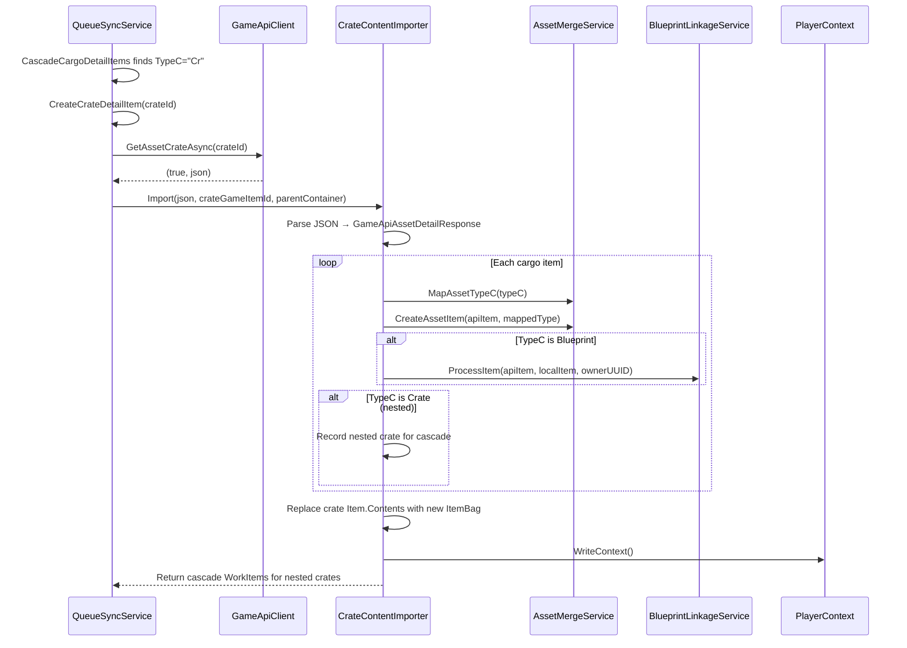

# Design Document: Crate Content Import

## Overview

This feature adds a new `CrateContentImporter` service that parses game API crate detail responses and populates the local `Item.Contents` bag with all item types found inside crates. It integrates into the existing `QueueSyncService` work-item pipeline alongside (not replacing) the existing `CrateImporter` which handles browser-scraped blueprint JSON.

The key distinction: `CrateImporter` extracts blueprint metadata from scraped JSON arrays. `CrateContentImporter` parses the full API crate response (same `GameApiAssetDetailResponse` shape used by location detail) and builds a complete inventory of every item type inside the crate, with blueprint dual-tracking as a side effect.

## Architecture



### Layering

- **Service Layer**: `CrateContentImporter` lives in `OE2EmpireTracker.Common/Services/`
- **Reuses**: `AssetMergeService.MapAssetTypeC`, `AssetMergeService.CreateAssetItem`, `BlueprintLinkageService.ProcessItem`
- **Triggered by**: `QueueSyncService.CreateCrateDetailItem` work item
- **Persistence**: Calls `PlayerContext.WriteContext()` after successful population


## Components and Interfaces

### CrateContentImporter (new)

**Location**: `OE2EmpireTracker.Common/Services/CrateContentImporter.cs`

```csharp
public class CrateContentImporter
{
    /// <summary>
    /// Imports crate contents from a raw JSON response into the local data model.
    /// Returns work items for any nested crates discovered.
    /// </summary>
    /// <param name="json">Raw JSON from GetAssetCrateAsync (GameApiAssetDetailResponse shape).</param>
    /// <param name="crateGameItemId">The GameItemId of the parent crate item.</param>
    /// <param name="parentBag">The ItemBag containing the crate item (ship cargo, station hold, etc.).</param>
    /// <param name="ownerUUID">Owner UUID for blueprint routing.</param>
    /// <param name="visitedCrateIds">Set of already-visited crate IDs for cycle detection.</param>
    /// <returns>Result containing nested crate IDs to cascade and import statistics.</returns>
    public CrateContentImportResult Import(
        string json,
        int crateGameItemId,
        ItemBag parentBag,
        string ownerUUID,
        HashSet<int> visitedCrateIds);
}
```

### CrateContentImportResult (new)

**Location**: `OE2EmpireTracker.Common/Services/CrateContentImporter.cs` (nested or same file)

```csharp
public class CrateContentImportResult
{
    public int TotalItems { get; set; }
    public int Imported { get; set; }
    public int Failed { get; set; }
    public int BlueprintsLinked { get; set; }
    public List<int> NestedCrateIds { get; set; } = new List<int>();
    public Dictionary<ItemType.ItemTypeEnum, int> CountsByType { get; set; }
        = new Dictionary<ItemType.ItemTypeEnum, int>();
    public List<string> Errors { get; set; } = new List<string>();
    public bool Success { get; set; } = true;
}
```

### Modified: QueueSyncService.CreateCrateDetailItem

The existing `CreateCrateDetailItem` will be modified to:
1. Parse the JSON into `GameApiAssetDetailResponse`
2. Call `CrateContentImporter.Import()` for content population
3. Continue calling `CrateImporter.ImportFromJson()` for blueprint extraction (backward compat)
4. Return cascade work items for nested crates

### Existing Components Used (unchanged)

| Component | Usage |
|-----------|-------|
| `AssetMergeService.MapAssetTypeC` | TypeC → ItemType mapping |
| `AssetMergeService.CreateAssetItem` | Create Item from GameApiAssetCargoItem |
| `BlueprintLinkageService.ProcessItem` | Blueprint dedup and master list upsert |
| `ItemBag` | Container for crate contents |
| `PlayerContext.WriteContext()` | Persistence trigger |
| `GameApiClient.GetAssetCrateAsync` | API call (already exists) |


## Data Models

### Item.Contents (existing property)

The `Item` class already has a `Contents` property of type `ItemBag`:

```csharp
[JsonProperty(NullValueHandling = NullValueHandling.Ignore)]
public ItemBag Contents { get; set; }
```

When a crate is imported, `Contents` is set to a new `ItemBag` containing all parsed child items. The `ItemBagJSONConverter` handles serialization as a nested JSON object keyed by UUID.

### GameApiAssetDetailResponse (existing DTO)

The crate API endpoint returns the same shape as location detail:

```json
{
  "success": true,
  "data": {
    "cargo": [
      {
        "id": 12345,
        "typeC": "R",
        "resourceName": "Iron (High)",
        "amount": 500,
        "mass": 2.5,
        "volume": 1.0,
        "properties": []
      },
      {
        "id": 12346,
        "typeC": "Bp",
        "resourceName": "Laser Mk2",
        "amount": 1,
        "evolution": 3,
        "properties": [
          {
            "modTypeId": 1,
            "propertyName": "damage",
            "friendlyPropertyName": "Damage",
            "propertyValue": 15.0,
            "unit": "HP",
            "evolution": 3,
            "originalPropertyValue": 10.0,
            "researchPositive": true,
            "canResearch": true
          }
        ]
      }
    ]
  }
}
```

The raw JSON returned by `GetAssetCrateAsync` is the `data` portion (the ServiceResponse envelope is stripped by the client). It deserializes into `GameApiAssetDetailResponse` which has a `Cargo` list of `GameApiAssetCargoItem`.

### Nested Crate Representation

A nested crate appears as a `GameApiAssetCargoItem` with `typeC = "Cr"`. The importer creates an Item of type `Crate` in the parent's Contents bag, then cascades a new `CreateCrateDetailItem` work item for the nested crate's `CargoItemId`. Cycle detection uses a `HashSet<int>` of visited GameItemIds passed through the recursion chain.

### Type Mapping Summary

| AssetTypeCodes Constant | TypeC | ItemType Enum | Type-Specific Fields |
|------------------------|-------|---------------|---------------------|
| Blueprint | "Bp" | Blueprint | Evolution, Properties → BlueprintLinkage |
| Resource | "R" | Resource | ResourcePurity (extracted from name) |
| Commodity | "C" | Commodity | — |
| CommodityL | "L" | Commodity | — |
| ShipPart | "S" | ShipPart/ShipHull | ShipPartType, HealthPercentage, LastRepairHealthPercentage |
| ShipHull | "SH" | ShipHull | ShipPartType |
| Ammunition | "A" | Munition | — |
| Flatpack | "F" | Flatpack | BaseItemTypeID resolved to blueprint UUID |
| Workforce | "W" | WorkDetail | — |
| Share | "Sh" | Share | — |
| Deployable | "D" | Deployable | — |
| Survey | "Sc" | Survey | — |
| Crate | "Cr" | Crate | Triggers recursive fetch |


## Error Handling

### Per-Item Graceful Degradation

The importer processes cargo items in a loop with individual try-catch blocks. A failure parsing one item does not abort processing of remaining items.

| Failure Scenario | Behavior |
|-----------------|----------|
| Malformed JSON response | Log error, return empty result with `Success = false` |
| Unknown TypeC code | Assign `ItemType.None`, log warning, continue |
| Individual item parse failure | Log error with item position and identifiers, skip item, continue |
| Crate Item not found in parent bag | Create new crate Item with GameItemId, populate contents |
| Blueprint linkage failure | Log warning, item still added to Contents bag without linkage |
| Nested crate cycle detected | Log warning with cycle path, skip nested crate, continue |
| WriteContext failure | Log error, retain in-memory state, retry on next sync |
| API error response | Logged by QueueSyncService, work item skipped, sync continues |

### Error Propagation

Errors are collected in `CrateContentImportResult.Errors` and surfaced to QueueSyncService for summary logging. The importer never throws exceptions to the caller — all errors are captured in the result object.


## Correctness Properties

### Property 1: Round-Trip Equivalence

**Validates: Requirements 10.1, 10.2**

For any valid `GameApiAssetDetailResponse` JSON, parsing it into Items, serializing those Items to JSON via Newtonsoft, and parsing the serialized JSON back into Items SHALL produce objects with equivalent field values.

```
∀ json ∈ ValidCrateResponses:
  let items = Parse(json)
  let serialized = Serialize(items)
  let reparsed = Deserialize(serialized)
  items ≡ reparsed (field-by-field equality)
```

### Property 2: Contents Bag Completeness

**Validates: Requirements 3.1, 3.4**

After import, the crate's Contents bag SHALL contain exactly one Item for each cargo entry in the API response (excluding items that failed to parse). No items are duplicated or lost.

```
∀ response ∈ ValidCrateResponses:
  let result = Import(response)
  |crate.Contents.Items| == result.Imported
  result.Imported + result.Failed == response.Cargo.Count
```

### Property 3: Type Mapping Determinism

**Validates: Requirements 2.2, 2.6**

The same TypeC code always maps to the same ItemType. The mapping is a pure function with no side effects or state dependencies.

```
∀ typeC ∈ AllTypeCCodes:
  MapAssetTypeC(typeC) at time T₁ == MapAssetTypeC(typeC) at time T₂
```

### Property 4: Cycle Detection Termination

**Validates: Requirements 5.2, 5.4**

For any graph of nested crates (including cycles), the importer terminates and processes each unique crate at most once.

```
∀ crateGraph ∈ AllPossibleNestings:
  let visited = ∅
  Import terminates
  |visited| ≤ |nodes in crateGraph|
```

### Property 5: Blueprint Dual-Presence

**Validates: Requirements 4.1, 4.3**

After import, every blueprint-typed item in a crate's Contents bag has a corresponding entry in the master blueprint list (either pre-existing or newly created).

```
∀ item ∈ crate.Contents where item.ItemType == Blueprint:
  ∃ bp ∈ MasterBlueprintList: bp.UUID == item.BaseItemTypeID
```


## Testing Strategy

### Unit Tests (NUnit + FsCheck)

| Test | Type | Covers |
|------|------|--------|
| `CrateContentImporter_EmptyResponse_ReturnsEmptyBag` | Unit | Req 9 AC5 |
| `CrateContentImporter_AllItemTypes_Mapped` | Unit | Req 2 AC2, Req 8 |
| `CrateContentImporter_UnknownTypeC_AssignsNone` | Unit | Req 2 AC5 |
| `CrateContentImporter_Blueprint_DualTracked` | Unit | Req 4 |
| `CrateContentImporter_NestedCrate_CycleDetected` | Unit | Req 5 AC4 |
| `CrateContentImporter_ContentsBagReplaced` | Unit | Req 3 AC1, AC4 |
| `CrateContentImporter_MalformedJson_NoException` | Unit | Req 9 AC4 |
| `CrateContentImporter_MissingDamageFields_Accepted` | Unit | Req 8 AC4 |
| `CrateContentImporter_RoundTrip_Property` | PBT | Req 10, Prop 1 |
| `CrateContentImporter_Completeness_Property` | PBT | Prop 2 |
| `CrateContentImporter_TypeMapping_Determinism` | PBT | Prop 3 |
| `CrateContentImporter_CycleTermination_Property` | PBT | Prop 4 |
| `CrateContentImporter_BlueprintDualPresence_Property` | PBT | Prop 5 |

### Property-Based Test Generators

- `ArbitraryCargoItem`: Generates random `GameApiAssetCargoItem` with valid TypeC codes, random quantities, optional properties
- `ArbitraryCrateResponse`: Generates a `GameApiAssetDetailResponse` with 0-50 random cargo items of mixed types
- `ArbitraryNestedCrateGraph`: Generates a DAG of crate IDs with configurable depth (1-5) and optional cycles for cycle-detection testing

### Integration Points

- `QueueSyncService` integration tested via existing sync pipeline tests with crate fixtures
- Blueprint linkage tested by verifying master list state after import
- Persistence tested by round-tripping through WriteContext/LoadContext
