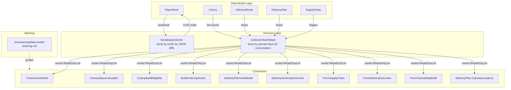
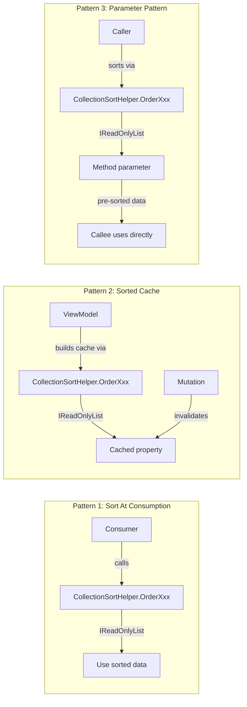

# Design Document: Data Model Ordering Invariant

## Overview

This feature establishes an architectural invariant: **data model collections are unordered bags**. The `SerializationSorter` reorders collections by UUID for deterministic JSON diffs, which means the live list order after a save/load cycle may differ from the order the application originally established. Any code that assumes a meaningful order from the data model breaks silently after deserialization.

The solution introduces a centralized `CollectionSortHelper` static class that provides canonical sort methods for every ordered collection in the data model. All existing inline `.OrderBy()` calls are refactored to use these helpers, and a steering file documents the invariant for AI-assisted development.

### Key Design Decisions

1. **CollectionSortHelper vs SerializationSorter**: These serve fundamentally different purposes. `SerializationSorter` sorts by UUID for JSON determinism. `CollectionSortHelper` sorts by domain-meaningful keys (`BuildQueueSequence`, `Name`, `Sequence`, etc.) for display and business logic. They coexist as separate concerns.

2. **Return type `IReadOnlyList<T>`**: Sort helper methods return `IReadOnlyList<T>` rather than `List<T>` to signal that the result is a snapshot — callers should not attempt to mutate it or assume it tracks the underlying collection.

3. **`IEnumerable<T>` input**: Methods accept `IEnumerable<T>` for maximum flexibility — callers can pass `List<T>`, arrays, LINQ queries, or any enumerable.

4. **Naming convention**: Methods follow the pattern `Order{CollectionName}` (e.g., `OrderStructures`, `OrderRouteStops`) matching the names specified in Requirement 8.6. When a collection has multiple valid sort orders, a suffix describes the alternate key (e.g., `OrderCommodityRequestsByNeedBy`).

5. **No inline sorting anywhere**: ALL sorting of data model collections must go through `CollectionSortHelper`. No `.OrderBy()`, `.Sort()`, `.ThenBy()`, or `.OrderByDescending()` on model types outside of `CollectionSortHelper` and `SerializationSorter`. An automated audit check enforces this.

## Architecture



### Three Approved Consumption Patterns




## Components and Interfaces

### CollectionSortHelper (New)

**Location**: `OE2EmpireTracker/Services/CollectionSortHelper.cs`

A static class providing canonical sort methods for every ordered collection in the data model. Each method accepts `IEnumerable<T>` and returns `IReadOnlyList<T>`.

```csharp
namespace OE2EmpireTracker.Services
{
    /// <summary>
    /// Provides canonical domain-order sort methods for data model collections.
    /// Every ordered collection in the Sort Key Registry has a corresponding method here.
    /// Consumers MUST use these methods instead of inline .OrderBy() expressions.
    /// 
    /// NOTE: This class sorts by domain-meaningful keys (Name, Sequence, BuildQueueSequence).
    /// SerializationSorter sorts by UUID for deterministic JSON diffs. They serve different purposes.
    /// </summary>
    public static class CollectionSortHelper
    {
        // --- Colony Structures ---
        
        /// <summary>
        /// Sorts colony structures by BuildQueueSequence (ascending).
        /// </summary>
        public static IReadOnlyList<ColonyStructure> OrderStructures(
            IEnumerable<ColonyStructure> structures);

        // --- Route / Plan Stops ---
        
        /// <summary>
        /// Sorts route stops by Sequence (ascending).
        /// </summary>
        public static IReadOnlyList<RouteStop> OrderRouteStops(
            IEnumerable<RouteStop> stops);

        /// <summary>
        /// Sorts delivery plan stops by Sequence (ascending).
        /// </summary>
        public static IReadOnlyList<DeliveryPlanStop> OrderPlanStops(
            IEnumerable<DeliveryPlanStop> stops);

        // --- Supply Chain ---
        
        /// <summary>
        /// Sorts supply chain stages by Sequence (ascending).
        /// </summary>
        public static IReadOnlyList<SupplyChainStage> OrderSupplyChainStages(
            IEnumerable<SupplyChainStage> stages);

        // --- Top-Level Entities (sorted by Name or composite key) ---
        
        /// <summary>
        /// Sorts colonies by SystemName, then PlanetName, then ColonyName (ascending).
        /// </summary>
        public static IReadOnlyList<Colony> OrderColonies(
            IEnumerable<Colony> colonies);

        /// <summary>
        /// Sorts blueprints by ExtendedName (ascending).
        /// </summary>
        public static IReadOnlyList<Blueprint> OrderBlueprints(
            IEnumerable<Blueprint> blueprints);

        /// <summary>
        /// Sorts player profiles by Name (ascending).
        /// </summary>
        public static IReadOnlyList<PlayerProfile> OrderPlayerProfiles(
            IEnumerable<PlayerProfile> profiles);

        /// <summary>
        /// Sorts surveys by PlanetName, then GameID (ascending).
        /// </summary>
        public static IReadOnlyList<Survey> OrderSurveys(
            IEnumerable<Survey> surveys);

        // --- Nested Collections ---
        
        /// <summary>
        /// Sorts commodity requests by Name (ascending). Default sort.
        /// </summary>
        public static IReadOnlyList<CommodityRequested> OrderCommodityRequests(
            IEnumerable<CommodityRequested> requests);

        /// <summary>
        /// Sorts commodity requests by NeedBy date (ascending). Used by ColonyActivity form.
        /// </summary>
        public static IReadOnlyList<CommodityRequested> OrderCommodityRequestsByNeedBy(
            IEnumerable<CommodityRequested> requests);

        /// <summary>
        /// Sorts delivery items by Name (ascending).
        /// </summary>
        public static IReadOnlyList<DeliveryItem> OrderDeliveryItems(
            IEnumerable<DeliveryItem> items);

        /// <summary>
        /// Sorts build items by ItemName (ascending).
        /// </summary>
        public static IReadOnlyList<BuildItem> OrderBuildItems(
            IEnumerable<BuildItem> items);

        /// <summary>
        /// Sorts asteroid reserves by ResourceName (ascending).
        /// </summary>
        public static IReadOnlyList<AsteroidReserve> OrderAsteroidReserves(
            IEnumerable<AsteroidReserve> reserves);

        /// <summary>
        /// Sorts ship/station/template components by SlotType, then SlotIndex (ascending).
        /// </summary>
        public static IReadOnlyList<ShipComponentSlot> OrderComponents(
            IEnumerable<ShipComponentSlot> components);

        // --- Additional top-level entities sorted by Name ---
        
        public static IReadOnlyList<DeliveryRoute> OrderDeliveryRoutes(
            IEnumerable<DeliveryRoute> routes);
        public static IReadOnlyList<DeliveryPlan> OrderDeliveryPlans(
            IEnumerable<DeliveryPlan> plans);
        public static IReadOnlyList<PricingPlan> OrderPricingPlans(
            IEnumerable<PricingPlan> plans);
        public static IReadOnlyList<BuildPlan> OrderBuildPlans(
            IEnumerable<BuildPlan> plans);
        public static IReadOnlyList<ShipTemplate> OrderShipTemplates(
            IEnumerable<ShipTemplate> templates);
        public static IReadOnlyList<Ship> OrderShips(
            IEnumerable<Ship> ships);
        public static IReadOnlyList<Station> OrderStations(
            IEnumerable<Station> stations);
        public static IReadOnlyList<MarketListing> OrderMarketListings(
            IEnumerable<MarketListing> listings);
        public static IReadOnlyList<MarketTransaction> OrderMarketTransactions(
            IEnumerable<MarketTransaction> transactions);
        public static IReadOnlyList<StockPlan> OrderStockPlans(
            IEnumerable<StockPlan> plans);
        public static IReadOnlyList<StockProfile> OrderStockProfiles(
            IEnumerable<StockProfile> profiles);
        public static IReadOnlyList<SupplyChain> OrderSupplyChains(
            IEnumerable<SupplyChain> chains);
        public static IReadOnlyList<WarehouseOverflowRule> OrderWarehouseOverflowRules(
            IEnumerable<WarehouseOverflowRule> rules);
        public static IReadOnlyList<Faction> OrderFactions(
            IEnumerable<Faction> factions);
        public static IReadOnlyList<ExternalCharacter> OrderExternalCharacters(
            IEnumerable<ExternalCharacter> characters);
        public static IReadOnlyList<Asteroid> OrderAsteroids(
            IEnumerable<Asteroid> asteroids);

        // --- Alternate sort orders ---

        /// <summary>
        /// Sorts market transactions by Timestamp descending (most recent first).
        /// Used by FormMarket transaction display.
        /// </summary>
        public static IReadOnlyList<MarketTransaction> OrderMarketTransactionsByTimestamp(
            IEnumerable<MarketTransaction> transactions);

        /// <summary>
        /// Sorts blueprints by Evolution descending (highest first).
        /// Used by BlueprintViewModel.GetEvolutionChain().
        /// </summary>
        public static IReadOnlyList<Blueprint> OrderBlueprintsByEvolutionDescending(
            IEnumerable<Blueprint> blueprints);

        /// <summary>
        /// Sorts blueprints by Evolution ascending.
        /// Used by EvolutionChainService.
        /// </summary>
        public static IReadOnlyList<Blueprint> OrderBlueprintsByEvolution(
            IEnumerable<Blueprint> blueprints);

        /// <summary>
        /// Sorts structures by BuildQueueSequence descending (highest first).
        /// Used by ColonyInactivityCollector for underutilized refiner priority.
        /// </summary>
        public static IReadOnlyList<ColonyStructure> OrderStructuresDescending(
            IEnumerable<ColonyStructure> structures);

        /// <summary>
        /// Sorts activity rows by time remaining ascending (soonest first).
        /// Used by ColonyAdminReportBuilder.
        /// </summary>
        public static IReadOnlyList<ActivityRow> OrderActivityRowsByTimeRemaining(
            IEnumerable<ActivityRow> rows);

        /// <summary>
        /// Sorts countdown references by time remaining ascending (soonest first).
        /// Used by PlayerContext.ActiveCountdowns.
        /// </summary>
        public static IReadOnlyList<CountDownTimeReference> OrderCountdownsByTimeRemaining(
            IEnumerable<CountDownTimeReference> countdowns);
    }
}
```

### Implementation Pattern

Each method follows the same pattern — null-safe, LINQ-based, returning a read-only list:

```csharp
public static IReadOnlyList<ColonyStructure> OrderStructures(
    IEnumerable<ColonyStructure> structures)
{
    if (structures == null) return Array.Empty<ColonyStructure>();
    return structures
        .OrderBy(s => s.BuildQueueSequence)
        .ToList()
        .AsReadOnly();
}
```

For composite keys:

```csharp
public static IReadOnlyList<Colony> OrderColonies(
    IEnumerable<Colony> colonies)
{
    if (colonies == null) return Array.Empty<Colony>();
    return colonies
        .OrderBy(c => c.SystemName ?? string.Empty, StringComparer.OrdinalIgnoreCase)
        .ThenBy(c => c.PlanetName ?? string.Empty, StringComparer.OrdinalIgnoreCase)
        .ThenBy(c => c.ColonyName ?? string.Empty, StringComparer.OrdinalIgnoreCase)
        .ToList()
        .AsReadOnly();
}
```

### Consumer Refactoring

The following consumers have existing inline `.OrderBy()` or `.Sort()` calls that will be refactored to use `CollectionSortHelper`. Sites marked with ★ were discovered during the codebase audit and are not yet in the original design table.

#### Colony Structures (by BuildQueueSequence)

| Consumer | Current Code | Refactored To |
|----------|-------------|---------------|
| `ColonyViewModel.StructureViewModels` | `.OrderBy(s => s.BuildQueueSequence)` | `CollectionSortHelper.OrderStructures(...)` |
| `ColonyStatusCalculator.CalculateBuilt()` | `.OrderBy(s => s.BuildQueueSequence)` | `CollectionSortHelper.OrderStructures(...)` |
| `ColonyStatusCalculator.CalculateIdeal()` | `.OrderBy(s => s.BuildQueueSequence)` | `CollectionSortHelper.OrderStructures(...)` |
| `BuildOrderOptimizer.Optimize()` | `.OrderBy(s => s.BuildQueueSequence)` | `CollectionSortHelper.OrderStructures(...)` |
| `ColonyBuildEligibility.GetFirstStagedStructure()` | `.OrderBy(s => s.BuildQueueSequence)` | `CollectionSortHelper.OrderStructures(...)` |
| `FormColonyV2.PopulateStructures()` | `.Sort(BuildQueueSequence)` | `CollectionSortHelper.OrderStructures(...)` |

#### Route Stops (by Sequence)

| Consumer | Current Code | Refactored To |
|----------|-------------|---------------|
| `DeliveryPlanViewModel` (4 methods) | `routeStops.OrderBy(s => s.Sequence)` | `CollectionSortHelper.OrderRouteStops(...)` |
| `DeliveryGenerationService` (2 methods) | `route.Stops.OrderBy(s => s.Sequence)` | `CollectionSortHelper.OrderRouteStops(...)` |
| `FormColonyDailyBuild.BuildContent()` | `route.Stops.OrderBy(s => s.Sequence)` | `CollectionSortHelper.OrderRouteStops(...)` |

#### Plan Stops (by Sequence)

| Consumer | Current Code | Refactored To |
|----------|-------------|---------------|
| `DeliveryPlan.CalculateLoadList()` | `Stops.OrderBy(s => s.Sequence)` | `CollectionSortHelper.OrderPlanStops(...)` |
| `FormDeliveryExecution` (2 locations) | `.Stops.OrderBy(s => s.Sequence)` | `CollectionSortHelper.OrderPlanStops(...)` |

#### Supply Chain Stages (by Sequence)

| Consumer | Current Code | Refactored To |
|----------|-------------|---------------|
| `FormSupplyChain` (4 locations) | `.Stages.OrderBy(s => s.Sequence)` | `CollectionSortHelper.OrderSupplyChainStages(...)` |

#### PlayerContext Init Methods ★

| Consumer | Current Code | Refactored To |
|----------|-------------|---------------|
| `PlayerContext.InitPlayerProfiles()` ★ | `list.Sort(x.Name)` | `CollectionSortHelper.OrderPlayerProfiles(...)` |
| `PlayerContext.InitBlueprints()` ★ | `list.Sort(x.Name)` | `CollectionSortHelper.OrderBlueprints(...)` |
| `PlayerContext.InitSurveys()` ★ | `.OrderBy(PlanetName).ThenBy(DateTime)` | `CollectionSortHelper.OrderSurveys(...)` |
| `PlayerContext.InitColonies()` ★ | `.OrderBy(PlanetName)` | `CollectionSortHelper.OrderColonies(...)` |
| `PlayerContext.InitDeliveryRoutes()` ★ | `list.Sort(x.Name)` | `CollectionSortHelper.OrderDeliveryRoutes(...)` |
| `PlayerContext.InitDeliveryPlans()` ★ | `list.Sort(x.Name)` | `CollectionSortHelper.OrderDeliveryPlans(...)` |
| `PlayerContext.InitPricingPlans()` ★ | `list.Sort(x.Name)` | `CollectionSortHelper.OrderPricingPlans(...)` |

#### EmpireContext Init Methods ★

| Consumer | Current Code | Refactored To |
|----------|-------------|---------------|
| `EmpireContext.InitBlueprintTypes()` ★ | `list.Sort(x.Name)` | `CollectionSortHelper.OrderByName(...)` (generic) |
| `EmpireContext.InitTechLevels()` ★ | `list.Sort(x.Name)` | `CollectionSortHelper.OrderByName(...)` (generic) |
| `EmpireContext.InitResources()` ★ | `list.Sort(x.Name)` | `CollectionSortHelper.OrderByName(...)` (generic) |
| `EmpireContext.InitResourceGroups()` ★ | `list.Sort(x.Name)` | `CollectionSortHelper.OrderByName(...)` (generic) |
| `EmpireContext.InitResourcePurities()` ★ | `list.Sort(x.Name)` | `CollectionSortHelper.OrderByName(...)` (generic) |
| `EmpireContext.InitGlobalBlueprints()` ★ | `list.Sort(x.Name)` | `CollectionSortHelper.OrderBlueprints(...)` |

#### Admin Report / Activity Sorts ★

| Consumer | Current Code | Refactored To |
|----------|-------------|---------------|
| `ColonyAdminReportBuilder` (building) ★ | `rows.OrderBy(r => r.GetSecondsRemaining())` | `CollectionSortHelper.OrderActivityRowsByTimeRemaining(...)` |
| `ColonyAdminReportBuilder` (non-repeating) ★ | `.OrderBy(r => r.GetSecondsRemaining())` | `CollectionSortHelper.OrderActivityRowsByTimeRemaining(...)` |
| `ColonyAdminReportBuilder` (mining groups) ★ | `.OrderBy(g => g.resource).ThenBy(g => g.purity)` | Local tuple sort — exempt (not a model collection) |
| `ColonyAdminReportBuilder` (refining groups) ★ | `.OrderBy(g => g.resource).ThenBy(g => g.purity)` | Local tuple sort — exempt (not a model collection) |

#### Other Service Sorts ★

| Consumer | Current Code | Refactored To |
|----------|-------------|---------------|
| `ColonyInactivityCollector` ★ | `.OrderBy(r => r.DisplaySequence)` | `CollectionSortHelper.OrderStructures(...)` (by BuildQueueSequence) |
| `ColonyInactivityCollector` ★ | `.OrderByDescending(r => r.DisplaySequence)` | `CollectionSortHelper.OrderStructuresDescending(...)` |
| `ColonyBootstrap` (2x) ★ | `bestResources.OrderBy(r => r.ResourceName)` | `CollectionSortHelper.OrderAsteroidReserves(...)` |
| `AutoAssignService` (3x) ★ | `.OrderBy(s => structureLoad[s.StructureUUID])` | Local computation sort — exempt (sorting by runtime-computed load, not a model field) |
| `DeliveryGenerationService` ★ | `resources.OrderBy(r => r.Key)` | Local dictionary sort — exempt (sorting dictionary keys) |
| `DeliveryGenerationService` ★ | `flatpacks.OrderBy(f => f.ItemName)` | `CollectionSortHelper.OrderBuildItems(...)` |
| `EvolutionChainService` (2x) ★ | `.Sort(Evolution)` | `CollectionSortHelper.OrderBlueprintsByEvolution(...)` |
| `MarketBlueprintImporter` (2x) ★ | `.OrderBy(k, StringComparer.Ordinal)` | PropertyBag key sort — exempt (infrastructure) |
| `PlayerContext.ActiveCountdowns` ★ | `.OrderBy(c => c.TimeRemaining)` | `CollectionSortHelper.OrderCountdownsByTimeRemaining(...)` |

#### Form / ViewModel Sorts ★

| Consumer | Current Code | Refactored To |
|----------|-------------|---------------|
| `BlueprintViewModel.GetEvolutionChain()` ★ | `.OrderByDescending(b => b.Evolution)` | `CollectionSortHelper.OrderBlueprintsByEvolutionDescending(...)` |
| `BlueprintViewModel.GetAllOfType()` ★ | `list.Sort(ExtendedName)` | `CollectionSortHelper.OrderBlueprints(...)` |
| `FormSupplyChain` ★ | `chains.OrderBy(c => c.Name)` | `CollectionSortHelper.OrderSupplyChains(...)` |
| `FormSupplyChain` ★ | `resources.OrderBy(r => r.Name)` | Static lookup sort — exempt (Resource enum list) |
| `FormMarket` ★ | `transactions.OrderByDescending(t => t.Timestamp)` | `CollectionSortHelper.OrderMarketTransactionsByTimestamp(...)` |
| `FormColonyV2` (2x) ★ | `filteredList.Sort(ExtendedName)` | `CollectionSortHelper.OrderBlueprints(...)` |
| `ColonyStructureV2` (4x) ★ | `items.Sort(DisplayName)` | Local UI selection items — exempt (not model collections) |
| `FormBlueprintV2` ★ | `points.Sort(Evolution)` | Local graph data — exempt (not model collection) |

#### Exempt Sorts (not model collections)

The following sorts operate on local/transient data, UI indices, or infrastructure and are NOT required to use `CollectionSortHelper`:

- `DeliveryRouteViewModel.MoveStopsUp/Down` — sorting `IEnumerable<int>` indices
- `DeliveryPlanViewModel.RemoveDropOffItems/RemovePickUpItems` — sorting `IEnumerable<int>` indices
- `SortedDictionaryContractResolver` — JSON serialization infrastructure
- `WindowStateHelper` — UI grid/listview sort restoration
- `FormColonyV2.lvwColonies.Sort()` / `FormSurvey.lvwSurveys.Sort()` — ListView UI sort
- `MainWindow.entries.Sort` — window restore order
- `MinerSetupHelper` — sorting survey candidates (local computation)
- `ColonyStructureV2` combo population — sorting local selection items (not model collections)
- `FormBlueprintV2` graph points — sorting local chart data
- `ColonyAdminReportBuilder` mining/refining groups — sorting local tuples
- `AutoAssignService` — sorting by runtime-computed load values
- Static enum/constant list initialization in Models (`Resource.cs`, `ResourcePurity.cs`, `Commodity.cs`, etc.) — one-time static data, not persisted model collections

### Steering File

**Location**: `.kiro/steering/data-model-ordering.md`

**Inclusion**: `auto` (always loaded into AI context)

**Content outline**:
1. The unordered-bag invariant statement
2. The three approved consumption patterns with examples
3. The complete Sort Key Registry table
4. Instructions to use `CollectionSortHelper` methods (never inline `.OrderBy()`)
5. Instructions that the data model must not be modified to enforce ordering
6. Instructions for adding new collections to the registry

### Inline Sort Audit Check (New)

**Location**: `.kiro/tools/inline-sort-check.js`

**Purpose**: Detects inline `.OrderBy()`, `.ThenBy()`, `.Sort()`, `.OrderByDescending()` calls on data model collection types outside of the two allowed files (`CollectionSortHelper.cs` and `SerializationSorter.cs`).

**How it works**:
1. Scans all `.cs` files in `OE2EmpireTracker/` and `OE2EmpireTracker.Tests/` (excluding `bin/`, `obj/`, `Designer.cs`)
2. Skips `CollectionSortHelper.cs` and `SerializationSorter.cs` (the only allowed sort locations)
3. Matches lines containing `.OrderBy(`, `.OrderByDescending(`, `.ThenBy(`, `.ThenByDescending(`, `.Sort(` on known model types
4. Reports each finding with file, line number, and the matched expression
5. Exit code 0 = clean, exit code 1 = findings

**Integration**: Added to `audit.js` as check #12 "Inline Sort".

## Data Models

No new data models are introduced. This feature operates on existing models:

- **ColonyStructure** — sort key: `BuildQueueSequence` (int)
- **RouteStop** — sort key: `Sequence` (int)
- **DeliveryPlanStop** — sort key: `Sequence` (int)
- **SupplyChainStage** — sort key: `Sequence` (int)
- **Colony** — sort key: `SystemName` + `PlanetName` + `ColonyName` (strings)
- **Blueprint** — sort key: `ExtendedName` (string)
- **Survey** — sort key: `PlanetName` + `GameID` (strings)
- **CommodityRequested** — sort key: `Name` (string); alternate sort: `NeedBy` (DateTime) for activity views
- **DeliveryItem** — sort key: `Name` (string)
- **BuildItem** — sort key: `ItemName` (string)
- **AsteroidReserve** — sort key: `ResourceName` (string)
- **ShipComponentSlot** — sort key: `SlotType` (string) + `SlotIndex` (int)
- All top-level `PlayerRoot` entities — sort key: `Name` (string, ascending)

The `CollectionSortHelper` class is the only new code artifact. It is a pure static utility with no state.


## Correctness Properties

*A property is a characteristic or behavior that should hold true across all valid executions of a system — essentially, a formal statement about what the system should do. Properties serve as the bridge between human-readable specifications and machine-verifiable correctness guarantees.*

### Property 1: Sort helper produces correctly ordered output

*For any* collection of elements with random sort key values, calling the corresponding `CollectionSortHelper.OrderXxx()` method SHALL return an `IReadOnlyList<T>` where each element's sort key is less than or equal to the next element's sort key.

**Validates: Requirements 3.1, 8.2, 8.5**

### Property 2: Sort helper and SerializationSorter agree on relative order for shared keys

*For any* collection type where both `CollectionSortHelper` and `SerializationSorter` sort by the same key (e.g., `RouteStop` by `Sequence`, `SupplyChainStage` by `Sequence`, `ShipComponentSlot` by `SlotType`+`SlotIndex`), the relative order produced by both sorters SHALL be identical.

**Validates: Requirements 3.3**

### Property 3: GetFirstStagedStructure returns the lowest-sequence staged structure

*For any* colony with a randomly ordered list of structures where at least one is staged, `ColonyBuildEligibility.GetFirstStagedStructure()` SHALL return the staged structure with the lowest `BuildQueueSequence` value, regardless of the initial list order.

**Validates: Requirements 4.5**

### Property 4: CalculateLoadList is order-independent

*For any* delivery plan with stops in any permutation of their `Sequence` values, `DeliveryPlan.CalculateLoadList()` SHALL produce the same load list result, because it sorts by `Sequence` before iterating.

**Validates: Requirements 4.6**

## Error Handling

The `CollectionSortHelper` methods handle edge cases defensively:

| Scenario | Behavior |
|----------|----------|
| `null` input | Returns `Array.Empty<T>()` (empty read-only list) |
| Empty collection | Returns empty read-only list |
| `null` sort key values | Treated as empty string (`string.Empty`) for string keys, ensuring null-safe comparison |
| Single element | Returns single-element read-only list |
| Duplicate sort keys | Preserves relative order of elements with equal keys (stable sort via LINQ `OrderBy`) |

No exceptions are thrown by sort helper methods. They are pure functions with no side effects.

## Testing Strategy

### Property-Based Tests (NUnit + FsCheck)

The project will use **FsCheck** (the .NET property-based testing library) integrated with NUnit for property tests. Each property test runs a minimum of 100 iterations with randomly generated inputs.

**Library**: FsCheck 2.16.6 + FsCheck.NUnit (NuGet packages added to `OE2EmpireTracker.Tests`)

**Test file**: `OE2EmpireTracker.Tests/Services/CollectionSortHelperPropertyTests.cs`

Each correctness property maps to a single property-based test:

| Property | Test Method | Generator Strategy |
|----------|------------|-------------------|
| Property 1 | `OrderStructures_AlwaysSortedByBuildQueueSequence` | Random `List<ColonyStructure>` with random `BuildQueueSequence` values |
| Property 1 | `OrderRouteStops_AlwaysSortedBySequence` | Random `List<RouteStop>` with random `Sequence` values |
| Property 1 | `OrderColonies_AlwaysSortedByCompositeKey` | Random `List<Colony>` with random `SystemName`/`PlanetName`/`ColonyName` |
| Property 1 | `OrderComponents_AlwaysSortedBySlotTypeThenIndex` | Random `List<ShipComponentSlot>` with random `SlotType`/`SlotIndex` |
| Property 2 | `SortHelper_And_SerializationSorter_AgreeOnRouteStopOrder` | Random `RouteStop[]` |
| Property 2 | `SortHelper_And_SerializationSorter_AgreeOnComponentOrder` | Random `ShipComponentSlot[]` |
| Property 3 | `GetFirstStagedStructure_ReturnsLowestSequenceStaged` | Random colony with shuffled structures, at least one staged |
| Property 4 | `CalculateLoadList_OrderIndependent` | Random `DeliveryPlan` with shuffled stops |

**Tag format**: `// Feature: data-model-ordering-invariant, Property {N}: {title}`

**Configuration**: Each property test uses `[Property(MaxTest = 100)]` attribute.

### Unit Tests (Example-Based)

**Test file**: `OE2EmpireTracker.Tests/Services/CollectionSortHelperTests.cs`

Example-based tests for specific scenarios and edge cases:

- Null input returns empty list
- Empty input returns empty list
- Single-element input returns single-element list
- Already-sorted input returns same order
- Reverse-sorted input returns correct order
- Null sort key values sort to beginning (empty string)
- Each sort helper method exists and compiles (smoke test)

### Integration Tests

Verify that refactored consumers still produce correct results:

- `ColonyViewModel.StructureViewModels` returns structures in `BuildQueueSequence` order
- `ColonyStatusCalculator.CalculateBuilt()` processes structures in correct order
- `DeliveryPlan.CalculateLoadList()` handles stops in correct sequence order
- `ColonyBuildEligibility.GetFirstStagedStructure()` finds correct structure after serialization round-trip
