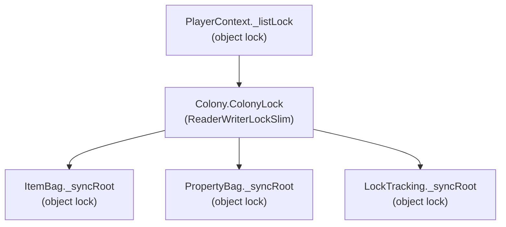
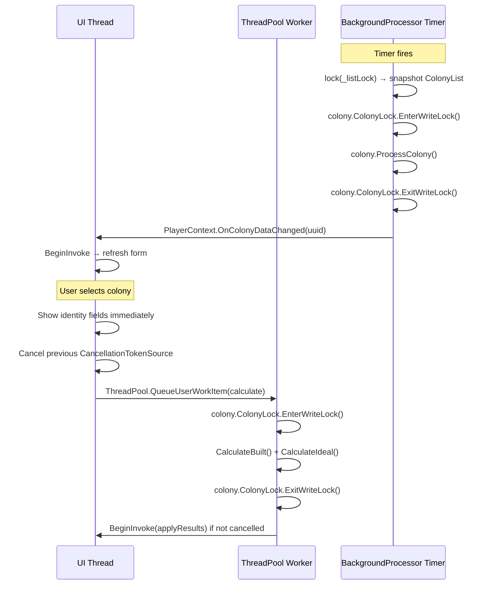

# Design: Data Model Thread Safety

## Overview

This design introduces a layered synchronization strategy for the OE2EmpireTracker data model so that the `BackgroundProcessor` timer thread, `ColonyStatusCalculator`, and multiple open `FormColonyV2` MDI child forms can safely share mutable colony data. The approach uses three tiers of locks:

1. **PlayerContext._listLock** — coarse-grained `object` lock protecting `BindingList<T>` collections and lookup caches.
2. **Colony.ColonyLock** — per-colony `ReaderWriterLockSlim` replacing the existing `object ProcessingLock`, allowing concurrent UI reads with exclusive background writes.
3. **Collection-level _syncRoot** — fine-grained `object` locks inside `ItemBag`, `PropertyBag`, and `LockTracking` protecting their internal dictionaries.

The design also introduces a cancellable background calculation pattern for `FormColonyV2` using `CancellationTokenSource` and a generation counter, plus a coordination protocol between `BackgroundProcessor` and UI forms that fires events outside held locks.

All synchronization uses .NET Framework 4.8.1 primitives: `ReaderWriterLockSlim`, `lock()`, `ThreadPool.QueueUserWorkItem`, `Control.BeginInvoke`. No `async/await`.

## Architecture

### Locking Hierarchy



**Lock ordering rule:** Acquire top-to-bottom, never bottom-to-top. A thread holding `Colony.ColonyLock` must never attempt to acquire `PlayerContext._listLock`. A thread holding a collection `_syncRoot` must never attempt to acquire `Colony.ColonyLock`.

### Thread Interaction Diagram



## Components and Interfaces

### 1. Colony.ColonyLock — Per-Colony ReaderWriterLockSlim

Replaces the existing `object ProcessingLock` on `Colony`. The `ReaderWriterLockSlim` allows multiple concurrent readers (UI forms displaying the same colony) while giving exclusive access to writers (BackgroundProcessor, CalculateBuilt).

```csharp
// Colony.cs changes
[JsonIgnore]
public ReaderWriterLockSlim ColonyLock { get; } = new ReaderWriterLockSlim(LockRecursionPolicy.NoRecursion);

// Remove: public object ProcessingLock { get; } = new object();
```

**Timeout constants** (defined in a static helper or on Colony):

```csharp
public const int ReadLockTimeoutMs = 1000;
public const int WriteLockTimeoutMs = 5000;
```

**Lock acquisition pattern:**

```csharp
// Write lock (BackgroundProcessor, CalculateBuilt)
if (!colony.ColonyLock.TryEnterWriteLock(Colony.WriteLockTimeoutMs))
{
    Log.Warn("Write lock timeout on colony {0}", colony.UUID);
    return; // skip this colony
}
try
{
    colony.ProcessColony();
}
finally
{
    colony.ColonyLock.ExitWriteLock();
}

// Read lock (UI form display)
if (!colony.ColonyLock.TryEnterReadLock(Colony.ReadLockTimeoutMs))
{
    Log.Warn("Read lock timeout on colony {0}, using stale data", colony.UUID);
    return;
}
try
{
    // snapshot collections for UI population
    var structuresCopy = new List<ColonyStructure>(colony.Structures);
}
finally
{
    colony.ColonyLock.ExitReadLock();
}
```

### 2. Thread-Safe ItemBag

Add a `_syncRoot` object and wrap all public methods:

```csharp
// ItemBag.cs changes
private readonly object _syncRoot = new object();

public void AddItem(Item item)
{
    lock (_syncRoot)
    {
        Items.Add(item.UUID, item);
        _typeIndex = null;
        _resourceIndex = null;
    }
}

public List<Item> FindByType(ItemType.ItemTypeEnum itemType, string baseItemTypeID)
{
    lock (_syncRoot)
    {
        EnsureTypeIndex();
        var key = (itemType, baseItemTypeID ?? "");
        return _typeIndex.TryGetValue(key, out var list)
            ? new List<Item>(list)  // defensive copy
            : new List<Item>();
    }
}

// Same pattern for FindResource, Remove, Clear, Count, ContainsKey, CountByType
// EnsureTypeIndex and EnsureResourceIndex already execute within the lock
```

### 3. Thread-Safe PropertyBag

```csharp
// PropertyBag.cs changes
private readonly object _syncRoot = new object();

public bool setProperty(string name, string value)
{
    lock (_syncRoot)
    {
        Properties[name] = value;
        return true;
    }
}

public bool getBoolean(string name, bool defaultValue, out bool value)
{
    lock (_syncRoot)
    {
        value = defaultValue;
        string valueStr;
        bool ret = Properties.TryGetValue(name, out valueStr);
        if (ret) ret = Boolean.TryParse(valueStr, out value);
        return ret;
    }
}

// Same pattern for getDecimal, getLong, getString, ContainsKey, Count, Remove, Clear
```

### 4. Thread-Safe LockTracking

```csharp
// LockTracking.cs changes
private readonly object _syncRoot = new object();

public void LockItem(string processUUID, ItemType.ItemTypeEnum itemType,
    string baseItemTypeID, int quantity)
{
    lock (_syncRoot)
    {
        // existing implementation
    }
}

public int GetLockedQuantity(ItemType.ItemTypeEnum itemType, string baseItemTypeID)
{
    lock (_syncRoot)
    {
        // existing implementation
    }
}

public IReadOnlyList<ItemLock> GetLocksForProcess(string processUUID)
{
    lock (_syncRoot)
    {
        // existing implementation — already returns a copy via .ToList().AsReadOnly()
    }
}

// Same for LockItems, ClearLocksForProcess
```

### 5. PlayerContext._listLock

```csharp
// PlayerContext.cs changes
private readonly object _listLock = new object();

public Blueprint FindBlueprint(string id)
{
    if (string.IsNullOrEmpty(id)) return null;
    lock (_listLock)
    {
        if (_blueprintCache == null)
        {
            _blueprintCache = new Dictionary<string, Blueprint>();
            foreach (var bp in BlueprintList)
            {
                if (bp.UUID != null && !_blueprintCache.ContainsKey(bp.UUID))
                    _blueprintCache[bp.UUID] = bp;
            }
        }
        if (_blueprintCache.TryGetValue(id, out var match))
            return match;
    }
    return EmpireContext.GetInstance()?.FindGlobalBlueprint(id);
}

public void InvalidateBlueprintCache()
{
    lock (_listLock) { _blueprintCache = null; }
    InvalidateAllBlueprintsCache();
}

// WriteContext snapshots under lock
public void WriteContext()
{
    // ... existing guards ...
    PlayerRoot playerRoot;
    lock (_listLock)
    {
        playerRoot = new PlayerRoot();
        playerRoot.PlayerProfile = PlayerProfileList.ToArray();
        playerRoot.Blueprint = BlueprintList.ToArray();
        playerRoot.Survey = SurveyList.ToArray();
        playerRoot.Colony = ColonyList.ToArray();
        playerRoot.DeliveryRoute = DeliveryRouteList.ToArray();
        playerRoot.DeliveryPlan = DeliveryPlanList.ToArray();
        playerRoot.PricingPlan = PricingPlanList.ToArray();
        playerRoot.DataVersion = DataVersion;
        playerRoot.CurrentPlayerUUID = _currentPlayerUUID;
    }
    // Serialize and write outside the lock
    string jsonContent = JsonConvert.SerializeObject(playerRoot, JsonSettings.SerializerSettings);
    SafeFileWriter.WriteAllText(FilePath, jsonContent);
}
```

### 6. Background Colony Form Updates with Cancellation

`FormColonyV2` uses a `CancellationTokenSource` and a generation counter to manage background calculations. When the user switches colonies, the previous calculation is cancelled and a new one is queued.

```csharp
// FormColonyV2.cs additions
private CancellationTokenSource _calcCts;
private int _calcGeneration = 0;

private void lvwColonies_ItemSelectionChanged(object sender, ListViewItemSelectionChangedEventArgs e)
{
    if (lvwColonies.SelectedItems.Count != 1) return;

    // Cancel any in-progress background calculation
    _calcCts?.Cancel();
    _calcCts = new CancellationTokenSource();
    var cts = _calcCts;
    int generation = Interlocked.Increment(ref _calcGeneration);

    selectedColony = lvwColonies.SelectedItems[0].Tag as Colony;
    colonyViewModel = new ColonyViewModel(selectedColony, playerContext);

    // Immediate: show identity fields on UI thread
    using (var guard = new ProgrammaticUpdateGuard(this))
    {
        txtPlanetName.Text = colonyViewModel.PlanetName;
        txtColonyName.Text = colonyViewModel.ColonyName;
        txtSystemName.Text = colonyViewModel.Data.SystemName ?? "";
    }

    // Show "Calculating..." indicator
    SetCalculatingState(true);

    // Queue expensive work on ThreadPool
    var colony = selectedColony;
    ThreadPool.QueueUserWorkItem(_ =>
    {
        if (cts.IsCancellationRequested) return;

        // Acquire write lock for CalculateBuilt (mutates Locks, Statuses)
        if (!colony.ColonyLock.TryEnterWriteLock(Colony.WriteLockTimeoutMs))
        {
            Log.Warn("Background calc: write lock timeout on colony {0}", colony.UUID);
            return;
        }
        try
        {
            if (cts.IsCancellationRequested) return;
            colonyViewModel.RecalculateStatus();
        }
        finally
        {
            colony.ColonyLock.ExitWriteLock();
        }

        if (cts.IsCancellationRequested) return;

        // Marshal results back to UI thread
        try
        {
            BeginInvoke(new Action(() =>
            {
                if (cts.IsCancellationRequested) return;
                if (generation != _calcGeneration) return; // stale

                SetCalculatingState(false);
                PopulateForm();
                RefreshAdminReport();
                UpdateTabWarnings();
                UpdateTitle();
            }));
        }
        catch (ObjectDisposedException) { /* form closed */ }
        catch (InvalidOperationException) { /* handle not created */ }
    });
}

private void SetCalculatingState(bool calculating)
{
    // Show/hide a "Calculating..." label on the structures tab
    // Disable status summary panel while calculating
}

protected override void OnFormClosed(FormClosedEventArgs e)
{
    _calcCts?.Cancel();
    // ... existing cleanup ...
    base.OnFormClosed(e);
}
```

### 7. BackgroundProcessor Coordination

```csharp
// BackgroundProcessor.cs changes to ExecuteCycle()
private void ExecuteCycle()
{
    if (!Monitor.TryEnter(_cycleLock)) return;
    try
    {
        bool hadError = false;
        int processedCount = 0;

        // Snapshot colony list under _listLock
        List<Colony> colonies;
        lock (_playerContext._listLock)  // or via a public SnapshotColonyList() method
        {
            colonies = new List<Colony>(_playerContext.ColonyList);
        }

        foreach (var colony in colonies)
        {
            if (_stopping.IsSet) break;
            if (!colony.HasExpiredTimers()) continue;

            try
            {
                // Acquire per-colony write lock with timeout
                if (!colony.ColonyLock.TryEnterWriteLock(Colony.WriteLockTimeoutMs))
                {
                    Log.Warn("BackgroundProcessor: write lock timeout on colony {0}, skipping",
                        colony.UUID);
                    continue; // skip, try next cycle
                }
                try
                {
                    colony.ProcessColony();
                }
                finally
                {
                    colony.ColonyLock.ExitWriteLock();
                }
                processedCount++;
            }
            catch (Exception ex)
            {
                Log.Error(ex, "Error processing colony {0}", colony.UUID);
                hadError = true;
            }

            // Fire event OUTSIDE the colony lock
            try { _playerContext.OnColonyDataChanged(colony.UUID); }
            catch (Exception ex)
            {
                Log.Error(ex, "Error firing ColonyDataChanged for {0}", colony.UUID);
            }
        }

        // Persist OUTSIDE any colony lock
        if (processedCount > 0)
        {
            try { _playerContext.WriteContext(); }
            catch (Exception ex)
            {
                Log.Error(ex, "Error persisting after processing {0} colonies", processedCount);
                hadError = true;
            }
        }

        LastCycleHadError = hadError;
    }
    finally
    {
        Monitor.Exit(_cycleLock);
    }
}
```

### 8. Lock Ordering Convention

The application follows a strict lock ordering to prevent deadlocks:

```
Level 0: PlayerContext._listLock          (coarsest)
Level 1: Colony.ColonyLock                (per-colony)
Level 2: ItemBag._syncRoot               (per-collection)
         PropertyBag._syncRoot
         LockTracking._syncRoot           (finest)
```

**Rules:**
1. Never acquire a Level N lock while holding a Level N+1 or higher lock.
2. If a code path needs both `_listLock` and `ColonyLock`, acquire `_listLock` first, snapshot what you need, release `_listLock`, then acquire `ColonyLock`.
3. `ColonyLock` is held during `ProcessColony()` and `CalculateBuilt()`, which internally touch `ItemBag`, `PropertyBag`, and `LockTracking`. The collection-level locks are Level 2, so this is safe.
4. Events (`OnColonyDataChanged`) are always fired outside all locks.
5. `WriteContext()` acquires `_listLock` to snapshot lists, then serializes outside the lock. It never holds `ColonyLock`.

### 9. ColonyStatusCalculator Caller Contract

`ColonyStatusCalculator` itself does not acquire locks. The caller is responsible:

| Method | Required Lock | Reason |
|--------|--------------|--------|
| `CalculateBuilt()` | `ColonyLock.EnterWriteLock` | Mutates `colony.Locks`, `structure.Statuses`, `structure.StatusDelta` |
| `CalculateIdeal()` | `ColonyLock.EnterWriteLock` | Mutates `structure.Statuses` |
| `RecalculateStructure()` | `ColonyLock.EnterWriteLock` | Mutates `finalActualStatus`, `structure.StatusDelta`, `colony.Locks` |
| `ComputeStructureDelta()` | `ColonyLock.EnterReadLock` (minimum) | Read-only, but reads `structure.Properties` and `structure.AssignedWorkers` |
| `SumAllDeltas()` | `ColonyLock.EnterWriteLock` | Mutates `finalActualStatus` |
| `PopulateStatus()` | None (static, takes snapshot data) | Pure formatting |

### 10. Concurrent Form Access

When multiple `FormColonyV2` instances display the same colony:

1. **Reads** acquire `ColonyLock.EnterReadLock`, snapshot collections, release lock, then populate UI controls from the snapshot.
2. **Writes** (save, add structure, toggle worker) acquire `ColonyLock.EnterWriteLock`, mutate data, release lock, then fire `OnColonyDataChanged` so other forms refresh.
3. **WriteContext** is called after releasing `ColonyLock` to respect lock ordering.

```csharp
// Save pattern in FormColonyV2
private void cmdSave_Click(object sender, EventArgs e)
{
    using var guard = new ProgrammaticUpdateGuard(this);

    if (!selectedColony.ColonyLock.TryEnterWriteLock(Colony.WriteLockTimeoutMs))
    {
        Log.Warn("Save: write lock timeout on colony {0}", selectedColony.UUID);
        return;
    }
    try
    {
        if (string.IsNullOrEmpty(colonyViewModel.Data.OwnerUUID))
            colonyViewModel.Data.OwnerUUID = playerContext.CurrentPlayerUUID;
        colonyViewModel.Save();
    }
    finally
    {
        selectedColony.ColonyLock.ExitWriteLock();
    }

    // Fire event and persist OUTSIDE the lock
    playerContext.OnColonyDataChanged(selectedColony.UUID);
    playerContext.WriteContext();
    txtColonyFilter_TextChanged(sender, e);
    UpdateTitle();
}
```

## Components Changed

| Component | Change Type | Description |
|-----------|-------------|-------------|
| `Models/Colony.cs` | MODIFIED | Replace `ProcessingLock` with `ColonyLock` (`ReaderWriterLockSlim`), add timeout constants |
| `Models/ItemBag.cs` | MODIFIED | Add `_syncRoot`, wrap all public methods in `lock(_syncRoot)` |
| `Models/PropertyBag.cs` | MODIFIED | Add `_syncRoot`, wrap all public methods in `lock(_syncRoot)` |
| `Models/LockTracking.cs` | MODIFIED | Add `_syncRoot`, wrap all public methods in `lock(_syncRoot)` |
| `Services/PlayerContext.cs` | MODIFIED | Add `_listLock`, wrap cache access and `WriteContext` snapshot |
| `Services/BackgroundProcessor.cs` | MODIFIED | Replace `lock(ProcessingLock)` with `ColonyLock.TryEnterWriteLock`, snapshot colony list under `_listLock`, fire events outside locks |
| `Services/ColonyStatusCalculator.cs` | UNCHANGED | No lock acquisition added; caller contract documented |
| `Forms/ColonyV2/FormColonyV2.cs` | MODIFIED | Add `CancellationTokenSource` + generation counter, background `ThreadPool` calculation, `BeginInvoke` marshaling, lock acquisition for reads/writes |

## Data Models

### Colony.cs — Lock Property Change

```csharp
// REMOVE:
[JsonIgnore]
public object ProcessingLock { get; } = new object();

// ADD:
[JsonIgnore]
public ReaderWriterLockSlim ColonyLock { get; } = new ReaderWriterLockSlim(LockRecursionPolicy.NoRecursion);

public const int ReadLockTimeoutMs = 1000;
public const int WriteLockTimeoutMs = 5000;
```

No other model shape changes. The `ColonyLock` is `[JsonIgnore]` and initialized in the default constructor, same as the old `ProcessingLock`.

### ItemBag._syncRoot

```csharp
// New field (not serialized, internal to class)
private readonly object _syncRoot = new object();
```

All existing public methods (`AddItem`, `Remove`, `Clear`, `FindByType`, `FindResource`, `CountByType`, `ContainsKey`, `Count`) are wrapped in `lock(_syncRoot)`. The `EnsureTypeIndex` and `EnsureResourceIndex` private methods are called within the lock scope, so they don't need their own lock.

### PropertyBag._syncRoot

```csharp
private readonly object _syncRoot = new object();
```

All existing public methods wrapped. The `Properties` dictionary is never exposed directly to callers.

### LockTracking._syncRoot

```csharp
private readonly object _syncRoot = new object();
```

All existing public methods wrapped. `RawLocks` internal accessor used only by the JSON converter, which runs single-threaded during serialization (under `_listLock`).

### PlayerContext._listLock

```csharp
private readonly object _listLock = new object();
```

Protects: `ColonyList`, `BlueprintList`, `SurveyList`, `DeliveryRouteList`, `DeliveryPlanList`, `PricingPlanList`, and all `_*Cache` fields. Exposed to `BackgroundProcessor` via a `SnapshotColonyList()` method:

```csharp
/// <summary>
/// Returns a snapshot of ColonyList for safe iteration outside the lock.
/// </summary>
public List<Colony> SnapshotColonyList()
{
    lock (_listLock)
    {
        return new List<Colony>(ColonyList);
    }
}
```

### FormColonyV2 — New Fields

```csharp
private CancellationTokenSource _calcCts;
private int _calcGeneration = 0;
```

No new model classes are introduced. The synchronization is achieved entirely through lock fields on existing classes.

## Correctness Properties

*A property is a characteristic or behavior that should hold true across all valid executions of a system — essentially, a formal statement about what the system should do. Properties serve as the bridge between human-readable specifications and machine-verifiable correctness guarantees.*

### Property 1: Concurrent colony processing safety

*For any* colony with structures, items, and locks, running `BackgroundProcessor.RunCycleOnce()` concurrently with `ColonyStatusCalculator.CalculateBuilt()` on the same colony (both acquiring `ColonyLock` properly) shall not throw exceptions and shall not corrupt colony data — the colony's `Items`, `Locks`, and `Structures` collections shall remain internally consistent after both operations complete.

**Validates: Requirements 1.3, 1.5, 9.1, 12.1**

### Property 2: ItemBag concurrent access safety

*For any* `ItemBag` instance and any set of concurrent `AddItem`, `Remove`, `FindByType`, `FindResource`, `CountByType`, and `ContainsKey` operations executed from multiple threads, no operation shall throw an exception, and the final state of the `ItemBag` shall be consistent with some sequential ordering of the operations.

**Validates: Requirements 2.2, 2.3, 12.2**

### Property 3: ItemBag defensive copies

*For any* `ItemBag` instance containing items, the list returned by `FindByType` or `FindResource` shall be an independent copy — adding to or removing from the returned list shall not change the result of a subsequent `FindByType` or `FindResource` call on the same `ItemBag`.

**Validates: Requirements 2.5**

### Property 4: PropertyBag concurrent access safety

*For any* `PropertyBag` instance and any set of concurrent `setProperty`, `Remove`, `getBoolean`, `getDecimal`, `getLong`, `getString`, `ContainsKey`, and `Count` operations executed from multiple threads, no operation shall throw an exception.

**Validates: Requirements 3.2, 3.3, 12.3**

### Property 5: LockTracking concurrent access safety

*For any* `LockTracking` instance and any set of concurrent `LockItem`, `LockItems`, `ClearLocksForProcess`, `GetLockedQuantity`, and `GetLocksForProcess` operations executed from multiple threads, no operation shall throw an exception, and `GetLockedQuantity` shall return a value consistent with some sequential ordering of the mutation operations.

**Validates: Requirements 4.2, 4.3, 12.4**

### Property 6: LockTracking defensive copies

*For any* `LockTracking` instance with locks held by a process, the list returned by `GetLocksForProcess` shall be a read-only independent copy — the caller cannot modify the internal lock state through the returned collection.

**Validates: Requirements 4.4**

### Property 7: Cancellation prevents stale results

*For any* sequence of colony selections in `FormColonyV2`, if a new colony is selected before the previous background calculation completes, the `CancellationTokenSource` from the previous calculation shall be cancelled, and the generation counter shall ensure that only the most recent calculation's results are applied to the UI.

**Validates: Requirements 6.2, 6.6, 12.5**

### Property 8: Read lock timeout graceful degradation

*For any* colony whose `ColonyLock` write lock is held by another thread, a UI form attempting `TryEnterReadLock` with a 1000ms timeout shall return `false` without throwing an exception, and the colony's data shall remain unchanged by the failed lock attempt.

**Validates: Requirements 11.1**

### Property 9: Write lock timeout skips colony without corruption

*For any* colony whose `ColonyLock` write lock is held by another thread, `BackgroundProcessor` attempting `TryEnterWriteLock` with a 5000ms timeout shall return `false` without throwing an exception, and the colony's data shall remain unchanged — no partial processing shall occur.

**Validates: Requirements 11.2**

### Property 10: BackgroundProcessor continues after contended colony

*For any* list of colonies where one colony's `ColonyLock` is held by another thread, `BackgroundProcessor.RunCycleOnce()` shall skip the contended colony and continue processing the remaining colonies that have expired timers.

**Validates: Requirements 11.3**

## Error Handling

### Lock Timeout Handling

| Scenario | Timeout | Action |
|----------|---------|--------|
| UI read lock timeout | 1000ms | Log warning via NLog, display stale data, do not throw |
| Background write lock timeout | 5000ms | Log warning, skip colony, continue to next colony |
| Background calculation write lock timeout | 5000ms | Log warning, return without updating UI |

### Disposed Form Handling

When `ColonyDataChanged` or `BeginInvoke` is called on a disposed form:
- Catch `ObjectDisposedException` and `InvalidOperationException` silently
- The `OnFormClosed` handler cancels the `CancellationTokenSource` to prevent further `BeginInvoke` calls

### Lock Ordering Violations

Lock ordering violations are prevented by design (documented convention) rather than runtime detection. The lock hierarchy is:
1. `_listLock` → `ColonyLock` → `_syncRoot` (never reversed)
2. Events fired outside all locks
3. `WriteContext` called outside `ColonyLock`

If a deadlock does occur (bug), the timeout on `TryEnterWriteLock`/`TryEnterReadLock` ensures the application does not hang indefinitely. The timeout path logs a warning and degrades gracefully.

### BackgroundProcessor Error Isolation

Each colony is processed in its own try/catch. An exception processing one colony does not prevent processing of subsequent colonies. The `LastCycleHadError` flag is set for monitoring.

## Testing Strategy

### Dual Testing Approach

- **Unit tests**: Verify specific examples (lock property exists, serialization excludes lock, timeout constants correct, event fires on save)
- **Property tests**: Verify universal thread-safety invariants across randomized concurrent operations

Both are complementary: unit tests catch concrete regressions, property tests verify general correctness under concurrent stress.

### Property-Based Testing Configuration

- **Library**: FsCheck.NUnit (FsCheck 2.x for .NET Framework 4.8.1 compatibility, via NuGet `packages.config`)
- **Minimum iterations**: 100 per property test
- **Tag format**: `// Feature: data-model-thread-safety, Property N: <property text>`
- Each correctness property is implemented by a single property-based test

### Test Scenarios

#### Property Tests (concurrent stress)

1. **Concurrent colony processing** (Property 1): Create a colony with structures and timers. Run `BackgroundProcessor.RunCycleOnce()` and `ColonyStatusCalculator.CalculateBuilt()` on separate threads, both acquiring `ColonyLock`. Assert no exceptions and colony data is consistent.

2. **ItemBag concurrent access** (Property 2): Generate random items. Spawn N threads doing concurrent `AddItem` and `FindByType`. Assert no exceptions and final item count matches expected.

3. **ItemBag defensive copies** (Property 3): Generate random items, call `FindByType`, modify the returned list, call `FindByType` again. Assert results are unchanged.

4. **PropertyBag concurrent access** (Property 4): Generate random property names/values. Spawn N threads doing concurrent `setProperty` and `getBoolean`. Assert no exceptions.

5. **LockTracking concurrent access** (Property 5): Generate random process UUIDs and item keys. Spawn N threads doing concurrent `LockItem` and `GetLockedQuantity`. Assert no exceptions and quantities are non-negative.

6. **LockTracking defensive copies** (Property 6): Lock items for a process, get locks via `GetLocksForProcess`, verify the returned collection is read-only.

7. **Cancellation prevents stale results** (Property 7): Create a `CancellationTokenSource` and generation counter. Simulate rapid colony switches by incrementing the generation and cancelling the token. Assert that only the final generation's callback executes.

8. **Read lock timeout** (Property 8): Hold a write lock on a colony, attempt a read lock with 1000ms timeout from another thread. Assert `TryEnterReadLock` returns false and colony data is unchanged.

9. **Write lock timeout** (Property 9): Hold a write lock on a colony, attempt another write lock with 5000ms timeout. Assert `TryEnterWriteLock` returns false and colony data is unchanged.

10. **BackgroundProcessor continues after skip** (Property 10): Create multiple colonies, hold the write lock on one. Run `BackgroundProcessor.RunCycleOnce()`. Assert the locked colony is skipped and others with expired timers are processed.

#### Unit Tests (specific examples)

- `Colony.ColonyLock` is non-null after construction
- `Colony.ColonyLock` is not included in JSON serialization
- `Colony.ReadLockTimeoutMs` equals 1000
- `Colony.WriteLockTimeoutMs` equals 5000
- `FormColonyV2.OnFormClosed` cancels the `CancellationTokenSource`
- `BackgroundProcessor` fires `OnColonyDataChanged` after processing
- `PlayerContext.SnapshotColonyList()` returns a copy (modifying it doesn't affect `ColonyList`)
