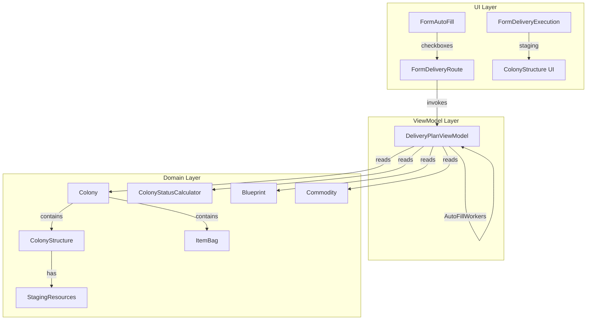

# Design Document: Delivery Auto-Fill Phase 7

## Overview

This design extends the delivery auto-fill system from commodity-only to support four request types: Commodities (existing), Flatpacks, Manufacturing Resources, and Workers. It also adds flatpack staging on delivery execution and a StagingResources flag on ColonyStructure for manufacturing resource planning.

The design follows the established pattern in `DeliveryPlanViewModel.AutoFillCommodities` — each new auto-fill type gets its own method that accepts route stops and delegate-based finders, scans colonies, computes shortfalls, and adds drop-off `DeliveryItem` entries additively.

Key design decisions:
- Each auto-fill type is a separate method on `DeliveryPlanViewModel` for testability and single-responsibility
- `StagingResources` is a direct boolean property on `ColonyStructure` (not in PropertyBag), matching the pattern of `ManufacturingCommodityName`
- Worker gap calculation reuses `ColonyStatusCalculator` to compute ideal vs actual worker counts
- Manufacturing resources are always Refined purity per game rules
- All auto-fill methods are additive — they never remove existing plan items

## Architecture



The orchestration flow when the user clicks OK on FormAutoFill:

1. `FormDeliveryRoute.cmdAutoFill_Click` opens `FormAutoFill`
2. On OK, it reads which checkboxes are checked
3. For each checked type, it calls the corresponding `AutoFill*` method on `DeliveryPlanViewModel`
4. Each method iterates route stops, finds colonies via delegate, computes needs, and adds `DeliveryItem` entries
5. The form saves and refreshes the plan display

## Components and Interfaces

### FormAutoFill Changes

Enable the three disabled checkboxes and expose boolean properties:

| Property | Checkbox | Current State | New State |
|---|---|---|---|
| `IncludeCommodities` | chkCommodities | Enabled, checked | No change |
| `IncludeFlatpacks` | chkFlatpacks | Disabled, "(Future)" | Enabled, text "Flatpacks" |
| `IncludeResources` | chkResources | Disabled, "(Future)" | Enabled, text "Resources for Manufacturing" |
| `IncludeWorkers` | chkWorkers | Disabled, "(Future)" | Enabled, text "Workers" |

### DeliveryPlanViewModel New Methods

```csharp
// Scans for unbuilt+unstaged structures, adds flatpack drop-off items
public int AutoFillFlatpacks(
    IEnumerable<RouteStop> routeStops,
    Func<string, Colony> colonyFinder)

// Scans for StagingResources=true structures, calculates resource shortfalls
public int AutoFillManufacturingResources(
    IEnumerable<RouteStop> routeStops,
    Func<string, Colony> colonyFinder,
    Func<string, Blueprint> blueprintFinder)

// Computes ideal vs actual worker gaps per colony
public int AutoFillWorkers(
    IEnumerable<RouteStop> routeStops,
    Func<string, Colony> colonyFinder,
    PlayerContext playerContext)
```

All methods follow the same pattern as `AutoFillCommodities`:
- Accept `IEnumerable<RouteStop>` and finder delegates
- Use `GetOrCreateStop` to find/create plan stops
- Use `AddDropOffItem` to add items
- Return count of items added
- Never remove existing items

### ColonyStructure.StagingResources

New direct boolean property on `ColonyStructure`:

```csharp
public bool StagingResources { get; set; } = false;
```

This is serialized to JSON by Newtonsoft.Json automatically (same as `ManufacturingQuantity`, `ManufacturingCompleted`, etc.).

### ColonyStructureViewModel.StagingResources

Pass-through property:

```csharp
public bool StagingResources
{
    get => _structure.StagingResources;
    set => _structure.StagingResources = value;
}
```

### ColonyStructure UI — Stage Resources Checkbox

A new `CheckBox chkStageResources` added to the ColonyStructure UserControl Designer. Visibility rules:
- Visible only for Manufactory and CommodityFactory blueprint types
- Hidden when `ProcessCompletionTime` is not null (manufacturing is running)
- Enabled only when a blueprint/commodity is selected AND `ManufacturingQuantity > 0`
- Placed before the Start button in the manufacturing controls area

### FormDeliveryExecution — Flatpack Staging

In `DeliveryItem_CheckedChanged`, add handling for `ItemType.Flatpack`:
- Find the matching `ColonyStructure` on the target colony where `FlatpackBlueprintUUID == item.BaseItemTypeID`
- On check: set `Properties["Staged"] = "True"`
- On uncheck: set `Properties["Staged"] = "False"`
- Fire `ColonyDataChanged` event
- Log warning if no matching structure found

### FormDeliveryRoute — Orchestration

Update `cmdAutoFill_Click` to call all four auto-fill methods based on checkbox state:

```csharp
if (dlg.IncludeCommodities)
    added += planViewModel.AutoFillCommodities(viewModel.Stops, colonyFinder);
if (dlg.IncludeFlatpacks)
    added += planViewModel.AutoFillFlatpacks(viewModel.Stops, colonyFinder);
if (dlg.IncludeResources)
    added += planViewModel.AutoFillManufacturingResources(viewModel.Stops, colonyFinder, blueprintFinder);
if (dlg.IncludeWorkers)
    added += planViewModel.AutoFillWorkers(viewModel.Stops, colonyFinder, playerContext);
```

## Data Models

### DeliveryItem ItemType Usage

| Auto-Fill Type | ItemType | BaseItemTypeID | Name | ResourcePurity | Quantity |
|---|---|---|---|---|---|
| Commodities | Commodity | commodity name | commodity name | "" | shortfall |
| Flatpacks | Flatpack | FlatpackBlueprintUUID | blueprint ExtendedName | "" | 1 |
| Resources | Resource | resource name | resource name | "Refined" | shortfall |
| Workers | WorkDetail | worker detail ID | worker detail name | "" | gap count |

### AutoFillFlatpacks Logic

For each route stop's colony:
1. Iterate `colony.Structures`
2. For each structure, create a `ColonyStructureViewModel` to check `IsBuilt` and `IsStaged`
3. If `!IsBuilt && !IsStaged`: look up the blueprint via `playerContext.FindBlueprint(structure.FlatpackBlueprintUUID)`
4. If blueprint found: add drop-off item with `ItemType.Flatpack`, `BaseItemTypeID = structure.FlatpackBlueprintUUID`, `Name = blueprint.ExtendedName`, `Quantity = 1`

### AutoFillManufacturingResources Logic

For each route stop's colony:
1. Iterate `colony.Structures`
2. For each structure where `StagingResources == true`:
   - If blueprint type is **Manufactory**: look up `ManufacturingBlueprintUUID` → get `Blueprint.Resources` dictionary → multiply each resource quantity by `ManufacturingQuantity`
   - If blueprint type is **CommodityFactory**: look up `ManufacturingCommodityName` → get `Commodity.ConstructionResources` dictionary → multiply each resource quantity by `ManufacturingQuantity`
3. For each resource needed: subtract `colony.Items.FindResource(resourceName, "Refined")` quantity sum
4. If shortfall > 0: add drop-off item with `ItemType.Resource`, `ResourcePurity = "Refined"`

Resource aggregation happens per-colony (multiple staging structures on the same colony aggregate their needs, and warehouse stock is subtracted once from the total).

### AutoFillWorkers Logic

For each route stop's colony:
1. Create a `ColonyStatusCalculator` and run `CalculateBuilt()` (actual) and `CalculateIdeal()` (ideal)
2. Compare `finalIdealStatus.HabitationRequired` vs `finalActualStatus.HabitationRequired` — if ideal <= actual, skip (colony is fully staffed)
3. For each worker type in `WorkerDetail.WorkerTypes`:
   - Sum ideal worker count across all structures (from blueprint properties using ideal worker source)
   - Sum actual worker count across all structures (from actual worker assignments)
   - Gap = ideal - actual
   - If gap > 0: add drop-off item with `ItemType.WorkDetail`, `BaseItemTypeID = wt.DetailKey`, `Name = workerDetail.Name`

### StagingResources Validation

When `StagingResources` is set to true, the UI enforces:
- For Manufactory: `ManufacturingBlueprintUUID` must be non-empty and `ManufacturingQuantity > 0`
- For CommodityFactory: `ManufacturingCommodityName` must be non-empty and `ManufacturingQuantity > 0`

The auto-fill logic also validates these conditions before computing resources (defensive check).


## Correctness Properties

*A property is a characteristic or behavior that should hold true across all valid executions of a system — essentially, a formal statement about what the system should do. Properties serve as the bridge between human-readable specifications and machine-verifiable correctness guarantees.*

### Property 1: Flatpack auto-fill produces correct items for unbuilt+unstaged structures

*For any* colony with any combination of structures in various states (built, staged, unbuilt, online), `AutoFillFlatpacks` should produce exactly one drop-off `DeliveryItem` per structure where `IsBuilt == false` AND `IsStaged == false`, with `ItemType = Flatpack`, `BaseItemTypeID` equal to the structure's `FlatpackBlueprintUUID`, `Name` equal to the blueprint's `ExtendedName`, and `Quantity = 1`. The return count should equal the number of items added. Structures that are built, staged, or both should produce no items.

**Validates: Requirements 2.1, 2.2, 2.3**

### Property 2: Auto-fill methods are additive (preserve existing items)

*For any* delivery plan with any number of pre-existing drop-off and pick-up items across any stops, invoking any auto-fill method (`AutoFillFlatpacks`, `AutoFillManufacturingResources`, `AutoFillWorkers`) should preserve all previously existing items unchanged. The count of pre-existing items on each stop should remain the same, and their field values should be unmodified.

**Validates: Requirements 2.4, 11.3**

### Property 3: Manufacturing resource shortfall calculation is correct

*For any* colony with one or more structures where `StagingResources == true` (either Manufactory with a valid `ManufacturingBlueprintUUID` or CommodityFactory with a valid `ManufacturingCommodityName`), and *for any* `ManufacturingQuantity > 0`, and *for any* warehouse state containing zero or more Refined resources, `AutoFillManufacturingResources` should produce drop-off items where each item's `Quantity` equals `max(0, (perUnitQuantity × ManufacturingQuantity) - warehouseQuantity)` for each resource in the blueprint's `Resources` or commodity's `ConstructionResources` dictionary. Items should have `ItemType = Resource`, `ResourcePurity = "Refined"`, and resources with zero shortfall should produce no item.

**Validates: Requirements 7.1, 7.2, 7.3, 7.4, 7.5, 8.1, 8.2, 8.3, 8.4**

### Property 4: Worker gap calculation produces correct worker items

*For any* colony with any set of built/online structures with blueprint-defined worker slots, `AutoFillWorkers` should produce a drop-off `DeliveryItem` for each worker type (BlueCollar, WhiteCollar, Specialist) where the ideal worker count exceeds the actual worker count. The item's `Quantity` should equal the gap (ideal - actual), `ItemType` should be `WorkDetail`, and `BaseItemTypeID` should be the worker detail ID (e.g., "BlueCollarDetail"). Worker types with zero gap should produce no item.

**Validates: Requirements 10.1, 10.2, 10.3, 10.4**

### Property 5: StagingResources serialization round-trip

*For any* `ColonyStructure` with `StagingResources` set to either `true` or `false`, serializing the structure to JSON and deserializing it back should produce a structure with the same `StagingResources` value. Additionally, setting `StagingResources` via `ColonyStructureViewModel` should read back the same value from both the ViewModel and the underlying `ColonyStructure`.

**Validates: Requirements 4.1, 4.2**

## Error Handling

| Scenario | Handling |
|---|---|
| Colony not found for a route stop | Skip the stop, continue to next (matches existing `AutoFillCommodities` pattern) |
| Blueprint not found for a structure's `FlatpackBlueprintUUID` | Skip the structure, do not add a flatpack item |
| Manufacturing blueprint not found for staging Manufactory | Skip the structure, do not add resource items |
| Commodity not found for staging CommodityFactory | Skip the structure, do not add resource items |
| `ManufacturingQuantity <= 0` on a staging structure | Skip the structure (defensive check) |
| No matching ColonyStructure for flatpack staging on execution | Log warning via NLog, continue without error |
| Resource quantity string in Blueprint.Resources is not parseable | Treat as 0, skip that resource |
| Worker detail ID not found in `WorkerDetail.WorkerDetailMapByID` | Skip that worker type |
| `StagingResources = true` but no blueprint/commodity selected | Auto-fill skips (defensive), UI prevents via checkbox enablement |

## Testing Strategy

### Dual Testing Approach

Both unit tests and property-based tests are required for comprehensive coverage.

### Property-Based Testing

- Library: **FsCheck** (NuGet package `FsCheck` + `FsCheck.NUnit`) — the standard PBT library for .NET/NUnit
- Minimum 100 iterations per property test
- Each property test must reference its design document property with a comment tag

Tag format: `// Feature: delivery-autofill-phase7, Property {number}: {title}`

Each correctness property maps to a single property-based test:

| Property | Test Focus | Generator Strategy |
|---|---|---|
| Property 1 | `AutoFillFlatpacks` | Generate colonies with random structure counts, random Built/Staged states, mock blueprints |
| Property 2 | All auto-fill methods | Generate plans with random pre-existing items, run auto-fill, verify preservation |
| Property 3 | `AutoFillManufacturingResources` | Generate staging structures with random resource dictionaries, random quantities, random warehouse contents |
| Property 4 | `AutoFillWorkers` | Generate colonies with structures having random worker slot counts and random assignment states |
| Property 5 | `StagingResources` round-trip | Generate random boolean values, serialize/deserialize ColonyStructure |

### Unit Tests

Unit tests cover specific examples, edge cases, and integration points:

- `AutoFillFlatpacks` with no structures → returns 0
- `AutoFillFlatpacks` with all structures built → returns 0
- `AutoFillFlatpacks` with mix of states → correct count
- `AutoFillManufacturingResources` with no staging structures → returns 0
- `AutoFillManufacturingResources` with warehouse fully stocked → returns 0 (no shortfall)
- `AutoFillManufacturingResources` with partial warehouse → correct shortfall quantities
- `AutoFillManufacturingResources` aggregates across multiple staging structures on same colony
- `AutoFillWorkers` with fully staffed colony → returns 0
- `AutoFillWorkers` with partial staffing → correct gap per worker type
- `FormAutoFill` checkbox properties return correct values
- `ColonyStructure.StagingResources` defaults to false
- Flatpack staging on execution form sets Staged property correctly
