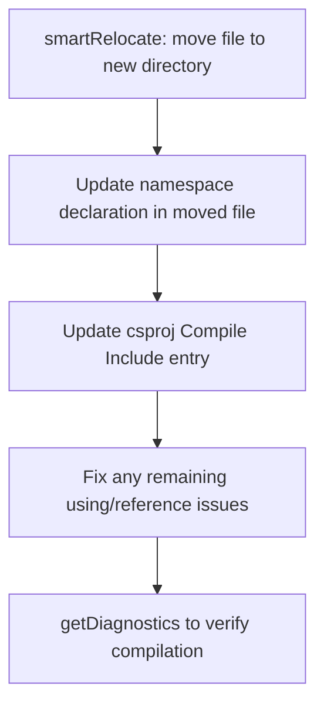
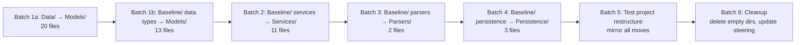

# Design Document: Directory Restructure

## Overview

This design covers the reorganization of the OE2EmpireTracker project from two catch-all directories (`Baseline/` and `Data/`) into four purpose-driven directories: `Models/`, `Services/`, `Parsers/`, and `Persistence/`. The test project mirrors the same restructure.

The work is executed in six batches, each producing a buildable, fully-tested commit. The `smartRelocate` tool handles reference updates in consuming files automatically, but two things must be fixed manually after each move:

1. The `namespace` declaration inside the moved file itself
2. The old-style csproj `<Compile Include="...">` entry

### Current State

```
OE2EmpireTracker/
├── Baseline/    ← 29 files: mixed POCOs, singletons, services, parsers, persistence
├── Data/        ← 20 files: POCOs and enums (namespace OE2EmpireTracker.Data)
```

### Target State

```
OE2EmpireTracker/
├── Models/      ← 33 files: all POCOs, data types, enums, interfaces
├── Services/    ← 11 files: singletons, processing, business rules
├── Parsers/     ← 2 files:  HTML/data import parsers
├── Persistence/ ← 3 files:  file I/O and window-state helpers
```

Unchanged directories: `Constants/`, `Controls/`, `ViewModels/`, `Forms/`, `Properties/`.

## Architecture

The restructure is a pure file-organization change. No code logic changes. The layered architecture remains:

```
Models (POCOs) → Services (domain logic) → ViewModels → Forms (UI)
                  ↑
            Parsers (data import)
            Persistence (file I/O)
```

### Namespace Mapping

| Old Directory | Old Namespace | New Directory | New Namespace |
|---|---|---|---|
| `Data/` | `OE2EmpireTracker.Data` | `Models/` | `OE2EmpireTracker.Models` |
| `Baseline/` (data types) | `OE2EmpireTracker.Baseline` | `Models/` | `OE2EmpireTracker.Models` |
| `Baseline/` (services) | `OE2EmpireTracker.Baseline` | `Services/` | `OE2EmpireTracker.Services` |
| `Baseline/` (parsers) | `OE2EmpireTracker.Baseline` | `Parsers/` | `OE2EmpireTracker.Parsers` |
| `Baseline/` (persistence) | `OE2EmpireTracker.Baseline` | `Persistence/` | `OE2EmpireTracker.Persistence` |

### Test Project Namespace Mapping

| Old Test Directory | Old Namespace | New Test Directory | New Namespace |
|---|---|---|---|
| `Data/` | `OE2EmpireTracker.Tests.Data` | `Models/` | `OE2EmpireTracker.Tests.Models` |
| `Baseline/` (model tests) | `OE2EmpireTracker.Tests.Baseline` | `Models/` | `OE2EmpireTracker.Tests.Models` |
| `Baseline/` (service tests) | `OE2EmpireTracker.Tests.Baseline` | `Services/` | `OE2EmpireTracker.Tests.Services` |
| `Baseline/` (parser tests) | `OE2EmpireTracker.Tests.Baseline` | `Parsers/` | `OE2EmpireTracker.Tests.Parsers` |
| `Baseline/` (persistence tests) | `OE2EmpireTracker.Tests.Baseline` | `Persistence/` | `OE2EmpireTracker.Tests.Persistence` |

## Components and Interfaces

No new components or interfaces are introduced. This is a file-move-only restructure.

### Per-File Move Procedure (repeated for every file)



### Batch Execution Order



### Batch Details

**Batch 1a — Data/ → Models/ (20 files, main project)**
Move all 20 files from `OE2EmpireTracker/Data/` to `OE2EmpireTracker/Models/`:
Blueprint, Commodity, CommodityGroup, CommodityIndustry, CountDownTime, Item, ItemBag, ItemProperty, ItemType, LockTracking, PlayerProfile, PlayerRank, PlayerSkill, PropertyBag, Resource, ResourceClass, ResourceGroup, ResourcePurity, SubResource, WorkerDetail

Namespace change: `OE2EmpireTracker.Data` → `OE2EmpireTracker.Models`

**Batch 1b — Baseline/ data types → Models/ (13 files, main project)**
Colony, ColonyStructure, ColonyStructureStatus, ColonyWorker, CommodityRequested, DeliveryRoute, DeliveryPlan, Survey, ShipClass, TechLevel, BlueprintType, UIPreferences, IColonyStructureWorkers

Namespace change: `OE2EmpireTracker.Baseline` → `OE2EmpireTracker.Models`

**Batch 2 — Baseline/ services → Services/ (11 files, main project)**
EmpireContext, PlayerContext, BackgroundProcessor, ColonyStatusCalculator, ColonyActivityCollector, ColonyBuildEligibility, ColonyBootstrap, BuildOrderOptimizer, BuildTimeCalculator, DeliveryFulfillment, PreferencesStore

Namespace change: `OE2EmpireTracker.Baseline` → `OE2EmpireTracker.Services`

**Batch 3 — Baseline/ parsers → Parsers/ (2 files, main project)**
ColonyParser, SurveyParser

Namespace change: `OE2EmpireTracker.Baseline` → `OE2EmpireTracker.Parsers`

**Batch 4 — Baseline/ persistence → Persistence/ (3 files, main project)**
SafeFileWriter, WindowStateHelper, BoundsValidator

Namespace change: `OE2EmpireTracker.Baseline` → `OE2EmpireTracker.Persistence`

**Batch 5 — Test project restructure**
Move test files to mirror the new main project structure:

| Test File | From | To |
|---|---|---|
| 15 Data/ test files | `Tests/Data/` | `Tests/Models/` |
| BlueprintTypeTests, ColonyStructureTests, ColonyBuildCompletionTests, ColonyProcessingTests, DeliveryPlanTests, DeliveryRouteTests, SurveyTests, UIPreferencesTests | `Tests/Baseline/` | `Tests/Models/` |
| BackgroundProcessorTests, BuildTimeCalculatorTests, ColonyActivityCollectorTests, ColonyBuildEligibilityTests, ColonyStatusCalculatorTests, ContextFilePathTests, DeliveryFulfillmentTests, DeliveryPlanViewModelTests, DeliveryRouteViewModelTests, PreferencesStoreTests | `Tests/Baseline/` | `Tests/Services/` |
| ColonyParserTests, SurveyParserTests | `Tests/Baseline/` | `Tests/Parsers/` |
| SafeFileWriterTests, BoundsValidatorTests | `Tests/Baseline/` | `Tests/Persistence/` |

**Batch 6 — Cleanup**
- Delete empty `Baseline/` and `Data/` directories in both projects
- Update `.kiro/steering/structure.md` to reflect the new layout

### smartRelocate Limitations

The `smartRelocate` tool automatically updates references in files that *consume* the moved file (e.g., `using` statements in other files). However, it does NOT update:

1. **The namespace declaration inside the moved file** — must be changed manually from e.g. `namespace OE2EmpireTracker.Data` to `namespace OE2EmpireTracker.Models`
2. **The csproj Compile Include entries** — old-style csproj requires explicit `<Compile Include="path">` entries; these must be updated manually from e.g. `Data\Blueprint.cs` to `Models\Blueprint.cs`

Both must be done after each `smartRelocate` call.

## Data Models

No data model changes. All POCOs, enums, and interfaces retain their exact same fields, properties, and behavior. Only their namespace declarations and file locations change.

### Csproj Entry Format

Old-style csproj uses explicit Compile Include entries. Example transformation:

```xml
<!-- Before -->
<Compile Include="Data\Blueprint.cs" />
<Compile Include="Baseline\Colony.cs" />

<!-- After -->
<Compile Include="Models\Blueprint.cs" />
<Compile Include="Models\Colony.cs" />
```

### Using Statement Updates

Files throughout the codebase that reference moved types will need their `using` statements updated. Example:

```csharp
// Before
using OE2EmpireTracker.Data;
using OE2EmpireTracker.Baseline;

// After
using OE2EmpireTracker.Models;
using OE2EmpireTracker.Services;
using OE2EmpireTracker.Parsers;      // only if file uses parser types
using OE2EmpireTracker.Persistence;   // only if file uses persistence types
```

Many files currently use `using OE2EmpireTracker.Baseline;` which covers types going to four different new namespaces. After the restructure, these files may need multiple new `using` statements depending on which types they reference.

## Correctness Properties

*A property is a characteristic or behavior that should hold true across all valid executions of a system — essentially, a formal statement about what the system should do. Properties serve as the bridge between human-readable specifications and machine-verifiable correctness guarantees.*

Since this is a pure file-reorganization feature with no logic changes, the correctness properties focus on structural invariants that must hold after the restructure is complete.

### Property 1: Namespace matches directory

*For any* `.cs` source file located in one of the new directories (`Models/`, `Services/`, `Parsers/`, `Persistence/`) in either the main project or test project, the `namespace` declaration inside that file shall match the expected namespace for its directory (e.g., `OE2EmpireTracker.Models` for files in `OE2EmpireTracker/Models/`, `OE2EmpireTracker.Tests.Services` for files in `OE2EmpireTracker.Tests/Services/`).

**Validates: Requirements 1.3, 2.2, 3.2, 4.2, 6.3**

### Property 2: Csproj Compile Include entries match file locations

*For any* `.cs` source file in the main project or test project that resides in one of the new directories (`Models/`, `Services/`, `Parsers/`, `Persistence/`), there shall exist a `<Compile Include="...">` entry in the corresponding `.csproj` file whose path matches the file's actual relative location within the project.

**Validates: Requirements 1.4, 2.3, 3.3, 4.3, 6.4, 9.2, 9.4**

### Property 3: No stale namespace references

*For any* `.cs` source file in the entire solution (main project and test project), the file shall not contain a `using OE2EmpireTracker.Data;` or `using OE2EmpireTracker.Baseline;` statement after the restructure is complete.

**Validates: Requirements 1.5, 2.4, 3.4, 4.4**

### Property 4: No stale csproj paths

*For any* `<Compile Include="...">` entry in either the main project or test project `.csproj` file, the include path shall not begin with `Baseline\` or `Data\`.

**Validates: Requirements 5.3, 9.1, 9.3**

### Property 5: Test project mirrors source project structure

*For any* source file in the main project that has a corresponding test file, the test file shall reside in the same-named directory in the test project as the source file does in the main project (e.g., if `Colony.cs` is in `Models/`, then `ColonyProcessingTests.cs` is in `Models/`).

**Validates: Requirements 6.2**

## Error Handling

This restructure introduces no new error-handling code. The primary risks during execution are:

1. **Build failure after a move** — A missed namespace update or stale csproj entry will cause a compile error. Mitigation: run `getDiagnostics` after every batch and fix before committing.

2. **Stale `using` statements** — `smartRelocate` handles most reference updates, but if it misses any, the compiler will flag them as errors. These are caught by the build step.

3. **Designer files referencing old namespaces** — WinForms `.Designer.cs` files may contain fully-qualified type references. If `smartRelocate` doesn't update these, they must be fixed manually. The build will catch any misses.

4. **Test discovery failure** — If test namespaces aren't updated, the test runner may not discover tests. Mitigation: verify test count matches expected (746 tests) after each batch.

## Testing Strategy

### Verification Approach

Since this is a structural refactoring with no logic changes, testing focuses on two things:

1. **Build integrity** — The solution compiles after every batch (`getDiagnostics` on all modified files)
2. **Test regression** — All 746 existing tests pass after every batch (via `vstest.console`)

### Per-Batch Verification Steps

After each batch:
1. Run `getDiagnostics` on all moved files and files with updated `using` statements
2. Build the solution with `msbuild OE2EmpireTracker.sln /p:Configuration=Debug`
3. Run all tests with `vstest.console` against the test DLL
4. Verify test count = 746 (no tests lost due to namespace/discovery issues)
5. Commit only after all checks pass

### Property-Based Testing

This restructure does not introduce new runtime behavior, so property-based tests are not applicable in the traditional sense. The correctness properties defined above are structural invariants verified by:

- Scanning file namespaces (Property 1)
- Parsing csproj XML for Compile Include entries (Properties 2, 4)
- Grepping for stale using statements (Property 3)
- Comparing source and test directory structures (Property 5)

These checks can be implemented as a post-restructure validation script or as one-time NUnit tests if desired, but the primary verification mechanism is the existing 746-test suite plus successful compilation.

### Unit Testing

No new unit tests are needed. The existing test suite comprehensively covers all domain logic. If all 746 tests pass after the restructure, the move was successful. The tests themselves are moved (Batch 5) but their assertions and logic remain identical — only namespaces and file locations change.
