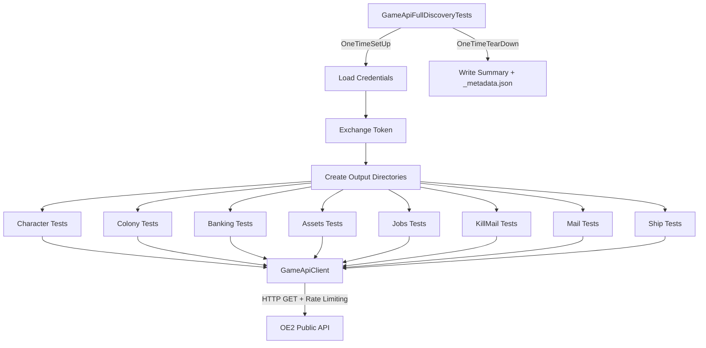

# Design Document: Game API Discovery Tool

## Overview

This feature expands the existing `GameApiColonyDiscoveryTests` pattern into a comprehensive `GameApiFullDiscoveryTests` fixture that calls every read endpoint in the game API for a given character. The tool authenticates using the same credential-loading pattern (preferences + credential manager), iterates through all endpoint categories, saves raw JSON responses to `spec/game-api-data/` organized by category, and produces a summary of successes and failures.

The design prioritizes:
- **Completeness**: Every known read endpoint is called
- **Resilience**: Missing scopes (403) and other errors are logged and skipped, not fatal
- **Discoverability**: Output is organized by category with human-readable indented JSON
- **Reusability**: New GameApiClient methods are available for production use later

## Architecture




### Orchestration Flow

1. **OneTimeSetUp**: Load credentials from preferences + credential manager, exchange token, create output directory tree
2. **Individual Tests (ordered)**: Each test method covers one endpoint category. Tests are `[Order]`ed so list endpoints run before detail endpoints that depend on their IDs.
3. **OneTimeTearDown**: Write `_metadata.json` and test output summary

### Key Design Decisions

| Decision | Rationale |
|----------|-----------|
| Single fixture, ordered tests | Mirrors existing `GameApiColonyDiscoveryTests` pattern; allows running individual categories |
| Save full envelope (not just `data`) | Preserves error responses, return codes, and metadata for debugging |
| Output to `spec/game-api-data/` | Keeps reference data in the spec directory, gitignored from production |
| Limit detail calls (5 max for lists) | Prevents excessive API calls for kill mails and mail which could have hundreds of entries |
| New methods on GameApiClient | Reusable for future production features; follows existing method pattern |

## Components and Interfaces

### New GameApiClient Methods

All new methods follow the existing pattern: accept `(string appId, string accessToken, ...)`, return `(bool Success, string Json)`, handle 401/403/404 gracefully, and use `ExecuteWithPoliciesAsync` internally with rate limiting.


```csharp
// Colony (new — summary for individual colony)
Task<(bool Success, string Json)> GetColonySummaryAsync(string appId, string accessToken, int colonyId)
// GET /v1/colonies/{colonyId}

// Assets
Task<(bool Success, string Json)> GetAssetLocationsAsync(string appId, string accessToken)
// GET /v1/assets/locations

Task<(bool Success, string Json)> GetAssetLocationDetailAsync(string appId, string accessToken, int locationId, string locationType)
// GET /v1/assets/locations/{locationId}?locationType={type}

// Banking
Task<(bool Success, string Json)> GetBankingBalanceAsync(string appId, string accessToken)
// GET /v1/banking/balance

Task<(bool Success, string Json)> GetBankingTransactionsAsync(string appId, string accessToken)
// GET /v1/banking/transactions

// Jobs
Task<(bool Success, string Json)> GetAcceptedJobsAsync(string appId, string accessToken)
// GET /v1/jobs/accepted

// Kill Mails
Task<(bool Success, string Json)> GetKillMailListAsync(string appId, string accessToken)
// GET /v1/killmails

Task<(bool Success, string Json)> GetKillMailDetailAsync(string appId, string accessToken, int killMailId)
// GET /v1/killmails/{killMailId}

// Mail
Task<(bool Success, string Json)> GetMailListAsync(string appId, string accessToken)
// GET /v1/mail

Task<(bool Success, string Json)> GetMailDetailAsync(string appId, string accessToken, int mailId)
// GET /v1/mail/{mailId}

// Ship
Task<(bool Success, string Json)> GetShipConfigurationAsync(string appId, string accessToken)
// GET /v1/ship/configuration

Task<(bool Success, string Json)> GetShipCargoAsync(string appId, string accessToken)
// GET /v1/ship/cargo
```


### GameApiFullDiscoveryTests Fixture

```csharp
[TestFixture]
[Explicit("Requires real game API credentials")]
public class GameApiFullDiscoveryTests
{
    // Fields: client, appId, accessToken, outputDir, results tracker
    
    [OneTimeSetUp]  // Load creds, exchange token, create dirs
    [OneTimeTearDown]  // Write _metadata.json, dispose client
    
    // Ordered test methods — one per endpoint category:
    [Test, Order(1)]  PullCharacterProfile()
    [Test, Order(2)]  PullCharacterSkills()
    [Test, Order(3)]  PullColonyList()
    [Test, Order(4)]  PullColonyDetails()      // iterates colonies
    [Test, Order(5)]  PullBankingBalance()
    [Test, Order(6)]  PullBankingTransactions()
    [Test, Order(7)]  PullAssetLocations()
    [Test, Order(8)]  PullAssetLocationDetails() // iterates locations
    [Test, Order(9)]  PullAcceptedJobs()
    [Test, Order(10)] PullKillMailList()
    [Test, Order(11)] PullKillMailDetails()     // up to 5
    [Test, Order(12)] PullMailList()
    [Test, Order(13)] PullMailDetails()         // up to 5
    [Test, Order(14)] PullShipConfiguration()
    [Test, Order(15)] PullShipCargo()
}
```

### Result Tracking

A simple internal class tracks per-endpoint results during the run:

```csharp
private class EndpointResult
{
    public string Category { get; set; }
    public string Endpoint { get; set; }
    public bool Success { get; set; }
    public int HttpStatus { get; set; }
    public string SkipReason { get; set; }
}
```

The fixture accumulates these and writes a summary in `OneTimeTearDown`.


## Data Models

### Output Directory Structure

```
spec/game-api-data/
├── _metadata.json              # Run metadata (timestamp, characterId, scopes)
├── character/
│   ├── profile.json            # GET /v1/character
│   └── skills.json             # GET /v1/character/skills
├── colonies/
│   ├── list.json               # GET /v1/colonies
│   └── {colonyId}/
│       ├── summary.json        # GET /v1/colonies/{colonyId}
│       ├── buildings.json      # GET /v1/colonies/{colonyId}/buildings
│       ├── warehouse.json      # GET /v1/colonies/{colonyId}/warehouse
│       └── workers.json        # GET /v1/colonies/{colonyId}/workers
├── banking/
│   ├── balance.json            # GET /v1/banking/balance
│   └── transactions.json       # GET /v1/banking/transactions
├── assets/
│   ├── locations.json          # GET /v1/assets/locations
│   └── {locationType}-{locationId}.json  # GET /v1/assets/locations/{id}?locationType={type}
├── jobs/
│   └── accepted.json           # GET /v1/jobs/accepted
├── killmails/
│   ├── list.json               # GET /v1/killmails
│   └── {killMailId}.json       # GET /v1/killmails/{id}
├── mail/
│   ├── list.json               # GET /v1/mail
│   └── {mailId}.json           # GET /v1/mail/{id}
└── ship/
    ├── configuration.json      # GET /v1/ship/configuration
    └── cargo.json              # GET /v1/ship/cargo
```


### _metadata.json Schema

```json
{
  "runTimestamp": "2025-01-15T10:30:00Z",
  "characterId": 12345,
  "characterName": "PlayerName",
  "scopesGranted": ["character.read", "colony.list.read", "colony.buildings.read", ...],
  "endpointResults": {
    "succeeded": 15,
    "skipped": 2,
    "failed": 0
  },
  "details": [
    { "category": "character", "endpoint": "/v1/character", "success": true },
    { "category": "banking", "endpoint": "/v1/banking/balance", "success": false, "httpStatus": 403, "reason": "Scope not granted" }
  ]
}
```

### Parameterized Endpoint ID Extraction

For endpoints that require IDs from parent list responses, the fixture extracts IDs by deserializing the list response envelope:

| Parent Endpoint | ID Field | Used By |
|----------------|----------|---------|
| `/v1/colonies` | `data.colonies[].colonyId` | Colony detail endpoints |
| `/v1/assets/locations` | `data[].locationId` + `data[].locationType` | Asset detail endpoint |
| `/v1/killmails` | `data[].killMailId` | Kill mail detail (max 5) |
| `/v1/mail` | `data[].mailId` | Mail detail (max 5) |

The fixture uses `JObject`/`JArray` parsing (not strongly-typed DTOs) to extract IDs, since the discovery tool's purpose is to capture raw responses — not to validate structure.


## Error Handling

### Strategy: Log and Continue

The discovery tool is a data-gathering utility, not a production service. The error handling strategy prioritizes collecting as much data as possible over failing fast.

### HTTP Status Code Handling

| Status | Behavior | Logged As |
|--------|----------|-----------|
| 200 | Save response, record success | Info |
| 401 | Log, skip endpoint, record failure | Warn — token expired or invalid |
| 403 | Log missing scope, skip endpoint, continue | Warn — scope not granted |
| 404 | Log, skip endpoint (entity not found) | Warn — resource not found |
| 429 | Handled by GameApiClient rate limiter (auto-retry after pause) | Warn (internal) |
| 5xx | Handled by Polly retry policy (3 retries with exponential backoff) | Warn (internal) |
| Other | Log, skip endpoint, record failure | Warn |

### Error Response Preservation

When an endpoint returns a non-success status, the fixture still attempts to read and save the response body. This preserves error messages from the API for debugging. The file is saved with the same name but the content will contain the error envelope.

### Circuit Breaker Awareness

If the GameApiClient circuit breaker opens (3 consecutive transient failures), subsequent calls will throw `BrokenCircuitException`. The fixture catches this and records all remaining endpoints as "circuit breaker open" without attempting them.

### Token Expiry Mid-Run

If a 401 is received mid-run, the fixture logs it and continues with remaining endpoints (they will likely also fail with 401). A future enhancement could re-authenticate, but for a manual discovery tool this is acceptable — the user can simply re-run.


### Rate Limiting Strategy

The GameApiClient already implements sliding-window rate limiting (default 30 requests/minute) via `SemaphoreSlim`. Each new method calls `AcquireRateLimitTokenAsync()` before making the HTTP request, which:

1. Waits if a 429-induced pause is active
2. Acquires a semaphore token (blocks if rate limit reached)
3. Releases the token after `60000 / requestsPerMinute` ms

For the discovery tool, this means:
- With 30 req/min limit, each request is spaced ~2 seconds apart
- A full run with ~25-30 endpoints takes approximately 1-2 minutes
- Colony detail endpoints (5 calls per colony × N colonies) are the main volume driver
- The 5-item cap on kill mail and mail details prevents runaway call counts

No additional rate limiting is needed in the test fixture — the client handles it transparently.

## Testing Strategy

### Why Property-Based Testing Does NOT Apply

This feature is an integration tool that:
- Calls external API endpoints (side effects)
- Writes files to disk (side effects)
- Has no pure functions with meaningful input variation
- Has no universal properties that hold across a wide input space

The appropriate testing approach is:
- **Manual execution**: Run the `[Explicit]` fixture against the real API
- **Compile verification**: Ensure the fixture and new client methods compile cleanly
- **Pattern conformance**: New client methods follow the same structure as existing ones (verified by code review)


### Test Verification Approach

| Verification | Method |
|-------------|--------|
| Compilation | MSBuild full solution build (zero errors, zero warnings) |
| Method signatures | Each new GameApiClient method matches the established pattern |
| Fixture structure | NUnit `[Explicit]` attribute prevents accidental execution in CI |
| Integration test | Manual run of the fixture against the real API (developer-triggered) |
| Output validation | Visual inspection of saved JSON files for correct structure |

### What Is NOT Tested Automatically

- API response correctness (that's the API's responsibility)
- Network connectivity (requires real credentials)
- Scope availability (varies by character configuration)

These are inherent to the tool's nature as a discovery/reference utility, not a production service.

## Implementation Notes

### File Writing Pattern

Each test method follows this pattern:

```csharp
var result = await client.GetXxxAsync(appId, accessToken).ConfigureAwait(false);
if (!result.Success)
{
    RecordSkipped("category", "/v1/xxx", result.Json);
    return;
}

string outputPath = Path.Combine(outputDir, "category", "filename.json");
File.WriteAllText(outputPath, FormatJson(result.Json), Encoding.UTF8);
RecordSuccess("category", "/v1/xxx");
TestContext.WriteLine("Saved: " + outputPath);
```

### Shared Helper Methods

```csharp
private void RecordSuccess(string category, string endpoint)
private void RecordSkipped(string category, string endpoint, string reason)
private static string FormatJson(string json)  // pretty-print
private void EnsureDirectory(string path)
```
