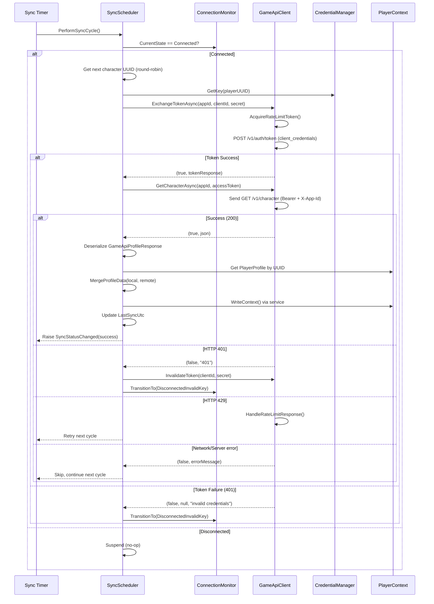

# Design Document

## Overview

This document describes the technical design for integrating OE2 Empire Tracker with the Outer Empires 2 game API. The design introduces a parallel HTTP client infrastructure (separate from the existing RemoteFactionClient) that authenticates via OAuth2 client_credentials flow (appId + clientId + per-character secret → JWT), enforces rate limits, monitors connectivity, and periodically synchronizes Player Profile data from the game server.

The architecture follows the existing patterns: singleton contexts, service-layer mutations, DPAPI credential storage, Polly resilience policies, and PreferencesStore-based settings persistence.

## Architecture

```
┌─────────────────────────────────────────────────────────────────┐
│                        MainWindow (Status Bar)                   │
│  [Game API: Connected | Last sync: 3m ago]                      │
└────────────────────────────┬────────────────────────────────────┘
                             │ GameApiConnectionStatusChanged
                             │ GameApiSyncStatusChanged
┌────────────────────────────┴────────────────────────────────────┐
│                      GameApiContext (Singleton)                   │
│  Owns: GameApiClient, GameApiSyncScheduler, ConnectionMonitor    │
│  Lifecycle: Initialize() on startup, Reset() on shutdown         │
└───────┬──────────────────────┬──────────────────────┬───────────┘
        │                      │                      │
┌───────▼───────┐  ┌──────────▼──────────┐  ┌───────▼───────────┐
│ GameApiClient │  │ GameApiSyncScheduler │  │ ConnectionMonitor │
│ (HTTP + Polly)│  │ (Timer + round-robin)│  │ (Token exchange)  │
└───────┬───────┘  └──────────┬──────────┘  └───────────────────┘
        │                      │
        │              ┌───────▼───────┐
        │              │ PlayerContext  │
        │              │ (merge fields)│
        │              └───────────────┘
        │
┌───────▼───────────────────────────────┐
│ GameApiCredentialManager              │
│ (DPAPI file at %LOCALAPPDATA%)        │
└───────────────────────────────────────┘
```

**Startup Sequence:**
1. `Program.cs` calls `GameApiContext.Initialize()` after `ServerContext.Initialize()`
2. GameApiContext reads settings from `PreferencesStore.Preferences.GameApiConnection`
3. If enabled with a server URL, AppId, and ClientId, creates credential manager, client, monitor, and scheduler
4. ConnectionMonitor performs initial token exchange within 5 seconds
5. SyncScheduler begins polling at the configured interval

## Components and Interfaces

### 1. GameApiCredentialManager

**File:** `OE2EmpireTracker.Common/Services/GameApiCredentialManager.cs`
**Satisfies:** Req 1


Manages per-character API key storage in a dedicated secrets file, separate from the RemoteFactionClient credentials.

**Storage location:** `%LOCALAPPDATA%\OE2EmpireTracker\game-api-secrets.dat`

**File format:** JSON dictionary of `{ "playerUUID": "base64-dpapi-blob" }` entries.

```csharp
public class GameApiCredentialManager
{
    private readonly string _secretsFilePath;
    private Dictionary<string, string> _protectedKeys; // UUID → base64 DPAPI blob

    public void StoreKey(string playerUUID, string plainTextKey);
    public SecureString GetKey(string playerUUID);
    public void RemoveKey(string playerUUID);
    public bool HasKey(string playerUUID);
    public IReadOnlyList<string> GetConfiguredPlayerUUIDs();
}
```

**Behavior:**
- `StoreKey`: Calls `CredentialStore.Protect(plainTextKey)`, stores base64 blob keyed by UUID, calls `Save()`.
- `GetKey`: Reads base64 blob, calls `CredentialStore.Unprotect()`, returns SecureString.
- `RemoveKey`: Removes entry, calls `Save()` which overwrites the file.
- `Load`: Reads and deserializes secrets file. If corrupted/unreadable, logs error, discards file, initializes empty dictionary.
- `Save`: Serializes dictionary to JSON, writes via SafeFileWriter.

### 2. GameApiClient

**File:** `OE2EmpireTracker.Common/Client/GameApiClient.cs`
**Satisfies:** Req 2, Req 3

A dedicated HTTP client for the game API, independent of RemoteFactionClient. Uses Polly for resilience and OAuth2 client_credentials flow for authentication.

```csharp
public class GameApiClient : IDisposable
{
    private readonly HttpClient _httpClient;
    private readonly AsyncRetryPolicy<HttpResponseMessage> _retryPolicy;
    private readonly AsyncCircuitBreakerPolicy<HttpResponseMessage> _circuitBreakerPolicy;
    private readonly Dictionary<string, CachedToken> _tokenCache;
    private SemaphoreSlim _rateLimiter;
    private int _rateLimitRequestsPerMinute;
    private DateTime _rateLimitPauseUntil;

    public GameApiClient(string serverUrl);
    public bool IsCircuitOpen { get; }
    public async Task<(bool Success, string Message)> TestConnectionAsync(string appId, string clientId, string secret);
    public async Task<(bool Success, GameApiTokenResponse Token, string ErrorMessage)> ExchangeTokenAsync(string appId, string clientId, string secret);
    public async Task<(bool Success, string Json)> GetCharacterAsync(string appId, string accessToken);
    public async Task<(bool Success, string Json)> GetCharacterSkillsAsync(string appId, string accessToken);
    public void InvalidateToken(string clientId, string secret);
    public void Dispose();
}
```

**Polly Policies:**
- **Retry:** Exponential backoff (1s, 2s, 4s) on HTTP 500/502/503/504. Max 3 attempts.
- **Circuit Breaker:** Opens after 3 consecutive failures. Break duration: 30 seconds. Half-open probe after break.
- **Rate Limiter:** SemaphoreSlim with timed token release (same pattern as RemoteFactionClient). Default: 30 tokens/minute. Updated dynamically from `X-RateLimit-Limit` response header.

**HTTP 429 Handling:**
- If `Retry-After` header present: pause all requests for that duration.
- If no `Retry-After`: pause for 60 seconds.
- Implemented via `_rateLimitPauseUntil` DateTime check in `AcquireRateLimitTokenAsync`.

**Authentication (OAuth2 client_credentials flow):**
- Token exchange: `POST /v1/auth/token` with JSON body `{ appId, clientId, secret, grantType: "client_credentials" }`.
- Response wrapped in `GameApiServiceResponse<GameApiTokenResponse>` envelope with `accessToken`, `tokenType`, `expiresIn`, `characterId`, `scopes`, `subscription`.
- Tokens cached per-character (keyed by clientId + secret hash) with 60-second expiry buffer.
- Authenticated data requests use two headers: `Authorization: Bearer <accessToken>` and `X-App-Id: <appId>`.
- Token exchange does NOT go through retry/circuit-breaker pipeline (anonymous endpoint, immediate feedback).
- No /health endpoint exists; token exchange serves as the connectivity test.


### 3. GameApiConnectionMonitor

**File:** `OE2EmpireTracker.Common/Services/GameApiConnectionMonitor.cs`
**Satisfies:** Req 4

Monitors game API reachability via periodic token exchange attempts and manages connection state transitions.

```csharp
public class GameApiConnectionMonitor : IDisposable
{
    public enum ConnectionState
    {
        NotConfigured,
        Connected,
        Disconnected,
        DisconnectedCircuitOpen,
        DisconnectedInvalidKey,
        Syncing,
        RateLimited
    }

    public event EventHandler<GameApiConnectionStatusChangedEventArgs> StatusChanged;
    public ConnectionState CurrentState { get; }
    public string StatusMessage { get; }

    public void Start(int pollingIntervalMinutes);
    public void Stop();
    public void UpdatePollingInterval(int pollingIntervalMinutes);
    public void Dispose();
}
```

**State Machine:**
```
NotConfigured ──[key configured]──► Connected
Connected ──[health check fails]──► Disconnected
Connected ──[circuit opens]──► DisconnectedCircuitOpen
Connected ──[HTTP 401]──► DisconnectedInvalidKey
Disconnected ──[health check succeeds]──► Connected
DisconnectedCircuitOpen ──[break expires, probe succeeds]──► Connected
DisconnectedInvalidKey ──[new key provided]──► Connected (via restart)
```

**Backoff:** Starts at 1000ms, doubles each failure, caps at 60000ms. Resets on successful health check.

**Startup:** Within 10 seconds of `Start()`, performs initial token exchange. Transitions to Connected or Disconnected based on result.

**Event safety:** State transitions proceed even if event handler throws (catch around event raise).

### 4. GameApiSyncScheduler

**File:** `OE2EmpireTracker.Common/Services/GameApiSyncScheduler.cs`
**Satisfies:** Req 5, Req 6

Manages periodic Player Profile synchronization across all configured characters.

```csharp
public class GameApiSyncScheduler : IDisposable
{
    public event EventHandler<GameApiSyncStatusChangedEventArgs> SyncStatusChanged;
    public DateTime? LastSyncUtc { get; }
    public bool IsSyncing { get; }

    public void Start(int pollingIntervalMinutes);
    public void Stop();
    public void UpdatePollingInterval(int pollingIntervalMinutes);
    public async Task SyncNowAsync();
    public void Dispose();
}
```

**Round-Robin:** Characters processed sequentially via index. Each polling cycle advances to the next character. If a character fails, skip and retry next cycle.

**Merge Strategy (Req 6):**
- **API wins (overwrite):** Skills, Ranks (Public/Private/Military), SkillPoints, Faction, CitizenId
- **Local preserved:** SkillGroups dictionary (collapse states), TotalCredits, ActiveTime
- **Conflict logging:** Each overwritten field logs: field name, old value, new value, strategy ("API wins")

**Sync Metadata:**
- `LastProfileSyncUtc` stored per-character in `Dictionary<string, DateTime>` on GameApiContext.
- Only updated on successful completion (not partial/failed).

**Manual Sync:** `SyncNowAsync()` triggers immediate sync for all configured characters, bypassing the timer.


### 5. GameApiContext (Singleton)

**File:** `OE2EmpireTracker.Common/Client/GameApiContext.cs`
**Satisfies:** Req 2, Req 4, Req 5, Req 9, Req 10

Top-level singleton that owns and coordinates all game API infrastructure. Parallels `ServerContext`.

```csharp
public class GameApiContext : IDisposable
{
    private static GameApiContext _instance;
    public static GameApiContext Instance => _instance;

    public GameApiClient Client { get; }
    public GameApiCredentialManager CredentialManager { get; }
    public GameApiConnectionMonitor ConnectionMonitor { get; }
    public GameApiSyncScheduler SyncScheduler { get; }
    public Dictionary<string, DateTime> LastSyncTimes { get; }

    public static void Initialize();
    public static void Reset();
    public void Dispose();
}
```

**Initialization Flow:**
1. Read `GameApiConnection` settings from `PreferencesStore.GetInstance().Preferences`
2. If `Enabled == false` or `ServerUrl` is empty or `AppId` is empty or `ClientId` is empty → log and return (no context created)
3. Create `GameApiCredentialManager` (loads secrets file)
4. If no characters have configured secrets → log and return
5. Create `GameApiClient(serverUrl)`
6. Create `GameApiConnectionMonitor(client, credentialManager, firstPlayerUUID, appId, clientId)` → `Start(pollingIntervalMinutes)`
7. Create `GameApiSyncScheduler(client, credentialManager, connectionMonitor, appId, clientId)` → `Start(pollingIntervalMinutes)`
8. Store as singleton `_instance`

### 6. Preferences UI — Game API Tab

**File:** `OE2EmpireTracker/Forms/Preferences/FormPreferences.cs` (existing form, new tab)
**Satisfies:** Req 7

Adds a "Game API" tab to the existing Preferences form:

| Control | Type | Binding |
|---------|------|---------|
| txtGameApiUrl | ValidatedTextBox | GameApiConnection.ServerUrl |
| txtGameApiAppId | ValidatedTextBox | GameApiConnection.AppId |
| txtGameApiClientId | ValidatedTextBox | GameApiConnection.ClientId |
| txtGameApiSecret | ValidatedTextBox (PasswordChar='●') | GameApiCredentialManager (encrypt on save) |
| nudPollingInterval | NumericUpDown (min:1, max:60, default:5) | GameApiConnection.PollingIntervalMinutes |
| chkGameApiEnabled | CheckBox | GameApiConnection.Enabled |
| btnTestGameApiConnection | Button | Calls GameApiClient.TestConnectionAsync(appId, clientId, secret) |
| lblTestResult | Label | Displays test result message |

**Save behavior:**
1. Persist `ServerUrl`, `AppId`, `ClientId`, `PollingIntervalMinutes`, `Enabled` to `UIPreferences.GameApiConnection`
2. If secret changed: call `GameApiCredentialManager.StoreKey(currentPlayerUUID, plainSecret)`
3. If polling interval changed: call `GameApiContext.Instance?.SyncScheduler.UpdatePollingInterval(newValue)`
4. Call `PreferencesStore.GetInstance().Save()`

**Secret display:** Always masked (PasswordChar='●'). On load, if secret exists for current player, show placeholder dots. Only store if content changes from placeholder.

### 7. Status Bar Integration

**File:** `OE2EmpireTracker/Forms/MainWindow.cs` (existing)
**Satisfies:** Req 8

Adds a `ToolStripStatusLabel` to the existing status bar.

| State | Label Text |
|-------|-----------|
| Not configured | "Game API: Not Configured" |
| Connected | "Game API: Connected · Last sync: {elapsed}" |
| Disconnected | "Game API: Disconnected" |
| Circuit open | "Game API: Disconnected (Circuit Open)" |
| Invalid key | "Game API: Disconnected (Invalid Key)" |
| Syncing | "Game API: Syncing..." |
| Rate limited | "Game API: Rate Limited" |
| Sync failed | "Game API: {error}" (30s, then reverts) |

**Elapsed time format:** "Xs ago", "Xm ago", "Xh ago" — updated by existing status bar refresh timer.

**Event wiring:** Subscribe to `ConnectionMonitor.StatusChanged` and `SyncScheduler.SyncStatusChanged`. Update label on UI thread via `BeginInvoke`.


## Data Models

### GameApiConnectionSettings

```csharp
// File: OE2EmpireTracker.Common/Models/GameApiConnectionSettings.cs
public class GameApiConnectionSettings
{
    public string ServerUrl { get; set; } = string.Empty;
    public string AppId { get; set; } = string.Empty;
    public string ClientId { get; set; } = string.Empty;
    public int PollingIntervalMinutes { get; set; } = 5;
    public bool Enabled { get; set; } = false;
}
```

Persisted in UIPreferences.json under `GameApiConnection` property. Uses Newtonsoft.Json PascalCase serialization matching the existing `ServerConnection` pattern.

### GameApiProfileResponse (DTO)

```csharp
// File: OE2EmpireTracker.Common/Models/GameApiProfileResponse.cs
public class GameApiProfileResponse
{
    [JsonProperty("uuid")]
    public string UUID { get; set; }

    [JsonProperty("name")]
    public string Name { get; set; }

    [JsonProperty("faction")]
    public string Faction { get; set; }

    [JsonProperty("skillPoints")]
    public int SkillPoints { get; set; }

    [JsonProperty("citizenId")]
    public string CitizenId { get; set; }

    [JsonProperty("registrationDate")]
    public string RegistrationDate { get; set; }

    [JsonProperty("skills")]
    public Dictionary<string, GameApiSkillResponse> Skills { get; set; }

    [JsonProperty("ranks")]
    public GameApiRanksResponse Ranks { get; set; }
}

public class GameApiSkillResponse
{
    [JsonProperty("level")]
    public int Level { get; set; }

    [JsonProperty("experience")]
    public long Experience { get; set; }
}

public class GameApiRanksResponse
{
    [JsonProperty("public")]
    public GameApiRankResponse Public { get; set; }

    [JsonProperty("private")]
    public GameApiRankResponse Private { get; set; }

    [JsonProperty("military")]
    public GameApiRankResponse Military { get; set; }
}

public class GameApiRankResponse
{
    [JsonProperty("name")]
    public string Name { get; set; }

    [JsonProperty("level")]
    public int Level { get; set; }
}
```

### GameApiConnectionStatusChangedEventArgs

```csharp
// File: OE2EmpireTracker.Common/Client/GameApiConnectionStatusChangedEventArgs.cs
public class GameApiConnectionStatusChangedEventArgs : EventArgs
{
    public GameApiConnectionMonitor.ConnectionState OldState { get; set; }
    public GameApiConnectionMonitor.ConnectionState NewState { get; set; }
    public string Message { get; set; }
}
```

### GameApiSyncStatusChangedEventArgs

```csharp
// File: OE2EmpireTracker.Common/Services/GameApiSyncStatusChangedEventArgs.cs
public class GameApiSyncStatusChangedEventArgs : EventArgs
{
    public bool IsSyncing { get; set; }
    public bool Success { get; set; }
    public string ErrorMessage { get; set; }
    public DateTime? LastSyncUtc { get; set; }
}
```

### UIPreferences Extension

Add to existing `UIPreferences.cs`:
```csharp
public GameApiConnectionSettings GameApiConnection { get; set; } = new GameApiConnectionSettings();
```

## Correctness Properties

### Property 1: Credential Confidentiality
**Validates: Requirements 1.1, 1.5**
The plain-text API key SHALL never be persisted to disk. Only DPAPI-encrypted blobs are written. Verifiable by: reading the secrets file and confirming all values are valid base64 that decode to DPAPI-protected bytes (not UTF-8 readable text).


### Property 2: Rate Limit Compliance
**Validates: Requirements 3.1, 3.2, 3.3, 3.4**
The number of API requests sent within any 60-second sliding window SHALL NOT exceed the configured rate limit. Verifiable by: property test that simulates rapid request sequences and asserts semaphore blocks when limit is reached.

### Property 3: Merge Idempotency
**Validates: Requirements 6.1, 6.2**
Applying the same API response to the same local profile multiple times SHALL produce identical results. Verifiable by: property test that merges, then merges again, and asserts equality.

### Property 4: Offline Continuity
**Validates: Requirements 9.1, 9.2, 9.4**
When the game API is unreachable, all local operations (skill lookups, rank display, calculations) SHALL continue to function using persisted data. Verifiable by: integration test that disconnects the API and exercises all PlayerProfile consumers.

### Property 5: State Machine Validity
**Validates: Requirements 4.4, 4.5, 4.6**
The ConnectionMonitor SHALL never transition to an invalid state (e.g., Connected → Connected without an intervening Disconnected). Verifiable by: property test that generates random event sequences and asserts all transitions are in the valid set.

### Property 6: Round-Robin Fairness
**Validates: Requirements 5.4, 5.7**
Over N polling cycles with K configured characters, each character SHALL be synced at least floor(N/K) times. Verifiable by: property test with varying N and K values.

### Property 7: Credential Isolation
**Validates: Requirements 1.2, 1.6**
Storing, retrieving, or removing a key for character A SHALL NOT affect the key for character B. Verifiable by: property test that performs random sequences of store/remove operations on multiple characters and asserts independence.

## Data Flow Diagrams

### Sync Cycle



## Error Handling

| Scenario | Behavior |
|----------|----------|
| Secrets file corrupted | Log error, discard file, start with empty credentials, prompt re-entry |
| Network timeout | Polly retry (3 attempts with backoff), then circuit breaker evaluation |
| HTTP 401 | Stop polling for that character, transition to DisconnectedInvalidKey |
| HTTP 429 with Retry-After | Pause all requests for specified duration |
| HTTP 429 without Retry-After | Pause all requests for 60 seconds |
| HTTP 5xx | Polly retry handles, circuit breaker opens after 3 consecutive |
| Circuit breaker open | Report DisconnectedCircuitOpen, wait break duration |
| One character fails | Skip, continue with next character, retry failed one next cycle |
| Event handler throws | State transition proceeds regardless (catch around event raise) |

## Dependencies

- **Polly 7.2.4** (already in project) — retry, circuit breaker policies
- **Newtonsoft.Json 13.0.4** (already in project) — JSON serialization
- **System.Net.Http** (framework) — HttpClient
- **System.Security.Cryptography** (framework) — DPAPI via ProtectedData
- **NLog 5.3.4** (already in project) — logging

No new NuGet packages required.

## Testing Strategy

| Test Category | Framework | Location |
|---------------|-----------|----------|
| Credential store/retrieve/remove | NUnit + FsCheck | OE2EmpireTracker.Tests/Services/ |
| Rate limiter token exhaustion | NUnit + FsCheck | OE2EmpireTracker.Tests/Client/ |
| Profile merge correctness | NUnit + FsCheck | OE2EmpireTracker.Tests/Services/ |
| Connection state machine | NUnit + FsCheck | OE2EmpireTracker.Tests/Services/ |
| Round-robin scheduling | NUnit + FsCheck | OE2EmpireTracker.Tests/Services/ |
| Settings persistence round-trip | NUnit | OE2EmpireTracker.Tests/Services/ |
| HTTP 429 handling | NUnit (mock HttpMessageHandler) | OE2EmpireTracker.Tests/Client/ |

All property tests use FsCheck 2.16.6 APIs (no 3.x). Generators use LINQ query syntax. Properties use `[FsCheck.NUnit.Property]` attribute.
