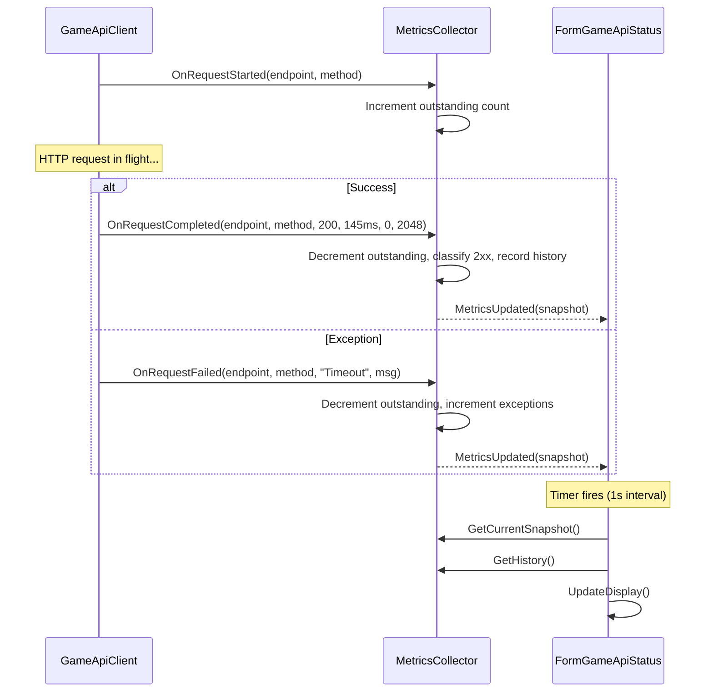
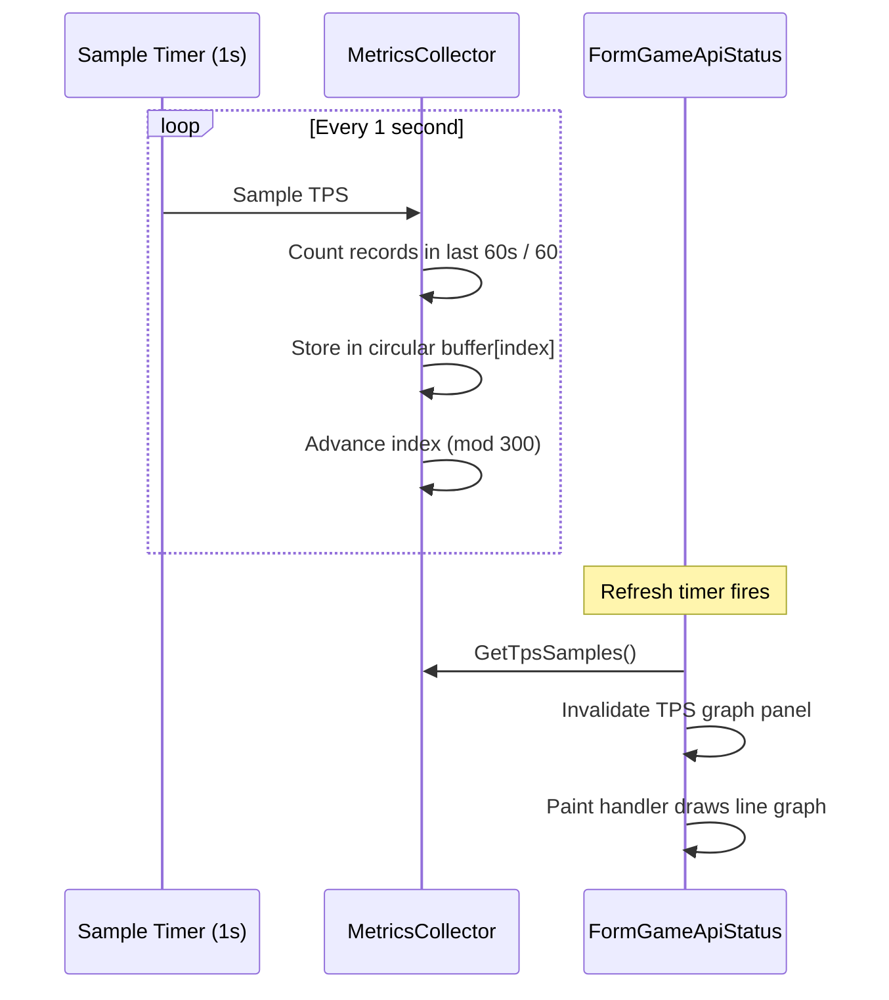
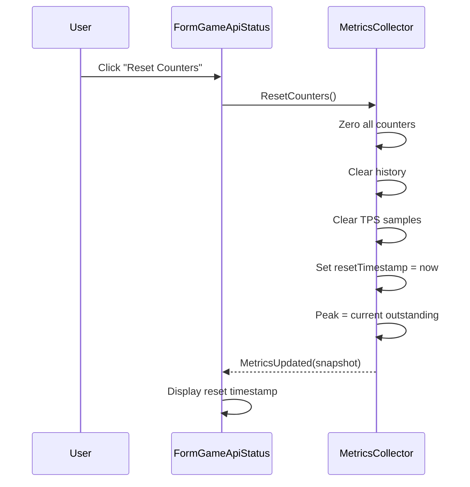

# Design Document

## Overview

This document describes the technical design for the Game API Status Form feature. The design introduces a `GameApiMetricsCollector` service that intercepts all `GameApiClient` requests to record timing, size, status, and outcome data, and a `FormGameApiStatus` MDI child form that displays real-time and historical API metrics.

The architecture follows existing patterns: the metrics collector lives in the Common library as a service-layer singleton, the form follows the standard MDI child pattern (IProgrammaticUpdateSource, NLog, WindowStateHelper, event subscription/unsubscription), and the integration point is the existing `ExecuteWithPoliciesAsync` method in `GameApiClient`.

## Architecture

```
┌─────────────────────────────────────────────────────────────────────┐
│                    FormGameApiStatus (MDI Child)                      │
│  [TPS Graph] [Counters] [Transfer] [Outstanding] [History Grid]      │
│  [Circuit Breaker State] [Rate Limiter State] [Reset] [Copy]         │
└────────────────────────────┬────────────────────────────────────────┘
                             │ MetricsUpdated event (timer-coalesced)
                             │
┌────────────────────────────┴────────────────────────────────────────┐
│                   GameApiMetricsCollector (Singleton)                 │
│  Owns: RequestHistory, TPS samples, cumulative counters              │
│  Raises: MetricsUpdated event on each request completion             │
└────────────────────────────┬────────────────────────────────────────┘
                             │ OnRequestStarted / OnRequestCompleted
                             │
┌────────────────────────────┴────────────────────────────────────────┐
│                      GameApiClient                                    │
│  ExecuteWithPoliciesAsync calls MetricsCollector hooks                │
│  Exposes: RateLimitState, CircuitBreakerState properties             │
└─────────────────────────────────────────────────────────────────────┘
```

## Components and Interfaces

### 1. GameApiMetricsCollector

**File:** `OE2EmpireTracker.Common/Services/GameApiMetricsCollector.cs`
**Satisfies:** Req 1, Req 2, Req 3, Req 4, Req 5

Singleton service that collects and aggregates API request metrics. Decoupled from the form — continues collecting regardless of whether the form is open.

```csharp
public class GameApiMetricsCollector
{
    private static readonly Logger Log = LogManager.GetCurrentClassLogger();
    private static GameApiMetricsCollector _instance;

    // Request history (bounded circular buffer)
    private readonly List<RequestRecord> _history;
    private readonly object _lock = new object();

    // Cumulative counters
    private long _totalRequests;
    private long _successCount;       // 2xx (and 3xx)
    private long _clientErrorCount;   // 4xx
    private long _serverErrorCount;   // 5xx
    private long _exceptionCount;     // timeout, network, circuit breaker
    private long _rateLimitedCount;   // 429 (subset of 4xx)
    private long _bytesSent;
    private long _bytesReceived;

    // Outstanding tracking
    private int _outstandingRequests;
    private int _peakOutstanding;

    // TPS
    private readonly decimal[] _tpsSamples;  // 300 slots (5 min)
    private int _tpsSampleIndex;
    private decimal _currentTps;

    // Reset tracking
    private DateTime? _resetTimestamp;

    // Timer for 1-second TPS sampling
    private System.Threading.Timer _sampleTimer;

    public static GameApiMetricsCollector Instance { get; }
    public static void Initialize();
    public static void Reset();

    public event EventHandler<MetricsSnapshot> MetricsUpdated;

    public void OnRequestStarted(string endpoint, string httpMethod);
    public void OnRequestCompleted(string endpoint, string httpMethod, int statusCode, long durationMs, long bytesSent, long bytesReceived);
    public void OnRequestFailed(string endpoint, string httpMethod, string failureCategory, string message);
    public MetricsSnapshot GetCurrentSnapshot();
    public IReadOnlyList<RequestRecord> GetHistory();
    public void ResetCounters();
}
```

**Behavior:**

- `OnRequestStarted`: Increments `_outstandingRequests`, updates `_peakOutstanding` if new peak.
- `OnRequestCompleted`: Decrements `_outstandingRequests` (floor at 0), classifies status code into outcome bucket, records `RequestRecord`, trims history to 500, raises `MetricsUpdated`.
- `OnRequestFailed`: Decrements `_outstandingRequests` (floor at 0), increments `_exceptionCount`, records `RequestRecord` with failure info, raises `MetricsUpdated`.
- `ResetCounters`: Zeros all cumulative counters, clears history, clears TPS samples, resets peak to current outstanding, sets `_resetTimestamp`.
- TPS sample timer: Every 1 second, computes TPS from requests completed in the last 60 seconds, stores in circular buffer at `_tpsSampleIndex`, advances index.

**Thread Safety:** All public methods acquire `_lock` before mutating state. The `MetricsUpdated` event is raised outside the lock to prevent deadlocks.

### 2. RequestRecord

**File:** `OE2EmpireTracker.Common/Models/RequestRecord.cs`
**Satisfies:** Req 1

Immutable data class representing one completed or failed API request.

```csharp
public class RequestRecord
{
    public DateTime Timestamp { get; }
    public string Endpoint { get; }
    public string HttpMethod { get; }
    public int StatusCode { get; }
    public long DurationMs { get; }
    public long BytesSent { get; }
    public long BytesReceived { get; }
    public bool IsSuccess { get; }
    public string FailureCategory { get; }
    public string ErrorMessage { get; }

    public RequestRecord(
        DateTime timestamp,
        string endpoint,
        string httpMethod,
        int statusCode,
        long durationMs,
        long bytesSent,
        long bytesReceived,
        bool isSuccess,
        string failureCategory,
        string errorMessage);
}
```

### 3. MetricsSnapshot

**File:** `OE2EmpireTracker.Common/Models/MetricsSnapshot.cs`
**Satisfies:** Req 1, Req 2, Req 3, Req 4, Req 5

Immutable snapshot of all metrics at a point in time, passed with the `MetricsUpdated` event.

```csharp
public class MetricsSnapshot
{
    public decimal CurrentTps { get; }
    public long TotalRequests { get; }
    public long SuccessCount { get; }
    public long ClientErrorCount { get; }
    public long ServerErrorCount { get; }
    public long ExceptionCount { get; }
    public long RateLimitedCount { get; }
    public long BytesSent { get; }
    public long BytesReceived { get; }
    public int OutstandingRequests { get; }
    public int PeakOutstanding { get; }
    public DateTime? ResetTimestamp { get; }

    public MetricsSnapshot(
        decimal currentTps,
        long totalRequests,
        long successCount,
        long clientErrorCount,
        long serverErrorCount,
        long exceptionCount,
        long rateLimitedCount,
        long bytesSent,
        long bytesReceived,
        int outstandingRequests,
        int peakOutstanding,
        DateTime? resetTimestamp);
}
```


### 4. RateLimitState

**File:** `OE2EmpireTracker.Common/Models/RateLimitState.cs`
**Satisfies:** Req 9

Exposes rate limiter state from `GameApiClient` for display in the status form.

```csharp
public class RateLimitState
{
    public int ConfiguredRequestsPerMinute { get; }
    public int? ServerRequestsPerMinute { get; }
    public bool IsPaused { get; }
    public DateTime? PauseUntil { get; }

    public RateLimitState(
        int configuredRequestsPerMinute,
        int? serverRequestsPerMinute,
        bool isPaused,
        DateTime? pauseUntil);
}
```

### 5. CircuitBreakerState

**File:** `OE2EmpireTracker.Common/Models/CircuitBreakerState.cs`
**Satisfies:** Req 9

Exposes circuit breaker state from `GameApiClient` for display in the status form.

```csharp
public class CircuitBreakerState
{
    public string State { get; }          // "Closed", "Open", "Half-Open"
    public DateTime? OpenedAt { get; }
    public TimeSpan? BreakDuration { get; }

    public CircuitBreakerState(string state, DateTime? openedAt, TimeSpan? breakDuration);

    public TimeSpan? TimeUntilHalfOpen
    {
        get
        {
            if (State != "Open" || OpenedAt == null || BreakDuration == null)
                return null;
            var remaining = (OpenedAt.Value + BreakDuration.Value) - SystemClock.UtcNow;
            return remaining > TimeSpan.Zero ? remaining : null;
        }
    }
}
```

### 6. GameApiClient Extensions

**File:** `OE2EmpireTracker.Common/Client/GameApiClient.cs` (modifications)
**Satisfies:** Req 1, Req 9

Add properties and hooks to the existing `GameApiClient`:

```csharp
// New public properties
public int RateLimitRequestsPerMinute => _rateLimitRequestsPerMinute;
public DateTime RateLimitPauseUntil => _rateLimitPauseUntil;
public CircuitState CircuitBreakerCurrentState => _circuitBreakerPolicy.CircuitState;
```

**Integration point in `ExecuteWithPoliciesAsync`:**

```csharp
private async Task<HttpResponseMessage> ExecuteWithPoliciesAsync(
    HttpMethod method, string requestUrl, string appId, string accessToken)
{
    // Extract relative path for metrics
    string relativePath = ExtractRelativePath(requestUrl);

    // Notify metrics collector of request start
    GameApiMetricsCollector.Instance?.OnRequestStarted(relativePath, method.Method);

    await AcquireRateLimitTokenAsync().ConfigureAwait(false);
    var stopwatch = Stopwatch.StartNew();

    try
    {
        var response = await _retryPolicy.ExecuteAsync(
            () => _circuitBreakerPolicy.ExecuteAsync(() =>
            {
                var request = new HttpRequestMessage(method, requestUrl);
                request.Headers.Add("Authorization", "Bearer " + accessToken);
                request.Headers.Add("X-App-Id", appId);
                return _httpClient.SendAsync(request);
            })).ConfigureAwait(false);

        stopwatch.Stop();
        string responseBody = await response.Content.ReadAsStringAsync().ConfigureAwait(false);

        long bytesReceived = responseBody != null ? System.Text.Encoding.UTF8.GetByteCount(responseBody) : 0;

        // Notify metrics collector of completion
        GameApiMetricsCollector.Instance?.OnRequestCompleted(
            relativePath,
            method.Method,
            (int)response.StatusCode,
            stopwatch.ElapsedMilliseconds,
            0, // GET requests have no body
            bytesReceived);

        HandleRateLimitResponse(response);
        UpdateRateLimitFromHeaders(response);
        return response;
    }
    catch (BrokenCircuitException ex)
    {
        stopwatch.Stop();
        GameApiMetricsCollector.Instance?.OnRequestFailed(
            relativePath, method.Method, "CircuitBreakerRejection", ex.Message);
        throw;
    }
    catch (HttpRequestException ex)
    {
        stopwatch.Stop();
        GameApiMetricsCollector.Instance?.OnRequestFailed(
            relativePath, method.Method, "NetworkError", ex.Message);
        throw;
    }
    catch (TaskCanceledException ex)
    {
        stopwatch.Stop();
        GameApiMetricsCollector.Instance?.OnRequestFailed(
            relativePath, method.Method, "Timeout", ex.Message);
        throw;
    }
}

private string ExtractRelativePath(string requestUrl)
{
    if (string.IsNullOrEmpty(requestUrl))
        return string.Empty;
    try
    {
        var uri = new Uri(requestUrl);
        return uri.AbsolutePath;
    }
    catch
    {
        return requestUrl;
    }
}
```

**Note:** The existing `ExecuteWithPoliciesAsync` already catches exceptions at the caller level (each Get*Async method wraps in try/catch and returns `(false, null)`). The metrics hooks are added inside `ExecuteWithPoliciesAsync` itself so they capture all outcomes including retries. The catch blocks re-throw so existing error handling is preserved.

### 7. FormGameApiStatus

**File:** `OE2EmpireTracker/Forms/GameApiStatus/FormGameApiStatus.cs`
**Satisfies:** Req 6, Req 7, Req 8, Req 9

MDI child form displaying all API metrics.

```csharp
public partial class FormGameApiStatus : Form, IProgrammaticUpdateSource
{
    private static readonly Logger Log = LogManager.GetCurrentClassLogger();
    private int _isProgrammaticUpdate;

    // UI refresh timer (1-second coalescing)
    private System.Windows.Forms.Timer _refreshTimer;
    private bool _refreshPending;

    // Circuit breaker countdown timer
    private System.Windows.Forms.Timer _countdownTimer;

    // TPS graph data
    private decimal[] _graphSamples;

    public FormGameApiStatus();
    public void BeginProgrammaticUpdate();
    public void EndProgrammaticUpdate();

    protected override void OnFormClosed(FormClosedEventArgs e);
    private void OnMetricsUpdated(object sender, MetricsSnapshot snapshot);
    private void RefreshTimer_Tick(object sender, EventArgs e);
    private void CountdownTimer_Tick(object sender, EventArgs e);
    private void BtnReset_Click(object sender, EventArgs e);
    private void BtnCopyToClipboard_Click(object sender, EventArgs e);
    private void UpdateDisplay(MetricsSnapshot snapshot);
    private void UpdateTpsGraph();
    private void UpdateCircuitBreakerDisplay();
    private void UpdateRateLimiterDisplay();
    private void PopulateHistoryGrid(IReadOnlyList<RequestRecord> history);
    private string FormatBytes(long bytes);
}
```

**Constructor behavior:**
1. `InitializeComponent()`
2. Create `_refreshTimer` (Interval = 1000ms)
3. Create `_countdownTimer` (Interval = 1000ms)
4. Subscribe to `GameApiMetricsCollector.Instance.MetricsUpdated`
5. Load current snapshot immediately via `GetCurrentSnapshot()`
6. Start timers

**Event handling pattern:**
- `OnMetricsUpdated`: Sets `_refreshPending = true` (does NOT update UI directly — coalesced by timer)
- `RefreshTimer_Tick`: If `_refreshPending`, calls `UpdateDisplay()` with latest snapshot, resets flag
- This prevents excessive UI updates when many requests complete in rapid succession

**Form lifecycle:**
- Open: Subscribe to `MetricsUpdated`, display current state
- Close: Unsubscribe from `MetricsUpdated`, stop timers, save window state
- Metrics collector continues independently


### 8. GameApiContext Modifications

**File:** `OE2EmpireTracker.Common/Client/GameApiContext.cs` (modifications)
**Satisfies:** Req 1, Req 7

Add `GameApiMetricsCollector` initialization to the context startup sequence:

```csharp
// In GameApiContext.Initialize(), after creating the client:
GameApiMetricsCollector.Initialize();

// In GameApiContext.Reset():
GameApiMetricsCollector.Reset();
```

The metrics collector is initialized regardless of whether the form is open — it starts collecting from the moment the game API context is active.

### 9. MainWindow Menu Integration

**File:** `OE2EmpireTracker/Forms/MainWindow.cs` (modifications)
**Satisfies:** Req 7

Add a "Game API Status" menu item under the Tools menu:

```csharp
// Menu item: toolsGameApiStatusMenuItem
// Text: "Game API Status"
// Click handler:
private void ToolsGameApiStatusMenuItem_Click(object sender, EventArgs e)
{
    // Check if already open (single-instance pattern)
    foreach (Form child in MdiChildren)
    {
        if (child is FormGameApiStatus existing)
        {
            existing.Activate();
            return;
        }
    }

    var form = new FormGameApiStatus();
    form.MdiParent = this;
    form.Tag = 1; // Window number for state persistence
    WindowStateHelper.RestoreState(form, form.GetType().Name, 1);
    form.Show();
}
```

## Form Layout

### FormGameApiStatus Designer Layout

```
┌─────────────────────────────────────────────────────────────────────────┐
│ FormGameApiStatus                                              [_][□][X] │
├─────────────────────────────────────────────────────────────────────────┤
│ ┌─ pnlSummary ───────────────────────────────────────────────────────┐ │
│ │ TPS: 0.50    Total: 142    Outstanding: 2    Peak: 5               │ │
│ │ Connection: Connected    Last Sync: 3m ago                         │ │
│ └────────────────────────────────────────────────────────────────────┘ │
│ ┌─ pnlTpsGraph ──────────────────────────────────────────────────────┐ │
│ │                                                                     │ │
│ │  [Line graph: 300 samples, 5 minutes, auto-scaled Y axis]          │ │
│ │                                                                     │ │
│ └────────────────────────────────────────────────────────────────────┘ │
│ ┌─ pnlBreakdown ─────────┐ ┌─ pnlTransfer ──────┐ ┌─ pnlState ────┐ │
│ │ 2xx: 130               │ │ Sent: 4.50 KB      │ │ CB: Closed    │ │
│ │ 4xx: 8                 │ │ Received: 1.23 MB  │ │ Rate: 30/min  │ │
│ │ 5xx: 2                 │ └────────────────────┘ │ Active        │ │
│ │ 429: 1                 │                        └───────────────┘ │
│ │ Exceptions: 1          │                                           │
│ └────────────────────────┘                                           │
│ ┌─ pnlControls ──────────────────────────────────────────────────────┐ │
│ │ [Reset Counters]  [Copy to Clipboard]   Reset: 2024-03-15 14:32:07│ │
│ └────────────────────────────────────────────────────────────────────┘ │
│ ┌─ dgvHistory ───────────────────────────────────────────────────────┐ │
│ │ Time       │ Method │ Endpoint              │ Status │ ms  │ Bytes │ │
│ │ 14:32:07.1 │ GET    │ /v1/character          │ 200    │ 145 │ 2048 │ │
│ │ 14:32:06.8 │ GET    │ /v1/colonies           │ 200    │ 230 │ 8192 │ │
│ │ 14:32:05.2 │ POST   │ /v1/auth/token         │ 200    │ 89  │ 512  │ │
│ │ ...                                                                 │ │
│ └────────────────────────────────────────────────────────────────────┘ │
└─────────────────────────────────────────────────────────────────────────┘
```

### Control Inventory

| Control | Type | Purpose |
|---------|------|---------|
| pnlSummary | Panel | Summary metrics row |
| lblTps | Label | Current TPS value |
| lblTotalRequests | Label | Total request count |
| lblOutstanding | Label | Current outstanding count |
| lblPeakOutstanding | Label | Peak outstanding count |
| lblConnectionState | Label | Connection monitor state |
| lblLastSync | Label | Last sync time |
| pnlTpsGraph | Panel | Custom-painted TPS line graph |
| pnlBreakdown | Panel | Request outcome breakdown |
| lblSuccess | Label | 2xx count |
| lblClientErrors | Label | 4xx count |
| lblServerErrors | Label | 5xx count |
| lblRateLimited | Label | 429 count |
| lblExceptions | Label | Exception count |
| pnlTransfer | Panel | Data transfer totals |
| lblBytesSent | Label | Cumulative bytes sent |
| lblBytesReceived | Label | Cumulative bytes received |
| pnlState | Panel | Circuit breaker and rate limiter |
| lblCircuitBreaker | Label | CB state + countdown |
| lblRateLimit | Label | Rate limit config + state |
| lblRateLimitState | Label | Active / Paused until HH:mm:ss |
| pnlControls | Panel | Action buttons row |
| btnReset | Button | Reset all counters |
| btnCopyToClipboard | Button | Copy metrics to clipboard |
| lblResetTimestamp | Label | When counters were last reset |
| dgvHistory | DataGridView | Scrollable request history |
| colTime | DataGridViewTextBoxColumn | Timestamp (HH:mm:ss.fff) |
| colMethod | DataGridViewTextBoxColumn | HTTP method |
| colEndpoint | DataGridViewTextBoxColumn | Relative path |
| colStatus | DataGridViewTextBoxColumn | Status code |
| colDuration | DataGridViewTextBoxColumn | Duration (ms) |
| colBytes | DataGridViewTextBoxColumn | Bytes received |


### TPS Graph Rendering

The TPS graph is rendered via GDI+ in the `pnlTpsGraph.Paint` event handler. No third-party charting library is used.

```csharp
private void PnlTpsGraph_Paint(object sender, PaintEventArgs e)
{
    var g = e.Graphics;
    g.SmoothingMode = SmoothingMode.AntiAlias;

    int width = pnlTpsGraph.ClientSize.Width;
    int height = pnlTpsGraph.ClientSize.Height;
    int margin = 4;

    // Determine Y-axis scale (minimum 1.00)
    decimal maxTps = 1.00m;
    decimal[] samples = _graphSamples; // local copy for thread safety
    if (samples != null)
    {
        for (int i = 0; i < samples.Length; i++)
        {
            if (samples[i] > maxTps) maxTps = samples[i];
        }
    }

    // Draw grid lines
    using (var gridPen = new Pen(Color.FromArgb(40, 128, 128, 128)))
    {
        for (int i = 1; i <= 4; i++)
        {
            int y = margin + (int)((height - 2 * margin) * i / 5.0);
            g.DrawLine(gridPen, margin, y, width - margin, y);
        }
    }

    // Draw TPS line
    if (samples != null && samples.Length > 1)
    {
        using (var linePen = new Pen(Color.FromArgb(0, 120, 215), 1.5f))
        {
            float xStep = (float)(width - 2 * margin) / (samples.Length - 1);
            var points = new PointF[samples.Length];
            for (int i = 0; i < samples.Length; i++)
            {
                float x = margin + i * xStep;
                float y = height - margin - (float)((double)(samples[i] / maxTps) * (height - 2 * margin));
                points[i] = new PointF(x, y);
            }
            g.DrawLines(linePen, points);
        }
    }
}
```

The graph is invalidated every 1 second by the `_refreshTimer` calling `pnlTpsGraph.Invalidate()`.

## Data Flow Diagrams

### Metrics Collection Flow



### TPS Sampling Flow



### Reset Flow



## Data Models

### RequestRecord

```csharp
// File: OE2EmpireTracker.Common/Models/RequestRecord.cs
public class RequestRecord
{
    public DateTime Timestamp { get; }
    public string Endpoint { get; }
    public string HttpMethod { get; }
    public int StatusCode { get; }
    public long DurationMs { get; }
    public long BytesSent { get; }
    public long BytesReceived { get; }
    public bool IsSuccess { get; }
    public string FailureCategory { get; }
    public string ErrorMessage { get; }
}
```

### MetricsSnapshot

```csharp
// File: OE2EmpireTracker.Common/Models/MetricsSnapshot.cs
public class MetricsSnapshot
{
    public decimal CurrentTps { get; }
    public long TotalRequests { get; }
    public long SuccessCount { get; }
    public long ClientErrorCount { get; }
    public long ServerErrorCount { get; }
    public long ExceptionCount { get; }
    public long RateLimitedCount { get; }
    public long BytesSent { get; }
    public long BytesReceived { get; }
    public int OutstandingRequests { get; }
    public int PeakOutstanding { get; }
    public DateTime? ResetTimestamp { get; }
}
```

### RateLimitState

```csharp
// File: OE2EmpireTracker.Common/Models/RateLimitState.cs
public class RateLimitState
{
    public int ConfiguredRequestsPerMinute { get; }
    public int? ServerRequestsPerMinute { get; }
    public bool IsPaused { get; }
    public DateTime? PauseUntil { get; }
}
```

### CircuitBreakerState

```csharp
// File: OE2EmpireTracker.Common/Models/CircuitBreakerState.cs
public class CircuitBreakerState
{
    public string State { get; }          // "Closed", "Open", "Half-Open"
    public DateTime? OpenedAt { get; }
    public TimeSpan? BreakDuration { get; }
}
```

## Correctness Properties

### Property 1: Counter Consistency
**Validates: Requirements 3.2**
At all times, `TotalRequests == SuccessCount + ClientErrorCount + ServerErrorCount + ExceptionCount`. Verifiable by: property test that generates random sequences of OnRequestCompleted/OnRequestFailed calls with various status codes and asserts the invariant holds after each call.

### Property 2: Outstanding Non-Negativity
**Validates: Requirements 5.1**
The outstanding request count SHALL never be negative. Verifiable by: property test that generates random interleaved sequences of OnRequestStarted and OnRequestCompleted/OnRequestFailed calls (including more completions than starts) and asserts `OutstandingRequests >= 0` after each operation.

### Property 3: History Boundedness
**Validates: Requirements 1.5**
The Request_History collection SHALL never exceed 500 records. Verifiable by: property test that generates N random request completions (N from 1 to 2000) and asserts `GetHistory().Count <= 500` after each batch.

### Property 4: TPS Window Accuracy
**Validates: Requirements 2.1**
TPS computed as requests in last 60 seconds divided by 60 SHALL accurately reflect the actual request rate. Verifiable by: property test that records N requests at known timestamps (using SystemClock freeze), then asserts TPS equals N/60 (within floating-point tolerance).

### Property 5: Reset Idempotency
**Validates: Requirements 3.4, 8.1**
Calling ResetCounters() twice in succession SHALL produce the same state as calling it once (all counters zero, history empty, TPS samples cleared). Verifiable by: property test that populates random metrics, resets, asserts state, resets again, asserts same state.

### Property 6: Rate Limited Sub-Counter
**Validates: Requirements 3.3**
Every HTTP 429 response SHALL increment both the ClientErrorCount (4xx) and the RateLimitedCount. Verifiable by: property test that generates sequences including 429 responses and asserts `RateLimitedCount <= ClientErrorCount` and that each 429 increments both.


## Error Handling

| Scenario | Behavior |
|----------|----------|
| MetricsCollector not initialized (Instance is null) | GameApiClient null-checks Instance before calling hooks — no crash, metrics silently not collected |
| MetricsUpdated event handler throws | Collector catches and logs; does not affect metrics collection |
| Form opened before any requests | All counters display zero, history grid empty, last sync shows "N/A" |
| Clipboard copy fails | Button shows error text for 2 seconds, then reverts to "Copy to Clipboard" |
| Outstanding count would go negative | Floor at zero — log a warning but do not throw |
| TPS sample timer fires during lock contention | Timer callback acquires lock; if contended, waits briefly (acceptable since 1s interval is generous) |
| Form closed while MetricsUpdated is being raised | Unsubscribe in OnFormClosed prevents delivery; any in-flight BeginInvoke is caught by IsDisposed check |

## Dependencies

- **System.Drawing** (framework) — GDI+ for TPS graph rendering
- **System.Windows.Forms** (framework) — Form, Timer, DataGridView
- **NLog 5.3.4** (already in project) — logging
- **Polly 7.2.4** (already in project) — CircuitState enum access

No new NuGet packages required.

## Testing Strategy

| Test Category | Framework | Location |
|---------------|-----------|----------|
| Counter consistency invariant | NUnit + FsCheck | OE2EmpireTracker.Tests/Services/GameApiMetricsCollectorTests.cs |
| Outstanding non-negativity | NUnit + FsCheck | OE2EmpireTracker.Tests/Services/GameApiMetricsCollectorTests.cs |
| History boundedness | NUnit + FsCheck | OE2EmpireTracker.Tests/Services/GameApiMetricsCollectorTests.cs |
| TPS window accuracy | NUnit + FsCheck | OE2EmpireTracker.Tests/Services/GameApiMetricsCollectorTests.cs |
| Reset idempotency | NUnit + FsCheck | OE2EmpireTracker.Tests/Services/GameApiMetricsCollectorTests.cs |
| Rate limited sub-counter | NUnit + FsCheck | OE2EmpireTracker.Tests/Services/GameApiMetricsCollectorTests.cs |
| Status code classification | NUnit | OE2EmpireTracker.Tests/Services/GameApiMetricsCollectorTests.cs |
| Byte formatting (B/KB/MB) | NUnit | OE2EmpireTracker.Tests/Forms/FormGameApiStatusTests.cs |
| Clipboard text format | NUnit | OE2EmpireTracker.Tests/Forms/FormGameApiStatusTests.cs |

All property tests use FsCheck 2.16.6 APIs (no 3.x). Generators use LINQ query syntax. Properties use `[FsCheck.NUnit.Property]` attribute. Tests use `SystemClock.UtcNow` for deterministic time control.

## Initialization Sequence

```
Program.cs
  └── GameApiContext.Initialize()
        ├── GameApiMetricsCollector.Initialize()  ← NEW
        ├── new GameApiClient(serverUrl)
        ├── new GameApiConnectionMonitor(...)
        └── new ProductionSyncScheduler(...)
```

The metrics collector is initialized first so it's ready to receive events as soon as the client starts making requests. If `GameApiContext` is not initialized (disabled, no credentials), the metrics collector is also not initialized and `GameApiMetricsCollector.Instance` remains null — the client's null-check guards handle this gracefully.

## Copy to Clipboard Format

When the user clicks "Copy to Clipboard", the following plain-text format is produced:

```
Game API Metrics
================
Reset: 2024-03-15 14:32:07
Total Requests: 142
  Successful (2xx): 130
  Client Errors (4xx): 8
  Server Errors (5xx): 2
  Rate Limited (429): 1
  Exceptions: 1
Current TPS: 0.50
Data Transfer:
  Sent: 4.50 KB
  Received: 1.23 MB
Outstanding: 2 (Peak: 5)
Circuit Breaker: Closed
Rate Limit: 30/min (Active)
```
