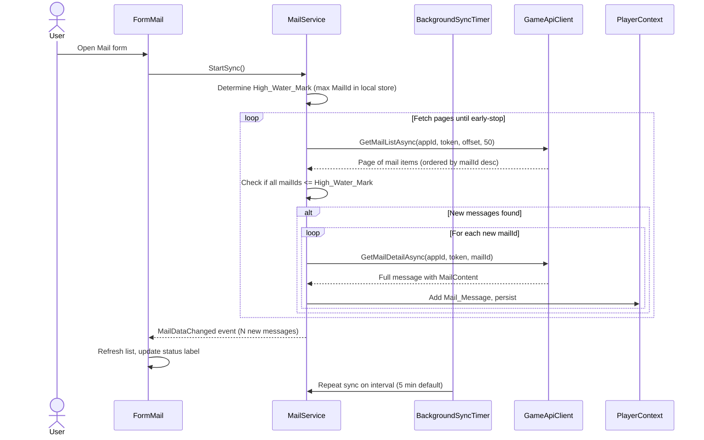
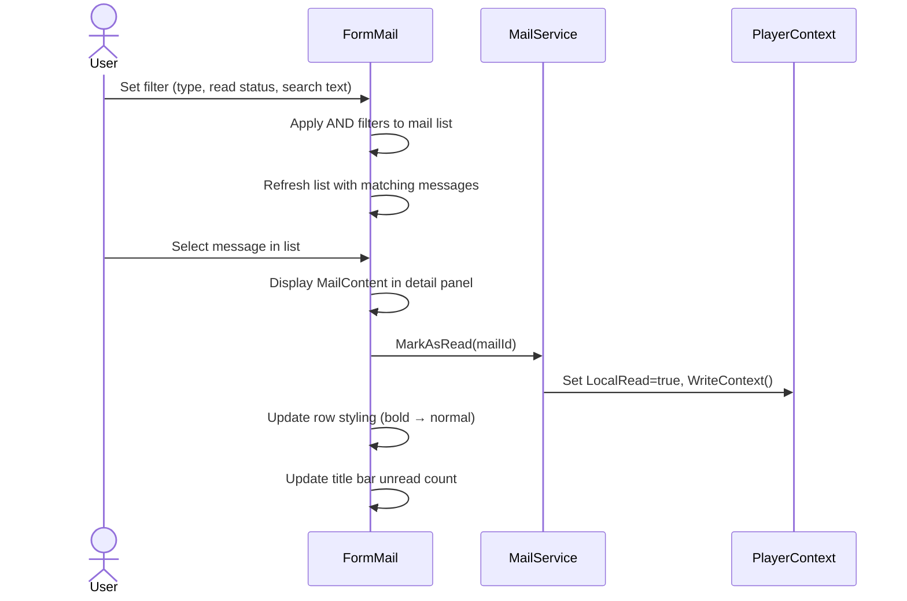

# Requirements Document

## Introduction

In-game mail provides players with a local, searchable archive of all messages received in the Outer Empires 2 game. The system synchronizes mail from the game API incrementally in the background (using mailId as a monotonically increasing high-water mark), stores messages locally with full content, and presents them in a list/detail MDI child form with filtering, search, and local read-status tracking. This follows the same architecture pattern as banking transactions: POCO model, static service class, PlayerContext persistence, and WinForms MDI child form.

## Glossary

- **Mail_Message**: A single mail message received by the player, containing sender, recipient, timestamp, subject, body content, mail type, and read status.
- **Mail_Service**: The static service class responsible for synchronizing, persisting, and querying mail messages.
- **FormMail**: The MDI child form that displays the mail list and selected message detail.
- **Mail_Type**: A string classifier for mail messages: null (player/system general), "C" (colony notifications), "R" (research notifications), "S" (skill training notifications).
- **High_Water_Mark**: The highest mailId stored locally, used to determine where incremental sync should stop.
- **PlayerContext**: The singleton service that manages player data persistence and in-memory collections.
- **Game_API**: The Outer Empires 2 public REST API that provides mail data via GET /v1/mail and GET /v1/mail/{mailId} endpoints.
- **GameApiClient**: The existing HTTP client class with GetMailListAsync and GetMailDetailAsync methods.
- **Background_Sync_Timer**: A System.Threading.Timer that triggers periodic incremental mail synchronization without blocking the UI thread.

## Requirements

### Requirement 1: Mail Message Data Model

**User Story:** As a player, I want mail messages stored locally with full content, so that I can read and search my mail history without repeated API calls.

#### Acceptance Criteria

1. THE Mail_Message SHALL have fields: MailId (int), CharacterIdFrom (int), FromName (string), CharacterIdTo (int), ToName (string), SentTime (string, ISO 8601 as received from the game API), Subject (string), MailRead (bool), MailType (string, nullable), and MailContent (string).
2. THE Mail_Message SHALL use int type for MailId, serving as the unique identifier provided by the game API.
3. THE Mail_Message SHALL use string type for FromName and ToName, defaulting to string.Empty when the API returns a whitespace-only or empty value.
4. THE Mail_Message SHALL use string type for MailContent to store the full message body, defaulting to string.Empty when no content has been fetched.
5. THE Mail_Message SHALL use nullable string type for MailType to preserve the API distinction between null (general messages) and typed notifications ("C", "R", "S").
6. THE Mail_Message SHALL include a LocalRead (bool) field, defaulting to false, to track whether the user has read the message in the tracker (independent of the API mailRead field).

### Requirement 2: Mail Message Persistence

**User Story:** As a player, I want my mail messages saved to my player data file, so that they survive application restarts.

#### Acceptance Criteria

1. THE PlayerContext SHALL persist Mail_Message records in the player data JSON file as a "MailMessage" array within the PlayerRoot object.
2. THE PlayerContext SHALL expose a MailMessageList property typed as IReadOnlyList<Mail_Message> for read access.
3. WHEN the player data file is loaded during initialization, THE PlayerContext SHALL deduplicate Mail_Message records by MailId, retaining the first occurrence and logging an error for each discarded duplicate.
4. WHEN a new Mail_Message is added and its MailId already exists in the in-memory list, THEN THE PlayerContext SHALL skip the duplicate without throwing an exception, logging a warning.
5. WHEN a new Mail_Message is added with a unique MailId, THE PlayerContext SHALL append it to the in-memory list and persist via WriteContext.

### Requirement 3: Incremental Background Mail Sync

**User Story:** As a player, I want my mail to sync automatically in the background, so that new messages appear without manual intervention.

#### Acceptance Criteria

1. WHEN the FormMail is opened, THE Mail_Service SHALL perform an initial incremental sync immediately.
2. WHILE the FormMail is open, THE Background_Sync_Timer SHALL trigger an incremental sync at a configurable interval (default: 5 minutes).
3. WHEN an incremental sync executes, THE Mail_Service SHALL call the Game_API list endpoint (GET /v1/mail) starting at offset 0 with a page size of 50, fetching pages until all returned mailIds are less than or equal to the local High_Water_Mark (early-stop condition).
4. WHEN the Mail_Service encounters a page where all mailIds already exist locally, THE Mail_Service SHALL stop fetching additional pages.
5. WHEN a new mailId is discovered in the list response, THE Mail_Service SHALL call the Game_API detail endpoint (GET /v1/mail/{mailId}) to fetch the full MailContent for that message.
6. THE Mail_Service SHALL map the Game_API response fields to the local Mail_Message model: mailId to MailId, characterIdFrom to CharacterIdFrom, fromName to FromName, characterIdTo to CharacterIdTo, toName to ToName, sentTime to SentTime, subject to Subject, mailRead to MailRead, mailType to MailType, mailContent to MailContent.
7. WHEN an incremental sync completes with new messages, THE Mail_Service SHALL fire a MailDataChanged event to notify the form to refresh.
8. THE Background_Sync_Timer SHALL execute on a background thread and not block the UI thread.
9. IF the Game_API returns an error (HTTP 401, 403, 429, or network failure) during sync, THEN THE Mail_Service SHALL log the error at Error level and retry on the next timer interval without discarding previously synced messages.
10. WHEN the FormMail is closed, THE Background_Sync_Timer SHALL be stopped and disposed.
11. THE Mail_Service SHALL use the FromName from the detail endpoint response (which provides the actual name, e.g. "System") rather than the list endpoint response (which may return whitespace for system messages).

### Requirement 4: Mail List Display

**User Story:** As a player, I want to see my mail in a list/detail layout, so that I can browse messages and read their content.

#### Acceptance Criteria

1. THE FormMail SHALL be an MDI child form accessible from the main menu.
2. THE FormMail SHALL display a split layout with a mail list panel on the left and a message detail panel on the right.
3. THE mail list panel SHALL display columns: From (sender name), Subject, Date (formatted as "yyyy-MM-dd HH:mm" in local time), and a read/unread visual indicator.
4. WHEN messages exist, THE FormMail SHALL display them sorted by SentTime descending (newest first) as the default sort order.
5. WHEN the user selects a message in the mail list, THE FormMail SHALL display the full MailContent in the detail panel.
6. WHEN a message has LocalRead set to false, THE mail list panel SHALL display the message row with bold text to indicate it is unread.
7. WHEN the user selects an unread message, THE Mail_Service SHALL set LocalRead to true for that message and persist via WriteContext.
8. WHEN no messages exist, THE FormMail SHALL display an empty list with column headers visible and the detail panel showing placeholder text (e.g., "No messages"); WHEN messages exist but none is selected, THE detail panel SHALL remain empty (no placeholder).
9. THE FormMail SHALL display a message count label showing the number of messages matching the current filter criteria (format: "N messages").

### Requirement 5: Mail Filtering and Search

**User Story:** As a player, I want to filter and search my mail, so that I can find specific messages quickly.

#### Acceptance Criteria

1. THE FormMail SHALL provide a read-status filter dropdown with options: "All", "Unread", "Read", with "All" selected by default.
2. THE FormMail SHALL provide a mail-type filter dropdown with options: "All", "Player/System", "Colony", "Research", "Skill", with "All" selected by default.
3. THE FormMail SHALL provide a search text box that filters messages by matching the search term against FromName, Subject, or MailContent (case-insensitive substring match); a message matches if the term appears in any one of these fields (OR logic).
4. WHEN the user applies filters, THE FormMail SHALL combine the read-status filter, mail-type filter, and search text using AND logic, displaying only messages that satisfy all active filter conditions.
5. WHEN any filter value changes, THE FormMail SHALL refresh the mail list within 500 milliseconds for up to 5,000 messages.
6. THE mail-type filter SHALL map dropdown values to MailType field values: "Player/System" maps to null MailType, "Colony" maps to "C", "Research" maps to "R", "Skill" maps to "S".

### Requirement 6: Local Read Status Tracking

**User Story:** As a player, I want to track which messages I have read locally, so that I can identify new messages at a glance regardless of the game API's read status.

#### Acceptance Criteria

1. THE Mail_Message SHALL maintain a LocalRead boolean field that is independent of the MailRead field received from the Game_API.
2. WHEN a new Mail_Message is synced from the API, THE Mail_Service SHALL set LocalRead to false regardless of the API MailRead value.
3. WHEN the user selects a message in the FormMail list, THE Mail_Service SHALL set LocalRead to true and persist the change via WriteContext.
4. THE FormMail SHALL display unread messages (LocalRead = false) with bold text in the list panel.
5. THE FormMail SHALL display the count of unread messages in the form title bar (format: "Mail (N unread)" when N > 0, or "Mail" when all messages are read).

### Requirement 7: Sync Configuration

**User Story:** As a player, I want to configure how often my mail syncs, so that I can balance API usage with freshness.

#### Acceptance Criteria

1. THE Mail_Service SHALL read the sync interval from the player preferences (default: 5 minutes, minimum: 1 minute, maximum: 60 minutes).
2. WHEN the sync interval preference changes, THE Background_Sync_Timer SHALL apply the new interval on the next timer tick without requiring a form restart.
3. THE FormMail SHALL display the last successful sync timestamp in the status area (format: "Last sync: yyyy-MM-dd HH:mm" in local time, or "Never" if no sync has completed).

### Requirement 8: Error and Edge Case Handling

**User Story:** As a player, I want clear feedback when sync fails or data is unavailable, so that I understand the system state.

#### Acceptance Criteria

1. IF the Game_API returns HTTP 401 or 403 during sync, THEN THE Mail_Service SHALL log "Authentication failed for mail sync" at Error level and stop the current sync cycle (retry on next interval).
2. IF the Game_API returns HTTP 429 (rate limited) during sync, THEN THE Mail_Service SHALL log "Rate limited during mail sync" at Warning level and stop the current sync cycle (retry on next interval).
3. IF the detail endpoint for a specific mailId fails, THEN THE Mail_Service SHALL log the error, store the Mail_Message with an empty MailContent, and continue syncing the remaining messages.
4. IF the player data file contains Mail_Message records with missing or null SentTime, THEN THE Mail_Service SHALL assign a sort value of epoch (1970-01-01T00:00:00) for ordering purposes, and THE FormMail SHALL display "(no date)" in the Date column.
5. WHEN a sync is in progress, THE FormMail SHALL display a visual indicator (status label text "Syncing...") to inform the user.
6. WHEN a sync completes, THE FormMail SHALL update the status to show the result (e.g., "Synced: 5 new messages" or "Sync complete: up to date").

## Out of Scope

- Sending or replying to mail (read-only view of received messages)
- Deleting mail messages (neither locally nor via the API)
- Real-time push notifications of new mail (timer-based polling only)
- Multi-character mail aggregation (each player profile tracks its own mail)
- Mail message editing or annotation
- Attachment handling (the API does not expose attachments)
- Mail archiving or folder organization

## User Interaction Flows

### Background Mail Sync

### Filter and Read Mail

