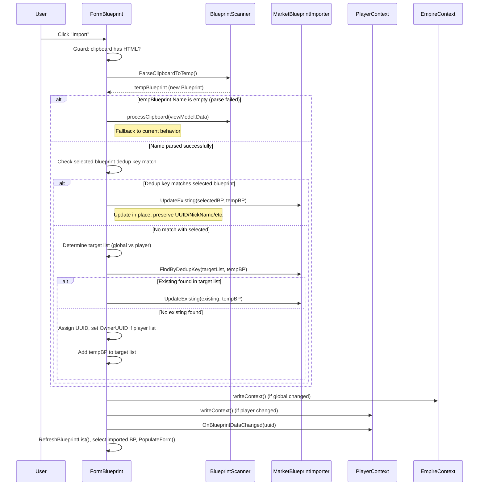

# Design Document: Individual Import Dedup

## Overview

The individual blueprint clipboard import (`cmdImport_Click` in `FormBlueprint`) currently writes parsed HTML directly into whichever blueprint the user has selected. This is error-prone — the clipboard data may belong to a different blueprint entirely. This design introduces a dedup layer that mirrors the existing `MarketBlueprintImporter` pattern: parse into a temporary object first, check the selected blueprint, then search the appropriate list by dedup key, and either update the matched blueprint or create a new one.

The change is scoped to three areas:
1. **BlueprintScanner** — add a `ParseClipboardToTemp` method that parses into a fresh temporary `Blueprint` instead of mutating an existing one (mirrors `ColonyParser.ParseClipboardToTemp`).
2. **MarketBlueprintImporter** — change `FindByDedupKey` and `UpdateExisting` from `private` to `internal` so the individual import handler can reuse them.
3. **FormBlueprint.cmdImport_Click** — replace the current "parse into viewModel.Data" flow with parse → check selected → route via market logic → persist → refresh UI.

No new models or services are introduced. The existing `MarketBlueprintImporter.FindByDedupKey` dedup logic and `UpdateExisting` merge logic are reused directly.

## Architecture



## Components and Interfaces

### BlueprintScanner — New Method

```csharp
/// <summary>
/// Parses clipboard HTML into a new temporary Blueprint object without mutating any existing blueprint.
/// Returns null if the clipboard does not contain HTML.
/// </summary>
public Models.Blueprint ParseClipboardToTemp()
```

This method:
- Checks `Clipboard.ContainsText(TextDataFormat.Html)` — returns null if no HTML.
- Reads HTML from the clipboard (same as `processClipboard`).
- Creates a new `Blueprint()` instance.
- Calls `ProcessHtml(tempBlueprint, html)` on it.
- Returns the populated temporary blueprint.

This mirrors the `ColonyParser.ParseClipboardToTemp(EmpireContext)` pattern exactly. The blueprint version is simpler because `ProcessHtml` doesn't need an `EmpireContext` parameter (it calls `EmpireContext.getInstance()` internally for icon resolution).

### MarketBlueprintImporter — Visibility Changes

Two existing private methods become internal:

```csharp
// Was: private static Models.Blueprint FindByDedupKey(...)
internal static Models.Blueprint FindByDedupKey(
    BindingList<Models.Blueprint> list,
    Models.Blueprint bp)

// Was: private static void UpdateExisting(...)
internal static void UpdateExisting(
    Models.Blueprint existing,
    Models.Blueprint incoming)
```

No logic changes — only the access modifier changes from `private` to `internal`. This allows `FormBlueprint.cmdImport_Click` to call the same dedup and merge logic that the market importer uses.

### FormBlueprint.cmdImport_Click — Rewritten Handler

The handler is rewritten to follow this flow:

1. **Guard**: no HTML on clipboard → show MessageBox, return. (Existing behavior, unchanged.)
2. **Parse**: call `scanner.ParseClipboardToTemp()` → `tempBP`.
3. **Fallback guard**: if `tempBP` is null or `tempBP.Name` is empty → fall back to current behavior (`scanner.processClipboard(viewModel.Data)` + `PopulateForm()`).
4. **Check selected blueprint first**: if `viewModel.Data` has a UUID and its dedup key matches `tempBP` → call `MarketBlueprintImporter.UpdateExisting(viewModel.Data, tempBP)`. The imported blueprint is `viewModel.Data`. Determine persistence target from whether `viewModel.Data` is in the global or player list.
5. **Route via market logic**: determine target list:
   - Evolution == 0 → global list.
   - Evolution != 0 and current player selected → player list.
   - Evolution != 0 and no current player → global list.
6. **Search target list**: call `MarketBlueprintImporter.FindByDedupKey(targetList, tempBP)`.
7. **If match found**: call `MarketBlueprintImporter.UpdateExisting(existing, tempBP)`. The imported blueprint is `existing`.
8. **If no match**: assign `tempBP.UUID = Guid.NewGuid().ToString()`. If player list, set `tempBP.OwnerUUID = playerContext.CurrentPlayerUUID`. Add `tempBP` to `targetList`. The imported blueprint is `tempBP`.
9. **Persist**: call `empireContext.writeContext()` if global list was modified, or `playerContext.writeContext()` if player list was modified.
10. **Notify**: call `playerContext.OnBlueprintDataChanged(importedBP.UUID)`.
11. **Refresh UI**: call `RefreshBlueprintList()`. Select the imported blueprint in the list view by UUID. Set `viewModel` to wrap the imported blueprint and call `PopulateForm()`.

### Routing Logic — Shared with Market Importer

The routing decision (global vs player) uses the same rules as `MarketBlueprintImporter.Import`:

| Condition | Target List |
|---|---|
| Evolution == 0 | Global |
| Evolution != 0, current player selected | Player |
| Evolution != 0, no current player | Global |

The market importer also routes "Government" seller blueprints to global, but individual imports have no seller concept, so that branch doesn't apply. The evolution-based routing is sufficient.

## Data Models

No new models are introduced. The existing models are used as-is:

- **Blueprint** — `UUID`, `OwnerUUID`, `Name`, `BluePrintType`, `Evolution`, `Class`, `TechLevel`, `NickName`, `CopyCost`, `baseBlueprintUUID`, `Description`, `Properties` (PropertyBag), `Resources` (Dictionary<string, string>)
- **PropertyBag** — key-value store for blueprint statistics
- **BindingList\<Blueprint\>** — the collection type used by both `globalBlueprintList` and `blueprintList`

The temporary blueprint created during import is a standard `Blueprint` instance. After the search-and-merge decision, it is either discarded (update path) or added to the target list (create path).

### Dedup Key Definition

The dedup key is the composite of five fields, all compared with exact case-sensitive matching:
- `Name` (string, `StringComparison.Ordinal`)
- `Evolution` (int, `==`)
- `BluePrintType` (string, `StringComparison.Ordinal`)
- `Class` (int, `==`)
- `TechLevel` (string, `StringComparison.Ordinal`)

This is the same key used by `MarketBlueprintImporter.FindByDedupKey`.


## Correctness Properties

*A property is a characteristic or behavior that should hold true across all valid executions of a system — essentially, a formal statement about what the system should do. Properties serve as the bridge between human-readable specifications and machine-verifiable correctness guarantees.*

### Property 1: UpdateExisting overwrites data while preserving protected fields

*For any* existing blueprint with arbitrary UUID, OwnerUUID, NickName, CopyCost, and baseBlueprintUUID, and *for any* incoming blueprint with arbitrary Properties and Resources, after calling `UpdateExisting(existing, incoming)`:
- `existing.Properties` shall contain all non-protected keys from `incoming.Properties`
- `existing.Resources` shall equal `incoming.Resources`
- `existing.UUID` shall be unchanged from its original value
- `existing.OwnerUUID` shall be unchanged from its original value
- `existing.NickName` shall be unchanged from its original value
- `existing.CopyCost` shall be unchanged from its original value
- Protected property keys ("Manufacture Run Time", "Power Required") that existed on the original shall be preserved if not present in incoming

**Validates: Requirements 2.1, 2.2**

### Property 2: Routing logic is determined by Evolution and player presence

*For any* blueprint Evolution value and *for any* player-selected state (true/false):
- If Evolution == 0, the target shall be the global list regardless of player state
- If Evolution != 0 and a player is selected, the target shall be the player list
- If Evolution != 0 and no player is selected, the target shall be the global list

**Validates: Requirements 3.1, 3.2, 3.3**

### Property 3: FindByDedupKey returns the correct match or null

*For any* `BindingList<Blueprint>` and *for any* search blueprint, `FindByDedupKey` shall return a blueprint from the list whose Name, Evolution, BluePrintType, Class, and TechLevel all match the search blueprint exactly (case-sensitive for strings), or null if no such blueprint exists.

**Validates: Requirements 4.2**

### Property 4: Create path produces a valid blueprint with correct ownership

*For any* temporary blueprint and *for any* owner UUID string, when creating a new blueprint for insertion:
- The blueprint's UUID shall be non-null and non-empty
- If routed to the player list, the blueprint's OwnerUUID shall equal the given owner UUID
- The blueprint's Name, Evolution, BluePrintType, Class, TechLevel, Properties, and Resources shall match the temporary blueprint's values

**Validates: Requirements 3.5, 3.6**

## Error Handling

| Scenario | Handling |
|---|---|
| Clipboard has no HTML | Show `MessageBox` with informational message. No state changes. (Existing behavior, unchanged.) |
| `ParseClipboardToTemp` returns null | Same as no HTML — should not happen if the HTML guard passed, but handled defensively. |
| Parsed blueprint has empty Name | Fall back to current behavior: call `scanner.processClipboard(viewModel.Data)` + `PopulateForm()`. Log a warning. |
| Parsed blueprint has no BluePrintType and no Properties | Proceed with import normally. The dedup key will match on whatever fields were parsed (Name, Evolution, Class, TechLevel may still be populated). |
| `FindByDedupKey` returns null on target list | Create path: assign UUID, set OwnerUUID if player list, add to target list. |
| Exception during HTML parsing | Caught inside `BlueprintScanner.ProcessHtml` (existing behavior). The temp blueprint will have whatever fields were populated before the error. Import proceeds with partial data. |

## Testing Strategy

### Unit Tests (NUnit)

Unit tests cover specific examples and edge cases:

- **FindByDedupKey with exact match** — verify returns the correct blueprint from a list of several.
- **FindByDedupKey with no match** — verify returns null.
- **FindByDedupKey with null list** — verify returns null.
- **FindByDedupKey with partial key mismatch** — e.g., same Name but different Evolution → null.
- **UpdateExisting preserves NickName** — specific example with known values.
- **UpdateExisting preserves protected properties** — "Manufacture Run Time" on existing is kept when incoming lacks it.
- **UpdateExisting overwrites non-protected properties** — incoming property replaces existing.
- **Routing: Evolution 0 → global** — specific example.
- **Routing: Evolution 5, player selected → player** — specific example.
- **Routing: Evolution 5, no player → global** — specific example.
- **Edge case: parsed blueprint with empty BluePrintType** — dedup key still works (matches on empty string).

### Property-Based Tests (FsCheck 2.16.6 + FsCheck.NUnit)

Each correctness property is implemented as a single property-based test with minimum 100 iterations. Tests use `[FsCheck.NUnit.Property(MaxTest = 100)]`.

- **Property 1 test**: Generate random existing blueprint (with UUID, OwnerUUID, NickName, CopyCost, Properties including protected keys) and random incoming blueprint (with Properties and Resources). Call `UpdateExisting`. Assert data fields overwritten, protected fields preserved.
  - Tag: `Feature: individual-import-dedup, Property 1: UpdateExisting overwrites data while preserving protected fields`

- **Property 2 test**: Generate random Evolution values (int) and random player-selected booleans. Apply the routing function. Assert the target matches the expected rule (evo 0 → global, evo != 0 + player → player, evo != 0 + no player → global).
  - Tag: `Feature: individual-import-dedup, Property 2: Routing logic is determined by Evolution and player presence`

- **Property 3 test**: Generate random `BindingList<Blueprint>` and a random search blueprint. Call `FindByDedupKey`. Assert: if result is non-null, all five key fields match; if result is null, no blueprint in the list has all five fields matching.
  - Tag: `Feature: individual-import-dedup, Property 3: FindByDedupKey returns the correct match or null`

- **Property 4 test**: Generate random temporary blueprint and random owner UUID string. Simulate the create path (assign UUID, set OwnerUUID). Assert UUID is non-empty, OwnerUUID matches, and all data fields match the temp blueprint.
  - Tag: `Feature: individual-import-dedup, Property 4: Create path produces a valid blueprint with correct ownership`

### Testability Notes

To make Property 2 testable without WinForms dependencies, the routing decision should be extracted as a pure static method. This can live in `MarketBlueprintImporter` or as a local helper in `FormBlueprint`:

```csharp
/// <summary>
/// Determines whether a blueprint should be stored in the global or player list.
/// Returns true for global, false for player.
/// </summary>
internal static bool IsGlobalRoute(int evolution, bool hasCurrentPlayer)
{
    return evolution == 0 || !hasCurrentPlayer;
}
```

This keeps the routing logic testable independently of the UI.

### Test Configuration

- Property-based testing library: **FsCheck 2.16.6** with **FsCheck.NUnit** adapter
- Each property test: `[FsCheck.NUnit.Property(MaxTest = 100)]`
- Each property test includes a comment referencing the design property number and title
- Build: MSBuild at `"D:\Program Files\Microsoft Visual Studio\18\Community\MSBuild\Current\Bin\MSBuild.exe"`
- Run: vstest.console at `"D:\Program Files\Microsoft Visual Studio\18\Community\Common7\IDE\CommonExtensions\Microsoft\TestWindow\vstest.console.exe"` against `OE2EmpireTracker.Tests/bin/Debug/OE2EmpireTracker.Tests.dll`
- New `.cs` files require `<Compile Include="...">` entries in the old-style `.csproj`
