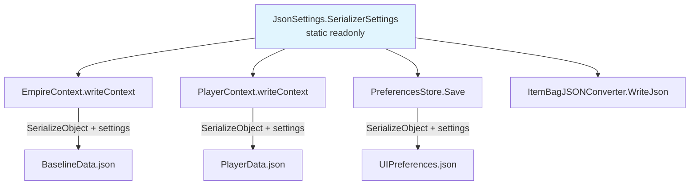

# Design Document: JSON Default-Value Skipping

## Overview

This feature configures Newtonsoft.Json serialization across all three write sites to skip fields holding default values (`null`, `0`, `false`, `""`, etc.) using `DefaultValueHandling.Ignore` and `NullValueHandling.Ignore`. The goal is to reduce JSON file sizes without data loss, relying on the fact that constructors and field initializers already restore omitted fields to their correct defaults on deserialization.

The change is write-only: deserialization call sites remain untouched and permissive, so both old (verbose) and new (compact) JSON files load identically.

### Key Design Decisions

1. **Shared static settings object** — A single `JsonSerializerSettings` instance lives on a new small static helper class (`JsonSettings`) in the `Services` namespace. All three write sites reference it. This avoids duplication and ensures consistency.

2. **Write-only change** — Only `SerializeObject` calls are updated. `DeserializeObject` calls keep their current behavior (no settings, fully permissive). This guarantees backward compatibility with existing save files.

3. **Custom converter passthrough** — `ItemBagJSONConverter.WriteJson` currently calls `JsonConvert.SerializeObject(entry.Value, Formatting.Indented)` without settings. This must be updated to pass the shared settings so nested `Item` objects also skip defaults. `PropertyBagJSONConverter` and `LockTrackingJsonConverter` write JSON manually via `JsonWriter` and are unaffected by `DefaultValueHandling`.

## Architecture



The `JsonSettings` class is a minimal static holder:

```csharp
namespace OE2EmpireTracker.Services
{
    public static class JsonSettings
    {
        public static readonly JsonSerializerSettings SerializerSettings = new JsonSerializerSettings
        {
            Formatting = Formatting.Indented,
            DefaultValueHandling = DefaultValueHandling.Ignore,
            NullValueHandling = NullValueHandling.Ignore
        };
    }
}
```

### Write Site Changes

Each write site changes from:
```csharp
JsonConvert.SerializeObject(obj, Formatting.Indented)
```
to:
```csharp
JsonConvert.SerializeObject(obj, JsonSettings.SerializerSettings)
```

Affected methods:
- `EmpireContext.writeContext()` — serializes `BaselineRoot`
- `PlayerContext.writeContext()` — serializes `PlayerRoot`
- `PreferencesStore.Save()` — serializes `UIPreferences`
- `ItemBagJSONConverter.WriteJson()` — serializes nested `Item` objects

### Deserialization (No Change)

The following call sites remain unchanged:
- `PlayerContext` constructor — `JsonConvert.DeserializeObject<PlayerRoot>(jsonContent)`
- `EmpireContext` constructor — `JsonConvert.DeserializeObject<BaselineRoot>(jsonContent)`
- `PreferencesStore.Load()` — `JsonConvert.DeserializeObject<UIPreferences>(json)`

## Components and Interfaces

### New: `JsonSettings` (static class)

**Location:** `OE2EmpireTracker/Services/JsonSettings.cs`

| Member | Type | Description |
|--------|------|-------------|
| `SerializerSettings` | `static readonly JsonSerializerSettings` | Shared settings with `Formatting.Indented`, `DefaultValueHandling.Ignore`, `NullValueHandling.Ignore` |

### Modified: `EmpireContext.writeContext()`

Replace `JsonConvert.SerializeObject(baselineRoot, Formatting.Indented)` with `JsonConvert.SerializeObject(baselineRoot, JsonSettings.SerializerSettings)`.

### Modified: `PlayerContext.writeContext()`

Replace `JsonConvert.SerializeObject(playerRoot, Formatting.Indented)` with `JsonConvert.SerializeObject(playerRoot, JsonSettings.SerializerSettings)`.

### Modified: `PreferencesStore.Save()`

Replace `JsonConvert.SerializeObject(_preferences, Formatting.Indented)` with `JsonConvert.SerializeObject(_preferences, JsonSettings.SerializerSettings)`.

### Modified: `ItemBagJSONConverter.WriteJson()`

Replace `JsonConvert.SerializeObject(entry.Value, Formatting.Indented)` with `JsonConvert.SerializeObject(entry.Value, JsonSettings.SerializerSettings)` so that nested `Item` objects within an `ItemBag` also skip default-valued fields.

### Unaffected Custom Converters

- `PropertyBagJSONConverter` — writes key/value pairs manually via `JsonWriter.WritePropertyName` / `WriteValue`. `DefaultValueHandling` does not apply to manual writes. No change needed.
- `LockTrackingJsonConverter` — same pattern, manual `JsonWriter` calls. No change needed.

## Data Models

No model classes are added or modified. The existing models already initialize fields to sensible defaults via constructors and field initializers, which is what makes default-skipping safe:

### Fields That Will Be Omitted When Default

| Model | Field | Default | Initializer |
|-------|-------|---------|-------------|
| `ColonyStructure` | `ManufacturingCompleted` | `0` | field initializer |
| `ColonyStructure` | `ManufacturingQuantity` | `0` | field initializer |
| `ColonyStructure` | `StagingResources` | `false` | field initializer |
| `ColonyStructure` | `MiningLeftOvers` | `0m` | field initializer |
| `ColonyStructure` | `displaySequence` | `0` | field initializer |
| `ColonyStructure` | `buildingID` | `0` | field initializer |
| `ColonyStructure` | `buildQueueSequence` | `0` | field initializer |
| `ColonyStructure` | `ContentmentIndex` | `0` | default |
| `ColonyStructure` | `WageLevel` | `0` | default |
| `ColonyStructure` | `CurrentAttitude` | `""` | field initializer |
| `ColonyStructure` | Various nullable refs | `null` | field initializer |
| `Item` | `Quantity` | `0` | field initializer |
| `Item` | `Volume` | `0.0` | field initializer |
| `Item` | `BaseItemTypeID` | `""` | field initializer |
| `Item` | `NickName` | `""` | field initializer |
| `Item` | `Description` | `""` | field initializer |
| `Item` | `ResourcePurity` | `""` | field initializer |
| `Blueprint` | `Evolution` | `0` | default |
| `Blueprint` | `Class` | `0` | default |
| `Blueprint` | `CopyCost` | `0` | default |
| `Blueprint` | `OwnerUUID` | `""` | field initializer |
| `DeliveryItem` | `Delivered` | `false` | field initializer |
| `DeliveryItem` | `Quantity` | `0` | field initializer |
| `DeliveryPlanStop` | `StopCompleted` | `false` | field initializer |
| `DeliveryPlan` | `Completed` | `false` | field initializer |
| `PlayerProfile` | `TotalCredits` | `0` | field initializer |
| `PlayerProfile` | `SkillPoints` | `0` | field initializer |
| `UIPreferences` | `MainWindow` | `null` | default |
| `WindowPosition` | `Left/Top/Width/Height` | `0` | default |
| `CountDownTime` | `RepeatIntervalSeconds` | `0` | default |

All of these are restored to the correct value by constructors or C# default initialization when the field is absent from JSON.


## Correctness Properties

*A property is a characteristic or behavior that should hold true across all valid executions of a system — essentially, a formal statement about what the system should do. Properties serve as the bridge between human-readable specifications and machine-verifiable correctness guarantees.*

### Property 1: PlayerRoot serialization round-trip

*For any* valid `PlayerRoot` object (containing player profiles, blueprints, surveys, colonies with structures and item bags, delivery routes, and delivery plans), serializing with the shared `SerializerSettings` and then deserializing the resulting JSON should produce an object where every non-default field matches the original value, and every omitted field is restored to its correct default.

**Validates: Requirements 5.1, 5.3, 5.4, 2.2, 3.1**

### Property 2: BaselineRoot serialization round-trip

*For any* valid `BaselineRoot` object (containing blueprint types, ship classes, tech levels, and global blueprints), serializing with the shared `SerializerSettings` and then deserializing should produce an object where every non-default field matches the original and omitted fields are restored to defaults.

**Validates: Requirements 5.2, 2.1, 3.2**

### Property 3: UIPreferences serialization round-trip

*For any* valid `UIPreferences` object (containing window positions and form control state dictionaries), serializing with the shared `SerializerSettings` and then deserializing should produce an equivalent object.

**Validates: Requirements 5.5, 2.3, 3.3**

### Property 4: ItemBag custom converter round-trip

*For any* valid `ItemBag` containing items with a mix of default and non-default field values, serializing with the shared `SerializerSettings` (which flows through `ItemBagJSONConverter.WriteJson`) and then deserializing should produce an `ItemBag` with the same items and equivalent field values.

**Validates: Requirements 4.1, 4.3**

### Property 5: PropertyBag custom converter round-trip

*For any* valid `PropertyBag` containing string key-value pairs, serializing with the shared `SerializerSettings` and then deserializing should produce a `PropertyBag` with identical key-value entries.

**Validates: Requirements 4.2**

### Property 6: Compact serialization is never larger than verbose

*For any* valid serializable root object (`PlayerRoot` or `BaselineRoot`), the JSON string produced by `SerializeObject` with the shared `SerializerSettings` should have a length less than or equal to the JSON string produced by `SerializeObject` with only `Formatting.Indented` (no default-skipping).

**Validates: Requirements 6.1, 6.2**

## Error Handling

This feature introduces no new error paths. The change is purely in serialization settings passed to existing `JsonConvert.SerializeObject` calls. If serialization or deserialization fails, the existing error handling in each context class (try/catch in `PreferencesStore`, logging in `PlayerContext`/`EmpireContext`) remains in effect.

Potential edge cases:
- **Existing files with explicit defaults**: Deserialization is unchanged and permissive, so old files with verbose JSON load identically.
- **Empty collections**: `DefaultValueHandling.Ignore` does not skip empty lists/dictionaries (only null). Collections initialized in constructors will serialize as `[]` or `{}` and round-trip correctly.
- **Custom converters**: `PropertyBagJSONConverter` and `LockTrackingJsonConverter` write via `JsonWriter` directly, so `DefaultValueHandling` has no effect on their output. `ItemBagJSONConverter` calls `SerializeObject` for nested items and must pass the shared settings.

## Testing Strategy

### Property-Based Tests (FsCheck + NUnit)

The test project already has `FsCheck 2.16.6` and `FsCheck.NUnit` installed. Each correctness property maps to a single FsCheck property test with a minimum of 100 iterations.

**Test file:** `OE2EmpireTracker.Tests/Services/JsonDefaultSkipTests.cs`

FsCheck `Arbitrary` generators will be needed for:
- `Colony` (with `ColonyStructure`, `ItemBag`, `PropertyBag`, `LockTracking`)
- `Blueprint` (extends `Item`, has `PropertyBag`, `Resources`)
- `DeliveryPlan` / `DeliveryRoute`
- `PlayerProfile` (with `PlayerSkill` dictionary)
- `UIPreferences` (with nested `WindowState`, `FormControlState`)
- `PlayerRoot` / `BaselineRoot` (composite)

Each property test must be tagged with a comment referencing the design property:
```
// Feature: json-default-skip, Property 1: PlayerRoot serialization round-trip
```

**Configuration:** `MaxNbOfTest = 100` (minimum) per property.

### Unit Tests

Unit tests complement property tests for specific examples and edge cases:

1. **Settings configuration** — Verify `JsonSettings.SerializerSettings` has `DefaultValueHandling.Ignore`, `NullValueHandling.Ignore`, and `Formatting.Indented` (Requirements 1.1–1.4)
2. **Custom converter passthrough** — Verify `ItemBagJSONConverter` output omits default-valued fields on nested `Item` objects (Requirement 4.3)
3. **File size reduction on real data** — Serialize the test fixture `PlayerData.json` and `BaselineData.json` with old vs new settings and assert the new output is smaller (Requirements 6.1, 6.2)
4. **Backward compatibility** — Deserialize a JSON string containing explicit default values and verify it loads identically to one without them (Requirement 3.4)

### Test Organization

| Test Type | Count | Location |
|-----------|-------|----------|
| Property tests (FsCheck) | 6 | `JsonDefaultSkipTests.cs` |
| Unit tests | ~4–6 | `JsonDefaultSkipTests.cs` |

All tests live in a single test file under `Services/` since the feature is a cross-cutting serialization concern rooted in the service layer.
