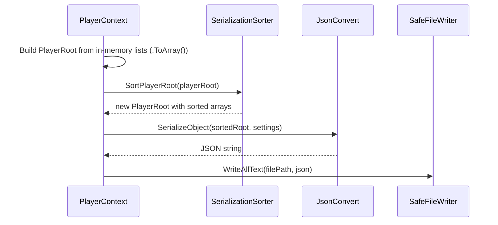

# Design Document: JSON Deterministic Order

## Overview

This feature introduces deterministic ordering of all entity arrays and dictionary entries at JSON serialization time, so that git diffs of `PlayerData.json` and `BaselineData.json` reflect only actual data changes rather than spurious reorderings.

The approach is to create a static helper class `SerializationSorter` that accepts a root object (PlayerRoot or BaselineRoot) and returns a **new root object** whose arrays and dictionaries are sorted copies. The original in-memory lists remain untouched. The `WriteContext()` methods in `PlayerContext` and `EmpireContext` call this helper after constructing the root object and before passing it to `JsonConvert.SerializeObject`.

For dictionaries (`Dictionary<string, T>`), a custom `ContractResolver` replaces the default dictionary serialization with sorted-key iteration. For `ItemBag` (which has a custom `JsonConverter`), the existing `ItemBagJSONConverter.WriteJson` is modified to iterate keys in sorted order.

## Architecture

### High-Level Flow



The same flow applies to `EmpireContext` with `SortBaselineRoot`.

### Design Decisions

1. **New root object with sorted copies** (not in-place sort): `WriteContext()` already creates a new `PlayerRoot` and copies arrays via `.ToArray()`. The sorter creates a second root with sorted copies of those arrays. This guarantees the original in-memory lists are never reordered, satisfying Requirement 13. The memory cost is negligible — we are creating shallow copies of reference-type arrays that are already being created by `.ToArray()`.

2. **Static helper class** (`SerializationSorter`): Keeps sorting logic centralized and testable in isolation. No changes to model classes. No inheritance or interface changes.

3. **Custom ContractResolver for dictionaries**: A `SortedDictionaryContractResolver` that wraps dictionary values in a `SortedDictionary` during serialization. This handles all `Dictionary<string, T>` properties (PricingPlan.ResourcePrices, Survey.Properties, Survey.Resources, Blueprint.Resources, Commodity.ConstructionResources, PlayerProfile.Skills, Station.Holds) without modifying each model class. Applied via `JsonSettings.SerializerSettings`.

4. **Modified ItemBagJSONConverter**: The existing custom converter iterates `value.Items` directly. We change it to iterate `value.Items.OrderBy(kvp => kvp.Key, StringComparer.Ordinal)`. This is a one-line change.

5. **Null/empty keys sort first**: Using `StringComparer.Ordinal` naturally sorts empty strings before non-empty strings. For null keys, the sort comparisons use `?? string.Empty` to coalesce nulls to empty strings, placing them first.

6. **Stable sort**: C# LINQ `OrderBy` is a stable sort (guaranteed by the language specification), so entities with identical sort keys retain their relative order.

## Components and Interfaces

### New: `SerializationSorter` (static class)

**Location**: `OE2EmpireTracker/Services/SerializationSorter.cs`

```csharp
namespace OE2EmpireTracker.Services
{
    public static class SerializationSorter
    {
        // Sorts all arrays in a PlayerRoot, returning a new PlayerRoot with sorted copies.
        // The original arrays are not modified.
        public static PlayerRoot SortPlayerRoot(PlayerRoot source);

        // Sorts all arrays in a BaselineRoot, returning a new BaselineRoot with sorted copies.
        // The original arrays are not modified.
        public static BaselineRoot SortBaselineRoot(BaselineRoot source);

        // --- Internal helpers (internal for testing) ---

        // Sort array by string key (ordinal), nulls first
        internal static T[] SortByString<T>(T[] source, Func<T, string> keySelector);

        // Sort array by int key
        internal static T[] SortByInt<T>(T[] source, Func<T, int> keySelector);

        // Sort array by composite key (string, then int)
        internal static T[] SortByStringThenInt<T>(T[] source,
            Func<T, string> key1, Func<T, int> key2);

        // Sort array by composite key (string, then string)
        internal static T[] SortByStringThenString<T>(T[] source,
            Func<T, string> key1, Func<T, string> key2);
    }
}
```

**Key behavior**: The `SortPlayerRoot` method creates a new `PlayerRoot` and assigns sorted copies of each array. For arrays containing entities with nested arrays (Colony, DeliveryRoute, etc.), it also sorts the nested arrays on the shared entity references.

**Nested array handling**: The `.ToArray()` copies in `WriteContext()` share the same entity object references as the in-memory lists. The sorter replaces nested `List<T>` properties on these shared references with new sorted lists (via LINQ `.OrderBy().ToList()`). This means the in-memory entities' nested list references will point to new sorted lists after serialization. This is acceptable because:
- The nested lists (e.g., `Colony.Structures`) are direct `List<T>` properties on the model, not exposed via `IReadOnlyList`
- The UI rebuilds display data from filtered queries, not from list ordering
- The sort is stable, so no information is lost
- The only observable effect is that nested lists become sorted, which is harmless

This avoids the cost and complexity of deep-cloning every entity with nested arrays.

### Modified: `ItemBagJSONConverter.WriteJson`

**Location**: `OE2EmpireTracker/Models/ItemBag.cs`

Change from:
```csharp
foreach (KeyValuePair<string, Item> entry in value.Items)
```
To:
```csharp
foreach (KeyValuePair<string, Item> entry in value.Items
    .OrderBy(kvp => kvp.Key, StringComparer.Ordinal))
```

### New: `SortedDictionaryContractResolver`

**Location**: `OE2EmpireTracker/Services/SortedDictionaryContractResolver.cs`

A custom `DefaultContractResolver` that overrides `CreateDictionaryContract` to wrap dictionary serialization with sorted key iteration using `StringComparer.Ordinal`. This ensures all `Dictionary<string, T>` properties are serialized with keys in ascending ordinal string order.

```csharp
namespace OE2EmpireTracker.Services
{
    public class SortedDictionaryContractResolver : DefaultContractResolver
    {
        protected override JsonDictionaryContract CreateDictionaryContract(Type objectType);
    }
}
```

### Modified: `JsonSettings.SerializerSettings`

**Location**: `OE2EmpireTracker/Services/JsonSettings.cs`

Add the `SortedDictionaryContractResolver` to the serializer settings:
```csharp
public static readonly JsonSerializerSettings SerializerSettings = new JsonSerializerSettings
{
    Formatting = Formatting.Indented,
    DefaultValueHandling = DefaultValueHandling.Ignore,
    NullValueHandling = NullValueHandling.Ignore,
    ContractResolver = new SortedDictionaryContractResolver()
};
```

### Modified: `PlayerContext.WriteContext()`

**Location**: `OE2EmpireTracker/Services/PlayerContext.cs`

Add one line after building `playerRoot` (before `JsonConvert.SerializeObject`):
```csharp
playerRoot = SerializationSorter.SortPlayerRoot(playerRoot);
```

### Modified: `EmpireContext.WriteContext()`

**Location**: `OE2EmpireTracker/Services/EmpireContext.cs`

Add one line after building `baselineRoot` (before `JsonConvert.SerializeObject`):
```csharp
baselineRoot = SerializationSorter.SortBaselineRoot(baselineRoot);
```

## Data Models

No changes to existing data models. The sorting operates on the existing model properties:

| Entity | Sort Key | Sort Type |
|--------|----------|-----------|
| PlayerProfile | UUID | string ordinal |
| Blueprint | UUID (inherited from Item) | string ordinal |
| Survey | UUID (inherited from Item) | string ordinal |
| Colony | UUID | string ordinal |
| DeliveryRoute | UUID | string ordinal |
| DeliveryPlan | UUID | string ordinal |
| PricingPlan | UUID | string ordinal |
| BuildPlan | UUID | string ordinal |
| ShipTemplate | UUID | string ordinal |
| Ship | UUID | string ordinal |
| Station | UUID | string ordinal |
| MarketListing | UUID (inherited from Item) | string ordinal |
| MarketTransaction | UUID (inherited from Item) | string ordinal |
| StockPlan | UUID | string ordinal |
| StockProfile | UUID | string ordinal |
| SupplyChain | UUID | string ordinal |
| WarehouseOverflowRule | UUID | string ordinal |
| Faction | UUID | string ordinal |
| ExternalCharacter | UUID | string ordinal |
| Asteroid | UUID | string ordinal |
| BlueprintType | Id | string ordinal |
| ShipClass | Id | int numeric |
| TechLevel | Id | string ordinal |
| Commodity | ID | string ordinal |
| RefiningRecipe | OutputResource | string ordinal |
| ResearchTimeEntry | BlueprintType | string ordinal |
| ColonyStructure | UUID | string ordinal |
| CommodityRequested | Name | string ordinal |
| RouteStop | Sequence | int numeric |
| DeliveryPlanStop | Sequence | int numeric |
| DeliveryItem | Name | string ordinal |
| BuildItem | UUID | string ordinal |
| ShipComponentSlot | SlotType, SlotIndex | string + int composite |
| StockTarget | UUID | string ordinal |
| StockProfileEntry | GroupID | string ordinal |
| SupplyChainStage | Sequence | int numeric |
| AsteroidReserve | ResourceName, Purity | string + string composite |

**Dictionary properties** (sorted by key via ContractResolver):

| Owner Type | Property | Key Type | Value Type |
|------------|----------|----------|------------|
| PricingPlan | ResourcePrices | string | decimal |
| Survey | Properties | string | string |
| Survey | Resources | string | SurveyResource |
| Blueprint | Resources | string | string |
| Commodity | ConstructionResources | string | string |
| PlayerProfile | Skills | string | PlayerSkill |
| Station | Holds | string | ItemBag |

**ItemBag.Items** (sorted by key via modified ItemBagJSONConverter):

| Owner Type | Property | Key Type | Value Type |
|------------|----------|----------|------------|
| Colony | Items | string (UUID) | Item |
| Ship | Cargo | string (UUID) | Item |
| Ship | Hopper | string (UUID) | Item |
| Station | MunitionsHold | string (UUID) | Item |

## Correctness Properties

*A property is a characteristic or behavior that should hold true across all valid executions of a system — essentially, a formal statement about what the system should do. Properties serve as the bridge between human-readable specifications and machine-verifiable correctness guarantees.*

### Property 1: String key sorting produces ascending ordinal order

*For any* array of entities and any string key selector, `SortByString` shall return a new array where each element's key is less than or equal to the next element's key under `StringComparer.Ordinal`, and null/empty keys appear before non-empty keys.

**Validates: Requirements 1.1, 2.1, 2.2, 2.4, 2.5, 2.6, 2.7, 3.1, 3.2, 5.2, 5.3, 6.1, 8.1, 8.2**

### Property 2: Numeric key sorting produces ascending numeric order

*For any* array of entities and any integer key selector, `SortByInt` shall return a new array where each element's key is less than or equal to the next element's key numerically.

**Validates: Requirements 2.3, 4.1, 5.1, 9.1**

### Property 3: Composite key sorting produces ascending composite order

*For any* array of entities and a composite key selector (string + int, or string + string), the sort helper shall return a new array where elements are ordered by the first key ascending, then by the second key ascending within ties.

**Validates: Requirements 7.1, 7.2, 7.3, 10.1**

### Property 4: Dictionary serialization produces sorted key order

*For any* dictionary with string keys, serializing it with `SortedDictionaryContractResolver` shall produce JSON where property names appear in ascending ordinal string order.

**Validates: Requirements 11.1, 11.2, 12.1, 12.2, 12.3, 12.4, 12.5, 12.6**

### Property 5: Sorting produces a new array without modifying the source

*For any* input array, the sort helpers shall return a new array instance, and the original array's element order shall remain unchanged after the sort completes.

**Validates: Requirements 13.1**

## Error Handling

| Scenario | Handling |
|----------|----------|
| Null array passed to sort helper | Return empty array (`Array.Empty<T>()`) |
| Null key on entity (e.g., UUID is null) | Coalesce to `string.Empty` via `?? string.Empty`, placing it before all non-empty keys |
| Empty key on entity | Sorts naturally before non-empty keys under ordinal comparison |
| Null nested list (e.g., `Colony.Structures` is null) | Skip sorting for that property; leave as null |
| Empty nested list | Return empty list (no-op sort) |
| Null root object passed to `SortPlayerRoot`/`SortBaselineRoot` | Return null (caller already guards against this) |

No exceptions are thrown by the sorting logic. All edge cases are handled silently with deterministic behavior.

## Testing Strategy

### Property-Based Tests (FsCheck)

The project already uses **FsCheck 2.16.6** with **FsCheck.NUnit** for property-based testing. Each correctness property maps to one or more FsCheck property tests.

**Test file**: `OE2EmpireTracker.Tests/Services/SerializationSorterPropertyTests.cs`

| Property | Test Method | Iterations |
|----------|-------------|------------|
| Property 1: String key sorting | `StringKeySort_ProducesAscendingOrdinalOrder` | 100 |
| Property 2: Numeric key sorting | `IntKeySort_ProducesAscendingNumericOrder` | 100 |
| Property 3: Composite key sorting | `CompositeKeySort_ProducesAscendingCompositeOrder` | 100 |
| Property 4: Dictionary key ordering | `DictionarySerialization_ProducesAscendingKeyOrder` | 100 |
| Property 5: Source array unchanged | `SortByString_DoesNotModifySourceArray` | 100 |

Each test is tagged with: `Feature: json-deterministic-order, Property {N}: {title}`

**Generator strategy**:
- Generate arrays of 0–50 elements with random string/int keys
- Include null and empty string keys in generators to cover edge cases (Requirements 14.1, 14.2)
- Include duplicate keys to verify stable sort (Requirement 1.2)
- For dictionary tests, generate `Dictionary<string, string>` with 0–20 random key-value pairs, serialize with `SortedDictionaryContractResolver`, and parse JSON to verify property order

### Unit Tests (NUnit)

**Test file**: `OE2EmpireTracker.Tests/Services/SerializationSorterTests.cs`

| Test | Purpose |
|------|---------|
| `SortPlayerRoot_SortsAllTopLevelArraysByUUID` | Verify all 20 PlayerRoot arrays are sorted |
| `SortBaselineRoot_SortsAllArraysByPrimaryKey` | Verify all 7 BaselineRoot arrays are sorted |
| `SortPlayerRoot_SortsNestedColonyArrays` | Verify Colony.Structures and Colony.Commodities are sorted |
| `SortPlayerRoot_SortsNestedDeliveryRouteStops` | Verify DeliveryRoute.Stops sorted by Sequence |
| `SortPlayerRoot_SortsNestedDeliveryPlanArrays` | Verify DeliveryPlan.Stops, DropOff, PickUp sorted |
| `SortPlayerRoot_SortsNestedShipComponents` | Verify ShipTemplate/Ship/Station Components sorted by SlotType+SlotIndex |
| `SortPlayerRoot_SortsNestedAsteroidReserves` | Verify Asteroid.Reserves sorted by ResourceName+Purity |
| `SortPlayerRoot_NullArray_ReturnsEmptyArray` | Verify null input returns empty array |
| `ItemBagConverter_SerializesKeysInSortedOrder` | Verify ItemBag JSON has sorted UUID keys |
| `SortedDictionaryResolver_SerializesDictionaryKeysInOrder` | Verify Dictionary JSON has sorted keys |

### Integration Tests

**Test file**: `OE2EmpireTracker.Tests/Services/SerializationSorterIntegrationTests.cs`

| Test | Purpose |
|------|---------|
| `PlayerContext_WriteContext_PreservesInMemoryListOrder` | Verify in-memory lists unchanged after WriteContext (Req 13.2) |
| `EmpireContext_WriteContext_PreservesInMemoryListOrder` | Verify in-memory lists unchanged after WriteContext (Req 13.3) |
| `PlayerContext_WriteContext_ProducesSortedJson` | End-to-end: serialize, deserialize, verify sorted |
| `EmpireContext_WriteContext_ProducesSortedJson` | End-to-end: serialize, deserialize, verify sorted |
