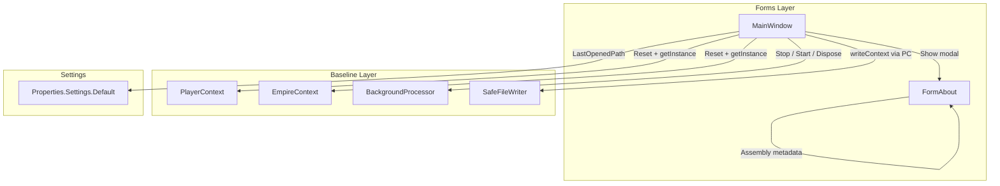

# Design Document: Main Menu Overhaul

## Overview

This design overhauls the MainWindow menu system in OE2EmpireTracker. The changes fall into four areas:

1. **File menu lifecycle** — New, Open, Save, Save As, Exit with dirty-state awareness, last-opened-file memory, and BackgroundProcessor lifecycle management during file operations.
2. **Auto-open on launch** — On startup, the application loads the last-used player file from a persisted user setting, falling back to default behavior.
3. **Edit → Manage rename** — The top-level "Edit" menu becomes "Manage" with updated item labels and alphabetical ordering.
4. **Help → About dialog** — A modal dialog showing application name, version, and copyright from assembly metadata.

All changes are confined to `MainWindow.cs`, `MainWindow.Designer.cs`, the user settings infrastructure (`Settings.settings` / `Settings.Designer.cs`), and a new `FormAbout` form. No changes to `PlayerContext`, `EmpireContext`, or domain model classes are required — the existing `PlayerContext.Reset()`, `PlayerContext.getInstance()`, `PlayerContext.writeContext()`, and `SafeFileWriter.WriteAllText()` APIs are sufficient.

## Architecture

The menu overhaul follows the existing layered architecture. All new logic lives in the Forms layer (MainWindow) and uses existing Baseline APIs.



### Key Design Decisions

1. **No dirty-state tracking** — The requirements do not call for unsaved-changes detection. File → Exit shows a simple "Are you sure?" confirmation. File → Save always writes (no "nothing to save" guard).

2. **BackgroundProcessor lifecycle on file operations** — When New or Open replaces the in-memory data, the existing `BackgroundProcessor` must be stopped and a new one created against the fresh `PlayerContext`. The sequence is: Stop old processor → close MDI children → `EmpireContext.Reset()` → re-initialize → create new processor → Start.

3. **PlayerContext.FilePath mutation** — `PlayerContext.FilePath` is a static property. For Open and Save As, we set `PlayerContext.FilePath` to the chosen path *before* calling `writeContext()` so that `SafeFileWriter` writes to the correct location. For New, we leave `FilePath` at its default since there is no file yet.

4. **Last-opened path in user settings** — We use `Properties.Settings.Default` with a new `LastOpenedPath` string setting. This persists automatically to the user's `user.config` file via the standard .NET settings mechanism.

5. **Title bar format** — `"OE2 Empire Tracker - {filename}"` when a file is loaded, `"OE2 Empire Tracker"` when no file is loaded (after New).

6. **Named event handlers** — Per project conventions, all menu item Click events use named methods (no anonymous lambdas).

## Components and Interfaces

### Modified: MainWindow (Forms/MainWindow.cs + Designer.cs)

**New fields:**
- `private string _lastOpenedPath` — in-memory copy of the last-opened file path (synced with Settings on change).

**New menu items (Designer.cs):**
- `newToolStripMenuItem` — File → New
- `saveAsToolStripMenuItem` — File → Save As
- `toolStripSeparatorFileExit` — separator before Exit

**Renamed menu items (Designer.cs):**
- `editToolStripMenuItem` → text changed to "Manage"
- `addSurveyToolStripMenuItem` → text changed to "Manage Surveys"
- `addBlueprintToolStripMenuItem` → text changed to "Manage Blueprints"
- `addColonyToolStripMenuItem` → text changed to "Manage Colonies"

**Reordered Manage menu items (alphabetical):**
1. Colony Activity
2. Colony Daily Build
3. Delivery Execution
4. Delivery Routes
5. Manage Blueprints
6. Manage Colonies
7. Manage Player Profiles
8. Manage Surveys

**New named event handlers:**
- `newToolStripMenuItem_Click` — File → New logic
- `openToolStripMenuItem_Click` — File → Open logic (currently unsubscribed)
- `saveToolStripMenuItem_Click` — File → Save logic (currently unsubscribed)
- `saveAsToolStripMenuItem_Click` — File → Save As logic
- `exitToolStripMenuItem_Click` — File → Exit with confirmation
- `aboutToolStripMenuItem_Click` — Help → About

**New private methods:**
- `CloseAllMdiChildren()` — iterates `MdiChildren` and calls `Close()` on each.
- `ReloadContextFromFile(string filePath)` — stops BackgroundProcessor, closes MDI children, calls `EmpireContext.Reset()`, sets `PlayerContext.FilePath`, calls `EmpireContext.getInstance()` to reload, creates and starts a new BackgroundProcessor, repopulates the player dropdown.
- `PerformSaveAs()` — shows SaveFileDialog, writes context, updates last-opened path and title. Returns `bool` indicating success (used by Save when no path exists).
- `UpdateTitleBar()` — sets `this.Text` based on `_lastOpenedPath`.
- `SetLastOpenedPath(string path)` — updates `_lastOpenedPath`, persists to `Properties.Settings.Default.LastOpenedPath`, calls `Settings.Default.Save()`, and updates the title bar.
- `TryAutoOpenLastFile()` — called from constructor after `InitializeComponent()`. Reads `Settings.Default.LastOpenedPath`; if non-empty and file exists, calls `ReloadContextFromFile`; otherwise clears the setting.

**File → New sequence:**
1. Close all MDI children.
2. Stop and dispose BackgroundProcessor.
3. Call `EmpireContext.Reset()` (which also resets PlayerContext).
4. Set `PlayerContext.FilePath` back to the default relative path.
5. Call `EmpireContext.getInstance()` — this creates a fresh PlayerContext with empty data (file won't exist at default path after New, so PlayerContext constructor handles missing file gracefully).
6. Re-assign local `context` and `playerContext` references.
7. Create and start a new BackgroundProcessor.
8. Repopulate player dropdown.
9. Set last-opened path to empty.

**File → Open sequence:**
1. Show `OpenFileDialog` filtered to `*.json`.
2. If cancelled, return.
3. Try `ReloadContextFromFile(selectedPath)`.
4. On success, call `SetLastOpenedPath(selectedPath)`.
5. On failure (exception), show `MessageBox.Show(error)`, do not change state.

**File → Save sequence:**
1. If `_lastOpenedPath` is non-empty, set `PlayerContext.FilePath = _lastOpenedPath`, call `playerContext.writeContext()`, wrapped in try/catch with error MessageBox.
2. If `_lastOpenedPath` is empty, call `PerformSaveAs()`.

**File → Save As sequence:**
1. Show `SaveFileDialog` filtered to `*.json`, default extension `.json`.
2. If cancelled, return.
3. Set `PlayerContext.FilePath` to chosen path.
4. Call `playerContext.writeContext()` wrapped in try/catch.
5. On success, call `SetLastOpenedPath(chosenPath)`.
6. On failure, show error MessageBox.

**File → Exit sequence:**
1. Show `MessageBox.Show("Are you sure you want to exit?", ..., YesNo)`.
2. If Yes, call `this.Close()`.
3. If No, return.

### New: FormAbout (Forms/FormAbout.cs + Designer.cs)

A simple modal dialog form:
- Labels for application name, version, copyright.
- An OK button that closes the dialog.
- On load, reads `Assembly.GetExecutingAssembly()` to get `AssemblyTitle`, `AssemblyVersion`, `AssemblyCopyright` from attributes.
- Shown via `new FormAbout().ShowDialog(this)` from MainWindow.

### Modified: Settings (Properties/Settings.settings + Settings.Designer.cs)

**New user-scoped setting:**
- `LastOpenedPath` (string, default empty) — persists the path of the last opened/saved file.

## Data Models

No new data model classes are introduced. The feature uses existing models:

- **PlayerRoot** — the serialization root for `PlayerContext.writeContext()` / deserialization in constructor. No changes needed.
- **Properties.Settings.Default** — gains one new string property `LastOpenedPath`. This is a standard .NET user setting stored in `user.config`.

### Settings Schema Change

```xml
<!-- Added to Settings.settings -->
<Setting Name="LastOpenedPath" Type="System.String" Scope="User">
  <Value Profile="(Default)" />
</Setting>
```

This generates a corresponding property in `Settings.Designer.cs`:

```csharp
[global::System.Configuration.UserScopedSettingAttribute()]
[global::System.Diagnostics.DebuggerNonUserCodeAttribute()]
[global::System.Configuration.DefaultSettingValueAttribute("")]
public string LastOpenedPath {
    get { return ((string)(this["LastOpenedPath"])); }
    set { this["LastOpenedPath"] = value; }
}
```

## Correctness Properties

*A property is a characteristic or behavior that should hold true across all valid executions of a system — essentially, a formal statement about what the system should do. Properties serve as the bridge between human-readable specifications and machine-verifiable correctness guarantees.*

### Property 1: New resets all state

*For any* PlayerContext containing arbitrary player profiles, colonies, blueprints, surveys, delivery routes, and delivery plans, executing the New operation should result in all lists being empty, CurrentPlayerUUID being empty, and the last-opened path being empty.

**Validates: Requirements 1.1, 1.3**

### Property 2: Save/load round-trip

*For any* valid PlayerContext state (with arbitrary profiles, colonies, blueprints, surveys, routes, plans) and any valid file path, saving the context to that path and then loading it back should produce a PlayerContext with equivalent data (same number of items in each list, same UUIDs, same field values).

**Validates: Requirements 2.2, 3.1, 4.2**

### Property 3: Invalid file preserves state

*For any* current PlayerContext state and any file containing invalid JSON (not parseable as a PlayerRoot), attempting to open that file should leave the PlayerContext data unchanged — all lists should have the same items as before the attempt.

**Validates: Requirements 2.5**

### Property 4: Auto-open round-trip

*For any* valid PlayerContext state, if the data is saved to a file and the path is stored as LastOpenedPath, then on application startup the auto-open logic should load that file and produce a PlayerContext with equivalent data.

**Validates: Requirements 6.1, 6.2**

### Property 5: Manage menu alphabetical ordering

*For any* set of items in the Manage menu, the displayed labels should be in case-insensitive alphabetical order — that is, for each consecutive pair of items, the first item's text should be less than or equal to the second item's text.

**Validates: Requirements 7.5**

## Error Handling

| Scenario | Handling | User Feedback |
|---|---|---|
| File → Open: file not found or unreadable | Catch `IOException` / `FileNotFoundException` | `MessageBox.Show` with error details; retain current data |
| File → Open: invalid JSON | Catch `JsonException` / `JsonSerializationException` | `MessageBox.Show` with parse error; retain current data |
| File → Save / Save As: write failure | Catch `IOException` / `UnauthorizedAccessException` | `MessageBox.Show` with error details; no state change |
| Auto-open: stored path missing or invalid | Catch exceptions, clear `LastOpenedPath`, log warning via NLog | Silent to user; starts with default/empty data |
| File → New: EmpireContext.Reset() failure | Unlikely but catch `Exception` | `MessageBox.Show`; application may be in inconsistent state — suggest restart |

All error handling follows the existing pattern: `try/catch` with NLog error logging and `MessageBox.Show` for user-facing errors. No exceptions should propagate unhandled from menu event handlers.

## Testing Strategy

### Dual Testing Approach

This feature requires both unit tests and property-based tests:

- **Unit tests** (NUnit): Verify specific examples, edge cases, error conditions, and static UI configuration (menu labels, ordering, About dialog content).
- **Property-based tests** (FsCheck with NUnit integration): Verify universal properties across randomly generated PlayerContext states.

### Property-Based Testing Configuration

- **Library**: FsCheck 2.16.6 with FsCheck.NUnit integration (compatible with .NET Framework 4.8.1 and NUnit 4.x)
- **Minimum iterations**: 100 per property test
- **Each property test must reference its design document property via a comment tag**
- **Tag format**: `// Feature: main-menu-overhaul, Property {number}: {property_text}`
- **Each correctness property is implemented by a single property-based test**

### Test Plan

**Property-based tests** (FsCheck + NUnit):

1. **Property 1: New resets all state** — Generate arbitrary PlayerRoot data, load it into PlayerContext, execute New logic, assert all lists empty and last-opened path empty.
   `// Feature: main-menu-overhaul, Property 1: New resets all state`

2. **Property 2: Save/load round-trip** — Generate arbitrary PlayerRoot data, save via `writeContext()`, reload via `PlayerContext.Reset()` + `getInstance()`, assert data equivalence.
   `// Feature: main-menu-overhaul, Property 2: Save/load round-trip`

3. **Property 3: Invalid file preserves state** — Generate arbitrary current state and arbitrary non-JSON strings, attempt load, assert state unchanged.
   `// Feature: main-menu-overhaul, Property 3: Invalid file preserves state`

4. **Property 4: Auto-open round-trip** — Generate arbitrary PlayerRoot, save to temp file, simulate auto-open logic, assert data equivalence.
   `// Feature: main-menu-overhaul, Property 4: Auto-open round-trip`

5. **Property 5: Manage menu alphabetical ordering** — Generate random permutations of menu item labels, apply the sorting logic, assert alphabetical order.
   `// Feature: main-menu-overhaul, Property 5: Manage menu alphabetical ordering`

**Unit tests** (NUnit):

- File menu item order: New, Open, Save, Save As, separator, Exit (Req 9.1)
- Menu label verification: "Manage", "Manage Surveys", "Manage Colonies", "Manage Blueprints" (Req 7.1–7.4)
- Save with no last-opened path delegates to Save As behavior (Req 3.2)
- About dialog displays correct app name, version, copyright (Req 8.2–8.4)
- Title bar shows filename after Open, clears after New (Req 1.4, 2.6, 4.4)
- Auto-open with no stored path uses default behavior (Req 6.4)
- Auto-open with missing file clears setting (Req 6.3)
- Save/Save As write errors show error message (Req 3.3, 4.6)

### Test File Location

Tests will be placed in `OE2EmpireTracker.Tests/Forms/MainMenuOverhaulTests.cs`, following the test project's convention of mirroring the main project's folder structure.
