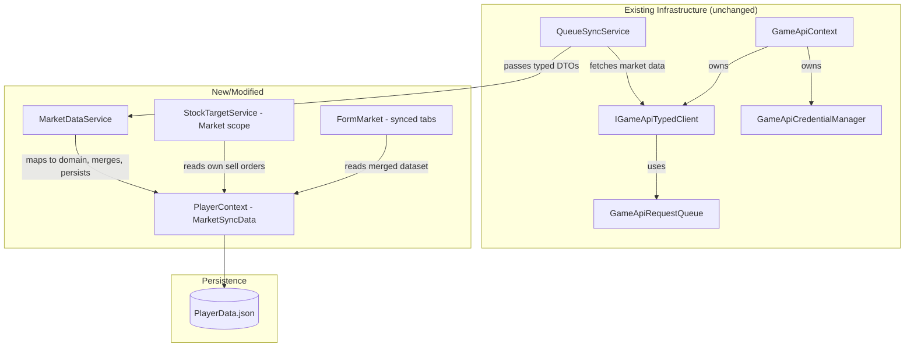
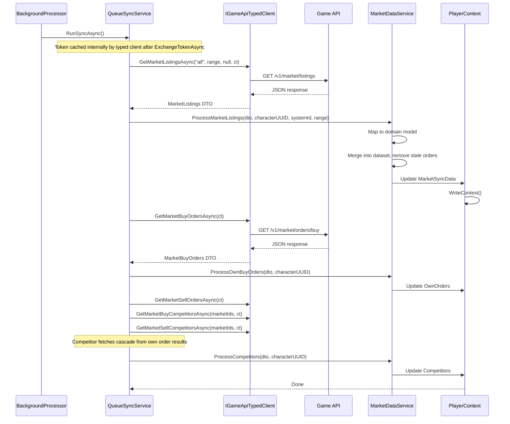

# Design Document: Market Integration

## Overview

This design integrates live market data from the OE2 Public API into the Empire Tracker desktop application. The system syncs public market orders, own orders, competitor data, and price statistics from all configured characters into a unified local dataset. Players browse this merged data offline with filtering and sorting, and the stock target replenishment system can count market sell orders as inventory.

The design adds a new `MarketDataService` that handles domain mapping, merge logic, and data persistence. It builds on the existing `IGameApiTypedClient` for API communication (typed DTOs with built-in resilience), the existing `GameApiRequestQueue` for concurrency control, and the existing `CredentialStore` for DPAPI-encrypted secret storage. The existing `FormMarket` gains new tabs for synced data alongside the existing manual Listings, Transactions, and Summary tabs.

### Key Design Decisions

1. **Merged dataset with per-character sync metadata** — Public orders from all characters merge into one collection keyed by `marketId`. Sync metadata tracks each character's system/range/timestamp so stale order removal only acts on orders confirmably within range.

2. **Reuse existing infrastructure** — `IGameApiTypedClient` handles API communication with built-in resilience (retry, circuit breaker, rate limiting). `GameApiRequestQueue` handles concurrency control. `CredentialStore` handles DPAPI encryption. `DistanceCalculator` and `SystemRepository` handle JAS distance computations for stale order detection.

3. **Separate API models from manual models** — Synced orders (`SyncedMarketOrder`) are distinct from manual `MarketListing`/`MarketTransaction` entities. No mixing of user-entered data with API-sourced data.

4. **Token-per-character architecture** — Each character has its own secret and token. The service manages multiple token lifecycles independently.


## Architecture

The market integration builds on top of existing infrastructure that already handles API communication, authentication, rate limiting, and sync orchestration. The existing `QueueSyncService` already fetches market data from the game API but currently discards the results. This design extends those work items to:
1. Execute each character's **saved searches** against the API
2. Map results into `MarketListing` entries in `PlayerContext`
3. Handle stale order removal within each search's scope

### Existing Infrastructure (No Changes Needed)

| Component | Role | Location |
|-----------|------|----------|
| `IGameApiTypedClient` / `GameApiTypedClient` | HTTP client with all market endpoints (`GetMarketListingsAsync`, `GetMarketBuyOrdersAsync`, etc.) — returns typed DTOs directly (no raw JSON, no tuple returns, no manual deserialization) | `OE2EmpireTracker.Common/Client/` |
| `GameApiContext` | Singleton owning `IGameApiTypedClient TypedClient`, credential manager, connection monitor, sync scheduler | `OE2EmpireTracker.Common/Client/` |
| `GameApiCredentialManager` | DPAPI-encrypted per-character secret storage | `OE2EmpireTracker.Common/Services/` |
| `GameApiRequestQueue` | Concurrency control (maxInflight) and dispatch pacing | `OE2EmpireTracker.Common/Services/` |
| `QueueSyncService` | Work item orchestration — already creates market work items | `OE2EmpireTracker.Common/Services/` |

> **Note:** `IGameApiTypedClient` already provides built-in resilience: Polly retry (3 retries with exponential backoff for 5xx), circuit breaker (3 failures → 30s open), TokenBucketRateLimiter (0.9 TPS), and HTTP 429 handling with Retry-After header parsing. The `GameApiRequestQueue` controls concurrency (maxInflight) and dispatch pacing. No additional rate limiting code is needed in MarketDataService.

### New/Modified Components

| Component | Role | Change Type |
|-----------|------|-------------|
| `QueueSyncService` work items | Persist market data into PlayerContext after fetch | **Modify** existing methods |
| `MarketDataService` | Merge logic, stale removal, domain mapping | **New** service |
| `PlayerContext` | Store and expose `MarketSyncData` | **Modify** to add market sync storage |
| `StockTargetService` | Market scope counting using synced sell orders | **Modify** to add new scope |
| `FormMarket` | New tabs for synced data alongside existing manual tabs | **Modify** UI |



### Sync Flow Sequence




## Components and Interfaces

### MarketDataService (New)

Handles domain mapping, merge logic, and stale order removal. Called by the existing `QueueSyncService` work items after they receive typed DTOs from `IGameApiTypedClient`. Does NOT make API calls itself — that's the typed client's job.

```csharp
public class MarketDataService
{
    // Maps typed DTO to domain model, merges into dataset, removes stale orders
    public void ProcessMarketListings(
        MarketListings dto, string characterUUID, int systemId, int rangeJas);

    // Maps own buy order DTO to domain model, stores per-character
    public void ProcessOwnBuyOrders(MarketBuyOrders dto, string characterUUID);

    // Maps own sell order DTO to domain model, stores per-character
    public void ProcessOwnSellOrders(MarketSellOrders dto, string characterUUID);

    // Maps competitor DTO and links to own orders
    public void ProcessBuyCompetitors(MarketCompetitorOrders dto, string characterUUID);
    public void ProcessSellCompetitors(MarketCompetitorOrders dto, string characterUUID);

    // Price lookup results
    public void ProcessPriceStats(MarketPriceStats dto, string characterUUID, string itemName);

    // Returns the merged dataset filtered for the given character (including private sale visibility)
    public IReadOnlyList<ReadOnlySyncedMarketOrder> GetVisibleOrders(string characterUUID);

    // Returns own orders for a character
    public IReadOnlyList<ReadOnlySyncedMarketOrder> GetOwnOrders(string characterUUID);

    // Auto-populate pricing plan from stored price stats
    public MarketPricePopulationResult AutoPopulatePricingPlan(
        string pricingPlanUUID, string characterUUID);
}
```

### QueueSyncService Modifications

The existing market work items (`CreateMarketListingsItem`, `CreateMarketBuyOrdersItem`, `CreateMarketSellOrdersItem`) are modified to pass typed DTOs to `MarketDataService` instead of just logging. Competitor fetches cascade from own order results (need the market IDs).

Error handling uses `try/catch` for `ApiHttpException` (401, 429, 5xx) and `ApiBusinessException`, leveraging the existing `HandleUnauthorizedAsync` and `HandleRateLimited` patterns already in `QueueSyncService`.

```csharp
// Before (existing — just logs):
Log.Debug("MarketListings fetched successfully.");

// After (passes DTO to MarketDataService):
var listings = await _typedClient.GetMarketListingsAsync("all", range, null, ct).ConfigureAwait(false);
_marketDataService.ProcessMarketListings(listings, _currentPlayerUUID, _currentSystemId, _currentTradeRange);
Log.Debug("MarketListings processed: merged into dataset.");
```

> **Token management:** The typed client caches tokens internally after `ExchangeTokenAsync`. Subsequent API calls automatically attach the Bearer token. No explicit token passing needed — no `appId` or `accessToken` parameters on individual API calls.


### Market Alert System

Players define alert rules that are evaluated after each market sync. When a synced order matches a rule, the tool raises a notification.

#### MarketAlert Model

```csharp
public class MarketAlert
{
    public string UUID { get; set; }
    public string Name { get; set; } = string.Empty;
    public bool Enabled { get; set; } = true;

    // What to watch for
    [JsonConverter(typeof(StringEnumConverter))]
    public MarketAlertType AlertType { get; set; }  // SellOrderAppears, BuyOrderAppears

    // Item filter (composite key — same pattern as stock targets)
    [JsonConverter(typeof(StringEnumConverter))]
    public ItemType.ItemTypeEnum ItemType { get; set; } = Models.ItemType.ItemTypeEnum.None;
    public string BaseItemTypeID { get; set; } = string.Empty;
    public string ResourcePurity { get; set; } = string.Empty;

    // Price condition
    [JsonConverter(typeof(StringEnumConverter))]
    public PriceCondition PriceCondition { get; set; } = PriceCondition.AnyPrice;
    public decimal? PriceThreshold { get; set; }

    // Location filter (optional — empty means anywhere)
    public string StationUUID { get; set; } = string.Empty;

    // Tracking
    public string LastTriggeredTimestamp { get; set; } = string.Empty;
    public long? LastTriggeredMarketId { get; set; }
}

public enum MarketAlertType
{
    SellOrderAppears,  // Someone is selling the item (I want to buy)
    BuyOrderAppears    // Someone wants to buy the item (I want to sell)
}

public enum PriceCondition
{
    AnyPrice,    // Alert on any matching order regardless of price
    AtOrBelow,   // Price <= threshold (looking for cheap sells or decent buy offers)
    AtOrAbove    // Price >= threshold (looking for high buy offers)
}
```

#### Alert Evaluation

After each sync, `MarketDataService` compares the freshly-synced orders against all enabled alerts:

```
For each enabled alert:
  1. Filter new/updated orders by:
     - BuyOrder matches AlertType (SellOrderAppears → BuyOrder=false, BuyOrderAppears → BuyOrder=true)
     - Item composite key matches (ItemType + BaseItemTypeID + ResourcePurity)
     - If StationUUID set: order.StationUUID matches
     - If PriceCondition != AnyPrice: evaluate price against threshold
  2. Exclude orders already seen (MarketId == LastTriggeredMarketId)
  3. If any matches found:
     → Fire MarketAlertTriggeredEvent with alert details and matching orders
     → Update LastTriggeredTimestamp and LastTriggeredMarketId
```

#### Notification Delivery

`MarketAlertTriggeredEvent` is handled by the UI to show a toast/notification balloon. The existing `FormMarket` displays a badge or alert indicator for triggered alerts.

#### Persistence

Alerts are stored in `MarketSyncData.Alerts`:

```csharp
public class MarketSyncData
{
    public List<SyncedMarketOrder> Orders { get; set; } = new List<SyncedMarketOrder>();
    public List<StoredPriceStats> PriceStats { get; set; } = new List<StoredPriceStats>();
    public List<CharacterSyncMetadata> SyncMetadata { get; set; } = new List<CharacterSyncMetadata>();
    public List<MarketAlert> Alerts { get; set; } = new List<MarketAlert>();
}
```

### Multi-Character Market Sync

The existing `QueueSyncService.RunSyncAsync` syncs only the current player. Market data sync iterates over **all characters with configured secrets** to build the merged dataset in one pass.

```
Algorithm:
  1. Get all configured character UUIDs from GameApiCredentialManager.GetConfiguredPlayerUUIDs()
  2. For each character (sequentially, to respect rate limits):
     a. Call ExchangeTokenAsync on the typed client for that character
     b. Get that character's enabled SavedSearches
     c. For each enabled search: call GetMarketListingsAsync with the search parameters
        (typed client attaches Bearer token automatically — no appId/accessToken params needed)
     d. Pass each DTO result to MarketDataService to map and merge into MarketListings
     e. Call GetMarketBuyOrdersAsync / GetMarketSellOrdersAsync for own order detail
     f. Update CharacterSyncMetadata (system, range, SystemsInRange, timestamp)
  3. Run stale order removal across all listings
  4. Evaluate market alerts against newly-synced data
  5. WriteContext() once at the end
```

Characters that fail token exchange are skipped with a logged warning. The sync runs as part of the existing `BackgroundProcessor` dispatch cycle.

The core algorithm for determining which orders to remove during a sync:

```
Input:
  - freshOrders: list of orders returned by the API for this character
  - existingOrders: current Orders list in MarketSyncData
  - syncMetadata: CharacterSyncMetadata (includes pre-computed SystemsInRange set)

Algorithm:
  1. Build a set of marketIds from freshOrders
  2. For each order in existingOrders:
     a. If syncMetadata.SystemsInRange.Contains(order.SystemId):
        → Order is within this character's view
        → If order.MarketId NOT in freshOrders set: mark for removal
     b. Else:
        → Order is outside character's range: keep (no information)
  3. Remove all marked orders
  4. Upsert all freshOrders into existingOrders (keyed by MarketId)
```

The `SystemsInRange` set is computed once at sync start, making step 2a an O(1) lookup per order.

### Stock Target Market Scope Counting

Extension to the existing `StockTargetService.ResolveCurrentQuantity`:

```
Input:
  - target: StockTarget with Scope = Market or StationPlusMarket
  - characterUUID: current player
  - listings: PlayerContext.MarketListings (all listings including synced orders)

Algorithm for Scope = Market:
  1. Filter listings to own sell orders:
     listing.OwnerUUID == characterUUID AND listing.BuyOrder == false AND
     listing.MarketId != null (synced, not manual)
  2. Further filter to matching item composite key:
     listing.ItemType == target.ItemType AND
     listing.BaseItemTypeID == target.ItemReferenceID AND
     listing.ResourcePurity == target.ResourcePurity (if resource)
  3. If target.LocationUUID (StationUUID) is non-empty:
     → Further filter to listings at that station (matching StationUUID)
  4. Sum AmountRemaining across filtered listings
  5. Return sum as currentQuantity

Algorithm for Scope = StationPlusMarket:
  1. Compute station warehouse quantity using existing Station scope logic
     (items in station hold matching the target item at target.LocationUUID)
  2. Compute market quantity using Market scope logic above
     (filtered to same station via target.LocationUUID)
  3. Return stationQuantity + marketQuantity as currentQuantity
```

The shortfall calculation then subtracts in-production items from the linked build plan:

```
shortfall = target.TargetQuantity - currentQuantity
inProduction = count of incomplete BuildItems in linked plan for same item
adjustedShortfall = max(0, shortfall - inProduction)
```


## Data Models

### Design Decision: Domain-Aligned Item Representation

Synced market data populates the **existing `MarketListing` model**, extended with additional fields from the API. There is no separate `SyncedMarketOrder` model — the Listings tab automatically shows synced data. The `MarketListing` model is extended to hold:

- Full item composite key (`ItemType` + `BaseItemTypeID` / `ItemReferenceID` + `ResourcePurity`)
- Market order details (MarketId, buy/sell, seller info, system/station, expiry)
- Sync tracking (which character synced it, when)

The `MarketDataService` maps API DTOs into `MarketListing` entries — creating new ones for orders not yet seen, updating existing ones on re-sync, and removing stale ones.

The sync is **search-driven**: each character has saved searches that define what data to pull from the API. On sync, each saved search executes against the API and results are merged into the listings.

**Item Identity Mapping by Type:**

| Item Type | BaseItemTypeID | ResourcePurity | ItemName | Notes |
|-----------|---------------|----------------|----------|-------|
| Resource | Resource name ("Noble Gases") | "High" / "Medium" / "Low" / "Refined" | "Noble Gases (High)" | Composite key includes purity |
| Commodity | Commodity name/ID ("Steel") | "" (empty) | "Steel (Manufacturing) [Structural]" | ExtendedName includes industry + group |
| Blueprint | Blueprint UUID | "" (empty) | "Pulse Laser Mk3" | Properties looked up via PlayerContext.FindBlueprint(BaseItemTypeID) |
| ShipHull | Blueprint UUID | "" (empty) | "Frigate Hull" | Same as blueprint pattern |
| ShipPart | Blueprint UUID | "" (empty) | "Mining Laser" | Same as blueprint pattern |
| Flatpack | Blueprint UUID | "" (empty) | "Reactor Flatpack" | Same as blueprint pattern |

**Example 1: Selling 10,000 Noble Gases (Unrefined, High) at 12.50 credits:**

```json
{
  "MarketId": 55001,
  "ItemType": "Resource",
  "BaseItemTypeID": "Noble Gases",
  "ResourcePurity": "High",
  "ItemName": "Noble Gases (High)",
  "GameTypeCode": "R",
  "GameTypeId": 19,
  "GameSubTypeId": "",
  "StationUUID": "station-uuid-456",
  "LocationName": "Alef Hestrixia Orbital",
  "SystemId": 7,
  "SystemName": "Alef Hestrixia",
  "GameLocationId": 1042,
  "BuyOrder": false,
  "AmountRemaining": 10000,
  "Price": 12.50,
  "OwnOrder": true,
  "Evolution": null,
  "HealthPercentage": null,
  "SellerName": "MyCharacter",
  "SellerFactionTag": "[TAG]",
  "PrivateSale": false,
  "SyncedByCharacterUUID": "char-uuid-1",
  "SyncTimestamp": "2025-01-15T10:30:00Z"
}
```

**Example 2: Selling 500 Steel (commodity) at 45.00 credits:**

```json
{
  "MarketId": 55002,
  "ItemType": "Commodity",
  "BaseItemTypeID": "Steel",
  "ResourcePurity": "",
  "ItemName": "Steel (Manufacturing) [Structural]",
  "GameTypeCode": "C",
  "GameTypeId": 8,
  "GameSubTypeId": "",
  "StationUUID": "station-uuid-789",
  "LocationName": "Beta Centauri Station",
  "SystemId": 12,
  "SystemName": "Beta Centauri",
  "GameLocationId": 2001,
  "BuyOrder": false,
  "AmountRemaining": 500,
  "Price": 45.00,
  "OwnOrder": true,
  "Evolution": null,
  "HealthPercentage": null,
  "SellerName": "MyCharacter",
  "SellerFactionTag": "[TAG]",
  "PrivateSale": false,
  "SyncedByCharacterUUID": "char-uuid-1",
  "SyncTimestamp": "2025-01-15T10:30:00Z"
}
```

**Example 3: Selling an Evo 3 Pulse Laser blueprint at 250,000 credits:**

```json
{
  "MarketId": 55003,
  "ItemType": "Blueprint",
  "BaseItemTypeID": "bp-uuid-a1b2c3d4",
  "ResourcePurity": "",
  "ItemName": "Pulse Laser Mk3",
  "GameTypeCode": "BP",
  "GameTypeId": 142,
  "GameSubTypeId": "3",
  "StationUUID": "station-uuid-456",
  "LocationName": "Alef Hestrixia Orbital",
  "SystemId": 7,
  "SystemName": "Alef Hestrixia",
  "GameLocationId": 1042,
  "BuyOrder": false,
  "AmountRemaining": 1,
  "Price": 250000.00,
  "OwnOrder": true,
  "Evolution": 3,
  "HealthPercentage": 97.5,
  "SellerName": "MyCharacter",
  "SellerFactionTag": "[TAG]",
  "PrivateSale": false,
  "SyncedByCharacterUUID": "char-uuid-1",
  "SyncTimestamp": "2025-01-15T10:30:00Z"
}
```

Blueprint properties (modifications, stats) are not stored on the market order. They are retrieved via `PlayerContext.FindBlueprint(BaseItemTypeID)` using the blueprint UUID.

### Modified Models

#### MarketListing (Extended)

The existing `MarketListing` model is extended with API-synced fields. Existing fields (`UUID`, `OwnerUUID`, `StationUUID`, `ItemType`, `ItemReferenceID`, `ItemName`, `Quantity`, `PricePerUnit`, `CurrentHP`, `MaxHP`, `MaxRepairPercent`) are preserved.

New fields added:

```csharp
public class MarketListing
{
    // ... existing fields unchanged ...

    // API sync fields (nullable — populated only for synced orders)
    public long? MarketId { get; set; }
    public bool BuyOrder { get; set; }
    public string BaseItemTypeID { get; set; } = string.Empty;
    public string ResourcePurity { get; set; } = string.Empty;

    // Raw API identifiers (for re-sync dedup)
    public string GameTypeCode { get; set; } = string.Empty;
    public long? GameTypeId { get; set; }
    public string GameSubTypeId { get; set; } = string.Empty;

    // Location details
    public string LocationName { get; set; } = string.Empty;
    public int? SystemId { get; set; }
    public string SystemName { get; set; } = string.Empty;
    public int? GameLocationId { get; set; }

    // Order details
    public int? AmountRemaining { get; set; }
    public int? AmountOriginal { get; set; }
    public int? AmountSold { get; set; }
    public decimal? EscrowRemaining { get; set; }
    public decimal? SalesTaxEstimate { get; set; }
    public decimal? ValueRemaining { get; set; }
    public int? Evolution { get; set; }
    public double? HealthPercentage { get; set; }

    // Seller / buyer info
    public string SellerName { get; set; } = string.Empty;
    public string SellerFactionTag { get; set; } = string.Empty;
    public bool PrivateSale { get; set; }
    public string BuyerName { get; set; } = string.Empty;
    public string BuyerFactionTag { get; set; } = string.Empty;

    // Timing
    public string PlacedDT { get; set; } = string.Empty;
    public string ExpiresDT { get; set; } = string.Empty;

    // Sync tracking
    public string SyncedByCharacterUUID { get; set; } = string.Empty;
    public string SyncTimestamp { get; set; } = string.Empty;
}
```

Orders are keyed by `MarketId` for deduplication. Manual listings (legacy) have `MarketId = null`.

#### SavedMarketSearch

Per-character saved search that runs on each sync to pull targeted market data. Stores both the tool's domain representation (for display consistency) and the API parameters (for query execution).

```csharp
public class SavedMarketSearch
{
    public string UUID { get; set; }
    public string CharacterUUID { get; set; } = string.Empty;
    public string Name { get; set; } = string.Empty;
    public bool Enabled { get; set; } = true;

    // Domain representation (what the user sees, consistent with tool conventions)
    [JsonConverter(typeof(StringEnumConverter))]
    public ItemType.ItemTypeEnum ItemType { get; set; } = Models.ItemType.ItemTypeEnum.None;  // None = all types
    public string BaseItemTypeID { get; set; } = string.Empty;  // Specific item (empty = all items of type)
    public string ResourcePurity { get; set; } = string.Empty;  // Purity filter (resources only)
    public string SearchText { get; set; } = string.Empty;
    public bool? BuyOrdersOnly { get; set; }  // null=all, true=buy only, false=sell only

    // API parameters (derived from domain fields, used for query execution)
    public string GameTypeCode { get; set; } = "all";   // "all", "R", "C", "BP", "H", "P", etc.

    // Tracking
    public string LastExecutedTimestamp { get; set; } = string.Empty;
    public int LastResultCount { get; set; }
}
```

The `GameTypeCode` is derived from `ItemType` when the search is saved (using the same `ItemType` → API type code mapping used elsewhere). The UI shows the domain `ItemType` dropdown, not the raw API code.

#### MarketSyncData (Updated)

```csharp
public class MarketSyncData
{
    public List<StoredPriceStats> PriceStats { get; set; } = new List<StoredPriceStats>();
    public List<CharacterSyncMetadata> SyncMetadata { get; set; } = new List<CharacterSyncMetadata>();
    public List<MarketAlert> Alerts { get; set; } = new List<MarketAlert>();
    public List<SavedMarketSearch> SavedSearches { get; set; } = new List<SavedMarketSearch>();
}
```

Note: `MarketListing` entries (synced orders) live in the existing `PlayerContext.MarketListings` collection — not in `MarketSyncData`. The `MarketSyncData` holds only metadata, price stats, alerts, and search definitions.

#### StoredPriceStats

```csharp
public class StoredPriceStats
{
    // Item identity — tool domain model (composite key: ItemType + BaseItemTypeID + ResourcePurity)
    [JsonConverter(typeof(StringEnumConverter))]
    public ItemType.ItemTypeEnum ItemType { get; set; } = Models.ItemType.ItemTypeEnum.None;
    public string BaseItemTypeID { get; set; } = string.Empty;
    public string ItemName { get; set; } = string.Empty;
    public string ResourcePurity { get; set; } = string.Empty;

    // Raw API identifiers (for re-fetch)
    public string GameTypeCode { get; set; } = string.Empty;
    public long GameTypeId { get; set; }

    // Price data
    public decimal? LowPrice { get; set; }
    public decimal? AvgPrice { get; set; }
    public decimal? HighPrice { get; set; }
    public int SampleCount { get; set; }
    public string SearchRadius { get; set; } = string.Empty;
    public int DaysSearched { get; set; }
    public string OrderType { get; set; } = string.Empty;

    // Tracking
    public string FetchedTimestamp { get; set; } = string.Empty;
    public string FetchedByCharacterUUID { get; set; } = string.Empty;
}
```

#### CharacterSyncMetadata

```csharp
public class CharacterSyncMetadata
{
    public string CharacterUUID { get; set; } = string.Empty;
    public int SystemId { get; set; }
    public string SystemName { get; set; } = string.Empty;
    public int RangeJas { get; set; }
    public HashSet<int> SystemsInRange { get; set; } = new HashSet<int>();
    public string LastSyncTimestamp { get; set; } = string.Empty;
    public List<string> GrantedScopes { get; set; } = new List<string>();
}
```

`SystemsInRange` is computed at sync time using a **grid-based spatial index** for fast range queries:

```
Spatial Index — SystemGridIndex (built once at startup from oe2-galaxy-systems.json):
  - Cell size: 50 JAS (tunable)
  - Each system is assigned to cell (floor(x / cellSize), floor(y / cellSize))
  - Dictionary<(int cellX, int cellY), List<SystemEntry>> grid

Query — ComputeSystemsInRange(syncSystem, rangeJas):
  1. Determine which grid cells overlap the bounding box:
     minCellX = floor((syncSystem.X - rangeJas) / cellSize)
     maxCellX = floor((syncSystem.X + rangeJas) / cellSize)
     minCellY = floor((syncSystem.Y - rangeJas) / cellSize)
     maxCellY = floor((syncSystem.Y + rangeJas) / cellSize)
  2. For each cell in [minCellX..maxCellX] × [minCellY..maxCellY]:
     a. Look up systems in that cell from the grid index
     b. For each system in the cell:
        - Compute actual distance: sqrt(dx² + dy²)
        - If distance <= rangeJas → add to result set
  3. Return HashSet<int> of system IDs within range
```

The grid index is O(1) to look up a cell and limits distance calculations to systems in overlapping cells only. With 50 JAS cells and a typical 200 JAS trade range, this checks ~16–25 cells instead of scanning all systems. The index builds once from the galaxy JSON at startup and is reused for all range queries.


#### StockTargetScope (enum extension)

```csharp
public enum StockTargetScope
{
    EmpireWide,
    Colony,
    Station,
    Market,            // NEW: counts only own sell orders for the item
    StationPlusMarket  // NEW: counts station warehouse inventory + own sell orders at that station
}
```

### Persistence Format

Synced market orders are stored in the existing `MarketListing` collection in PlayerData.json (same array as manual listings). The `MarketSyncData` object holds only metadata, price stats, alerts, and saved searches:

```json
{
  "MarketListing": [
    {
      "UUID": "listing-uuid-1",
      "OwnerUUID": "char-uuid-1",
      "StationUUID": "station-uuid-456",
      "ItemType": "Resource",
      "ItemReferenceID": "",
      "ItemName": "Noble Gases (High)",
      "Quantity": 10000,
      "PricePerUnit": 12.50,
      "MarketId": 55001,
      "BuyOrder": false,
      "BaseItemTypeID": "Noble Gases",
      "ResourcePurity": "High",
      "GameTypeCode": "R",
      "GameTypeId": 19,
      "LocationName": "Alef Hestrixia Orbital",
      "SystemId": 7,
      "SystemName": "Alef Hestrixia",
      "SellerName": "MyCharacter",
      "SellerFactionTag": "[TAG]",
      "SyncedByCharacterUUID": "char-uuid-1",
      "SyncTimestamp": "2025-01-15T10:30:00Z"
    }
  ],
  "MarketSyncData": {
    "PriceStats": [...],
    "SyncMetadata": [
      {
        "CharacterUUID": "char-uuid-1",
        "SystemId": 7,
        "SystemName": "Alef Hestrixia",
        "RangeJas": 210,
        "SystemsInRange": [1, 2, 3, 5, 7, 12, 15],
        "LastSyncTimestamp": "2025-01-15T10:30:00Z",
        "GrantedScopes": ["market.listings.read", "market.orders.read"]
      }
    ],
    "Alerts": [...],
    "SavedSearches": [
      {
        "UUID": "search-uuid-1",
        "CharacterUUID": "char-uuid-1",
        "Name": "All Resources",
        "Enabled": true,
        "TypeCode": "R",
        "Search": "",
        "LastExecutedTimestamp": "2025-01-15T10:30:00Z",
        "LastResultCount": 342
      }
    ]
  }
}
```

The credentials are already managed by the existing `GameApiCredentialManager` which handles DPAPI encryption, per-character secrets, and the secrets file in `%LOCALAPPDATA%`.


## UI Mockups

### FormMarket — New Tabs

The existing FormMarket gains new tabs for API-synced data. Existing tabs (Listings, Transactions, Summary) remain unchanged.

#### Synced Market Tab (Saved Searches)

This tab manages per-character saved searches. You define searches, test them live, then mark them to execute on each sync.

```
│ ┌─ Listings ─┬─ Transactions ─┬─ Summary ─┬─ Saved Searches ─┬─ My Orders ─┬─ Prices ─┬─ Alerts ─┐│
│ │                                                                                                ││
│ │ Character: [Char1           ▼]     Last Sync: 2025-01-15 10:30                                ││
│ │                                                                                                ││
│ │ Saved Searches:                                                                                ││
│ │ ┌──────────────────────┬──────────┬────────────┬─────────┬───────────────────┬────────────────┐││
│ │ │ Name                 │ Type     │ Search     │ Enabled │ Last Run          │ Results        │││
│ │ ├──────────────────────┼──────────┼────────────┼─────────┼───────────────────┼────────────────┤││
│ │ │ All Resources        │ Resource │ (all)      │ ☑       │ 2025-01-15 10:30  │ 342 orders     │││
│ │ │ Pulse Lasers         │ Blueprnt │ Pulse Laser│ ☑       │ 2025-01-15 10:30  │ 12 orders      │││
│ │ │ Cheap Steel          │ Commodty │ Steel      │ ☐       │ 2025-01-14 09:00  │ 5 orders       │││
│ │ └──────────────────────┴──────────┴────────────┴─────────┴───────────────────┴────────────────┘││
│ │                                                                                                ││
│ │ Add/Edit Search:                                                                               ││
│ │ Name:[________________]                                                                        ││
│ │ Type:[Resource  ▼] Filter:[___] Item:[Noble Gases    ▼] Purity:[High▼]                       ││
│ │ Order Type:[All▼]                                                                             ││
│ │ [Test Search] [Save Search] [Delete]  [☑ Run on Sync]                                         ││
│ │                                                                                                ││
│ │ Test Results: (47 orders found)                                                                ││
│ │ ┌──────────┬────────────────┬────────┬───────┬──────────┬─────────┬──────────────────┐        ││
│ │ │ Type     │ Item           │ Buy/Sel│ Qty   │ Price    │ Seller  │ Location         │        ││
│ │ ├──────────┼────────────────┼────────┼───────┼──────────┼─────────┼──────────────────┤        ││
│ │ │ Resource │ Noble Gases(H) │ Sell   │10,000 │    12.50 │ Me      │ Alef Hest Orb    │        ││
│ │ │ Resource │ Noble Gases(M) │ Sell   │ 5,000 │     8.00 │ TraderX │ Beta Cent Stn    │        ││
│ │ └──────────┴────────────────┴────────┴───────┴──────────┴─────────┴──────────────────┘        ││
│ └────────────────────────────────────────────────────────────────────────────────────────────────┘│
```

Controls:
- `cmbSearchCharacter` (ComboBox — which character's searches to manage)
- `dgvSavedSearches` (DataGridView — list of saved searches for this character)
- `txtSearchName` (TextBox — search name)
- `cmbSearchType` (ComboBox — item type: All, Resource, Commodity, Blueprint, etc.)
- `txtSearchFilter` (TextBox — inline filter for item combo)
- `cmbSearchItem` (FilteredComboBox — item selection, populated based on type)
- `cmbSearchPurity` (ComboBox — purity, visible/enabled only when Type=Resource)
- `cmbSearchOrderType` (ComboBox — Buy/Sell/All)
- `chkRunOnSync` (CheckBox — enabled flag)
- `cmdTestSearch` (Button — executes search live against API, shows results below)
- `cmdSaveSearch` (Button — saves/updates the search definition)
- `cmdDeleteSearch` (Button — removes the search)
- `dgvTestResults` (DataGridView — temporary display of live test results)

#### My Orders Tab

```
│ ┌─ Listings ─┬─ Transactions ─┬─ Summary ─┬─ Saved Searches ─┬─ My Orders ─┬─ Prices ─┬─ Alerts ─┐│
│ │                                                                                                ││
│ │ Character: [All Characters  ▼]  Type:[All▼] Search:[____________] Location:[All▼]             ││
│ │                                                                                                ││
│ │ Sell Orders:                                                                                   ││
│ │ ┌────────────────┬───────┬──────┬──────────┬──────────┬────────┬──────────┬───────────────────┐││
│ │ │ Item           │Remain │ Orig │ Price    │ Tax Est  │ Expiry │ Location │ Status            │││
│ │ ├────────────────┼───────┼──────┼──────────┼──────────┼────────┼──────────┼───────────────────┤││
│ │ │ Steel          │   200 │ 1000 │    45.00 │   900.00 │ 5d 2h  │ Beta Stn │ ⚠ UNDERCUT       │││
│ │ │ Noble Gases(H) │10,000 │10000 │    12.50 │ 1,562.50 │ 12d    │ Alef Orb │                   │││
│ │ └────────────────┴───────┴──────┴──────────┴──────────┴────────┴──────────┴───────────────────┘││
│ │                                                                                                ││
│ │ Buy Orders:                                                                                    ││
│ │ ┌────────────────┬───────┬──────┬──────────┬──────────┬────────┬──────────┬───────────────────┐││
│ │ │ Item           │Remain │ Orig │ Price    │ Escrow   │ Expiry │ Location │ Status            │││
│ │ ├────────────────┼───────┼──────┼──────────┼──────────┼────────┼──────────┼───────────────────┤││
│ │ │ Trans-Metals(R)│   500 │  500 │     5.00 │ 2,500.00 │ 3d 8h  │ Alef Orb │ ⚠ OUTBID         │││
│ │ └────────────────┴───────┴──────┴──────────┴──────────┴────────┴──────────┴───────────────────┘││
│ │                                                                                                ││
│ └────────────────────────────────────────────────────────────────────────────────────────────────┘│
```

Controls:
- `cmbOrderCharacter` (ComboBox — filter by character or all)
- `cmbOrderType` (ComboBox — filter by item type: All, Resource, Commodity, Blueprint, etc.)
- `txtOrderSearch` (TextBox — free-text filter on item name)
- `cmbOrderLocation` (ComboBox — filter by station or all)
- `dgvSellOrders` (DataGridView — own sell orders, read-only, highlight undercut rows)
- `dgvBuyOrders` (DataGridView — own buy orders, read-only, highlight outbid rows)
- Status column is computed at display time from order price vs competitors

#### Prices Tab

```
│ ┌─ Listings ─┬─ Transactions ─┬─ Summary ─┬─ Synced Market ─┬─ My Orders ─┬─ Prices ─┬─ Alerts ─┐│
│ │                                                                                                ││
│ │ Lookup: Type:[Resource▼] Filter:[___] Item:[Noble Gases  ▼] Purity:[High▼]                    ││
│ │         Days Back:[30] [x] Buy Order Prices  [Fetch Prices]                                   ││
│ │                                                                                                ││
│ │ Stored Price Statistics:                                                                       ││
│ │ ┌────────────────┬────────┬────────┬────────┬────────┬──────────┬──────────────────────────────┐││
│ │ │ Item           │ Low    │ Avg    │ High   │Samples │ Radius   │ Fetched                      │││
│ │ ├────────────────┼────────┼────────┼────────┼────────┼──────────┼──────────────────────────────┤││
│ │ │ Noble Gases(H) │   8.50 │  11.20 │  15.00 │     42 │ 210 JAS  │ 2025-01-15 by Char1          │││
│ │ │ Steel          │  38.00 │  44.50 │  52.00 │    156 │ 210 JAS  │ 2025-01-14 by Char2          │││
│ │ └────────────────┴────────┴────────┴────────┴────────┴──────────┴──────────────────────────────┘││
│ │                                                                                                ││
│ │ [Auto-Populate Pricing Plan]  Plan: [Standard Pricing▼]                                       ││
│ └────────────────────────────────────────────────────────────────────────────────────────────────┘│
```

Controls:
- `cmbPriceType` (ComboBox — item type)
- `txtPriceFilter` (TextBox — inline filter for item combo)
- `cmbPriceItem` (FilteredComboBox — item selection, populated based on type)
- `cmbPricePurity` (ComboBox — purity, visible/enabled only when Type=Resource)
- `cmdFetchPrices` (Button — triggers API price lookup)
- `numDaysBack` (NumericUpDown — 1-90 days)
- `chkBuyOrderPrices` (CheckBox — fetch buy order prices instead of sell)
- `dgvPriceStats` (DataGridView — stored price statistics, read-only)
- `cmdAutoPopulate` (Button — auto-populate pricing plan with stored averages)
- `cmbAutoPopPlan` (FilteredComboBox — select pricing plan to populate)

#### Alerts Tab

```
│ ┌─ Listings ─┬─ Transactions ─┬─ Summary ─┬─ Synced Market ─┬─ My Orders ─┬─ Prices ─┬─ Alerts ─┐│
│ │                                                                                                ││
│ │ ┌──────────────────────┬──────────┬────────────────┬────────────┬────────┬───────────────────┐ ││
│ │ │ Name                 │ Watch    │ Item           │ Price      │ Locatn │ Last Triggered    │ ││
│ │ ├──────────────────────┼──────────┼────────────────┼────────────┼────────┼───────────────────┤ ││
│ │ │ Cheap Noble Gases    │ Sells    │ Noble Gases(H) │ ≤ 10.00    │ Any    │ 2025-01-14 09:15  │ ││
│ │ │ Pulse Laser Hunting  │ Sells    │ Pulse Laser 3  │ Any        │ Any    │ (never)           │ ││
│ │ │ Steel Buy Opps       │ Buys     │ Steel          │ ≥ 50.00    │ Any    │ 2025-01-15 10:30  │ ││
│ │ └──────────────────────┴──────────┴────────────────┴────────────┴────────┴───────────────────┘ ││
│ │                                                                                                ││
│ │ Add Alert:                                                                                     ││
│ │ Name:[________________]                                                                        ││
│ │ Watch For: [Sell Orders Appearing▼]                                                           ││
│ │ Type:[Resource▼] Filter:[___] Item:[Noble Gases  ▼] Purity:[High▼]                           ││
│ │ Price: [Any Price   ▼] [10.00____]   (threshold ignored for Any Price)                         ││
│ │ Location: [Any Location         ▼]                                                            ││
│ │ [Add Alert] [Edit] [Delete] [☑ Enabled]                                                       ││
│ └────────────────────────────────────────────────────────────────────────────────────────────────┘│
```

Controls:
- `dgvAlerts` (DataGridView — list of configured alerts)
- `txtAlertName` (TextBox)
- `cmbAlertType` (ComboBox — SellOrderAppears / BuyOrderAppears)
- `cmbAlertItemType` (ComboBox — item type)
- `txtAlertFilter` (TextBox — inline filter for item combo)
- `cmbAlertItem` (FilteredComboBox — item selection, populated based on type)
- `cmbAlertPurity` (ComboBox — purity, visible/enabled only when Type=Resource)
- `cmbPriceCondition` (ComboBox — AnyPrice / AtOrBelow / AtOrAbove)
- `txtPriceThreshold` (TextBox — numeric, disabled when AnyPrice selected)
- `cmbAlertLocation` (FilteredComboBox — station or "Any")
- `cmdAddAlert`, `cmdEditAlert`, `cmdDeleteAlert` (Buttons)
- `chkAlertEnabled` (CheckBox)

### FormStockTargets — Updated Scope Dropdown

The existing `cmbScope` dropdown gains two new values:

```
Scope: [Market           ▼]     Location: [Alef Hestrixia Orbital  ▼]
        ┌─────────────────┐
        │ EmpireWide      │
        │ Colony          │
        │ Station         │
        │ Market          │  ← counts own sell orders only
        │ StationPlusMarket│ ← counts station inventory + own sell orders
        └─────────────────┘
```

When `Market` or `StationPlusMarket` is selected, the Location dropdown filters to stations only (not colonies). The Location is required for both scopes.


## Correctness Properties

These properties define what it means for the market integration to behave correctly. Each will be verified via property-based tests using FsCheck.

### Property 1: Merge Idempotency

**Validates: Requirements 1.2**

Syncing the same character with the same API response twice produces an identical merged dataset. Formally: `merge(merge(dataset, response), response) == merge(dataset, response)`.

### Property 2: Stale Removal Soundness

**Validates: Requirements 1.4, 14.2**

An order is removed from the merged dataset ONLY IF it is within the syncing character's computed range AND absent from the fresh results. Formally: for any removed order `o`, `distance(syncSystem, o.system) <= syncRange` AND `o.marketId ∉ freshOrderIds`.

### Property 3: Stale Removal Completeness

**Validates: Requirements 14.1, 14.2**

Every order within range that is absent from fresh results IS removed. Formally: for any order `o` in the dataset where `distance(syncSystem, o.system) <= syncRange` AND `o.marketId ∉ freshOrderIds`, then `o ∉ resultDataset`.

### Property 4: Out-of-Range Preservation

**Validates: Requirements 1.5, 14.3**

Orders outside the syncing character's range are never modified or removed by that character's sync. Formally: for any order `o` where `distance(syncSystem, o.system) > syncRange`, the order remains unchanged after sync.

### Property 5: Deduplication by MarketId

**Validates: Requirements 1.2**

The merged dataset never contains duplicate entries for the same `marketId`. Formally: `dataset.GroupBy(o => o.MarketId).All(g => g.Count() == 1)`.

### Property 6: Private Sale Isolation

**Validates: Requirements 2.2, 2.3**

A private sale order is never visible to characters other than the seller and the named buyer. Formally: for any order `o` where `o.PrivateSale == true`, `visibleTo(o) ⊆ {o.SyncedByCharacterUUID, o.PrivateSaleTo}`.

### Property 7: Stock Target Shortfall Non-Negative

**Validates: Requirements 7.3, 7.4**

The adjusted shortfall for a market-scoped stock target is always >= 0. Formally: `max(0, targetQty - currentQty - inProduction) >= 0`.

### Property 8: Token Proactive Refresh

**Validates: Requirements 9.4**

A token is refreshed before use if it will expire within 5 minutes. Formally: if `token.ExpiresAt - now < 5 minutes`, then `EnsureValidTokenAsync` fetches a new token before returning.

### Property 9: Circuit Breaker Respects Threshold

**Validates: Requirements 10.2**

The circuit breaker opens after exactly 5 consecutive failures. Formally: after failures `[1..4]`, requests are still attempted; after failure 5, the circuit opens and no requests are sent until the 30-second window elapses.

### Property 10: Rate Limit Backoff Monotonicity

**Validates: Requirements 10.1**

Retry delays increase monotonically with each consecutive 429 response. Formally: `delay(attempt_n+1) > delay(attempt_n)` for exponential backoff.


## Error Handling

Most error handling is already implemented in the existing infrastructure:

- **Rate limiting (429)**: `IGameApiTypedClient` handles retry with exponential backoff via Polly (3 retries), plus Retry-After header parsing
- **Circuit breaker**: Already configured in `IGameApiTypedClient` (3 failures → 30s open)
- **Token exchange failures**: Already handled by `QueueSyncService.HandleUnauthorizedAsync`
- **Network timeouts**: Already handled by Polly retry policies in `IGameApiTypedClient`
- **Token bucket rate limiting**: `IGameApiTypedClient` enforces 0.9 TPS via `TokenBucketRateLimiter`

Callers use `try/catch` for `ApiHttpException` (HTTP status errors) and `ApiBusinessException` (API business logic errors). The existing `QueueSyncService` patterns (`HandleUnauthorizedAsync`, `HandleRateLimited`) handle 401 and 429 scenarios.

### New Error Handling (MarketDataService)

| Error | Handling |
|-------|----------|
| DTO mapping failure (unexpected null or missing field) | Log error with DTO type and field, skip this endpoint's data, continue sync |
| Domain mapping failure (unknown item type) | Log warning, store with `ItemType = None` and raw API values preserved |
| Station UUID lookup miss (unknown GameLocationId) | Store with `StationUUID = ""`, `GameLocationId` preserved for future resolution |
| Stale removal with missing system coordinates | Skip stale removal for orders with unknown SystemId, log warning |

### Partial Sync Success

When some endpoints succeed and others fail during a sync, the `QueueSyncService` already handles this via work item error isolation — failed items don't block other items from completing. The `MarketDataService` persists results per-endpoint call, so partial data is retained.

### UI Error Reporting

Sync status is reported via the existing `GameApiContext` connection status events and `QueueSyncService` result reporting. The `FormMarket` displays the last-synced timestamp from `CharacterSyncMetadata` — stale timestamps indicate sync failures.


## Testing Strategy

### Property-Based Tests (FsCheck 2.16.6 + NUnit)

Each correctness property maps to a property-based test:

| Property | Test Class | Generator Strategy |
|----------|------------|-------------------|
| CP-1: Merge Idempotency | `MarketMergePropertyTests` | Generate random order lists, apply merge twice, assert equality |
| CP-2: Stale Removal Soundness | `StaleRemovalPropertyTests` | Generate random datasets with known in-range/out-range orders, verify only in-range absent orders are removed |
| CP-3: Stale Removal Completeness | `StaleRemovalPropertyTests` | Same generator, verify all qualifying orders ARE removed |
| CP-4: Out-of-Range Preservation | `StaleRemovalPropertyTests` | Generate orders at various distances, verify out-of-range orders unchanged |
| CP-5: Deduplication | `MarketMergePropertyTests` | Generate overlapping order sets with duplicate marketIds, verify uniqueness |
| CP-6: Private Sale Isolation | `PrivateSalePropertyTests` | Generate private/public orders, verify visibility constraints |
| CP-7: Shortfall Non-Negative | `StockTargetMarketPropertyTests` | Generate random targets/orders/in-production counts, verify non-negative |
| CP-8: Token Refresh | Covered by existing `IGameApiTypedClient` tests | Already tested in request queue property tests |
| CP-9: Circuit Breaker | Covered by existing `GameApiRequestQueuePropertyTests` | Already tested |
| CP-10: Backoff Monotonicity | Covered by existing `GameApiRequestQueueRateLimitTests` | Already tested |

### Unit Tests (NUnit)

- `MarketDataServiceTests` — Domain mapping, merge logic, stale removal with deterministic scenarios
- `MarketDataServiceMappingTests` — API DTO → domain model mapping for each item type
- `StockTargetMarketScopeTests` — Market scope counting with various order configurations
- `PrivateSaleVisibilityTests` — Private sale filtering for seller/buyer/third party

### Integration Points

- Tests use `SystemClock.FreezeAt(...)` for deterministic time in sync metadata timestamps
- `MarketDataService` tests inject a mock `PlayerContext` with known stations/systems
- Existing `IGameApiTypedClient` and `QueueSyncService` tests already cover the API communication layer

### Test Data Fixtures

- `TestData/MarketListingsResponse.json` — Sample API response for `/v1/market/listings`
- `TestData/OwnOrdersResponse.json` — Sample API response for own buy/sell orders
- `TestData/CompetitorResponse.json` — Sample API response for competitor data
- `TestData/PriceStatsResponse.json` — Sample API response for price statistics

