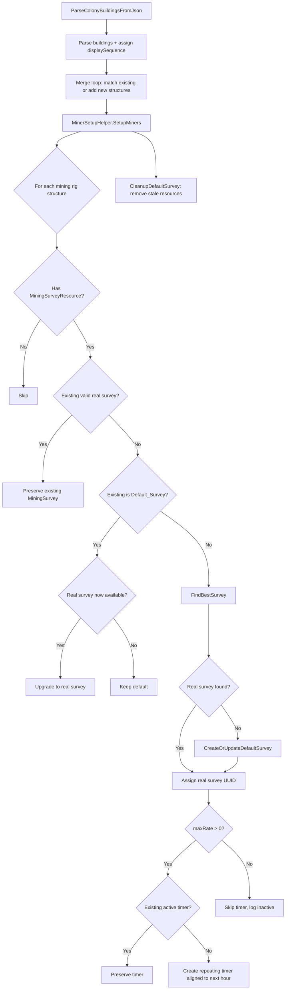

# Design Document: Miner Import Setup

## Overview

This feature automates the setup of mining rigs and refineries during colony import/reimport. Currently, the parser extracts `MiningSurveyResource` and `RefiningResourcePurity` from the game JSON but never assigns a `MiningSurvey` (survey UUID), starts the `ProcessCompletionTime` (mining/refining timer), or ensures warehouse resource records exist. This forces the user to manually configure every miner and refinery after every import.

The design introduces two static helper classes that run after the merge loop in `ParseColonyBuildingsFromJson`:
- `MinerSetupHelper` — handles survey assignment, default survey creation, timer start, and warehouse resource seeding for mining rigs
- `RefinerySetupHelper` — handles warehouse resource seeding and timer start for refineries

The `maxRate` values from the game JSON are collected during parsing into a `Dictionary<string, decimal>` keyed by structure UUID and passed to the setup helpers as a parameter. This avoids adding a transient field to ColonyStructure that could confuse readers of the model.

## Architecture



### Call Flow

1. `ParseBuilding` — extracts `maxRate` from building JSON, returns it alongside the structure
2. `ParseColonyBuildingsFromJson` — after parsing each building, checks if the blueprint type is a Refinery and if so copies `MiningSurveyResource` to `RefiningResource` (the game JSON uses `resourceName` for both miners and refineries, but the model uses separate fields). Collects `maxRate` values into a `Dictionary<string, decimal>` keyed by structure UUID during the merge loop, then calls:
   - `MinerSetupHelper.SetupMiners(colony, empireContext, maxRates)` for mining rigs
   - `RefinerySetupHelper.SetupRefineries(colony, empireContext)` for refineries
3. `MinerSetupHelper.SetupMiners` — iterates all colony structures, identifies mining rigs via blueprint type, looks up each structure's maxRate from the dictionary, and for each:
   - Calls `AssignSurvey` to handle survey selection/creation
   - Calls `EnsureWarehouseResource` to seed warehouse with mined resource if missing
   - Calls `SetupTimer` to handle timer creation
   - Calls `CleanupDefaultSurvey` once at the end to remove stale default survey resources
4. `RefinerySetupHelper.SetupRefineries` — iterates all colony structures, identifies refineries via blueprint type, and for each:
   - Calls `EnsureWarehouseResource` to seed warehouse with refined resource if missing
   - Calls `SetupTimer` to start the refining timer if the refinery has a resource assigned

### Key Design Decisions

- **Static helper class** rather than instance methods on `ColonyParser` — keeps the parser focused on parsing and the miner setup logic testable in isolation.
- **Post-merge execution** — miner setup runs after all structures are merged so that both parsed data (MiningSurveyResource) and existing data (MiningSurvey, ProcessCompletionTime) are available. The maxRate dictionary provides the game's reported rate without polluting the model.
- **Per-miner survey selection** — different miners on the same colony may be assigned different surveys because different scanners produce different survey results. The best survey for resource A may differ from the best survey for resource B.
- **PlayerContext access** — the helper accesses `PlayerContext.GetInstance()` directly, consistent with how `Colony.ProcessMiningRig` and other services access it.

## Components and Interfaces

### 1. MinerSetupHelper (new static class)

**File:** `OE2EmpireTracker/Parsers/MinerSetupHelper.cs`

```csharp
namespace OE2EmpireTracker.Parsers
{
    public static class MinerSetupHelper
    {
        /// <summary>
        /// Runs survey assignment and timer setup for all mining rigs in the colony.
        /// maxRates maps structure UUID → maxRate from the game JSON.
        /// Called after the merge loop in ParseColonyBuildingsFromJson.
        /// </summary>
        public static void SetupMiners(Colony colony, EmpireContext empireContext,
            Dictionary<string, decimal> maxRates);

        /// <summary>
        /// Assigns the best survey to a single mining rig structure.
        /// Returns true if a survey was assigned (or preserved), false if skipped.
        /// </summary>
        internal static bool AssignSurvey(
            ColonyStructure structure, Colony colony,
            PlayerContext playerContext, EmpireContext empireContext);

        /// <summary>
        /// Finds the best matching real survey for the given planet, resource, purity, and maxRate.
        /// Returns null if no matching real survey exists.
        /// </summary>
        internal static Survey FindBestSurvey(
            string planetName, string resourceName, string purity,
            decimal maxRate, PlayerContext playerContext);

        /// <summary>
        /// Creates or updates a default survey for the colony, adding a resource entry
        /// for the given resource/purity/amount.
        /// Returns the default survey.
        /// </summary>
        internal static Survey CreateOrUpdateDefaultSurvey(
            Colony colony, string resourceName, string purity,
            decimal maxRate, PlayerContext playerContext);

        /// <summary>
        /// Sets up the mining timer on a structure if maxRate > 0 and no active timer exists.
        /// </summary>
        internal static void SetupTimer(ColonyStructure structure);

        /// <summary>
        /// Removes resource entries from the colony's default survey that are no longer
        /// being mined. Removes the default survey entirely if no resources remain.
        /// </summary>
        internal static void CleanupDefaultSurvey(
            Colony colony, PlayerContext playerContext,
            EmpireContext empireContext);
    }
}
```

### 2. maxRate Dictionary (passed through parsing)

During `ParseColonyBuildingsFromJson`, a `Dictionary<string, decimal>` is built mapping each parsed structure's UUID to its `maxRate` from the game JSON. This dictionary is passed to `MinerSetupHelper.SetupMiners` so it can look up the rate for each mining rig without storing it on the model.

```csharp
// In ParseColonyBuildingsFromJson, during the merge loop:
var maxRates = new Dictionary<string, decimal>();

// For each parsed building, after merge or add:
decimal maxRate = building["maxRate"]?.Value<decimal>() ?? 0m;
if (maxRate > 0m)
    maxRates[structure.UUID] = maxRate; // structure is the merged/added structure
```

No changes to `ColonyStructure.cs` are needed.

### 3. DeterministicUUID.DefaultSurveyNamespace (new namespace)

**File:** `OE2EmpireTracker/Services/Migration/DeterministicUUID.cs`

```csharp
// Separate namespace for default survey UUIDs
private static readonly Guid DefaultSurveyNamespace =
    new Guid("b2c3d4e5-f6a7-8901-bcde-f12345678901");

/// <summary>
/// Generates a deterministic UUID v5 for a default survey from colony identity fields.
/// Input string format: "OwnerUUID|PlanetName|SystemName"
/// </summary>
public static string GenerateDefaultSurvey(string ownerUUID, string planetName, string systemName)
{
    string input = $"{ownerUUID ?? ""}|{planetName ?? ""}|{systemName ?? ""}";
    return GenerateV5(DefaultSurveyNamespace, input).ToString();
}
```

### 4. ParseBuilding changes

Extract `maxRate` from the building JSON and return it alongside the structure. The caller collects these into the maxRates dictionary:

```csharp
// In ParseBuilding, after existing mining-specific fields:
decimal maxRate = building["maxRate"]?.Value<decimal>() ?? 0m;
// Return maxRate to caller (e.g. via out parameter or tuple)
```

### 5. ParseColonyBuildingsFromJson changes

After the merge loop completes, call both setup helpers:

```csharp
// After the merge loop and the Log.Info line:
MinerSetupHelper.SetupMiners(colony, empireContext, maxRates);
RefinerySetupHelper.SetupRefineries(colony, empireContext);
```

### 6. RefinerySetupHelper (new static class)

**File:** `OE2EmpireTracker/Parsers/RefinerySetupHelper.cs`

```csharp
namespace OE2EmpireTracker.Parsers
{
    public static class RefinerySetupHelper
    {
        /// <summary>
        /// Runs warehouse resource seeding and timer setup for all refineries in the colony.
        /// Called after the merge loop in ParseColonyBuildingsFromJson.
        /// </summary>
        public static void SetupRefineries(Colony colony, EmpireContext empireContext);

        /// <summary>
        /// Ensures a warehouse resource record exists for the refinery's resource/purity.
        /// Creates one with quantity 0 if missing.
        /// </summary>
        internal static void EnsureWarehouseResource(
            Colony colony, string resourceName, string purity);

        /// <summary>
        /// Sets up the refining timer on a structure if it has a resource assigned,
        /// is built and online, and has no active timer.
        /// Timer is repeating at SecondsPerHour, aligned to next clock-hour boundary.
        /// </summary>
        internal static void SetupTimer(ColonyStructure structure);
    }
}
```

### 7. EnsureWarehouseResource (shared utility)

Both `MinerSetupHelper` and `RefinerySetupHelper` need to ensure warehouse resource records exist. This can be a shared static method (on either helper or a common utility):

```csharp
/// <summary>
/// Ensures the colony warehouse contains a resource record for the given
/// resource name and purity. Creates one with quantity 0 if missing.
/// Does NOT modify existing records.
/// </summary>
internal static void EnsureWarehouseResource(Colony colony, string resourceName, string purity)
{
    var existing = colony.Items.FindResource(resourceName, purity);
    if (existing.Count == 0)
    {
        var item = new Item(ItemType.ItemTypeEnum.Resource, resourceName, 0);
        item.ResourcePurity = purity;
        item.BaseItemTypeID = resourceName;
        colony.Items.AddItem(item);
        Log.Info("Created warehouse resource: {0} ({1}) for colony {2}",
            resourceName, purity, colony.PlanetName);
    }
}
```

## Data Models

### maxRate Dictionary (transient, not persisted)

| Key | Value | Description |
|-----|-------|-------------|
| Structure UUID (string) | maxRate (decimal) | Game's reported mining rate per hour. Only populated for structures with maxRate > 0. |

### Survey (used as Default_Survey)

A default survey is a regular `Survey` object with specific field values:

| Field | Value | Description |
|-------|-------|-------------|
| UUID | Deterministic from `GenerateDefaultSurvey(ownerUUID, planetName, systemName)` | Stable across reimports |
| SurveyID | `"DEFAULT"` | Identifies it as a default survey in the UI |
| NickName | `""` (empty string) | Consistent with other model conventions |
| PlanetName | Colony's PlanetName | Matches the colony |
| SystemName | Colony's SystemName | Matches the colony |
| OwnerUUID | Colony's OwnerUUID | Matches the colony owner |
| Name | `"Default Survey"` | Display name (inherited from Item) |
| Resources | Dictionary with entries per mined resource | Keyed by resource name |

### SurveyResource (entries in Default_Survey)

| Field | Value |
|-------|-------|
| Resource | Resource name from `MiningSurveyResource` |
| Purity | Purity from `RefiningResourcePurity` |
| Amount | `maxRate.ToString()` (or `"0"` if maxRate is 0) |

### DeterministicUUID (modified)

| Field | Type | New? | Description |
|-------|------|------|-------------|
| DefaultSurveyNamespace | Guid | Yes | `b2c3d4e5-f6a7-8901-bcde-f12345678901` |
| GenerateDefaultSurvey() | method | Yes | UUID v5 from colony dedup key using DefaultSurveyNamespace |

