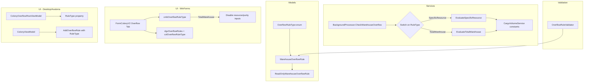

# Design Document: Overflow Rule Expansion

## Overview

This feature expands the colony warehouse overflow rule system to support multiple rule types with volume-based thresholds. The current system only supports per-resource quantity thresholds (`SpecificResource`). The expansion adds a `TotalWarehouse` rule type that triggers when the aggregate volume of all items in a colony warehouse exceeds a threshold.

All thresholds become volume-based (decimal), aligning with the existing `CargoVolumeService` volume model. For resources (1 volume/unit), this produces numerically identical results to the previous quantity-based behavior, ensuring backward compatibility.

**Key Design Decisions:**
- `OverflowRuleType` enum uses `[JsonConverter(typeof(StringEnumConverter))]` for human-readable JSON and forward compatibility.
- `TriggerThreshold` changes from `int` to `decimal` to support fractional volume thresholds.
- Backward compatibility via Newtonsoft.Json default value handling — missing `RuleType` defaults to `SpecificResource`.
- Evaluation logic uses a switch/dispatch pattern on `RuleType` for extensibility.

## Architecture



## Components and Interfaces

### 1. OverflowRuleType Enum (New)

**Location:** `OE2EmpireTracker.Common/Models/OverflowRuleType.cs`

```csharp
namespace OE2EmpireTracker.Models
{
    public enum OverflowRuleType
    {
        SpecificResource = 0,
        TotalWarehouse = 1
    }
}
```

- Default value is `SpecificResource` (0), ensuring backward compatibility when the field is missing from JSON.
- Defined in the Models namespace alongside `DestinationType` and other model enums.

### 2. WarehouseOverflowRule Model Changes

**Location:** `OE2EmpireTracker.Common/Models/WarehouseOverflowRule.cs`

Changes:
- Add `RuleType` property with `[JsonConverter(typeof(StringEnumConverter))]`
- Change `TriggerThreshold` from `int` to `decimal`

```csharp
[JsonConverter(typeof(StringEnumConverter))]
public OverflowRuleType RuleType { get; set; } = OverflowRuleType.SpecificResource;

public decimal TriggerThreshold { get; set; } = 0m;
```

### 3. ReadOnlyWarehouseOverflowRule Changes

**Location:** `OE2EmpireTracker.Common/Models/ReadOnlyWarehouseOverflowRule.cs`

Changes:
- Expose `RuleType` property (getter only)
- Change `TriggerThreshold` return type from `int` to `decimal`

### 4. OverflowRuleValidator (New)

**Location:** `OE2EmpireTracker.Common/Services/OverflowRuleValidator.cs`

Static validation class that validates a `WarehouseOverflowRule` and returns a list of validation errors.

```csharp
public static class OverflowRuleValidator
{
    public static List<string> Validate(WarehouseOverflowRule rule)
    {
        var errors = new List<string>();

        if (rule.TriggerThreshold <= 0m)
            errors.Add("TriggerThreshold must be greater than zero.");

        if (string.IsNullOrEmpty(rule.DestinationUUID))
            errors.Add("DestinationUUID is required.");

        if (string.IsNullOrEmpty(rule.DeliveryRouteUUID))
            errors.Add("DeliveryRouteUUID is required.");

        if (rule.RuleType == OverflowRuleType.SpecificResource)
        {
            if (string.IsNullOrEmpty(rule.ResourceName))
                errors.Add("ResourceName is required for SpecificResource rules.");
            if (string.IsNullOrEmpty(rule.ResourcePurity))
                errors.Add("ResourcePurity is required for SpecificResource rules.");
        }

        return errors;
    }
}
```

### 5. BackgroundProcessor Evaluation Changes

**Location:** `OE2EmpireTracker.Common/Services/BackgroundProcessor.cs`

The `CheckWarehouseOverflow` method is refactored to dispatch on `RuleType`:

```csharp
private int CheckWarehouseOverflow(List<Colony> colonies)
{
    var rules = _playerContext.WarehouseOverflowRuleList;
    if (rules == null || rules.Count == 0) return 0;

    int overflowCount = 0;
    var activeRules = rules.Where(r => r.IsActive).ToList();

    foreach (var rule in activeRules)
    {
        var colony = colonies.FirstOrDefault(c => c.UUID == rule.ColonyUUID);
        if (colony == null || colony.Items == null) continue;

        switch (rule.RuleType)
        {
            case OverflowRuleType.SpecificResource:
                if (EvaluateSpecificResourceRule(rule, colony))
                    overflowCount++;
                break;
            case OverflowRuleType.TotalWarehouse:
                if (EvaluateTotalWarehouseRule(rule, colony))
                    overflowCount++;
                break;
            default:
                Log.Warn("Unknown RuleType {0} for rule {1}, skipping", rule.RuleType, rule.UUID);
                break;
        }
    }

    return overflowCount;
}
```

#### EvaluateSpecificResourceRule

Filters items by `ResourceName` and `ResourcePurity`, computes volume using per-unit volume constants, and compares against threshold.

```csharp
private bool EvaluateSpecificResourceRule(WarehouseOverflowRule rule, Colony colony)
{
    var items = colony.Items.FindResource(rule.ResourceName, rule.ResourcePurity);
    decimal currentVolume = items.Sum(i => i.Quantity * GameConstants.VolumeResource);
    // Resources always have volume = 1 per unit

    if (currentVolume > rule.TriggerThreshold && rule.TriggerThreshold > 0m)
    {
        decimal excess = currentVolume - rule.TriggerThreshold;
        Log.Info(
            "Overflow detected: colony={0} resource={1}({2}) volume={3} threshold={4} excess={5}",
            colony.ColonyName, rule.ResourceName, rule.ResourcePurity,
            currentVolume, rule.TriggerThreshold, excess);
        return true;
    }
    return false;
}
```

#### EvaluateTotalWarehouseRule

Computes total volume of all items in the warehouse using CargoVolumeService volume constants per item type.

```csharp
private bool EvaluateTotalWarehouseRule(WarehouseOverflowRule rule, Colony colony)
{
    decimal totalVolume = ComputeWarehouseVolume(colony.Items);

    if (totalVolume > rule.TriggerThreshold && rule.TriggerThreshold > 0m)
    {
        decimal excess = totalVolume - rule.TriggerThreshold;
        Log.Info(
            "Total warehouse overflow: colony={0} volume={1} threshold={2} excess={3}",
            colony.ColonyName, totalVolume, rule.TriggerThreshold, excess);
        return true;
    }
    return false;
}

private decimal ComputeWarehouseVolume(ItemBag items)
{
    decimal total = 0m;
    foreach (var kvp in items.Items)
    {
        var item = kvp.Value;
        decimal unitVolume = GetItemUnitVolume(item);
        total += item.Quantity * unitVolume;
    }
    return total;
}

private decimal GetItemUnitVolume(Item item)
{
    switch (item.ItemType)
    {
        case ItemType.ItemTypeEnum.Resource: return GameConstants.VolumeResource;
        case ItemType.ItemTypeEnum.Commodity: return GameConstants.VolumeCommodity;
        case ItemType.ItemTypeEnum.WorkDetail: return GameConstants.VolumeWorkDetail;
        case ItemType.ItemTypeEnum.Blueprint: return GameConstants.VolumeBlueprint;
        case ItemType.ItemTypeEnum.Survey: return GameConstants.VolumeSurvey;
        default:
            // Manufactured items: use Volume property from item (set from blueprint CargoVolumeSize)
            return item.Volume;
    }
}
```

### 6. ColonyOverflowRowViewModel Changes (Desktop/Avalonia)

**Location:** `OE2EmpireTracker.Desktop/ViewModels/ColonyViewModel.cs`

Add `RuleType` property and change `Threshold` from `int` to `decimal`:

```csharp
public sealed partial class ColonyOverflowRowViewModel : ObservableObject
{
    [ObservableProperty]
    private string _ruleType = "SpecificResource";

    [ObservableProperty]
    private string _resourceName = string.Empty;

    [ObservableProperty]
    private string _purity = string.Empty;

    [ObservableProperty]
    private decimal _threshold;

    [ObservableProperty]
    private string _destination = string.Empty;

    public string RuleUuid { get; set; } = string.Empty;
}
```

### 7. FormColonyV2 Overflow Tab Changes (WinForms)

**Location:** `OE2EmpireTracker/Forms/ColonyV2/FormColonyV2.cs` and `.Designer.cs`

UI Changes:
- Add `colOverflowRuleType` column (DataGridViewTextBoxColumn) as the first column in `dgvOverflowRules`
- Add `cmbOverflowRuleType` (ComboBox) to the add-rule panel with items "SpecificResource" and "TotalWarehouse"
- When `cmbOverflowRuleType` selection is "TotalWarehouse": disable `cmbOverflowResource` and `cmbOverflowPurity`
- When `cmbOverflowRuleType` selection is "SpecificResource": enable `cmbOverflowResource` and `cmbOverflowPurity`
- For TotalWarehouse rows in the grid: show Resource and Purity cells as empty string

Logic Changes:
- `PopulateOverflowGrid()`: include RuleType in row data, show empty resource/purity for TotalWarehouse rules
- `CmdAddOverflowRule_Click`: read selected RuleType, set on new rule, validate via `OverflowRuleValidator`
- `txtOverflowThreshold`: accept decimal input (change validation pattern)

## Data Models

### WarehouseOverflowRule (Updated)

| Property | Type | Default | JSON Name | Notes |
|----------|------|---------|-----------|-------|
| UUID | string | — | UUID | Unchanged |
| OwnerUUID | string | "" | OwnerUUID | Unchanged |
| IsActive | bool | true | IsActive | Unchanged |
| ColonyUUID | string | "" | ColonyUUID | Unchanged |
| **RuleType** | OverflowRuleType | SpecificResource | RuleType | **NEW** — serialized as string |
| ResourceName | string | "" | ResourceName | Unchanged — ignored for TotalWarehouse |
| ResourcePurity | string | "" | ResourcePurity | Unchanged — ignored for TotalWarehouse |
| **TriggerThreshold** | decimal | 0m | TriggerThreshold | **CHANGED** from int to decimal |
| DestinationType | DestinationType | Station | DestinationType | Unchanged |
| DestinationUUID | string | "" | DestinationUUID | Unchanged |
| DeliveryRouteUUID | string | "" | DeliveryRouteUUID | Unchanged |

### OverflowRuleType Enum (New)

| Value | Int | Description |
|-------|-----|-------------|
| SpecificResource | 0 | Triggers on volume of a specific resource+purity |
| TotalWarehouse | 1 | Triggers on total warehouse volume |

### Backward Compatibility

Newtonsoft.Json handles backward compatibility naturally:
- Missing `RuleType` field → defaults to `SpecificResource` (enum default = 0)
- Integer `TriggerThreshold` in JSON → Newtonsoft.Json implicitly converts int to decimal
- All existing JSON property names are preserved exactly as-is

No migration step is needed. Existing JSON files will deserialize correctly without modification.


## Correctness Properties

*A property is a characteristic or behavior that should hold true across all valid executions of a system — essentially, a formal statement about what the system should do. Properties serve as the bridge between human-readable specifications and machine-verifiable correctness guarantees.*

### Property 1: Serialization Round-Trip Preserves Rule Data

*For any* valid `WarehouseOverflowRule` with any `OverflowRuleType` value, serializing to JSON and deserializing back SHALL produce an equivalent object with all fields preserved, and the `RuleType` field in JSON SHALL be a string (not an integer).

**Validates: Requirements 1.4, 5.3**

### Property 2: SpecificResource Volume Computation Equals Quantity for Resources

*For any* colony warehouse containing resource items (ItemType = Resource, volume = 1 per unit) and a SpecificResource rule targeting those items, the computed volume SHALL equal the sum of quantities of matching items (filtered by ResourceName and ResourcePurity).

**Validates: Requirements 2.2, 2.3, 2.4, 3.1**

### Property 3: TotalWarehouse Volume Computation Uses Correct Per-Unit Volumes

*For any* colony warehouse containing items of mixed types, the total warehouse volume SHALL equal the sum of (quantity × per-unit volume) for every item, where per-unit volumes are: resources = 1, commodities = 10, workers = 50, blueprints/surveys = 0, manufactured items = item.Volume.

**Validates: Requirements 4.1, 4.5**

### Property 4: Excess Volume Calculation

*For any* overflow rule evaluation where the computed volume exceeds the threshold, the excess volume SHALL equal (computed volume − threshold). When computed volume is less than or equal to threshold, no overflow SHALL be detected.

**Validates: Requirements 3.2, 4.2**

### Property 5: SpecificResource Validation Requires Resource Fields

*For any* `WarehouseOverflowRule` with `RuleType = SpecificResource`, if `ResourceName` is empty OR `ResourcePurity` is empty, validation SHALL reject the rule. If both are non-empty (and other common fields are valid), validation SHALL accept the rule.

**Validates: Requirements 3.4, 7.1, 7.2**

### Property 6: TotalWarehouse Validation Ignores Resource Fields

*For any* `WarehouseOverflowRule` with `RuleType = TotalWarehouse`, validation SHALL NOT reject the rule due to empty `ResourceName` or `ResourcePurity` fields. The rule SHALL be accepted if all common fields (TriggerThreshold > 0, DestinationUUID non-empty, DeliveryRouteUUID non-empty) are valid.

**Validates: Requirements 4.4, 7.6**

### Property 7: Common Validation Rejects Invalid Rules

*For any* `WarehouseOverflowRule` (regardless of RuleType), if `TriggerThreshold` ≤ 0 OR `DestinationUUID` is empty OR `DeliveryRouteUUID` is empty, validation SHALL reject the rule with appropriate error messages.

**Validates: Requirements 7.3, 7.4, 7.5**

## Error Handling

### Evaluation Errors

| Scenario | Handling |
|----------|----------|
| Colony not found for rule's ColonyUUID | Skip rule silently (colony may have been deleted) |
| Colony.Items is null | Skip rule silently |
| Unknown RuleType value | Log warning, skip rule (Req 8.2) |
| Exception during single rule evaluation | Log error, continue with next rule |
| Manufactured item with Volume = 0 | Use 0 volume (item contributes nothing) |

### Validation Errors

| Scenario | Handling |
|----------|----------|
| Invalid rule submitted via UI | Show validation errors in MessageBox, do not persist |
| Invalid rule in persisted data | Evaluate normally (validation is for creation only) |

### Deserialization Errors

| Scenario | Handling |
|----------|----------|
| Missing RuleType field | Default to SpecificResource (enum default) |
| Integer TriggerThreshold | Implicit conversion to decimal by Newtonsoft.Json |
| Unknown RuleType string in JSON | Newtonsoft.Json throws — caught by PlayerContext load error handling |

## Testing Strategy

### Property-Based Tests (FsCheck + NUnit)

**Library:** FsCheck 2.16.6 (already in project)
**Minimum iterations:** 100 per property

Each property test will:
1. Generate random `WarehouseOverflowRule` instances with varying RuleType, thresholds, and resource fields
2. Generate random `ItemBag` contents with items of different types and quantities
3. Verify the property holds across all generated inputs

**Tag format:** `Feature: overflow-rule-expansion, Property N: <property text>`

Tests will be placed in `OE2EmpireTracker.Tests/Services/OverflowRuleExpansionPropertyTests.cs`.

### Unit Tests (NUnit)

Example-based tests for:
- Backward compatibility deserialization (legacy JSON without RuleType, integer threshold)
- Logging output verification (correct fields logged for each rule type)
- UI behavior (TotalWarehouse disables resource/purity inputs)
- Unknown RuleType handling (warning logged, rule skipped)
- Default value behavior (new rule defaults to SpecificResource)

Tests will be placed in `OE2EmpireTracker.Tests/Services/OverflowRuleExpansionTests.cs`.

### Integration Points

- `BackgroundProcessor` integration: verify the full cycle processes both rule types
- `PlayerContext` persistence: verify rules round-trip through save/load
- `ColonyReferenceCounter`: verify it still counts overflow rule references correctly after model changes
