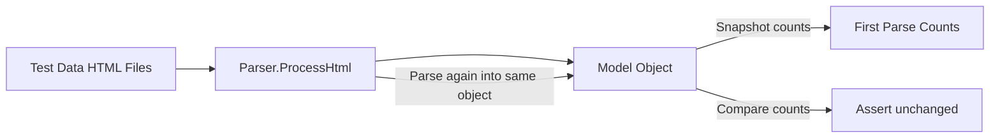

# Design Document: Parser Idempotency Tests

## Overview

This feature adds idempotency verification tests for the `SurveyParser` and `ColonyParser` classes. The tests confirm that parsing the same HTML into the same model object multiple times does not create duplicate child records (resources, structures, commodities). This follows the same idempotency testing pattern established in `MarketBlueprintImporterTests.cs`.

No production code changes are expected. This is a test-only feature.

## Architecture

The tests live in the existing test project under `OE2EmpireTracker.Tests/Parsers/`. Two new test classes will be added:

- `SurveyParserIdempotencyTests.cs` — tests for `SurveyParser.ProcessHtml()` re-import behavior
- `ColonyParserIdempotencyTests.cs` — tests for `ColonyParser.ProcessHtml()` re-import behavior (structures and commodities)

### Test Pattern

Each idempotency test follows this sequence:

1. Create a fresh model object (Survey or Colony)
2. Parse the HTML into it once
3. Snapshot the child collection counts (and optionally key field values)
4. Parse the same HTML into the same object again (2nd pass)
5. Assert counts are unchanged from the snapshot
6. Optionally repeat for a 3rd pass

This mirrors the pattern in `MarketBlueprintImporterTests.cs` lines 580–920 where property counts and resource counts are snapshotted after first import and verified stable after subsequent imports.

### Sweep Tests

For each parser, a "sweep" test iterates over all available test data HTML files of the appropriate type, applying the idempotency check to each. This ensures coverage across all HTML variants without writing per-file tests for every fixture.

## Components and Interfaces

### SurveyParserIdempotencyTests

| Test Method | Description |
|---|---|
| `ZehVazoran_ParseTwice_ResourceCountUnchanged` | Parse ZehVazoranIIM2.html twice into same Survey, verify `Resources.Count` stable |
| `ZehVazoran_ParseThreeTimes_ResourceCountUnchanged` | Same but 3 passes |
| `ZehVazoran_ParseTwice_ResourceValuesPreserved` | Verify resource name/purity/amount unchanged after 2nd parse |
| `AllSurveyFiles_ParseTwice_ResourceCountUnchanged` | Sweep all survey HTML files, verify resource count idempotency for each |
| `AllSurveyFiles_ParseTwice_ResourceValuesPreserved` | Sweep all survey HTML files, verify resource values stability for each |

### ColonyParserIdempotencyTests

| Test Method | Description |
|---|---|
| `M1_ParseTwice_StructureCountUnchanged` | Parse M1 HTML twice, verify `Structures.Count` stable |
| `M1_ParseThreeTimes_StructureCountUnchanged` | Same but 3 passes |
| `M1_ParseTwice_StructureValuesPreserved` | Verify FlatpackBlueprintUUID and gameSequence unchanged |
| `M2_2_ParseTwice_CommodityCountUnchanged` | Parse M2-2 HTML twice, verify `Commodities.Count` stable |
| `M2_2_ParseThreeTimes_CommodityCountUnchanged` | Same but 3 passes |
| `M2_2_ParseTwice_CommodityValuesPreserved` | Verify commodity name/requested/fulfilled unchanged |
| `AllColonyFiles_ParseTwice_StructureCountUnchanged` | Sweep all colony HTML files for structure count idempotency |
| `AllColonyFiles_ParseTwice_StructureValuesPreserved` | Sweep all colony HTML files for structure values stability |
| `AllColonyFiles_ParseTwice_CommodityCountUnchanged` | Sweep colony files with commodities for commodity count idempotency |
| `AllColonyFiles_ParseTwice_CommodityValuesPreserved` | Sweep colony files with commodities for commodity values stability |

### Test Infrastructure

Both test classes reuse the existing patterns from `ColonyParserTests` and `SurveyParserTests`:

- `TestHelper.SetEmpireFilePath()` for baseline data
- `LoadTestData(filename)` to read HTML from `TestData/`
- `ExtractFragment(clipboardData)` via `BlueprintScanner.ExtractHtmlFragmentFromClipboardData()`
- `EmpireContext.Reset()` in SetUp/TearDown for clean state

### Test Data Files

Survey files:
- `ZehVazoranIIM2.html`
- `QuogarV2249II.html`

Colony files:
- `ClnyHexAdministrationTabZehVazoranIIM1.html` (local colony, 43 structures, no commodities)
- `ClnyHexAdministrationTabZehVazoranIIM2.html` (non-local, workers fallback)
- `ClnyHexAdministrationTabZehVazoranIIM2-2.html` (non-local, has commodity demands)
- `ClnyHexAdministrationTabZehVazoranIIM2-3.html` (non-local variant)
- `ClnyHexAdministrationTabZehVazoranVI-1.html` (non-local, commodity factory buildings)

## Data Models

No new data models. The tests operate on existing models:

- `Survey` — `Resources: Dictionary<string, SurveyResource>` keyed by resource name. The dictionary's key-based storage means re-parsing overwrites existing entries rather than duplicating them. Idempotency tests verify the count stays the same and values are preserved.

- `Colony` — `Structures: List<ColonyStructure>` and `Commodities: List<CommodityRequested>`. The parsers use merge logic:
  - `ParseColonyBuildingsFromJson` merges by `gameSequence` (existing structures are updated, not duplicated)
  - `ParseColonyBuildingsFromWorkers` merges by `FlatpackBlueprintUUID` count (only adds if fewer exist than HTML shows)
  - `ParseCommodityDemands` merges by commodity `Name` (existing entries are updated, not duplicated)

## Correctness Properties

*A property is a characteristic or behavior that should hold true across all valid executions of a system — essentially, a formal statement about what the system should do. Properties serve as the bridge between human-readable specifications and machine-verifiable correctness guarantees.*

### Property 1: Survey resource count idempotency

*For any* survey test data HTML file, parsing it into a fresh Survey object once and then parsing the same HTML into the same Survey object a second time should produce the same `Resources.Count` as after the first parse.

**Validates: Requirements 1.1, 1.2, 1.4**

### Property 2: Survey resource values stability

*For any* survey test data HTML file, after parsing it into a Survey object twice, every resource entry should have the same resource name, purity, and amount values as after the first parse.

**Validates: Requirements 1.3**

### Property 3: Colony structure count idempotency

*For any* colony test data HTML file, parsing it into a fresh Colony object once and then parsing the same HTML into the same Colony object a second time should produce the same `Structures.Count` as after the first parse.

**Validates: Requirements 2.1, 2.2, 2.4**

### Property 4: Colony structure values stability

*For any* colony test data HTML file, after parsing it into a Colony object twice, every structure should have the same `FlatpackBlueprintUUID` and `gameSequence` values as after the first parse.

**Validates: Requirements 2.3**

### Property 5: Colony commodity count idempotency

*For any* colony test data HTML file that contains commodity demands, parsing it into a fresh Colony object once and then parsing the same HTML into the same Colony object a second time should produce the same `Commodities.Count` as after the first parse.

**Validates: Requirements 3.1, 3.2, 3.4**

### Property 6: Colony commodity values stability

*For any* colony test data HTML file that contains commodity demands, after parsing it into a Colony object twice, every commodity entry should have the same name, requested amount, and fulfilled status as after the first parse.

**Validates: Requirements 3.3**

## Error Handling

No new error handling is needed. The tests exercise existing parser error handling paths. If a parser fails to handle re-import correctly (e.g., duplicates records), the test assertions will catch it via count mismatches or value changes.

## Testing Strategy

### Dual Testing Approach

- **Unit tests**: Specific per-file idempotency checks (e.g., M1 parsed twice, ZehVazoran parsed twice) that verify exact counts and values for known fixtures. These serve as concrete examples and catch regressions in specific HTML variants. Also includes 3-pass tests as edge cases.
- **Property tests**: Sweep tests that iterate over all available test data files and verify idempotency universally. These are the property-based tests — they quantify over all inputs (all HTML fixtures) rather than testing a single specific file.

### Property-Based Testing Configuration

Since the input domain is the set of test data HTML files (not randomly generated), the property tests are implemented as parameterized sweep tests rather than using a PBT library. Each sweep test iterates over all matching files in `TestData/` and asserts the idempotency property for each.

- Survey sweep: all `*.html` files matching survey patterns (`ZehVazoranIIM2.html`, `QuogarV2249II.html`)
- Colony sweep: all `ClnyHex*.html` files
- Commodity sweep: subset of colony files that produce `Commodities.Count > 0` after first parse

Each property test must include a comment referencing the design property:
- **Feature: parser-idempotency-tests, Property 1: Survey resource count idempotency**
- **Feature: parser-idempotency-tests, Property 2: Survey resource values stability**
- **Feature: parser-idempotency-tests, Property 3: Colony structure count idempotency**
- **Feature: parser-idempotency-tests, Property 4: Colony structure values stability**
- **Feature: parser-idempotency-tests, Property 5: Colony commodity count idempotency**
- **Feature: parser-idempotency-tests, Property 6: Colony commodity values stability**

### Test Organization

- `SurveyParserIdempotencyTests.cs` in `OE2EmpireTracker.Tests/Parsers/`
- `ColonyParserIdempotencyTests.cs` in `OE2EmpireTracker.Tests/Parsers/`
- Both use NUnit 4.5.1 `[TestFixture]` / `[Test]` attributes
- SetUp/TearDown follow existing patterns (reset singletons, set file paths)
