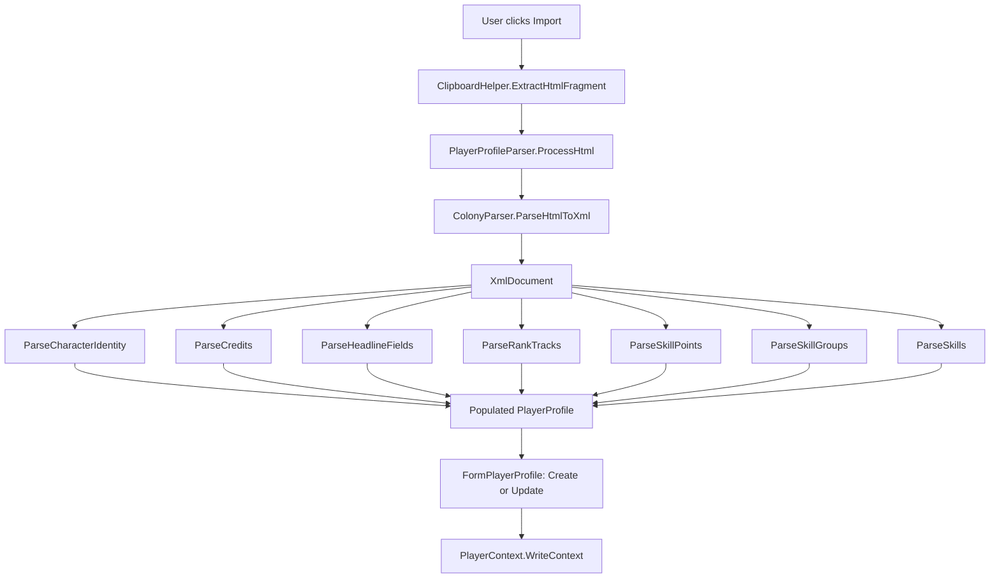

# Design Document: Player Profile Import

## Overview

This feature adds a `PlayerProfileParser` that extracts character data from clipboard HTML copied from the OE2 game's profile panel. The parser follows the same SgmlReader → XmlDocument → XPath pattern established by `ColonyParser` and `SurveyParser`. An Import button on `FormPlayerProfile` triggers the clipboard read, invokes the parser, and creates or updates the matching `PlayerProfile` in `PlayerContext`.

The HTML source is a full-page clipboard copy of the game UI. The parser must extract data from two regions:
1. The top bar (`ui_character_detail`, `ui_credit_detail`) for name, faction, and credits
2. The profile slideout panel (CSS class-based selectors) for ranks, skill points, skill groups, individual skills, citizen ID, registration date, and active time

## Architecture



The parser is a stateless service class. Each `Parse*` method receives the `XmlDocument` and the target `PlayerProfile`, extracting one logical section. This mirrors how `ColonyParser.ProcessHtml` delegates to `ParsePlanetOverview`, `ParseColonyBuildings`, etc.

## Components and Interfaces

### PlayerProfileParser

New class in `OE2EmpireTracker/Parsers/PlayerProfileParser.cs`.

```csharp
public class PlayerProfileParser
{
    // Entry points (same pattern as ColonyParser/SurveyParser)
    public void ProcessHtml(PlayerProfile profile, string htmlFragment);
    public void ProcessClipboard(PlayerProfile profile);

    // Internal extraction methods — all internal static for testability
    internal static void ParseCharacterIdentity(PlayerProfile profile, XmlDocument doc);
    internal static void ParseCredits(PlayerProfile profile, XmlDocument doc);
    internal static void ParseHeadlineFields(PlayerProfile profile, XmlDocument doc);
    internal static void ParseRankTracks(PlayerProfile profile, XmlDocument doc);
    internal static void ParseSkillPoints(PlayerProfile profile, XmlDocument doc);
    internal static void ParseSkillGroups(PlayerProfile profile, XmlDocument doc);
    internal static void ParseSkills(PlayerProfile profile, XmlDocument doc);

    // Utility
    internal static long ParseFormattedNumber(string text);
    internal static string NormalizeWhitespace(string text);
}
```

### Model Extensions

`PlayerProfile` gains three new string properties:
- `CitizenId` (default `string.Empty`)
- `RegistrationDate` (default `string.Empty`)
- `ActiveTime` (default `string.Empty`)

`PlayerRank` gains one new string property:
- `Title` (default `string.Empty`)

All default to `string.Empty` so existing JSON deserialization is unaffected.

### Form Integration

`FormPlayerProfile` gains:
- An `Import` button (`cmdImport`) in the `flpCommands` panel
- A click handler that reads clipboard HTML, invokes `PlayerProfileParser`, and either creates a new profile or updates an existing one matched by name (case-insensitive)
- On success, refreshes the form and list view; on failure, shows a `MessageBox` with the error

### XPath Query Strategy

All element lookups use `contains(@class, 'ClassName')` XPath predicates, consistent with `ColonyParser`. Key selectors:

| Data | XPath |
|------|-------|
| Character name | `//div[@id='ui_character_detail']//div[contains(@class,'ui_text_white')]` |
| Faction tag | `//div[@id='ui_character_detail']//div[contains(@class,'ui_text_purple')]` |
| Credits tooltip | `//div[@id='ui_credit_detail']//div[@data-ui-tooltip]` |
| Headline rows | `//div[contains(@class,'ProfileHeadlineRow')]` |
| Headline label | `.//div[contains(@class,'ProfileHeadline_Title')]` |
| Headline value | `.//div[contains(@class,'ProfileHeadline_Text')]` |
| Rank level (left panel) | `//div[contains(@class,'ProfileTopLeft_LevelTextLevel')]` |
| Rank title | `//div[contains(@class,'ProfileTopLeft_LevelNameText')]` |
| XP bar text | `//div[contains(@class,'Profile_TrackInformation_Section_LevelTrack_Bar_Text')]` |
| Rank track section | `//div[contains(@class,'Profile_TrackInformation_Section')]` |
| Skill points | `//div[contains(@class,'Profile_Skills_BankedContainer_Available')]` |
| Skill group | `//div[contains(@class,'Profile_Skill_Group')]` |
| Skill group name | `.//div[contains(@class,'Profile_Skill_Group_Name')]` |
| Skill group disabled | `.//div[contains(@class,'Profile_Skill_Group_Disabled')]` |
| Individual skill | `.//div[contains(@class,'Profile_Skill_Group_Skills_Skill')]` |
| Skill name | `.//div[contains(@class,'Profile_Skill_Group_Skills_Skill_Name')]` |
| Completed level boxes | `.//div[contains(@class,'Profile_Skill_Group_Skills_Skill_Level_Box_Complete')]` |
| Training box | `.//div[contains(@class,'Profile_Skill_Group_Skills_Skill_Level_Box_Training')]` |
| Training time | `.//div[contains(@class,'Profile_Skill_Group_Skills_Skill_Level_Training_Description')]` |

### Rank Track Identification

The three rank tracks are identified by color CSS classes on the rank level number or XP bar:
- Public: `ui_text_yellow_light` or `Bar_Public`
- Private: `ui_text_blue_light` or `Bar_Private`
- Military: `ui_text_red_light` or `Bar_Military`

The left-panel rank boxes use vertical text (P/U/B, P/R/I, M/I/L) with color classes on the level number. The profile panel rank sections use `Profile_TrackInformation_Section_LevelTrack_Bar_Public`, `_Private`, `_Military` to distinguish tracks.

### Skill Name and Group Matching

Display names from the HTML are matched to `SkillName` and `SkillGroupName` enum values using the `Description` attribute via the existing `ToDisplayName()` extension methods. The parser iterates all enum values and builds a reverse lookup dictionary (display name → enum value) at parse time.

## Data Models

### PlayerProfile (extended)

```csharp
public class PlayerProfile
{
    // Existing properties
    public string UUID { get; set; } = string.Empty;
    public string Name { get; set; } = string.Empty;
    public string Faction { get; set; } = string.Empty;
    public decimal TotalCredits { get; set; } = 0;
    public PlayerRank Public { get; set; } = new PlayerRank();
    public PlayerRank Private { get; set; } = new PlayerRank();
    public PlayerRank Military { get; set; } = new PlayerRank();
    public int SkillPoints { get; set; } = 0;

    // New properties (Requirement 9)
    public string CitizenId { get; set; } = string.Empty;
    public string RegistrationDate { get; set; } = string.Empty;
    public string ActiveTime { get; set; } = string.Empty;
}
```

### PlayerRank (extended)

```csharp
public class PlayerRank
{
    // Existing properties
    public int Rank { get; set; } = 0;
    public long CurrentXP { get; set; } = 0;
    public long NextXP { get; set; } = 0;

    // New property (Requirement 9)
    public string Title { get; set; } = string.Empty;
}
```

### Parsed Data Flow

The parser populates a `PlayerProfile` object directly. The form layer then decides whether to merge into an existing profile or add a new one. This is the same pattern used by `ColonyParser` (parse into a temp object, then merge).


## Correctness Properties

*A property is a characteristic or behavior that should hold true across all valid executions of a system — essentially, a formal statement about what the system should do. Properties serve as the bridge between human-readable specifications and machine-verifiable correctness guarantees.*

### Property 1: Formatted number round-trip

*For any* non-negative decimal value, formatting it as a comma-separated string (e.g. `#1,234,567.89` or `1,010,379`) and then parsing it with `ParseFormattedNumber` or the credit-parsing logic should yield the original numeric value.

This covers credit parsing (Requirement 2.1) where the tooltip format is `#N,NNN,NNN.NN`, and XP parsing (Requirement 3.2) where the format is `N,NNN,NNN / N,NNN,NNN`. The core operation is the same: strip non-numeric characters (except `.`) and parse. By testing the round-trip on the shared number-parsing utility, we validate both use cases.

**Validates: Requirements 2.1, 3.2**

### Property 2: Enum display name round-trip

*For any* `SkillName` or `SkillGroupName` enum value, converting it to its display name via `ToDisplayName()` and then looking it up in the parser's reverse dictionary should yield the original enum value.

This ensures the parser's reverse lookup dictionary (display name → enum) is complete and consistent with the `Description` attributes. If any enum value's display name doesn't round-trip, the parser will silently skip that skill or group.

**Validates: Requirements 5.1, 5.4, 6.4**

### Property 3: Training time parsing

*For any* combination of days (0–99) and hours (0–23), formatting them as the game's training time string (e.g. "22 days, 9 hours" or "5 hours") and parsing with the training time parser should produce a `CountDownTime` whose `TimeRemaining` is within 1 second of the expected total seconds.

This validates that the parser correctly handles the game's training time format, including edge cases like zero days or zero hours.

**Validates: Requirements 6.3**

### Property 4: Profile update by case-insensitive name match

*For any* list of existing `PlayerProfile` objects and *for any* parsed profile whose name matches an existing profile's name under case-insensitive comparison, the import-merge logic should update the existing profile's data fields while preserving its UUID.

This ensures that re-importing a profile doesn't create duplicates and that the case-insensitive matching works correctly regardless of the casing used in the game's HTML.

**Validates: Requirements 7.1, 7.3**

### Property 5: Profile creation when no name match exists

*For any* list of existing `PlayerProfile` objects and *for any* parsed profile whose name does not match any existing profile (case-insensitive), the import logic should add a new profile with a non-empty UUID, and the resulting list should be one element longer.

**Validates: Requirements 7.2**

### Property 6: Serialization backward compatibility

*For any* `PlayerProfile` serialized to JSON, deserializing it back should produce an object where `CitizenId`, `RegistrationDate`, and `ActiveTime` are `string.Empty` (not null) when those fields were absent from the JSON. Similarly, *for any* `PlayerRank`, the `Title` property should default to `string.Empty`.

This validates that existing save files (which lack the new fields) load without errors and that the new properties have safe defaults.

**Validates: Requirements 9.7**

## Error Handling

The parser follows the same defensive pattern as `ColonyParser` and `SurveyParser`:

- **Missing elements**: Each `Parse*` method checks for null XPath results before accessing properties. Missing elements are logged at Warning level and the corresponding profile fields are left unchanged.
- **Malformed values**: Number parsing uses `TryParse` with fallback to 0 or the existing value. The parser never throws on bad input.
- **Missing clipboard HTML**: `ProcessClipboard` checks `Clipboard.ContainsText(TextDataFormat.Html)` before attempting extraction. If no HTML is present, it returns early without modifying the profile.
- **SgmlReader failures**: The `ParseHtmlToXml` call is wrapped in a try/catch (reusing `ColonyParser.ParseHtmlToXml` which already handles this). A null document causes an early return.
- **Unknown skill/group names**: Display names that don't match any enum value are logged at Warning level and skipped. This handles future game updates that add new skills.
- **Form-level errors**: The Import button handler wraps the entire operation in try/catch, showing a `MessageBox` on unexpected exceptions. Missing clipboard data shows an informational message (not an error).

## Testing Strategy

### Unit Tests (NUnit)

Unit tests verify specific examples and edge cases using the sample HTML file (`PlayerProfileScalorn.html`):

- **Integration tests**: Parse the full sample HTML and assert specific extracted values (name = "Scalorn Scorpus", faction = "NEC", credits = 11982019.28, public rank = 42, etc.)
- **Edge cases**: Empty HTML, missing elements, malformed numbers, unknown skill names
- **Model tests**: New property defaults, serialization round-trip with missing fields
- **Form tests**: Import button exists on the form

Test data is loaded from `OE2EmpireTracker.Tests/TestData/PlayerProfileScalorn.html` using the same `LoadTestData` / `ExtractFragment` pattern as `SurveyParserTests`.

### Property-Based Tests (FsCheck 2.16.6 + FsCheck.NUnit)

Property tests verify universal correctness properties across randomly generated inputs. Each property test runs a minimum of 100 iterations.

Each test is tagged with a comment referencing the design property:
```
// Feature: player-profile-import, Property N: <property text>
```

Property tests to implement:
1. **Formatted number round-trip** — Generate random non-negative decimals, format with commas, parse back, assert equality
2. **Enum display name round-trip** — For all SkillName and SkillGroupName values, assert ToDisplayName → reverse lookup = identity
3. **Training time parsing** — Generate random (days, hours) pairs, format as game string, parse, assert correct seconds
4. **Profile update by name match** — Generate profile lists and a parsed profile with a matching name (case-shuffled), assert UUID preserved and data updated
5. **Profile creation when no match** — Generate profile lists and a parsed profile with a unique name, assert list grows by one with non-empty UUID
6. **Serialization backward compatibility** — Generate PlayerProfile/PlayerRank objects, serialize to JSON, remove new fields, deserialize, assert defaults are string.Empty
