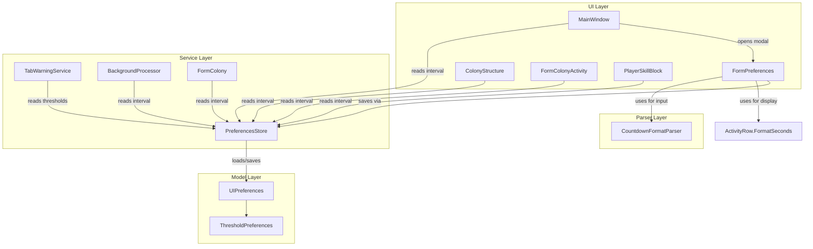

# Design Document: Preferences Form

## Overview

This feature adds a Preferences form to OE2EmpireTracker that lets users configure nine values currently hardcoded across multiple services and forms: six TabWarningService thresholds (structure count yellow/red, worker request due window yellow/red, colony import staleness yellow/red), a BackgroundProcessor interval, a FormColony admin refresh interval, and a countdown display refresh rate shared by four forms. Values are persisted in the existing UIPreferences.json via PreferencesStore and take effect immediately without restart.

The design introduces:
- A `ThresholdPreferences` model class added to `UIPreferences`
- A `CountdownFormatParser` static utility (inverse of `ActivityRow.FormatSeconds`)
- A `FormPreferences` modal WinForms dialog
- Modifications to `TabWarningService` to read from PreferencesStore instead of constants
- Modifications to `BackgroundProcessor`, `FormColony`, and four countdown-timer forms to read intervals from PreferencesStore
- A "Preferences..." menu item in MainWindow's File menu

## Architecture



The architecture follows the existing layered pattern: Models (POCOs) → Services (domain logic) → Forms (UI). The key design decision is that `TabWarningService` transitions from pure `const`/`readonly` fields to reading from `PreferencesStore.GetInstance()` on each evaluation call. This means threshold changes take effect immediately without any event wiring — the next call to `EvaluateStructureWarning`, `EvaluateWorkerWarning`, or `EvaluateColonyImportStalenessWarning` simply reads the current values.

For timer-based intervals (BackgroundProcessor, FormColony, countdown forms), the forms read the interval from PreferencesStore when they next reschedule their timer. No push notification is needed — each timer cycle naturally picks up the latest value.

## Components and Interfaces

### ThresholdPreferences (Model)

New class in `OE2EmpireTracker/Models/UIPreferences.cs`:

```csharp
public class ThresholdPreferences
{
    public int StructureCountYellow { get; set; } = 60;
    public int StructureCountRed { get; set; } = 66;
    public long WorkerRequestYellowSeconds { get; set; } = 172800;  // 2 days
    public long WorkerRequestRedSeconds { get; set; } = 86400;      // 1 day
    public long ColonyImportStalenessYellowSeconds { get; set; } = 432000; // 5 days
    public long ColonyImportStalenessRedSeconds { get; set; } = 518400;    // 6 days
    public long BackgroundProcessingIntervalSeconds { get; set; } = 60;
    public long AdminRefreshIntervalSeconds { get; set; } = 60;
    public long CountdownRefreshRateSeconds { get; set; } = 1;
}
```

Added as a property on `UIPreferences`:

```csharp
public ThresholdPreferences Thresholds { get; set; } = new ThresholdPreferences();
```

### CountdownFormatParser (Parser)

New static class in `OE2EmpireTracker/Parsers/CountdownFormatParser.cs`:

```csharp
public static class CountdownFormatParser
{
    /// <summary>
    /// Parses a countdown format string (e.g. "5d 0h 0m 0s", "2h 30m", "60s")
    /// and returns total seconds. Returns -1 on invalid input.
    /// </summary>
    public static long TryParse(string input, out long totalSeconds);
}
```

Accepts the format produced by `ActivityRow.FormatSeconds()`: space-separated tokens where each token is a non-negative integer followed by a unit suffix (`d`, `h`, `m`, `s`). Partial formats are allowed (e.g. "5d", "2h 30m"). Tokens may appear in any order but each unit may appear at most once. Returns `true` with the total seconds on success, `false` with `totalSeconds = 0` on failure.

### FormPreferences (Form)

New modal form in `OE2EmpireTracker/Forms/FormPreferences.cs` + `.Designer.cs`:

- Six GroupBox sections with labeled TextBox inputs
- OK, Cancel, and Reset to Defaults buttons
- On load: populates fields from `PreferencesStore.GetInstance().Preferences.Thresholds`
- On OK: validates all fields, writes to PreferencesStore, calls `Save()`, closes
- On Cancel: closes without saving
- On Reset: restores all fields to `new ThresholdPreferences()` default values

### TabWarningService Changes

Replace `const`/`readonly` fields with property reads from PreferencesStore:

```csharp
// Before:
public const int StructureYellowThreshold = 60;
// After:
private static int StructureYellowThreshold =>
    PreferencesStore.GetInstance().Preferences.Thresholds.StructureCountYellow;
```

The six threshold fields become static properties that delegate to PreferencesStore. The three `Evaluate*` methods remain unchanged — they already reference these fields.

### BackgroundProcessor Changes

Replace `TickIntervalMs` constant usage with a property read:

```csharp
private int GetTickIntervalMs() =>
    (int)(PreferencesStore.GetInstance().Preferences.Thresholds.BackgroundProcessingIntervalSeconds * 1000);
```

The `const` field is retained for backward compatibility but the timer scheduling uses `GetTickIntervalMs()`.

### FormColony Changes

On timer tick, re-read the interval from PreferencesStore:

```csharp
timerAdminRefresh.Interval =
    (int)(PreferencesStore.GetInstance().Preferences.Thresholds.AdminRefreshIntervalSeconds * 1000);
```

### Countdown Timer Forms Changes

ColonyStructure, FormColonyActivity, PlayerSkillBlock, and MainWindow each read the countdown refresh rate from PreferencesStore when starting or rescheduling their timer:

```csharp
int intervalMs = (int)(PreferencesStore.GetInstance().Preferences.Thresholds.CountdownRefreshRateSeconds * 1000);
timerCountdown.Interval = Math.Max(intervalMs, 1000);
```

Note: FormColonyDailyBuild and FormPlayerProfile do not have their own countdown timers — they host ColonyStructure controls and PlayerSkillBlock controls respectively, which are already covered above. The countdown refresh rate propagates to these forms transitively through their child controls.

### MainWindow Menu Integration

Add a `preferencesToolStripMenuItem` to the File menu's DropDownItems, inserted before `toolStripSeparatorFileExit`. The click handler opens `FormPreferences` as a modal dialog.

### PreferencesStore Changes

In the `Load()` method, after deserialization, ensure `Thresholds` is initialized:

```csharp
if (_preferences.Thresholds == null)
    _preferences.Thresholds = new ThresholdPreferences();
```

This handles backward compatibility when loading an existing UIPreferences.json that predates this feature.

## Data Models

### ThresholdPreferences

| Property | Type | Default | Description |
|---|---|---|---|
| StructureCountYellow | int | 60 | Structure count yellow warning threshold |
| StructureCountRed | int | 66 | Structure count red warning threshold |
| WorkerRequestYellowSeconds | long | 172800 | Worker request due window yellow (seconds) |
| WorkerRequestRedSeconds | long | 86400 | Worker request due window red (seconds) |
| ColonyImportStalenessYellowSeconds | long | 432000 | Colony import staleness yellow (seconds) |
| ColonyImportStalenessRedSeconds | long | 518400 | Colony import staleness red (seconds) |
| BackgroundProcessingIntervalSeconds | long | 60 | Background processing interval (seconds) |
| AdminRefreshIntervalSeconds | long | 60 | Admin status report refresh (seconds) |
| CountdownRefreshRateSeconds | long | 1 | Countdown display refresh rate (seconds) |

### UIPreferences (Updated)

Existing class gains one new property:

```csharp
public ThresholdPreferences Thresholds { get; set; } = new ThresholdPreferences();
```

### JSON Serialization

The `Thresholds` property serializes as a nested object within UIPreferences.json:

```json
{
  "MainWindow": { ... },
  "Forms": { ... },
  "OpenForms": [],
  "OpenFormEntries": [],
  "Thresholds": {
    "StructureCountYellow": 60,
    "StructureCountRed": 66,
    "WorkerRequestYellowSeconds": 172800,
    "WorkerRequestRedSeconds": 86400,
    "ColonyImportStalenessYellowSeconds": 432000,
    "ColonyImportStalenessRedSeconds": 518400,
    "BackgroundProcessingIntervalSeconds": 60,
    "AdminRefreshIntervalSeconds": 60,
    "CountdownRefreshRateSeconds": 1
  }
}
```

Newtonsoft.Json handles this automatically. Existing JSON files without a `Thresholds` key deserialize to `null`, which the `PreferencesStore.Load()` null-check handles by creating a default instance.


## Correctness Properties

*A property is a characteristic or behavior that should hold true across all valid executions of a system — essentially, a formal statement about what the system should do. Properties serve as the bridge between human-readable specifications and machine-verifiable correctness guarantees.*

### Property 1: Countdown format round-trip

*For any* non-negative long value `s` (where `s >= 0`), parsing the output of `ActivityRow.FormatSeconds(s)` with `CountdownFormatParser.TryParse` shall produce the original value `s`.

This is a classic round-trip property. `FormatSeconds` converts seconds to "Xd Yh Zm Ws" format, and the parser converts back. Since `FormatSeconds` naturally produces partial formats (e.g. "5d" for values with no hours/minutes/seconds component), this also validates partial format parsing (Requirement 8.3). The edge case of `s = 0` produces "0s" which must parse back to 0.

**Validates: Requirements 8.1, 8.2, 8.3, 8.5**

### Property 2: Countdown format rejects invalid input

*For any* string that does not conform to the countdown format pattern (contains no valid `Xd`, `Yh`, `Zm`, or `Ws` tokens, or contains negative numbers, non-numeric characters in token positions, duplicate unit suffixes, or is empty/whitespace), `CountdownFormatParser.TryParse` shall return `false`.

**Validates: Requirements 8.4**

### Property 3: Structure warning respects configured thresholds

*For any* non-negative integer `structureCount` and any configured `ThresholdPreferences` where `StructureCountYellow < StructureCountRed` and both are positive, `TabWarningService.EvaluateStructureWarning(structureCount)` shall return `Red` when `structureCount >= StructureCountRed`, `Yellow` when `structureCount >= StructureCountYellow`, and `None` otherwise.

This validates that the service reads from PreferencesStore rather than hardcoded constants. By generating random threshold pairs and structure counts, we verify the warning level is always determined by the configured values.

**Validates: Requirements 4.1, 4.2, 4.7**

### Property 4: Worker warning respects configured thresholds

*For any* configured `ThresholdPreferences` where `WorkerRequestYellowSeconds > WorkerRequestRedSeconds` and both are positive, and *for any* unfulfilled commodity request with a valid `NeedBy` date, `TabWarningService.EvaluateWorkerWarning` shall return `Red` when the due window is at or below the configured red threshold, `Yellow` when at or below the configured yellow threshold, and `None` otherwise.

**Validates: Requirements 4.3, 4.4**

### Property 5: Colony import staleness warning respects configured thresholds

*For any* configured `ThresholdPreferences` where `ColonyImportStalenessYellowSeconds < ColonyImportStalenessRedSeconds` and both are positive, and *for any* valid `lastImportDateTime` string, `TabWarningService.EvaluateColonyImportStalenessWarning` shall return `Red` when elapsed time is at or above the configured red threshold, `Yellow` when at or above the configured yellow threshold, and `None` otherwise.

**Validates: Requirements 4.5, 4.6**

### Property 6: Preferences validation accepts valid configurations and rejects invalid ones

*For any* `ThresholdPreferences` instance, the validation logic shall accept the configuration if and only if: all nine values are positive, `StructureCountYellow < StructureCountRed`, `WorkerRequestYellowSeconds > WorkerRequestRedSeconds`, `ColonyImportStalenessYellowSeconds < ColonyImportStalenessRedSeconds`, and `CountdownRefreshRateSeconds >= 1`.

This combines all validation rules into a single comprehensive property. We generate random ThresholdPreferences instances (both valid and invalid) and verify the validation result matches the conjunction of all rules.

**Validates: Requirements 7.1, 7.2, 7.3, 7.4, 7.5, 7.6**

## Error Handling

### CountdownFormatParser

- Returns `false` (with `totalSeconds = 0`) for null, empty, or whitespace-only input
- Returns `false` for strings with unrecognized unit suffixes or non-numeric token values
- Returns `false` for strings with duplicate unit suffixes (e.g. "5d 3d")
- Returns `false` for strings with negative numbers (e.g. "-5d")
- Handles overflow gracefully — if the total seconds would exceed `long.MaxValue`, returns `false`

### FormPreferences Validation

- Displays a `MessageBox` with a descriptive error message when validation fails
- Prevents the OK button from closing the form until all validation passes
- Validation errors are checked in order: positivity → threshold ordering → format validity
- Each error message identifies the specific field and rule that was violated

### PreferencesStore Backward Compatibility

- If `Thresholds` is `null` after deserialization (old JSON file), initializes with `new ThresholdPreferences()` — all defaults match the previously hardcoded constants
- If the JSON file doesn't exist, creates a fresh `UIPreferences` with default `ThresholdPreferences`
- If the JSON file is malformed, the existing error handling in `PreferencesStore.Load()` already creates a fresh `UIPreferences`, which includes default `ThresholdPreferences`

### Timer Interval Safety

- All timer interval reads enforce a minimum of 1000ms (1 second) to prevent UI freezing from excessively fast timer ticks
- `BackgroundProcessor` enforces a minimum of 1000ms for the processing interval
- The validation rule requiring `CountdownRefreshRateSeconds >= 1` prevents sub-second refresh rates at the input level

## Testing Strategy

### Unit Tests (NUnit)

Unit tests cover specific examples, edge cases, and integration points:

**ThresholdPreferences defaults:**
- Verify all nine default values match the previously hardcoded constants (Req 1.1–1.9)
- Verify `UIPreferences.Thresholds` is non-null on a new instance (Req 1.10)

**CountdownFormatParser specific examples:**
- "5d 0h 0m 0s" → 432000
- "1h 30m" → 5400
- "60s" → 60
- "0s" → 0
- "" → failure
- "abc" → failure
- "5d 3d" → failure (duplicate unit)

**PreferencesStore backward compatibility:**
- Deserialize JSON without Thresholds key → defaults applied (Req 9.1)
- No file exists → defaults applied (Req 9.2)

**Validation edge cases:**
- CountdownRefreshRateSeconds = 0 → rejected (Req 7.6)
- StructureCountYellow == StructureCountRed → rejected (Req 7.2)
- WorkerRequestYellowSeconds == WorkerRequestRedSeconds → rejected (Req 7.3)

### Property-Based Tests (FsCheck with NUnit)

The project uses NUnit 4.5.1. Property-based tests will use FsCheck 2.x with the FsCheck.NUnit integration package, which provides `[Property]` attribute support. Each test runs a minimum of 100 iterations.

Each property test references its design document property:

```csharp
// Feature: preferences-form, Property 1: Countdown format round-trip
[Property(MaxTest = 100)]
public Property CountdownFormatRoundTrip() { ... }

// Feature: preferences-form, Property 2: Countdown format rejects invalid input
[Property(MaxTest = 100)]
public Property CountdownFormatRejectsInvalid() { ... }

// Feature: preferences-form, Property 3: Structure warning respects configured thresholds
[Property(MaxTest = 100)]
public Property StructureWarningRespectsThresholds() { ... }

// Feature: preferences-form, Property 4: Worker warning respects configured thresholds
[Property(MaxTest = 100)]
public Property WorkerWarningRespectsThresholds() { ... }

// Feature: preferences-form, Property 5: Colony import staleness warning respects configured thresholds
[Property(MaxTest = 100)]
public Property ColonyImportWarningRespectsThresholds() { ... }

// Feature: preferences-form, Property 6: Preferences validation accepts valid and rejects invalid
[Property(MaxTest = 100)]
public Property PreferencesValidationCorrectness() { ... }
```

**Generator strategy:**
- Property 1: Generate `long` values in range [0, 10_000_000] (covers up to ~115 days)
- Property 2: Generate random strings with mixed valid/invalid characters, empty strings, strings with bad suffixes
- Properties 3–5: Generate random threshold pairs (ensuring valid ordering) and random test values, configure PreferencesStore with those thresholds, then call the evaluation method
- Property 6: Generate random `ThresholdPreferences` instances with both valid and invalid field combinations, verify the validation result matches the expected boolean

**Test organization:**
- `OE2EmpireTracker.Tests/Parsers/CountdownFormatParserTests.cs` — unit + property tests for the parser
- `OE2EmpireTracker.Tests/Services/TabWarningServicePreferencesTests.cs` — property tests for configurable thresholds
- `OE2EmpireTracker.Tests/Models/ThresholdPreferencesTests.cs` — unit tests for defaults and validation
