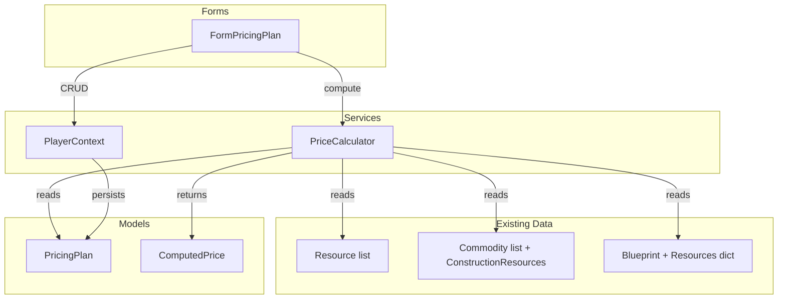

# Design Document — BL-016: Pricing Plans

## Overview

Pricing Plans add a per-player valuation layer to the OE2 Empire Tracker. Each plan stores user-entered base resource prices (Refined, S1, S2 purities) and optional time-cost parameters. A `PriceCalculator` service rolls up these base prices through the existing bill-of-materials chains — `Commodity.ConstructionResources` for commodities, `Blueprint.Resources` for manufactured items — to produce computed prices. Computed prices are flagged as complete or incomplete depending on whether all input resources have price entries.

The feature follows the existing architecture: a POCO model (`PricingPlan`) persisted in `PlayerData.json` via `PlayerContext`, a stateless service (`PriceCalculator`) for computation, and a WinForms form (`FormPricingPlan`) for CRUD and price entry.

## Architecture



Data flows:
1. User creates/edits a `PricingPlan` via `FormPricingPlan` → `PlayerContext` persists to `PlayerData.json`
2. User requests computed prices → `PriceCalculator` reads the plan's base prices + commodity/blueprint data → returns `ComputedPrice` results
3. `PriceCalculator` is stateless — it takes a plan and item data as inputs, returns results. No caching.

## Components and Interfaces

### PricingPlan (Model)

New POCO in `OE2EmpireTracker/Models/PricingPlan.cs`. Follows the same ownership pattern as `DeliveryRoute` and `DeliveryPlan`.

```csharp
public class PricingPlan
{
    public string UUID { get; set; }
    public string Name { get; set; } = string.Empty;
    public string OwnerUUID { get; set; } = string.Empty;
    public string Description { get; set; } = string.Empty;
    public decimal FixedCostPerItem { get; set; } = 0m;
    public decimal HourlyCostRate { get; set; } = 0m;

    // Key: "{ResourceName}|{Purity}" e.g. "Alkali Metals|Refined"
    // Value: price in credits (decimal)
    public Dictionary<string, decimal> ResourcePrices { get; set; }
        = new Dictionary<string, decimal>();
}
```

Design decisions:
- **Composite key in dictionary**: `"{ResourceName}|{Purity}"` keeps the model flat and serialization simple. The pipe separator is safe because neither resource names nor purity names contain pipes.
- **`decimal` for prices**: Matches the existing `TotalCredits` field on `PlayerProfile` and avoids floating-point rounding issues for currency.
- **No separate class for resource price entries**: A dictionary is simpler than a list of objects and maps directly to the lookup pattern the calculator needs.

### ComputedPrice (Model)

Return type from `PriceCalculator`. Lightweight struct-like class, not persisted.

```csharp
public class ComputedPrice
{
    public decimal Price { get; set; }
    public bool IsComplete { get; set; }
}
```

- `IsComplete = true` when all input resources had price entries (including zero).
- `IsComplete = false` when one or more inputs were absent from the plan's `ResourcePrices`.
- `Price` is always computed from available inputs regardless of completeness.

### PriceCalculator (Service)

New stateless service in `OE2EmpireTracker/Services/PriceCalculator.cs`.

```csharp
public static class PriceCalculator
{
    // Compute commodity price from ConstructionResources
    public static ComputedPrice ComputeCommodityPrice(
        PricingPlan plan, Commodity commodity);

    // Compute manufactured item price from Blueprint.Resources + time cost
    public static ComputedPrice ComputeBlueprintPrice(
        PricingPlan plan, Blueprint blueprint, decimal manufacturingHours);

    // Look up a single resource price from the plan
    public static bool TryGetResourcePrice(
        PricingPlan plan, string resourceName, string purity, out decimal price);

    // Build the composite key for ResourcePrices dictionary
    public static string MakeResourceKey(string resourceName, string purity);
}
```

Design decisions:
- **Static class**: No state, no dependencies beyond the inputs. Easy to test.
- **`manufacturingHours` as parameter**: The blueprint stores manufacturing time as a string property (`"Manufacture Run Time"` in `PropertyBag`), and parsing that string is the caller's responsibility. The calculator takes a clean decimal.
- **Commodity resources are always Refined purity**: Per the game model, `Commodity.ConstructionResources` keys are resource names and all commodity inputs are refined. The calculator uses `"Refined"` purity for all commodity resource lookups.
- **Blueprint resources use the purity from the Resources dict**: Blueprint `Resources` is `Dictionary<string, string>` where keys are resource names (which may include S1/S2 synthetics) and values are quantities. The purity is determined by the resource type — natural resources are Refined, S1 resources are S1, S2 resources are S2. The calculator determines purity by checking if the resource name starts with "S1." or "S2.", otherwise defaults to "Refined".

### PlayerContext Changes

Add `PricingPlan` to the existing persistence infrastructure:

- Add `BindingList<PricingPlan> PricingPlanList` field
- Add `InitPricingPlans(PlayerRoot)` method
- Add `PricingPlan[]` to `PlayerRoot`
- Include in `WriteContext()` serialization
- Include in `CascadeDeletePlayer()` and `CleanupOrphanedData()`
- Add `GetCurrentPlayerPricingPlans()` convenience method

### FormPricingPlan (Form)

New WinForms form in `OE2EmpireTracker/Forms/PricingPlan/FormPricingPlan.cs`. Standard MDI child form pattern.

Layout:
- Left panel: ListBox of pricing plans for current player (add/edit/delete buttons)
- Right panel: Plan details (name, description, fixed cost, hourly rate) + DataGridView of resource prices
- DataGridView columns: Resource Name (read-only), Purity (read-only), Price (editable decimal)
- Rows pre-populated from `Resource.Resources` (Refined purity for natural resources) + S1/S2 synthetic resources (S1/S2 purity respectively)
- Incomplete price indicator: visual marker on computed price rows

### Purity Determination Logic

For the `PriceCalculator` to look up the correct price for a resource referenced in a blueprint or commodity:

| Resource Name Pattern | Purity Used |
|---|---|
| Starts with `"S1. "` | `"S1"` |
| Starts with `"S2. "` | `"S2"` |
| All others | `"Refined"` |

This matches the game model: natural resources are always refined before use in manufacturing, and synthetic resources are identified by their name prefix.

## Data Models

### PricingPlan Persistence

Added to `PlayerRoot` alongside existing arrays:

```json
{
  "DataVersion": 4,
  "CurrentPlayerUUID": "...",
  "PlayerProfile": [...],
  "Blueprint": [...],
  "Survey": [...],
  "Colony": [...],
  "DeliveryRoute": [...],
  "DeliveryPlan": [...],
  "PricingPlan": [
    {
      "UUID": "a1b2c3d4-...",
      "Name": "Market Value",
      "OwnerUUID": "player-uuid-...",
      "Description": "Current market prices for all resources",
      "FixedCostPerItem": 0,
      "HourlyCostRate": 500.00,
      "ResourcePrices": {
        "Alkali Metals|Refined": 12.50,
        "Noble Gases|Refined": 8.75,
        "S1. Translanthanic Exotics|S1": 250.00,
        "S2. Element 126|S2": 1500.00
      }
    }
  ]
}
```

Notes:
- `JsonSettings.SerializerSettings` uses `DefaultValueHandling.Ignore`, so `FixedCostPerItem` and `HourlyCostRate` are omitted when zero. On deserialization, the default `0m` applies.
- `ResourcePrices` entries with value `0` are explicitly serialized (zero is a valid price). Only absent entries mean "unpriced."
- Backward compatibility: If `PricingPlan` array is missing from JSON, `PlayerRoot` initializes it as empty array — no error.

### Resource Price Key Format

Composite key: `"{ResourceName}|{Purity}"`

Examples:
- `"Alkali Metals|Refined"`
- `"S1. Translanthanic Exotics|S1"`
- `"S2. Element 126|S2"`

The pipe character `|` is not present in any existing resource name or purity string, making it a safe separator.

### Commodity Price Computation Flow

```
For each entry in Commodity.ConstructionResources:
    key = entry.Key (resource name)
    quantity = int.Parse(entry.Value)
    purity = DeterminePurity(key)  // "Refined", "S1", or "S2"
    priceKey = MakeResourceKey(key, purity)
    
    if plan.ResourcePrices.ContainsKey(priceKey):
        totalCost += quantity * plan.ResourcePrices[priceKey]
    else:
        isComplete = false

return ComputedPrice { Price = totalCost, IsComplete = isComplete }
```

### Manufactured Item Price Computation Flow

```
resourceCost = 0
isComplete = true

For each entry in Blueprint.Resources:
    key = entry.Key (resource name)
    quantity = int.Parse(entry.Value)
    purity = DeterminePurity(key)
    priceKey = MakeResourceKey(key, purity)
    
    if plan.ResourcePrices.ContainsKey(priceKey):
        resourceCost += quantity * plan.ResourcePrices[priceKey]
    else:
        isComplete = false

totalPrice = resourceCost + plan.FixedCostPerItem + (plan.HourlyCostRate * manufacturingHours)

return ComputedPrice { Price = totalPrice, IsComplete = isComplete }
```


## Correctness Properties

*A property is a characteristic or behavior that should hold true across all valid executions of a system — essentially, a formal statement about what the system should do. Properties serve as the bridge between human-readable specifications and machine-verifiable correctness guarantees.*

### Property 1: Whitespace plan names are rejected

*For any* string composed entirely of whitespace (including empty string), attempting to save a PricingPlan with that name should be rejected by validation.

**Validates: Requirements 1.6**

### Property 2: Non-negative decimal validation

*For any* decimal value, the system should accept it as a resource price, FixedCostPerItem, or HourlyCostRate if and only if it is non-negative (>= 0). Negative values should be rejected.

**Validates: Requirements 1.8, 2.3, 2.4**

### Property 3: Commodity price is sum of input quantities times Refined prices

*For any* PricingPlan and any Commodity, the computed commodity price should equal the sum of `(int.Parse(quantity) × plan.ResourcePrices[MakeResourceKey(resourceName, "Refined")])` for each entry in the Commodity's `ConstructionResources` dictionary, using only resources that have price entries in the plan.

**Validates: Requirements 3.1, 3.3**

### Property 4: Completeness flag matches input coverage

*For any* PricingPlan and any item (Commodity or Blueprint), the computed price's `IsComplete` flag should be `true` if and only if every input resource in the item's resource dictionary has a corresponding entry in the plan's `ResourcePrices` (including entries with value zero).

**Validates: Requirements 3.2, 3.4, 4.4, 6.1**

### Property 5: Blueprint price equals resource cost plus time costs

*For any* PricingPlan, any Blueprint with a Resources dictionary, and any non-negative manufacturing hours value, the computed blueprint price should equal `resourceCost + plan.FixedCostPerItem + (plan.HourlyCostRate × manufacturingHours)`, where `resourceCost` is the sum of `(int.Parse(quantity) × resourcePrice)` for each resource entry that has a price in the plan.

**Validates: Requirements 4.1, 4.2, 4.3, 4.6**

### Property 6: Zero price is valid, absent entry is incomplete

*For any* PricingPlan and any resource name, if the plan contains an explicit entry with value `0` for that resource, then `TryGetResourcePrice` should return `true` with price `0` (and the resource should count as "priced" for completeness). If the plan has no entry for that resource, `TryGetResourcePrice` should return `false` (and the resource should count as "unpriced"/incomplete).

**Validates: Requirements 6.2, 6.3**

### Property 7: Purity determination produces only Refined, S1, or S2

*For any* resource name string, the purity determination logic should return exactly one of `"Refined"`, `"S1"`, or `"S2"`. Names starting with `"S1. "` map to `"S1"`, names starting with `"S2. "` map to `"S2"`, and all others map to `"Refined"`.

**Validates: Requirements 2.6**

### Property 8: Serialization round-trip

*For any* valid PricingPlan object (with non-null UUID, non-empty name, valid ResourcePrices with non-negative values), serializing to JSON with `JsonConvert.SerializeObject` using `JsonSettings.SerializerSettings` and then deserializing back should produce an equivalent object with the same UUID, Name, OwnerUUID, Description, FixedCostPerItem, HourlyCostRate, and ResourcePrices.

**Validates: Requirements 5.4**

## Error Handling

| Scenario | Handling |
|---|---|
| Empty/whitespace plan name | Validation rejects save, shows message. Plan is not persisted. |
| Negative price value | Input rejected at form level. Value not stored. |
| Negative FixedCostPerItem or HourlyCostRate | Input rejected at form level. Value not stored. |
| Missing resource in plan during computation | Price computed from available inputs, `IsComplete` set to `false`. No exception thrown. |
| Commodity with empty ConstructionResources | Returns `ComputedPrice { Price = 0, IsComplete = true }` — no inputs means nothing is missing. |
| Blueprint with empty Resources dictionary | Returns `ComputedPrice { Price = FixedCostPerItem + (HourlyCostRate × hours), IsComplete = true }`. |
| `ResourcePrices` dictionary is null after deserialization | Constructor initializes to empty dictionary. Defensive null check in calculator. |
| PlayerData.json missing PricingPlan array | `PlayerRoot` initializes `PricingPlan` as empty array. No error on load. |
| Resource quantity in ConstructionResources/Resources is not a valid integer | Log warning, skip that resource entry, mark price as incomplete. |

## Testing Strategy

### Unit Tests (NUnit)

Specific examples and edge cases:

- PricingPlan default values (UUID, name, costs default to zero, empty ResourcePrices)
- ComputeCommodityPrice with a known commodity (e.g., "Advanced Biolubricants" needs 2× Alkali Organics + 2× Strong Acidic Inorganics) and known prices → verify exact result
- ComputeBlueprintPrice with known blueprint resources, fixed cost, and hourly rate → verify exact result
- Zero price treated as valid (not incomplete)
- Empty ConstructionResources → price 0, complete
- Empty Blueprint.Resources → price equals time cost only, complete
- Backward compatibility: deserialize PlayerData JSON without PricingPlan field → empty list
- MakeResourceKey format verification
- Purity determination for known resource names

### Property-Based Tests (FsCheck + NUnit)

Each correctness property implemented as a single property-based test with minimum 100 iterations.

Library: **FsCheck 2.16.6** with **FsCheck.NUnit** integration (already in the test project).

Tag format: `Feature: pricing-plans, Property {N}: {title}`

Properties to implement:
1. Whitespace name rejection — generate random whitespace strings, verify validation rejects
2. Non-negative decimal validation — generate arbitrary decimals, verify acceptance matches sign
3. Commodity price formula — generate random PricingPlan + Commodity, verify computed price matches manual sum
4. Completeness flag — generate random plan with some resources missing, verify IsComplete matches coverage
5. Blueprint price formula — generate random PricingPlan + Blueprint + hours, verify formula
6. Zero vs absent distinction — generate random resource names, set some to zero, leave others absent, verify TryGetResourcePrice behavior
7. Purity determination — generate random resource name strings (with and without S1./S2. prefixes), verify output is always one of three values
8. Serialization round-trip — generate random PricingPlan objects, serialize/deserialize, verify equivalence

FsCheck generators will need custom `Arbitrary<PricingPlan>` and `Arbitrary<Commodity>` instances to produce valid test data with realistic resource names from the existing `Resource.Resources` list.
