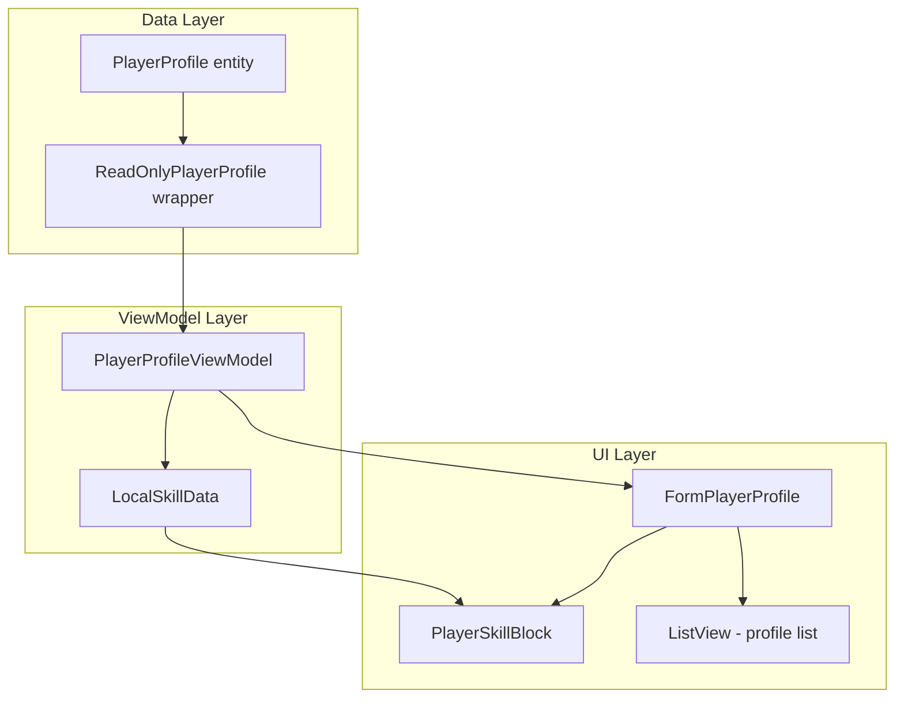

# Design Document: Profile Form Upgrade

## Overview

This feature upgrades FormPlayerProfile to display enriched player data that was added to the data model by the profile-api-enrichment spec. The changes span three layers:

1. **ViewModel** — Expose CharacterId, FirstName, LastName, and ActiveTimeMinutes on PlayerProfileViewModel
2. **UserControl** — Expand PlayerSkillBlock to show metadata row with progress bar and remaining time
3. **Form** — Add identity fields, formatted active time, and ListView "ID" column to FormPlayerProfile

All new fields are read-only display values synced from the Game API. The ViewModel already carries EffectDescription, AmountPerLevel, TrainingPercentageComplete, and RemainingMinutes for skills; this feature adds the UI visualization (progress bar, remaining time label, dynamic height) and the profile-level identity/time fields.

## Architecture



The data flows top-down: PlayerProfile → ReadOnlyPlayerProfile → PlayerProfileViewModel → Form/Controls. No mutations flow upward for the new fields (they are API-synced read-only values).

## Components and Interfaces

### PlayerProfileViewModel Changes

New properties to expose:

```csharp
public int CharacterId { get; set; }
public string FirstName { get; set; } = string.Empty;
public string LastName { get; set; } = string.Empty;
public int ActiveTimeMinutes { get; set; }
```

**LoadFrom** copies these from ReadOnlyPlayerProfile:
```csharp
_characterId = ro.CharacterId;
_firstName = ro.FirstName;
_lastName = ro.LastName;
_activeTimeMinutes = ro.ActiveTimeMinutes;
```

**Reset** sets CharacterId = 0, FirstName = "", LastName = "", ActiveTimeMinutes = 0.

**IsDirty** adds comparisons for the new fields against the original snapshot.

### ActiveTimeMinutes Formatting

A static helper method (on PlayerProfileViewModel or a shared utility) converts minutes to display string:

```csharp
public static string FormatActiveTime(int totalMinutes)
```

Rules:
- If totalMinutes <= 0: return "\u2014" (em-dash)
- D = totalMinutes / 1440, H = (totalMinutes % 1440) / 60, M = totalMinutes % 60
- Omit "0d" when D == 0
- Omit "0h" only when both D == 0 and H == 0
- When only minutes remain (D=0, H=0): show "{M}m" alone

This same logic is reused by PlayerSkillBlock for RemainingMinutes display (Requirement 5).

### PlayerSkillBlock Changes

**Dynamic Height:**
- When any metadata is present (EffectDescription non-empty, AmountPerLevel > 0, TrainingPercentageComplete > 0, or RemainingMinutes > 0): height = 42px
- When no metadata: height = 24px
- Height change updates MinimumSize, MaximumSize, and Size properties

**Progress Bar (custom-painted Panel):**
- A Panel control replaces lblTrainingProgress when TrainingPercentageComplete > 0
- Fixed size: 60×12 pixels
- Fill width: (clamp(TrainingPercentageComplete, 0, 100) / 100.0) × 60
- Fill color: SystemColors.Highlight; background: SystemColors.ControlLight
- Text: "{N}%" centered, font size 7pt
- Hidden (Visible = false) when TrainingPercentageComplete == 0

**Remaining Time Label:**
- Uses FormatActiveTime(RemainingMinutes) for display text
- Positioned after progress bar (or after AmountPerLevel if no progress bar)
- Hidden when RemainingMinutes <= 0

### FormPlayerProfile Changes

**Identity Fields (after Player Name row):**
- lblCharacterId / lblCharacterIdValue — shows CharacterId or "—" if <= 0
- lblFirstName / lblFirstNameValue — hidden when FirstName is empty
- lblLastName / lblLastNameValue — hidden when LastName is empty

**Active Time Field (after identity rows):**
- lblActiveTime / lblActiveTimeValue — shows FormatActiveTime(ActiveTimeMinutes)

**ListView Enhancement:**
- Third column "ID" (width 60px) after "Name" and "Faction"
- Displays CharacterId as string, or empty string when CharacterId == 0
- PopulateListView adds SubItem at index 2

**PopulateForm Updates:**
- Sets identity labels (CharacterId, FirstName, LastName) with visibility logic
- Sets active time label via FormatActiveTime
- Existing skill block updates already handle metadata via SkillData setter

## Data Models

No new data model changes required. The PlayerProfile entity already has:
- `CharacterId` (int)
- `FirstName` (string)
- `LastName` (string)
- `ActiveTimeMinutes` (int)

ReadOnlyPlayerProfile already exposes these as read-only properties.

LocalSkillData already has:
- `EffectDescription` (string)
- `AmountPerLevel` (int)
- `TrainingPercentageComplete` (int)
- `RemainingMinutes` (int)

The ViewModel LoadFrom already copies EffectDescription, AmountPerLevel, TrainingPercentageComplete, and RemainingMinutes into LocalSkillData.


## Correctness Properties

*A property is a characteristic or behavior that should hold true across all valid executions of a system — essentially, a formal statement about what the system should do. Properties serve as the bridge between human-readable specifications and machine-verifiable correctness guarantees.*

### Property 1: LoadFrom round-trip preserves identity and time fields

*For any* valid PlayerProfile with arbitrary CharacterId (int range), FirstName (0–50 chars), LastName (0–50 chars), and ActiveTimeMinutes (int range), calling LoadFrom on a PlayerProfileViewModel with the corresponding ReadOnlyPlayerProfile SHALL result in the ViewModel's CharacterId, FirstName, LastName, and ActiveTimeMinutes matching the source values exactly.

**Validates: Requirements 1.1, 2.1**

### Property 2: CharacterId display formatting

*For any* integer CharacterId value, the detail form display logic SHALL produce "—" (em-dash U+2014) when CharacterId <= 0, and the decimal string representation of CharacterId when CharacterId > 0.

**Validates: Requirements 1.2**

### Property 3: FirstName/LastName row visibility

*For any* string value assigned to FirstName or LastName, the corresponding UI row SHALL be visible if and only if the string is non-empty (not null and not "").

**Validates: Requirements 1.3**

### Property 4: ActiveTimeMinutes formatting round-trip

*For any* non-negative integer totalMinutes, FormatActiveTime(totalMinutes) SHALL produce a string from which the original totalMinutes can be reconstructed by parsing D, H, M components. Specifically: for totalMinutes > 0, parsing the "{D}d {H}h {M}m" output (with leading zero omission) and computing D×1440 + H×60 + M SHALL equal the original totalMinutes. For totalMinutes == 0 or negative values, the output SHALL be "—".

**Validates: Requirements 2.2, 2.3, 2.6, 5.2**

### Property 5: PlayerSkillBlock height calculation

*For any* LocalSkillData instance, the PlayerSkillBlock height SHALL be 42 pixels when any of (EffectDescription is non-empty, AmountPerLevel > 0, TrainingPercentageComplete > 0, RemainingMinutes > 0) is true, and 24 pixels when all are false/zero/empty.

**Validates: Requirements 3.1, 3.2, 3.6**

### Property 6: Progress bar width and visibility

*For any* integer TrainingPercentageComplete value, the progress bar SHALL be hidden when the value is 0, and visible otherwise. When visible, the filled width SHALL equal (clamp(TrainingPercentageComplete, 0, 100) / 100.0) × 60 pixels, and the displayed text SHALL be "{N}%" where N is the clamped integer value.

**Validates: Requirements 4.1, 4.2, 4.3, 4.4**

### Property 7: Remaining time label visibility

*For any* integer RemainingMinutes value, the remaining time label SHALL be visible if and only if RemainingMinutes > 0. Negative values SHALL be treated as 0 (label hidden).

**Validates: Requirements 5.1, 5.3, 5.5**

### Property 8: ListView CharacterId column display

*For any* PlayerProfile with an arbitrary CharacterId value, the ListView SubItem at column index 2 SHALL contain the CharacterId as a string when CharacterId > 0, and an empty string when CharacterId == 0.

**Validates: Requirements 6.1, 6.2, 6.5**

## Error Handling

| Scenario | Handling |
|----------|----------|
| CharacterId is negative | Display "—" in detail view; treat as 0 in ListView (empty string) |
| ActiveTimeMinutes is negative | Treat as 0; display "—" |
| RemainingMinutes is negative | Treat as 0; hide remaining time label |
| TrainingPercentageComplete > 100 | Clamp to 100 for progress bar width calculation |
| TrainingPercentageComplete < 0 | Clamp to 0; hide progress bar |
| FirstName/LastName is null | Treat as empty string; hide row |
| PlayerProfileDataChanged fires on disposed form | Guard with IsDisposed check (existing pattern) |
| PlayerProfileDataChanged fires from background thread | Marshal to UI thread via BeginInvoke (existing pattern) |

## Testing Strategy

### Property-Based Tests (FsCheck 2.16.6 + NUnit)

The feature is suitable for property-based testing because:
- The formatting functions (FormatActiveTime) are pure functions with large input spaces
- The height/visibility logic is a pure function of skill data fields
- The LoadFrom round-trip is a classic PBT pattern already established in this project

**Configuration:**
- Library: FsCheck 2.16.6 with FsCheck.NUnit attribute
- Minimum iterations: 100 per property (use `[FsCheck.NUnit.Property(MaxTest = 100)]`)
- Tag format: `Feature: profile-form-upgrade, Property {N}: {title}`

**Properties to implement:**
1. LoadFrom round-trip for new fields (extend existing test or add new)
2. FormatActiveTime correctness (round-trip parse)
3. PlayerSkillBlock height calculation
4. Progress bar width/visibility calculation
5. ListView CharacterId formatting

### Unit Tests (NUnit example-based)

- CharacterId display: specific examples (0, -1, 1, int.MaxValue)
- FormatActiveTime edge cases: 0 → "—", 1 → "1m", 60 → "1h 0m", 1440 → "1d 0h 0m"
- Progress bar colors are SystemColors.Highlight / ControlLight
- Label positions match spec (x=48, x=200, y=26)
- ListView column width = 60px
- Reset() sets all new fields to defaults

### Integration Tests

- PlayerProfileDataChanged event triggers form refresh of new fields
- Profile_Sync updates remaining time and active time displays
- FlowLayoutPanel reflows correctly when PlayerSkillBlock height changes
- ListView selection preserved after PopulateListView refresh
