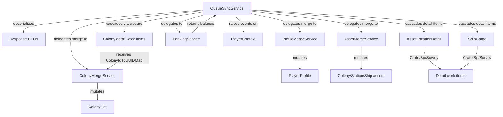

# Design Document: Queue Sync Completion

## Overview

This design completes the QueueSyncService work item stubs that currently make API calls but discard response data. The work follows the patterns already established in the existing QueueSyncService (auth handling, rate limiting, cascading) and the old GameApiSyncScheduler (merge logic, event raising). The key changes are:

1. Extract `ProfileMergeService` as a static class from GameApiSyncScheduler's inline merge logic.
2. Complete each Priority 1 stub to deserialize responses and delegate to the appropriate merge service.
3. Add ship configuration parsing (Priority 2) with a new response DTO.
4. Wire ColonyId-to-UUID context passing through closures for cascaded colony detail items.
5. Fire PlayerContext data-changed events after successful merges.

## Architecture



### Data Flow Per Work Item

Each completed work item follows this pattern:
1. API call already made (existing code); response JSON available in `result.Json`.
2. Deserialize JSON into the typed envelope/DTO (wrap in try/catch for JsonException).
3. Delegate to the appropriate merge service with local data + deserialized remote data.
4. If merge indicates changes, raise the relevant PlayerContext event.
5. Call `WriteContext()` only if merge succeeded without error.

### Error Isolation

Each work item is independent. A deserialization or merge failure in one item does NOT abort the sync cycle — it logs the error and returns `Array.Empty<WorkItem>()`. This matches the existing pattern where each work item's delegate is wrapped by GameApiRequestQueue's exception handling.

## Components and Interfaces

### ProfileMergeService (New)

**Location:** `OE2EmpireTracker.Common/Services/ProfileMergeService.cs`

```csharp
public static class ProfileMergeService
{
    public static bool MergeProfileData(PlayerProfile local, GameApiProfileResponse remote);
    private static bool MergeRank(PlayerRank localRank, GameApiRankResponse remoteRank, string rankName);
    private static bool MergeSkills(PlayerProfile local, List<GameApiSkillResponse> remoteSkills, string skillInTraining);
}
```

Extracted directly from `GameApiSyncScheduler.MergeProfileData`, `MergeRank`, and `MergeSkills`. No logic changes — pure extraction.

### GameApiShipConfigurationResponse (New DTO)

**Location:** `OE2EmpireTracker.Common/Models/GameApiShipConfigurationResponse.cs`

```csharp
public class GameApiShipConfigurationResponse
{
    [JsonProperty("shipId")]
    public int ShipId { get; set; }

    [JsonProperty("hullCurrentHp")]
    public int HullCurrentHp { get; set; }

    [JsonProperty("hullMaxHp")]
    public int HullMaxHp { get; set; }

    [JsonProperty("hullMaxRepairPercent")]
    public decimal HullMaxRepairPercent { get; set; }

    [JsonProperty("components")]
    public List<GameApiShipComponentEntry> Components { get; set; } = new List<GameApiShipComponentEntry>();
}

public class GameApiShipComponentEntry
{
    [JsonProperty("slotType")]
    public string SlotType { get; set; } = string.Empty;

    [JsonProperty("slotIndex")]
    public int SlotIndex { get; set; }

    [JsonProperty("blueprintId")]
    public int BlueprintId { get; set; }

    [JsonProperty("currentHp")]
    public int CurrentHp { get; set; }

    [JsonProperty("maxHp")]
    public int MaxHp { get; set; }

    [JsonProperty("maxRepairPercent")]
    public decimal MaxRepairPercent { get; set; }
}
```


### QueueSyncService Modifications

The following work item factory methods will be modified to include merge logic:

| Work Item | Merge Service | Event Raised |
|-----------|---------------|--------------|
| `CreateCharacterProfileItem` | ProfileMergeService.MergeProfileData | PlayerProfileDataChanged |
| `CreateBankingBalanceItem` | BankingService.ImportBalanceAsync | BankingDataChanged |
| `CreateColonyListItem` | ColonyMergeService.MergeColonyList | ColonyDataChanged |
| `CreateColonyBuildingsItem` | ColonyMergeService.MergeBuildings | ColonyDataChanged |
| `CreateColonyWarehouseItem` | ColonyMergeService.MergeWarehouse | ColonyDataChanged |
| `CreateColonyWorkersItem` | ColonyMergeService.MergeWorkers | ColonyDataChanged |
| `CreateAssetLocationDetailItem` | AssetMergeService.MergeColonyAssets/MergeStationAssets/MergeShipAssets | ShipDataChanged/StationDataChanged/ColonyDataChanged |
| `CreateShipCargoItem` | AssetMergeService.MergeShipAssets | ShipDataChanged |
| `CreateShipConfigItem` | Direct mapping to Ship.Components | ShipDataChanged |

### Colony Context Passing Pattern

The `CreateColonyListItem` method will capture the `ColonyIdToUUIDMap` from `MergeColonyList` result and pass it to cascaded work items via closure:

```csharp
private WorkItem CreateColonyListItem()
{
    return new WorkItem
    {
        Label = "ColonyList",
        ExecuteAsync = async ct =>
        {
            // ... fetch and deserialize ...
            var mergeResult = ColonyMergeService.MergeColonyList(
                response.Colonies, localColonies, playerUUID);
            
            var colonyIdMap = mergeResult.ColonyIdToUUIDMap;
            
            // Cascade with map captured by closure
            var cascaded = response.Colonies
                .SelectMany(c => new[]
                {
                    CreateColonyBuildingsItem(c.ColonyId, colonyIdMap),
                    CreateColonyWarehouseItem(c.ColonyId, colonyIdMap),
                    CreateColonyWorkersItem(c.ColonyId, colonyIdMap),
                })
                .ToArray();
            return cascaded;
        },
    };
}
```

Each colony detail item receives the map as a parameter and resolves its target colony:

```csharp
private WorkItem CreateColonyBuildingsItem(int colonyId, Dictionary<int, string> colonyIdMap)
{
    return new WorkItem
    {
        Label = "ColonyBuildings:" + colonyId,
        ExecuteAsync = async ct =>
        {
            // ... fetch and deserialize ...
            string colonyUUID;
            if (!colonyIdMap.TryGetValue(colonyId, out colonyUUID))
            {
                // Fallback: direct lookup by ColonyId
                var colony = localColonies.FirstOrDefault(c => c.ColonyId == colonyId);
                if (colony == null) { Log.Warn(...); return Array.Empty<WorkItem>(); }
                colonyUUID = colony.UUID;
            }
            
            var targetColony = localColonies.FirstOrDefault(c => c.UUID == colonyUUID);
            ColonyMergeService.MergeBuildings(buildings, targetColony);
            // ...
        },
    };
}
```

### Asset Location Detail — Cargo Merge and Detail Cascading

The existing `CreateAssetLocationDetailItem` already deserializes the response and cascades Crate/Bp/Survey detail items. The completion adds a generic cargo merge FIRST, and THEN cascades detail work items for special cargo types:

**Step 1 — Generic cargo merge** (dispatched by location type):

```csharp
// After successful deserialization of response.Cargo:
switch (typeC)  // typeC is the location type passed from CreateAssetLocationsItem
{
    case "Co":
        var colony = localColonies.FirstOrDefault(c => c.ColonyId == id);
        if (colony != null) AssetMergeService.MergeColonyAssets(response.Cargo, colony);
        break;
    case "St":
        var station = FindOrCreateStation(id, planetName, systemName);
        AssetMergeService.MergeStationAssets(response.Cargo, station, targetHold);
        break;
    case "Sh":
        var ship = FindOrCreateShip(id, planetName);
        AssetMergeService.MergeShipAssets(response.Cargo, ship);
        break;
    default:
        Log.Warn("Unknown location type '{0}' for asset {1}", typeC, id);
        return Array.Empty<WorkItem>();  // skip cascading for unknown types
}
```

**Step 2 — Detail cascading** (runs AFTER the generic merge completes):

```csharp
// Cascade Crate/Blueprint/Survey detail items using shared cascading logic
var cascaded = CascadeCargoDetailItems(response.Cargo, planetName, systemName);
return cascaded;
```

The station/ship find-or-create logic replicates `GameApiSyncScheduler.MergeStationLocation` and `MergeShipLocation` patterns (GameLocationId match → name-based fallback → create new).

### Ship Cargo — Cargo Merge and Detail Cascading

The `CreateShipCargoItem` follows the same two-step pattern as AssetLocationDetail: first merge generic cargo, then cascade detail items for special cargo types.

**Step 1 — Generic cargo merge** (always targets the active ship):

```csharp
// After successful deserialization of cargo array:
var cargoItems = JsonConvert.DeserializeObject<List<GameApiAssetCargoItem>>(json);
var activeShip = FindActiveShip();
if (activeShip == null)
{
    Log.Warn("ShipCargo: no active ship identified, skipping merge");
    return Array.Empty<WorkItem>();
}
AssetMergeService.MergeShipAssets(cargoItems, activeShip);
```

**Step 2 — Detail cascading** (runs AFTER the generic merge completes, uses the same shared logic):

```csharp
// Cascade Crate/Blueprint/Survey detail items using shared cascading logic
var cascaded = CascadeCargoDetailItems(cargoItems, activeShip.PlanetName, activeShip.SystemName);
return cascaded;
```

This ensures ShipCargo and AssetLocationDetail produce identical detail work items for the same cargo contents.

### Consistent Cargo Cascading

Both `CreateAssetLocationDetailItem` and `CreateShipCargoItem` must cascade detail work items using identical logic. To prevent divergence, the cascading logic is extracted into a shared private helper method:

```csharp
private WorkItem[] CascadeCargoDetailItems(
    List<GameApiAssetCargoItem> cargo,
    string planetName,
    string systemName)
{
    var items = new List<WorkItem>();
    foreach (var entry in cargo)
    {
        switch (entry.TypeC)
        {
            case "Crate":
                items.Add(CreateCrateDetailItem(entry.Id, planetName, systemName));
                break;
            case "Blueprint":
                if (!IsBlueprintFresh(entry.Id))
                    items.Add(CreateBlueprintDetailItem(entry.Id));
                break;
            case "Survey":
                if (!IsSurveyFresh(entry.Id))
                    items.Add(CreateSurveyDetailItem(entry.Id));
                break;
        }
    }
    return items.ToArray();
}
```

This helper enforces:
- The same freshness thresholds for Blueprint and Survey entries.
- The same work item factory methods (`CreateCrateDetailItem`, `CreateBlueprintDetailItem`, `CreateSurveyDetailItem`).
- The same skip conditions regardless of whether the cargo source is a colony asset, station asset, ship location detail, or the active ship cargo endpoint.

Both work items call `CascadeCargoDetailItems` after their respective merge completes, guaranteeing consistent behavior as required by Requirement 15.


## Data Models

### New Types

| Type | Location | Purpose |
|------|----------|---------|
| `ProfileMergeService` | Services/ProfileMergeService.cs | Static class with MergeProfileData, MergeRank, MergeSkills |
| `GameApiShipConfigurationResponse` | Models/GameApiShipConfigurationResponse.cs | DTO for ship config endpoint |
| `GameApiShipComponentEntry` | Models/GameApiShipConfigurationResponse.cs | DTO for individual component in config response |

### Modified Types

| Type | Change |
|------|--------|
| `QueueSyncService` | Work item factory methods completed with merge logic; new overloads for colony detail items accepting `Dictionary<int, string>` |
| `Ship` | No model changes needed — `Components`, `HullCurrentHP`, `HullMaxHP`, `HullMaxRepairPercent` already exist |

### Existing Types Used Unchanged

- `ColonyMergeResult` (with `ColonyIdToUUIDMap`)
- `GameApiServiceResponse<T>` (envelope)
- `GameApiColonyListResponse`, `GameApiColonyBuildingsResponse`, `GameApiColonyWarehouseResponse`, `GameApiColonyWorkersResponse`
- `GameApiAssetDetailResponse`, `GameApiAssetCargoItem`
- `GameApiProfileResponse`
- `Colony`, `Station`, `Ship`, `PlayerProfile`
- `ShipComponentSlot`
- `ItemBag`


## Correctness Properties

### Property 1: Idempotent Merge

Applying the same API response twice to the same local state SHALL produce identical results — no duplicate items, no incremented counters, no duplicate events.

**Validates: Requirements 1, 2, 4, 5, 6, 7, 8, 9, 10**

### Property 2: Error Isolation

A deserialization or merge failure in work item W₁ SHALL NOT prevent work item W₂ from executing successfully. Each work item is an independent unit of failure.

**Validates: Requirements 12.1, 12.2**

### Property 3: No Data Loss on Error

If deserialization or merge throws, the local data model SHALL remain in its pre-call state for that work item. No partial writes.

**Validates: Requirements 12.3**

### Property 4: Context Closure Integrity

For all colony detail work items cascaded from a ColonyList response, the ColonyIdToUUIDMap captured in the closure SHALL be the exact map returned by MergeColonyList for that sync cycle — not stale data from a prior cycle.

**Validates: Requirements 14.1, 14.4**

### Property 5: Event-After-Mutation

A data-changed event SHALL only be raised AFTER the corresponding merge has completed successfully and WriteContext has persisted the change. Never before, never on failure.

**Validates: Requirements 11.1, 11.2, 11.3, 11.4**

### Property 6: Log Truncation

Any JSON response body logged due to an error SHALL be truncated to ≤500 characters to prevent log flooding.

**Validates: Requirements 12.4**

### Property 7: Fallback Resolution

If ColonyIdToUUIDMap does not contain a target ColonyId, the system SHALL fall back to direct ColonyId lookup. If that also fails, the work item SHALL log and skip — never throw.

**Validates: Requirements 14.2, 14.3**

### Property 8: Station/Ship Find-or-Create

For asset location detail, if a station or ship cannot be found by GameLocationId, the system SHALL attempt name-based fallback, then create a new entity. The created entity SHALL have its GameLocationId set so future lookups succeed without creation.

**Validates: Requirements 8.5, 8.6**

### Property 9: Consistent Cascading

*For any* cargo list processed by either AssetLocationDetail or ShipCargo, the set of cascaded detail work items SHALL be identical given the same cargo input and local state. The same freshness thresholds, the same work item factory methods, and the same skip conditions SHALL apply regardless of cargo source.

**Validates: Requirements 15.1, 15.2, 15.3, 15.4, 15.5**


## Error Handling

### Deserialization Errors

Each work item wraps its `JsonConvert.DeserializeObject<T>()` call in a try/catch for `JsonException`:

```csharp
try
{
    var response = JsonConvert.DeserializeObject<GameApiServiceResponse<T>>(json);
    // proceed with merge
}
catch (JsonException ex)
{
    Log.Error("Failed to deserialize {0} response: {1}\nBody (truncated): {2}",
        workItemLabel, ex.Message, json?.Substring(0, Math.Min(json.Length, 500)));
    return Array.Empty<WorkItem>();
}
```

- No local data is modified on deserialization failure.
- The sync cycle continues with remaining work items.
- The truncated response body aids debugging without flooding logs.

### Merge Errors

If a merge service throws an unexpected exception (e.g., null reference from corrupt data):

```csharp
try
{
    MergeService.MergeX(remote, local);
}
catch (Exception ex)
{
    Log.Error("Merge failed for {0}: {1}", workItemLabel, ex.Message);
    return Array.Empty<WorkItem>();  // skip WriteContext and event raising
}
```

- WriteContext is NOT called if merge fails.
- The data-changed event is NOT raised.
- Other work items continue unaffected.

### Colony Resolution Failures

When a ColonyId cannot be resolved to a local Colony (neither via map nor fallback):

- Log at Warning level with the ColonyId and work item label.
- Return `Array.Empty<WorkItem>()` — do not throw, do not abort the sync.

### Station/Ship Resolution

When a station or ship cannot be found by GameLocationId:

1. Attempt name-based fallback (matching by planet name or ship name).
2. If no match, create a new entity with GameLocationId set.
3. If creation fails (e.g., validation), log Warning and skip.


## Testing Strategy

### Unit Tests (NUnit + FsCheck)

Each merge service method gets property-based tests verifying the correctness properties:

1. **ProfileMergeService Tests:**
   - Property: MergeProfileData is idempotent (apply twice → same result).
   - Property: "API wins" fields always overwrite local values.
   - Property: Local-only fields (TrainingStarted, CompletionTime) are never overwritten.
   - Property: Return value is true iff at least one field changed.

2. **Colony Context Passing Tests:**
   - Property: All cascaded colony detail items receive a ColonyIdToUUIDMap that contains entries for every colony in the response.
   - Property: Fallback resolution succeeds when a valid ColonyId exists in the local colony list.
   - Property: Work item returns empty array (not throw) when ColonyId is unresolvable.

3. **Ship Configuration Tests:**
   - Property: Components list after merge has exactly the same count as the response entries.
   - Property: Hull HP fields match the response values exactly.
   - Property: BlueprintId resolution uses the existing index when a match exists.

4. **Error Isolation Tests:**
   - Verify that injecting a JsonException in one work item does not prevent other work items from completing.
   - Verify that no WriteContext occurs after a failed deserialization.
   - Verify that no event is raised after a failed merge.

5. **Asset Location Detail Tests:**
   - Property: Cargo merge dispatches to the correct merge method based on location type code.
   - Property: Unknown location types log a warning and do not throw.
   - Property: Find-or-create for stations/ships sets GameLocationId on newly created entities.

6. **Consistent Cargo Cascading Tests:**
   - Property: For any cargo list, `CascadeCargoDetailItems` produces the same work items regardless of whether called from AssetLocationDetail or ShipCargo context.
   - Property: Blueprint entries with fresh local data are skipped (no detail item cascaded).
   - Property: Survey entries with fresh local data are skipped (no detail item cascaded).
   - Property: Crate entries always produce a detail item regardless of freshness.

### Integration Tests (existing patterns)

- End-to-end sync cycle with mock HTTP responses verifying that local state converges to the remote state.
- Verify event firing counts match the number of work items that produce changes.

### Test Data

- Use FsCheck generators for GameApiProfileResponse, GameApiColonyListResponse, and GameApiShipConfigurationResponse to generate arbitrary valid payloads.
- Edge cases: empty collections, null optional fields, zero-length cargo arrays, ColonyId values not in the map.
