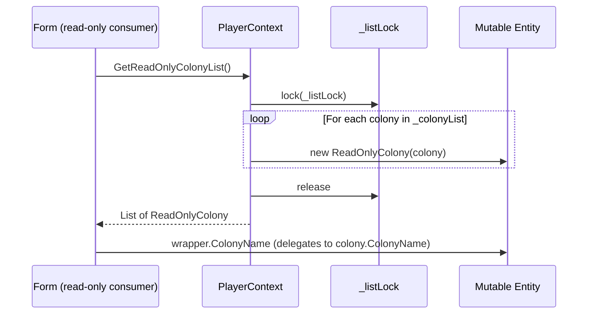

# Design Document: Read-Only Data Wrappers

## Overview

This feature introduces a complete set of read-only wrapper classes for the OE2EmpireTracker data model. Each mutable entity (e.g. `Blueprint`, `Colony`, `Ship`) gets a corresponding `ReadOnly{Entity}` class that holds a private readonly reference to the mutable instance and exposes only getter properties. The wrappers are separate classes — not interfaces on the mutable type — so consumer code cannot cast back to the mutable type.

The wrappers serve two purposes:
1. **Prevent accidental mutation** by read-only consumers (combo boxes, list views, read-only grids, reference counters, status calculators)
2. **Establish controlled mutation paths** ahead of future game API integration, where only authorized code paths should modify entity state

The design is additive: the existing mutable API remains unchanged. Wrappers are created on-the-fly as thin Gen0 allocations that delegate all property access to the underlying entity. Consumer migration happens incrementally after the wrapper infrastructure is in place.

### Entity Coverage

The feature covers:
- **4 utility containers**: PropertyBag, ItemBag, LockTracking, CountDownTime
- **36 entity/nested types**: Blueprint, Colony, ColonyStructure, Survey, SurveyResource, PlayerProfile, PlayerRank, PlayerSkill, DeliveryRoute, RouteStop, DeliveryPlan, DeliveryPlanStop, DeliveryItem, BuildPlan, BuildItem, ShipTemplate, ShipComponentSlot, Ship, Station, MarketListing, MarketTransaction, StockPlan, StockTarget, StockProfile, StockProfileEntry, SupplyChain, SupplyChainStage, WarehouseOverflowRule, Faction, ExternalCharacter, Asteroid, AsteroidReserve, PricingPlan, Item, Commodity, Resource, CommodityRequested, ColonyStructureStatus

### Design Principles

- **Live read-through**: Wrapper properties delegate to the mutable entity at call time — no caching, no copying
- **Recursive wrapping**: Nested entity references are wrapped recursively (e.g. `ReadOnlyColony.Structures` returns `IReadOnlyList<ReadOnlyColonyStructure>`)
- **No casting path**: Wrappers share no interface or base class with the mutable entity (other than `object`)
- **Lightweight**: Each wrapper holds exactly one field — the private readonly reference
- **Thread-safe construction**: List-building methods acquire `_listLock` while iterating; wrapper construction itself is lock-free

## Architecture

### Wrapper Layer Placement

```
Forms / Controls (read-only consumers)
        |
        v
  ReadOnly{Entity} wrappers  <-- NEW LAYER
        |
        v
  PlayerContext / EmpireContext (GetReadOnly* methods)  <-- NEW METHODS
        |
        v
  Mutable Entity (existing POCO)
```

Read-only consumers call `GetReadOnly*` methods on PlayerContext/EmpireContext, which iterate the backing list under lock and return freshly-wrapped instances. Mutable consumers continue using the existing `IReadOnlyList<T>` properties and `Find{Entity}` methods that return mutable references.

### Wrapper Class Hierarchy

All wrappers inherit directly from `object`. No wrapper inherits from another wrapper or from the mutable entity.

```
object
  +-- ReadOnlyPropertyBag, ReadOnlyItemBag, ReadOnlyLockTracking, ReadOnlyCountDownTime
  +-- ReadOnlyBlueprint, ReadOnlyColony, ReadOnlyColonyStructure, ReadOnlySurvey, ...
  +-- ReadOnlyPlayerProfile, ReadOnlyPlayerRank, ReadOnlyPlayerSkill
  +-- ReadOnlyDeliveryRoute, ReadOnlyRouteStop, ReadOnlyDeliveryPlan, ...
  +-- ReadOnlyShipTemplate, ReadOnlyShipComponentSlot, ReadOnlyShip, ReadOnlyStation
  +-- ReadOnlyMarketListing, ReadOnlyMarketTransaction
  +-- ReadOnlyStockPlan, ReadOnlyStockTarget, ReadOnlyStockProfile, ReadOnlyStockProfileEntry
  +-- ReadOnlySupplyChain, ReadOnlySupplyChainStage, ReadOnlyWarehouseOverflowRule
  +-- ReadOnlyFaction, ReadOnlyExternalCharacter, ReadOnlyAsteroid, ReadOnlyAsteroidReserve
  +-- ReadOnlyPricingPlan, ReadOnlyItem, ReadOnlyCommodity, ReadOnlyResource
  +-- ReadOnlyCommodityRequested, ReadOnlyColonyStructureStatus
```

### Sequence Diagram: Read-Only List Access




## Components and Interfaces

### Wrapper Class Pattern

Every wrapper follows the same structural pattern. Here is the canonical example using `ReadOnlyBlueprint`:

```csharp
namespace OE2EmpireTracker.Models
{
    public class ReadOnlyBlueprint
    {
        private readonly Blueprint _entity;

        public ReadOnlyBlueprint(Blueprint entity)
        {
            _entity = entity ?? throw new ArgumentNullException(nameof(entity));
        }

        // Value type / string properties — direct delegation
        public string UUID => _entity.UUID;
        public string Name => _entity.Name;
        public string OwnerUUID => _entity.OwnerUUID;
        public string BaseBlueprintUUID => _entity.BaseBlueprintUUID;
        public string LegacyUUID => _entity.LegacyUUID;
        public string BluePrintType => _entity.BluePrintType;
        public int Evolution => _entity.Evolution;
        public string TechLevel => _entity.TechLevel;
        public int Class => _entity.Class;
        public int CopyCost => _entity.CopyCost;
        public string NickName => _entity.NickName;
        public string Description => _entity.Description;

        // Computed properties — delegate to entity's computed property
        public string ExtendedName => _entity.ExtendedName;
        public string OutputItemName => _entity.OutputItemName;

        // Nested utility container — wrapped
        public ReadOnlyPropertyBag Properties => new ReadOnlyPropertyBag(_entity.Properties);

        // Dictionary of value types — exposed as IReadOnlyDictionary
        public IReadOnlyDictionary<string, string> Resources => _entity.Resources;

        // Equality based on UUID
        public override bool Equals(object obj)
        {
            if (obj is ReadOnlyBlueprint other)
                return string.Equals(_entity.UUID, other._entity.UUID);
            return false;
        }

        public override int GetHashCode() => _entity.UUID?.GetHashCode() ?? 0;
        public override string ToString() => _entity.ExtendedName;
    }
}
```

### Property Wrapping Rules

| Mutable Property Type | Wrapper Exposure | Example |
|---|---|---|
| Value type (int, decimal, bool, DateTime, enum) | Same type, getter only | `public int Evolution => _entity.Evolution;` |
| `string` | Same type, getter only | `public string Name => _entity.Name;` |
| Nested entity (`T`) | `ReadOnlyT` | `public ReadOnlyPropertyBag Properties => new ReadOnlyPropertyBag(_entity.Properties);` |
| Nullable nested entity (`T?`) | `ReadOnlyT?` with null check | `public ReadOnlyCountDownTime BuildCompletionTime => _entity.BuildCompletionTime != null ? new ReadOnlyCountDownTime(_entity.BuildCompletionTime) : null;` |
| `List<T>` of nested types | `IReadOnlyList<ReadOnlyT>` | `public IReadOnlyList<ReadOnlyColonyStructure> Structures => _entity.Structures.Select(s => new ReadOnlyColonyStructure(s)).ToList();` |
| `Dictionary<string, string>` | `IReadOnlyDictionary<string, string>` | `public IReadOnlyDictionary<string, string> Resources => _entity.Resources;` |
| `Dictionary<string, decimal>` | `IReadOnlyDictionary<string, decimal>` | `public IReadOnlyDictionary<string, decimal> ResourcePrices => _entity.ResourcePrices;` |
| `Dictionary<string, SurveyResource>` | `IReadOnlyDictionary<string, ReadOnlySurveyResource>` | Wrapped via `.ToDictionary()` |
| `Dictionary<string, ItemBag>` | `IReadOnlyDictionary<string, ReadOnlyItemBag>` | Wrapped via `.ToDictionary()` |
| `Dictionary<string, ColonyStructureStatus>` | `IReadOnlyDictionary<string, ReadOnlyColonyStructureStatus>` | Wrapped via `.ToDictionary()` |
| `[JsonIgnore]` computed property | Getter only, delegates to entity | `public string ExtendedName => _entity.ExtendedName;` |
| Enum property | Same enum type, getter only | `public DestinationType DestinationType => _entity.DestinationType;` |

### Utility Container Wrappers

#### ReadOnlyPropertyBag

Exposes only query methods from PropertyBag:
- `GetDecimal(string name, decimal defaultValue, out decimal value)` → delegates to `_entity.GetDecimal`
- `GetLong(string name, long defaultValue, out long value)` → delegates to `_entity.GetLong`
- `GetBoolean(string name, bool defaultValue, out bool value)` → delegates to `_entity.GetBoolean`
- `GetString(string name, string defaultValue, out string value)` → delegates to `_entity.GetString`
- `ContainsKey(string name)` → delegates to `_entity.ContainsKey`
- `Count` → delegates to `_entity.Count`

Does NOT expose: `SetProperty`, `Remove`, `Clear`, `Properties` dictionary.

#### ReadOnlyItemBag

Exposes only query methods from ItemBag:
- `CountByType(ItemType.ItemTypeEnum, string)` → delegates to `_entity.CountByType`
- `FindByType(ItemType.ItemTypeEnum, string)` → returns `IReadOnlyList<ReadOnlyItem>` wrapping results
- `FindResource(string, string)` → returns `IReadOnlyList<ReadOnlyItem>` wrapping results
- `Count()` → delegates to `_entity.Count`
- `ContainsKey(string)` → delegates to `_entity.ContainsKey`

Does NOT expose: `AddItem`, `Remove`, `Clear`, `Items` dictionary.

#### ReadOnlyLockTracking

Exposes only query methods from LockTracking:
- `GetLockedQuantity(ItemType.ItemTypeEnum, string)` → delegates to `_entity.GetLockedQuantity`
- `GetLocksForProcess(string)` → delegates to `_entity.GetLocksForProcess` (already returns `IReadOnlyList<ItemLock>`)

Does NOT expose: `LockItem`, `LockItems`, `ClearLocksForProcess`, `RawLocks`.

#### ReadOnlyCountDownTime

Exposes only read-only computed properties:
- `TimeRemaining` (getter only) → delegates to `_entity.TimeRemaining` getter
- `TimeRemainingString` (getter only) → delegates to `_entity.TimeRemainingString` getter
- `IntervalsPassed` → delegates to `_entity.IntervalsPassed`
- `IsRepeating` → delegates to `_entity.IsRepeating`
- `RepeatIntervalSeconds` → delegates to `_entity.RepeatIntervalSeconds`
- `StartTime` → delegates to `_entity.StartTime`
- `EndTime` → delegates to `_entity.EndTime`

Does NOT expose: `TimeRemaining` setter, `TimeRemainingString` setter, `ConsumeIntervals`, `StartRepeating`.

### PlayerContext GetReadOnly Methods

PlayerContext gains two categories of new methods:

**Full-list methods** (acquire `_listLock`, iterate backing list, wrap each element):
```csharp
public IReadOnlyList<ReadOnlyBlueprint> GetReadOnlyBlueprintList()
{
    lock (_listLock)
    {
        return _blueprintList.Select(b => new ReadOnlyBlueprint(b)).ToList();
    }
}
```

**Find methods** (delegate to existing Find, wrap result):
```csharp
public ReadOnlyBlueprint FindReadOnlyBlueprint(string id)
{
    var entity = FindBlueprint(id);
    return entity != null ? new ReadOnlyBlueprint(entity) : null;
}
```

**Current-player filtered methods** (filter by `CurrentPlayerUUID`, wrap):
```csharp
public List<ReadOnlyColony> GetCurrentPlayerReadOnlyColonies()
{
    lock (_listLock)
    {
        return _colonyList
            .Where(c => c.OwnerUUID == CurrentPlayerUUID)
            .Select(c => new ReadOnlyColony(c))
            .ToList();
    }
}
```

### EmpireContext GetReadOnly Methods

EmpireContext gains similar methods for its reference data:
- `GetReadOnlyCommodityList()` → `IReadOnlyList<ReadOnlyCommodity>`
- `GetReadOnlyResourceList()` → `IReadOnlyList<ReadOnlyResource>`
- `GetReadOnlyGlobalBlueprintList()` → `IReadOnlyList<ReadOnlyBlueprint>`
- `FindReadOnlyCommodity(string name)` → `ReadOnlyCommodity` or null
- `FindReadOnlyGlobalBlueprint(string id)` → `ReadOnlyBlueprint` or null

### Equality and Identity

All wrappers that wrap entities with a UUID property override:
- `Equals(object)` — returns true if both wrappers have the same UUID
- `GetHashCode()` — returns the UUID's hash code
- `ToString()` — returns `ExtendedName` (if available) or `Name`

For nested types without UUID (e.g. `SurveyResource`, `RouteStop`, `PlayerRank`, `StockProfileEntry`), equality falls back to reference equality on the wrapped entity, and `ToString()` returns the most descriptive available property.


## Data Models

### Complete Wrapper Inventory

Each row shows the mutable entity, its wrapper class, and the key property transformations.

#### Utility Containers

| Mutable Type | Wrapper Class | Key Exposed Members |
|---|---|---|
| `PropertyBag` | `ReadOnlyPropertyBag` | GetDecimal, GetLong, GetBoolean, GetString, ContainsKey, Count |
| `ItemBag` | `ReadOnlyItemBag` | CountByType, FindByType→`IReadOnlyList<ReadOnlyItem>`, FindResource→`IReadOnlyList<ReadOnlyItem>`, Count, ContainsKey |
| `LockTracking` | `ReadOnlyLockTracking` | GetLockedQuantity, GetLocksForProcess |
| `CountDownTime` | `ReadOnlyCountDownTime` | TimeRemaining (get), TimeRemainingString (get), IntervalsPassed, IsRepeating, RepeatIntervalSeconds, StartTime, EndTime |

#### Top-Level Entities (with UUID, owned by a player)

| Mutable Type | Wrapper Class | Nested Wrapping |
|---|---|---|
| `Blueprint` | `ReadOnlyBlueprint` | Properties→ReadOnlyPropertyBag, Resources→IReadOnlyDictionary |
| `Colony` | `ReadOnlyColony` | Items→ReadOnlyItemBag, Structures→IReadOnlyList of ReadOnlyColonyStructure, Commodities→IReadOnlyList of ReadOnlyCommodityRequested, Locks→ReadOnlyLockTracking |
| `Survey` | `ReadOnlySurvey` | Resources→IReadOnlyDictionary of string to ReadOnlySurveyResource |
| `PlayerProfile` | `ReadOnlyPlayerProfile` | GetSkill→ReadOnlyPlayerSkill, GetSkillGroup→bool, Public/Private/Military→ReadOnlyPlayerRank |
| `DeliveryRoute` | `ReadOnlyDeliveryRoute` | Stops→IReadOnlyList of ReadOnlyRouteStop |
| `DeliveryPlan` | `ReadOnlyDeliveryPlan` | Stops→IReadOnlyList of ReadOnlyDeliveryPlanStop |
| `BuildPlan` | `ReadOnlyBuildPlan` | Items→IReadOnlyList of ReadOnlyBuildItem |
| `ShipTemplate` | `ReadOnlyShipTemplate` | Components→IReadOnlyList of ReadOnlyShipComponentSlot |
| `Ship` | `ReadOnlyShip` | Components→IReadOnlyList of ReadOnlyShipComponentSlot, Cargo→ReadOnlyItemBag, Hopper→ReadOnlyItemBag |
| `Station` | `ReadOnlyStation` | Holds→IReadOnlyDictionary of string to ReadOnlyItemBag, Components→IReadOnlyList of ReadOnlyShipComponentSlot, MunitionsHold→ReadOnlyItemBag |
| `MarketListing` | `ReadOnlyMarketListing` | All value types, no nested wrapping needed |
| `MarketTransaction` | `ReadOnlyMarketTransaction` | All value types, no nested wrapping needed |
| `StockPlan` | `ReadOnlyStockPlan` | Targets→IReadOnlyList of ReadOnlyStockTarget |
| `StockProfile` | `ReadOnlyStockProfile` | Entries→IReadOnlyList of ReadOnlyStockProfileEntry |
| `SupplyChain` | `ReadOnlySupplyChain` | Stages→IReadOnlyList of ReadOnlySupplyChainStage |
| `WarehouseOverflowRule` | `ReadOnlyWarehouseOverflowRule` | All value types/enums, no nested wrapping needed |
| `PricingPlan` | `ReadOnlyPricingPlan` | ResourcePrices→IReadOnlyDictionary of string to decimal |
| `Faction` | `ReadOnlyFaction` | All value types, no nested wrapping needed |
| `ExternalCharacter` | `ReadOnlyExternalCharacter` | All value types, no nested wrapping needed |
| `Asteroid` | `ReadOnlyAsteroid` | Reserves→IReadOnlyList of ReadOnlyAsteroidReserve |

#### Nested Types (no UUID, owned by a parent entity)

| Mutable Type | Wrapper Class | Parent Entity |
|---|---|---|
| `ColonyStructure` | `ReadOnlyColonyStructure` | Colony |
| `SurveyResource` | `ReadOnlySurveyResource` | Survey |
| `RouteStop` | `ReadOnlyRouteStop` | DeliveryRoute |
| `DeliveryPlanStop` | `ReadOnlyDeliveryPlanStop` | DeliveryPlan |
| `DeliveryItem` | `ReadOnlyDeliveryItem` | DeliveryPlanStop |
| `BuildItem` | `ReadOnlyBuildItem` | BuildPlan |
| `ShipComponentSlot` | `ReadOnlyShipComponentSlot` | ShipTemplate, Ship, Station |
| `StockTarget` | `ReadOnlyStockTarget` | StockPlan |
| `StockProfileEntry` | `ReadOnlyStockProfileEntry` | StockProfile |
| `SupplyChainStage` | `ReadOnlySupplyChainStage` | SupplyChain |
| `AsteroidReserve` | `ReadOnlyAsteroidReserve` | Asteroid |
| `PlayerRank` | `ReadOnlyPlayerRank` | PlayerProfile |
| `PlayerSkill` | `ReadOnlyPlayerSkill` | PlayerProfile |
| `CommodityRequested` | `ReadOnlyCommodityRequested` | Colony |
| `ColonyStructureStatus` | `ReadOnlyColonyStructureStatus` | ColonyStructure |
| `Item` | `ReadOnlyItem` | ItemBag |
| `Commodity` | `ReadOnlyCommodity` | EmpireContext |
| `Resource` | `ReadOnlyResource` | EmpireContext |

### File Organization

All wrapper classes are placed in `OE2EmpireTracker/Models/` alongside their mutable counterparts. Each wrapper gets its own file named `ReadOnly{Entity}.cs`. Utility container wrappers similarly get their own files:

- `Models/ReadOnlyPropertyBag.cs`
- `Models/ReadOnlyItemBag.cs`
- `Models/ReadOnlyLockTracking.cs`
- `Models/ReadOnlyCountDownTime.cs`
- `Models/ReadOnlyBlueprint.cs`
- `Models/ReadOnlyColony.cs`
- ... (one file per wrapper class)

### Nullable Nested Handling

For nullable nested properties, the wrapper uses a ternary null check:

```csharp
// ColonyStructure.BuildCompletionTime is nullable
public ReadOnlyCountDownTime BuildCompletionTime =>
    _entity.BuildCompletionTime != null
        ? new ReadOnlyCountDownTime(_entity.BuildCompletionTime)
        : null;

// Item.Contents is nullable
public ReadOnlyItemBag Contents =>
    _entity.Contents != null
        ? new ReadOnlyItemBag(_entity.Contents)
        : null;
```

### Thread Safety Model

1. **List construction** (`GetReadOnly*List` methods): Acquires `_listLock` while iterating the backing list. The returned `List<ReadOnly{Entity}>` is a new list — callers own it and can iterate without holding the lock.
2. **Wrapper construction** (`new ReadOnly{Entity}(entity)`): Lock-free. Stores only a reference.
3. **Property access on wrappers**: Delegates to the mutable entity. For thread-safe containers (PropertyBag, ItemBag, LockTracking), the underlying entity's internal `_syncRoot` lock provides safety. For non-thread-safe properties (simple getters on POCOs), the caller is responsible for not reading while another thread writes — same as the existing mutable API.


## Correctness Properties

*A property is a characteristic or behavior that should hold true across all valid executions of a system — essentially, a formal statement about what the system should do. Properties serve as the bridge between human-readable specifications and machine-verifiable correctness guarantees.*

### Property 1: Value and Enum Passthrough

*For any* mutable entity with any combination of property values (strings, ints, decimals, bools, DateTimes, enums), wrapping it in the corresponding `ReadOnly{Entity}` and reading each value-type/string/enum property SHALL return the identical value as reading the same property on the mutable entity.

**Validates: Requirements 1.5, 1.7, 4.1, 13.1**

### Property 2: Nested Recursive Wrapping

*For any* mutable entity containing nested types (child entities, lists of child entities, dictionaries of child entities), wrapping it in the corresponding `ReadOnly{Entity}` SHALL expose each nested type as its `ReadOnly` wrapper, each list as `IReadOnlyList<ReadOnly{T}>` with the same count and element-wise property equality, and each dictionary with the same keys and wrapped values.

**Validates: Requirements 1.8, 1.9, 1.10, 1.11, 5.9, 6.1–6.36**

### Property 3: Live Read-Through

*For any* mutable entity, if a property value is changed on the mutable entity after wrapping, reading the corresponding property on the existing wrapper SHALL return the new value — the wrapper does not cache or snapshot state at construction time.

**Validates: Requirements 3.2, 3.3**

### Property 4: Utility Container Query Delegation

*For any* PropertyBag with any key-value pairs, *for any* ItemBag with any items, *for any* LockTracking with any locks, and *for any* CountDownTime with any configuration: wrapping the container and calling each query method (GetDecimal/GetLong/GetBoolean/GetString/ContainsKey/Count on PropertyBag; CountByType/FindByType/FindResource/Count/ContainsKey on ItemBag; GetLockedQuantity/GetLocksForProcess on LockTracking; TimeRemaining/TimeRemainingString/IntervalsPassed/IsRepeating/RepeatIntervalSeconds/StartTime/EndTime on CountDownTime) SHALL return the same result as calling the method directly on the mutable container.

**Validates: Requirements 5.1, 5.3, 5.5, 5.7**

### Property 5: GetReadOnly List Preservation

*For any* backing list in PlayerContext or EmpireContext with any number of entities, calling the corresponding `GetReadOnly*List()` method SHALL return a list with the same count, where each wrapper's UUID matches the UUID of the entity at the corresponding position in the backing list.

**Validates: Requirements 7.1–7.21, 8.1–8.6**

### Property 6: Current-Player Filtering

*For any* backing list containing entities with mixed OwnerUUID values, calling a `GetCurrentPlayerReadOnly*()` method SHALL return only entities whose OwnerUUID matches `CurrentPlayerUUID`, each wrapped as the corresponding `ReadOnly{Entity}`, with no entities from other players included.

**Validates: Requirements 9.1–9.17**

### Property 7: Nullable Nested Handling

*For any* entity with a nullable nested property (e.g. ColonyStructure.BuildCompletionTime, Item.Contents), when the underlying value is null the wrapper SHALL return null, and when the underlying value is non-null the wrapper SHALL return a non-null `ReadOnly` wrapper instance whose properties match the underlying object.

**Validates: Requirements 12.1–12.5**

### Property 8: Equality by UUID

*For any* two wrapper instances wrapping entities with the same UUID (whether the same instance or different instances), `Equals` SHALL return true and `GetHashCode` SHALL return the same value. *For any* two wrapper instances wrapping entities with different UUIDs, `Equals` SHALL return false.

**Validates: Requirements 15.1, 15.2, 15.3**

### Property 9: ToString Matches Display Name

*For any* entity with an `ExtendedName` property, the wrapper's `ToString()` SHALL return the entity's `ExtendedName`. *For any* entity without `ExtendedName` but with `Name`, the wrapper's `ToString()` SHALL return the entity's `Name`.

**Validates: Requirements 15.4**


## Error Handling

### Constructor Null Guard

Every wrapper constructor throws `ArgumentNullException` if the mutable entity argument is null:

```csharp
public ReadOnlyBlueprint(Blueprint entity)
{
    _entity = entity ?? throw new ArgumentNullException(nameof(entity));
}
```

This is the only error path in wrapper construction. All other operations delegate to the underlying entity, which handles its own error conditions.

### Nullable Nested Properties

When a nullable nested property (e.g. `ColonyStructure.BuildCompletionTime`) is null on the underlying entity, the wrapper returns `null` rather than throwing. This matches the existing behavior — callers already null-check these properties.

### Thread Safety Errors

If a caller reads a wrapper property while another thread is mutating the underlying entity (for non-thread-safe properties), the behavior is the same as reading the mutable entity directly — no additional error handling is introduced. Thread-safe containers (PropertyBag, ItemBag, LockTracking) continue to use their internal locks.

### GetReadOnly List Methods

If the backing list is null (which shouldn't happen in practice since lists are initialized in constructors), the method returns an empty list rather than throwing.

## Testing Strategy

### Dual Testing Approach

This feature uses both unit tests and property-based tests:

- **Property-based tests** verify the 9 correctness properties above across randomly generated entity instances
- **Unit tests** verify specific structural requirements (reflection checks) and edge cases

### Property-Based Testing

**Library**: FsCheck 2.16.6 with FsCheck.NUnit adapter for NUnit integration.

**Configuration**: Minimum 100 iterations per property test.

**Tag format**: Each property test includes a comment referencing the design property:
```csharp
// Feature: readonly-data-wrappers, Property 1: Value and Enum Passthrough
```

**Generators**: Custom FsCheck `Arbitrary<T>` generators for each entity type, producing random but valid instances with:
- Random UUIDs (Guid.NewGuid().ToString())
- Random strings for names, descriptions
- Random numeric values within valid ranges
- Random enum values
- Random nested collections of varying sizes (0–5 elements)
- Random nullable nested objects (null 50% of the time)

### Property Test Plan

| Property | Test Method | What Varies |
|---|---|---|
| P1: Value Passthrough | Generate random entity, wrap, compare all value/string/enum properties | All property values |
| P2: Nested Wrapping | Generate entity with nested children, wrap, verify children are wrapped with matching properties | Nested collection sizes, nested property values |
| P3: Live Read-Through | Generate entity, wrap, mutate entity, verify wrapper reflects change | Which property is mutated, old and new values |
| P4: Utility Container Delegation | Generate random PropertyBag/ItemBag/LockTracking/CountDownTime, wrap, compare query results | Container contents |
| P5: GetReadOnly List Preservation | Populate backing list with random entities, call GetReadOnly, verify count and UUIDs | List size, entity UUIDs |
| P6: Current-Player Filtering | Populate list with mixed owners, set current player, call filtered method, verify results | Owner distribution, current player UUID |
| P7: Nullable Nested Handling | Generate entities with null and non-null nested properties, wrap, verify null/non-null behavior | Null vs non-null state |
| P8: Equality by UUID | Generate pairs of entities with same/different UUIDs, wrap, verify Equals and GetHashCode | UUID values, same vs different instances |
| P9: ToString Display | Generate entities with various name/ExtendedName values, wrap, verify ToString | Name values, presence of ExtendedName |

### Unit Test Plan

| Category | Tests | What's Verified |
|---|---|---|
| Structural: No Mutation Surface | Reflection tests per wrapper type | No public setters, no mutation methods, no exposed mutable entity reference |
| Structural: Single Field | Reflection test per wrapper type | Exactly one private readonly instance field |
| Structural: No JSON Attributes | Reflection test per wrapper type | No JsonProperty, JsonConverter, JsonIgnore attributes on wrapper class |
| Structural: No Casting Path | Reflection test per wrapper type | No shared interfaces with mutable entity, no inheritance, no conversion operators |
| Structural: No New Enums | Scan wrapper files | No enum definitions in wrapper classes |
| Edge Case: Null Constructor | Test per wrapper type | ArgumentNullException thrown when null passed to constructor |
| Edge Case: Empty Collections | Wrap entity with empty lists/dicts | Wrapper returns empty IReadOnlyList/IReadOnlyDictionary |
| Smoke: Mutable API Unchanged | Existing tests pass | No regression in mutable access paths |

### Test File Organization

```
OE2EmpireTracker.Tests/
  Models/
    ReadOnlyWrapperPropertyTests.cs    -- Property-based tests (P1-P4, P7-P9)
    ReadOnlyWrapperStructuralTests.cs  -- Reflection-based structural tests
    ReadOnlyContextMethodTests.cs      -- Property-based tests (P5, P6)
    ReadOnlyWrapperGenerators.cs       -- FsCheck Arbitrary generators for all entity types
```

### NuGet Dependencies

- **FsCheck 2.16.6** — property-based testing library for .NET
- **FsCheck.NUnit 2.16.6** — NUnit integration adapter

These are added to the test project only (`OE2EmpireTracker.Tests/packages.config`).
