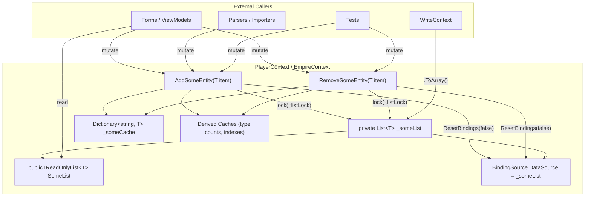

# Design Document: Read-Only List Encapsulation

## Overview

This design encapsulates all entity lists on `PlayerContext` (20 lists) and `EmpireContext` (9 lists) behind `IReadOnlyList<T>` public properties with private `List<T>` backing fields. All mutations route through dedicated `Add{Entity}`/`Remove{Entity}` methods that maintain UUID lookup caches inline at O(1) cost, eliminating full cache invalidation and fallback linear scans. BindingSource objects continue to wrap the underlying `List<T>` for WinForms data binding. Serialization, snapshot methods, and all existing read-only consumers continue to work unchanged.

The change is purely structural — no new features, no new data, no new UI. The goal is to close the mutation gap where external code could call `.Add()` or `.Remove()` on a public list field and bypass cache maintenance, leading to stale lookups or missed BindingSource notifications.

## Architecture

The encapsulation follows a simple pattern applied uniformly across both context singletons:

```
Before:  public List<T> SomeList;           // anyone can mutate
After:   private List<T> _someList;          // only context can mutate
         public IReadOnlyList<T> SomeList => _someList;  // consumers get read-only view
         public void AddSomeEntity(T item)   // controlled mutation + cache maintenance
         public void RemoveSomeEntity(T item) // controlled mutation + cache maintenance
```



### Key Design Decisions

1. **`IReadOnlyList<T>` over `ReadOnlyCollection<T>`**: `IReadOnlyList<T>` is an interface that `List<T>` already implements, so the property getter is a zero-cost cast — no wrapper allocation. `ReadOnlyCollection<T>` would add an unnecessary wrapper object.

2. **Expression-bodied property (`=> _someList`)**: The property returns the backing field directly. Since `IReadOnlyList<T>` is an interface, the caller cannot downcast to `List<T>` and mutate — the C# type system prevents it at compile time.

3. **Inline cache maintenance over Invalidate-then-rebuild**: Add/Remove methods update the UUID dictionary directly (O(1) insert/remove) instead of setting the cache to null and rebuilding on next Find. This avoids O(n) rebuilds on every mutation.

4. **Retain Invalidate methods**: Invalidate methods remain for bulk operations during Init (deserialization) and CascadeDeletePlayer. They set the cache to null, triggering a full rebuild on the next Find call. This is correct for bulk operations where many items change at once.


## Components and Interfaces

### PlayerContext Changes

#### Backing Fields and Properties (Requirement 1)

Each of the 20 public `List<T>` fields becomes a private field + public `IReadOnlyList<T>` property:

```csharp
// Before
public List<Blueprint> BlueprintList;

// After
private List<Blueprint> _blueprintList;
public IReadOnlyList<Blueprint> BlueprintList => _blueprintList;
```

Full list of conversions on PlayerContext:

| Current Field | Backing Field | Property Type | Has UUID Cache | Has BindingSource |
|---|---|---|---|---|
| `PlayerProfileList` | `_playerProfileList` | `IReadOnlyList<PlayerProfile>` | Yes | Yes |
| `BlueprintList` | `_blueprintList` | `IReadOnlyList<Blueprint>` | Yes | Yes |
| `SurveyList` | `_surveyList` | `IReadOnlyList<Survey>` | Yes | Yes |
| `ColonyList` | `_colonyList` | `IReadOnlyList<Colony>` | Yes | Yes |
| `DeliveryRouteList` | `_deliveryRouteList` | `IReadOnlyList<DeliveryRoute>` | Yes | No |
| `DeliveryPlanList` | `_deliveryPlanList` | `IReadOnlyList<DeliveryPlan>` | Yes | No |
| `PricingPlanList` | `_pricingPlanList` | `IReadOnlyList<PricingPlan>` | Yes | No |
| `BuildPlanList` | `_buildPlanList` | `IReadOnlyList<BuildPlan>` | Yes | No |
| `ShipTemplateList` | `_shipTemplateList` | `IReadOnlyList<ShipTemplate>` | Yes | No |
| `ShipList` | `_shipList` | `IReadOnlyList<Ship>` | Yes | No |
| `StationList` | `_stationList` | `IReadOnlyList<Station>` | Yes | No |
| `MarketListingList` | `_marketListingList` | `IReadOnlyList<MarketListing>` | Yes | No |
| `MarketTransactionList` | `_marketTransactionList` | `IReadOnlyList<MarketTransaction>` | Yes | No |
| `StockPlanList` | `_stockPlanList` | `IReadOnlyList<StockPlan>` | Yes | No |
| `StockProfileList` | `_stockProfileList` | `IReadOnlyList<StockProfile>` | Yes | No |
| `SupplyChainList` | `_supplyChainList` | `IReadOnlyList<SupplyChain>` | Yes | No |
| `WarehouseOverflowRuleList` | `_warehouseOverflowRuleList` | `IReadOnlyList<WarehouseOverflowRule>` | Yes | No |
| `FactionList` | `_factionList` | `IReadOnlyList<Faction>` | Yes | No |
| `ExternalCharacterList` | `_externalCharacterList` | `IReadOnlyList<ExternalCharacter>` | Yes | No |
| `AsteroidList` | `_asteroidList` | `IReadOnlyList<Asteroid>` | Yes | No |

#### Mutation Methods (Requirement 3)

Each list gets an `Add{Entity}` and `Remove{Entity}` method. The method body depends on whether the entity type has a UUID cache, a BindingSource, or derived caches.

**Pattern A: Entity with UUID cache + BindingSource + derived caches (Blueprint)**

```csharp
public void AddBlueprint(Blueprint item)
{
    lock (_listLock)
    {
        _blueprintList.Add(item);
        if (_blueprintCache != null && item.UUID != null)
            _blueprintCache[item.UUID] = item;
        _allBlueprintsCache = null;
        _blueprintTypeCountCache = null;
    }
    BindingSourceBlueprint.ResetBindings(false);
}

public void RemoveBlueprint(Blueprint item)
{
    lock (_listLock)
    {
        _blueprintList.Remove(item);
        if (_blueprintCache != null && item.UUID != null)
            _blueprintCache.Remove(item.UUID);
        _allBlueprintsCache = null;
        _blueprintTypeCountCache = null;
    }
    BindingSourceBlueprint.ResetBindings(false);
}
```

**Pattern B: Entity with UUID cache + BindingSource (Survey, Colony)**

```csharp
public void AddSurvey(Survey item)
{
    lock (_listLock)
    {
        _surveyList.Add(item);
        if (_surveyCache != null && item.UUID != null)
            _surveyCache[item.UUID] = item;
    }
    BindingSourceSurvey.ResetBindings(false);
}

public void RemoveSurvey(Survey item)
{
    lock (_listLock)
    {
        _surveyList.Remove(item);
        if (_surveyCache != null && item.UUID != null)
            _surveyCache.Remove(item.UUID);
    }
    BindingSourceSurvey.ResetBindings(false);
}
```

**Pattern C: Entity with UUID cache only (Station, ShipTemplate, Ship, Asteroid, Faction, MarketListing)**

```csharp
public void AddStation(Station item)
{
    lock (_listLock)
    {
        _stationList.Add(item);
        if (_stationCache != null && item.UUID != null)
            _stationCache[item.UUID] = item;
    }
}

public void RemoveStation(Station item)
{
    lock (_listLock)
    {
        _stationList.Remove(item);
        if (_stationCache != null && item.UUID != null)
            _stationCache.Remove(item.UUID);
    }
}
```

**Pattern D: Entity with UUID cache + derived caches (BuildPlan)**

```csharp
public void AddBuildPlan(BuildPlan item)
{
    lock (_listLock)
    {
        _buildPlanList.Add(item);
        if (_buildPlanCache != null && item.UUID != null)
            _buildPlanCache[item.UUID] = item;
        _blueprintBuildItemIndex = null;
        _buildLocationBuildItemIndex = null;
    }
}

public void RemoveBuildPlan(BuildPlan item)
{
    lock (_listLock)
    {
        _buildPlanList.Remove(item);
        if (_buildPlanCache != null && item.UUID != null)
            _buildPlanCache.Remove(item.UUID);
        _blueprintBuildItemIndex = null;
        _buildLocationBuildItemIndex = null;
    }
}
```

**Pattern E: Entity with UUID cache + BindingSource (PlayerProfile)**

```csharp
public void AddPlayerProfile(PlayerProfile item)
{
    lock (_listLock)
    {
        _playerProfileList.Add(item);
        if (_playerProfileCache != null && item.UUID != null)
            _playerProfileCache[item.UUID] = item;
    }
    BindingSourcePlayerProfile.ResetBindings(false);
}

public void RemovePlayerProfile(PlayerProfile item)
{
    lock (_listLock)
    {
        _playerProfileList.Remove(item);
        if (_playerProfileCache != null && item.UUID != null)
            _playerProfileCache.Remove(item.UUID);
    }
    BindingSourcePlayerProfile.ResetBindings(false);
}
```

**Pattern F: Entity with no cache, no BindingSource — ELIMINATED**

All entity types with a UUID property now have a UUID cache. This pattern no longer applies. The entities previously listed here (DeliveryRoute, DeliveryPlan, PricingPlan, MarketTransaction, StockPlan, StockProfile, SupplyChain, WarehouseOverflowRule, ExternalCharacter) now follow Pattern C (UUID cache only, no BindingSource).

New Find methods to add:
- `FindDeliveryRoute(string id)`
- `FindDeliveryPlan(string id)`
- `FindPricingPlan(string id)`
- `FindMarketTransaction(string id)`
- `FindStockPlan(string id)`
- `FindStockProfile(string id)`
- `FindSupplyChain(string id)`
- `FindWarehouseOverflowRule(string id)`
- `FindExternalCharacter(string id)`
- `FindPlayerProfile(string id)`

Each follows the same lazy-init dictionary cache pattern as the existing Find methods:

```csharp
private Dictionary<string, DeliveryRoute> _deliveryRouteCache;

public DeliveryRoute FindDeliveryRoute(string id)
{
    if (string.IsNullOrEmpty(id)) return null;
    lock (_listLock)
    {
        if (_deliveryRouteCache == null)
        {
            _deliveryRouteCache = new Dictionary<string, DeliveryRoute>();
            foreach (var r in _deliveryRouteList)
                if (r.UUID != null && !_deliveryRouteCache.ContainsKey(r.UUID))
                    _deliveryRouteCache[r.UUID] = r;
        }
        _deliveryRouteCache.TryGetValue(id, out var match);
        return match;
    }
}

public void InvalidateDeliveryRouteCache() { lock (_listLock) { _deliveryRouteCache = null; } }
```


### EmpireContext Changes

#### Backing Fields and Properties (Requirement 2)

| Current Field | Backing Field | Property Type | Has UUID Cache | Has BindingSource |
|---|---|---|---|---|
| `BlueprintTypeList` | `_blueprintTypeList` | `IReadOnlyList<BlueprintType>` | No | Yes |
| `ShipClassList` | `_shipClassList` | `IReadOnlyList<ShipClass>` | No | Yes |
| `TechLevelList` | `_techLevelList` | `IReadOnlyList<TechLevel>` | No | Yes |
| `EvolutionList` | `_evolutionList` | `IReadOnlyList<string>` | No | Yes |
| `ResourceList` | `_resourceList` | `IReadOnlyList<Resource>` | No | Yes |
| `ResourceGroupList` | `_resourceGroupList` | `IReadOnlyList<ResourceGroup>` | No | Yes |
| `ResourcePurityList` | `_resourcePurityList` | `IReadOnlyList<ResourcePurity>` | No | Yes |
| `GlobalBlueprintList` | `_globalBlueprintList` | `IReadOnlyList<Blueprint>` | Yes | No |
| `CommodityList` | `_commodityList` | `IReadOnlyList<Commodity>` | Yes (by name) | No |

#### Mutation Methods (Requirement 4)

EmpireContext follows the same patterns. Most EmpireContext lists are reference data loaded once at startup and rarely mutated, but the methods are provided for completeness and for migration/test scenarios.

**GlobalBlueprintList** (UUID cache, no BindingSource):

```csharp
public void AddGlobalBlueprint(Blueprint item)
{
    _globalBlueprintList.Add(item);
    if (_globalBlueprintCache != null && item.UUID != null)
        _globalBlueprintCache[item.UUID] = item;
}

public void RemoveGlobalBlueprint(Blueprint item)
{
    _globalBlueprintList.Remove(item);
    if (_globalBlueprintCache != null && item.UUID != null)
        _globalBlueprintCache.Remove(item.UUID);
}
```

**CommodityList** (name cache with `_commodityLock`):

```csharp
public void AddCommodity(Commodity item)
{
    lock (_commodityLock)
    {
        _commodityList.Add(item);
        if (_commodityNameCache != null && !string.IsNullOrEmpty(item.Name))
            _commodityNameCache[item.Name] = item;
    }
}

public void RemoveCommodity(Commodity item)
{
    lock (_commodityLock)
    {
        _commodityList.Remove(item);
        if (_commodityNameCache != null && !string.IsNullOrEmpty(item.Name))
            _commodityNameCache.Remove(item.Name);
    }
}
```

**BindingSource-only lists** (BlueprintType, ShipClass, TechLevel, Evolution, Resource, ResourceGroup, ResourcePurity):

```csharp
public void AddBlueprintType(BlueprintType item)
{
    _blueprintTypeList.Add(item);
    BindingSourceBlueprintType.ResetBindings(false);
}

public void RemoveBlueprintType(BlueprintType item)
{
    _blueprintTypeList.Remove(item);
    BindingSourceBlueprintType.ResetBindings(false);
}
```

Note: EmpireContext does not use `_listLock` for most lists because they are only mutated during initialization (single-threaded). The `_commodityLock` is used for CommodityList because `FindCommodity` is called from background threads.

### Find Method Changes (Requirement 6)

The three Find methods with fallback linear scans (`FindBlueprint`, `FindSurvey`, `FindColony`) have their fallback `FirstOrDefault` scans removed. After encapsulation, the cache is always correct because all mutations go through the Add/Remove methods which maintain the cache inline.

**Before (FindBlueprint):**
```csharp
if (_blueprintCache.TryGetValue(id, out var match))
    return match;

// Fallback: linear scan for items added after cache was built
var fallback = BlueprintList.FirstOrDefault(bp => bp.UUID == id);
if (fallback != null)
{
    _blueprintCache[id] = fallback;
    return fallback;
}
```

**After (FindBlueprint):**
```csharp
if (_blueprintCache.TryGetValue(id, out var match))
    return match;

// No fallback — cache is maintained inline by AddBlueprint/RemoveBlueprint
```

The `FindBlueprint` method still falls back to `EmpireContext.FindGlobalBlueprint(id)` outside the lock, as it does today. That behavior is unchanged.

The other Find methods (FindStation, FindShipTemplate, FindShip, FindBuildPlan, FindAsteroid, FindFaction, FindMarketListing) already have no fallback scans and require no changes to their lookup logic.

New Find methods are added for all remaining UUID entities that previously lacked them: FindPlayerProfile, FindDeliveryRoute, FindDeliveryPlan, FindPricingPlan, FindMarketTransaction, FindStockPlan, FindStockProfile, FindSupplyChain, FindWarehouseOverflowRule, FindExternalCharacter. All follow the same lazy-init dictionary cache pattern.

### BindingSource Compatibility (Requirement 7)

BindingSource objects continue to wrap the private `List<T>` backing field. The Init methods set `BindingSource.DataSource = _someList` (the private field), and the mutation methods call `ResetBindings(false)` after modifying the list.

```csharp
// In Init method (unchanged pattern)
_blueprintList = new List<Blueprint>(list);
BindingSourceBlueprint = new BindingSource();
BindingSourceBlueprint.DataSource = _blueprintList;  // wraps the private field

// In AddBlueprint (new)
lock (_listLock) { _blueprintList.Add(item); ... }
BindingSourceBlueprint.ResetBindings(false);  // notifies bound controls
```

`ResetBindings(false)` is called outside the lock to avoid potential deadlocks with UI thread marshaling. The BindingSource reads from the same `List<T>` instance, so the data is already updated when the notification fires.

### Serialization Compatibility (Requirement 8)

`WriteContext` continues to call `.ToArray()` on the backing fields within `_listLock`. The only change is the field name (e.g., `BlueprintList` → `_blueprintList`):

```csharp
// Before
playerRoot.Blueprint = BlueprintList.ToArray();

// After
playerRoot.Blueprint = _blueprintList.ToArray();
```

### Snapshot Methods (Requirement 12)

Snapshot methods continue to create `new List<T>` copies from the backing field within `_listLock`:

```csharp
// Before
public List<Colony> SnapshotColonyList()
{
    lock (_listLock) { return new List<Colony>(ColonyList); }
}

// After
public List<Colony> SnapshotColonyList()
{
    lock (_listLock) { return new List<Colony>(_colonyList); }
}
```


### Caller Migration Strategy (Requirements 9, 11)

All external code that calls `.Add()` or `.Remove()` on context list properties must be migrated to the new mutation methods. The migration is mechanical:

| Before | After |
|---|---|
| `ctx.BlueprintList.Add(bp)` | `ctx.AddBlueprint(bp)` |
| `ctx.BlueprintList.Remove(bp)` | `ctx.RemoveBlueprint(bp)` |
| `ctx.ColonyList.Add(colony)` | `ctx.AddColony(colony)` |
| `ctx.ColonyList.Remove(colony)` | `ctx.RemoveColony(colony)` |
| `empire.GlobalBlueprintList.Add(bp)` | `empire.AddGlobalBlueprint(bp)` |

Callers that only read the lists (LINQ queries, `foreach`, `.Count`, indexing) require no changes because `IReadOnlyList<T>` supports all read operations.

**Migration scope**: Forms, parsers, importers, migrations, background processors, tests, and any other code that directly mutates context lists. After migration, the compiler enforces the encapsulation — any remaining `.Add()` or `.Remove()` calls on the public property will fail to compile because `IReadOnlyList<T>` does not expose mutation methods.

### Derived Cache Invalidation (Requirement 13)

Blueprint mutations invalidate:
- `_blueprintTypeCountCache` (used by `CountBlueprintsByType`)
- `_allBlueprintsCache` (used by `GetAllBlueprints`)

BuildPlan mutations invalidate:
- `_blueprintBuildItemIndex` (used by `GetBuildItemsByBlueprint`)
- `_buildLocationBuildItemIndex` (used by `GetBuildItemsByLocation`)

These invalidations are set to `null` within the same `lock (_listLock)` scope as the list mutation, ensuring no race condition where a concurrent reader sees stale derived data.

### Thread Safety (Requirement 3.3, 3.4, 13.3)

All list mutations and UUID cache updates occur within `lock (_listLock)`. The lock scope covers:
1. The list `.Add()` or `.Remove()` call
2. The UUID cache dictionary insert or remove
3. The derived cache nullification

`ResetBindings(false)` is called outside the lock because it may marshal to the UI thread, and holding the lock during UI marshaling could deadlock if the UI thread is waiting on the lock for a read operation.

## Data Models

No changes to data models. All entity POCOs (Blueprint, Survey, Colony, etc.) remain unchanged. The `PlayerRoot` and `BaselineRoot` serialization classes remain unchanged. The only structural change is the field visibility on `PlayerContext` and `EmpireContext`.

## Correctness Properties

*A property is a characteristic or behavior that should hold true across all valid executions of a system — essentially, a formal statement about what the system should do. Properties serve as the bridge between human-readable specifications and machine-verifiable correctness guarantees.*

### Property 1: Add-then-Find round trip

*For any* entity type with a UUID cache (all 20 PlayerContext entity types: Blueprint, Survey, Colony, Station, ShipTemplate, Ship, BuildPlan, Asteroid, Faction, MarketListing, PlayerProfile, DeliveryRoute, DeliveryPlan, PricingPlan, MarketTransaction, StockPlan, StockProfile, SupplyChain, WarehouseOverflowRule, ExternalCharacter) and *for any* valid entity instance, adding the entity via the mutation method and then calling the corresponding Find method with the entity's UUID should return the same entity instance.

**Validates: Requirements 3.5, 4.3, 5.1, 5.5, 6.1, 6.2, 6.3**

### Property 2: Remove-then-Find returns null

*For any* entity type with a UUID cache and *for any* entity that was previously added to the list, removing the entity via the mutation method and then calling the corresponding Find method with the entity's UUID should return null (or delegate to EmpireContext for blueprints).

**Validates: Requirements 3.6, 4.4, 5.2, 6.4**

### Property 3: Serialization round trip

*For any* set of entities added to PlayerContext or EmpireContext via mutation methods, calling WriteContext to serialize and then reloading the context from the saved file should produce lists containing the same entities (by UUID and key fields).

**Validates: Requirements 8.1, 8.2**

### Property 4: Invalidate-then-Find rebuilds correctly

*For any* entity type with a UUID cache, if entities are added via mutation methods, then the Invalidate method is called (setting the cache to null), then Find is called, the Find method should still return the correct entity by rebuilding the cache from the backing list.

**Validates: Requirements 10.3**

### Property 5: Snapshot independence

*For any* entity list with a Snapshot method, the returned list should be an independent copy. Mutating the snapshot (adding or removing items) should not affect the backing list's count or contents, and mutating the backing list (via Add/Remove methods) should not affect the snapshot's count or contents.

**Validates: Requirements 12.1**

### Property 6: Blueprint mutation invalidates derived caches

*For any* blueprint added or removed via AddBlueprint/RemoveBlueprint, the BlueprintTypeCountCache should reflect the updated count on the next call to CountBlueprintsByType, and GetAllBlueprints should include/exclude the mutated blueprint.

**Validates: Requirements 13.1**

### Property 7: BuildPlan mutation invalidates build item indexes

*For any* build plan with build items added or removed via AddBuildPlan/RemoveBuildPlan, GetBuildItemsByBlueprint and GetBuildItemsByLocation should reflect the updated items on the next call.

**Validates: Requirements 13.2**


## Error Handling

- **Null UUID on Add**: If an entity with a null UUID is added, the mutation method adds it to the list but skips the cache insert (`if (item.UUID != null)`). This matches the current Init behavior where null UUIDs are skipped during cache building.
- **Remove of non-existent item**: `List<T>.Remove()` returns false if the item is not in the list. `Dictionary.Remove()` returns false if the key is not present. Both are safe no-ops. No exception is thrown.
- **Cache not initialized on mutation**: If the UUID cache is null when Add is called (e.g., between Init and first Find), the mutation method checks `if (_someCache != null)` and skips the cache update. The cache will be built from the full list on the next Find call, which will include the newly added item.
- **BindingSource not initialized**: During early initialization, BindingSource may not yet be created. Mutation methods should null-check the BindingSource before calling ResetBindings: `BindingSourceBlueprint?.ResetBindings(false)`.
- **Concurrent access**: All mutations are protected by `_listLock`. Read-only access via `IReadOnlyList<T>` properties is safe for iteration (the list reference doesn't change), but callers doing multi-step reads should use Snapshot methods for consistency, as they do today.

## Testing Strategy

### Property-Based Tests (NUnit + FsCheck)

Use **FsCheck** (NuGet: `FsCheck` + `FsCheck.NUnit`) for property-based testing. FsCheck integrates with NUnit and supports .NET Framework 4.8.1.

Each correctness property maps to a single property-based test. Minimum 100 iterations per test.

```csharp
// Example: Property 1 — Add-then-Find round trip for Blueprint
[FsCheck.NUnit.Property(MaxTest = 100)]
// Feature: readonly-list-encapsulation, Property 1: Add-then-Find round trip
public Property AddBlueprint_ThenFindByUUID_ReturnsSameInstance()
{
    return Prop.ForAll(
        Arb.From<NonEmptyString>(),
        Arb.From<NonEmptyString>(),
        (uuid, name) =>
        {
            var ctx = SetupFreshContext();
            var bp = new Blueprint { UUID = uuid.Get, Name = name.Get };
            ctx.AddBlueprint(bp);
            var found = ctx.FindBlueprint(uuid.Get);
            return (found == bp).ToProperty();
        });
}
```

Tag format: `Feature: readonly-list-encapsulation, Property {N}: {title}`

### Unit Tests (NUnit)

Unit tests cover specific examples, edge cases, and integration points:

- **BindingSource count reflects mutations**: Add an item, verify `BindingSource.Count` increased. Remove it, verify count decreased.
- **Null UUID handling**: Add an entity with null UUID, verify it's in the list but Find returns null for null.
- **Remove non-existent item**: Call Remove with an item not in the list, verify no exception and list unchanged.
- **WriteContext after mutations**: Add items, call WriteContext, reload, verify items present.
- **Snapshot independence**: Get snapshot, mutate original, verify snapshot unchanged.
- **Derived cache invalidation**: Add blueprint, verify CountBlueprintsByType reflects it. Add build plan with items, verify GetBuildItemsByBlueprint returns them.
- **Compiler enforcement**: After migration, verify that `getDiagnostics` reports no errors — confirming all callers compile against `IReadOnlyList<T>`.

### Migration Verification

After all callers are migrated, a grep-based check confirms no remaining direct mutations:

```
grep -rn "\.BlueprintList\.Add\|\.BlueprintList\.Remove\|\.ColonyList\.Add\|\.ColonyList\.Remove" --include="*.cs"
```

This should return zero results outside of PlayerContext.cs itself. The compiler also enforces this — `IReadOnlyList<T>` has no `Add`/`Remove` methods, so any remaining direct mutation calls will fail to compile.
