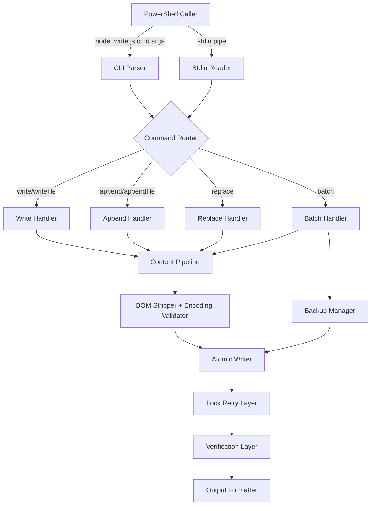
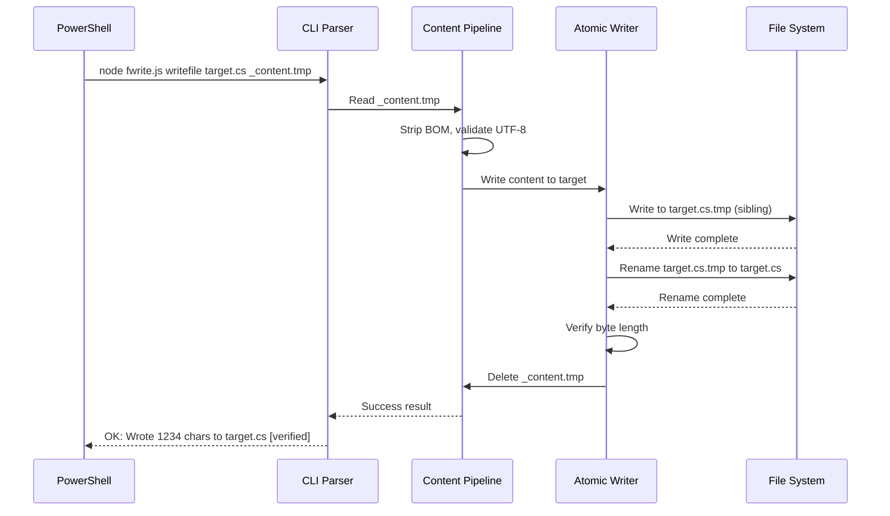
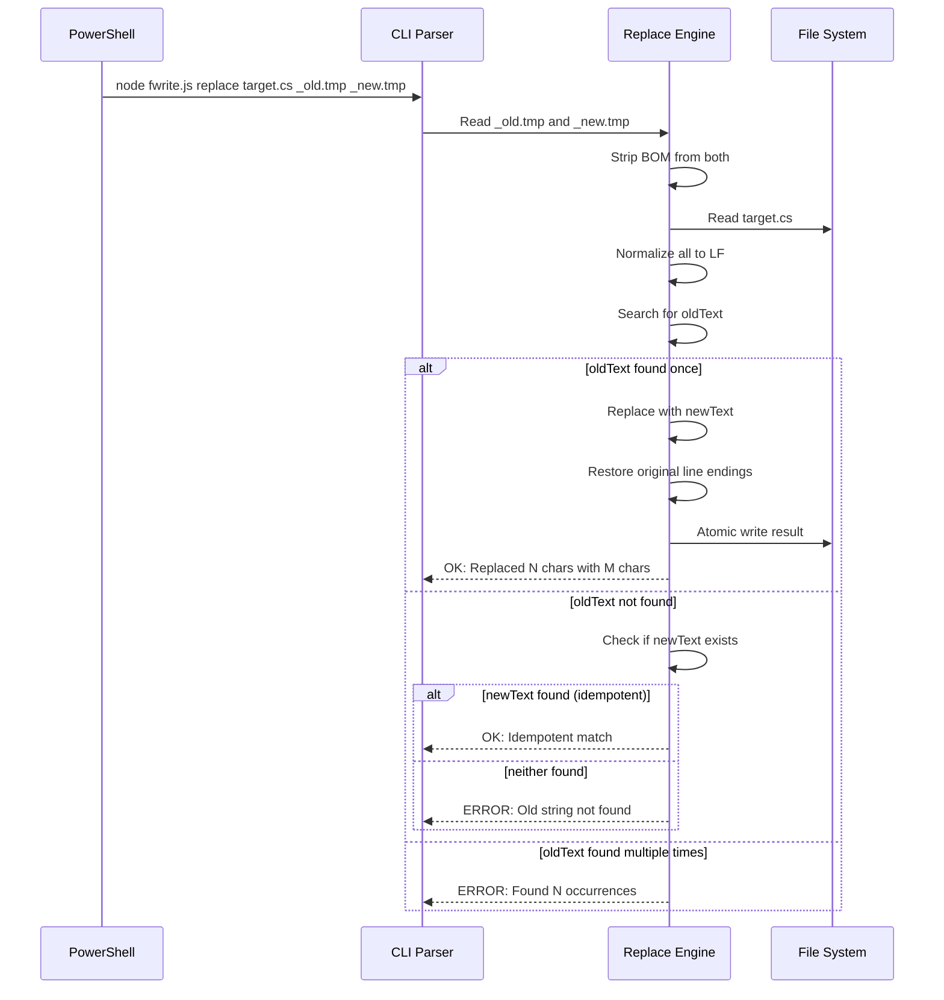

# Design Document: Reliable File Writer

## Overview

The Reliable File Writer is a Node.js CLI tool that replaces the existing `fwrite.js` at `.kiro/tools/fwrite.js`. It provides atomic file write, append, and replace operations for AI agents working in PowerShell on Windows. The tool consolidates content delivery via temp files or stdin, handles Unicode/BOM correctly, retries on file locks, supports batch operations with rollback, and produces structured success/error output.

The tool is invoked as:
```
node .kiro/tools/fwrite.js <command> [args...]
```

### Design Goals

1. **Reliability** - Atomic writes prevent corruption on crash/timeout
2. **Correctness** - Unicode preserved, BOM stripped, line endings normalized for matching then restored
3. **Observability** - Structured output prefixed with `OK:` or `ERROR:` for machine parsing
4. **Simplicity** - Single-file Node.js script with zero external dependencies (only `fs`, `path`, `os`)
5. **Backward Compatibility** - Supports all existing invocation patterns from the current fwrite.js

### Key Differences from Current fwrite.js

| Aspect | Current | New |
|--------|---------|-----|
| Atomic writes | No (direct writeFileSync) | Yes (write-to-temp + rename) |
| File lock retry | No | Yes (3 retries, exponential backoff) |
| Batch operations | No | Yes (manifest file, all-or-nothing) |
| Write verification | No | Yes (read-back byte length check) |
| Error format | Unstructured | Structured with OK:/ERROR: prefix |
| Stdin timeout | No (can hang forever) | Yes (5-second timeout) |
| Idempotent replace | No (fails if old not found) | Yes (succeeds if new already present) |


## Architecture

### Single-File Design

The tool is a single Node.js script (`.kiro/tools/fwrite.js`) with no external dependencies. All functionality uses Node.js built-in modules:

- `fs` - File system operations (read, write, rename, unlink, stat)
- `path` - Path manipulation and normalization
- `os` - OS-specific temp directory and EOL detection

### Execution Flow

1. CLI Parser validates arguments and determines command
2. Content Pipeline reads input (from content file or stdin)
3. BOM Stripper removes leading U+FEFF if present
4. Encoding Validator checks for invalid UTF-8 sequences (warns but continues)
5. For replace: Line Ending Normalizer converts to LF for matching
6. Atomic Writer performs the file operation (write-to-temp + rename for existing files)
7. Lock Retry Layer retries on EBUSY/EPERM/EACCES (up to 3 times, exponential backoff)
8. Verification Layer reads back and checks byte length
9. Output Formatter emits OK: or ERROR: prefixed result

### Component Diagram




### Sequence Diagram: Write Operation



### Sequence Diagram: Replace with Idempotency Check




### Module Structure (within single file)

The script is organized into logical sections:

1. **Constants** - Exit codes, retry config, timeouts
2. **Utilities** - BOM stripping, encoding validation, line ending detection/normalization
3. **Content Pipeline** - Read from file or stdin, process through BOM/encoding
4. **Atomic Writer** - Write-to-temp + rename strategy with lock retry
5. **Verification** - Read-back and byte length comparison
6. **Backup Manager** - Create/restore/cleanup backups for batch operations
7. **Command Handlers** - write, append, replace, batch
8. **CLI Parser** - Argument parsing and command routing
9. **Output Formatter** - Structured OK:/ERROR: output generation
10. **Main** - Entry point, error boundary

## Components and Interfaces

### CLI Interface

```
node .kiro/tools/fwrite.js <command> <target_file> [args...]
```

#### Commands

| Command | Arguments | Description |
|---------|-----------|-------------|
| `write` | `<target>` | Read stdin, overwrite target |
| `writefile` | `<target> <content_file>` | Read content_file, overwrite target |
| `append` | `<target>` | Read stdin, append to target |
| `appendfile` | `<target> <content_file>` | Read content_file, append to target |
| `replace` | `<target> <old_file> <new_file>` | Replace old with new in target |
| `batch` | `<manifest_file>` | Execute batch from manifest |

#### Exit Codes

| Code | Meaning |
|------|---------|
| 0 | Success (including idempotent match) |
| 1 | General error (file not found, parse error) |
| 2 | Replace: old string not found (and new not present) |
| 3 | Replace: old string found multiple times |
| 4 | File locked after all retries |
| 5 | Stdin timeout |
| 6 | Verification failed (byte length mismatch) |
| 7 | Batch validation failed |
| 8 | Batch operation failed (rollback attempted) |


### Content Pipeline Interface

```javascript
/**
 * Reads content from a file path, strips BOM, validates UTF-8.
 * @param {string} filePath - Path to content file
 * @param {boolean} deleteAfter - Whether to delete the file after reading
 * @returns {{ content: string, warnings: string[] }}
 */
function readContentFile(filePath, deleteAfter)

/**
 * Reads content from stdin with timeout.
 * @param {number} timeoutMs - Timeout in milliseconds (default 5000)
 * @returns {Promise<{ content: string, warnings: string[] }>}
 */
function readStdin(timeoutMs)
```

### Atomic Writer Interface

```javascript
/**
 * Writes content atomically using write-to-temp + rename strategy.
 * Falls back to direct write for new files.
 * Retries on EBUSY/EPERM/EACCES with exponential backoff.
 * @param {string} targetPath - Final destination path
 * @param {string} content - Content to write
 * @returns {{ bytesWritten: number, retryAttempt: number }}
 */
function atomicWrite(targetPath, content)

/**
 * Appends content to a file with lock retry.
 * Creates file + parent dirs if target does not exist.
 * @param {string} targetPath - File to append to
 * @param {string} content - Content to append
 * @returns {{ bytesWritten: number, retryAttempt: number }}
 */
function appendToFile(targetPath, content)
```

### Replace Engine Interface

```javascript
/**
 * Performs a unique string replacement in a file.
 * Normalizes line endings for matching, restores original convention.
 * Supports idempotency check (if old not found but new exists, reports success).
 * @param {string} targetPath - File to modify
 * @param {string} oldText - Text to find (normalized to LF for matching)
 * @param {string} newText - Replacement text
 * @returns {{ oldLen: number, newLen: number, idempotent: boolean }}
 */
function replaceInFile(targetPath, oldText, newText)
```


### Batch Manager Interface

```javascript
/**
 * Manifest file format (JSON):
 * {
 *   "operations": [
 *     { "op": "write", "target": "path/file.cs", "content_file": "_c1.tmp" },
 *     { "op": "append", "target": "path/file.cs", "content_file": "_c2.tmp" },
 *     { "op": "replace", "target": "path/file.cs", "old_file": "_o.tmp", "new_file": "_n.tmp" }
 *   ]
 * }
 */

/**
 * Validates all operations before executing any.
 * Checks: content files exist, target files writable, manifest well-formed.
 * @param {object} manifest - Parsed manifest object
 * @returns {{ valid: boolean, errors: string[] }}
 */
function validateBatch(manifest)

/**
 * Executes batch with backup/rollback semantics.
 * Creates backups before each operation, rolls back all on failure.
 * @param {object} manifest - Validated manifest
 * @returns {{ completed: number, rolledBack: boolean }}
 */
function executeBatch(manifest)
```

### Output Formatter Interface

```javascript
/**
 * Formats a success message.
 * @param {string} message - Human-readable success description
 * @returns {string} - "OK: <message> [verified]"
 */
function formatSuccess(message)

/**
 * Formats an error message with structured fields.
 * @param {object} error - { operation, path, reason, remediation }
 * @returns {string} - "ERROR: <structured message>"
 */
function formatError(error)
```

### Lock Retry Configuration

```javascript
const RETRY_CONFIG = {
    maxRetries: 3,
    backoffMs: [100, 200, 400],
    retryableCodes: ['EBUSY', 'EPERM', 'EACCES']
};
```

### Stdin Timeout Configuration

```javascript
const STDIN_TIMEOUT_MS = 5000;
```


## Data Models

### Operation Result

```javascript
/**
 * @typedef {object} OperationResult
 * @property {boolean} success
 * @property {string} message - Human-readable description
 * @property {number} charsWritten - Characters written/appended/replaced
 * @property {string} targetPath - Resolved target file path
 * @property {boolean} verified - Whether read-back verification passed
 * @property {number} [retryAttempt] - Which retry succeeded (0 = first try)
 * @property {boolean} [idempotent] - True if replace found new_text already present
 * @property {string[]} warnings - Non-fatal warnings (e.g., invalid UTF-8 bytes)
 */
```

### Operation Error

```javascript
/**
 * @typedef {object} OperationError
 * @property {string} operation - "write" | "append" | "replace" | "batch"
 * @property {string} path - File path involved
 * @property {string} reason - Specific error description
 * @property {string} remediation - Suggested fix
 * @property {number} exitCode - Process exit code to use
 * @property {string} [preview] - First 80 chars of old_text (replace failures)
 * @property {number[]} [lineNumbers] - Line numbers of occurrences (multi-match)
 */
```

### Batch Manifest

```javascript
/**
 * @typedef {object} BatchManifest
 * @property {BatchOperation[]} operations
 */

/**
 * @typedef {object} BatchOperation
 * @property {"write"|"append"|"replace"} op
 * @property {string} target - Target file path
 * @property {string} [content_file] - Content source (write/append)
 * @property {string} [old_file] - Old text file (replace)
 * @property {string} [new_file] - New text file (replace)
 */
```

### Backup Entry

```javascript
/**
 * @typedef {object} BackupEntry
 * @property {string} targetPath - Original file path
 * @property {string} backupPath - Backup file path (target + '.bak.' + timestamp)
 * @property {boolean} existed - Whether target existed before operation
 */
```


## Correctness Properties

*A property is a characteristic or behavior that should hold true across all valid executions of a system - essentially, a formal statement about what the system should do. Properties serve as the bridge between human-readable specifications and machine-verifiable correctness guarantees.*

### Property 1: Write round-trip preserves content

*For any* valid UTF-8 string (including multi-byte characters, empty strings, and strings with embedded newlines), writing it to a file via writefile and then reading the file back SHALL produce the identical string (after BOM stripping of the input).

**Validates: Requirements 1.1, 5.1, 5.2, 5.4**

### Property 2: Append preserves existing content

*For any* existing file content and any valid append content, after an append operation the file SHALL contain the original content followed immediately by the appended content, with no bytes added, removed, or modified in between.

**Validates: Requirements 2.1, 2.3**

### Property 3: Replace is idempotent when new_text already present

*For any* file containing new_text but not old_text, a replace operation SHALL succeed with exit code 0 and report an idempotent match, leaving the file unchanged.

**Validates: Requirements 3.8, 3.9**

### Property 4: Replace uniqueness enforcement

*For any* file content where old_text appears N times (N != 1), the replace operation SHALL fail without modifying the file. If N = 0 and new_text is absent, exit with code 2. If N > 1, exit with code 3.

**Validates: Requirements 3.4, 3.10, 3.11**

### Property 5: Line ending normalization round-trip

*For any* file with consistent CRLF line endings and any old_text/new_text pair where old_text appears exactly once, after replacement the file SHALL still have CRLF line endings throughout (no mixed LF/CRLF).

**Validates: Requirements 3.2, 3.3, 3.5**

### Property 6: Atomic write crash safety

*For any* write or replace operation on an existing file, if the process is terminated after the temp file is written but before rename completes, the original target file SHALL remain unchanged (its content matches the pre-operation state).

**Validates: Requirements 4.1, 4.2, 4.5**

### Property 7: BOM stripping is universal

*For any* content file that begins with the UTF-8 BOM sequence (EF BB BF), the written output SHALL NOT contain the BOM regardless of operation type (write, append, or replace).

**Validates: Requirements 1.6, 2.6, 3.12, 5.3**

### Property 8: Batch atomicity

*For any* batch manifest with N operations where operation K fails (1 <= K <= N), all operations 1 through K-1 SHALL be rolled back and their target files SHALL match their pre-batch state.

**Validates: Requirements 7.3, 7.4**

### Property 9: Verification detects corruption

*For any* write operation where the file system reports success but the read-back byte length differs from the expected output length, the tool SHALL exit with code 6 and report the mismatch.

**Validates: Requirements 8.1, 8.2**

### Property 10: Lock retry convergence

*For any* file that is locked for fewer than 3 retry intervals (total < 700ms), the write operation SHALL eventually succeed and report which retry attempt succeeded.

**Validates: Requirements 6.1, 6.3**


## Error Handling

### Error Classification

| Category | Exit Code | Retryable | Example |
|----------|-----------|-----------|---------|
| Input error | 1 | No | Content file not found, invalid arguments |
| Replace not found | 2 | No | Old text absent from target (and new text absent) |
| Replace ambiguous | 3 | No | Old text appears multiple times |
| File locked | 4 | Yes (auto) | Another process holds exclusive lock |
| Stdin timeout | 5 | No | Pipe buffer stall, no data within 5s |
| Verification fail | 6 | No | Read-back byte count mismatch |
| Batch validation | 7 | No | Missing content files, invalid manifest JSON |
| Batch execution | 8 | No | Operation failed mid-batch (rollback attempted) |

### Error Output Format

All errors are written to stdout (not stderr) with the prefix `ERROR:` for consistent machine parsing:

```
ERROR: [operation] [path] - [reason]. Suggested fix: [remediation]
```

Examples:
```
ERROR: replace src/Models/Item.cs - Old string not found (247 chars, starts with: "public class Item..."). Suggested fix: Verify the old text matches the current file content exactly.
ERROR: replace src/Models/Item.cs - Old string found 3 times (lines 12, 45, 89). Suggested fix: Include more surrounding context to make the match unique.
ERROR: write src/NewFile.cs - File locked after 3 retries (700ms total). Suggested fix: Close the application or IDE that has the file open.
ERROR: batch _manifest.json - Validation failed: content file '_c2.tmp' does not exist. Suggested fix: Ensure all content files are written before invoking batch.
```

### Error Recovery Strategy

1. **Lock retry** - Automatic, transparent to caller. Reports which attempt succeeded.
2. **Batch rollback** - Automatic. Restores all modified files from backups on any failure.
3. **Temp file cleanup** - On error, temp sibling files are deleted. Content files are NOT deleted on error (caller can retry).
4. **Idempotent replace** - If old_text is gone but new_text is present, treat as success (previous run completed).

### Filesystem Error Mapping

| OS Error Code | Human Message |
|---------------|---------------|
| ENOENT | File or directory does not exist |
| EACCES | Permission denied (file may be read-only) |
| EPERM | Operation not permitted (may be locked by another process) |
| EBUSY | File is busy (locked by another process) |
| ENOSPC | Disk is full |
| ENAMETOOLONG | File path exceeds OS maximum length |
| EISDIR | Expected a file but found a directory |


## Testing Strategy

### Property-Based Testing

The Reliable File Writer is well-suited for property-based testing because:
- It has pure-function-like behavior (input content -> output file)
- Universal properties hold across all valid inputs (any UTF-8 string)
- The input space is large (arbitrary strings, line endings, BOM presence)
- Edge cases are numerous (empty files, multi-byte chars, concurrent locks)

**Library**: fast-check (JavaScript property-based testing library)
**Minimum iterations**: 100 per property test
**Tag format**: Feature: reliable-file-writer, Property N: <property text>

### Test Categories

#### Property Tests (fast-check)
- Write round-trip (Property 1)
- Append preserves existing (Property 2)
- Replace idempotency (Property 3)
- Replace uniqueness enforcement (Property 4)
- Line ending normalization (Property 5)
- BOM stripping universality (Property 7)

#### Unit Tests (example-based)
- Atomic write with simulated crash (Property 6) - uses mock fs
- Batch rollback on failure (Property 8) - uses temp directories
- Verification mismatch detection (Property 9) - uses mock fs
- Lock retry behavior (Property 10) - uses mock fs with timed unlock
- Stdin timeout behavior - uses mock stdin
- Error message formatting - verifies structured output format
- CLI argument parsing - verifies command routing

#### Integration Tests
- End-to-end PowerShell invocation with real files
- Large file (100KB, 500KB) performance within time bounds
- Real file lock scenarios (open file handle in separate process)
- Batch with mixed operations on real filesystem

### Test File Structure

```
.kiro/tools/
  fwrite.js              # The tool itself
  fwrite.test.js         # Property + unit tests (fast-check + Node assert)
  fwrite.integration.js  # Integration tests (real filesystem)
```

### Performance Assertions

- 100KB write: < 2 seconds (Requirement 12.1)
- 500KB write: < 5 seconds (Requirement 12.2)
- Measured via `process.hrtime.bigint()` in integration tests
