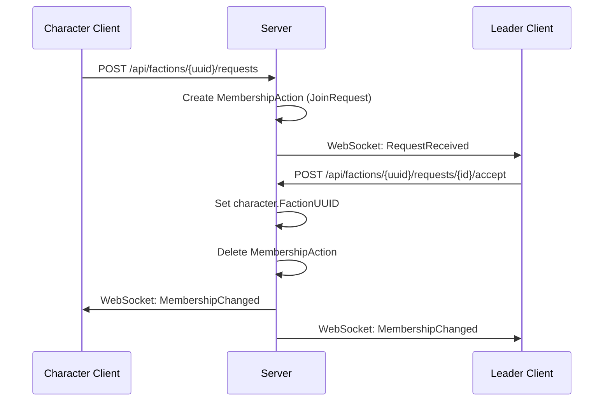
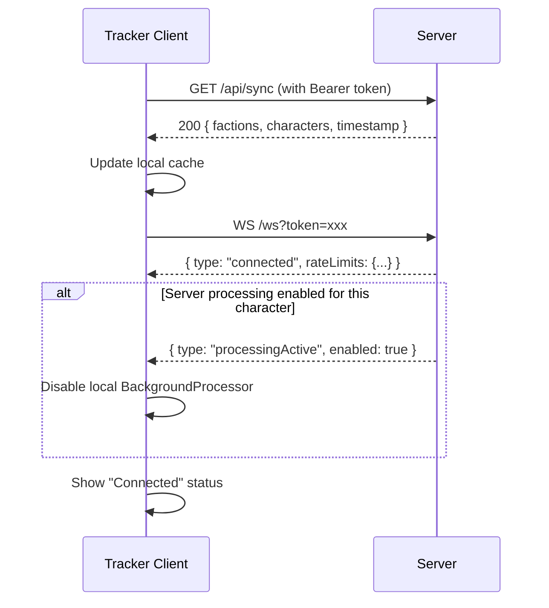
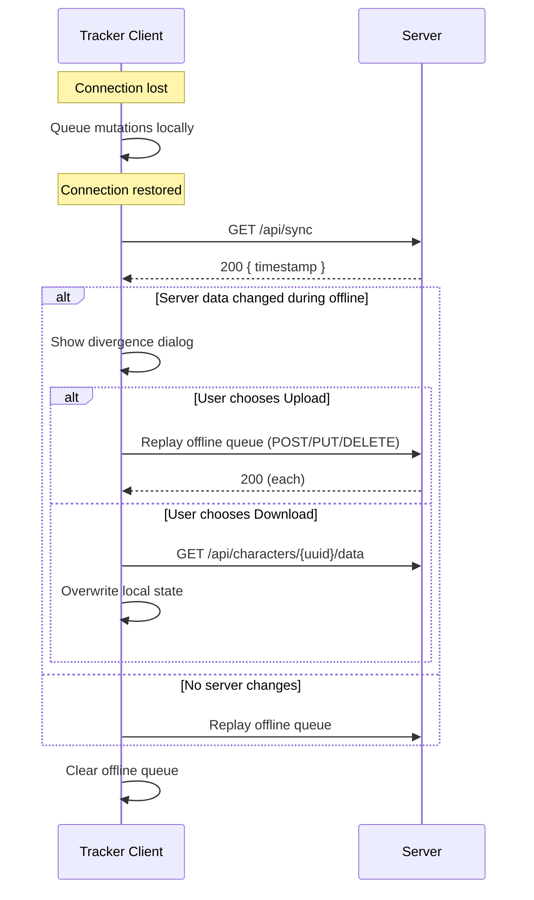
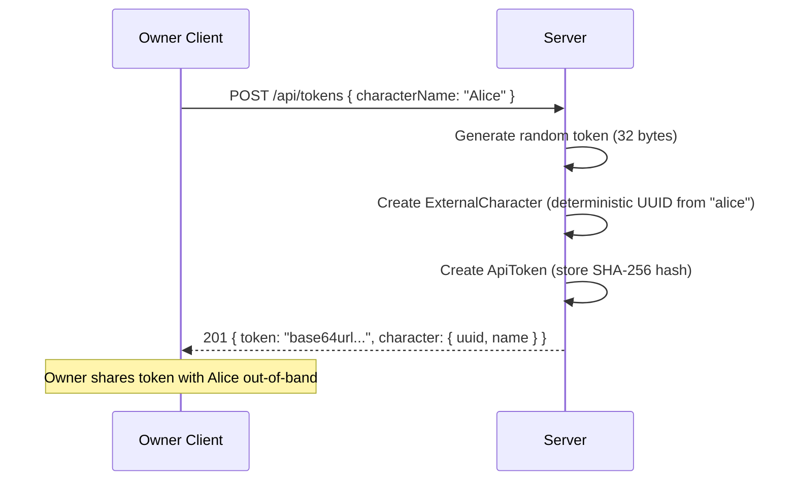

# Remote Faction Service — Design

## Overview

This document describes the technical design for the Remote Faction Service, a headless .NET 8+ server that provides centralized faction/character data storage, real-time synchronization, and background processing for multiple OE2 Empire Tracker clients.

Satisfies: REQ 1–20 (all requirements in requirements.md)


## 1. Solution Architecture

```
OE2EmpireTracker.sln (existing)
├── OE2EmpireTracker/              → renamed to OE2EmpireTracker.Tool (WinForms client)
│   Target: .NET Framework 4.8.1
│   References: OE2EmpireTracker.Common
│
├── OE2EmpireTracker.Common/       → NEW shared library
│   Target: .NET Standard 2.0
│   Contains: Models, Constants, Services (pure logic), Interfaces
│
├── OE2EmpireTracker.Server/       → NEW headless service
│   Target: .NET 8.0 (ASP.NET Core Minimal API)
│   References: OE2EmpireTracker.Common
│
├── OE2EmpireTracker.Tests/        → existing test project
│   References: OE2EmpireTracker.Common, OE2EmpireTracker.Tool
│
└── OE2EmpireTracker.Server.Tests/ → NEW server test project
    Target: .NET 8.0
    References: OE2EmpireTracker.Common, OE2EmpireTracker.Server
```

### 1.1 Common Library Boundary

The Common library (.NET Standard 2.0) contains everything that both Tool and Server need:

| Layer | Contents |
|-------|----------|
| Models/ | All POCOs, enums, ReadOnly wrappers, request/response DTOs |
| Constants/ | GameConstants, BlueprintTypes, SlotTypes, RefiningRecipes, ResearchTimeLookup, BlueprintPropertyKeys, BlueprintPropertyValidation |
| Services/ | Pure business logic: BackgroundProcessor (core algorithm), BuildTimeCalculator, BuildOrderOptimizer, ColonyStatusCalculator, ColonyActivityCollector, ColonyBuildEligibility, ColonyBootstrap, DeliveryFulfillment, PriceCalculator, QueueCalculator, DeterministicUUID, CollectionSortHelper, SerializationSorter, JsonSettings |
| Interfaces/ | IStorageProvider, IClock, IPlayerDataStore, IBaselineDataStore |

### 1.2 What Stays in Tool

| Layer | Contents |
|-------|----------|
| Forms/ | All WinForms UI, Designer files |
| Controls/ | Custom WinForms controls |
| ViewModels/ | UI-bound view models |
| Persistence/ | SafeFileWriter, WindowStateHelper, BoundsValidator, PreferencesStore |
| Client/ | RemoteFactionClient (HTTP+WS), OfflineQueue, SyncManager |
| Parsers/ | ColonyParser, SurveyParser (HTML scraping) |

### 1.3 What Goes in Server

| Layer | Contents |
|-------|----------|
| Endpoints/ | Minimal API route groups (Factions, Characters, Data, Tokens, Admin, Sync, WebSocket) |
| Auth/ | TokenAuthHandler, RoleAuthorization, TokenStore |
| Storage/ | IStorageBackend implementations (JsonFileStorage, SqliteStorage, PostgresStorage, DynamoStorage) |
| Processing/ | ServerBackgroundProcessor (wraps Common's processing logic) |
| Push/ | WebSocketHub, EventDispatcher |
| Config/ | ServiceConfiguration, CertificateManager |


## 2. Data Models (Server-Side Extensions)

### 2.1 Existing Models (from Common)

These move to Common unchanged:
- `Faction` { UUID, Name, Description }
- `ExternalCharacter` { UUID, Name, FactionUUID }
- All other existing models (Colony, Blueprint, Survey, etc.)

### 2.2 New Server Models

```csharp
// Token record stored server-side
public class ApiToken
{
    public string Id { get; set; }                    // Random ID for management
    public string TokenHash { get; set; }             // SHA-256 of the actual token
    public string CharacterUUID { get; set; }         // Linked character (null for Owner)
    public TokenRole Role { get; set; }               // Owner, FactionLeader, Character
    public string FactionUUID { get; set; }           // For FactionLeader role only
    public DateTime CreatedUtc { get; set; }
    public DateTime? LastUsedUtc { get; set; }
    public bool IsRevoked { get; set; }
    public RateLimitConfig RateLimits { get; set; }
}

public enum TokenRole
{
    Owner,
    FactionLeader,
    Character
}

public class RateLimitConfig
{
    public int RequestsPerMinute { get; set; } = 60;
}

// Faction membership request/invitation
public class MembershipAction
{
    public string Id { get; set; }                    // Unique ID
    public string FactionUUID { get; set; }
    public string CharacterUUID { get; set; }
    public MembershipActionType Type { get; set; }    // Request or Invitation
    public DateTime CreatedUtc { get; set; }
    public DateTime ExpiresUtc { get; set; }
}

public enum MembershipActionType
{
    JoinRequest,
    Invitation
}

// Sharing configuration per character
public class SharingRule
{
    public string Id { get; set; }
    public string OwnerCharacterUUID { get; set; }    // Who owns the data
    public string TargetUUID { get; set; }            // Faction or Character UUID
    public SharingTargetType TargetType { get; set; } // Faction or Character
    public string DataType { get; set; }              // e.g. "Blueprints", "Colonies", or null for item-level
    public string EntityUUID { get; set; }            // Specific entity, or null for category-level
}

public enum SharingTargetType
{
    Faction,
    Character
}

// Character preferences (server-side)
public class CharacterPreferences
{
    public string CharacterUUID { get; set; }
    public bool ServerProcessing { get; set; }        // Opt-in to server-side processing
}

// Server metadata attached to entities
public class EntityMetadata
{
    public DateTime LastModifiedUtc { get; set; }
    public string ModifiedByTokenId { get; set; }
}
```

### 2.3 Extended Faction Model (Server)

The server extends the base Faction with membership tracking:

```csharp
// Server-side wrapper adding membership state
public class ServerFaction
{
    public Faction Data { get; set; }                 // Core faction data (from Common)
    public List<string> LeaderCharacterUUIDs { get; set; } = new(); // Multiple co-leaders
    public EntityMetadata Metadata { get; set; }
}
```


## 3. Storage Abstraction

### 3.1 Interface

```csharp
public interface IStorageBackend
{
    // Lifecycle
    Task InitializeAsync(CancellationToken ct);
    Task<bool> ValidateConnectionAsync(CancellationToken ct);

    // Factions
    Task<ServerFaction> GetFactionAsync(string uuid);
    Task<IReadOnlyList<ServerFaction>> GetAllFactionsAsync();
    Task UpsertFactionAsync(ServerFaction faction);
    Task DeleteFactionAsync(string uuid);

    // Characters
    Task<ExternalCharacter> GetCharacterAsync(string uuid);
    Task<IReadOnlyList<ExternalCharacter>> GetAllCharactersAsync();
    Task UpsertCharacterAsync(ExternalCharacter character, EntityMetadata metadata);
    Task DeleteCharacterAsync(string uuid);

    // Character Data (per data type)
    Task<string> GetCharacterDataAsync(string characterUUID, string dataType);
    Task<string> GetCharacterEntityAsync(string characterUUID, string dataType, string entityUUID);
    Task UpsertCharacterDataAsync(string characterUUID, string dataType, string json);
    Task UpsertCharacterEntityAsync(string characterUUID, string dataType, string entityUUID, string json);
    Task DeleteCharacterEntityAsync(string characterUUID, string dataType, string entityUUID);
    Task<string> GetAllCharacterDataAsync(string characterUUID);
    Task PutAllCharacterDataAsync(string characterUUID, string json);

    // Global/Baseline Data
    Task<string> GetGlobalDataAsync(string dataType);
    Task UpsertGlobalDataAsync(string dataType, string json);

    // Tokens
    Task<ApiToken> FindTokenByHashAsync(string tokenHash);
    Task<IReadOnlyList<ApiToken>> GetAllTokensAsync();
    Task UpsertTokenAsync(ApiToken token);
    Task DeleteTokenAsync(string id);

    // Membership Actions
    Task<IReadOnlyList<MembershipAction>> GetFactionActionsAsync(string factionUUID);
    Task UpsertMembershipActionAsync(MembershipAction action);
    Task DeleteMembershipActionAsync(string id);
    Task DeleteExpiredActionsAsync(DateTime cutoff);

    // Sharing Rules
    Task<IReadOnlyList<SharingRule>> GetSharingRulesForCharacterAsync(string characterUUID);
    Task UpsertSharingRulesAsync(string characterUUID, IReadOnlyList<SharingRule> rules);

    // Character Preferences
    Task<CharacterPreferences> GetCharacterPreferencesAsync(string characterUUID);
    Task UpsertCharacterPreferencesAsync(CharacterPreferences prefs);

    // Sync
    Task<SyncSnapshot> GetFullSnapshotAsync();
}
```

### 3.2 Backend Implementations

| Backend | Class | Config Key | Notes |
|---------|-------|-----------|-------|
| JSON Files | `JsonFileStorageBackend` | `Storage:Backend = "JsonFile"` | Default. One JSON file per character + globals.json + tokens.json + factions.json. Atomic writes via temp+rename. |
| SQLite | `SqliteStorageBackend` | `Storage:Backend = "Sqlite"` | Single .db file. Uses Microsoft.Data.Sqlite. Tables mirror the JSON structure. |
| PostgreSQL | `PostgresStorageBackend` | `Storage:Backend = "Postgres"` | Connection string in config. Uses Npgsql. Suitable for RDS. |
| DynamoDB | `DynamoStorageBackend` | `Storage:Backend = "DynamoDB"` | Table name + region in config. Uses AWSSDK.DynamoDBv2. Single-table design with PK=EntityType#UUID, SK=DataType. |

### 3.3 JSON File Layout

```
data/
├── factions.json          # All ServerFaction records
├── characters.json        # All ExternalCharacter records + metadata
├── tokens.json            # All ApiToken records (hashed)
├── membership-actions.json # Pending requests/invitations
├── global/
│   ├── BlueprintTypes.json
│   ├── ShipClasses.json
│   ├── TechLevels.json
│   ├── Commodities.json
│   ├── RefiningRecipes.json
│   ├── ResearchTimes.json
│   └── GlobalBlueprints.json
└── characters/
    ├── {uuid}/
    │   ├── Blueprints.json
    │   ├── Colonies.json
    │   ├── Surveys.json
    │   ├── DeliveryRoutes.json
    │   ├── DeliveryPlans.json
    │   ├── BuildPlans.json
    │   ├── Ships.json
    │   ├── ShipTemplates.json
    │   ├── Stations.json
    │   ├── Asteroids.json
    │   ├── MarketListings.json
    │   ├── MarketTransactions.json
    │   ├── PricingPlans.json
    │   ├── StockPlans.json
    │   ├── StockProfiles.json
    │   ├── SupplyChains.json
    │   ├── sharing.json
    │   └── preferences.json
    └── ...
```


## 4. REST API Design

### 4.1 Endpoint Map

All endpoints require Bearer token authentication except `/health`.
All versioned endpoints use the `/api/v1/` prefix (see Section 22 for versioning strategy).

```
GET    /health                                          → 200 { status, serverVersion, apiVersion, minClientVersion }

# Factions
POST   /api/v1/factions                                    → 201 { faction }
GET    /api/v1/factions                                    → 200 [ factions ]
GET    /api/v1/factions/{uuid}                             → 200 { faction }
PUT    /api/v1/factions/{uuid}                             → 200 { faction }
DELETE /api/v1/factions/{uuid}                             → 204
PUT    /api/v1/factions/{uuid}/leaders                     → 200 (Owner or Leader: add co-leader)
DELETE /api/v1/factions/{uuid}/leaders/{charUUID}          → 204 (Owner or Leader: remove co-leader)
GET    /api/v1/factions/{uuid}/leaders                     → 200 [ leader character UUIDs ]

# Faction Membership
POST   /api/v1/factions/{uuid}/requests                    → 201 (Character requests to join)
GET    /api/v1/factions/{uuid}/requests                    → 200 [ pending requests ]
POST   /api/v1/factions/{uuid}/requests/{id}/accept        → 200 (Leader accepts request)
DELETE /api/v1/factions/{uuid}/requests/{id}               → 204 (Cancel/reject)
POST   /api/v1/factions/{uuid}/invitations                 → 201 (Leader invites character)
GET    /api/v1/factions/{uuid}/invitations                 → 200 [ pending invitations ]
POST   /api/v1/factions/{uuid}/invitations/{id}/accept     → 200 (Character accepts invitation)
DELETE /api/v1/factions/{uuid}/invitations/{id}            → 204 (Cancel/reject)

# Characters
POST   /api/v1/characters                                  → 201 { character }
GET    /api/v1/characters                                  → 200 [ characters ]
GET    /api/v1/characters/{uuid}                           → 200 { character }
PUT    /api/v1/characters/{uuid}                           → 200 { character }
DELETE /api/v1/characters/{uuid}                           → 204
DELETE /api/v1/characters/{uuid}/faction                   → 204 (Leave faction)

# Character Data
GET    /api/v1/characters/{uuid}/data                      → 200 { all data types }
PUT    /api/v1/characters/{uuid}/data                      → 200 (Bulk upload)
GET    /api/v1/characters/{uuid}/data/{dataType}           → 200 [ entities ]
POST   /api/v1/characters/{uuid}/data/{dataType}           → 201 { entity }
GET    /api/v1/characters/{uuid}/data/{dataType}/{id}      → 200 { entity }
PUT    /api/v1/characters/{uuid}/data/{dataType}/{id}      → 200 { entity }
DELETE /api/v1/characters/{uuid}/data/{dataType}/{id}      → 204

# Character Sharing
GET    /api/v1/characters/{uuid}/sharing                   → 200 { sharing rules }
PUT    /api/v1/characters/{uuid}/sharing                   → 200 { sharing rules }

# Character Preferences
GET    /api/v1/characters/{uuid}/preferences               → 200 { preferences }
PUT    /api/v1/characters/{uuid}/preferences               → 200 { preferences }

# Shared Data Access
GET    /api/v1/factions/{uuid}/shared/{dataType}           → 200 [ shared items from faction members ]
GET    /api/v1/characters/{uuid}/shared-with-me/{dataType} → 200 [ items shared directly with me ]

# Character Export
GET    /api/v1/characters/{uuid}/export                    → 200 { full PlayerData.json format }

# Global/Baseline Data
GET    /api/v1/global/{dataType}                           → 200 [ entities ]
PUT    /api/v1/global/{dataType}                           → 200 (Owner only, or granted characters)

# Tokens (Owner only)
POST   /api/v1/tokens                                      → 201 { token, character }
GET    /api/v1/tokens                                      → 200 [ token summaries ]
DELETE /api/v1/tokens/{id}                                 → 204
POST   /api/v1/tokens/{id}/regenerate                      → 200 { new token }
GET    /api/v1/tokens/{id}/limits                          → 200 { rate limits }
PUT    /api/v1/tokens/{id}/limits                          → 200 { rate limits }

# Sync
GET    /api/v1/sync                                        → 200 { factions, characters, timestamp }

# Admin (Owner only)
GET    /api/v1/status                                      → 200 { processing state }
PUT    /api/v1/admin/processing                            → 200 { enabled/disabled }

# WebSocket
WS     /ws?token={bearer_token}                         → Upgrade to WebSocket
```

### 4.2 Data Type Identifiers

Used in `/api/v1/characters/{uuid}/data/{dataType}` and `/api/v1/global/{dataType}`:

| dataType | Entity | Scope |
|----------|--------|-------|
| blueprints | Blueprint | Character |
| colonies | Colony | Character |
| surveys | Survey | Character |
| delivery-routes | DeliveryRoute | Character |
| delivery-plans | DeliveryPlan | Character |
| build-plans | BuildPlan | Character |
| ships | Ship | Character |
| ship-templates | ShipTemplate | Character |
| stations | Station | Character |
| asteroids | Asteroid | Character |
| market-listings | MarketListing | Character |
| market-transactions | MarketTransaction | Character |
| pricing-plans | PricingPlan | Character |
| stock-plans | StockPlan | Character |
| stock-profiles | StockProfile | Character |
| supply-chains | SupplyChain | Character |
| blueprint-types | BlueprintType | Global |
| ship-classes | ShipClass | Global |
| tech-levels | TechLevel | Global |
| commodities | Commodity | Global |
| refining-recipes | RefiningRecipe | Global |
| research-times | ResearchTimeEntry | Global |
| global-blueprints | Blueprint | Global |


## 5. Authentication and Authorization

### 5.1 Token Lifecycle

```
First Startup:
  Server generates Owner token → prints to console → stores SHA-256 hash

Owner creates character account:
  POST /api/tokens { characterName: "Alice" }
  → Creates ExternalCharacter + ApiToken
  → Returns plaintext token (one-time display)
  → Stores SHA-256 hash

Request authentication:
  Authorization: Bearer <token>
  → SHA-256(token) → lookup in token store → resolve role + character UUID
```

### 5.2 Role Permission Matrix

| Operation | Owner | Faction Leader | Character |
|-----------|-------|---------------|-----------|
| CRUD all factions | Y | — | — |
| Update own faction | Y | Y | — |
| CRUD all characters | Y | — | — |
| Update own character | Y | Y | Y |
| Read all factions/characters | Y | Y | Y |
| Manage tokens | Y | — | — |
| Manage rate limits | Y | — | — |
| Read/write own data | Y | Y | Y |
| Read shared faction data | Y | Y | Y |
| Invite to faction | Y | Y (own) | — |
| Accept join request | Y | Y (own) | — |
| Remove from faction | Y | Y (own) | — |
| Promote co-leader | Y | Y (own faction) | — |
| Demote co-leader | Y | Y (own, not self) | — |
| Request to join faction | — | Y | Y |
| Accept invitation | — | Y | Y |
| Leave faction | — | Y | Y |
| Read/write global data | Y | — | — (unless granted) |
| Toggle server processing | Y | — | — |
| Bypass mutual consent | Y | — | — |
| Export any character | Y | — | — |

### 5.3 Token Format

- 32 cryptographically random bytes, base64url-encoded (43 characters)
- Generated via `RandomNumberGenerator.GetBytes(32)`
- Stored as SHA-256 hash: `Convert.ToHexString(SHA256.HashData(tokenBytes))`
- Token ID is a separate short random string for management (not the token itself)

### 5.4 Authentication Middleware

```csharp
public class TokenAuthHandler : AuthenticationHandler<AuthenticationSchemeOptions>
{
    // 1. Extract Bearer token from Authorization header
    // 2. SHA-256 hash the token
    // 3. Look up hash in token store
    // 4. If found and not revoked: set ClaimsPrincipal with role + characterUUID
    // 5. If not found or revoked: return 401
    // 6. Update LastUsedUtc on the token record
}
```

### 5.5 Rate Limiting

- Implemented via ASP.NET Core rate limiting middleware
- Per-token sliding window: configurable requests/minute (default 60)
- Owner token exempt (no limit applied)
- On 429: include `Retry-After` header with seconds until window resets
- Rate limit state stored in-memory (resets on restart — acceptable for single-instance)


## 6. TLS / Certificate Management

### 6.1 Startup Flow

```
1. Read config: CertificatePath, CertificatePassword
2. IF CertificatePath is set AND file exists:
     Load PFX/PEM from file
3. ELSE:
     Generate self-signed X.509 cert (RSA 2048, 10-year validity)
     Save to configured path (default: ./data/server.pfx)
4. Configure Kestrel to use the certificate
5. Log certificate thumbprint to console
6. Listen on configured HTTPS port (default: 5443)
```

### 6.2 Reverse Proxy Support

When `Server:BehindReverseProxy = true`:
- Enable `ForwardedHeaders` middleware (X-Forwarded-For, X-Forwarded-Proto)
- Trust proxy network (configurable)
- Log client IP from forwarded header

### 6.3 Client Certificate Trust

The tracker client stores a trusted thumbprint in preferences:
```
ServerUrl = https://192.168.1.50:5443
TrustedThumbprint = A1B2C3D4...
```

On first connect, if the cert is untrusted, the client prompts:
"Server certificate thumbprint: A1B2C3... Trust this server? [Yes/No]"


## 7. WebSocket Design

### 7.1 Connection Lifecycle

```
Client connects: wss://server:5443/ws?token=<bearer_token>
Server validates token → accepts or rejects (401)
Server sends: { type: "connected", rateLimits: { requestsPerMinute: 60 } }

Ongoing:
  Client sends: { type: "ping" } every 30s
  Server sends: { type: "pong" }
  Server pushes: { type: "event", event: <PushEvent> }

Disconnect:
  Server closes after 60s without ping
  Client reconnects with exponential backoff (1s, 2s, 4s, 8s, max 60s)
```

### 7.2 Push Event Schema

```json
{
  "type": "event",
  "event": {
    "eventType": "Updated",
    "entityType": "Colony",
    "entityUUID": "abc-123",
    "characterUUID": "owner-uuid",
    "timestamp": "2026-05-09T12:00:00Z"
  }
}
```

Event types: `Created`, `Updated`, `Deleted`, `TimerTick`, `MembershipChanged`, `InvitationReceived`, `RequestReceived`, `RateLimitChanged`

### 7.3 Event Filtering

The server maintains a per-connection "visibility set" based on the token's role:
- **Owner**: receives all events
- **Character/Leader**: receives events for:
  - Own data changes
  - Faction membership changes for their faction
  - Shared data changes (items they have access to via sharing rules)
  - Global data changes

### 7.4 Server-Side Connection Registry

```csharp
public class WebSocketHub
{
    // ConcurrentDictionary<string, WebSocketConnection> keyed by token ID
    // Each connection tracks: characterUUID, role, factionUUID, WebSocket instance

    public Task BroadcastToAuthorized(PushEvent evt);
    public Task SendToCharacter(string characterUUID, PushEvent evt);
    public Task SendToFaction(string factionUUID, PushEvent evt);
    public Task DisconnectToken(string tokenId);
}
```


## 8. Server-Side Background Processing

### 8.1 Architecture

```csharp
public class ServerBackgroundProcessor : BackgroundService
{
    // Wraps the shared processing algorithm from Common
    // Runs on a configurable tick interval (default: 60s)
    // Only processes characters who have opted in (preferences.ServerProcessing == true)

    protected override async Task ExecuteAsync(CancellationToken ct)
    {
        while (!ct.IsCancellationRequested)
        {
            if (_config.ProcessingEnabled)
            {
                var optedInCharacters = await _storage.GetOptedInCharactersAsync();
                foreach (var characterUUID in optedInCharacters)
                {
                    var data = await _storage.GetAllCharacterDataAsync(characterUUID);
                    // Deserialize, run processing cycle, persist changes
                    // Push TimerTick events via WebSocket
                }
            }
            await Task.Delay(_config.TickIntervalMs, ct);
        }
    }
}
```

### 8.2 Client Coordination

When a client connects and server-side processing is enabled for their character:
1. Server sends `{ type: "processingActive", enabled: true }` on WebSocket connect
2. Client disables its local BackgroundProcessor
3. Client receives `TimerTick` events and refreshes UI from server data
4. On disconnect, client re-enables local BackgroundProcessor

### 8.3 Processing State API

```
GET /api/status → {
  "processingEnabled": true,
  "lastTickUtc": "2026-05-09T12:00:00Z",
  "coloniesProcessed": 42,
  "optedInCharacters": 5
}

PUT /api/admin/processing → { "enabled": true/false }
```


## 9. Client-Side Design (Tool Changes)

### 9.1 Operating Modes

```csharp
public enum OperatingMode
{
    LocalOnly,      // Current behavior — no server connection
    ServerOnly,     // All reads/writes go to server, no local file
    DualWrite       // Primary: server, secondary: local file (backup)
}
```

### 9.2 RemoteFactionClient

```csharp
public class RemoteFactionClient : IDisposable
{
    // Configuration
    public string ServerUrl { get; }
    public string BearerToken { get; }
    public string TrustedThumbprint { get; }

    // Connection state
    public ConnectionStatus Status { get; }  // Connected, Disconnected, Connecting
    public event EventHandler<ConnectionStatusChangedEventArgs> StatusChanged;
    public event EventHandler<PushEventArgs> EventReceived;

    // REST operations (all async, with retry via Polly)
    public Task<SyncSnapshot> SyncAsync();
    public Task<T> GetAsync<T>(string path);
    public Task<T> PostAsync<T>(string path, object body);
    public Task<T> PutAsync<T>(string path, object body);
    public Task DeleteAsync(string path);

    // WebSocket
    public Task ConnectWebSocketAsync();
    public Task DisconnectWebSocketAsync();

    // Self-throttling based on server-communicated rate limits
    private readonly SemaphoreSlim _rateLimiter;
}

public enum ConnectionStatus
{
    Disconnected,
    Connecting,
    Connected
}
```

### 9.3 SyncManager

Coordinates data flow between local storage and remote server:

```csharp
public class SyncManager
{
    // On startup (if connected): pull full sync from server
    // On data change (if connected): push to server immediately
    // On data change (if DualWrite): also write to local file
    // On reconnect after offline: detect divergence, prompt user

    public Task InitialSyncAsync();
    public Task PushChangeAsync(string dataType, string entityUUID, object entity);
    public Task HandleReconnectionAsync();
}
```

### 9.4 OfflineQueue

Queues mutations when disconnected:

```csharp
public class OfflineQueue
{
    // Persisted to a local file (offline-queue.json)
    // Each entry: { DataType, EntityUUID, Operation (Create/Update/Delete), Payload, Timestamp }
    // On reconnect: replay queue in order, detect conflicts

    public void Enqueue(QueuedMutation mutation);
    public IReadOnlyList<QueuedMutation> GetPending();
    public Task ReplayAsync(RemoteFactionClient client);
    public void Clear();
}
```


## 10. Configuration

### 10.1 appsettings.json Schema

```json
{
  "Server": {
    "Port": 5443,
    "BehindReverseProxy": false,
    "TrustedProxyNetworks": []
  },
  "Certificate": {
    "Path": "./data/server.pfx",
    "Password": null
  },
  "Storage": {
    "Backend": "JsonFile",
    "DataPath": "./data",
    "ConnectionString": null,
    "DynamoTableName": null,
    "DynamoRegion": null,
    "DynamoProfile": null
  },
  "Processing": {
    "Enabled": false,
    "TickIntervalSeconds": 60
  },
  "Membership": {
    "InvitationExpiryDays": 7,
    "RequestExpiryDays": 7
  },
  "RateLimiting": {
    "DefaultRequestsPerMinute": 60
  },
  "Logging": {
    "LogLevel": {
      "Default": "Information"
    }
  }
}
```

### 10.2 AWS Credentials (DynamoDB Backend)

AWS credentials are NOT stored in appsettings.json. The DynamoDB backend uses the standard AWS SDK credential resolution chain:

1. Environment variables (`AWS_ACCESS_KEY_ID`, `AWS_SECRET_ACCESS_KEY`, `AWS_SESSION_TOKEN`)
2. AWS shared credentials file (`~/.aws/credentials`) — profile selectable via `Storage:DynamoProfile`
3. EC2/ECS instance role (IAM role attached to the compute instance)
4. ECS task role
5. SSO credentials

For local development: use `aws configure` or set environment variables.
For EC2/ECS deployment: attach an IAM role with DynamoDB permissions — no credentials in config at all.

The `DynamoProfile` setting (optional) selects a named profile from `~/.aws/credentials` for multi-account setups.

### 10.3 Configuration Precedence

1. Command-line arguments (highest)
2. Environment variables (prefixed `OE2_`)
3. appsettings.json (lowest)

### 10.4 CLI Arguments

```
OE2EmpireTracker.Server [options]

  --port <port>                    HTTPS port (default: 5443)
  --data-path <path>               Data directory (default: ./data)
  --cert-path <path>               Certificate file path
  --cert-password <password>       Certificate password
  --storage-backend <backend>      JsonFile|Sqlite|Postgres|DynamoDB
  --regenerate-owner-token         Print new owner token and exit
  --version                        Print version and exit
```


## 11. Deterministic UUID Integration

### 11.1 Namespace Constants

The server uses the same UUID v5 algorithm as the existing `DeterministicUUID` class (moved to Common):

| Entity | Namespace GUID | Input Format | Notes |
|--------|---------------|--------------|-------|
| Faction | `d4e5f6a7-b8c9-0123-def0-456789abcdef` | `lowercase(name)` | New for server |
| ExternalCharacter | `e5f6a7b8-c9d0-1234-ef01-56789abcdef0` | `lowercase(name)` | New for server |
| Global Blueprint | `e0058083-0f64-b398-ed53-762f7d8b8eb2` | `Name\|Evolution\|BluePrintType\|Class\|TechLevel` | Existing (Evo 0 only) |
| Player Blueprint | N/A — random UUID | N/A | Dedup key is NOT unique for player BPs (same fields, different properties) |
| Colony | `a1b2c3d4-e5f6-7890-abcd-ef1234567890` | `OwnerUUID\|PlanetName\|SystemName` | Existing |
| Asteroid | `c3d4e5f6-a7b8-9012-cdef-234567890abc` | `SystemName:AsteroidName` | Existing |

### 11.2 New Namespace GUIDs

```csharp
// Added to DeterministicUUID.cs in Common
private static readonly Guid FactionNamespace =
    new Guid("d4e5f6a7-b8c9-0123-def0-456789abcdef");

private static readonly Guid CharacterNamespace =
    new Guid("e5f6a7b8-c9d0-1234-ef01-56789abcdef0");

public static string GenerateFaction(string name)
{
    string input = (name ?? string.Empty).ToLowerInvariant();
    return GenerateV5(FactionNamespace, input).ToString();
}

public static string GenerateCharacter(string name)
{
    string input = (name ?? string.Empty).ToLowerInvariant();
    return GenerateV5(CharacterNamespace, input).ToString();
}
```


## 12. Sharing and Access Control

### 12.1 Sharing Rule Resolution

When a request comes in for shared data:

```
1. Identify requesting character (from token)
2. Identify target character's data
3. Load target character's sharing rules
4. Check for item-level rule first (most specific wins)
5. If no item-level rule, check category-level rule
6. If no rule matches, deny access (403)
7. Owner bypasses all checks
```

### 12.2 Sharing Configuration API

```json
// PUT /api/characters/{uuid}/sharing
{
  "rules": [
    {
      "targetUUID": "faction-uuid-1",
      "targetType": "Faction",
      "dataType": "Colonies",
      "entityUUID": null
    },
    {
      "targetUUID": "character-uuid-2",
      "targetType": "Character",
      "dataType": "Blueprints",
      "entityUUID": "specific-blueprint-uuid"
    }
  ]
}
```

### 12.3 Cross-Reference Filtering

When serving shared data, the server strips any references to entities the viewer cannot access. This prevents dangling UUIDs that the client cannot resolve.

**Affected data types and their cross-references:**

| Shared Entity | Cross-References | Filtering Rule |
|---------------|-----------------|----------------|
| Station | Holds (keyed by PlayerProfile UUID) | Only include hold entries for characters the viewer has access to |
| DeliveryRoute | Colony UUIDs (stops) | Omit stops referencing inaccessible colonies; omit entire route if no stops remain |
| DeliveryPlan | Colony UUIDs, DeliveryRoute UUID | Omit if referenced route or colonies are inaccessible |
| BuildPlan | Colony UUID, Blueprint UUIDs | Omit if referenced colony is inaccessible; strip inaccessible blueprint items |
| SupplyChain | Colony UUIDs (stages) | Omit stages referencing inaccessible colonies |
| MarketListing | Station UUID, Blueprint UUID | Omit if referenced station or blueprint is inaccessible |
| Ship | Station UUID (docked at) | Clear station reference if inaccessible (ship still visible) |

**Implementation:**

```csharp
public class SharedDataFilter
{
    // Called after loading shared data, before serializing the response
    // accessibleUUIDs = set of all entity UUIDs the viewer can see (own + shared with them)

    public string FilterSharedData(string dataType, string json, HashSet<string> accessibleUUIDs)
    {
        // 1. Deserialize the entity/collection
        // 2. Walk cross-reference fields
        // 3. Null out or remove references not in accessibleUUIDs
        // 4. Remove entities that become meaningless after filtering
        // 5. Re-serialize and return
    }
}
```

**Rules:**
- Filtering is applied server-side before the response is sent
- The client never receives a UUID it cannot resolve
- The Owner is exempt (sees everything unfiltered)
- Filtering is read-only — it does not modify stored data, only the response

### 12.4 Faction Leave Behavior

When a character leaves a faction:
1. Clear `FactionUUID` on the character
2. All sharing rules targeting that faction for this character remain in place (they chose to share)
3. BUT the character is no longer in the faction, so faction-targeted rules from OTHER characters no longer include them
4. Net effect: the leaving character's data becomes inaccessible to the faction immediately

## 13. Conflict Resolution and Sync

### 13.1 Last-Write-Wins

The server uses simple last-write-wins semantics:
- Every entity has a `LastModifiedUtc` timestamp
- PUT requests overwrite the current state unconditionally
- The response includes the new `LastModifiedUtc` so clients can track staleness
- No optimistic concurrency (ETags) in v1 — simplicity over complexity

### 13.2 Sequential Processing

The server processes write requests sequentially per entity:
- A per-entity lock (keyed by `entityType:entityUUID`) prevents concurrent writes
- Reads are lock-free
- This prevents partial-write corruption without requiring database transactions for the JSON backend

### 13.3 Offline Reconnection Flow

```
Client reconnects after offline period:
1. Client has local offline queue with N pending mutations
2. Client calls GET /api/sync to get server timestamp
3. IF server data has changed since client went offline:
   a. Client shows divergence dialog:
      "Server data has changed while you were offline.
       Local changes: 5 colony updates, 2 blueprint creates
       Server changes: 3 colony updates (from server processing)
       [Upload Local] [Download Server] [Cancel]"
   b. Upload Local: replay offline queue, overwriting server state
   c. Download Server: discard offline queue, pull fresh from server
4. IF server data has NOT changed:
   a. Replay offline queue silently
```


## 14. Logging

### 14.1 Structured Log Format

```
[2026-05-09 12:00:00.123 INF] Server started on https://0.0.0.0:5443
[2026-05-09 12:00:00.456 INF] Certificate thumbprint: A1B2C3D4E5F6...
[2026-05-09 12:00:01.789 INF] Storage backend: JsonFile (./data)
[2026-05-09 12:00:05.000 INF] POST /api/factions | Character=alice-uuid | IP=192.168.1.10 | Created faction "Alpha Corp" (uuid=...)
[2026-05-09 12:00:06.000 WRN] PUT /api/characters/xyz | Validation failed: FactionUUID references non-existent faction
[2026-05-09 12:00:07.000 ERR] Unhandled exception in /api/sync: NullReferenceException at ...
```

### 14.2 Log Levels

| Level | Usage |
|-------|-------|
| Information | Startup, shutdown, successful mutations, processing ticks |
| Warning | Validation failures, rate limit hits, expired tokens used |
| Error | Unhandled exceptions, storage backend failures |
| Debug | Request/response details, WebSocket frame logging |

## 15. Deployment

### 15.1 Publish Profiles

```bash
# Windows x64 (self-contained, single file)
dotnet publish -c Release -r win-x64 --self-contained -p:PublishSingleFile=true

# Linux x64 (self-contained, single file)
dotnet publish -c Release -r linux-x64 --self-contained -p:PublishSingleFile=true

# macOS ARM64 (self-contained, single file)
dotnet publish -c Release -r osx-arm64 --self-contained -p:PublishSingleFile=true
```

### 15.2 Minimal Deployment

```
server/
├── OE2EmpireTracker.Server(.exe)   # Single executable
├── appsettings.json                 # Configuration
└── data/                            # Created on first run
    ├── server.pfx                   # Auto-generated cert
    ├── factions.json
    ├── characters.json
    ├── tokens.json
    └── characters/
```

### 15.3 Reverse Proxy (nginx example)

```nginx
server {
    listen 443 ssl;
    server_name tracker.example.com;

    ssl_certificate /etc/letsencrypt/live/tracker.example.com/fullchain.pem;
    ssl_certificate_key /etc/letsencrypt/live/tracker.example.com/privkey.pem;

    location / {
        proxy_pass https://localhost:5443;
        proxy_http_version 1.1;
        proxy_set_header Upgrade $http_upgrade;
        proxy_set_header Connection "upgrade";
        proxy_set_header X-Forwarded-For $proxy_add_x_forwarded_for;
        proxy_set_header X-Forwarded-Proto $scheme;
    }
}
```


## 16. Correctness Properties

These properties SHALL be validated via property-based tests (FsCheck/NUnit):

### P1: Deterministic UUID Stability
For any faction name N, `DeterministicUUID.GenerateFaction(N)` always produces the same UUID. Same for characters.

### P2: Case-Insensitive UUID Equivalence
For any name N, `GenerateFaction(N.ToUpper()) == GenerateFaction(N.ToLower())`.

### P3: Token Hash Irreversibility
For any generated token T, there is no function from `SHA256(T)` back to T. (Validated by checking hash length and format, not cryptographic proof.)

### P4: Sharing Rule Specificity
For any character C with both a category-level rule and an item-level rule for the same data type, the item-level rule takes precedence.

### P5: Mutual Consent Invariant
A character's FactionUUID is only set when BOTH a request/invitation exists AND an acceptance has occurred (or Owner bypass).

### P6: Rate Limit Enforcement
For any token with limit L, the (L+1)th request within a 1-minute window returns 429.

### P7: Offline Queue Ordering
Mutations replayed from the offline queue are applied in the same order they were enqueued.

### P8: Data Export Fidelity
For any character's data on the server, `GET /api/characters/{uuid}/export` produces JSON that is structurally identical to the local PlayerData.json format.

### P9: Faction Leave Isolation
After a character leaves a faction, no subsequent GET request by a faction member returns that character's data (unless individually shared).

### P10: Token Revocation Immediacy
After DELETE /api/tokens/{id}, any subsequent request with that token returns 401.

### P11: Sequential Write Consistency
For any entity, if two PUTs arrive in order (T1 < T2), the final state reflects T2's payload.

### P12: WebSocket Event Authorization
A connected client never receives a push event for data they are not authorized to read via REST.


## 17. Migration Strategy (Tool to Common Split)

### Phase 1: Create Common Project
1. Create `OE2EmpireTracker.Common` targeting .NET Standard 2.0
2. Move all Models/ to Common
3. Move all Constants/ to Common
4. Move pure-logic Services to Common (see section 1.1)
5. Move DeterministicUUID to Common
6. Add project reference from Tool to Common
7. Add project reference from Tests to Common
8. Verify build + all tests pass

### Phase 2: Create Server Project
1. Create `OE2EmpireTracker.Server` targeting .NET 8.0
2. Add project reference Server to Common
3. Implement minimal API skeleton (health endpoint)
4. Implement token auth
5. Implement JSON file storage backend
6. Implement faction/character CRUD endpoints
7. Implement character data endpoints
8. Implement WebSocket hub
9. Implement server-side background processor

### Phase 3: Client Integration
1. Add RemoteFactionClient to Tool
2. Add SyncManager and OfflineQueue
3. Add operating mode preference
4. Wire up WebSocket event handling
5. Add connection status indicator to MainWindow
6. Add sharing configuration UI

### Phase 4: Additional Storage Backends
1. SQLite backend
2. PostgreSQL backend
3. DynamoDB backend

## 18. Dependencies (Server Project)

| Package | Version | Purpose |
|---------|---------|---------|
| Microsoft.AspNetCore.App | (framework ref) | ASP.NET Core runtime |
| Microsoft.AspNetCore.Authentication | — | Auth middleware |
| System.Threading.RateLimiting | — | Rate limiting |
| Newtonsoft.Json | 13.x | JSON serialization (shared with Common) |
| Microsoft.Data.Sqlite | 9.x | SQLite backend |
| Npgsql | 9.x | PostgreSQL backend |
| AWSSDK.DynamoDBv2 | 3.x | DynamoDB backend |

## 19. Error Response Format

All error responses use a consistent JSON envelope:

```json
{
  "error": {
    "code": "FACTION_NOT_FOUND",
    "message": "Faction with UUID 'abc-123' does not exist.",
    "status": 404
  }
}
```

Error codes follow the pattern: `{ENTITY}_{CONDITION}` (e.g., `TOKEN_REVOKED`, `CHARACTER_ALREADY_IN_FACTION`, `RATE_LIMIT_EXCEEDED`).


## 20. Sequence Diagrams

### 20.1 Character Joins Faction (Mutual Consent)



### 20.2 Client Startup Sync



### 20.3 Offline to Reconnect



### 20.4 Owner Creates Character Token


## 21. Client UI Design — New Forms and Changes

The remote faction service introduces several new forms and modifications to existing forms. These handle server connection, token management, faction membership workflows, and data sharing configuration.

### 21.1 New Forms

| Form | Purpose | Accessed From |
|------|---------|---------------|
| FormServerConnection | Configure server URL, token, thumbprint; show connection status | Preferences or MainWindow status bar |
| FormTokenAdmin | Owner: create/revoke/regenerate tokens, set rate limits | MainWindow menu (visible only when Owner) |
| FormFactionMembership | View/accept/reject join requests and invitations | FormContacts (new tab or panel) |
| FormSharingConfig | Configure what data to share with which factions/characters | Each data form's context menu + dedicated form |
| FormSyncStatus | Show sync state, offline queue, divergence resolution | MainWindow status bar click |
| FormDataExport | Export character data from server to local file | MainWindow menu |

### 21.2 FormServerConnection (Preferences Tab or Standalone)

```
┌─────────────────────────────────────────────────────────────┐
│ Server Connection                                           │
├─────────────────────────────────────────────────────────────┤
│                                                             │
│  Operating Mode:  (o) Local Only                            │
│                   ( ) Server Only                            │
│                   ( ) Server + Local (dual-write)            │
│                                                             │
│  ─── Server Settings ───────────────────────────────────    │
│                                                             │
│  Server URL:     [https://192.168.1.50:5443        ]        │
│  Bearer Token:   [************************************] [Show]│
│  Thumbprint:     [A1B2C3D4E5F6...                  ]        │
│                                                             │
│  [Test Connection]                                          │
│                                                             │
│  Status: ● Connected (real-time)                            │
│          Last sync: 2026-05-09 12:00:00                     │
│                                                             │
│  ─── Server Processing ─────────────────────────────────    │
│                                                             │
│  [x] Enable server-side colony processing                   │
│      (Server will tick your colonies while you're offline)  │
│                                                             │
│  [Save]  [Cancel]                                           │
└─────────────────────────────────────────────────────────────┘
```

Controls:
- `radLocalOnly`, `radServerOnly`, `radDualWrite` — RadioButtons for operating mode
- `txtServerUrl` — TextBox for server URL
- `txtBearerToken` — TextBox (PasswordChar) for token
- `cmdShowToken` — Button to toggle token visibility
- `txtThumbprint` — TextBox for certificate thumbprint
- `cmdTestConnection` — Button to test connectivity
- `lblConnectionStatus` — Label showing current status with colored indicator
- `lblLastSync` — Label showing last sync timestamp
- `chkServerProcessing` — CheckBox to opt in/out of server-side processing
- `cmdSave`, `cmdCancel` — Save/Cancel buttons

Behavior:
- When mode is Local Only, server settings are disabled (greyed out)
- Test Connection attempts HTTPS + WebSocket and reports success/failure
- On first connect to untrusted cert, prompts to trust the thumbprint
- Save persists to PreferencesStore and triggers SyncManager initialization


### 21.3 FormTokenAdmin (Owner Only)

```
┌─────────────────────────────────────────────────────────────────────┐
│ Token Management (Owner)                                            │
├─────────────────────────────────────────────────────────────────────┤
│                                                                     │
│  [Create New Character Token]  [Refresh]                            │
│                                                                     │
│  ┌─────────────────────────────────────────────────────────────┐    │
│  │ Character       │ Role      │ Created    │ Last Used │ Limit │    │
│  ├─────────────────┼───────────┼────────────┼───────────┼───────┤    │
│  │ Alice           │ Character │ 2026-05-01 │ 2 min ago │ 60/m  │    │
│  │ Bob             │ FacLeader │ 2026-05-02 │ 1 hr ago  │ 120/m │    │
│  │ Charlie         │ Character │ 2026-05-03 │ Never     │ 60/m  │    │
│  └─────────────────────────────────────────────────────────────┘    │
│                                                                     │
│  Selected: Alice                                                    │
│  ─── Actions ───────────────────────────────────────────────────    │
│  [Regenerate Token]  [Revoke Token]  [Set Rate Limit...]            │
│  [Promote to Faction Leader ▼]  [Demote to Character]               │
│                                                                     │
└─────────────────────────────────────────────────────────────────────┘
```

Controls:
- `cmdCreateToken` — Opens dialog: enter character name, returns new token (one-time display in a copyable dialog)
- `dgvTokens` — DataGridView listing all tokens (character name, role, created, last used, rate limit)
- `cmdRegenerateToken` — Regenerates token for selected character, shows new token once
- `cmdRevokeToken` — Revokes selected token (with confirmation dialog)
- `cmdSetRateLimit` — Opens small dialog to set requests/minute
- `cmdPromoteLeader` — Dropdown to pick which faction they lead
- `cmdDemoteCharacter` — Removes faction leader designation

Behavior:
- Only visible/accessible when connected with an Owner token
- Create Token dialog shows the generated token ONCE with a "Copy to Clipboard" button and a warning that it won't be shown again
- Revoke shows confirmation: "Revoke token for Alice? They will lose access immediately."
- Promote to Leader shows a combo of available factions

### 21.4 FormContacts Changes (Faction Membership)

The existing FormContacts gets a new tab or panel section for membership management:

```
┌─────────────────────────────────────────────────────────────────────┐
│ Contacts                                                            │
├──────────┬──────────────┬───────────────────────────────────────────┤
│ Factions │ Characters   │ Membership                                │
├──────────┴──────────────┴───────────────────────────────────────────┤
│                                                                     │
│  My Faction: Alpha Corp                                             │
│  Role: Faction Leader                                               │
│  [Leave Faction]                                                    │
│                                                                     │
│  ─── Pending Join Requests (for my faction) ────────────────────    │
│  ┌──────────────┬────────────┬──────────────────────────────┐      │
│  │ Character    │ Requested  │ Actions                       │      │
│  ├──────────────┼────────────┼──────────────────────────────┤      │
│  │ Charlie      │ 2 days ago │ [Accept] [Reject]            │      │
│  │ Dave         │ 5 days ago │ [Accept] [Reject]            │      │
│  └──────────────┴────────────┴──────────────────────────────┘      │
│                                                                     │
│  ─── Pending Invitations (to me) ───────────────────────────────    │
│  ┌──────────────┬────────────┬──────────────────────────────┐      │
│  │ Faction      │ Invited    │ Actions                       │      │
│  ├──────────────┼────────────┼──────────────────────────────┤      │
│  │ Beta Corp    │ 1 day ago  │ [Accept] [Decline]           │      │
│  └──────────────┴────────────┴──────────────────────────────┘      │
│                                                                     │
│  ─── Actions ───────────────────────────────────────────────────    │
│  [Request to Join Faction ▼]  [Invite Character to My Faction ▼]    │
│                                                                     │
└─────────────────────────────────────────────────────────────────────┘
```

Controls:
- `lblMyFaction` — Shows current faction name (or "None")
- `lblMyRole` — Shows role (Owner/Faction Leader/Character)
- `cmdLeaveFaction` — Leave current faction (with confirmation)
- `dgvJoinRequests` — DataGridView of pending requests TO my faction (Leader/Owner only)
- `cmdAcceptRequest`, `cmdRejectRequest` — Accept/reject buttons per row
- `dgvInvitations` — DataGridView of pending invitations TO me
- `cmdAcceptInvitation`, `cmdDeclineInvitation` — Accept/decline buttons per row
- `cmdRequestJoin` — Dropdown/combo to pick a faction to request joining
- `cmdInviteCharacter` — Dropdown/combo to pick a character to invite (Leader/Owner only)

Behavior:
- Join Requests section only visible to Faction Leaders and Owner
- Invite button only visible to Faction Leaders and Owner
- Request to Join disabled if already in a faction (shows tooltip: "Leave current faction first")
- Accept/Reject triggers API call + refreshes list via WebSocket event
- Expiry shown as relative time ("expires in 2 days")


### 21.5 FormSharingConfig

Accessible from: right-click context menu on any data grid ("Share..."), or a dedicated "Sharing" button in FormContacts.

```
┌─────────────────────────────────────────────────────────────────────┐
│ Sharing Configuration                                               │
├─────────────────────────────────────────────────────────────────────┤
│                                                                     │
│  ─── Category-Level Sharing ────────────────────────────────────    │
│  Share entire categories with a faction or character:                │
│                                                                     │
│  ┌──────────────────┬─────────────────┬─────────────────────┐      │
│  │ Data Type        │ Shared With     │ Target Type          │      │
│  ├──────────────────┼─────────────────┼─────────────────────┤      │
│  │ Colonies         │ Alpha Corp      │ Faction              │      │
│  │ Blueprints       │ Alpha Corp      │ Faction              │      │
│  │ Surveys          │ Bob             │ Character            │      │
│  └──────────────────┴─────────────────┴─────────────────────┘      │
│  [Add Category Rule]  [Remove Selected]                             │
│                                                                     │
│  ─── Item-Level Sharing (overrides category) ───────────────────    │
│  Share specific items with specific targets:                        │
│                                                                     │
│  ┌──────────────────┬─────────────────┬──────────┬──────────┐      │
│  │ Item             │ Data Type       │ Shared   │ Target   │      │
│  ├──────────────────┼─────────────────┼──────────┼──────────┤      │
│  │ Alpha Prime      │ Colony          │ Beta Corp│ Faction  │      │
│  │ Reactor Mk3      │ Blueprint       │ Charlie  │ Character│      │
│  └──────────────────┴─────────────────┴──────────┴──────────┘      │
│  [Add Item Rule]  [Remove Selected]                                 │
│                                                                     │
│  ─── Quick Share (from context) ────────────────────────────────    │
│  Item: [Alpha Prime Colony]                                         │
│  Share with: [▼ Alpha Corp (Faction)    ]                           │
│  [Add Share]                                                        │
│                                                                     │
│  [Save]  [Cancel]                                                   │
└─────────────────────────────────────────────────────────────────────┘
```

Controls:
- `dgvCategoryRules` — DataGridView for category-level sharing rules
- `cmdAddCategoryRule` — Opens dialog: pick data type + pick target (faction combo or character combo)
- `cmdRemoveCategoryRule` — Removes selected category rule
- `dgvItemRules` — DataGridView for item-level sharing rules
- `cmdAddItemRule` — Opens dialog: pick data type, pick specific entity, pick target
- `cmdRemoveItemRule` — Removes selected item rule
- `cmbQuickShareItem` — Pre-populated when opened from context menu (e.g. right-click colony)
- `cmbQuickShareTarget` — Combo listing factions + characters
- `cmdQuickShare` — Adds the item-level rule immediately
- `cmdSave`, `cmdCancel` — Persist sharing rules to server

Behavior:
- When opened from a context menu (e.g. right-click a colony row > "Share..."), the Quick Share section is pre-populated with that item
- When opened standalone, Quick Share section is hidden
- Save calls PUT /api/characters/{uuid}/sharing
- Changes take effect immediately on the server (other faction members see/lose access)
- First time opening after joining a faction: shows a prompt "You've joined Alpha Corp. Would you like to share your data with them?" with quick-setup options

### 21.6 Context Menu Integration (Existing Forms)

Every data grid (colonies, blueprints, surveys, etc.) gets a new context menu item:

```
Right-click on Colony "Alpha Prime":
  ├── Edit...
  ├── Delete
  ├── ─────────────
  ├── Share with Faction...    → Opens FormSharingConfig with this item pre-selected
  ├── Share with Character...  → Opens FormSharingConfig with this item pre-selected
  └── View Sharing...          → Shows who currently has access to this item
```

Implementation:
- Add `ToolStripMenuItem` items to existing context menus in each data form
- Only visible when operating mode is Server Only or Dual Write
- "View Sharing" shows a small popup listing current grants for that entity


### 21.7 FormSyncStatus

Accessible from: clicking the connection status indicator in MainWindow's status bar.

```
┌─────────────────────────────────────────────────────────────────────┐
│ Sync Status                                                         │
├─────────────────────────────────────────────────────────────────────┤
│                                                                     │
│  Connection: ● Connected (real-time via WebSocket)                   │
│  Server:     https://192.168.1.50:5443                              │
│  Last Sync:  2026-05-09 12:00:00 (2 minutes ago)                    │
│  Mode:       Server + Local (dual-write)                            │
│                                                                     │
│  ─── Offline Queue ─────────────────────────────────────────────    │
│  Status: Empty (all changes synced)                                 │
│                                                                     │
│  OR (when disconnected with pending changes):                       │
│                                                                     │
│  Status: 5 pending changes (disconnected 10 min ago)                │
│  ┌──────────────────┬──────────┬────────────────────────────┐      │
│  │ Type             │ Action   │ Entity                      │      │
│  ├──────────────────┼──────────┼────────────────────────────┤      │
│  │ Colony           │ Updated  │ Alpha Prime                 │      │
│  │ Colony           │ Updated  │ Beta Station                │      │
│  │ Blueprint        │ Created  │ Reactor Mk4                 │      │
│  │ Survey           │ Updated  │ Gamma Survey                │      │
│  │ DeliveryRoute    │ Deleted  │ Route 7                     │      │
│  └──────────────────┴──────────┴────────────────────────────┘      │
│                                                                     │
│  [Force Sync Now]  [Clear Queue]  [Export Queue]                    │
│                                                                     │
│  ─── Server Processing ─────────────────────────────────────────    │
│  Colony processing: Active (server-side)                            │
│  Last tick: 30 seconds ago                                          │
│  Your colonies processed: 8                                         │
│                                                                     │
│  [Close]                                                            │
└─────────────────────────────────────────────────────────────────────┘
```

Controls:
- `lblConnectionState` — Connection status with colored dot
- `lblServerUrl` — Current server URL
- `lblLastSync` — Last successful sync timestamp
- `lblMode` — Current operating mode
- `lblQueueStatus` — Queue summary
- `dgvOfflineQueue` — DataGridView showing pending offline mutations (hidden when empty)
- `cmdForceSyncNow` — Triggers immediate sync attempt
- `cmdClearQueue` — Discards offline queue (with confirmation)
- `cmdExportQueue` — Saves queue to JSON file for debugging
- `lblProcessingState` — Server-side processing status
- `lblLastTick` — Last processing tick time
- `lblColoniesProcessed` — Count of colonies being processed server-side

### 21.8 MainWindow Changes

```
┌─────────────────────────────────────────────────────────────────────┐
│ OE2 Empire Tracker                                    [_][□][X]     │
├─────────────────────────────────────────────────────────────────────┤
│ File  View  Tools  Server  Help                                     │
│              │       │                                              │
│              │       ├── Connect to Server...                        │
│              │       ├── Token Management... (Owner only)            │
│              │       ├── Sharing Configuration...                    │
│              │       ├── Export from Server...                       │
│              │       ├── ──────────────                              │
│              │       └── Sync Status...                              │
│              │                                                       │
├─────────────────────────────────────────────────────────────────────┤
│ [existing tabs and content unchanged]                               │
│                                                                     │
├─────────────────────────────────────────────────────────────────────┤
│ Status: Player: Alice | ● Connected (real-time) | Queue: 0 pending  │
└─────────────────────────────────────────────────────────────────────┘
```

Changes:
- New "Server" top-level menu with items listed above
- Status bar extended with connection indicator and queue count
- Connection indicator: green dot = connected (real-time), yellow dot = connected (polling), red dot = disconnected
- Clicking the status bar connection area opens FormSyncStatus
- "Token Management" menu item only visible when authenticated as Owner
- "Sharing Configuration" opens FormSharingConfig in standalone mode

### 21.9 Divergence Resolution Dialog

Shown when reconnecting after offline period with server-side changes:

```
┌─────────────────────────────────────────────────────────────────────┐
│ Data Divergence Detected                                            │
├─────────────────────────────────────────────────────────────────────┤
│                                                                     │
│  ⚠ Your local data and the server have both changed while you       │
│    were disconnected.                                               │
│                                                                     │
│  ─── Your Local Changes (offline queue) ────────────────────────    │
│  • 3 colony updates (Alpha Prime, Beta Station, Gamma Outpost)      │
│  • 1 blueprint created (Reactor Mk4)                                │
│  • 1 delivery route deleted (Route 7)                               │
│                                                                     │
│  ─── Server Changes (since you disconnected) ──────────────────     │
│  • 8 colony timer ticks (server-side processing)                    │
│  • 1 faction membership change                                      │
│                                                                     │
│  ─── Choose Resolution ─────────────────────────────────────────    │
│                                                                     │
│  ( ) Upload Local — Push your changes to the server                 │
│      (overwrites server state for conflicting entities)             │
│                                                                     │
│  ( ) Download Server — Pull server state to local                   │
│      (discards your offline changes)                                │
│                                                                     │
│  [Apply]  [Cancel (stay disconnected)]                              │
│                                                                     │
└─────────────────────────────────────────────────────────────────────┘
```

### 21.10 First-Join Sharing Prompt

Shown once when a character first joins a faction:

```
┌─────────────────────────────────────────────────────────────────────┐
│ Welcome to Alpha Corp!                                              │
├─────────────────────────────────────────────────────────────────────┤
│                                                                     │
│  You've joined Alpha Corp. Would you like to share data with        │
│  your faction members?                                              │
│                                                                     │
│  Quick Setup:                                                       │
│  [x] Share all Colonies                                             │
│  [x] Share all Blueprints                                           │
│  [ ] Share all Surveys                                              │
│  [ ] Share all Delivery Routes                                      │
│  [ ] Share all Market Listings                                      │
│  [ ] Share everything                                               │
│                                                                     │
│  You can change these settings anytime in Server > Sharing.         │
│                                                                     │
│  [Apply]  [Skip — keep everything private]                          │
│                                                                     │
└─────────────────────────────────────────────────────────────────────┘
```


### 21.11 Shared Data Viewing

When connected and viewing faction-shared data, existing forms show shared items from other members:

```
Colony Form (when viewing faction shared data):
┌─────────────────────────────────────────────────────────────────────┐
│ Colonies                                                            │
├─────────────────────────────────────────────────────────────────────┤
│  View: (o) My Colonies  ( ) Faction Shared  ( ) Shared With Me      │
│                                                                     │
│  ┌──────────────────┬──────────┬──────────┬─────────────────┐      │
│  │ Colony           │ System   │ Owner    │ Status           │      │
│  ├──────────────────┼──────────┼──────────┼─────────────────┤      │
│  │ Bob's Outpost    │ Proxima  │ Bob      │ 12/15 online     │      │
│  │ Charlie's Base   │ Sol      │ Charlie  │ 8/10 online      │      │
│  └──────────────────┴──────────┴──────────┴─────────────────┘      │
│                                                                     │
│  (Read-only — shared data cannot be edited)                         │
└─────────────────────────────────────────────────────────────────────┘
```

Implementation:
- Add radio buttons or a combo at the top of each data form: "My Data" / "Faction Shared" / "Shared With Me"
- When viewing shared data, the grid is read-only (no edit/delete buttons)
- An "Owner" column shows who the data belongs to
- Only visible when operating mode is Server Only or Dual Write
- Fetches from GET /api/factions/{uuid}/shared/{dataType} or GET /api/characters/{uuid}/shared-with-me/{dataType}

### 21.12 UI Visibility Rules

Controls and menu items are shown/hidden based on connection state and role:

| Element | Local Only | Connected (Character) | Connected (Leader) | Connected (Owner) |
|---------|-----------|----------------------|-------------------|-------------------|
| Server menu | Hidden | Visible | Visible | Visible |
| Token Management | Hidden | Hidden | Hidden | Visible |
| Sharing Config | Hidden | Visible | Visible | Visible |
| Membership tab | Hidden | Visible (limited) | Visible (full) | Visible (full) |
| Invite button | Hidden | Hidden | Visible | Visible |
| Accept Requests | Hidden | Hidden | Visible | Visible |
| Leave Faction | Hidden | Visible | Visible | Hidden |
| Shared data view | Hidden | Visible | Visible | Visible |
| Context menu Share | Hidden | Visible | Visible | Visible |
| Status bar server | Hidden | Visible | Visible | Visible |
| Export from Server | Hidden | Visible | Visible | Visible |


## 22. API Versioning and Compatibility

### 22.1 Version Strategy

The API uses a single integer version number in the URL path prefix:

```
/api/v1/factions
/api/v1/characters
/api/v1/sync
...
```

All endpoints move from `/api/` to `/api/v1/`. When breaking changes are needed, a new version (`/api/v2/`) is introduced while the old version remains available for a deprecation period.

### 22.2 Version Negotiation

The `/health` endpoint (unversioned) reports both the server software version and the API version:

```json
GET /health → 200
{
  "status": "ok",
  "serverVersion": "1.2.3",
  "apiVersion": 1,
  "minClientVersion": "1.0.0"
}
```

Fields:
- `serverVersion` — semver of the server binary (informational)
- `apiVersion` — integer API contract version the server implements
- `minClientVersion` — minimum Tool version the server is compatible with

### 22.3 Client Compatibility Check

On startup (or reconnect), the client:

1. Calls `GET /health`
2. Compares `apiVersion` against its own built-in supported API version
3. Compares its own version against `minClientVersion`

| Condition | Result |
|-----------|--------|
| Client API version == server API version | Normal operation |
| Client API version < server API version | Warning: "Server has a newer API. Some features may not work. Please update your tracker." Allow connection. |
| Client API version > server API version | Error: "Server is running an older API version. Please update the server." Block connection. |
| Client version < minClientVersion | Error: "Your tracker is too old for this server. Please update." Block connection. |

### 22.4 Version Header

Every response includes an `X-API-Version: 1` header so clients can detect version without calling `/health`.

### 22.5 Breaking vs Non-Breaking Changes

Non-breaking (no version bump):
- Adding new optional fields to response bodies
- Adding new endpoints
- Adding new optional query parameters
- Adding new event types to WebSocket

Breaking (requires version bump):
- Removing or renaming fields
- Changing field types
- Removing endpoints
- Changing authentication scheme
- Changing request body structure

### 22.6 Client-Side Constants

```csharp
public static class ApiVersioning
{
    /// <summary>The API version this client was built against.</summary>
    public const int SupportedApiVersion = 1;

    /// <summary>The minimum server API version this client can work with.</summary>
    public const int MinServerApiVersion = 1;
}
```


## 23. Per-Item Sharing on Individual Forms

When connected to a server, each entity's detail form shows its current sharing state and allows inline sharing management without opening FormSharingConfig.

### 23.1 Sharing Panel (Common Control)

A reusable `SharingPanel` user control is added to each entity detail form (Colony, Blueprint, Survey, Ship, Station, etc.). It appears at the bottom or in a collapsible section:

```
┌─────────────────────────────────────────────────────────────────────┐
│ Colony: Alpha Prime                                                 │
├─────────────────────────────────────────────────────────────────────┤
│ [existing colony detail fields...]                                  │
│                                                                     │
│ ─── Sharing ────────────────────────────────────────────────────    │
│ Status: Shared (via category rule: all Colonies → Alpha Corp)       │
│                                                                     │
│ Shared With:                                                        │
│ ┌─────────────────────┬──────────┬───────────────────────────┐     │
│ │ Target              │ Type     │ Source                     │     │
│ ├─────────────────────┼──────────┼───────────────────────────┤     │
│ │ Alpha Corp          │ Faction  │ Category rule (Colonies)   │     │
│ │ Bob                 │ Character│ Item-level rule             │     │
│ └─────────────────────┴──────────┴───────────────────────────┘     │
│                                                                     │
│ [Share With...]  [Remove Selected]  [Make Private]                  │
└─────────────────────────────────────────────────────────────────────┘
```

### 23.2 SharingPanel Control

```csharp
public class SharingPanel : UserControl
{
    // Properties set by the hosting form
    public string EntityUUID { get; set; }
    public string DataType { get; set; }       // e.g. "Colonies", "Blueprints"
    public string CharacterUUID { get; set; }  // The owning character

    // Controls
    private Label lblSharingStatus;            // "Private", "Shared (category)", "Shared (item)"
    private DataGridView dgvSharedWith;        // Who has access and why
    private Button cmdShareWith;               // Opens target picker (faction/character combo)
    private Button cmdRemoveShare;             // Removes selected item-level rule
    private Button cmdMakePrivate;             // Removes ALL sharing for this item (adds deny rule if category shared)
}
```

### 23.3 Behavior

- **Private item (no rules)**: Shows "Status: Private — only you and the server owner can see this."
- **Category-shared item**: Shows "Status: Shared via category rule (all {DataType} → {Target})". The category rule is shown in the grid with source "Category rule" and cannot be removed from this panel (directs user to FormSharingConfig).
- **Item-level shared**: Shows "Status: Shared (item-level)". Rules can be added/removed directly.
- **Mixed**: Shows both category and item-level grants. Item-level rules are editable; category rules show as read-only with a note.

Actions:
- **Share With...** — Opens a small picker dialog (combo of factions + characters), adds an item-level sharing rule for this specific entity
- **Remove Selected** — Removes the selected item-level rule (disabled for category-sourced rows)
- **Make Private** — If only item-level rules exist, removes them all. If category-shared, warns: "This item is shared via a category rule. To hide it, you need to change your category sharing in Server > Sharing Configuration."

### 23.4 Integration Points

Each form that displays a single entity detail adds the SharingPanel:

| Form | Entity | Panel Location |
|------|--------|---------------|
| FormColony (structure detail) | Colony | Below structure grid, collapsible |
| FormBlueprint (detail view) | Blueprint | Below properties, collapsible |
| FormSurvey (detail view) | Survey | Below resource grid, collapsible |
| FormShipTemplate | ShipTemplate | Bottom panel |
| FormShipInstance | Ship | Bottom panel |
| FormStation | Station | Bottom panel |
| FormAsteroid | Asteroid | Bottom panel |
| FormDeliveryRoute | DeliveryRoute | Bottom panel |
| FormDeliveryPlan (detail) | DeliveryPlan | Bottom panel |
| FormBuildPlanner (detail) | BuildPlan | Bottom panel |
| FormMarket (listing detail) | MarketListing | Bottom panel |
| FormPricingPlan | PricingPlan | Bottom panel |
| FormStockTargets | StockPlan | Bottom panel |
| FormSupplyChain | SupplyChain | Bottom panel |

### 23.5 Visibility

- The SharingPanel is **hidden** when operating in Local Only mode
- The SharingPanel is **visible but read-only** when viewing shared data from others (shows who it's shared with, but you can't change someone else's sharing)
- The SharingPanel is **fully interactive** when viewing your own data in Server Only or Dual Write mode

### 23.6 Data Flow

When the SharingPanel loads for an entity:
1. Fetch current sharing rules: `GET /api/v1/characters/{uuid}/sharing`
2. Filter rules to find those matching this entity (by entityUUID for item-level, by dataType for category-level)
3. Display in the grid with source column indicating "Category rule" vs "Item-level rule"

When the user adds/removes a rule:
1. Modify the local sharing rules list
2. Call `PUT /api/v1/characters/{uuid}/sharing` with the updated full rule set
3. Server pushes event to affected parties via WebSocket
4. Refresh the panel to reflect the new state


## 24. Database Schemas

### 24.1 SQLite Schema

```sql
-- Core entities
CREATE TABLE factions (
    uuid TEXT PRIMARY KEY,
    name TEXT NOT NULL UNIQUE,
    description TEXT NOT NULL DEFAULT '',
    last_modified_utc TEXT NOT NULL,
    modified_by_token_id TEXT
);

-- Multiple leaders per faction (co-leader support)
CREATE TABLE faction_leaders (
    faction_uuid TEXT NOT NULL,
    character_uuid TEXT NOT NULL,
    promoted_by TEXT NOT NULL,
    promoted_utc TEXT NOT NULL,
    PRIMARY KEY (faction_uuid, character_uuid),
    FOREIGN KEY (faction_uuid) REFERENCES factions(uuid) ON DELETE CASCADE,
    FOREIGN KEY (character_uuid) REFERENCES characters(uuid) ON DELETE CASCADE
);

CREATE TABLE characters (
    uuid TEXT PRIMARY KEY,
    name TEXT NOT NULL UNIQUE,
    faction_uuid TEXT,
    last_modified_utc TEXT NOT NULL,
    modified_by_token_id TEXT,
    FOREIGN KEY (faction_uuid) REFERENCES factions(uuid) ON DELETE SET NULL
);

-- Authentication
CREATE TABLE tokens (
    id TEXT PRIMARY KEY,
    token_hash TEXT NOT NULL UNIQUE,
    character_uuid TEXT,
    role TEXT NOT NULL CHECK (role IN ('Owner', 'FactionLeader', 'Character')),
    faction_uuid TEXT,
    created_utc TEXT NOT NULL,
    last_used_utc TEXT,
    is_revoked INTEGER NOT NULL DEFAULT 0,
    rate_limit_rpm INTEGER NOT NULL DEFAULT 60,
    FOREIGN KEY (character_uuid) REFERENCES characters(uuid) ON DELETE CASCADE,
    FOREIGN KEY (faction_uuid) REFERENCES factions(uuid) ON DELETE SET NULL
);

CREATE INDEX idx_tokens_hash ON tokens(token_hash);

-- Membership
CREATE TABLE membership_actions (
    id TEXT PRIMARY KEY,
    faction_uuid TEXT NOT NULL,
    character_uuid TEXT NOT NULL,
    type TEXT NOT NULL CHECK (type IN ('JoinRequest', 'Invitation')),
    created_utc TEXT NOT NULL,
    expires_utc TEXT NOT NULL,
    FOREIGN KEY (faction_uuid) REFERENCES factions(uuid) ON DELETE CASCADE,
    FOREIGN KEY (character_uuid) REFERENCES characters(uuid) ON DELETE CASCADE
);

CREATE INDEX idx_membership_faction ON membership_actions(faction_uuid);
CREATE INDEX idx_membership_expires ON membership_actions(expires_utc);

-- Sharing rules
CREATE TABLE sharing_rules (
    id TEXT PRIMARY KEY,
    owner_character_uuid TEXT NOT NULL,
    target_uuid TEXT NOT NULL,
    target_type TEXT NOT NULL CHECK (target_type IN ('Faction', 'Character')),
    data_type TEXT,
    entity_uuid TEXT,
    FOREIGN KEY (owner_character_uuid) REFERENCES characters(uuid) ON DELETE CASCADE
);

CREATE INDEX idx_sharing_owner ON sharing_rules(owner_character_uuid);
CREATE INDEX idx_sharing_target ON sharing_rules(target_uuid, target_type);

-- Character preferences
CREATE TABLE character_preferences (
    character_uuid TEXT PRIMARY KEY,
    server_processing INTEGER NOT NULL DEFAULT 0,
    FOREIGN KEY (character_uuid) REFERENCES characters(uuid) ON DELETE CASCADE
);

-- Character data (document store pattern — JSON blobs per data type)
CREATE TABLE character_data (
    character_uuid TEXT NOT NULL,
    data_type TEXT NOT NULL,
    entity_uuid TEXT NOT NULL,
    data_json TEXT NOT NULL,
    last_modified_utc TEXT NOT NULL,
    PRIMARY KEY (character_uuid, data_type, entity_uuid),
    FOREIGN KEY (character_uuid) REFERENCES characters(uuid) ON DELETE CASCADE
);

CREATE INDEX idx_chardata_type ON character_data(character_uuid, data_type);

-- Global/baseline data
CREATE TABLE global_data (
    data_type TEXT NOT NULL,
    entity_uuid TEXT NOT NULL,
    data_json TEXT NOT NULL,
    last_modified_utc TEXT NOT NULL,
    PRIMARY KEY (data_type, entity_uuid)
);
```

Notes:
- All timestamps stored as ISO 8601 strings (SQLite has no native datetime)
- `character_data` uses a document-store pattern: each entity is a JSON blob keyed by (character, type, entity UUID)
- This avoids needing 16+ tables for each game data type while still allowing per-entity CRUD
- Queries for "all colonies for character X" use the composite index on (character_uuid, data_type)

### 24.2 PostgreSQL Schema

```sql
-- Extensions
CREATE EXTENSION IF NOT EXISTS "uuid-ossp";

-- Core entities
CREATE TABLE factions (
    uuid UUID PRIMARY KEY,
    name TEXT NOT NULL UNIQUE,
    description TEXT NOT NULL DEFAULT '',
    last_modified_utc TIMESTAMPTZ NOT NULL DEFAULT NOW(),
    modified_by_token_id TEXT
);

-- Multiple leaders per faction (co-leader support)
CREATE TABLE faction_leaders (
    faction_uuid UUID NOT NULL REFERENCES factions(uuid) ON DELETE CASCADE,
    character_uuid UUID NOT NULL REFERENCES characters(uuid) ON DELETE CASCADE,
    promoted_by TEXT NOT NULL,
    promoted_utc TIMESTAMPTZ NOT NULL DEFAULT NOW(),
    PRIMARY KEY (faction_uuid, character_uuid)
);

CREATE TABLE characters (
    uuid UUID PRIMARY KEY,
    name TEXT NOT NULL UNIQUE,
    faction_uuid UUID REFERENCES factions(uuid) ON DELETE SET NULL,
    last_modified_utc TIMESTAMPTZ NOT NULL DEFAULT NOW(),
    modified_by_token_id TEXT
);

-- Authentication
CREATE TABLE tokens (
    id TEXT PRIMARY KEY,
    token_hash TEXT NOT NULL UNIQUE,
    character_uuid UUID REFERENCES characters(uuid) ON DELETE CASCADE,
    role TEXT NOT NULL CHECK (role IN ('Owner', 'FactionLeader', 'Character')),
    faction_uuid UUID REFERENCES factions(uuid) ON DELETE SET NULL,
    created_utc TIMESTAMPTZ NOT NULL DEFAULT NOW(),
    last_used_utc TIMESTAMPTZ,
    is_revoked BOOLEAN NOT NULL DEFAULT FALSE,
    rate_limit_rpm INTEGER NOT NULL DEFAULT 60
);

CREATE INDEX idx_tokens_hash ON tokens(token_hash);

-- Membership
CREATE TABLE membership_actions (
    id TEXT PRIMARY KEY,
    faction_uuid UUID NOT NULL REFERENCES factions(uuid) ON DELETE CASCADE,
    character_uuid UUID NOT NULL REFERENCES characters(uuid) ON DELETE CASCADE,
    type TEXT NOT NULL CHECK (type IN ('JoinRequest', 'Invitation')),
    created_utc TIMESTAMPTZ NOT NULL DEFAULT NOW(),
    expires_utc TIMESTAMPTZ NOT NULL
);

CREATE INDEX idx_membership_faction ON membership_actions(faction_uuid);
CREATE INDEX idx_membership_expires ON membership_actions(expires_utc);

-- Sharing rules
CREATE TABLE sharing_rules (
    id TEXT PRIMARY KEY,
    owner_character_uuid UUID NOT NULL REFERENCES characters(uuid) ON DELETE CASCADE,
    target_uuid UUID NOT NULL,
    target_type TEXT NOT NULL CHECK (target_type IN ('Faction', 'Character')),
    data_type TEXT,
    entity_uuid UUID
);

CREATE INDEX idx_sharing_owner ON sharing_rules(owner_character_uuid);
CREATE INDEX idx_sharing_target ON sharing_rules(target_uuid, target_type);

-- Character preferences
CREATE TABLE character_preferences (
    character_uuid UUID PRIMARY KEY REFERENCES characters(uuid) ON DELETE CASCADE,
    server_processing BOOLEAN NOT NULL DEFAULT FALSE
);

-- Character data (JSONB for efficient querying)
CREATE TABLE character_data (
    character_uuid UUID NOT NULL REFERENCES characters(uuid) ON DELETE CASCADE,
    data_type TEXT NOT NULL,
    entity_uuid UUID NOT NULL,
    data_json JSONB NOT NULL,
    last_modified_utc TIMESTAMPTZ NOT NULL DEFAULT NOW(),
    PRIMARY KEY (character_uuid, data_type, entity_uuid)
);

CREATE INDEX idx_chardata_type ON character_data(character_uuid, data_type);

-- Global/baseline data
CREATE TABLE global_data (
    data_type TEXT NOT NULL,
    entity_uuid UUID NOT NULL,
    data_json JSONB NOT NULL,
    last_modified_utc TIMESTAMPTZ NOT NULL DEFAULT NOW(),
    PRIMARY KEY (data_type, entity_uuid)
);
```

Differences from SQLite:
- Native UUID type for primary/foreign keys
- TIMESTAMPTZ for proper timezone-aware timestamps
- JSONB for character_data and global_data (supports indexing into JSON fields if needed later)
- BOOLEAN instead of INTEGER for flags

### 24.3 DynamoDB Single-Table Design

```
Table: OE2EmpireTracker (configurable name)
Partition Key: PK (String)
Sort Key: SK (String)
GSI1: GSI1PK (String), GSI1SK (String)

┌──────────────────────────────┬──────────────────────────────┬─────────────────────────┐
│ PK                           │ SK                           │ Attributes              │
├──────────────────────────────┼──────────────────────────────┼─────────────────────────┤
│ FACTION#{uuid}               │ METADATA                     │ name, description,      │
│                              │                              │ lastModifiedUtc         │
├──────────────────────────────┼──────────────────────────────┼─────────────────────────┤
│ FACTION#{uuid}               │ LEADER#{characterUUID}       │ promotedBy, promotedUtc │
├──────────────────────────────┼──────────────────────────────┼─────────────────────────┤
│ CHARACTER#{uuid}             │ METADATA                     │ name, factionUUID,      │
│                              │                              │ lastModifiedUtc         │
├──────────────────────────────┼──────────────────────────────┼─────────────────────────┤
│ CHARACTER#{uuid}             │ DATA#{dataType}#{entityUuid} │ dataJson,               │
│                              │                              │ lastModifiedUtc         │
├──────────────────────────────┼──────────────────────────────┼─────────────────────────┤
│ CHARACTER#{uuid}             │ PREFERENCES                  │ serverProcessing        │
├──────────────────────────────┼──────────────────────────────┼─────────────────────────┤
│ CHARACTER#{uuid}             │ SHARING#{ruleId}             │ targetUUID, targetType, │
│                              │                              │ dataType, entityUUID    │
├──────────────────────────────┼──────────────────────────────┼─────────────────────────┤
│ TOKEN#{id}                   │ METADATA                     │ tokenHash, characterUUID│
│                              │                              │ role, factionUUID,      │
│                              │                              │ createdUtc, lastUsedUtc,│
│                              │                              │ isRevoked, rateLimitRpm │
├──────────────────────────────┼──────────────────────────────┼─────────────────────────┤
│ TOKENHASH#{hash}             │ LOOKUP                       │ tokenId                 │
│                              │                              │ (for O(1) auth lookup)  │
├──────────────────────────────┼──────────────────────────────┼─────────────────────────┤
│ FACTION#{uuid}               │ MEMBERSHIP#{actionId}        │ characterUUID, type,    │
│                              │                              │ createdUtc, expiresUtc  │
├──────────────────────────────┼──────────────────────────────┼─────────────────────────┤
│ GLOBAL                       │ DATA#{dataType}#{entityUuid} │ dataJson,               │
│                              │                              │ lastModifiedUtc         │
└──────────────────────────────┴──────────────────────────────┴─────────────────────────┘
```

GSI1 (Global Secondary Index) — for reverse lookups:

```
┌──────────────────────────────┬──────────────────────────────┬─────────────────────────┐
│ GSI1PK                       │ GSI1SK                       │ Use Case                │
├──────────────────────────────┼──────────────────────────────┼─────────────────────────┤
│ FACTION#{factionUUID}        │ MEMBER#{characterUUID}       │ List faction members    │
├──────────────────────────────┼──────────────────────────────┼─────────────────────────┤
│ SHARING_TARGET#{targetUUID}  │ #{ownerCharUUID}#{dataType}  │ Find who shared with me │
├──────────────────────────────┼──────────────────────────────┼─────────────────────────┤
│ ROLE#FactionLeader           │ #{factionUUID}               │ Find leaders            │
└──────────────────────────────┴──────────────────────────────┴─────────────────────────┘
```

Access patterns:

| Operation | Key Condition |
|-----------|--------------|
| Get faction | PK = FACTION#{uuid}, SK = METADATA |
| List all factions | Scan with PK begins_with FACTION#, SK = METADATA |
| Get character | PK = CHARACTER#{uuid}, SK = METADATA |
| Get character's colonies | PK = CHARACTER#{uuid}, SK begins_with DATA#colonies# |
| Get specific entity | PK = CHARACTER#{uuid}, SK = DATA#{type}#{entityUuid} |
| Auth token lookup | PK = TOKENHASH#{hash}, SK = LOOKUP → get tokenId → PK = TOKEN#{id} |
| List faction members | GSI1PK = FACTION#{uuid}, GSI1SK begins_with MEMBER# |
| Find data shared with me | GSI1PK = SHARING_TARGET#{myUUID} |
| List pending membership | PK = FACTION#{uuid}, SK begins_with MEMBERSHIP# |
| Expire old actions | Scan membership items, filter expiresUtc < now, delete |

Capacity:
- On-demand billing (pay per request) recommended for variable workloads
- Provisioned mode available for predictable traffic
- TTL on membership_actions items (set TTL attribute to expiresUtc epoch seconds) for automatic expiry


## 25. Game API Credential Storage

### 25.1 Purpose

Characters who opt in to server-side processing can store game API credentials on the server so the background processor can interact with the game on their behalf. The specifics of the game API are out of scope — this section covers only the secure storage mechanism.

### 25.2 Data Model

```csharp
public class CharacterSecrets
{
    public string CharacterUUID { get; set; }
    public Dictionary<string, EncryptedSecret> Secrets { get; set; } = new();
    public DateTime LastUpdatedUtc { get; set; }
}

public class EncryptedSecret
{
    public string Key { get; set; }           // e.g. "gameApiToken", "gameApiRefreshToken"
    public byte[] EncryptedValue { get; set; } // AES-256-GCM encrypted
    public byte[] Nonce { get; set; }          // Per-secret nonce
    public DateTime StoredUtc { get; set; }
}
```

### 25.3 Encryption

- Secrets are encrypted at rest using AES-256-GCM
- The encryption key is derived from a server-side master key configured in appsettings.json (`Secrets:EncryptionKey`) or an environment variable (`OE2_SECRETS_KEY`)
- If no key is configured, the server derives one from the Owner token hash (less secure but works out of the box)
- Each secret has its own random nonce (no nonce reuse)
- Plaintext values exist only in memory during API request processing

### 25.4 API

```
PUT    /api/v1/characters/{uuid}/secrets     → 200 (store/update credentials)
GET    /api/v1/characters/{uuid}/secrets     → 200 { keys: ["gameApiToken"], lastUpdated: "..." }
DELETE /api/v1/characters/{uuid}/secrets     → 204 (remove all secrets)
```

- PUT body: `{ "secrets": { "gameApiToken": "plaintext-value", ... } }`
- GET response never includes plaintext values — only key names and metadata
- Only the owning character or Owner can access

### 25.5 Storage

| Backend | Storage Location |
|---------|-----------------|
| JSON Files | `data/characters/{uuid}/secrets.json` (encrypted blobs) |
| SQLite | `character_secrets` table (character_uuid, key, encrypted_value, nonce, stored_utc) |
| PostgreSQL | `character_secrets` table (same schema, BYTEA for encrypted values) |
| DynamoDB | PK=`CHARACTER#{uuid}`, SK=`SECRET#{key}` |

### 25.6 Security Rules

- Secrets are NEVER included in `/export`, `/sync`, or bulk data endpoints
- Secrets are NEVER included in sharing (regardless of sharing rules)
- Secrets are NEVER logged (not even at Debug level)
- On token revocation, the character's secrets remain (they belong to the character, not the token)
- On character deletion, secrets are deleted with the character (CASCADE)
