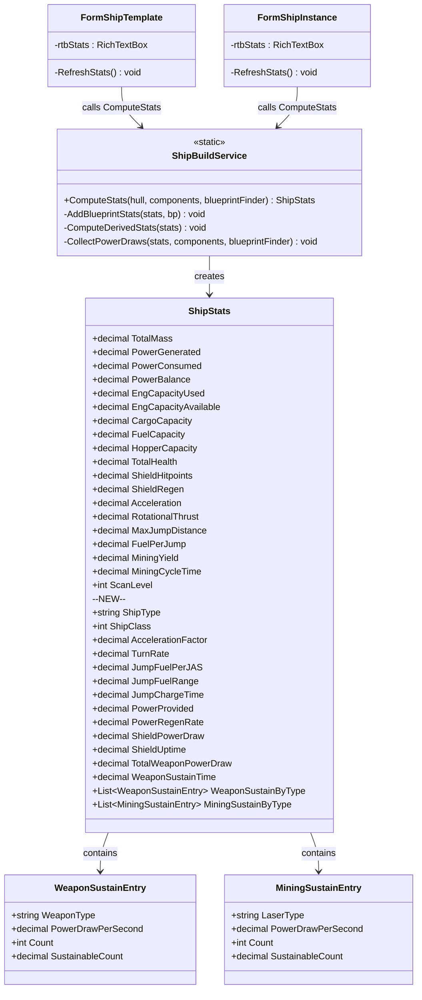

# Design Document: Ship Enhanced Stats

## Overview

This feature extends the existing `ShipBuildService.ComputeStats` method and `ShipStats` model to compute and display derived performance metrics that match the in-game ship info panel. The current implementation aggregates raw blueprint properties (mass, power, cargo, etc.) but does not compute the derived values players need to evaluate ship performance — acceleration factor, turn rate, jump fuel efficiency, and power sustainability.

The design adds:
- **Derived propulsion stats**: acceleration factor, turn rate (formulas dividing by total mass)
- **Jump efficiency stats**: fuel per JAS, jump fuel range (formulas involving mass and fuel capacity)
- **Power model expansion**: separating capacitor (Power Provided) from regeneration rate (Power Regeneration Rate)
- **Sustainability computations**: shield uptime, mining laser sustainability, weapon sustainability per type
- **Engineering capacity tracking**: used vs available
- **Enhanced display format**: organized into logical groups matching the in-game panel

All computation remains in the stateless `ShipBuildService` class. The `ShipStats` model gains new properties with zero defaults for backward compatibility.

## Architecture

The architecture follows the existing pattern — no new classes or layers are introduced:

1. **ShipBuildService.ComputeStats** (existing static method) is extended to compute new derived values after aggregating raw properties
2. **ShipStats** (existing model) gains new decimal properties for derived stats
3. **BlueprintPropertyKeys** (existing constants) gains new constant strings for properties not yet referenced
4. **FormShipTemplate / FormShipInstance** (existing forms) update their `RefreshStats` method to display the new stats in an organized format

### Data Flow

```
Hull Blueprint + Component Blueprints
        |
        v
ShipBuildService.ComputeStats()
  |-- Phase 1: Aggregate raw properties (existing)
  |     Sum: Mass, PowerProvided, PowerRegenRate, FuelCapacity, etc.
  |     Read: EngCapacityAvailable (hull only), JumpChargeTime (nav comp)
  |     Collect: per-component power draws by type (shields, weapons, lasers)
  |
  |-- Phase 2: Compute derived stats (NEW)
  |     AccelerationFactor = Acceleration / TotalMass
  |     TurnRate = RotationalThrust / TotalMass
  |     JumpFuelPerJAS = FuelPerJump * TotalMass
  |     JumpFuelRange = FuelCapacity / JumpFuelPerJAS
  |     ShieldUptime = PowerProvided / (ShieldDraw - PowerRegenRate)
  |     MiningSustainability = PowerRegenRate / LaserDraw
  |     WeaponSustainability = PowerRegenRate / WeaponTypeDraw
  |     WeaponSustainTime = PowerProvided / (TotalWeaponDraw - PowerRegenRate)
  |
  +-- Returns: ShipStats (fully populated)
        |
        v
FormShipTemplate.RefreshStats() / FormShipInstance.RefreshStats()
  +-- Formats ShipStats into grouped display in rtbStats
```



## Components and Interfaces

### BlueprintPropertyKeys (new constants)

New constants to add for properties not yet referenced:

```csharp
public const string EngCapacityRequired = "Eng Capacity Required";
public const string EngCapacityAvailable = "Eng Capacity Available";
public const string PowerProvided = "Power Provided";
public const string PowerRegenRate = "Power Regeneration Rate";
public const string PowerDrawPerSecond = "Power Draw Per Second";
public const string JumpChargeTime = "Jump Charge Time";
public const string FuelPerJASPerMass = "Fuel Used / JAS / Mass";
```

Note: The existing `PowerGenerated` and `PowerConsumed` constants map to the legacy "Power Generated" / "Power Consumed" properties. The new `PowerProvided` maps to the reactor's capacitor size, and `PowerRegenRate` maps to the reactor's continuous regeneration. These are distinct game properties.


### ShipStats Model (new properties)

All new properties default to zero (or empty) for backward compatibility:

| Property | Type | Description |
|----------|------|-------------|
| ShipType | string | Hull blueprint Name (identity) |
| ShipClass | int | Hull blueprint Class (identity) |
| AccelerationFactor | decimal | Acceleration / TotalMass |
| TurnRate | decimal | RotationalThrust / TotalMass (deg/s) |
| JumpFuelPerJAS | decimal | FuelPerJump x TotalMass |
| JumpFuelRange | decimal | FuelCapacity / JumpFuelPerJAS (JAS) |
| JumpChargeTime | decimal | Nav comp charge time (seconds) |
| PowerProvided | decimal | Reactor capacitor size (MW) |
| PowerRegenRate | decimal | Reactor regen rate (MW/s) |
| ShieldPowerDraw | decimal | Sum of shield Power Draw Per Second (MW/s) |
| ShieldUptime | decimal | Seconds until capacitor depleted; -1 = sustainable |
| TotalWeaponPowerDraw | decimal | Sum of all weapon Power Draw Per Second (MW/s) |
| WeaponSustainTime | decimal | Seconds of fire; -1 = sustainable |
| WeaponSustainByType | List of WeaponSustainEntry | Per-type weapon sustainability |
| MiningSustainByType | List of MiningSustainEntry | Per-type mining laser sustainability |

### WeaponSustainEntry / MiningSustainEntry

Small POCOs for per-type sustainability:

```csharp
public class WeaponSustainEntry
{
    public string WeaponType { get; set; } = string.Empty;
    public decimal PowerDrawPerSecond { get; set; }
    public int Count { get; set; }
    public decimal SustainableCount { get; set; }  // PowerRegenRate / PowerDrawPerSecond
}

public class MiningSustainEntry
{
    public string LaserType { get; set; } = string.Empty;
    public decimal PowerDrawPerSecond { get; set; }
    public int Count { get; set; }
    public decimal SustainableCount { get; set; }  // PowerRegenRate / PowerDrawPerSecond
}
```


### ShipBuildService.ComputeStats (extended logic)

The method is extended with two new phases after the existing aggregation loop:

**Phase 1 (existing, modified):** The `AddBlueprintStats` helper is extended to also accumulate:
- `EngCapacityRequired` from components -> `stats.EngCapacityUsed`
- `EngCapacityAvailable` from hull -> `stats.EngCapacityAvailable`
- `PowerProvided` from reactors -> `stats.PowerProvided`
- `PowerRegenRate` from reactors -> `stats.PowerRegenRate`
- `PowerDrawPerSecond` from shields/weapons/lasers -> collected into typed lists
- `JumpChargeTime` from nav comp -> `stats.JumpChargeTime`
- `FuelPerJASPerMass` from jump drive -> stored for Phase 2

**Phase 2 (new):** After the aggregation loop, compute derived values:

```csharp
// Propulsion
stats.AccelerationFactor = stats.TotalMass > 0
    ? stats.Acceleration / stats.TotalMass : 0m;
stats.TurnRate = stats.TotalMass > 0
    ? stats.RotationalThrust / stats.TotalMass : 0m;

// Jump
stats.JumpFuelPerJAS = fuelPerJASPerMass * stats.TotalMass;
stats.JumpFuelRange = stats.JumpFuelPerJAS > 0
    ? stats.FuelCapacity / stats.JumpFuelPerJAS : 0m;

// Shield sustainability
stats.ShieldUptime = stats.ShieldPowerDraw <= stats.PowerRegenRate
    ? -1m  // sustainable
    : stats.PowerProvided / (stats.ShieldPowerDraw - stats.PowerRegenRate);

// Weapon sustainability (aggregate)
stats.WeaponSustainTime = stats.TotalWeaponPowerDraw <= stats.PowerRegenRate
    ? -1m  // sustainable
    : stats.PowerProvided / (stats.TotalWeaponPowerDraw - stats.PowerRegenRate);

// Per-type sustainability
foreach (var entry in stats.WeaponSustainByType)
    entry.SustainableCount = entry.PowerDrawPerSecond > 0
        ? stats.PowerRegenRate / entry.PowerDrawPerSecond : 0m;

foreach (var entry in stats.MiningSustainByType)
    entry.SustainableCount = entry.PowerDrawPerSecond > 0
        ? stats.PowerRegenRate / entry.PowerDrawPerSecond : 0m;
```

### Component Type Detection

To collect power draws by type (shields vs weapons vs mining lasers), the service identifies component types via `ReadOnlyBlueprint.BluePrintType`. The service uses `BlueprintTypes` constants to classify:

- Shield: `BluePrintType == "Shield"`
- Weapon: `BluePrintType` in {"Beamer", "Coilgun", "Railgun", "Missile Launcher", "Torpedo Launcher"}
- Mining Laser: `BluePrintType == "Mining Laser"`
- Nav Comp: `BluePrintType == "Nav Comp"`
- Jump Drive: `BluePrintType == "Jump Drive"`
- Reactor: `BluePrintType == "Reactor"`

The weapon type name for `WeaponSustainEntry.WeaponType` is taken directly from `BluePrintType`.


### Stats Display Format

The `RefreshStats` method in both forms formats stats into logical groups:

```
[Ship Type] - Class [N]
Engineering: [used] / [available]
--- Capacity ---
  Cargo: [X]  |  Fuel: [X]  |  Hopper: [X]
--- Defence ---
  Health: [X]  |  Shield: [X] HP (Regen: [X]/s)
  Energy: [X]  |  Kinetic: [X]  |  Missile: [X]
--- Propulsion ---
  Accel Factor: [X.XX]  (Raw: [X])
  Turn Rate: [X.XX] deg/s  (Raw: [X])
--- Jump ---
  Range: [X.XX] JAS  |  Single Hop: [X] JAS  |  Fuel/JAS: [X.XX]
  Charge Time: [X.XX]s
--- Power ---
  Capacitor: [X] MW  |  Regen: [X.XX] MW/s
  Shield Draw: [X.XX] MW/s -> [Sustainable | X.XXs uptime]
--- Mining ---
  Yield: [X]  |  Cycle: [X]s
  [LaserType]: [N] installed, [X.XX] sustainable
--- Weapons ---
  [WeaponType]: [N] installed, [X.XX] sustainable
  Total Draw: [X.XX] MW/s -> [Sustainable | X.XXs sustain]
--- Scanning ---
  Scan Level: [X]
```

When engineering capacity is over-budget (used > available), the engineering line is prefixed with a warning indicator.

When no mining lasers are installed, the Mining sustainability lines are omitted.
When no weapons are installed, the Weapons sustainability lines are omitted.

## Data Models

### Updated ShipStats Class

See the "ShipStats Model (new properties)" table above. The class gains 15 new properties plus two list properties. All numeric properties default to zero. List properties default to empty lists. String properties default to `string.Empty`.

### WeaponSustainEntry and MiningSustainEntry

New POCO classes in the Models namespace. These are simple data carriers with no behavior. They live in their own files:
- `OE2EmpireTracker.Common/Models/WeaponSustainEntry.cs`
- `OE2EmpireTracker.Common/Models/MiningSustainEntry.cs`

### BlueprintPropertyKeys Updates

Seven new string constants added to the existing static class. No structural changes.


## Correctness Properties

*A property is a characteristic or behavior that should hold true across all valid executions of a system - essentially, a formal statement about what the system should do. Properties serve as the bridge between human-readable specifications and machine-verifiable correctness guarantees.*

### Property 1: Additive stats are sums of component values

*For any* hull blueprint and set of component blueprints, the computed TotalMass SHALL equal the sum of all individual Mass property values, EngCapacityUsed SHALL equal the sum of all component EngCapacityRequired values, PowerProvided SHALL equal the sum of all reactor PowerProvided values, PowerRegenRate SHALL equal the sum of all reactor PowerRegenRate values, ShieldPowerDraw SHALL equal the sum of all shield PowerDrawPerSecond values, and TotalWeaponPowerDraw SHALL equal the sum of all weapon PowerDrawPerSecond values.

**Validates: Requirements 2.1, 7.1, 7.2, 9.1, 12.1, 14.3**

### Property 2: Acceleration factor formula

*For any* hull and component set where TotalMass > 0 and Acceleration > 0, the computed AccelerationFactor SHALL equal Acceleration / TotalMass. When Acceleration is zero, AccelerationFactor SHALL be zero regardless of TotalMass.

**Validates: Requirements 3.1, 3.2, 9.2**

### Property 3: Turn rate formula

*For any* hull and component set where TotalMass > 0 and RotationalThrust > 0, the computed TurnRate SHALL equal RotationalThrust / TotalMass. When RotationalThrust is zero, TurnRate SHALL be zero regardless of TotalMass.

**Validates: Requirements 4.1, 4.2, 9.3**

### Property 4: Jump fuel per JAS formula

*For any* hull and component set with a jump drive having FuelPerJump > 0 and TotalMass > 0, the computed JumpFuelPerJAS SHALL equal FuelPerJump multiplied by TotalMass. When no jump drive is installed (FuelPerJump = 0), JumpFuelPerJAS SHALL be zero.

**Validates: Requirements 5.1, 5.3**

### Property 5: Jump fuel range formula

*For any* hull and component set where JumpFuelPerJAS > 0 and FuelCapacity > 0, the computed JumpFuelRange SHALL equal FuelCapacity / JumpFuelPerJAS. When JumpFuelPerJAS is zero or FuelCapacity is zero, JumpFuelRange SHALL be zero.

**Validates: Requirements 5.2, 5.3, 9.4**

### Property 6: Shield uptime formula

*For any* hull and component set with shields installed: when PowerRegenRate >= ShieldPowerDraw, ShieldUptime SHALL be -1 (sustainable indefinitely). When PowerRegenRate < ShieldPowerDraw and PowerProvided > 0, ShieldUptime SHALL equal PowerProvided / (ShieldPowerDraw - PowerRegenRate).

**Validates: Requirements 12.2, 12.3, 7.5**

### Property 7: Mining sustainability formula

*For any* hull and component set with mining lasers installed where PowerDrawPerSecond > 0, the SustainableCount for each laser type SHALL equal PowerRegenRate / that type's PowerDrawPerSecond.

**Validates: Requirements 13.2, 13.3**

### Property 8: Weapon sustainability formula

*For any* hull and component set with weapons installed: the per-type SustainableCount SHALL equal PowerRegenRate / that type's PowerDrawPerSecond. The aggregate WeaponSustainTime SHALL be -1 when PowerRegenRate >= TotalWeaponPowerDraw, or PowerProvided / (TotalWeaponPowerDraw - PowerRegenRate) when PowerRegenRate < TotalWeaponPowerDraw.

**Validates: Requirements 14.2, 14.4, 14.5**


## Error Handling

### Division by Zero

All derived formulas that divide by a value guard against zero denominators:
- `AccelerationFactor`: returns 0 when `TotalMass == 0` (impossible in practice - hull always has mass)
- `TurnRate`: returns 0 when `TotalMass == 0`
- `JumpFuelRange`: returns 0 when `JumpFuelPerJAS == 0`
- `ShieldUptime`: only divides when `ShieldPowerDraw > PowerRegenRate`; the denominator is always positive in that branch
- `WeaponSustainTime`: same pattern as shield uptime
- `SustainableCount`: returns 0 when `PowerDrawPerSecond == 0`

### Missing Components

When a ship has no drive, thruster, jump drive, nav comp, reactor, shield, weapon, or mining laser:
- The corresponding raw properties remain at their zero defaults
- Derived stats that depend on those properties compute to zero
- Sustainability lists (`WeaponSustainByType`, `MiningSustainByType`) remain empty
- The display omits sections for empty sustainability lists

### Null Blueprint References

The existing pattern handles null blueprints gracefully:
- `blueprintFinder` may return null for a UUID (component not in player data)
- `AddBlueprintStats` checks `bp?.Properties == null` and skips
- The new per-component collection logic follows the same null-check pattern

### Backward Compatibility

- All new `ShipStats` properties have zero/empty defaults
- Existing consumers that only read the original properties are unaffected
- The `ComputeStats` method signature is unchanged
- No new parameters or overloads required

## Testing Strategy

### Property-Based Tests (FsCheck 2.16.6 + NUnit)

The project already uses FsCheck 2.16.6 with FsCheck.NUnit. Property tests will:
- Use `[FsCheck.NUnit.Property(MaxTest = 100)]` attribute
- Generate random hull + component configurations using custom generators
- Verify each correctness property (Properties 1-8) holds across all generated inputs
- Use LINQ query syntax for generators (`from mass in Gen.Choose(1, 10000)`)

**Test file:** `OE2EmpireTracker.Tests/Services/ShipStatsPropertyTests.cs`

**Generator strategy:**
- Generate a hull blueprint with random Mass, EngCapacityAvailable, FuelCapacity
- Generate 0-8 component blueprints with random types (drive, thruster, reactor, shield, weapon, mining laser, nav comp, jump drive)
- Each component has random Mass, and type-specific properties (Acceleration for drives, RotationalThrust for thrusters, PowerProvided/PowerRegenRate for reactors, PowerDrawPerSecond for shields/weapons/lasers, etc.)
- Call `ShipBuildService.ComputeStats` with the generated data
- Assert the correctness property

**Tag format:** Each test method includes a comment:
```csharp
// Feature: ship-enhanced-stats, Property N: [property text]
```

**Minimum 100 iterations per property test.**

### Unit Tests (NUnit)

Example-based tests for specific scenarios:

1. **Zero-component build**: hull only -> all derived stats are zero except mass
2. **Full combat build**: hull + reactor + shields + weapons -> verify sustainability values
3. **Mining build**: hull + reactor + mining lasers -> verify mining sustainability
4. **Jump build**: hull + reactor + jump drive + nav comp + fuel tank -> verify jump range
5. **Over-budget engineering**: components exceed hull eng capacity -> verify EngCapacityUsed > EngCapacityAvailable
6. **Sustainable shields**: high regen reactor + low-draw shield -> ShieldUptime == -1
7. **Unsustainable weapons**: low regen + many weapons -> WeaponSustainTime > 0

**Test file:** `OE2EmpireTracker.Tests/Services/ShipStatsUnitTests.cs`

### Integration Verification

- Both `FormShipTemplate` and `FormShipInstance` call `ComputeStats` and display results
- Verified by existing form test patterns (compile-time + manual testing)
- The `RefreshStats` method is called on every component add/remove/change
